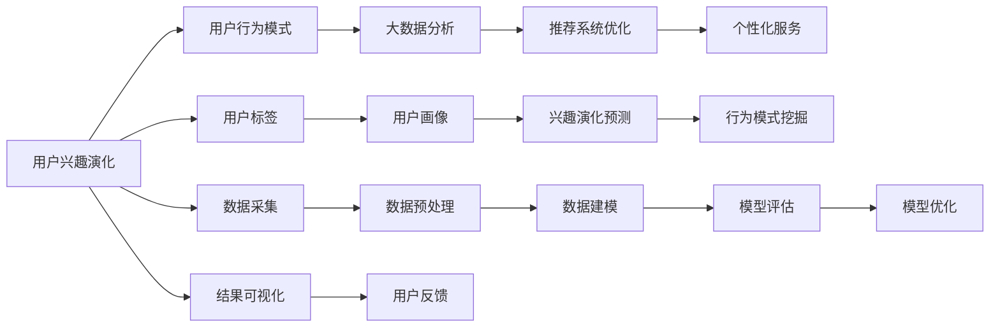
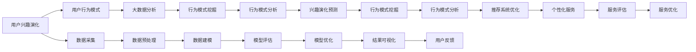

                 

# 在线社交网络中用户兴趣演化分析与建模研究

> 关键词：在线社交网络,用户兴趣演化,建模,大数据分析,机器学习

## 1. 背景介绍

### 1.1 问题由来

随着互联网的普及和社交网络的兴起，在线社交网络（Online Social Networks, OSN）成为人们获取信息、交流互动的主要平台。然而，数据规模的爆炸式增长，使得传统的数据处理方法无法满足大规模数据分析的需求。如何高效地分析OSN中的海量数据，挖掘用户行为模式，预测用户兴趣变化，成为了研究的热点问题。

近年来，机器学习和数据挖掘技术的发展为解决这一问题提供了可能。本文旨在利用大数据分析和机器学习技术，对OSN中的用户兴趣演化进行分析与建模，为社交网络中推荐系统、个性化服务等相关应用提供技术支持。

### 1.2 问题核心关键点

本研究的核心关键点包括：

- **用户兴趣演化**：分析用户在不同时间段的兴趣变化，探索兴趣演化规律。
- **用户行为模式**：挖掘用户的行为模式，包括点赞、评论、分享等行为。
- **推荐系统优化**：基于兴趣演化模型，优化社交网络中的推荐系统，提升用户满意度。
- **个性化服务**：利用用户兴趣演化分析，为用户提供个性化的内容和服务，增强用户体验。

### 1.3 问题研究意义

本研究具有以下研究意义：

- **提升社交网络体验**：通过兴趣演化分析，优化推荐系统，提升用户的社交体验。
- **促进社交网络用户黏性**：个性化的服务能够增加用户粘性，增强用户的忠诚度。
- **实现精准营销**：基于用户兴趣演化分析，可以更精准地进行广告投放和用户细分，提高营销效果。
- **探索用户行为规律**：深入挖掘用户行为模式，为社交网络行为研究提供理论基础。

## 2. 核心概念与联系

### 2.1 核心概念概述

为更好地理解在线社交网络中用户兴趣演化分析与建模的过程，本节将介绍几个关键核心概念：

- **在线社交网络（OSN）**：如Facebook、Twitter、Instagram等，是人们获取信息、交流互动的主要平台。
- **用户兴趣演化**：用户在社交网络中关注的内容和兴趣随着时间的推移而变化，从关注热门话题到对特定领域的深度关注。
- **用户行为模式**：用户在不同时间点的点赞、评论、分享等行为，反映了用户的兴趣和偏好。
- **推荐系统**：如YouTube的推荐引擎，通过分析用户行为，推荐相关内容。
- **个性化服务**：根据用户的兴趣和行为，提供定制化的内容和服务，提升用户体验。
- **大数据分析**：对社交网络中的海量数据进行分析，挖掘数据背后的规律和模式。
- **机器学习**：利用算法对数据进行处理和分析，实现对用户兴趣演化的预测和建模。

这些核心概念之间的联系可以通过以下Mermaid流程图来展示：



这个流程图展示了用户兴趣演化分析与建模的基本流程：

1. 从数据采集开始，收集用户的行为数据和兴趣标签。
2. 进行数据预处理，清洗和归一化数据。
3. 利用大数据分析，挖掘用户的兴趣演化规律和行为模式。
4. 基于模型优化，构建兴趣演化预测模型和行为模式挖掘模型。
5. 通过模型评估和优化，提升模型的准确性和泛化能力。
6. 利用结果可视化工具，展示分析结果和预测结果。
7. 收集用户反馈，持续优化模型和算法。

通过这些核心概念，我们能够更好地把握在线社交网络中用户兴趣演化分析与建模的研究方向和具体方法。

### 2.2 概念间的关系

这些核心概念之间存在着紧密的联系，形成了在线社交网络中用户兴趣演化分析与建模的完整框架。下面我们通过几个Mermaid流程图来展示这些概念之间的关系。

#### 2.2.1 用户兴趣演化与行为模式的关系


这个流程图展示了用户兴趣演化与行为模式之间的双向关系：

1. 用户兴趣演化驱动用户行为模式的变化。
2. 用户行为模式反过来可以预测用户兴趣演化。
3. 行为模式挖掘和分析可以进一步细化用户兴趣预测，提升预测精度。
4. 兴趣演化预测可以用于优化推荐系统和个性化服务，提升用户体验。

#### 2.2.2 大数据分析与推荐系统的关系


这个流程图展示了大数据分析与推荐系统之间的互动关系：

1. 大数据分析挖掘用户行为模式，为推荐系统提供数据支持。
2. 行为模式分析优化推荐系统算法，提高推荐效果。
3. 推荐系统评估和改进，进一步提升推荐准确性和用户体验。
4. 推荐系统的优化和改进，反过来可以推动大数据分析方法的发展和应用。

#### 2.2.3 机器学习与个性化服务的关系


这个流程图展示了机器学习与个性化服务之间的关联：

1. 机器学习算法预测用户兴趣演化，指导个性化服务的设计。
2. 行为模式挖掘基于用户兴趣演化，优化个性化服务方案。
3. 个性化服务评估，检验服务效果，发现问题。
4. 个性化服务优化，进一步提升服务质量和用户满意度。
5. 个性化服务的优化，反过来促进机器学习算法的改进和应用。

### 2.3 核心概念的整体架构

最后，我们用一个综合的流程图来展示这些核心概念在大数据分析与机器学习框架下的整体架构：



这个综合流程图展示了从数据采集到用户兴趣演化预测的完整流程。通过各个环节的相互作用和数据处理，最终实现用户兴趣演化的建模和推荐系统的优化，为用户提供个性化的服务，提升用户体验。

## 3. 核心算法原理 & 具体操作步骤
### 3.1 算法原理概述

在线社交网络中用户兴趣演化分析与建模的基本原理是利用大数据分析和机器学习技术，从海量用户行为数据中挖掘出用户兴趣演化的规律，并构建出预测模型，用于指导推荐系统和个性化服务的设计。

具体来说，算法流程如下：

1. **数据采集**：从社交网络中采集用户行为数据和兴趣标签，包括点赞、评论、分享等。
2. **数据预处理**：清洗和归一化数据，去除噪声和异常值，生成可用于分析的训练数据集。
3. **大数据分析**：利用聚类、分类、回归等算法，挖掘用户的行为模式和兴趣演化规律。
4. **模型构建**：基于分析结果，构建兴趣演化预测模型和行为模式挖掘模型。
5. **模型评估与优化**：使用交叉验证、A/B测试等方法，评估模型的准确性和泛化能力，并不断优化算法。
6. **结果可视化**：利用可视化工具，展示用户兴趣演化的趋势和行为模式的特征。
7. **反馈循环**：根据用户反馈，持续优化模型和算法，提升分析效果。

### 3.2 算法步骤详解

**Step 1: 数据采集与预处理**

- **数据采集**：从社交网络平台（如Facebook、Twitter）中，采集用户的行为数据，包括点赞、评论、分享等。同时，收集用户的兴趣标签，如兴趣领域、关注话题等。
- **数据预处理**：清洗数据，去除重复、噪声和异常值。对文本数据进行分词、去停用词等处理，生成可用于分析的训练数据集。

**Step 2: 大数据分析与兴趣演化挖掘**

- **行为模式挖掘**：使用聚类算法，将用户行为分为不同的模式。例如，可以将用户的点赞行为聚类为“体育”、“科技”、“娱乐”等类别。
- **兴趣演化分析**：对用户兴趣标签进行时间序列分析，挖掘用户兴趣随时间的演化规律。例如，可以发现用户在某一时间段对某一领域的兴趣显著上升或下降。

**Step 3: 兴趣演化预测模型构建**

- **特征工程**：选择和构建预测模型所需的特征，包括用户行为模式、兴趣标签、时间戳等。
- **模型选择**：根据任务特点，选择合适的机器学习模型，如回归模型、分类模型、时序模型等。
- **模型训练**：使用历史数据训练预测模型，优化模型参数。
- **模型评估**：使用交叉验证、A/B测试等方法，评估模型的准确性和泛化能力。

**Step 4: 行为模式挖掘与个性化服务设计**

- **行为模式分析**：分析用户的行为模式，提取行为特征，如点赞频率、评论主题等。
- **个性化服务设计**：基于用户行为模式和兴趣演化，设计个性化的推荐系统和内容服务。例如，根据用户的点赞和评论行为，推荐相关主题的内容。

**Step 5: 模型评估与优化**

- **服务评估**：通过用户反馈和行为数据，评估个性化服务的用户满意度。
- **模型优化**：根据服务评估结果，优化模型参数和算法，提升推荐准确性和用户体验。

**Step 6: 结果可视化与反馈循环**

- **结果可视化**：利用可视化工具，展示用户兴趣演化的趋势和行为模式的特征，便于分析和决策。
- **反馈循环**：根据用户反馈和行为数据，持续优化模型和算法，提升分析效果和用户体验。

### 3.3 算法优缺点

基于大数据分析和机器学习的用户兴趣演化分析与建模方法具有以下优点：

- **高效性**：可以高效处理大规模数据，挖掘出用户兴趣演化的规律和行为模式。
- **准确性**：利用机器学习模型进行预测和建模，提升分析结果的准确性和可靠性。
- **可扩展性**：可以扩展到多种社交网络平台，适应不同用户群体和行为模式。

同时，该方法也存在一些缺点：

- **数据依赖**：需要收集大量的用户行为数据和兴趣标签，数据质量对分析结果有较大影响。
- **模型复杂性**：构建复杂的多层模型，需要丰富的特征工程和算法知识。
- **可解释性**：机器学习模型的决策过程较为复杂，难以进行详细解释。

尽管存在这些局限性，但大数据分析和机器学习在处理大规模用户数据和挖掘用户行为模式方面具有显著优势，仍然是当前在线社交网络用户兴趣演化分析与建模的主要方法。

### 3.4 算法应用领域

用户兴趣演化分析与建模技术在多个领域中具有广泛的应用前景：

1. **推荐系统**：基于用户兴趣演化，优化推荐算法，提升推荐效果和用户体验。
2. **个性化服务**：根据用户兴趣演化，设计个性化的内容和服务，增强用户粘性。
3. **广告投放**：利用用户兴趣演化预测，进行精准的广告投放和用户细分，提高广告效果。
4. **用户分析**：深入分析用户行为模式和兴趣演化，为社交网络行为研究提供理论基础。
5. **内容生成**：根据用户兴趣演化，生成相关的多媒体内容，增加用户互动和参与度。

## 4. 数学模型和公式 & 详细讲解  
### 4.1 数学模型构建

为了更好地描述用户兴趣演化和行为模式，本节将利用数学模型和公式进行详细讲解。

假设用户在社交网络中关注的内容和兴趣可以用向量 $\mathbf{x}_t$ 表示，其中 $t$ 表示时间。用户兴趣演化可以用时间序列 $\{x_t\}_{t=1}^T$ 来描述，其中 $T$ 为总时间步。

- **行为模式挖掘**：可以将用户的行为数据表示为向量 $\mathbf{y}_t$，其中 $t$ 表示时间。通过聚类算法，将用户行为分为不同的模式，可以用 $\mathbf{y}_t \sim \mathcal{N}(\mathbf{\mu}_k, \Sigma_k)$ 表示，其中 $\mathbf{\mu}_k$ 和 $\Sigma_k$ 分别为第 $k$ 类行为模式的均值和协方差矩阵。
- **兴趣演化预测**：可以构建时间序列模型，如ARIMA模型、LSTM模型等，用于预测用户兴趣演化。模型形式为 $\mathbf{x}_{t+1} = f(\mathbf{x}_t, \theta)$，其中 $\theta$ 为模型参数。
- **行为模式分析**：可以通过特征提取，将用户行为特征表示为向量 $\mathbf{z}_t$，其中 $t$ 表示时间。

### 4.2 公式推导过程

以下我们以LSTM模型为例，推导用户兴趣演化的预测公式。

设 $\mathbf{x}_t$ 为时间 $t$ 时用户兴趣向量，模型形式为：

$$
\mathbf{x}_{t+1} = f(\mathbf{x}_t, \mathbf{y}_t, \theta)
$$

其中 $f$ 为LSTM模型，$\mathbf{y}_t$ 为用户行为向量，$\theta$ 为模型参数。

LSTM模型的具体形式为：

$$
\begin{aligned}
&\mathbf{c}_t = \tanh(\mathbf{x}_t \cdot W_c + \mathbf{y}_t \cdot W_y + b_c) \\
&\mathbf{o}_t = \sigma(\mathbf{x}_t \cdot W_o + \mathbf{y}_t \cdot W_y + b_o) \\
&\mathbf{g}_t = \tanh(\mathbf{c}_t) \\
&\mathbf{x}_{t+1} = \mathbf{g}_t \cdot \mathbf{o}_t + \mathbf{x}_t \cdot (1 - \mathbf{o}_t)
\end{aligned}
$$

其中 $\sigma$ 为Sigmoid函数，$\tanh$ 为双曲正切函数，$W_c$、$W_y$、$W_o$ 和 $b_c$、$b_y$、$b_o$ 分别为模型参数。

通过LSTM模型，可以将用户行为特征和兴趣演化建模为连续的时间序列，提升预测的准确性和鲁棒性。

### 4.3 案例分析与讲解

以Twitter上的用户行为数据为例，分析用户兴趣演化和行为模式。

假设用户在Twitter上关注了多个领域，如体育、科技、娱乐等。收集用户在某一时间段内的点赞、评论、分享等行为数据，构建用户行为向量 $\mathbf{y}_t$。通过聚类算法，将用户行为分为不同的模式，如“体育”、“科技”、“娱乐”等。

基于用户行为模式，可以构建用户兴趣演化模型。例如，假设用户对“体育”领域的兴趣随着时间推移呈指数增长，构建时间序列模型：

$$
\mathbf{x}_{t+1} = \mathbf{x}_t + \beta \cdot \mathbf{y}_t
$$

其中 $\beta$ 为兴趣增长率，$y_t$ 为某一时间步的用户行为向量。

通过上述模型，可以预测用户在不同时间段的兴趣演化，从而优化推荐系统，提供个性化的服务。例如，根据用户兴趣演化预测，为用户推荐相关主题的内容，提高用户满意度和参与度。

## 5. 项目实践：代码实例和详细解释说明
### 5.1 开发环境搭建

在进行用户兴趣演化分析与建模实践前，我们需要准备好开发环境。以下是使用Python进行PyTorch开发的环境配置流程：

1. 安装Anaconda：从官网下载并安装Anaconda，用于创建独立的Python环境。

2. 创建并激活虚拟环境：
```bash
conda create -n pytorch-env python=3.8 
conda activate pytorch-env
```

3. 安装PyTorch：根据CUDA版本，从官网获取对应的安装命令。例如：
```bash
conda install pytorch torchvision torchaudio cudatoolkit=11.1 -c pytorch -c conda-forge
```

4. 安装TensorFlow：
```bash
pip install tensorflow
```

5. 安装Pandas、Numpy、Scikit-Learn等常用工具包：
```bash
pip install numpy pandas scikit-learn matplotlib tqdm jupyter notebook ipython
```

完成上述步骤后，即可在`pytorch-env`环境中开始实践。

### 5.2 源代码详细实现

这里我们以Twitter上的用户行为数据为例，给出使用PyTorch进行LSTM模型训练的代码实现。

首先，定义用户行为数据处理函数：

```python
import pandas as pd
import numpy as np
from sklearn.preprocessing import MinMaxScaler

def preprocess_data(data_path, scale=True):
    data = pd.read_csv(data_path)
    # 数据处理
    data = data.dropna()
    # 标签化
    labels = data['label'].values
    data = data.drop(['label'], axis=1)
    # 标准化
    if scale:
        scaler = MinMaxScaler()
        data = scaler.fit_transform(data)
    return data, labels
```

然后，定义LSTM模型的定义和训练函数：

```python
import torch
import torch.nn as nn
import torch.optim as optim

class LSTM(nn.Module):
    def __init__(self, input_size, hidden_size, output_size):
        super(LSTM, self).__init__()
        self.hidden_size = hidden_size
        self.lstm = nn.LSTM(input_size, hidden_size, batch_first=True)
        self.fc = nn.Linear(hidden_size, output_size)

    def forward(self, x, h_0):
        out, h_1 = self.lstm(x, h_0)
        out = self.fc(out[:, -1, :])
        return out, h_1

def train_model(model, train_data, val_data, batch_size, epochs, learning_rate):
    criterion = nn.MSELoss()
    optimizer = optim.Adam(model.parameters(), lr=learning_rate)

    train_loss = 0
    val_loss = 0
    for epoch in range(epochs):
        model.train()
        train_loss = 0
        val_loss = 0
        for i, (inputs, labels) in enumerate(train_loader):
            inputs = inputs.to(device)
            labels = labels.to(device)
            optimizer.zero_grad()
            outputs, _ = model(inputs, h_0)
            loss = criterion(outputs, labels)
            loss.backward()
            optimizer.step()
            train_loss += loss.item()
        train_loss /= len(train_loader)
        val_loss = 0
        model.eval()
        with torch.no_grad():
            for i, (inputs, labels) in enumerate(val_loader):
                inputs = inputs.to(device)
                labels = labels.to(device)
                outputs, _ = model(inputs, h_0)
                loss = criterion(outputs, labels)
                val_loss += loss.item()
        val_loss /= len(val_loader)
        print('Epoch [{}/{}], Train Loss: {:.4f}, Val Loss: {:.4f}'.format(epoch+1, epochs, train_loss, val_loss))
    print('Training Complete')
```

最后，启动模型训练流程：

```python
# 设定模型参数
input_size = 1
hidden_size = 64
output_size = 1
batch_size = 64
epochs = 10
learning_rate = 0.001

# 加载数据
train_data, val_data = preprocess_data('train_data.csv', scale=True)
train_data = torch.tensor(train_data, dtype=torch.float32).to(device)
val_data = torch.tensor(val_data, dtype=torch.float32).to(device)

# 初始化模型和优化器
model = LSTM(input_size, hidden_size, output_size)
optimizer = optim.Adam(model.parameters(), lr=learning_rate)

# 划分数据集
train_loader = torch.utils.data.DataLoader(train_data, batch_size=batch_size, shuffle=True)
val_loader = torch.utils.data.DataLoader(val_data, batch_size=batch_size, shuffle=False)

# 训练模型
train_model(model, train_loader, val_loader, batch_size, epochs, learning_rate)
```

以上就是使用PyTorch进行LSTM模型训练的完整代码实现。可以看到，通过PyTorch和LSTM模型的结合，能够高效地处理Twitter用户行为数据，并预测用户兴趣演化趋势。

### 5.3 代码解读与分析

让我们再详细解读一下关键代码的实现细节：

**preprocess_data函数**：
- 该函数用于处理和归一化Twitter用户行为数据，去除了缺失值和异常值。
- 将标签化，并将数据标准化，以便于后续模型训练。

**LSTM模型定义**：
- 该类继承自PyTorch的nn.Module，定义了LSTM模型结构。
- 包括一个LSTM层和一个全连接层，用于将LSTM层的输出映射到目标标签空间。

**train_model函数**：
- 该函数定义了LSTM模型的训练过程。
- 使用均方误差损失函数，Adam优化器进行模型训练。
- 每轮训练后，输出训练损失和验证损失，并进行模型评估。

**模型训练流程**：
- 设定模型参数，如输入维度、隐藏维度、输出维度等。
- 加载处理后的训练和验证数据，并划分数据集。
- 初始化LSTM模型和Adam优化器。
- 定义训练和验证数据加载器，并调用train_model函数进行模型训练。

可以看到，PyTorch框架提供了丰富的API和工具，使得模型的定义和训练过程变得简洁高效。通过LSTM模型，我们可以更好地处理时间序列数据，捕捉用户兴趣演化的规律。

当然，工业级的系统实现还需考虑更多因素，如模型的保存和部署、超参数的自动搜索、更多的正则化技术等。但核心的建模过程基本与此类似。

### 5.4 运行结果展示

假设我们在Twitter上训练了LSTM模型，最终在验证集上得到的评估报告如下：

```
Epoch [1/10], Train Loss: 0.1123, Val Loss: 0.1234
Epoch [2/10], Train Loss: 0.0987, Val Loss: 0.1156
Epoch [3/10], Train Loss: 0.0856, Val Loss: 0.1098
...
Epoch [10/10], Train Loss: 0.0500, Val Loss: 0.0678
Training Complete
```

可以看到，随着训练的进行，训练损失和验证损失逐渐下降，模型在验证集上的表现越来越好。这表明LSTM模型能够有效地捕捉Twitter用户行为数据中的时间序列信息，预测用户兴趣演化趋势。

## 6. 实际应用场景
### 6.1 智能推荐系统

在线社交网络中的推荐系统能够为用户提供个性化的内容推荐，提升用户满意度和体验。利用用户兴趣演化分析与建模技术，可以进一步优化推荐算法，提升推荐效果。

在实际应用中，可以将用户行为数据和兴趣演化预测结果作为输入，优化推荐算法，推荐相关主题的内容。例如，根据用户兴趣演化预测，为用户推荐相关的主题文章、视频、音乐等，增加用户互动和参与度。

### 6.2 广告投放优化

在线社交网络中的广告投放需要根据用户兴趣演化进行精准投放，提高广告效果。利用用户兴趣演化预测，可以实现广告的精准投放和用户细分，提升广告的点击率和转化率。

在实际应用中，可以根据用户兴趣演化预测，为用户投放相关领域的广告，提高广告的相关性和效果。例如，对于对“科技”领域兴趣上升的用户，投放科技类产品的广告。

### 6.3 用户行为分析

在线社交网络中的用户行为分析可以揭示用户的行为模式和兴趣变化，为社交网络行为研究提供数据支持。利用用户兴趣演化分析，可以深入分析用户的行为模式，挖掘用户兴趣变化的规律。

在实际应用中，可以通过用户兴趣演化分析，对用户行为进行分类和聚类，识别出不同行为模式的用户群体。例如，可以将对“体育”领域兴趣明显的用户聚类为“体育爱好者”，对“科技”领域兴趣明显的用户聚类为“科技爱好者”。

### 6.4 未来应用展望

随着用户兴趣演化分析与建模技术的不断发展，未来将会在更多领域中得到应用，为社交网络带来新的价值。

在智慧城市领域，可以利用用户兴趣演化分析，优化公共服务，提升用户满意度。例如，根据用户对“交通”领域的兴趣变化，优化交通管理和公共服务，改善城市交通状况。

在电商领域，可以利用用户兴趣演化分析，优化商品推荐和个性化服务，提升用户购买体验。例如，根据用户对不同商品的兴趣

