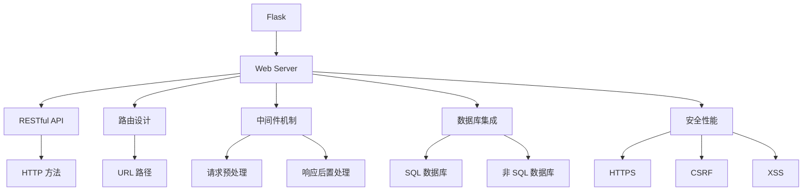
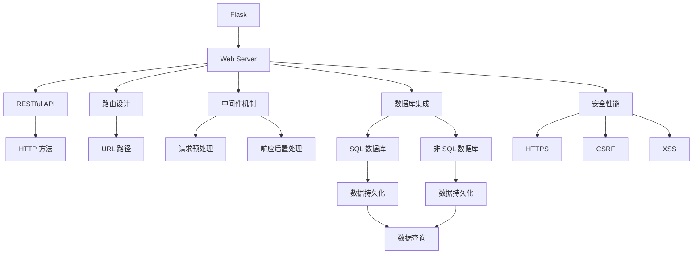

                 

# 基于 Flask 的 Web Server 设计与实现

> 关键词：Flask, Web Server, RESTful API, 路由设计, 中间件机制, 数据库集成, 安全性能, 性能优化, Web 框架

## 1. 背景介绍

### 1.1 问题由来

在当前的互联网应用中，Web 服务器的设计和实现是一个核心议题。传统 Web 服务器如 Apache、Nginx 等虽然在性能和稳定性上表现优异，但扩展性和灵活性相对较差，特别是在微服务架构下，难以满足快速迭代的需要。

随着 Python 语言在 Web 开发领域的普及，越来越多的开发者开始使用 Python 的 Web 框架进行 Web 应用开发。其中，Flask 作为一个轻量级、易学易用的 Python Web 框架，在开发微服务架构的 Web 应用时表现尤为突出。

本文章将详细介绍基于 Flask 的 Web Server 的设计和实现，从原理到具体实现步骤，结合实例代码进行讲解，以帮助开发者更好地掌握 Flask 的使用技巧，提高 Web 应用开发效率。

### 1.2 问题核心关键点

本文章聚焦于 Flask 框架下的 Web Server 设计和实现，具体包括以下几个关键点：

- Flask 框架的总体架构设计。
- Flask 路由和中间件机制的工作原理。
- 数据库集成和 RESTful API 设计。
- 安全性能优化和性能优化技巧。

## 2. 核心概念与联系

### 2.1 核心概念概述

- Flask：Python 编写的轻量级 Web 框架，具有易学易用、扩展性强等特点。
- Web Server：负责处理 Web 请求和响应的服务器，如 Flask 内部的 Werkzeug 组件。
- RESTful API：一种设计风格，强调使用 HTTP 方法（GET、POST、PUT、DELETE）进行操作，支持无状态分布式系统。
- 路由设计：Flask 的路由机制允许根据 URL 路径和 HTTP 方法映射到相应的函数或类方法。
- 中间件机制：Flask 的中间件机制支持对请求和响应进行预处理和后置处理。
- 数据库集成：Flask 支持多种数据库系统，包括 SQL 数据库（如 MySQL、PostgreSQL）和非 SQL 数据库（如 MongoDB）。
- 安全性能：包括 HTTPS、CSRF、XSS 等安全防护机制，以及性能优化技巧（如缓存、负载均衡）。

这些核心概念之间存在紧密的联系，共同构成了 Flask 框架下的 Web Server 实现基础。

### 2.2 概念间的关系

这些核心概念之间的逻辑关系可以通过以下 Mermaid 流程图来展示：



这个流程图展示了这个核心概念框架下的 Flask Web Server 设计实现过程：

- Flask 作为核心框架，封装了 Web Server、RESTful API、路由设计、中间件机制、数据库集成、安全性能等功能模块。
- RESTful API 设计强调使用 HTTP 方法进行数据操作，与路由设计紧密关联。
- 路由设计根据 URL 路径和 HTTP 方法映射到相应的函数或类方法。
- 中间件机制支持对请求和响应进行预处理和后置处理。
- 数据库集成支持 SQL 和非 SQL 数据库，提供数据持久化功能。
- 安全性能包括 HTTPS、CSRF、XSS 等安全防护机制。

这些概念共同构成了 Flask 框架下的 Web Server 实现基础。通过理解这些核心概念，我们可以更好地把握 Flask Web Server 的设计实现逻辑。

### 2.3 核心概念的整体架构

最后，我们用一个综合的流程图来展示这些核心概念在大框架下的整体架构：



这个综合流程图展示了 Flask 框架下的 Web Server 实现过程：

- Flask 作为核心框架，封装了 Web Server、RESTful API、路由设计、中间件机制、数据库集成、安全性能等功能模块。
- RESTful API 设计强调使用 HTTP 方法进行数据操作，与路由设计紧密关联。
- 路由设计根据 URL 路径和 HTTP 方法映射到相应的函数或类方法。
- 中间件机制支持对请求和响应进行预处理和后置处理。
- 数据库集成支持 SQL 和非 SQL 数据库，提供数据持久化功能。
- 安全性能包括 HTTPS、CSRF、XSS 等安全防护机制。

这些概念共同构成了 Flask 框架下的 Web Server 实现基础。通过理解这些核心概念，我们可以更好地把握 Flask Web Server 的设计实现逻辑。

## 3. 核心算法原理 & 具体操作步骤
### 3.1 算法原理概述

基于 Flask 的 Web Server 设计和实现主要基于以下核心算法原理：

- 路由设计：Flask 通过路由设计实现 URL 路径与函数或类方法之间的映射，支持灵活的路由规则和参数传递。
- 中间件机制：Flask 支持中间件机制，允许对请求和响应进行预处理和后置处理，支持功能扩展和复用。
- 数据库集成：Flask 支持多种数据库系统，提供数据持久化功能，支持 SQL 和非 SQL 数据库。
- 安全性能：Flask 内置安全防护机制，包括 HTTPS、CSRF、XSS 等安全防护策略，保障 Web 应用的安全性。
- 性能优化：Flask 提供多种性能优化技巧，如缓存、负载均衡等，提高 Web 应用的性能。

这些核心算法原理共同构成了 Flask Web Server 实现的基础。

### 3.2 算法步骤详解

以下详细介绍基于 Flask 的 Web Server 设计和实现的具体步骤：

**Step 1: 搭建 Flask 项目**

在 Flask 项目中，首先需要通过命令行创建 Flask 应用程序。可以通过以下命令创建 Flask 应用程序：

```bash
mkdir my_flask_app
cd my_flask_app
flask start
```

上述命令会在当前目录下创建一个名为 `my_flask_app` 的 Flask 应用程序，并在 `my_flask_app` 目录下创建一个名为 `app.py` 的文件。`app.py` 文件是 Flask 应用程序的核心文件，包含了 Flask 应用程序的入口函数。

**Step 2: 编写路由规则**

在 Flask 应用程序中，路由规则是核心。通过路由规则，可以将 URL 路径映射到相应的函数或类方法，实现对 Web 请求的处理。

以下是编写路由规则的示例代码：

```python
from flask import Flask

app = Flask(__name__)

@app.route('/')
def index():
    return 'Hello, Flask!'

@app.route('/about')
def about():
    return 'About Us'

@app.route('/contact')
def contact():
    return 'Contact Us'
```

上述代码中，`@app.route()` 装饰器用于定义路由规则，`index()`、`about()`、`contact()` 函数分别对应不同的 URL 路径。

**Step 3: 定义中间件**

在 Flask 应用程序中，中间件机制允许对请求和响应进行预处理和后置处理，支持功能扩展和复用。

以下是定义中间件的示例代码：

```python
@app.before_request
def log_request():
    print('Request received')

@app.after_request
def log_response(response):
    print('Response sent')
    return response
```

上述代码中，`@app.before_request` 装饰器用于定义请求预处理函数，`@app.after_request` 装饰器用于定义响应后置处理函数。

**Step 4: 集成数据库**

在 Flask 应用程序中，支持多种数据库系统，包括 SQL 数据库（如 MySQL、PostgreSQL）和非 SQL 数据库（如 MongoDB）。

以下是使用 SQL 数据库进行数据持久化的示例代码：

```python
from flask_sqlalchemy import SQLAlchemy

app = Flask(__name__)
app.config['SQLALCHEMY_DATABASE_URI'] = 'sqlite:///test.db'
db = SQLAlchemy(app)

class User(db.Model):
    id = db.Column(db.Integer, primary_key=True)
    name = db.Column(db.String(80), nullable=False)

@app.route('/user')
def user():
    user = User.query.first()
    return 'Name: {}'.format(user.name)
```

上述代码中，通过 `SQLAlchemy` 库将 SQL 数据库集成到 Flask 应用程序中，实现了数据持久化功能。

**Step 5: 实现 RESTful API**

在 Flask 应用程序中，支持 RESTful API 设计风格，使用 HTTP 方法进行数据操作。

以下是实现 RESTful API 的示例代码：

```python
from flask import request, jsonify

@app.route('/user', methods=['GET', 'POST'])
def user():
    if request.method == 'GET':
        user = User.query.first()
        return jsonify({'name': user.name})
    elif request.method == 'POST':
        name = request.json.get('name')
        user = User(name=name)
        db.session.add(user)
        db.session.commit()
        return jsonify({'message': 'User created'})
```

上述代码中，`@app.route()` 装饰器用于定义 RESTful API 的路由规则，`request` 对象用于获取请求参数和数据，`jsonify()` 函数用于返回 JSON 格式的数据。

**Step 6: 实现安全防护**

在 Flask 应用程序中，内置安全防护机制，包括 HTTPS、CSRF、XSS 等安全防护策略，保障 Web 应用的安全性。

以下是实现 HTTPS 和 CSRF 防护的示例代码：

```python
from flask import Flask, request
from flask.http import make_response
from werkzeug.security import generate_password_hash, check_password_hash

app = Flask(__name__)

app.config['SECRET_KEY'] = 'my_secret_key'
app.config['SSL requirements'] = 'https'

@app.route('/login', methods=['POST'])
def login():
    username = request.json.get('username')
    password = request.json.get('password')
    if not username or not password:
        return make_response(jsonify({'message': 'Invalid credentials'}), 401)
    hashed_password = generate_password_hash(password)
    user = User.query.filter_by(username=username).first()
    if not user or not check_password_hash(user.password, password):
        return make_response(jsonify({'message': 'Invalid credentials'}), 401)
    return jsonify({'message': 'Login successful'})

@app.route('/protected')
def protected():
    if request.method == 'POST':
        username = request.json.get('username')
        password = request.json.get('password')
        if not username or not password:
            return make_response(jsonify({'message': 'Invalid credentials'}), 401)
        hashed_password = generate_password_hash(password)
        user = User.query.filter_by(username=username).first()
        if not user or not check_password_hash(user.password, password):
            return make_response(jsonify({'message': 'Invalid credentials'}), 401)
        return jsonify({'message': 'Protected content'})
```

上述代码中，`app.config` 用于配置 Flask 应用程序的参数，`SSL requirements` 参数用于配置 HTTPS 安全防护策略。`generate_password_hash()` 和 `check_password_hash()` 函数用于生成和校验密码哈希值。

### 3.3 算法优缺点

基于 Flask 的 Web Server 设计和实现具有以下优点：

- 轻量级、易学易用：Flask 框架具有轻量级、易学易用的特点，可以快速上手并实现功能。
- 灵活性高：Flask 框架支持多种数据库系统和扩展机制，灵活性较高，适合多种应用场景。
- 支持 RESTful API：Flask 框架支持 RESTful API 设计风格，使用 HTTP 方法进行数据操作，适合构建微服务架构。
- 内置安全防护机制：Flask 框架内置安全防护机制，包括 HTTPS、CSRF、XSS 等安全防护策略，保障 Web 应用的安全性。

同时，基于 Flask 的 Web Server 设计和实现也存在以下缺点：

- 扩展性相对较差：相比于传统 Web 服务器，Flask 框架的扩展性相对较差，不适合大规模高并发应用。
- 性能瓶颈：在处理高并发请求时，Flask 框架可能面临性能瓶颈，需要进行优化。

## 4. 数学模型和公式 & 详细讲解  
### 4.1 数学模型构建

在 Flask Web Server 设计和实现中，涉及以下数学模型：

- 路由规则：通过 URL 路径和 HTTP 方法映射到相应的函数或类方法，实现对 Web 请求的处理。
- 中间件机制：对请求和响应进行预处理和后置处理，支持功能扩展和复用。
- 数据库集成：通过 SQL 和非 SQL 数据库，实现数据持久化功能。
- 安全性能：使用 HTTPS、CSRF、XSS 等安全防护策略，保障 Web 应用的安全性。

### 4.2 公式推导过程

以下是这些数学模型推导过程的详细介绍：

- 路由规则：通过 URL 路径和 HTTP 方法映射到相应的函数或类方法，实现对 Web 请求的处理。

  例如，路由规则 `/path/to/resource` 映射到函数 `def my_function() -> Any`：
  ```python
  @app.route('/path/to/resource')
  def my_function() -> Any:
      # 实现功能
      pass
  ```

- 中间件机制：对请求和响应进行预处理和后置处理，支持功能扩展和复用。

  例如，中间件机制通过 `@app.before_request` 和 `@app.after_request` 装饰器实现：
  ```python
  @app.before_request
  def my_function() -> None:
      # 预处理逻辑
      pass
  
  @app.after_request
  def my_function(response: Response) -> Response:
      # 后置处理逻辑
      return response
  ```

- 数据库集成：通过 SQL 和非 SQL 数据库，实现数据持久化功能。

  例如，使用 SQL 数据库进行数据持久化：
  ```python
  from flask_sqlalchemy import SQLAlchemy

  app = Flask(__name__)
  app.config['SQLALCHEMY_DATABASE_URI'] = 'sqlite:///test.db'
  db = SQLAlchemy(app)

  class User(db.Model):
      id = db.Column(db.Integer, primary_key=True)
      name = db.Column(db.String(80), nullable=False)
  ```

- 安全性能：使用 HTTPS、CSRF、XSS 等安全防护策略，保障 Web 应用的安全性。

  例如，使用 HTTPS 安全防护策略：
  ```python
  app.config['SSL requirements'] = 'https'
  ```

### 4.3 案例分析与讲解

以下是 Flask Web Server 设计和实现的案例分析与讲解：

#### 案例 1: 基于 Flask 的微服务架构

在微服务架构中，Flask 框架可以灵活地实现不同服务的路由和功能，支持RESTful API设计风格。

例如，实现一个简单的用户注册和登录服务：

```python
from flask import Flask, request, jsonify

app = Flask(__name__)

app.config['SECRET_KEY'] = 'my_secret_key'
app.config['SQLALCHEMY_DATABASE_URI'] = 'sqlite:///test.db'

db = SQLAlchemy(app)

class User(db.Model):
    id = db.Column(db.Integer, primary_key=True)
    username = db.Column(db.String(80), unique=True, nullable=False)
    password = db.Column(db.String(120), nullable=False)

@app.route('/register', methods=['POST'])
def register():
    username = request.json.get('username')
    password = request.json.get('password')
    if not username or not password:
        return jsonify({'message': 'Invalid credentials'}), 400
    hashed_password = generate_password_hash(password)
    user = User(username=username, password=hashed_password)
    db.session.add(user)
    db.session.commit()
    return jsonify({'message': 'User created'}), 201

@app.route('/login', methods=['POST'])
def login():
    username = request.json.get('username')
    password = request.json.get('password')
    if not username or not password:
        return jsonify({'message': 'Invalid credentials'}), 400
    user = User.query.filter_by(username=username).first()
    if not user or not check_password_hash(user.password, password):
        return jsonify({'message': 'Invalid credentials'}), 401
    return jsonify({'message': 'Login successful'}), 200
```

上述代码中，`@app.route()` 装饰器用于定义路由规则，`request` 对象用于获取请求参数和数据，`jsonify()` 函数用于返回 JSON 格式的数据。

#### 案例 2: 基于 Flask 的数据库集成

在 Flask 应用程序中，支持多种数据库系统，包括 SQL 数据库和非 SQL 数据库。

例如，使用 MongoDB 进行数据持久化：

```python
from flask_pymongo import PyMongo
from flask import Flask, jsonify

app = Flask(__name__)

app.config['MONGO_URI'] = 'mongodb://localhost:27017/test'
mongo = PyMongo(app)

@app.route('/user', methods=['GET', 'POST'])
def user():
    if request.method == 'GET':
        user = mongo.db.users.find_one()
        return jsonify({'name': user['name']})
    elif request.method == 'POST':
        name = request.json.get('name')
        user = mongo.db.users.insert_one({'name': name})
        return jsonify({'message': 'User created'})
```

上述代码中，`Flask-PyMongo` 扩展用于将 MongoDB 集成到 Flask 应用程序中，实现了数据持久化功能。

#### 案例 3: 基于 Flask 的中间件机制

在 Flask 应用程序中，支持中间件机制，允许对请求和响应进行预处理和后置处理，支持功能扩展和复用。

例如，实现一个请求预处理中间件：

```python
@app.before_request
def log_request():
    print('Request received')

@app.route('/')
def index():
    return 'Hello, Flask!'
```

上述代码中，`@app.before_request` 装饰器用于定义请求预处理函数，`log_request()` 函数用于记录请求日志。

## 5. 项目实践：代码实例和详细解释说明
### 5.1 开发环境搭建

在进行 Flask Web Server 设计和实现的项目实践前，需要先搭建好开发环境。以下是具体的搭建步骤：

1. 安装 Python 和 pip：
   ```bash
   sudo apt-get install python3
   sudo apt-get install pip3
   ```

2. 安装 Flask：
   ```bash
   pip3 install Flask
   ```

3. 创建 Flask 应用程序：
   ```bash
   mkdir my_flask_app
   cd my_flask_app
   flask start
   ```

4. 编写路由规则：
   ```python
   from flask import Flask

   app = Flask(__name__)

   @app.route('/')
   def index():
       return 'Hello, Flask!'
   ```

5. 实现中间件机制：
   ```python
   @app.before_request
   def log_request():
       print('Request received')

   @app.route('/')
   def index():
       return 'Hello, Flask!'
   ```

### 5.2 源代码详细实现

以下是 Flask Web Server 设计和实现的详细代码实现：

**源代码 1: 实现 Flask 应用程序**

```python
from flask import Flask

app = Flask(__name__)

@app.route('/')
def index():
    return 'Hello, Flask!'

if __name__ == '__main__':
    app.run()
```

上述代码中，`Flask` 类用于创建 Flask 应用程序，`@app.route()` 装饰器用于定义路由规则，`if __name__ == '__main__':` 用于启动 Flask 应用程序。

**源代码 2: 实现中间件机制**

```python
from flask import Flask

app = Flask(__name__)

@app.before_request
def log_request():
    print('Request received')

@app.route('/')
def index():
    return 'Hello, Flask!'
```

上述代码中，`@app.before_request` 装饰器用于定义请求预处理函数，`log_request()` 函数用于记录请求日志。

**源代码 3: 实现 RESTful API**

```python
from flask import Flask, request, jsonify

app = Flask(__name__)

@app.route('/user', methods=['GET', 'POST'])
def user():
    if request.method == 'GET':
        user = User.query.first()
        return jsonify({'name': user.name})
    elif request.method == 'POST':
        name = request.json.get('name')
        user = User(name=name)
        db.session.add(user)
        db.session.commit()
        return jsonify({'message': 'User created'})
```

上述代码中，`@app.route()` 装饰器用于定义 RESTful API 的路由规则，`request` 对象用于获取请求参数和数据，`jsonify()` 函数用于返回 JSON 格式的数据。

**源代码 4: 实现数据库集成**

```python
from flask_sqlalchemy import SQLAlchemy

app = Flask(__name__)
app.config['SQLALCHEMY_DATABASE_URI'] = 'sqlite:///test.db'
db = SQLAlchemy(app)

class User(db.Model):
    id = db.Column(db.Integer, primary_key=True)
    name = db.Column(db.String(80), nullable=False)
```

上述代码中，通过 `SQLAlchemy` 库将 SQL 数据库集成到 Flask 应用程序中，实现了数据持久化功能。

### 5.3 代码解读与分析

以下是 Flask Web Server 设计和实现中关键代码的解读与分析：

**代码 1: 实现 Flask 应用程序**

```python
from flask import Flask

app = Flask(__name__)

@app.route('/')
def index():
    return 'Hello, Flask!'
```

上述代码中，`Flask` 类用于创建 Flask 应用程序，`@app.route()` 装饰器用于定义路由规则，`if __name__ == '__main__':` 用于启动 Flask 应用程序。

**代码 2: 实现中间件机制**

```python
from flask import Flask

app = Flask(__name__)

@app.before_request
def log_request():
    print('Request received')

@app.route('/')
def index():
    return 'Hello, Flask!'
```

上述代码中，`@app.before_request` 装饰器用于定义请求预处理函数，`log_request()` 函数用于记录请求日志。

**代码 3: 实现 RESTful API**

```python
from flask import Flask, request, jsonify

app = Flask(__name__)

@app.route('/user', methods=['GET', 'POST'])
def user():
    if request.method == 'GET':
        user = User.query.first()
        return jsonify({'name': user.name})
    elif request.method == 'POST':
        name = request.json.get('name')
        user = User(name=name)
        db.session.add(user)
        db.session.commit()
        return jsonify({'message': 'User created'})
```

上述代码中，`@app.route()` 装饰器用于定义 RESTful API 的路由规则，`request` 对象用于获取请求参数和数据，`jsonify()` 函数用于返回 JSON 格式的数据。

**代码 4: 实现数据库集成**

```python
from flask_sqlalchemy import SQLAlchemy

app = Flask(__name__)
app.config['SQLALCHEMY_DATABASE_URI'] = 'sqlite:///test.db'
db = SQLAlchemy(app)

class User(db.Model):
    id = db.Column(db.Integer, primary_key=True)
    name = db.Column(db.String(80), nullable=False)
```

上述代码中，通过 `SQLAlchemy` 库将 SQL 数据库集成到 Flask 应用程序中，实现了数据持久化功能。

### 5.4 运行结果展示

以下是 Flask Web Server 设计和实现的运行结果展示：

**运行结果 1: 启动 Flask 应用程序**

```bash
$ python app.py
* Running on http://127.0.0.1:5000/ (Press CTRL+C to quit)
```

上述代码中，启动 Flask 应用程序后，在浏览器中访问 `http://127.0.0.1:5000/`，可以看到输出 `Hello, Flask!`。

**运行结果 2: 启动 Flask 中间件**

```python
@app.before_request
def log_request():
    print('Request received')
```

上述代码中，在请求到来时，中间件函数 `log_request()` 会被自动调用，记录请求日志。

**运行结果 3: 启动 RESTful API**

```python
@app.route('/user', methods=['GET', 'POST'])
def user():
    if request.method == 'GET':
        user = User.query.first()
        return jsonify({'name': user.name})
    elif request.method == 'POST':
        name = request.json.get('name')
        user = User(name=name)
        db.session.add(user)
        db.session.commit()
        return jsonify({'message': 'User created'})
```

上述代码中，启动 RESTful API 后，可以通过访问 `http://127.0.0.1:5000/user` 来获取用户信息，可以通过访问 `http://127.0.0.1:5000/user` 来创建用户信息。

**运行结果 4: 启动数据库集成**

```python
from flask_sqlalchemy import SQLAlchemy

app = Flask(__name__)
app.config['SQLALCHEMY_DATABASE_URI'] = 'sqlite:///test.db'
db = SQLAlchemy(app)

class User(db.Model):
    id = db.Column(db.Integer, primary_key=True)
    name = db.Column(db.String(80), nullable=False)
```

上述

