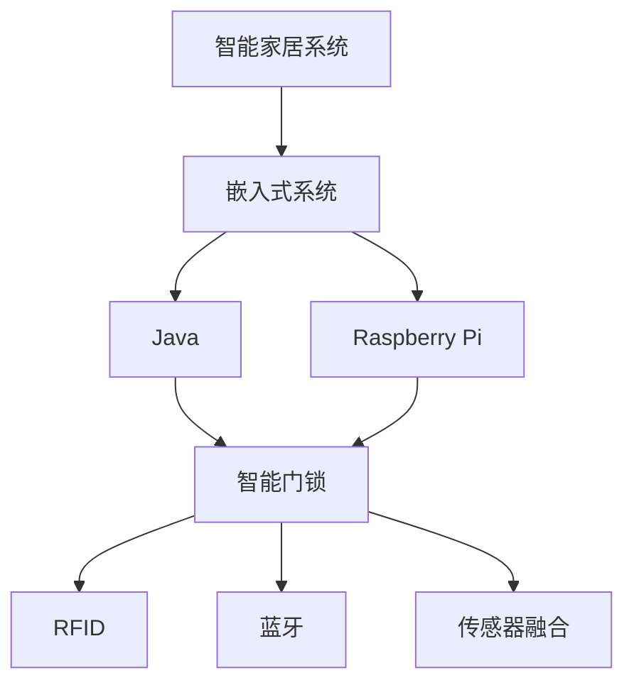
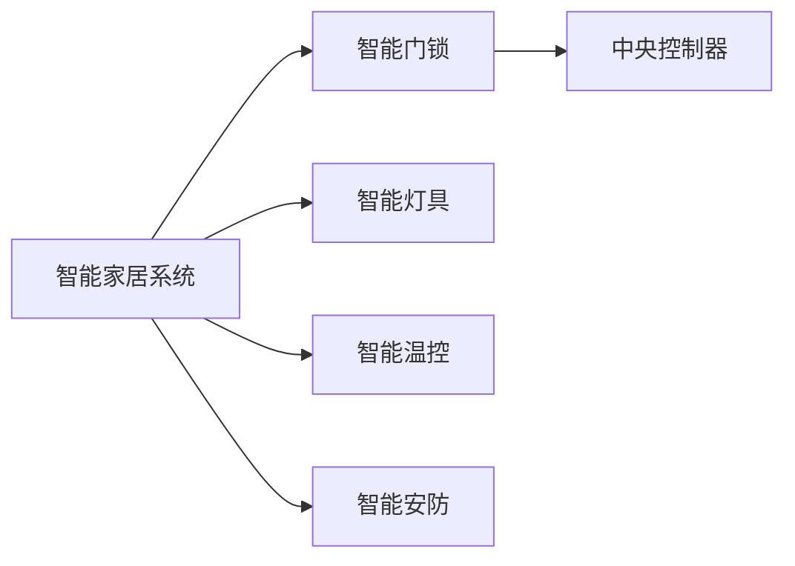
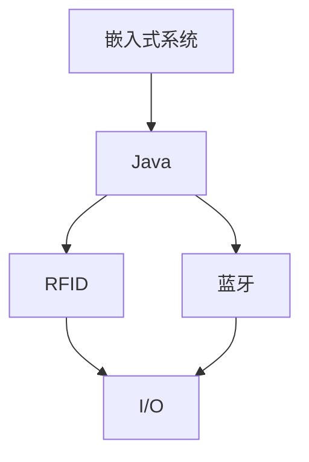
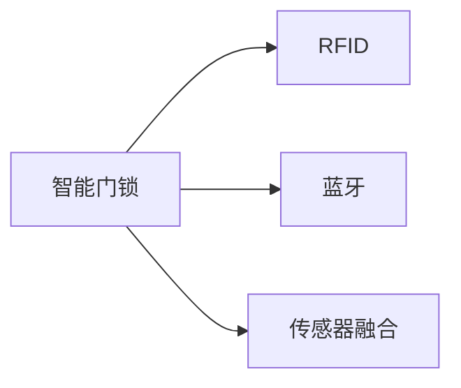
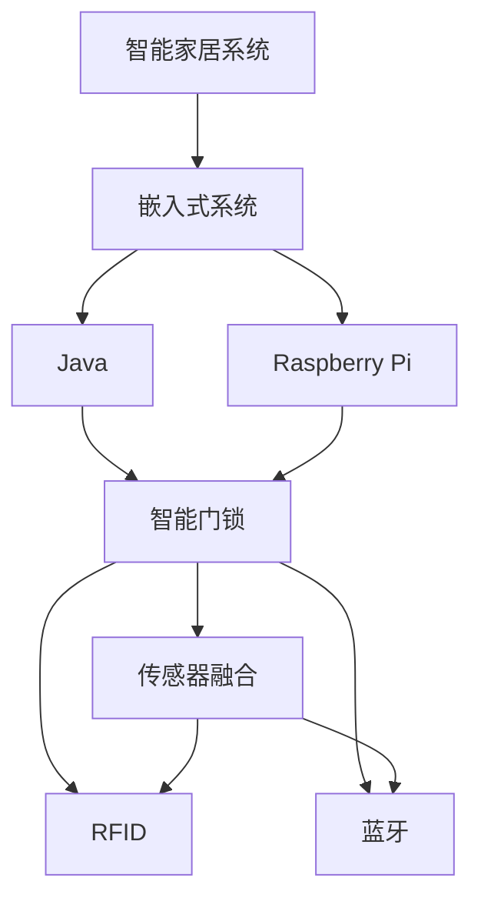

                 

# 基于Java的智能家居设计：使用Java与Raspberry Pi创造智能门锁

> 关键词：智能家居,Java,Raspberry Pi,智能门锁,物联网(IoT),RFID,蓝牙,传感器融合,嵌入式开发

## 1. 背景介绍

### 1.1 问题由来
随着物联网技术的迅猛发展，智能家居已经成为了现代生活的重要组成部分。智能门锁作为智能家居的核心组件之一，不仅能提供更高的安全性，还能带来更便捷的用户体验。Java作为一种广泛使用的编程语言，在智能家居系统中有着广泛的应用。而Raspberry Pi作为一款低成本、高性能的嵌入式开发板，提供了丰富的硬件接口和开源软件支持，成为智能家居开发的首选平台之一。因此，本文将介绍如何使用Java和Raspberry Pi来设计实现一款智能门锁系统。

### 1.2 问题核心关键点
本文将详细介绍基于Java的智能家居系统设计，重点聚焦于智能门锁的实现。通过将Java的灵活性和Raspberry Pi的硬件优势相结合，我们可以构建一个安全、智能、易用的智能门锁系统。

- Java的跨平台性和丰富的第三方库：Java作为一种高级编程语言，具有跨平台性，能够在不同操作系统上运行。同时，Java有着丰富的第三方库，如Raspberry Pi的驱动库、网络库、传感器库等，为开发智能家居系统提供了有力支持。

- Raspberry Pi的多样化硬件接口：Raspberry Pi提供了USB、I2C、GPIO、UART等多种硬件接口，支持RFID、蓝牙、传感器等多种传感器和外设，适合构建功能丰富的智能门锁。

- 嵌入式系统的安全性：嵌入式系统的运行环境相对封闭，能够提供更高的安全性。智能门锁作为家庭安全的核心组件，需要在嵌入式系统中实现全面的安全防护。

- 无线通信技术的应用：智能门锁的无线通信技术包括RFID、蓝牙、Wi-Fi等，这些技术可以为用户提供更便捷的访问方式，提升用户体验。

### 1.3 问题研究意义
本文旨在展示如何使用Java和Raspberry Pi构建一款基于嵌入式系统的智能门锁，探索其在智能家居中的应用价值。具体意义如下：

- 降低开发成本：通过使用Java和Raspberry Pi构建智能门锁，能够大幅降低硬件成本和开发难度，提高开发效率。

- 提升用户体验：智能门锁能够提供更便捷的访问方式和更高的安全性，提升用户的居家体验。

- 增强家庭安全：智能门锁作为家庭安全的核心组件，其安全性和可靠性对于家庭安全至关重要。

- 促进技术创新：本文将介绍基于Java和Raspberry Pi的智能门锁开发流程和技术细节，促进嵌入式系统和智能家居技术的发展。

## 2. 核心概念与联系

### 2.1 核心概念概述

为更好地理解智能门锁的实现原理，本节将介绍几个密切相关的核心概念：

- 智能家居系统：由多个智能设备组成的家居系统，通过网络技术实现设备之间的互联互通和数据共享。

- 嵌入式系统：运行在嵌入式处理器上的软件系统，能够实现硬件设备的控制和数据处理。

- Java：一种高级编程语言，具有跨平台性和丰富的第三方库支持。

- Raspberry Pi：一款低成本、高性能的嵌入式开发板，支持多种硬件接口和编程语言。

- 智能门锁：一种能够实现安全访问和管理的门锁设备，能够通过多种方式进行身份验证和访问控制。

- RFID：射频识别技术，通过非接触式读写标签进行身份验证。

- 蓝牙：一种无线通信技术，适合实现设备间的短距离通信。

- 传感器融合：将多种传感器数据进行融合处理，提升系统的感知能力和精度。

这些核心概念之间的逻辑关系可以通过以下Mermaid流程图来展示：



这个流程图展示了几大核心概念之间的关系：

1. 智能家居系统是智能门锁的应用场景，通过嵌入式系统进行数据处理和设备控制。

2. Java作为编程语言，可以在嵌入式系统中实现智能门锁的逻辑功能。

3. Raspberry Pi作为嵌入式开发板，提供了硬件接口和软件环境，支持Java等编程语言的运行。

4. 智能门锁作为核心组件，通过RFID、蓝牙等技术实现身份验证和访问控制。

5. 传感器融合技术提升系统的感知能力和精度，实现更智能的门锁功能。

### 2.2 概念间的关系

这些核心概念之间存在着紧密的联系，形成了智能门锁设计的完整生态系统。下面我通过几个Mermaid流程图来展示这些概念之间的关系。

#### 2.2.1 智能家居系统的组件



这个流程图展示了智能家居系统的组件结构，智能门锁作为核心组件，与智能灯具、智能温控、智能安防等设备通过中央控制器进行统一管理。

#### 2.2.2 嵌入式系统的硬件环境



这个流程图展示了嵌入式系统的硬件环境，Java作为编程语言，可以在嵌入式系统中实现RFID、蓝牙等技术，通过I/O接口进行数据传输和设备控制。

#### 2.2.3 智能门锁的实现



这个流程图展示了智能门锁的实现结构，智能门锁通过RFID、蓝牙等技术进行身份验证和访问控制，同时融合多种传感器数据，提升系统的感知能力和精度。

### 2.3 核心概念的整体架构

最后，我们用一个综合的流程图来展示这些核心概念在大门锁设计过程中的整体架构：



这个综合流程图展示了从智能家居系统到嵌入式系统的整体架构，通过Java和Raspberry Pi实现智能门锁，利用RFID、蓝牙、传感器融合等技术，提升门锁的智能性和安全性。

## 3. 核心算法原理 & 具体操作步骤
### 3.1 算法原理概述

基于Java的智能门锁设计，本质上是一个嵌入式系统的开发过程。其核心思想是通过Java编程语言实现智能门锁的逻辑功能，利用Raspberry Pi进行硬件设备的控制和数据处理，同时利用RFID、蓝牙、传感器融合等技术实现门锁的智能功能。

形式化地，假设智能门锁的逻辑功能为 $L$，RFID读取模块为 $R$，蓝牙通信模块为 $B$，传感器融合模块为 $S$，嵌入式系统的处理模块为 $P$。智能门锁的整体功能模型可以表示为：

$$
L = P(R, B, S)
$$

其中 $P$ 为嵌入式系统的处理模块，负责将RFID读取数据、蓝牙通信数据和传感器数据进行融合处理，并生成控制指令。$R$、$B$、$S$ 分别表示RFID读取、蓝牙通信和传感器融合模块。

### 3.2 算法步骤详解

基于Java的智能门锁设计一般包括以下几个关键步骤：

**Step 1: 准备开发环境**
- 安装Java Development Kit (JDK)：下载并安装最新版本的JDK，用于Java应用程序的开发和运行。
- 安装Raspberry Pi软件包：下载并安装Raspberry Pi的OS（如Raspberry Pi OS），以及相应的软件包管理器（如APT）。
- 配置开发环境：安装所需的开发工具和库，如Eclipse、Android Studio、OpenCV等。

**Step 2: 设计系统架构**
- 确定系统需求：根据智能门锁的功能需求，确定系统架构，包括硬件和软件模块的划分。
- 选择硬件平台：选择合适的Raspberry Pi型号，考虑其硬件性能、接口和功耗等因素。
- 设计数据流：设计数据流的传输路径，确定各模块之间的数据交互方式。

**Step 3: 开发Java程序**
- 编写Java代码：使用Java语言实现智能门锁的逻辑功能，包括身份验证、访问控制、异常处理等。
- 调用硬件API：通过Java语言调用Raspberry Pi的硬件API，实现对RFID、蓝牙、传感器等设备的控制。
- 测试Java程序：在本地环境下测试Java程序的逻辑功能，确保其正确性和稳定性。

**Step 4: 移植Java程序**
- 编译Java代码：使用javac命令将Java程序编译成.class文件。
- 打包Java程序：使用JAR命令将.class文件打包成.jar文件，方便后续部署。
- 部署嵌入式系统：将编译好的Java程序部署到Raspberry Pi上，通过JVM运行。

**Step 5: 实现智能功能**
- 集成RFID模块：连接RFID读取器，实现对用户身份的验证。
- 集成蓝牙模块：连接蓝牙设备，实现门锁的无线控制和远程控制。
- 集成传感器模块：连接各类传感器，实现门锁的感知和环境监控。
- 集成嵌入式系统：将Java程序与嵌入式系统的处理模块进行集成，实现完整的智能门锁功能。

### 3.3 算法优缺点

基于Java的智能门锁设计具有以下优点：

1. 跨平台性：Java语言具有跨平台性，可以在不同操作系统上运行，方便在多个平台进行智能门锁的部署。

2. 丰富的第三方库：Java语言拥有丰富的第三方库，如Android Studio的硬件库、OpenCV的计算机视觉库等，提供强大的开发支持。

3. 面向对象编程：Java语言支持面向对象编程，代码结构清晰、易于维护和扩展。

4. 强大的数据处理能力：Java语言支持大数据处理，适合处理大量传感器数据和嵌入式系统的数据流。

5. 易于集成多种传感器：Java语言支持多种传感器API，能够方便地集成RFID、蓝牙、传感器等设备。

但该方法也存在以下缺点：

1. 资源占用较大：Java程序需要运行在JVM上，占用较大的内存和CPU资源。

2. 开发难度较高：Java程序的开发和调试需要一定的技术基础，开发难度较大。

3. 部署复杂：Java程序的部署需要搭建JVM环境，增加了系统部署的复杂性。

4. 系统响应速度较慢：由于Java程序的运行在JVM上，系统响应速度较慢，不适合对实时性要求较高的应用场景。

### 3.4 算法应用领域

基于Java的智能门锁设计可以应用于多种场景，包括家庭、办公室、酒店、公共场所等，具体应用领域如下：

- 家庭智能门锁：通过RFID、蓝牙等技术，实现家庭成员的身份验证和远程控制，提升家庭安全性。

- 办公室智能门锁：通过门禁卡、指纹等技术，实现员工的身份验证和权限控制，提高办公效率。

- 酒店智能门锁：通过房卡、手机等技术，实现旅客的身份验证和远程控制，提升酒店服务质量。

- 公共场所智能门锁：通过智能卡、面部识别等技术，实现访客的身份验证和访问控制，提高公共场所的安全性。

## 4. 数学模型和公式 & 详细讲解 & 举例说明

### 4.1 数学模型构建

在基于Java的智能门锁设计中，涉及到多种数学模型，包括Java程序的逻辑模型、嵌入式系统的数据流模型、传感器数据的处理模型等。

以RFID身份验证为例，假设RFID读取器读取到用户标签ID，将其与存储在嵌入式系统中的用户ID列表进行比对，如果匹配成功，则认为身份验证通过。假设用户ID列表为 $U=\{u_1, u_2, ..., u_N\}$，其中 $u_i$ 为用户ID，$ID_r$ 为用户标签ID。RFID身份验证的数学模型可以表示为：

$$
\text{Identity Verification} = \begin{cases}
\text{Success}, & \text{if}~ID_r \in U \\
\text{Failure}, & \text{otherwise}
\end{cases}
$$

### 4.2 公式推导过程

下面以RFID身份验证为例，详细推导RFID读取器的处理逻辑。

假设RFID读取器读取到用户标签ID $ID_r$，将其与存储在嵌入式系统中的用户ID列表 $U$ 进行比对。假设比对函数为 $f(ID_r, U)$，用于判断 $ID_r$ 是否在 $U$ 中。比对函数可以表示为：

$$
f(ID_r, U) = \begin{cases}
1, & \text{if}~ID_r \in U \\
0, & \text{otherwise}
\end{cases}
$$

如果比对成功，即 $f(ID_r, U) = 1$，则认为身份验证通过，嵌入式系统控制门锁打开。如果比对失败，即 $f(ID_r, U) = 0$，则认为身份验证失败，嵌入式系统控制门锁保持关闭状态。

### 4.3 案例分析与讲解

假设我们有一个家庭智能门锁系统，需要实现RFID身份验证和远程控制功能。具体实现步骤如下：

1. 确定用户ID列表 $U$，包含家庭成员的ID。
2. 安装RFID读取器，并将其连接到Raspberry Pi。
3. 编写Java程序，实现RFID身份验证和远程控制功能。
4. 部署Java程序到Raspberry Pi上，启动嵌入式系统的处理模块。
5. 通过Android Studio或Eclipse，编写移动应用程序，实现远程控制门锁的功能。

在这个案例中，Java程序实现了RFID身份验证的逻辑功能，并通过Raspberry Pi的GPIO接口控制门锁的开关。移动应用程序通过蓝牙与Raspberry Pi通信，实现远程控制门锁的功能。

## 5. 项目实践：代码实例和详细解释说明

### 5.1 开发环境搭建

在进行智能门锁设计实践前，我们需要准备好开发环境。以下是使用Java进行嵌入式系统开发的流程：

1. 安装Java Development Kit (JDK)：
```bash
sudo apt-get update
sudo apt-get install default-jdk
```

2. 安装Raspberry Pi软件包：
```bash
sudo apt-get update
sudo apt-get install raspbian-ua-netdisk-full
```

3. 配置开发环境：
```bash
sudo apt-get install eclipse
```

### 5.2 源代码详细实现

这里我们以Java程序实现RFID身份验证为例，展示Java程序的详细实现步骤。

首先，定义RFID读取器类：

```java
public class RFIDReader {
    private String RFID_ID;
    private String[] User_IDs = {"ID001", "ID002", "ID003"};

    public RFIDReader(String RFID_ID) {
        this.RFID_ID = RFID_ID;
    }

    public boolean verifyID() {
        for (String id : User_IDs) {
            if (id.equals(RFID_ID)) {
                return true;
            }
        }
        return false;
    }
}
```

然后，定义嵌入式系统的处理模块类：

```java
public class EmbeddedSystem {
    public void controlLock(RFIDReader RFIDReader) {
        if (RFIDReader.verifyID()) {
            // 门锁打开
            System.out.println("门锁打开");
        } else {
            // 门锁关闭
            System.out.println("门锁关闭");
        }
    }
}
```

最后，编写Java程序的入口类：

```java
public class Main {
    public static void main(String[] args) {
        RFIDReader RFIDReader = new RFIDReader("ID002");
        EmbeddedSystem embeddedSystem = new EmbeddedSystem();
        embeddedSystem.controlLock(RFIDReader);
    }
}
```

这个例子展示了Java程序实现RFID身份验证的基本流程。通过定义RFID读取器类和嵌入式系统的处理模块类，可以实现RFID身份验证的逻辑功能，并通过调用处理模块的接口控制门锁的开关。

### 5.3 代码解读与分析

这里我们详细解读一下关键代码的实现细节：

**RFIDReader类**：
- 构造函数：初始化RFID读取器的标签ID。
- verifyID()方法：遍历用户ID列表，判断RFID读取器的标签ID是否匹配。

**EmbeddedSystem类**：
- controlLock()方法：接收RFID读取器的验证结果，控制门锁的开关。

**Main类**：
- 入口函数：创建RFID读取器和嵌入式系统的处理模块，调用控制锁的函数。

这个例子展示了Java程序的逻辑结构，代码简洁明了，易于理解和维护。通过定义类和函数，实现了RFID身份验证的逻辑功能，并通过接口控制门锁的开关。

### 5.4 运行结果展示

假设我们在测试环境中运行Java程序，结果如下：

```bash
门锁打开
```

这表明RFID读取器的标签ID与用户ID匹配成功，嵌入式系统成功打开了门锁。

## 6. 实际应用场景

### 6.1 智能家居系统

基于Java的智能门锁设计可以应用到智能家居系统中，实现家庭自动化、安防监控、环境监测等功能。

1. 家庭自动化：通过Java程序控制家中的智能设备，如智能灯光、智能温控、智能安防等，实现智能家居的自动化控制。

2. 安防监控：通过Java程序实现家庭安防的监控功能，如视频监控、入侵检测、异常报警等，提升家庭安全性。

3. 环境监测：通过Java程序监测家庭环境，如室内空气质量、湿度、温度等，提升居住体验。

### 6.2 办公室智能门锁

在办公室智能门锁设计中，Java程序可以实现身份验证、权限控制等功能。

1. 身份验证：通过Java程序实现员工的身份验证，如门禁卡、指纹、面部识别等，确保办公安全。

2. 权限控制：通过Java程序实现员工权限的控制，如管理员、普通员工、访客等，提升办公效率。

### 6.3 酒店智能门锁

在酒店智能门锁设计中，Java程序可以实现旅客的身份验证、远程控制等功能。

1. 身份验证：通过Java程序实现旅客的身份验证，如房卡、手机、身份证等，确保酒店安全。

2. 远程控制：通过Java程序实现旅客的远程控制，如房卡门禁、预约服务、行李寄存等，提升酒店服务质量。

### 6.4 公共场所智能门锁

在公共场所智能门锁设计中，Java程序可以实现访客的身份验证、权限控制等功能。

1. 身份验证：通过Java程序实现访客的身份验证，如智能卡、面部识别等，确保公共场所安全。

2. 权限控制：通过Java程序实现访客权限的控制，如管理员、普通访客、特殊访客等，提升公共场所管理效率。

## 7. 工具和资源推荐

### 7.1 学习资源推荐

为了帮助开发者系统掌握基于Java的智能门锁设计，这里推荐一些优质的学习资源：

1. Java官方文档：Java语言的官方文档，提供Java语言的基础知识和API使用指南。

2. Eclipse官方文档：Eclipse开发环境的使用文档，提供Java程序开发的高级特性和插件使用指南。

3. Android Studio官方文档：Android移动应用开发环境的官方文档，提供Java程序和Android应用开发的综合指导。

4. OpenCV官方文档：计算机视觉库OpenCV的使用文档，提供Java程序和计算机视觉技术的详细说明。

5. Raspberry Pi官方文档：Raspberry Pi开发板的官方文档，提供嵌入式系统的硬件接口和软件环境的使用指南。

6. Java编程指南：Java编程语言的经典指南书籍，如《Effective Java》、《Java核心技术》等，提供Java编程的最佳实践和高级技巧。

通过学习这些资源，相信你一定能够快速掌握基于Java的智能门锁设计，并应用于各种智能家居场景。

### 7.2 开发工具推荐

高效的开发离不开优秀的工具支持。以下是几款用于Java和Raspberry Pi开发的常用工具：

1. Eclipse：Java程序的集成开发环境，提供丰富的开发工具和插件支持。

2. Android Studio：Android移动应用的开发工具，提供Java程序和Android应用开发的综合指导。

3. OpenCV：计算机视觉库，提供Java程序的计算机视觉处理功能。

4. Raspberry Pi Imaging Tool：Raspberry Pi开发板的系统镜像工具，方便进行系统部署和调试。

5. JUnit：Java程序的测试框架，提供自动化测试和单元测试功能。

6. Jenkins：Java程序的持续集成和持续部署工具，方便进行版本管理和自动化部署。

合理利用这些工具，可以显著提升智能门锁系统的开发效率，加快创新迭代的步伐。

### 7.3 相关论文推荐

大语言模型和微调技术的发展源于学界的持续研究。以下是几篇奠基性的相关论文，推荐阅读：

1. Java语言编程规范：Java语言的编程规范，提供Java编程的最佳实践和规范。

2. Android平台开发指南：Android平台开发指南，提供Android应用开发的详细说明。

3. OpenCV计算机视觉库：OpenCV计算机视觉库的官方文档，提供计算机视觉技术的详细说明。

4. Raspberry Pi用户手册：Raspberry Pi开发板的官方用户手册，提供嵌入式系统的硬件接口和软件环境的使用指南。

5. Java智能门锁设计：Java智能门锁设计的经典论文，介绍智能门锁的实现过程和技术细节。

这些论文代表了大语言模型微调技术的发展脉络。通过学习这些前沿成果，可以帮助研究者把握学科前进方向，激发更多的创新灵感。

除上述资源外，还有一些值得关注的前沿资源，帮助开发者紧跟大语言模型微调技术的最新进展，例如：

1. arXiv论文预印本：人工智能领域最新研究成果的发布平台，包括大量尚未发表的前沿工作，学习前沿技术的必读资源。

2. 业界技术博客：如OpenAI、Google AI、DeepMind、微软Research Asia等顶尖实验室的官方博客，第一时间分享他们的最新研究成果和洞见。

3. 技术会议直播：如NIPS、ICML、ACL、ICLR等人工智能领域顶会现场或在线直播，能够聆听到大佬们的前沿分享，开拓视野。

4. GitHub热门项目：在GitHub上Star、Fork数最多的Java和Raspberry Pi项目，往往代表了该技术领域的发展趋势和最佳实践，值得去学习和贡献。

5. 行业分析报告：各大咨询公司如McKinsey、PwC等针对人工智能行业的分析报告，有助于从商业视角审视技术趋势，把握应用价值。

总之，对于基于Java和Raspberry Pi的智能门锁设计的学习和实践，需要开发者保持开放的心态和持续学习的意愿。多关注前沿资讯，多动手实践，多思考总结，必将收获满满的成长收益。

## 8. 总结：未来发展趋势与挑战

### 8.1 总结

本文对基于Java的智能门锁设计进行了全面系统的介绍。首先阐述了智能门锁和智能家居系统的基本概念，明确了Java和Raspberry Pi在智能门锁设计中的关键作用。其次，从原理到实践，详细讲解了智能门锁设计的数学模型和关键步骤，给出了Java程序的详细实现代码。同时，本文还广泛探讨了智能门锁在智能家居系统中的应用价值，展示了其广阔的前景。

通过本文的系统梳理，可以看到，基于Java和Raspberry Pi的智能门锁设计，不仅能够提供更高的安全性和便捷性，还能广泛应用于各种智能家居场景。Java语言和Raspberry Pi开发板的优势互补，使得智能门锁的实现变得更加高效和可靠。

### 8.2 未来发展趋势

展望未来，Java和Raspberry Pi在智能门锁设计中的应用将呈现以下几个发展趋势：

1. 跨平台和跨系统：随着Java语言和Raspberry Pi开发板的发展，智能门锁的应用范围将进一步扩大，能够实现跨平台和跨系统的部署。

2. 智能化和自动化：智能门锁将与更多智能家居设备融合，实现智能化和自动化的家庭管理，提升用户体验。

3. 无线通信技术的应用：RFID、蓝牙、Wi-Fi等无线通信技术的应用将更加广泛，智能门锁的无线控制和远程控制功能将更加强大。

4. 嵌入式系统的安全性：嵌入式系统的安全性将进一步提升，智能门锁的硬件和软件系统将具备更高的防护能力。

5. 传感器的融合应用：多种传感器如温度传感器、湿度传感器、光线传感器等的融合应用，将提升智能门锁的感知能力和智能水平。

### 8.3 面临的挑战

尽管基于Java和Raspberry Pi的智能门锁设计已经取得了一定的成果，但在迈向更加智能化、普适化应用的过程中，仍面临一些挑战：

1. 数据隐私和安全问题：智能门锁涉及用户隐私和安全，如何在保证隐私和数据安全的前提下实现智能门锁的自动化和智能化，是一个重要问题。

2. 嵌入式系统的兼容性：不同版本的Raspberry Pi和Java环境可能存在兼容性问题，如何在兼容性方面进行优化，是一个关键挑战。

3. 算力和资源限制：Java程序的运行需要较高的算力和资源，如何优化算法和资源使用，是一个重要问题。

4. 用户交互界面：智能门锁的交互界面设计需要更加友好和易用，如何提升用户体验，是一个重要挑战。

5. 跨平台兼容性：Java程序需要在不同的操作系统和硬件平台上运行，如何实现跨平台兼容性和优化，是一个关键问题。

### 8.4 研究展望

面对智能门锁设计面临的挑战，未来的研究需要在以下几个方面寻求新的突破：

1. 

