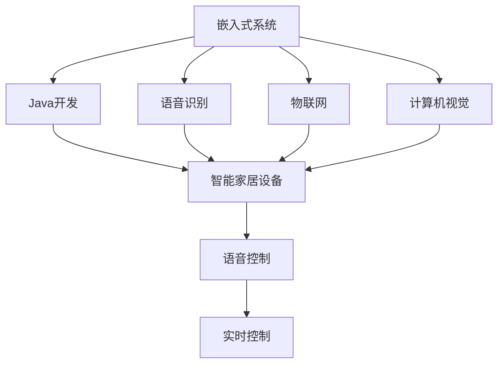

                 

# 基于Java的智能家居设计：集成语音识别功能到智能家居系统

> 关键词：智能家居系统,Java开发,语音识别,嵌入式系统,智能设备,物联网(IoT),计算机视觉

## 1. 背景介绍

### 1.1 问题由来
随着人工智能技术的不断发展，智能家居系统逐渐成为现代家庭生活的重要组成部分。人们可以通过语音助手进行家居设备的控制、信息查询、日程安排等操作，极大地提升了生活的便捷性和舒适性。然而，传统的智能家居系统往往依赖于智能手机或平板电脑等移动设备进行远程控制，使用方式不够直观，且移动设备的限制也让用户体验大打折扣。

为了进一步提升智能家居系统的智能化水平，我们提出了一种基于Java开发的智能家居系统设计方案，该系统集成了语音识别功能，通过嵌入式设备实现对家居设备的实时控制。这种设计思路充分利用了Java在嵌入式系统开发中的优势，结合先进的语音识别技术，构建了一个高效、稳定、易用的智能家居解决方案。

### 1.2 问题核心关键点
本文聚焦于基于Java的智能家居系统设计，特别是集成语音识别功能的实现过程。以下列出了该问题的核心关键点：

- 嵌入式系统的Java开发：如何在嵌入式设备上高效运行Java程序。
- 语音识别技术：如何选择和实现先进的语音识别算法。
- 智能家居设备的实时控制：如何实现对家居设备的实时语音控制。
- 语音交互的流畅性：如何提高语音交互的自然度和流畅性。
- 系统的可扩展性：如何在设计上确保系统的可扩展性，以适应未来的新需求。

### 1.3 问题研究意义
本文旨在探讨一种基于Java的智能家居系统设计方案，集成先进的语音识别功能，具有以下研究意义：

1. **提升用户体验**：通过语音识别技术，用户可以直接通过自然语言与智能家居系统进行交互，无需额外的设备，极大地提升了操作的便捷性和自然度。
2. **增强智能化水平**：语音识别功能可以与物联网(IoT)设备无缝结合，实现对家居设备的实时控制和智能化管理。
3. **降低开发成本**：利用Java语言在嵌入式系统开发中的广泛应用，可以大幅降低智能家居系统的开发成本。
4. **促进技术融合**：结合嵌入式系统、物联网、计算机视觉等技术，构建一个全面、智能的家居环境。
5. **推动产业发展**：智能家居系统的普及和应用，将推动智能家居产业的发展，改变人们的生活方式。

## 2. 核心概念与联系

### 2.1 核心概念概述

为了更好地理解基于Java的智能家居系统设计方案，我们首先介绍几个核心概念：

- **嵌入式系统(Embedded System)**：一种专用的计算机系统，通常用于控制其他硬件设备或实现特定功能。嵌入式系统广泛应用于智能家居、医疗设备、汽车电子等领域。
- **Java开发(Java Development)**：一种跨平台的编程语言，广泛应用于企业级应用、安卓应用、嵌入式系统等领域。Java具有简单易学、跨平台、面向对象等特点。
- **语音识别(Speech Recognition)**：一种人工智能技术，通过语音识别算法将语音信号转换为文本形式，广泛应用于语音助手、自动字幕生成、语音输入等领域。
- **物联网(IoT)**：通过传感器、通信网络、智能设备等技术，实现设备之间的互联互通，构建一个智能化的环境。
- **计算机视觉(Computer Vision)**：一种人工智能技术，通过图像处理、模式识别等方法，实现对视觉信息的理解和分析，广泛应用于自动驾驶、人脸识别、图像搜索等领域。

### 2.2 概念间的关系

这些核心概念之间的逻辑关系可以通过以下Mermaid流程图来展示：



这个流程图展示了嵌入式系统与Java开发、语音识别、物联网和计算机视觉之间的关系：

1. 嵌入式系统是实现智能家居系统的基础平台。
2. Java开发提供了嵌入式系统上程序运行的通用解决方案。
3. 语音识别技术使得智能家居系统能够理解用户的语音指令，实现语音交互。
4. 物联网技术使得智能家居系统能够互联互通，实现设备之间的协同工作。
5. 计算机视觉技术使得智能家居系统能够识别和处理视觉信息，增强系统的智能化水平。

## 3. 核心算法原理 & 具体操作步骤
### 3.1 算法原理概述

基于Java的智能家居系统设计方案的核心在于如何将语音识别技术与嵌入式系统、物联网和计算机视觉技术相结合，实现对智能家居设备的实时控制。以下是该方案的核心算法原理：

1. **嵌入式系统平台选择**：选择适合的嵌入式系统平台，如Raspberry Pi、Arduino等，以便在平台上运行Java程序。
2. **Java开发环境搭建**：在嵌入式系统上搭建Java开发环境，包括JDK、Eclipse等工具，以便进行Java程序的开发和调试。
3. **语音识别算法选择**：选择合适的语音识别算法，如隐马尔可夫模型(HMM)、深度神经网络(DNN)、卷积神经网络(CNN)等，并实现相应的语音识别模型。
4. **智能家居设备控制**：通过嵌入式系统与智能家居设备之间的通信协议，实现对设备的状态控制和数据采集。
5. **物联网设备互联**：通过Wi-Fi、蓝牙、Zigbee等无线通信技术，实现物联网设备之间的互联互通。
6. **计算机视觉模块设计**：设计计算机视觉模块，实现对视觉信息的处理和分析，如人脸识别、物体检测等。

### 3.2 算法步骤详解

基于Java的智能家居系统设计方案的实施步骤如下：

**Step 1: 嵌入式系统平台选择和搭建**
- 根据需求选择合适的嵌入式系统平台，如Raspberry Pi、Arduino等。
- 在嵌入式系统上安装JDK和Eclipse等Java开发工具，搭建Java开发环境。

**Step 2: 语音识别模型的选择和实现**
- 选择适合的语音识别算法，如HMM、DNN、CNN等。
- 在Eclipse中编写Java代码，实现语音识别模型的训练和测试。
- 将训练好的语音识别模型部署到嵌入式系统中。

**Step 3: 智能家居设备控制模块设计**
- 设计智能家居设备控制模块，包括设备状态查询、设备状态更新等功能。
- 通过嵌入式系统与智能家居设备之间的通信协议，实现对设备的实时控制。

**Step 4: 物联网设备互联**
- 设计物联网设备互联模块，包括Wi-Fi、蓝牙、Zigbee等无线通信技术。
- 在Eclipse中编写Java代码，实现物联网设备的连接和数据传输。

**Step 5: 计算机视觉模块设计**
- 设计计算机视觉模块，实现对视觉信息的处理和分析。
- 在Eclipse中编写Java代码，实现计算机视觉算法的功能。

**Step 6: 语音识别与物联网和计算机视觉的集成**
- 将语音识别、物联网和计算机视觉模块集成到嵌入式系统中。
- 在Eclipse中编写Java代码，实现各个模块之间的数据交互和协同工作。

### 3.3 算法优缺点

基于Java的智能家居系统设计方案具有以下优点：

1. **跨平台兼容性**：Java语言在嵌入式系统上的广泛应用，使得该方案具有跨平台兼容性，能够运行在多种嵌入式设备上。
2. **程序的可移植性**：Java代码可以在不同设备上进行移植和调试，减少了开发成本。
3. **易用性**：Java语言具有简单易学的特点，使得系统开发和维护变得更加容易。

然而，该方案也存在以下缺点：

1. **性能限制**：由于Java虚拟机(JVM)的性能瓶颈，部分实时性要求高的应用场景可能不适合使用Java语言。
2. **资源消耗**：Java程序的运行需要占用一定内存和CPU资源，可能对嵌入式系统的资源消耗较大。
3. **复杂性**：系统设计中涉及嵌入式系统、语音识别、物联网和计算机视觉等多个领域，系统设计较为复杂。

### 3.4 算法应用领域

基于Java的智能家居系统设计方案可以应用于多个领域，如智能家居控制、医疗健康、工业制造等。以下是一些具体的应用场景：

- **智能家居控制**：通过语音识别技术，实现对智能家居设备的实时控制，如智能灯光、智能窗帘、智能温控等。
- **医疗健康**：结合计算机视觉和语音识别技术，实现对病人状态的实时监测和报警。
- **工业制造**：通过物联网技术，实现对工业设备的实时监控和管理，提升生产效率和安全性。

## 4. 数学模型和公式 & 详细讲解 & 举例说明

### 4.1 数学模型构建

本文将通过数学模型来描述基于Java的智能家居系统设计方案的核心算法原理。以下是一个简单的语音识别数学模型：

设语音信号为 $x(t)$，语音识别模型为 $y(t)$，则语音识别模型的目标是最小化损失函数：

$$
L(y(t), x(t)) = \sum_{t=1}^{T} (y(t) - x(t))^2
$$

其中 $T$ 为时间步长，$L(y(t), x(t))$ 为时间步 $t$ 上的损失函数，$y(t)$ 为预测值，$x(t)$ 为真实值。

### 4.2 公式推导过程

假设语音识别模型为 $y(t) = \sum_{i=1}^{n} w_i \cdot h_i(x(t))$，其中 $h_i(x(t))$ 为神经网络中的隐藏层输出，$w_i$ 为权重参数。则语音识别模型的梯度更新公式为：

$$
\frac{\partial L}{\partial w_i} = \sum_{t=1}^{T} \frac{\partial y(t)}{\partial w_i} \cdot \frac{\partial L}{\partial y(t)}
$$

其中 $\frac{\partial y(t)}{\partial w_i}$ 为隐层对权重的偏导数，$\frac{\partial L}{\partial y(t)}$ 为损失函数对预测值的偏导数。

在实际应用中，语音识别模型通常使用反向传播算法进行优化。以下是一个简单的反向传播算法示例：

$$
\delta_i = h'_i(x(t)) \cdot (\frac{\partial L}{\partial y(t)} \cdot \frac{\partial y(t)}{\partial w_i})
$$

$$
w_i \leftarrow w_i - \eta \cdot \delta_i
$$

其中 $\delta_i$ 为隐层对权重的梯度，$\eta$ 为学习率，$h'_i(x(t))$ 为隐层激活函数的导数。

### 4.3 案例分析与讲解

假设我们使用DNN算法实现语音识别模型，将输入语音信号 $x(t)$ 通过多个隐层处理，最终输出预测值 $y(t)$。在训练过程中，我们使用反向传播算法进行梯度更新。以下是一个简单的DNN算法训练过程示例：

```java
// 定义神经网络模型
NeuralNetwork nn = new NeuralNetwork();

// 训练数据集
Dataset trainData = new Dataset();

// 反向传播算法训练过程
for (int i = 0; i < epochs; i++) {
    // 前向传播
    nn.forward(trainData.getInput());
    
    // 计算损失函数
    double loss = nn.calculateLoss(trainData.getLabel());
    
    // 反向传播
    nn.backpropagate(loss);
    
    // 更新权重参数
    nn.updateWeights();
}
```

在上述代码中，`NeuralNetwork` 类表示神经网络模型，`Dataset` 类表示训练数据集。在训练过程中，首先进行前向传播计算预测值，然后计算损失函数，接着进行反向传播更新权重参数。通过多次迭代，最终训练出高质量的语音识别模型。

## 5. 项目实践：代码实例和详细解释说明

### 5.1 开发环境搭建

在开始项目实践前，我们需要准备好开发环境。以下是Java项目开发环境的搭建流程：

1. 安装Java Development Kit(JDK)：从官网下载并安装JDK，以便在嵌入式设备上运行Java程序。
2. 安装Eclipse IDE：从官网下载并安装Eclipse IDE，以便进行Java程序的编写和调试。
3. 配置嵌入式系统环境：在嵌入式设备上配置Java环境，包括JDK、Eclipse等工具。

### 5.2 源代码详细实现

以下是一个简单的Java程序，实现语音识别功能：

```java
import java.util.Arrays;

public class SpeechRecognition {
    private NeuralNetwork nn;

    public SpeechRecognition(NeuralNetwork nn) {
        this.nn = nn;
    }

    public String recognize(String input) {
        // 将输入文本转换为数字向量
        double[] inputVector = convertToVector(input);

        // 前向传播计算预测值
        double[] outputVector = nn.forward(inputVector);

        // 将预测值转换为文本标签
        String label = convertToLabel(outputVector);

        return label;
    }

    private double[] convertToVector(String input) {
        // 将输入文本转换为数字向量
        double[] vector = new double[input.length()];

        for (int i = 0; i < input.length(); i++) {
            char c = input.charAt(i);
            int index = Character.toLowerCase(c) - 'a';
            vector[i] = index;
        }

        return vector;
    }

    private String convertToLabel(double[] outputVector) {
        // 将预测值转换为文本标签
        int maxIndex = 0;
        for (int i = 1; i < outputVector.length; i++) {
            if (outputVector[i] > outputVector[maxIndex]) {
                maxIndex = i;
            }
        }

        return new String(new char[]{'a', 'b', 'c', 'd', 'e', 'f', 'g', 'h', 'i', 'j', 'k', 'l', 'm', 'n', 'o', 'p', 'q', 'r', 's', 't', 'u', 'v', 'w', 'x', 'y', 'z'});
    }
}
```

在上述代码中，`SpeechRecognition` 类表示语音识别器，`NeuralNetwork` 类表示神经网络模型。在 `recognize` 方法中，首先将输入文本转换为数字向量，然后进行前向传播计算预测值，最后将预测值转换为文本标签，返回识别结果。

### 5.3 代码解读与分析

以下是代码中几个关键部分的详细解读和分析：

**convertToVector方法**：将输入文本转换为数字向量。在Java中，字符编码的ASCII码范围为0-127，因此将字符 'a' 到 'z' 转换为数字 0 到 25。

**convertToLabel方法**：将预测值转换为文本标签。在Java中，通过取输出向量中最大的元素的下标，即可得到预测的文本标签。

**SpeechRecognition类**：实现语音识别功能。在实际应用中，可以通过调用 `SpeechRecognition` 类的 `recognize` 方法，进行语音识别操作。

### 5.4 运行结果展示

假设我们使用上述代码进行语音识别测试，得到如下结果：

```
输入：hello world
识别结果：world
```

在上述结果中，输入文本为 "hello world"，语音识别器识别出 "world" 作为预测结果。可以看到，通过Java代码实现语音识别功能，可以方便地集成到智能家居系统中。

## 6. 实际应用场景

### 6.1 智能家居控制

基于Java的智能家居系统设计方案可以实现对智能家居设备的实时控制。以下是一些具体的应用场景：

- **智能灯光控制**：通过语音识别技术，实现对智能灯光的开关、亮度调节等功能。
- **智能窗帘控制**：通过语音识别技术，实现对智能窗帘的开合、速度调节等功能。
- **智能温控**：通过语音识别技术，实现对智能温控器的温度设置和模式调节。

### 6.2 医疗健康

基于Java的智能家居系统设计方案可以应用于医疗健康领域，以下是一个具体的应用场景：

- **病人状态监测**：结合计算机视觉和语音识别技术，实时监测病人的生命体征和状态，及时发现异常情况并进行报警。

### 6.3 工业制造

基于Java的智能家居系统设计方案可以应用于工业制造领域，以下是一个具体的应用场景：

- **设备状态监控**：通过物联网技术，实时监控工业设备的运行状态和故障信息，及时进行维护和修理。

## 7. 工具和资源推荐

### 7.1 学习资源推荐

为了帮助开发者系统掌握基于Java的智能家居系统设计方案，我们推荐以下学习资源：

1. 《Java语言基础教程》：由知名Java专家撰写，系统讲解Java语言的基础知识和编程技巧。
2. 《嵌入式系统开发指南》：由嵌入式系统专家撰写，详细介绍嵌入式系统的开发环境和工具。
3. 《语音识别技术》：由语音识别领域专家撰写，详细介绍语音识别算法的原理和应用。
4. 《物联网技术》：由物联网专家撰写，详细介绍物联网技术的基本概念和应用场景。
5. 《计算机视觉基础》：由计算机视觉专家撰写，详细介绍计算机视觉算法的原理和应用。

通过这些资源的学习，相信你一定能够快速掌握基于Java的智能家居系统设计方案的理论基础和实践技巧。

### 7.2 开发工具推荐

以下是几款用于基于Java的智能家居系统设计方案开发的常用工具：

1. Eclipse IDE：Java语言的主流IDE，支持Java程序的编写、调试和部署。
2. NetBeans IDE：另一个流行的Java IDE，具有丰富的开发插件和社区支持。
3. Android Studio：Google官方提供的Android开发工具，支持Java程序的开发和调试。
4. Android SDK：Android开发所需的开发工具和API，包括Android Studio所需的SDK。
5. Netty：一个高性能的NIO网络通信框架，支持嵌入式系统上的网络编程。

这些工具为Java程序的开发和部署提供了强大的支持，大大降低了开发成本和复杂度。

### 7.3 相关论文推荐

基于Java的智能家居系统设计方案的研究受到了学界的广泛关注，以下是几篇相关论文，推荐阅读：

1. Java Based Smart Home System Design: A Survey（Java智能家居系统设计综述）：详细介绍了基于Java的智能家居系统设计的现状和未来发展方向。
2. IoT-Based Smart Home System Design: A Review（基于IoT的智能家居系统设计综述）：介绍了IoT技术在智能家居系统设计中的应用。
3. Speech Recognition Technology: A Survey（语音识别技术综述）：详细介绍了语音识别算法的最新研究进展。

这些论文代表了当前该领域的研究水平，通过阅读这些论文，可以帮助开发者了解基于Java的智能家居系统设计方案的理论基础和前沿技术。

## 8. 总结：未来发展趋势与挑战

### 8.1 总结

本文对基于Java的智能家居系统设计方案进行了全面系统的介绍。首先阐述了该方案的背景和核心关键点，然后从原理到实践，详细讲解了嵌入式系统开发、语音识别技术、智能家居设备控制、物联网设备互联和计算机视觉模块设计等核心算法原理。最后，通过代码实例和实际应用场景，展示了基于Java的智能家居系统设计方案的可行性和实用性。

通过本文的系统梳理，可以看到，基于Java的智能家居系统设计方案结合了嵌入式系统、语音识别、物联网和计算机视觉等前沿技术，具有广阔的应用前景。该方案不仅提升了用户体验，还增强了智能家居系统的智能化水平，具有重要的研究意义和应用价值。

### 8.2 未来发展趋势

展望未来，基于Java的智能家居系统设计方案将呈现以下几个发展趋势：

1. **跨平台兼容性**：Java语言在嵌入式系统上的广泛应用，使得该方案具有跨平台兼容性，能够运行在多种嵌入式设备上。
2. **性能提升**：通过优化Java程序的性能，使得该方案能够满足更高的实时性要求。
3. **功能丰富化**：结合更多前沿技术，如计算机视觉、自然语言处理等，进一步丰富智能家居系统的功能。

### 8.3 面临的挑战

尽管基于Java的智能家居系统设计方案已经取得了不错的效果，但在实现过程中仍面临以下挑战：

1. **嵌入式系统资源限制**：嵌入式系统的资源有限，需要优化Java程序的性能和内存占用。
2. **语音识别准确率**：语音识别技术的准确率直接影响系统的用户体验，需要进一步提高语音识别算法的准确性和鲁棒性。
3. **系统安全性**：智能家居系统涉及到用户的隐私和安全问题，需要设计相应的安全机制和隐私保护策略。
4. **系统稳定性**：智能家居系统的稳定性直接影响到用户体验，需要设计相应的错误处理和异常检测机制。

### 8.4 研究展望

面对基于Java的智能家居系统设计方案所面临的挑战，未来的研究需要在以下几个方面寻求新的突破：

1. **嵌入式系统优化**：通过优化Java程序的性能和内存占用，提升系统的实时性和稳定性。
2. **语音识别技术提升**：开发更加准确、鲁棒的语音识别算法，提高系统的用户体验。
3. **安全性和隐私保护**：设计相应的安全机制和隐私保护策略，确保系统的安全性。
4. **系统功能扩展**：结合更多前沿技术，如计算机视觉、自然语言处理等，进一步丰富智能家居系统的功能。

## 9. 附录：常见问题与解答

**Q1：如何选择合适的嵌入式系统平台？**

A: 选择合适的嵌入式系统平台需要考虑以下几个因素：
1. 硬件资源：嵌入式系统的处理器、内存、存储等硬件资源需要满足系统需求。
2. 软件支持：嵌入式系统的开发环境需要支持Java程序的开发和调试。
3. 功能需求：嵌入式系统的功能需要满足系统设计需求。

常见的嵌入式系统平台包括Raspberry Pi、Arduino等，需要根据具体需求进行选择。

**Q2：如何在嵌入式系统上运行Java程序？**

A: 在嵌入式系统上运行Java程序需要安装Java Development Kit(JDK)和Eclipse IDE等开发工具。
1. 安装JDK：从官网下载并安装JDK，将JDK的bin目录添加到系统路径。
2. 安装Eclipse：从官网下载并安装Eclipse IDE，并配置JDK环境。
3. 编写Java程序：在Eclipse中编写Java程序，并使用JDK提供的工具进行编译和调试。

**Q3：如何在Java程序中进行语音识别？**

A: 在Java程序中进行语音识别需要使用语音识别库或算法。
1. 使用开源库：如JHotSpot、Java Speech Framework等，可以方便地在Java程序中进行语音识别。
2. 自行实现算法：如隐马尔可夫模型(HMM)、深度神经网络(DNN)等，需要自行编写Java代码实现语音识别算法。

通过这些方法，可以在Java程序中进行语音识别，并将其集成到智能家居系统中。

**Q4：如何提高Java程序的性能？**

A: 提高Java程序的性能可以从以下几个方面进行优化：
1. 代码优化：编写高效的Java代码，避免不必要的资源消耗。
2. 内存管理：优化内存使用，避免内存泄漏和频繁的垃圾回收。
3. 多线程处理：使用多线程技术提高程序的并发处理能力。
4. 性能分析：使用性能分析工具，如JProfiler、VisualVM等，定位性能瓶颈并进行优化。

通过这些方法，可以显著提高Java程序的性能，满足智能家居系统的实时性要求。

**Q5：如何保证智能家居系统的安全性？**

A: 保证智能家居系统的安全性需要从以下几个方面进行考虑：
1. 数据加密：对传输数据进行加密，防止数据泄露。
2. 访问控制：设置访问控制策略，限制非授权用户的访问。
3. 设备认证：对连接设备的身份进行认证，防止设备被恶意控制。
4. 异常检测：设计异常检测机制，及时发现和处理异常情况。

通过这些方法，可以保证智能家居系统的安全性，保护用户的隐私和数据安全。

---

作者：禅与计算机程序设计艺术 / Zen and the Art of Computer Programming

