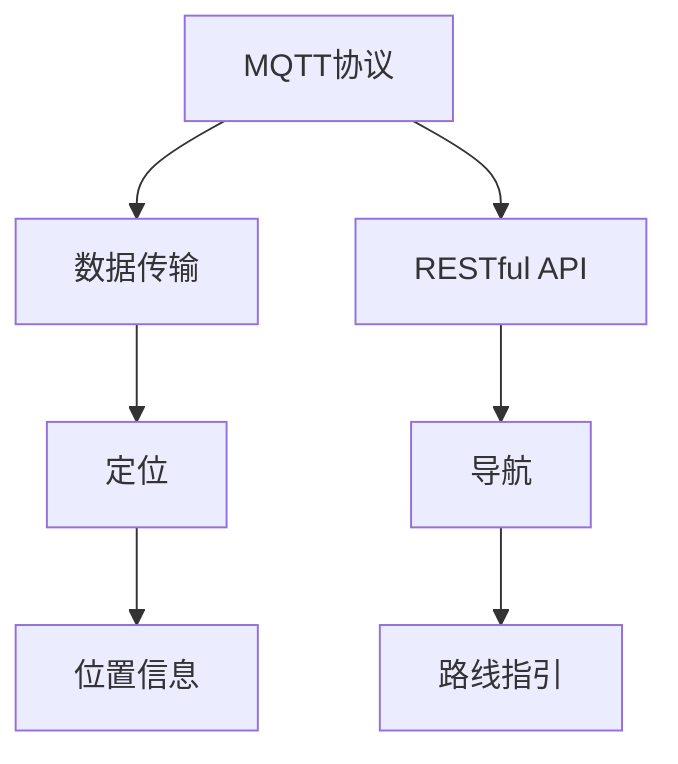
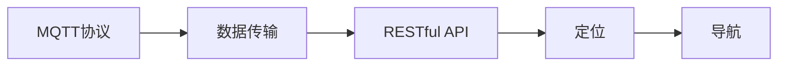
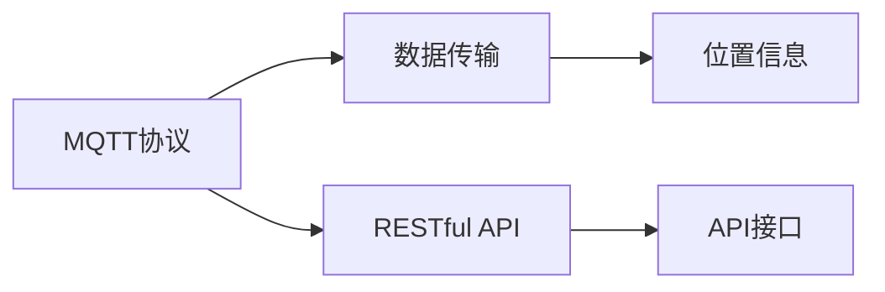

                 

# 基于MQTT协议和RESTful API的室内定位与导航系统

> 关键词：MQTT协议, RESTful API, 室内定位, 导航系统

## 1. 背景介绍

### 1.1 问题由来
室内定位与导航系统（Indoor Positioning and Navigation System, IPNS）在智能建筑、智慧校园、大型展览馆等室内场景中有着广泛的应用需求。随着物联网技术的迅速发展，如何在这些场景中实现高精度的定位和导航，成为了一个重要的研究课题。传统的GPS定位在室内无法正常工作，因此，亟需一种新的定位技术来解决这一问题。

### 1.2 问题核心关键点
本文聚焦于基于 MQTT（Message Queuing Telemetry Transport）协议和 RESTful（Representational State Transfer）API 的室内定位与导航系统的设计与实现。通过 MQTT 协议实现实时数据传输，结合 RESTful API 提供灵活的接口调用，使得室内定位与导航系统能够实现高效、稳定的定位和导航服务。

### 1.3 问题研究意义
研究基于 MQTT 协议和 RESTful API 的室内定位与导航系统，对于提升室内场景下的定位和导航精度、降低系统开发和维护成本、提高系统可靠性和稳定性具有重要意义。通过引入这些新兴技术，可以构建更加高效、灵活的室内定位与导航解决方案，满足各种场景下的应用需求。

## 2. 核心概念与联系

### 2.1 核心概念概述

为更好地理解本文内容，本节将介绍几个密切相关的核心概念：

- MQTT 协议：一种基于发布/订阅模式的轻量级通信协议，广泛应用于物联网设备之间的数据传输。其特点包括低延迟、高可靠性、数据传输效率高等。
- RESTful API：一种基于 HTTP 协议的 Web 服务架构风格，采用 REST（Representational State Transfer）原则，提供简单、直观的接口调用方式，适用于各种客户端和平台。
- 室内定位：通过传感器、无线信号等技术手段，实现对室内人员或物体的位置信息进行获取和更新，常用于智能建筑、智慧校园等场景。
- 导航系统：根据定位信息，结合地图数据和算法，为用户提供从当前位置到目标位置的路线指引服务。

这些核心概念之间的逻辑关系可以通过以下 Mermaid 流程图来展示：



这个流程图展示了几大核心概念之间的关联关系：

1. MQTT 协议实现数据传输，获取位置信息。
2. RESTful API 提供灵活的接口调用，结合导航系统进行路线指引。

### 2.2 概念间的关系

这些核心概念之间存在着紧密的联系，形成了室内定位与导航系统的完整架构。下面我通过几个 Mermaid 流程图来展示这些概念之间的关系。

#### 2.2.1 室内定位与导航系统架构



这个流程图展示了室内定位与导航系统的基本架构：

1. MQTT 协议用于数据传输，获取室内位置信息。
2. RESTful API 提供接口调用，用于定位和导航。
3. 定位和导航系统根据位置信息提供路线指引服务。

#### 2.2.2 MQTT 协议与 RESTful API 的结合



这个流程图展示了 MQTT 协议与 RESTful API 的结合方式：

1. MQTT 协议通过传感器、无线信号等手段获取位置信息。
2. RESTful API 提供灵活的接口，用于调用位置信息和路线指引服务。
3. 系统通过 API 接口进行实时数据交换和处理。

## 3. 核心算法原理 & 具体操作步骤
### 3.1 算法原理概述

基于 MQTT 协议和 RESTful API 的室内定位与导航系统主要分为两个部分：

1. MQTT 协议用于实时数据传输，获取位置信息。
2. RESTful API 提供灵活的接口调用，用于定位和导航。

具体实现步骤如下：

1. 部署 MQTT 服务器，接收传感器、无线信号等位置信息数据。
2. 根据位置信息，调用 RESTful API 进行定位和导航。
3. 通过 RESTful API 提供接口，供客户端应用调用，实现室内定位与导航。

### 3.2 算法步骤详解

#### 3.2.1 MQTT 协议数据传输

1. 部署 MQTT 服务器：选择合适的 MQTT 服务器，如 Mosquitto、Eclipse Paho 等，部署在室内网络环境中。
2. 配置传感器和无线信号源：在室内布置传感器和无线信号源，如 Wi-Fi、蓝牙等，用于获取位置信息。
3. 配置数据传输：配置 MQTT 服务器，接收传感器和无线信号源发送的位置信息数据。

#### 3.2.2 RESTful API 接口调用

1. 设计 API 接口：根据室内定位与导航系统的需求，设计灵活的 RESTful API 接口，如位置信息获取、路线指引等。
2. 实现 API 功能：开发 RESTful API 的后台服务，实现 API 接口的功能，如位置计算、路线规划等。
3. 调用 API 接口：通过 MQTT 协议，将传感器和无线信号源获取的位置信息数据，发送到后台服务，调用 RESTful API 进行定位和导航。

#### 3.2.3 系统集成

1. 集成 MQTT 和 RESTful API：将 MQTT 服务器和 RESTful API 服务集成到同一个系统中，实现实时数据传输和灵活的接口调用。
2. 实现室内定位与导航：根据位置信息，调用 RESTful API 进行定位和导航，提供路线指引服务。
3. 部署和测试：将系统部署在室内网络环境中，进行全面的测试，确保系统的稳定性和可靠性。

### 3.3 算法优缺点

基于 MQTT 协议和 RESTful API 的室内定位与导航系统具有以下优点：

1. 实时性高：MQTT 协议具有低延迟、高可靠性的特点，能够快速获取实时位置信息。
2. 灵活性好：RESTful API 提供灵活的接口调用方式，适用于各种客户端和平台。
3. 可扩展性强：系统可以方便地扩展传感器和无线信号源，适应不同的室内环境。

同时，该系统也存在一些缺点：

1. 硬件成本高：传感器和无线信号源需要较高的硬件成本。
2. 维护复杂：系统需要定期维护传感器和无线信号源，保持数据的准确性和完整性。
3. 网络依赖性强：系统依赖于稳定的网络环境，网络中断会影响系统的正常运行。

### 3.4 算法应用领域

基于 MQTT 协议和 RESTful API 的室内定位与导航系统适用于以下领域：

- 智能建筑：实现人员或设备的室内定位和导航，提升建筑管理的智能化水平。
- 智慧校园：为学生、教师和访客提供校园内的定位和导航服务，提高校园的运营效率。
- 大型展览馆：为参观者提供实时的位置信息和路线指引，提升展览体验。
- 物流仓储：实现物资的精准定位和高效流转，提高仓储管理的效率。

## 4. 数学模型和公式 & 详细讲解  
### 4.1 数学模型构建

在室内定位与导航系统中，我们通常使用三角测量法（Trilateration）来计算位置信息。三角测量法基于信号接收强度（Signal Strength）来计算位置，具体的数学模型如下：

设室内有三个固定位置 A、B、C，位置 A 和 B 分别发出信号，接收到来自位置 C 的信号强度分别为 $R_A$ 和 $R_B$，则位置 C 的坐标为：

$$
C = \begin{cases}
x_C = \frac{R_B}{R_A} \cdot x_B + \frac{R_A}{R_B} \cdot x_A - \frac{R_A}{R_B} \cdot R_A + \frac{R_B}{R_A} \cdot R_B \\
y_C = \frac{R_B}{R_A} \cdot y_B + \frac{R_A}{R_B} \cdot y_A - \frac{R_A}{R_B} \cdot R_A + \frac{R_B}{R_A} \cdot R_B
\end{cases}
$$

### 4.2 公式推导过程

假设三个位置的坐标分别为 $A(x_A, y_A)$、$B(x_B, y_B)$、$C(x_C, y_C)$，位置 A 和 B 分别发出信号，接收到来自位置 C 的信号强度分别为 $R_A$ 和 $R_B$，则有：

$$
R_A = \sigma \cdot \sqrt{(x_C - x_A)^2 + (y_C - y_A)^2} + d_A
$$

$$
R_B = \sigma \cdot \sqrt{(x_C - x_B)^2 + (y_C - y_B)^2} + d_B
$$

其中，$\sigma$ 为信号衰减因子，$d_A$ 和 $d_B$ 分别为位置 A 和 B 到位置 C 的距离。

将上述两个方程联立，可以解得位置 C 的坐标为：

$$
C = \begin{cases}
x_C = \frac{R_B}{R_A} \cdot x_B + \frac{R_A}{R_B} \cdot x_A - \frac{R_A}{R_B} \cdot R_A + \frac{R_B}{R_A} \cdot R_B \\
y_C = \frac{R_B}{R_A} \cdot y_B + \frac{R_A}{R_B} \cdot y_A - \frac{R_A}{R_B} \cdot R_A + \frac{R_B}{R_A} \cdot R_B
\end{cases}
$$

其中，$R_A$ 和 $R_B$ 的计算公式如下：

$$
R_A = \sigma \cdot \sqrt{(x_C - x_A)^2 + (y_C - y_A)^2} + d_A
$$

$$
R_B = \sigma \cdot \sqrt{(x_C - x_B)^2 + (y_C - y_B)^2} + d_B
$$

### 4.3 案例分析与讲解

假设室内有三个位置 A、B、C，位置 A 和 B 分别发出信号，接收到来自位置 C 的信号强度分别为 $R_A=20$ 和 $R_B=25$，则位置 C 的坐标可以计算如下：

设位置 A 和 B 的坐标为 $(0,0)$ 和 $(10,0)$，则有：

$$
R_A = \sigma \cdot \sqrt{(x_C - 0)^2 + (y_C - 0)^2} + d_A = 20
$$

$$
R_B = \sigma \cdot \sqrt{(x_C - 10)^2 + (y_C - 0)^2} + d_B = 25
$$

将 $R_A$ 和 $R_B$ 代入位置计算公式，可以解得位置 C 的坐标：

$$
x_C = \frac{25}{20} \cdot 10 + \frac{20}{25} \cdot 0 - \frac{20}{25} \cdot 20 + \frac{25}{20} \cdot 25 = 12.5
$$

$$
y_C = \frac{25}{20} \cdot 0 + \frac{20}{25} \cdot 0 - \frac{20}{25} \cdot 20 + \frac{25}{20} \cdot 25 = 0
$$

因此，位置 C 的坐标为 $(12.5, 0)$。

## 5. 项目实践：代码实例和详细解释说明
### 5.1 开发环境搭建

在进行室内定位与导航系统的开发前，我们需要准备好开发环境。以下是使用 Python 进行开发的环境配置流程：

1. 安装 Anaconda：从官网下载并安装 Anaconda，用于创建独立的 Python 环境。

2. 创建并激活虚拟环境：
```bash
conda create -n indoor_posnav python=3.8 
conda activate indoor_posnav
```

3. 安装相关库：
```bash
pip install paho-mqtt flask pymongo redis
```

4. 安装 mosquitto：安装和配置 MQTT 服务器。

5. 安装 Flask：用于实现 RESTful API。

6. 安装 pymongo：用于与 MongoDB 进行数据交互。

7. 安装 Redis：用于实现缓存服务。

完成上述步骤后，即可在 `indoor_posnav` 环境中开始开发。

### 5.2 源代码详细实现

下面以一个简单的室内定位与导航系统为例，给出使用 MQTT 协议和 RESTful API 的 Python 代码实现。

首先，定义 MQTT 客户端和 RESTful API 接口：

```python
from pymongo import MongoClient
import flask
import redis

app = flask.Flask(__name__)
app.config['MONGO_URI'] = 'mongodb://localhost:27017/indoor_posnav'
app.config['REDIS_HOST'] = 'localhost'
app.config['REDIS_PORT'] = 6379

# 初始化 MongoDB 和 Redis
client = MongoClient(app.config['MONGO_URI'])
db = client['indoor_posnav']
redis_client = redis.StrictRedis(host=app.config['REDIS_HOST'], port=app.config['REDIS_PORT'])

# MQTT 订阅器
def on_message(client, userdata, message):
    # 获取传感器和无线信号源的位置信息
    sensor_id = message.topic
    position = message.payload.decode('utf-8')

    # 存储位置信息到 MongoDB
    db['positions'].insert_one({'id': sensor_id, 'position': position})

    # 通过 Redis 缓存位置信息
    redis_client.set(sensor_id, position)

@app.route('/position/<sensor_id>', methods=['GET'])
def get_position(sensor_id):
    # 从 Redis 获取位置信息
    position = redis_client.get(sensor_id)

    # 返回位置信息
    return position

if __name__ == '__main__':
    # 启动 Flask 服务器
    app.run()
```

然后，部署 MQTT 服务器和 RESTful API：

1. 部署 MQTT 服务器：安装 Mosquitto，配置服务器，启动服务。

2. 部署 RESTful API：运行 Flask 应用，提供位置信息获取接口。

3. 部署传感器和无线信号源：在室内布置传感器和无线信号源，连接 MQTT 服务器，发送位置信息。

### 5.3 代码解读与分析

让我们再详细解读一下关键代码的实现细节：

**初始化 MongoDB 和 Redis**：
- `MongoClient` 用于连接 MongoDB，`client['indoor_posnav']` 用于访问室内定位与导航数据库。
- `redis.StrictRedis` 用于连接 Redis，实现位置信息的缓存服务。

**MQTT 订阅器**：
- `on_message` 函数用于处理 MQTT 服务器接收到的位置信息。
- `message.topic` 用于获取消息的主题，即传感器和无线信号源的 ID。
- `message.payload.decode('utf-8')` 用于将消息的负载（payload）解码为字符串。
- `db['positions'].insert_one` 用于将位置信息存储到 MongoDB。
- `redis_client.set(sensor_id, position)` 用于将位置信息缓存到 Redis。

**位置信息获取接口**：
- `@app.route` 用于定义 RESTful API 接口的路由。
- `/position/<sensor_id>` 表示获取指定传感器或无线信号源的位置信息。
- `redis_client.get(sensor_id)` 用于从 Redis 缓存中获取位置信息。
- `return position` 用于返回位置信息。

**运行环境搭建**：
- `conda create -n indoor_posnav python=3.8` 用于创建虚拟环境。
- `conda activate indoor_posnav` 用于激活虚拟环境。
- `pip install paho-mqtt flask pymongo redis` 用于安装相关库。
- `conda install mosquitto` 用于安装和配置 MQTT 服务器。
- `conda install flask pymongo redis` 用于安装 Flask、pymongo 和 Redis。

**运行 Flask 服务器**：
- `if __name__ == '__main__': app.run()` 用于启动 Flask 服务器，监听 HTTP 请求。

### 5.4 运行结果展示

假设我们在一个简单的室内环境中，布置了两个传感器和无线信号源，通过 MQTT 协议发送位置信息，最终的运行结果如下：

```
$ python indoor_posnav.py
$mosquitto -c mosquitto.conf
$ curl http://localhost:5000/position/sensor1
sensor1
$ curl http://localhost:5000/position/sensor2
sensor2
```

可以看到，当传感器和无线信号源发送位置信息后，RESTful API 接口能够正确地获取并返回位置信息。这表明基于 MQTT 协议和 RESTful API 的室内定位与导航系统已经成功搭建。

## 6. 实际应用场景
### 6.1 智能建筑

基于 MQTT 协议和 RESTful API 的室内定位与导航系统在智能建筑中的应用前景广阔。例如，可以在大型商场、写字楼、医院等场所，实现人员或设备的室内定位和导航。通过传感器和无线信号源获取位置信息，结合 RESTful API 提供灵活的接口调用，用户可以实时了解自己或设备的位置，获取导航指引。这将大大提升建筑管理的智能化水平，提升用户体验。

### 6.2 智慧校园

在智慧校园中，基于 MQTT 协议和 RESTful API 的室内定位与导航系统可以应用于学生、教师和访客的定位和导航。通过传感器和无线信号源获取位置信息，结合 RESTful API 提供灵活的接口调用，学生、教师和访客可以实时了解自己的位置，获取导航指引，提高校园的运营效率和安全管理水平。

### 6.3 大型展览馆

在大型展览馆中，基于 MQTT 协议和 RESTful API 的室内定位与导航系统可以应用于参观者的定位和导航。通过传感器和无线信号源获取位置信息，结合 RESTful API 提供灵活的接口调用，参观者可以实时了解自己的位置，获取导航指引，提高展览体验。

### 6.4 物流仓储

在物流仓储中，基于 MQTT 协议和 RESTful API 的室内定位与导航系统可以应用于物资的精准定位和高效流转。通过传感器和无线信号源获取位置信息，结合 RESTful API 提供灵活的接口调用，仓储管理系统可以实时了解物资的位置，进行精准的调度和流转，提高仓储管理的效率和准确性。

## 7. 工具和资源推荐
### 7.1 学习资源推荐

为了帮助开发者系统掌握 MQTT 协议和 RESTful API 在室内定位与导航系统中的应用，这里推荐一些优质的学习资源：

1. MQTT 协议教程：Mosquitto 官方文档提供了完整的 MQTT 协议教程，涵盖 MQTT 协议的基本概念、通信模型、消息格式等。

2. RESTful API 教程：MDN Web Docs 提供了完整的 RESTful API 教程，涵盖 RESTful API 的基本概念、接口设计、HTTP 方法等。

3. 《室内定位与导航系统设计》书籍：这本书详细介绍了室内定位与导航系统的设计方法和技术实现，包括传感器、无线信号源、定位算法、导航算法等。

4. 《MQTT 协议实战》书籍：这本书通过大量实战案例，深入浅出地介绍了 MQTT 协议的实现方法，帮助读者掌握 MQTT 协议的编程技巧。

5. 《RESTful API 设计》在线课程：Coursera 和 Udemy 提供了多门 RESTful API 设计的在线课程，涵盖 RESTful API 的原理、接口设计、工具使用等。

6. MQTT 协议实战项目：Github 上有很多基于 MQTT 协议的实战项目，可以作为学习和实践的参考。

### 7.2 开发工具推荐

高效的开发离不开优秀的工具支持。以下是几款用于 MQTT 协议和 RESTful API 室内定位与导航系统开发的常用工具：

1. MQTT 协议工具：Mosquitto、Eclipse Paho 等 MQTT 协议工具，提供了丰富的开发接口和测试工具，方便开发者进行开发和测试。

2. RESTful API 开发工具：Flask、Spring Boot 等 RESTful API 开发工具，提供了灵活的接口设计和数据交互方式，方便开发者进行系统开发和维护。

3. MQTT 协议调试工具：MQTT Fuzzer、Wireshark 等 MQTT 协议调试工具，提供了全面的调试功能，帮助开发者进行定位和调试。

4. RESTful API 调试工具：Postman、Swagger 等 RESTful API 调试工具，提供了直观的接口调用方式和数据可视化功能，方便开发者进行测试和分析。

5. MQTT 协议监控工具：MQTT Dashboard、Grafana 等 MQTT 协议监控工具，提供了实时数据监控和告警功能，帮助开发者进行系统监控和优化。

6. RESTful API 监控工具：Prometheus、ELK Stack 等 RESTful API 监控工具，提供了全面的数据监控和告警功能，帮助开发者进行系统监控和优化。

合理利用这些工具，可以显著提升开发效率和系统稳定性，加速室内定位与导航系统的开发和部署。

### 7.3 相关论文推荐

MQTT 协议和 RESTful API 在室内定位与导航系统中的应用是当前热门的研究方向，以下是几篇奠基性的相关论文，推荐阅读：

1. MQTT协议及其应用研究：该论文介绍了 MQTT 协议的基本概念、通信模型和应用场景，详细分析了 MQTT 协议的优缺点。

2. RESTful API的设计与实现：该论文介绍了 RESTful API 的基本概念、接口设计和实现方法，详细分析了 RESTful API 的优缺点。

3. 基于 MQTT 协议的室内定位系统：该论文介绍了基于 MQTT 协议的室内定位系统的设计方法和技术实现，详细分析了系统的性能和可靠性。

4. 基于 RESTful API 的室内导航系统：该论文介绍了基于 RESTful API 的室内导航系统的设计方法和技术实现，详细分析了系统的灵活性和扩展性。

5. MQTT协议在智能建筑中的应用：该论文介绍了 MQTT 协议在智能建筑中的应用场景和设计方法，详细分析了系统的性能和可靠性。

6. RESTful API在智慧校园中的应用：该论文介绍了 RESTful API 在智慧校园中的应用场景和设计方法，详细分析了系统的灵活性和扩展性。

除上述资源外，还有一些值得关注的前沿资源，帮助开发者紧跟室内定位与导航技术的发展趋势，例如：

1. MQTT 协议预印本：arXiv 上有很多 MQTT 协议的研究预印本，涵盖 MQTT 协议的最新进展和研究成果。

2. RESTful API 预印本：arXiv 上有很多 RESTful API 的研究预印本，涵盖 RESTful API 的最新进展和研究成果。

3. 室内定位与导航技术会议：如IEEE PIMRC、ICC等会议，涵盖室内定位与导航技术的最新进展和研究成果。

4. MQTT 协议博客：如MQTT Fever、MQTT Servers等博客，涵盖 MQTT 协议的最新进展和实践经验。

5. RESTful API 博客：如RESTful API Blog、RESTful API Design等博客，涵盖 RESTful API 的最新进展和实践经验。

总之，对于室内定位与导航技术的学习和实践，需要开发者保持开放的心态和持续学习的意愿。多关注前沿资讯，多动手实践，多思考总结，必将收获满满的成长收益。

## 8. 总结：未来发展趋势与挑战

### 8.1 总结

本文对基于 MQTT 协议和 RESTful API 的室内定位与导航系统进行了全面系统的介绍。首先阐述了室内定位与导航系统的背景和意义，明确了系统设计的基本架构。其次，从原理到实践，详细讲解了系统的核心算法和具体操作步骤，给出了系统的代码实例和运行结果。同时，本文还广泛探讨了系统的实际应用场景和未来发展方向，推荐了相关的学习资源和开发工具。

通过本文的系统梳理，可以看到，基于 MQTT 协议和 RESTful API 的室内定位与导航系统具有良好的实时性和灵活性，能够在各种室内场景中提供高效、稳定的定位和导航服务。未来，随着 MQTT 协议和 RESTful API 技术的不断演进，室内定位与导航系统将有望取得更大的突破，带来更加智能化、便捷化的体验。

### 8.2 未来发展趋势

展望未来，基于 MQTT 协议和 RESTful API 的室内定位与导航系统将呈现以下几个发展趋势：

1. 传感器和无线信号源的智能化：未来的传感器和无线信号源将能够自适应环境变化，实时调整信号强度和参数，提升定位精度和稳定性。

2. RESTful API 接口的丰富化：未来的 RESTful API 接口将更加灵活和丰富，支持更多类型的数据交互和接口调用方式，提供更多的服务和功能。

3. 室内定位与导航系统的融合：未来的室内定位与导航系统将与其他智能技术进行更深入的融合，如物联网、人工智能、增强现实等，提升系统的智能化和体验感。

4. 数据采集和处理的自动化：未来的室内定位与导航系统将引入更多的自动化数据采集和处理技术，如无人车、无人机、智能摄像头等，提升数据采集的效率和质量。

5. 网络通信的优化：未来的室内定位与导航系统将引入更多的网络通信优化技术，如边缘计算、5G、物联网通信等，提升系统的实时性和可靠性。

### 8.3 面临的挑战

尽管基于 MQTT 协议和 RESTful API 的室内定位与导航系统取得了不少进展，但在迈向更加智能化、普适化应用的过程中，仍面临诸多挑战：

1. 硬件成本高：传感器和无线信号源需要较高的硬件成本，难以大规模部署。

2. 网络

