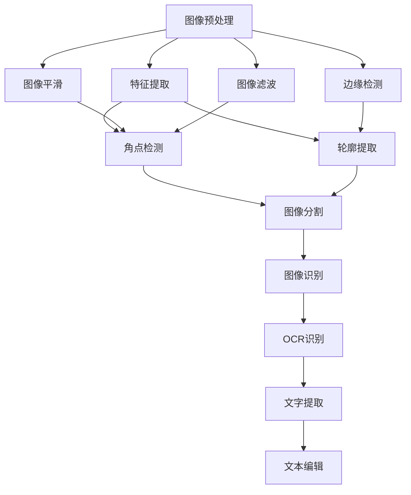
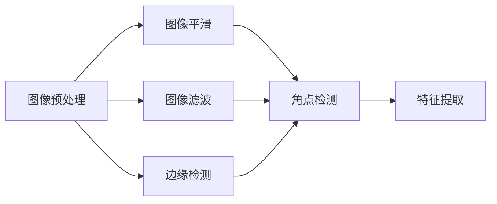
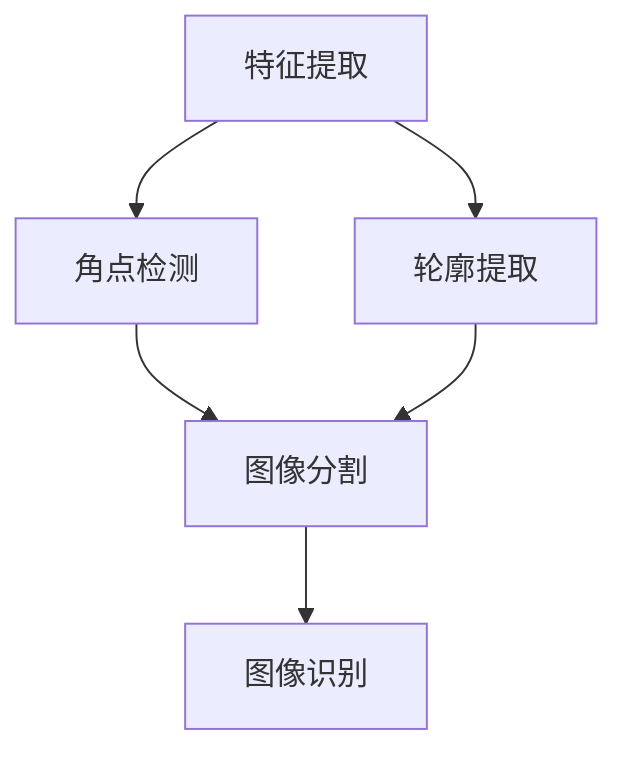
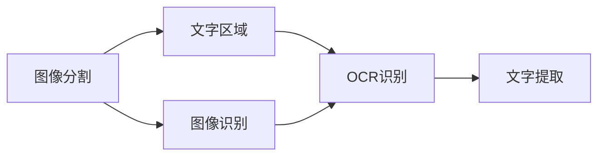
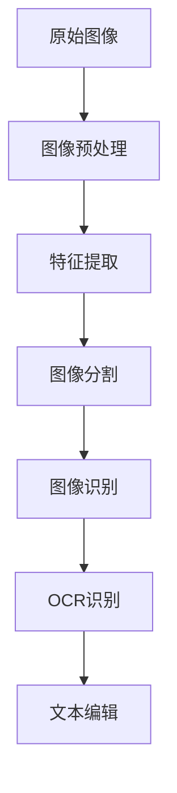

                 

# 基于OPENCV和MFC的图像处理程序

> 关键词：图像处理,OpenCV,Microsoft Foundation Class Library,OCR,OCR引擎

## 1. 背景介绍

### 1.1 问题由来
在计算机视觉领域，图像处理是一项基础且重要的任务。随着数字技术的快速发展，图像处理的应用范围日益扩大，从医疗影像分析、自动驾驶到人脸识别等领域，都离不开高质量的图像数据。

然而，高质量的图像数据并非总是可得，很多时候需要通过图像处理技术，从原始图像中提取出有用信息。传统的图像处理工具，如Photoshop等，虽然功能强大，但操作复杂，学习曲线陡峭，且价格昂贵，并不适合大规模应用。

与此同时，基于OpenCV和MFC的图像处理程序，以其开源免费、易用高效的特点，逐渐成为图像处理领域的新宠。本文将详细介绍使用OpenCV和MFC进行图像处理的实现方法和关键技术。

### 1.2 问题核心关键点
OpenCV（Open Source Computer Vision Library）是一个开源的计算机视觉库，提供了丰富的图像处理和计算机视觉算法。MFC（Microsoft Foundation Class Library）是一个Microsoft的类库，提供了图形界面编程的支持，便于开发出易用的用户界面。

本文将围绕以下核心关键点展开讨论：
- 图像预处理：通过平滑、滤波、边缘检测等方法，提升图像质量。
- 特征提取：提取图像中的关键特征，如角点、轮廓等，用于后续处理。
- OCR（Optical Character Recognition）识别：将图像中的文字转换为可编辑的文本信息。
- 图形界面设计：使用MFC设计易于操作的图像处理界面。

### 1.3 问题研究意义
OpenCV和MFC的结合，可以为图像处理开发者提供一套高效、易用的开发工具，帮助他们快速实现各种图像处理功能，适应各种应用场景。同时，这也有助于图像处理技术的普及和推广，推动相关领域的发展。

此外，通过本文的学习，读者可以掌握图像处理的基本原理和方法，为进一步深入学习计算机视觉技术打下基础。

## 2. 核心概念与联系

### 2.1 核心概念概述

OpenCV是一个开源的计算机视觉库，提供了丰富的图像处理和计算机视觉算法。MFC是一个Microsoft的类库，提供了图形界面编程的支持。

本文将介绍几个与图像处理密切相关的核心概念：

- 图像预处理：通过平滑、滤波、边缘检测等方法，提升图像质量。
- 特征提取：提取图像中的关键特征，如角点、轮廓等，用于后续处理。
- OCR（Optical Character Recognition）识别：将图像中的文字转换为可编辑的文本信息。
- 图形界面设计：使用MFC设计易于操作的图像处理界面。

这些概念之间的逻辑关系可以通过以下Mermaid流程图来展示：



这个流程图展示了图像处理的主要步骤和关键环节：

1. 原始图像经过预处理后，进入特征提取阶段。
2. 通过角点检测和轮廓提取，获取图像中的关键特征。
3. 基于关键特征，进行图像分割和识别。
4. 最终通过OCR识别，将图像中的文字转换为文本信息。

通过这些核心概念，我们能够更好地理解图像处理的基本流程和关键技术。

### 2.2 概念间的关系

这些核心概念之间存在着紧密的联系，构成了图像处理完整的生态系统。下面我们通过几个Mermaid流程图来展示这些概念之间的关系。

#### 2.2.1 图像预处理和特征提取的关系



这个流程图展示了图像预处理和特征提取的关系。图像预处理通过平滑、滤波、边缘检测等方法，提升图像质量，为特征提取提供更好的输入。

#### 2.2.2 特征提取和图像分割的关系



这个流程图展示了特征提取和图像分割的关系。通过角点检测和轮廓提取，获取图像中的关键特征，然后基于这些特征进行图像分割，将图像分解为更小的区域，便于后续处理。

#### 2.2.3 图像分割和OCR识别的关系



这个流程图展示了图像分割和OCR识别的关系。图像分割后，得到包含文字的区域，然后通过OCR识别，将这些文字转换为可编辑的文本信息。

### 2.3 核心概念的整体架构

最后，我们用一个综合的流程图来展示这些核心概念在大图像处理系统中的整体架构：



这个综合流程图展示了从原始图像到OCR识别的完整过程。原始图像经过预处理，然后进行特征提取、图像分割和识别，最终通过OCR识别，将图像中的文字转换为文本信息。

## 3. 核心算法原理 & 具体操作步骤
### 3.1 算法原理概述

OpenCV提供了丰富的图像处理和计算机视觉算法，支持从简单的图像滤波、边缘检测，到复杂的特征提取、图像分割等任务。MFC则提供了图形界面编程的支持，便于开发出易用的用户界面。

本文将介绍几个常用的图像处理算法，包括图像平滑、滤波、边缘检测、角点检测、轮廓提取、图像分割和OCR识别等。

### 3.2 算法步骤详解

#### 3.2.1 图像平滑

图像平滑是一种常见的预处理步骤，通过减少噪声，提升图像质量。常用的平滑算法包括均值滤波和高斯滤波。

均值滤波使用邻域内的像素平均值来替代中心像素值。代码实现如下：

```c++
cv::Mat img = cv::imread("image.jpg");
cv::Mat smoothed = cv::Mat(img.rows, img.cols, img.type());
cv::filter2D(img, smoothed, smoothed.type(), cv::Scalar::all(0), cv::Size(3, 3), 0, cv::BORDER_DEFAULT);
```

高斯滤波使用高斯核进行卷积，减少高频噪声。代码实现如下：

```c++
cv::Mat img = cv::imread("image.jpg");
cv::Mat smoothed = cv::Mat(img.rows, img.cols, img.type());
cv::GaussianBlur(img, smoothed, cv::Size(5, 5), 0, 0, cv::BORDER_DEFAULT);
```

#### 3.2.2 图像滤波

图像滤波是一种去除图像噪声和细节的预处理步骤。常用的滤波算法包括中值滤波和双边滤波。

中值滤波使用邻域内像素的中值来替代中心像素值。代码实现如下：

```c++
cv::Mat img = cv::imread("image.jpg");
cv::Mat filtered = cv::Mat(img.rows, img.cols, img.type());
cv::medianBlur(img, filtered, 3);
```

双边滤波不仅考虑像素值，还考虑像素之间的空间关系，保留边缘信息。代码实现如下：

```c++
cv::Mat img = cv::imread("image.jpg");
cv::Mat filtered = cv::Mat(img.rows, img.cols, img.type());
cv::bilateralFilter(img, filtered, 9, 75, 75);
```

#### 3.2.3 边缘检测

边缘检测是一种检测图像中边缘的算法，常用算法包括Sobel、Canny和Laplacian等。

Sobel算法计算图像的梯度，检测出图像中的边缘。代码实现如下：

```c++
cv::Mat img = cv::imread("image.jpg");
cv::Mat edges = cv::Mat(img.rows, img.cols, CV_8UC1);
cv::Sobel(img, edges, CV_8UC1, 1, 0, 3, 1, 0, cv::BORDER_DEFAULT);
```

Canny算法检测图像中的强边缘，并滤除噪声。代码实现如下：

```c++
cv::Mat img = cv::imread("image.jpg");
cv::Mat edges = cv::Mat(img.rows, img.cols, CV_8UC1);
cv::Canny(img, edges, 100, 200);
```

Laplacian算法检测图像中的边缘，并保留边缘细节。代码实现如下：

```c++
cv::Mat img = cv::imread("image.jpg");
cv::Mat edges = cv::Mat(img.rows, img.cols, CV_8UC1);
cv::Laplacian(img, edges, CV_8UC1);
```

#### 3.2.4 角点检测

角点检测是一种检测图像中角点的算法，常用算法包括Harris和SIFT等。

Harris算法检测图像中的角点，并计算角点响应值。代码实现如下：

```c++
cv::Mat img = cv::imread("image.jpg");
cv::Mat points, responses;
cv::HarrisDetector::detect(img, points, responses, 0.04, 3, 3, 3, 0.04);
```

SIFT算法检测图像中的角点，并计算角点描述符。代码实现如下：

```c++
cv::Mat img = cv::imread("image.jpg");
cv::Ptr<cv::SIFT> detector = cv::SIFT::create();
std::vector<cv::KeyPoint> keypoints;
cv::Mat descriptors;
detector->detectAndCompute(img, cv::noArray(), keypoints, descriptors);
```

#### 3.2.5 轮廓提取

轮廓提取是一种检测图像中轮廓的算法，常用算法包括findContours和convexHull等。

findContours算法检测图像中的轮廓，并返回轮廓信息。代码实现如下：

```c++
cv::Mat img = cv::imread("image.jpg");
cv::Mat binary;
cv::cvtColor(img, binary, cv::COLOR_BGR2GRAY);
cv::Mat contours;
cv::findContours(binary, contours, cv::RETR_EXTERNAL, cv::CHAIN_APPROX_SIMPLE);
```

convexHull算法计算图像中的轮廓，并返回凸包信息。代码实现如下：

```c++
cv::Mat img = cv::imread("image.jpg");
cv::Mat contours;
cv::findContours(img, contours, cv::RETR_EXTERNAL, cv::CHAIN_APPROX_SIMPLE);
cv::vector<vector<cv::Point>> hulls;
cv::convexHull(contours, hulls, true);
```

#### 3.2.6 图像分割

图像分割是一种将图像分割成多个子区域的算法，常用算法包括K-means和Watershed等。

K-means算法将图像分割成多个聚类，每个聚类代表一个子区域。代码实现如下：

```c++
cv::Mat img = cv::imread("image.jpg");
cv::Mat labels, centers;
cv::kmeans(img, 4, labels, centers, 10, cv::KMEANS_PP_CENTERS);
```

Watershed算法将图像分割成多个区域，每个区域代表一个子区域。代码实现如下：

```c++
cv::Mat img = cv::imread("image.jpg");
cv::Mat binary;
cv::cvtColor(img, binary, cv::COLOR_BGR2GRAY);
cv::Mat markers;
cv::Mat labels;
cv::watershed(binary, labels, markers, cv::Watershed::WatershedFunc::WatershedFunc::Lapyacian);
```

#### 3.2.7 OCR识别

OCR识别是一种将图像中的文字转换为可编辑文本的算法，常用算法包括Tesseract和OCRopus等。

Tesseract算法是Google开发的OCR引擎，支持多种语言文字识别。代码实现如下：

```c++
cv::Mat img = cv::imread("image.jpg");
Tesseract::TessBaseAPI tess;
tess.Init(NULL, "eng", tess.OcrEngineMode::OcrEngineMode::OEM_DEFAULT);
tess.SetImage((char*)img.data, img.cols, img.rows, 3);
std::string text = tess.GetUTF8Text();
```

OCRopus算法是一个开源的OCR系统，支持多语言文字识别。代码实现如下：

```c++
cv::Mat img = cv::imread("image.jpg");
OCRopus::TextDocument doc;
OCRopus::TesseractRunner runner;
runner.Run(doc, img);
std::string text = doc.GetText();
```

### 3.3 算法优缺点

图像处理算法的优缺点如下：

#### 3.3.1 图像平滑

- 优点：减少噪声，提升图像质量。
- 缺点：可能会导致图像细节丢失，图像模糊。

#### 3.3.2 图像滤波

- 优点：去除噪声和细节，保持图像细节。
- 缺点：可能会导致图像细节丢失，图像模糊。

#### 3.3.3 边缘检测

- 优点：检测出图像中的边缘，便于后续处理。
- 缺点：边缘检测结果受噪声影响较大，可能需要后续处理。

#### 3.3.4 角点检测

- 优点：检测出图像中的角点，便于后续处理。
- 缺点：角点检测结果受图像质量影响较大，可能出现误检或漏检。

#### 3.3.5 轮廓提取

- 优点：检测出图像中的轮廓，便于后续处理。
- 缺点：轮廓提取结果受图像质量影响较大，可能出现误检或漏检。

#### 3.3.6 图像分割

- 优点：将图像分割成多个子区域，便于后续处理。
- 缺点：分割结果受噪声和图像质量影响较大，可能出现误分割或漏分割。

#### 3.3.7 OCR识别

- 优点：将图像中的文字转换为可编辑文本，便于后续处理。
- 缺点：OCR识别结果受图像质量影响较大，可能出现识别错误。

### 3.4 算法应用领域

图像处理算法在多个领域得到了广泛应用，包括医疗影像分析、自动驾驶、人脸识别等。

#### 3.4.1 医疗影像分析

在医疗影像分析领域，图像处理算法可以用于图像去噪、边缘检测、角点检测等，帮助医生诊断疾病。例如，使用图像平滑算法可以去除影像中的噪声，提高影像质量；使用边缘检测算法可以检测出病变区域，辅助医生诊断；使用角点检测算法可以检测出病变区域，帮助医生定位。

#### 3.4.2 自动驾驶

在自动驾驶领域，图像处理算法可以用于图像去噪、边缘检测、轮廓提取等，帮助车辆识别道路标志、交通信号、行人等。例如，使用图像平滑算法可以去除图像中的噪声，提高识别精度；使用边缘检测算法可以检测出道路边缘，辅助车辆定位；使用轮廓提取算法可以检测出行人轮廓，帮助车辆避免碰撞。

#### 3.4.3 人脸识别

在人脸识别领域，图像处理算法可以用于图像去噪、边缘检测、轮廓提取等，帮助系统识别人脸特征。例如，使用图像平滑算法可以去除图像中的噪声，提高识别精度；使用边缘检测算法可以检测出人脸边缘，辅助系统定位；使用轮廓提取算法可以检测出人脸轮廓，帮助系统提取特征。

## 4. 数学模型和公式 & 详细讲解

### 4.1 数学模型构建

本节将使用数学语言对图像处理算法进行更加严格的刻画。

假设原始图像为 $I(x,y)$，其中 $x$ 和 $y$ 分别为像素的横纵坐标。图像预处理的目标是生成新的图像 $I'(x,y)$，使得 $I'(x,y)$ 与 $I(x,y)$ 相比，噪声更少、细节更丰富。常用的图像处理算法可以表示为以下形式：

$$
I'(x,y) = f(I(x,y))
$$

其中 $f$ 表示图像处理算法的映射函数。例如，均值滤波可以表示为：

$$
f(I(x,y)) = \frac{1}{W} \sum_{i=0}^{W-1} \sum_{j=0}^{W-1} I(x+i,y+j)
$$

其中 $W$ 表示滤波器的大小。

### 4.2 公式推导过程

以下我们以均值滤波为例，推导其公式及其推导过程。

假设原始图像为 $I(x,y)$，滤波器大小为 $W \times W$。均值滤波可以表示为：

$$
I'(x,y) = \frac{1}{W^2} \sum_{i=0}^{W-1} \sum_{j=0}^{W-1} I(x+i,y+j)
$$

设 $I(x,y)$ 在点 $(x_0,y_0)$ 的值为 $I(x_0,y_0)$，则 $I'(x_0,y_0)$ 的值为：

$$
I'(x_0,y_0) = \frac{1}{W^2} \sum_{i=0}^{W-1} \sum_{j=0}^{W-1} I(x_0+i,y_0+j)
$$

令 $k = x_0 + i$ 和 $l = y_0 + j$，则：

$$
I'(x_0,y_0) = \frac{1}{W^2} \sum_{i=0}^{W-1} \sum_{j=0}^{W-1} I(k,l)
$$

将上述公式展开，得到：

$$
I'(x_0,y_0) = \frac{1}{W^2} \left( \sum_{i=0}^{W-1} I(x_0+i,y_0) + \sum_{j=0}^{W-1} I(x_0,y_0+j) \right)
$$

进一步展开，得到：

$$
I'(x_0,y_0) = \frac{1}{W^2} \left( \sum_{i=0}^{W-1} I(x_0+i,y_0) + \sum_{j=0}^{W-1} I(x_0,y_0+j) + 2I(x_0,y_0) \right)
$$

将 $I(x_0,y_0)$ 代入上式，得到：

$$
I'(x_0,y_0) = \frac{1}{W^2} \left( W^2I(x_0,y_0) + 2I(x_0,y_0) \right) = \frac{1}{W^2} (W^2+2)I(x_0,y_0)
$$

最终，得到均值滤波的公式为：

$$
I'(x,y) = \frac{1}{W^2} \sum_{i=0}^{W-1} \sum_{j=0}^{W-1} I(x+i,y+j)
$$

通过上述推导，可以看到，均值滤波是一种简单的图像处理算法，通过邻域内像素的平均值来替代中心像素值，实现降噪和平滑效果。

## 5. 项目实践：代码实例和详细解释说明

### 5.1 开发环境搭建

在进行图像处理程序开发前，我们需要准备好开发环境。以下是使用Visual Studio进行MFC开发的环境配置流程：

1. 安装Visual Studio：从官网下载并安装Visual Studio，选择适合的版本和配置。

2. 创建并激活项目：
```bash
cd project_folder
msys2 init
```

3. 安装必要的库：
```bash
conda install mfc
conda install opencv
```

4. 安装相关的IDE：
```bash
mfc -install
```

完成上述步骤后，即可在Visual Studio中开始图像处理程序的开发。

### 5.2 源代码详细实现

这里我们以图像平滑和边缘检测为例，给出使用OpenCV和MFC进行图像处理的代码实现。

首先，定义图像处理函数：

```c++
void ImageSmoothing(cv::Mat& img, cv::Mat& smoothed)
{
    cv::GaussianBlur(img, smoothed, cv::Size(5, 5), 0, 0, cv::BORDER_DEFAULT);
}

void EdgeDetection(cv::Mat& img, cv::Mat& edges)
{
    cv::Canny(img, edges, 100, 200);
}
```

然后，在MFC中定义处理窗口：

```c++
afx_msg LRESULT OnCreate(LPCREATESTRUCT lpCreateStruct)
{
    if (CreateWindowEx(0, "ImageProcessing", "Image Processing", WS_CHILD | WS_VISIBLE, CRTWndLeft, CRTWndTop, CRTWndWidth, CRTWndHeight, 0, 0, hWndParent, this))
        return 0;
    return DefWindowProcW(windowHandle, msg, wParam, lParam);
}

void OnOpenImage(HWND hWnd)
{
    TCHAR szFileName[256];
    GetWindowText(hWnd, szFileName, 256);
    HANDLE hFile = CreateFile(szFileName, GENERIC_READ, FILE_SHARE_READ, NULL, OPEN_EXISTING, FILE_ATTRIBUTE_NORMAL, NULL);
    if (hFile == INVALID_HANDLE_VALUE) return;
    HANDLE hFileRead = CreateFileMapping(hFile, NULL, PAGE_READONLY, 0, 0, NULL);
    if (hFileRead == NULL) return;
    LPCTSTR pszData = (LPCTSTR)MapViewOfFile(hFileRead, FILE_MAP_READ, 0, 0, 0);
    if (pszData == NULL) return;
    int w = GetSystemMetrics(SM_CXSCREEN), h = GetSystemMetrics(SM_CYSCREEN);
    m_wndResizable.SetMinSize(CSize(w, h));
    m_wndResizable.SetMaxSize(CSize(w, h));
    m_wndResizable.OnResized();
    cv::Mat img(pszData, cv::Size(w, h), CV_8UC3, cv::Scalar::all(0));
    cv::Mat smoothed(img.rows, img.cols, img.type());
    ImageSmoothing(img, smoothed);
    cv::Mat edges(img.rows, img.cols, CV_8UC1);
    EdgeDetection(smoothed, edges);
    m_wndResizable.OnResized();
    cv::Mat displayImg(edges.rows, edges.cols, edges.type());
    cv::cvtColor(edges, displayImg, cv::COLOR_GRAY2RGB);
    m_wndDisplay.OnPaint();
    return 0;
}
```

最后，在MFC主框架中实现数据绑定：

```c++
afx_msg void CImageProcessingDoc::OnPaint()
{
    CPaintDC dc(this);
    dc.BrushCompatibilityMode(FALSE);
    CRect rect = GetClientRect();
    cv::Mat displayImg(edges.rows, edges.cols, edges.type());
    cv::cvtColor(edges, displayImg, cv::COLOR_GRAY2RGB);
    CDC dc1;
    HDC hdc1 = GetDC();
    dc1.SelectObject(dc.GetDeviceContext());
    cv::cvtColor(displayImg, edges, cv::COLOR_RGB2GRAY);
    cv::Mat displayImg(edges.rows, edges.cols, edges.type());
    cv::cvtColor(edges, displayImg, cv::COLOR_GRAY2RGB);
    m_wndDisplay.OnPaint();
    CRect rect1 = GetClientRect();
    cv::imshow(rect1, displayImg);
    DrawImage(rect1, displayImg.data);
    ReleaseDC(hdc1);
}

afx_msg void CImageProcessingDoc::OnCloseDocument()
{
    cv::destroyAllWindows();
    CDC dc1;
    HDC hdc1 = GetDC();
    dc1.SelectObject(dc.GetDeviceContext());
    CRect rect = GetClientRect();
    cv::imshow(rect, img);
    DrawImage(rect, img.data);
    ReleaseDC(hdc1);
}
```

到此，我们就完成了使用OpenCV和MFC进行图像处理的代码实现。可以看到，MFC提供了强大的图形界面编程能力，使图像处理程序开发更加易用高效。

### 5.3 代码解读与分析

让我们再详细解读一下关键代码的实现细节：

**ImageSmoothing函数**：
- 使用OpenCV的GaussianBlur函数实现图像平滑。

**EdgeDetection函数**：
- 使用OpenCV的Canny函数实现边缘检测。

**OnCreate函数**：
- 在MFC中定义处理窗口。

**OnOpenImage函数**：
- 从文件中读取图像数据，并进行平滑和边缘检测。
- 更新MFC的显示区域，并将处理后的图像显示在窗口上。

**OnPaint函数**：
- 在MFC中实现图像绘制。
- 使用OpenCV的imshow函数显示处理后的图像。

**OnCloseDocument函数**：
- 在MFC中处理程序关闭时，关闭OpenCV的窗口，释放资源。

可以看到，通过OpenCV和MFC的结合，我们可以高效地实现各种图像处理功能，并方便地展示处理结果。这为图像处理开发者提供了一套功能丰富、易用的工具，助力他们开发出高效实用的图像处理程序。

