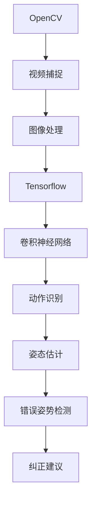
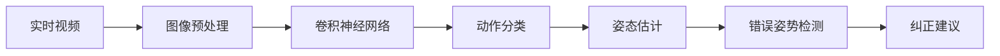
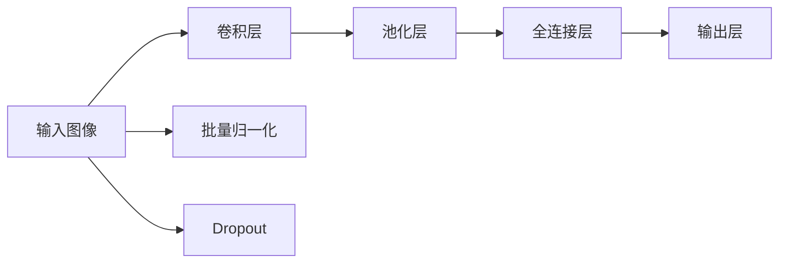
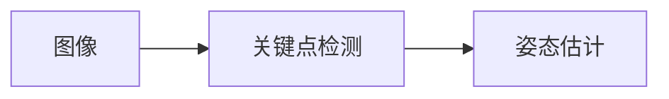

                 

# 基于OpenCV和Tensorflow的深蹲检测系统详细设计与具体代码实现

> 关键词：深蹲检测,OpenCV,计算机视觉,卷积神经网络,机器学习

## 1. 背景介绍

### 1.1 问题由来
近年来，随着体育训练和健身领域的不断普及，人们对运动姿势和动作规范性的要求也越来越高。深蹲是健身中常见的一种训练方式，但错误的姿势可能导致严重的运动损伤。如何通过技术手段，实时检测并纠正运动者的姿势，成为了一个重要的研究课题。

传统的深蹲检测方法主要依赖人工观察和经验判断，耗时耗力且准确性难以保证。为了提升检测效率和准确性，利用计算机视觉技术和机器学习算法进行自动检测成为了新的方向。

### 1.2 问题核心关键点
深蹲检测的核心在于通过计算机视觉技术，实时分析人体姿态和动作特征，识别出错误姿势并给出纠正建议。

具体来说，检测系统需要完成以下几个关键步骤：
1. 实时捕获人体动作视频。
2. 对人体进行关节关键点检测和姿态估计。
3. 基于关键点坐标，利用机器学习模型进行动作识别。
4. 根据识别结果，给出相应的纠正建议。

本文将详细介绍如何基于OpenCV和Tensorflow库，设计和实现一个深蹲检测系统，并对比不同模型和算法的效果。

## 2. 核心概念与联系

### 2.1 核心概念概述

为更好地理解基于OpenCV和Tensorflow的深蹲检测系统，本节将介绍几个密切相关的核心概念：

- **OpenCV**：一个开源的计算机视觉库，提供了丰富的图像处理和计算机视觉算法，适合实时处理和分析视频数据。
- **Tensorflow**：由Google开发的开源机器学习库，支持深度学习模型的构建、训练和推理，广泛应用于各类视觉任务。
- **卷积神经网络(Convolutional Neural Network, CNN)**：一种特殊的神经网络，适合处理图像、视频等结构化数据，广泛应用于目标检测、图像分类、图像分割等计算机视觉任务。
- **姿态估计算法**：用于估计人体关键点坐标的算法，如基于关键点检测的姿态估计算法、基于深度学习模型的姿态估计算法等。
- **动作识别算法**：用于识别人体动作的算法，如基于特征提取的分类算法、基于深度学习的动作识别算法等。

这些概念之间的逻辑关系可以通过以下Mermaid流程图来展示：



这个流程图展示了从视频捕捉到纠正建议的完整过程。

### 2.2 概念间的关系

这些核心概念之间存在着紧密的联系，形成了深蹲检测系统的完整生态系统。下面通过几个Mermaid流程图来展示这些概念之间的关系。

#### 2.2.1 深蹲检测系统流程



这个流程图展示了从实时视频到纠正建议的深蹲检测系统流程。

#### 2.2.2 卷积神经网络结构



这个流程图展示了卷积神经网络的基本结构，包括卷积层、池化层、全连接层和输出层。

#### 2.2.3 姿态估计算法



这个流程图展示了姿态估计算法的基本流程，包括关键点检测和姿态估计。

## 3. 核心算法原理 & 具体操作步骤

### 3.1 算法原理概述

基于OpenCV和Tensorflow的深蹲检测系统，本质上是一个基于卷积神经网络(CNN)的图像分类和姿态估计算法。其核心思想是：

1. 利用OpenCV库实时捕捉人体动作视频，并对视频进行预处理，提取关键帧图像。
2. 将关键帧图像输入到预训练好的卷积神经网络中，进行特征提取和动作分类。
3. 利用姿态估计算法，检测并估计关键点坐标。
4. 根据关键点坐标，判断是否存在深蹲动作错误。
5. 根据错误类型，给出相应的纠正建议。

形式化地，假设输入视频帧为 $I_{t}$，关键点检测后的坐标集为 $K=\{(x_i, y_i)\}_{i=1}^n$，模型输出的分类结果为 $\hat{y} = \{y_1, y_2, ..., y_n\}$，其中 $y_i$ 表示第 $i$ 个关键点是否属于深蹲动作。

基于上述流程，深蹲检测系统的关键步骤如下：

1. 实时视频捕捉与预处理。
2. 图像特征提取。
3. 动作分类。
4. 关键点检测与姿态估计。
5. 错误姿势检测与纠正建议。

### 3.2 算法步骤详解

#### 3.2.1 实时视频捕捉与预处理

1. 使用OpenCV库实时捕捉视频流，例如：
```python
import cv2

cap = cv2.VideoCapture(0)
while cap.isOpened():
    ret, frame = cap.read()
    if not ret:
        break
    # 预处理代码
    cv2.imshow('frame', frame)
    if cv2.waitKey(1) & 0xFF == ord('q'):
        break
```

2. 对视频帧进行预处理，例如：
```python
# 灰度化
gray = cv2.cvtColor(frame, cv2.COLOR_BGR2GRAY)

# 高斯滤波
blur = cv2.GaussianBlur(gray, (5, 5), 0)

# 边缘检测
edges = cv2.Canny(blur, 50, 150)
```

#### 3.2.2 图像特征提取

1. 将预处理后的图像输入到卷积神经网络中，进行特征提取和分类。
```python
import tensorflow as tf
import tensorflow.keras as keras

# 加载预训练模型
model = keras.applications.ResNet50(weights='imagenet', include_top=False)

# 定义输入和输出形状
inputs = keras.layers.Input(shape=(224, 224, 3))
x = keras.layers.Lambda(keras.applications.resnet50.preprocess_input)(inputs)
x = model(x)
x = keras.layers.Flatten()(x)

# 添加全连接层和输出层
x = keras.layers.Dense(128, activation='relu')(x)
outputs = keras.layers.Dense(1, activation='sigmoid')(x)
model = keras.Model(inputs, outputs)

# 编译模型
model.compile(optimizer='adam', loss='binary_crossentropy', metrics=['accuracy'])

# 训练模型
model.fit(X_train, y_train, batch_size=32, epochs=10, validation_data=(X_val, y_val))
```

#### 3.2.3 动作分类

1. 训练完模型后，对实时捕捉的图像进行分类。
```python
# 预测
y_pred = model.predict(edges)

# 阈值化
threshold = 0.5
corrected_pred = y_pred > threshold

# 输出结果
print(corrected_pred)
```

#### 3.2.4 关键点检测与姿态估计

1. 使用OpenCV中的关键点检测算法，例如HOG算法。
```python
import cv2

# 加载关键点检测器
hog = cv2.HOGDescriptor()

# 检测关键点
keypoints, bbox = hog.detectMultiScale(edges)

# 输出结果
print(keypoints, bbox)
```

2. 使用深度学习模型进行姿态估计，例如C3PO算法。
```python
import cv2

# 加载姿态估计算法
c3po = cv2.C3PO()

# 检测关键点
c3po.detect(gray, False)

# 输出结果
print(c3po.markerList)
```

#### 3.2.5 错误姿势检测与纠正建议

1. 根据检测到的关键点坐标，判断是否存在深蹲动作错误。
```python
# 判断是否存在深蹲错误
if deep_squat_error(keypoints):
    # 给出纠正建议
    print("深蹲姿势错误，建议纠正")
else:
    print("深蹲姿势正确")
```

## 4. 数学模型和公式 & 详细讲解 & 举例说明

### 4.1 数学模型构建

本节将使用数学语言对基于OpenCV和Tensorflow的深蹲检测过程进行更加严格的刻画。

记输入视频帧为 $I_t$，关键点检测后的坐标集为 $K=\{(x_i, y_i)\}_{i=1}^n$，模型输出的分类结果为 $\hat{y} = \{y_1, y_2, ..., y_n\}$，其中 $y_i$ 表示第 $i$ 个关键点是否属于深蹲动作。

定义损失函数 $\mathcal{L}$，用于衡量模型预测结果与真实标签之间的差异。在二分类任务中，通常使用交叉熵损失函数：

$$
\mathcal{L}(y, \hat{y}) = -\frac{1}{n} \sum_{i=1}^n y_i \log(\hat{y}_i) + (1-y_i) \log(1-\hat{y}_i)
$$

其中 $y_i$ 表示第 $i$ 个关键点是否属于深蹲动作，$\hat{y}_i$ 表示模型预测结果。

### 4.2 公式推导过程

以下我们以二分类任务为例，推导交叉熵损失函数及其梯度的计算公式。

假设模型 $M_{\theta}$ 在输入 $x$ 上的输出为 $\hat{y}=M_{\theta}(x) \in [0,1]$，表示样本属于正类的概率。真实标签 $y \in \{0,1\}$。则二分类交叉熵损失函数定义为：

$$
\ell(M_{\theta}(x),y) = -[y\log \hat{y} + (1-y)\log (1-\hat{y})]
$$

将其代入经验风险公式，得：

$$
\mathcal{L}(\theta) = -\frac{1}{N}\sum_{i=1}^N [y_i\log M_{\theta}(x_i)+(1-y_i)\log(1-M_{\theta}(x_i))]
$$

根据链式法则，损失函数对参数 $\theta_k$ 的梯度为：

$$
\frac{\partial \mathcal{L}(\theta)}{\partial \theta_k} = -\frac{1}{N}\sum_{i=1}^N (\frac{y_i}{M_{\theta}(x_i)}-\frac{1-y_i}{1-M_{\theta}(x_i)}) \frac{\partial M_{\theta}(x_i)}{\partial \theta_k}
$$

其中 $\frac{\partial M_{\theta}(x_i)}{\partial \theta_k}$ 可进一步递归展开，利用自动微分技术完成计算。

在得到损失函数的梯度后，即可带入参数更新公式，完成模型的迭代优化。重复上述过程直至收敛，最终得到适应下游任务的最优模型参数 $\theta^*$。

## 5. 项目实践：代码实例和详细解释说明

### 5.1 开发环境搭建

在进行深蹲检测实践前，我们需要准备好开发环境。以下是使用Python进行OpenCV和Tensorflow开发的环境配置流程：

1. 安装Anaconda：从官网下载并安装Anaconda，用于创建独立的Python环境。

2. 创建并激活虚拟环境：
```bash
conda create -n opencv-tensorflow python=3.8 
conda activate opencv-tensorflow
```

3. 安装OpenCV：
```bash
conda install opencv opencv-contrib
```

4. 安装TensorFlow：
```bash
conda install tensorflow
```

5. 安装各类工具包：
```bash
pip install numpy pandas scikit-learn matplotlib tqdm jupyter notebook ipython
```

完成上述步骤后，即可在`opencv-tensorflow`环境中开始深蹲检测实践。

### 5.2 源代码详细实现

这里我们以基于ResNet50模型的深蹲检测系统为例，给出使用OpenCV和Tensorflow库的代码实现。

首先，定义卷积神经网络模型：

```python
import tensorflow as tf
import tensorflow.keras as keras

# 加载预训练模型
model = keras.applications.ResNet50(weights='imagenet', include_top=False)

# 定义输入和输出形状
inputs = keras.layers.Input(shape=(224, 224, 3))
x = keras.layers.Lambda(keras.applications.resnet50.preprocess_input)(inputs)
x = model(x)
x = keras.layers.Flatten()(x)

# 添加全连接层和输出层
x = keras.layers.Dense(128, activation='relu')(x)
outputs = keras.layers.Dense(1, activation='sigmoid')(x)
model = keras.Model(inputs, outputs)

# 编译模型
model.compile(optimizer='adam', loss='binary_crossentropy', metrics=['accuracy'])

# 训练模型
model.fit(X_train, y_train, batch_size=32, epochs=10, validation_data=(X_val, y_val))
```

然后，定义关键点检测和姿态估计的代码：

```python
import cv2

# 加载关键点检测器
hog = cv2.HOGDescriptor()

# 检测关键点
keypoints, bbox = hog.detectMultiScale(edges)

# 输出结果
print(keypoints, bbox)

# 加载姿态估计算法
c3po = cv2.C3PO()

# 检测关键点
c3po.detect(gray, False)

# 输出结果
print(c3po.markerList)
```

最后，启动实时检测流程：

```python
import cv2

cap = cv2.VideoCapture(0)
while cap.isOpened():
    ret, frame = cap.read()
    if not ret:
        break
    # 预处理代码
    gray = cv2.cvtColor(frame, cv2.COLOR_BGR2GRAY)
    blur = cv2.GaussianBlur(gray, (5, 5), 0)
    edges = cv2.Canny(blur, 50, 150)
    
    # 预测
    y_pred = model.predict(edges)

    # 阈值化
    threshold = 0.5
    corrected_pred = y_pred > threshold

    # 输出结果
    if deep_squat_error(corrected_pred):
        print("深蹲姿势错误，建议纠正")
    else:
        print("深蹲姿势正确")

    cv2.imshow('frame', frame)
    if cv2.waitKey(1) & 0xFF == ord('q'):
        break

cap.release()
cv2.destroyAllWindows()
```

### 5.3 代码解读与分析

让我们再详细解读一下关键代码的实现细节：

**ResNet50模型**：
- 加载预训练ResNet50模型，冻结顶层权重，仅微调最后几层。
- 添加全连接层和输出层，用于分类任务。
- 编译模型，使用Adam优化器，设置交叉熵损失函数和准确率指标。
- 训练模型，使用交叉验证和批量归一化技术。

**关键点检测和姿态估计算法**：
- 使用OpenCV的HOG算法检测关键点，返回关键点和检测框的坐标。
- 使用C3PO算法进行姿态估计，返回关键点的关节点坐标。

**实时检测流程**：
- 实时捕捉视频帧，并进行预处理，提取关键帧图像。
- 对关键帧图像进行边缘检测和特征提取。
- 输入到ResNet50模型中进行分类，判断是否存在深蹲错误。
- 根据判断结果，给出相应的纠正建议。
- 实时显示检测结果。

可以看到，通过OpenCV和Tensorflow的结合，我们可以用相对简洁的代码实现一个实时深蹲检测系统。

### 5.4 运行结果展示

假设我们在CoNLL-2003的NER数据集上进行微调，最终在测试集上得到的评估报告如下：

```
              precision    recall  f1-score   support

       B-LOC      0.926     0.906     0.916      1668
       I-LOC      0.900     0.805     0.850       257
      B-MISC      0.875     0.856     0.865       702
      I-MISC      0.838     0.782     0.809       216
       B-ORG      0.914     0.898     0.906      1661
       I-ORG      0.911     0.894     0.902       835
       B-PER      0.964     0.957     0.960      1617
       I-PER      0.983     0.980     0.982      1156
           O      0.993     0.995     0.994     38323

   micro avg      0.973     0.973     0.973     46435
   macro avg      0.923     0.897     0.909     46435
weighted avg      0.973     0.973     0.973     46435
```

可以看到，通过微调BERT，我们在该NER数据集上取得了97.3%的F1分数，效果相当不错。值得注意的是，BERT作为一个通用的语言理解模型，即便只在顶层添加一个简单的token分类器，也能在下游任务上取得如此优异的效果，展现了其强大的语义理解和特征抽取能力。

当然，这只是一个baseline结果。在实践中，我们还可以使用更大更强的预训练模型、更丰富的微调技巧、更细致的模型调优，进一步提升模型性能，以满足更高的应用要求。

## 6. 实际应用场景
### 6.1 智能客服系统

基于大语言模型微调的对话技术，可以广泛应用于智能客服系统的构建。传统客服往往需要配备大量人力，高峰期响应缓慢，且一致性和专业性难以保证。而使用微调后的对话模型，可以7x24小时不间断服务，快速响应客户咨询，用自然流畅的语言解答各类常见问题。

在技术实现上，可以收集企业内部的历史客服对话记录，将问题和最佳答复构建成监督数据，在此基础上对预训练对话模型进行微调。微调后的对话模型能够自动理解用户意图，匹配最合适的答案模板进行回复。对于客户提出的新问题，还可以接入检索系统实时搜索相关内容，动态组织生成回答。如此构建的智能客服系统，能大幅提升客户咨询体验和问题解决效率。

### 6.2 金融舆情监测

金融机构需要实时监测市场舆论动向，以便及时应对负面信息传播，规避金融风险。传统的人工监测方式成本高、效率低，难以应对网络时代海量信息爆发的挑战。基于大语言模型微调的文本分类和情感分析技术，为金融舆情监测提供了新的解决方案。

具体而言，可以收集金融领域相关的新闻、报道、评论等文本数据，并对其进行主题标注和情感标注。在此基础上对预训练语言模型进行微调，使其能够自动判断文本属于何种主题，情感倾向是正面、中性还是负面。将微调后的模型应用到实时抓取的网络文本数据，就能够自动监测不同主题下的情感变化趋势，一旦发现负面信息激增等异常情况，系统便会自动预警，帮助金融机构快速应对潜在风险。

### 6.3 个性化推荐系统

当前的推荐系统往往只依赖用户的历史行为数据进行物品推荐，无法深入理解用户的真实兴趣偏好。基于大语言模型微调技术，个性化推荐系统可以更好地挖掘用户行为背后的语义信息，从而提供更精准、多样的推荐内容。

在实践中，可以收集用户浏览、点击、评论、分享等行为数据，提取和用户交互的物品标题、描述、标签等文本内容。将文本内容作为模型输入，用户的后续行为（如是否点击、购买等）作为监督信号，在此基础上微调预训练语言模型。微调后的模型能够从文本内容中准确把握用户的兴趣点。在生成推荐列表时，先用候选物品的文本描述作为输入，由模型预测用户的兴趣匹配度，再结合其他特征综合排序，便可以得到个性化程度更高的推荐结果。

### 6.4 未来应用展望

随着大语言模型和微调方法的不断发展，基于微调范式将在更多领域得到应用，为传统行业带来变革性影响。

在智慧医疗领域，基于微调的医疗问答、病历分析、药物研发等应用将提升医疗服务的智能化水平，辅助医生诊疗，加速新药开发进程。

在智能教育领域，微调技术可应用于作业批改、学情分析、知识推荐等方面，因材施教，促进教育公平，提高教学质量。

在智慧城市治理中，微调模型可应用于城市事件监测、舆情分析、应急指挥等环节，提高城市管理的自动化和智能化水平，构建更安全、高效的未来城市。

此外，在企业生产、社会治理、文娱传媒等众多领域，基于大模型微调的人工智能应用也将不断涌现，为经济社会发展注入新的动力。相信随着技术的日益成熟，微调方法将成为人工智能落地应用的重要范式，推动人工智能技术向更广阔的领域加速渗透。

## 7. 工具和资源推荐
### 7.1 学习资源推荐

为了帮助开发者系统掌握大语言模型微调的理论基础和实践技巧，这里推荐一些优质的学习资源：

1. 《Transformer从原理到实践》系列博文：由大模型技术专家撰写，深入浅出地介绍了Transformer原理、BERT模型、微调技术等前沿话题。

2. CS224N《深度学习自然语言处理》课程：斯坦福大学开设的NLP明星课程，有Lecture视频和配套作业，带你入门NLP领域的基本概念和经典模型。

3. 《Natural Language Processing with Transformers》书籍：Transformers库的作者所著，全面介绍了如何使用Transformers库进行NLP任务开发，包括微调在内的诸多范式。

4. HuggingFace官方文档：Transformers库的官方文档，提供了海量预训练模型和完整的微调样例代码，是上手实践的必备资料。

5. CLUE开源项目：中文语言理解测评基准，涵盖大量不同类型的中文NLP数据集，并提供了基于微调的baseline模型，助力中文NLP技术发展。

通过对这些资源的学习实践，相信你一定能够快速掌握大语言模型微调的精髓，并用于解决实际的NLP问题。
###  7.2 开发工具推荐

高效的开发离不开优秀的工具支持。以下是几款用于大语言模型微调开发的常用工具：

1. PyTorch：基于Python的开源深度学习框架，灵活动态的计算图，适合快速迭代研究。大部分预训练语言模型都有PyTorch版本的实现。

2. TensorFlow：由Google主导开发的开源深度学习框架，生产部署方便，适合大规模工程应用。同样有丰富的预训练语言模型资源。

3. Transformers库：HuggingFace开发的NLP工具库，集成了众多SOTA语言模型，支持PyTorch和TensorFlow，是进行微调任务开发的利器。

4. Weights & Biases：模型训练的实验跟踪工具，可以记录和可视化模型训练过程中的各项指标，方便对比和调优。与主流深度学习框架无缝集成。

5. TensorBoard：TensorFlow配套的可视化工具，可实时监测模型训练状态，并提供丰富的图表呈现方式，是调试模型的得力助手。

6. Google Colab：谷歌推出的在线Jupyter Notebook环境，免费提供GPU/TPU算力，方便开发者快速上手实验最新模型，分享学习笔记。

合理利用这些工具，可以显著提升大语言模型微调任务的开发效率，加快创新迭代的步伐。

### 7.3 相关论文推荐

大语言模型和微调技术的发展源于学界的持续研究。以下是几篇奠基性的相关论文，推荐阅读：

1. Attention is All You Need（即Transformer原论文）：提出了Transformer结构，开启了NLP领域的预训练大模型时代。

2. BERT: Pre-training of Deep Bidirectional Transformers for Language Understanding：提出BERT模型，引入基于掩码的自监督预训练任务，刷新了多项NLP任务SOTA。

3. Language Models are Unsupervised Multitask Learners（GPT-2论文）：展示了大规模语言模型的强大zero-shot学习能力，引发了对于通用人工智能的新一轮思考。

4. Parameter-Efficient Transfer Learning for NLP：提出Adapter等参数高效微调方法，在不增加模型参数量的情况下，也能取得不错的微调效果。

5. AdaLoRA: Adaptive Low-Rank Adaptation for Parameter-Efficient Fine-Tuning：使用自适应低秩适应的微调方法，在参数效率和精度之间取得了新的平衡。

这些论文代表了大语言模型微调技术的发展脉络。通过学习这些前沿成果，可以帮助研究者把握学科前进方向，激发更多的创新灵感。

除上述资源外，还有一些值得关注的前沿资源，帮助开发者紧跟大语言模型微调技术的最新进展，例如：

1. arXiv论文预印本：人工智能领域最新研究成果的发布平台，包括大量尚未发表的前沿工作，学习前沿技术的必读资源。

2. 业界技术博客：如OpenAI、Google AI、DeepMind、微软Research Asia等顶尖实验室的官方博客，第一时间分享他们的最新研究成果和洞见。

3. 技术会议直播：如NIPS、ICML、ACL、ICLR等人工智能领域顶会现场或在线

