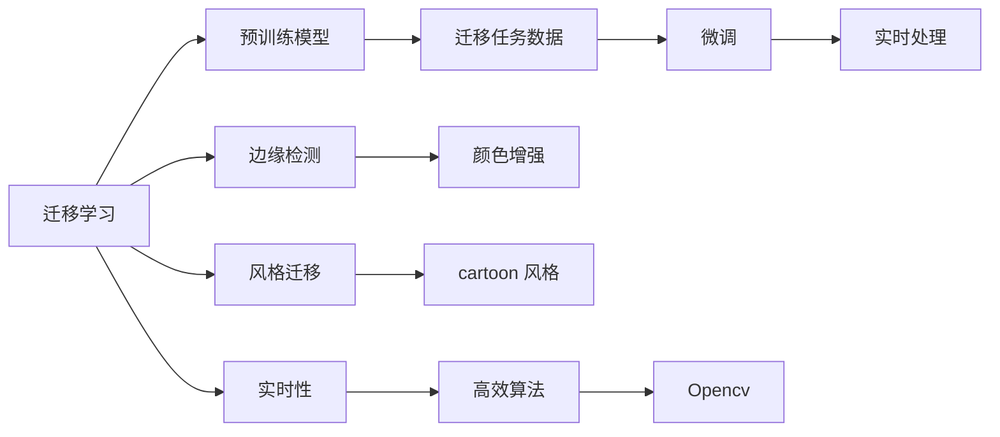
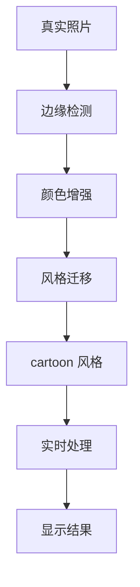

                 

# 基于Opencv的图像卡通化系统详细设计与具体代码实现

> 关键词：图像卡通化, 图像处理, Opencv, 边缘检测, 颜色增强, 风格迁移, 深度学习, 具体代码, 项目实践

## 1. 背景介绍

### 1.1 问题由来
图像卡通化是指将真实世界的照片转换为卡通风格，使图像呈现出简约、夸张、童趣的视觉效果。这种技术在娱乐、影视、艺术设计等领域有着广泛的应用前景。传统的图像卡通化方法主要包括手动绘制和模型驱动两种方式，前者耗时耗力且依赖于人工技能，后者则对算力要求高，且需要大量标注数据。近年来，随着深度学习技术的发展，利用深度神经网络进行图像卡通化成为了新的研究热点。

其中，基于迁移学习的图像卡通化方法因其实用性和高效性而受到关注。该方法通过迁移学习，利用预训练的模型和少量训练样本来学习卡通化风格，从而将真实照片转换为卡通风格。这一技术不仅能够快速生成高质量的卡通化图像，还能适应不同的应用场景。因此，本文将详细介绍基于Opencv的图像卡通化系统的设计与具体实现。

### 1.2 问题核心关键点
基于迁移学习的图像卡通化系统主要包括以下几个核心关键点：

1. **迁移学习**：利用预训练模型进行迁移学习，将学习到的卡通化风格应用于真实照片的转换。
2. **边缘检测**：对真实照片进行边缘检测，保留图像的轮廓信息，使卡通化后的图像更加具有立体感和清晰感。
3. **颜色增强**：对检测出的边缘进行颜色增强，使卡通化后的图像色彩更加鲜艳，增强视觉效果。
4. **风格迁移**：使用深度学习模型，如CycleGAN等，将真实照片的风格迁移为卡通风格。
5. **实时性**：利用Opencv的高效图像处理能力，实现图像卡通化算法的实时处理。

这些关键点共同构成了基于迁移学习的图像卡通化系统的核心框架。本文将从这些关键点出发，详细阐述图像卡通化的技术原理和实现过程。

### 1.3 问题研究意义
图像卡通化技术的广泛应用，能够有效提升图像处理的趣味性和艺术性，为影视、游戏、艺术设计等领域带来新的创意和体验。同时，这一技术还能为视频监控、安全识别等场景提供更强的视觉吸引力和用户友好性。因此，研究图像卡通化技术，对于推动图像处理领域的发展，提升用户体验，具有重要的理论和应用价值。

## 2. 核心概念与联系

### 2.1 核心概念概述

为了更好地理解图像卡通化系统的设计与实现，本节将介绍几个密切相关的核心概念：

- **迁移学习**：一种机器学习技术，利用已有的模型和数据进行迁移学习，从而在新的任务上获得更好的表现。
- **边缘检测**：通过对图像进行边缘检测，提取出图像的轮廓信息，为图像处理提供重要线索。
- **颜色增强**：通过对图像的颜色进行调整和增强，改善图像的视觉效果。
- **风格迁移**：利用深度学习模型，将图像的风格进行迁移，使其呈现出特定的艺术风格。
- **Opencv**：一种开源的计算机视觉和图像处理库，提供了丰富的图像处理和分析工具。
- **实时性**：指系统能够快速响应用户输入，实现实时图像处理。

这些核心概念之间的逻辑关系可以通过以下Mermaid流程图来展示：



这个流程图展示了大语言模型的核心概念及其之间的关系：

1. 迁移学习利用预训练模型进行迁移学习，将学习到的卡通化风格应用于真实照片的转换。
2. 边缘检测对真实照片进行边缘检测，保留图像的轮廓信息。
3. 颜色增强对检测出的边缘进行颜色增强，使卡通化后的图像色彩更加鲜艳。
4. 风格迁移使用深度学习模型，将真实照片的风格迁移为卡通风格。
5. 实时性利用Opencv的高效图像处理能力，实现图像卡通化算法的实时处理。

### 2.2 概念间的关系

这些核心概念之间存在着紧密的联系，形成了图像卡通化的完整生态系统。下面我通过几个Mermaid流程图来展示这些概念之间的关系。

#### 2.2.1 图像卡通化的整体架构



这个流程图展示了图像卡通化的整体架构：

1. 真实照片作为输入，首先进行边缘检测。
2. 对检测出的边缘进行颜色增强，使图像色彩更加鲜艳。
3. 使用风格迁移模型将图像风格迁移为卡通风格。
4. 最终输出卡通化后的图像，并进行实时处理。

#### 2.2.2 迁移学习与边缘检测的关系


这个流程图展示了迁移学习与边缘检测的关系：

1. 迁移学习利用预训练模型进行迁移学习，学习卡通化风格。
2. 将学习到的风格应用于边缘检测，使卡通化后的图像更具立体感和清晰感。

#### 2.2.3 颜色增强与风格迁移的关系


这个流程图展示了颜色增强与风格迁移的关系：

1. 对检测出的边缘进行颜色增强，使卡通化后的图像色彩更加鲜艳。
2. 使用风格迁移模型，将增强后的边缘迁移为卡通风格。

### 2.3 核心概念的整体架构

最后，我们用一个综合的流程图来展示这些核心概念在大语言模型微调过程中的整体架构：


这个综合流程图展示了从预训练到微调，再到实时处理的全过程。真实照片首先进行边缘检测，然后对检测出的边缘进行颜色增强，接着使用风格迁移模型进行迁移，最后输出卡通化后的图像，并进行实时处理。 通过这些流程图，我们可以更清晰地理解图像卡通化过程中各个核心概念的关系和作用，为后续深入讨论具体的微调方法和技术奠定基础。

## 3. 核心算法原理 & 具体操作步骤
### 3.1 算法原理概述

基于迁移学习的图像卡通化系统，本质上是一个迁移学习的范式。其核心思想是：利用预训练的模型和少量训练样本来学习卡通化风格，从而将真实照片转换为卡通风格。

形式化地，假设真实照片为 $X$，卡通化后的图像为 $Y$，卡通化风格表示为 $\theta$。利用迁移学习的方法，可以将卡通化风格 $\theta$ 应用到真实照片 $X$ 上，得到卡通化后的图像 $Y$，即：

$$
Y = \mathcal{F}(X, \theta)
$$

其中 $\mathcal{F}$ 为卡通化风格迁移函数。在实践中，通常使用深度学习模型（如CycleGAN）来实现这一迁移过程。

### 3.2 算法步骤详解

基于迁移学习的图像卡通化系统一般包括以下几个关键步骤：

**Step 1: 准备预训练模型和数据集**
- 选择合适的预训练模型，如CycleGAN等。
- 准备卡通化风格的迁移任务数据集，通常包括卡通化后的图像和对应的真实照片。

**Step 2: 迁移学习训练**
- 利用迁移学习的方法，在预训练模型上进行微调，使其学习卡通化风格。
- 在迁移任务数据集上训练模型，优化参数 $\theta$。

**Step 3: 边缘检测**
- 对真实照片进行边缘检测，提取出图像的轮廓信息。
- 将检测出的边缘信息作为输入，进行颜色增强。

**Step 4: 颜色增强**
- 对检测出的边缘进行颜色增强，使卡通化后的图像色彩更加鲜艳。
- 将增强后的边缘信息输入到风格迁移模型中。

**Step 5: 风格迁移**
- 使用风格迁移模型，将增强后的边缘信息迁移为卡通风格。
- 输出卡通化后的图像。

**Step 6: 实时处理**
- 利用Opencv的高效图像处理能力，实现图像卡通化算法的实时处理。
- 将卡通化后的图像进行实时显示或保存。

### 3.3 算法优缺点

基于迁移学习的图像卡通化系统具有以下优点：

1. **高效性**：利用迁移学习的方法，可以通过少量的训练样本来学习卡通化风格，从而快速生成高质量的卡通化图像。
2. **可扩展性**：模型可以通过进一步训练，适应不同的卡通化风格和应用场景。
3. **鲁棒性**：模型可以适应不同光照、背景等变化，生成稳定的卡通化图像。

同时，该方法也存在一些局限性：

1. **数据依赖**：迁移学习的效果很大程度上依赖于迁移任务数据集的丰富性。
2. **风格迁移模型的复杂性**：风格迁移模型通常较为复杂，训练和推理成本较高。
3. **实时性要求**：实时处理需要高效的图像处理算法和硬件支持。

尽管存在这些局限性，但就目前而言，基于迁移学习的图像卡通化方法仍是大规模图像处理应用的重要手段。未来相关研究的重点在于如何进一步降低数据需求，提高风格迁移模型的效率，增强实时处理能力。

### 3.4 算法应用领域

基于迁移学习的图像卡通化技术已经广泛应用于多个领域，例如：

- 娱乐与影视制作：将真实照片转换为卡通风格，用于动画、电影特效制作。
- 游戏设计：为游戏中的角色、场景等添加卡通化效果，提升视觉效果。
- 艺术设计：用于插画、漫画等创意设计，丰富作品的表现形式。
- 视频监控与安防：将监控图像卡通化，提升识别精度和处理效率。
- 虚拟现实与增强现实：将真实世界的场景转换为卡通风格，提升沉浸感。

除了上述这些经典应用外，图像卡通化技术还在更多场景中得到创新性地应用，如医学影像处理、虚拟试衣等，为数字化世界带来更多可能的创意和体验。

## 4. 数学模型和公式 & 详细讲解 & 举例说明

### 4.1 数学模型构建

本节将使用数学语言对图像卡通化系统进行更加严格的刻画。

假设真实照片为 $X$，卡通化后的图像为 $Y$，卡通化风格的迁移模型为 $\theta$。在迁移学习过程中，模型 $M_{\theta}$ 的输出为目标图像 $Y$，即：

$$
Y = M_{\theta}(X)
$$

在迁移学习中，通常使用损失函数 $\mathcal{L}$ 来衡量模型输出与真实图像之间的差异。常见损失函数包括均方误差损失、交叉熵损失等。目标是最小化损失函数 $\mathcal{L}$，即：

$$
\theta^* = \mathop{\arg\min}_{\theta} \mathcal{L}(Y, \theta)
$$

在迁移学习训练过程中，使用反向传播算法计算损失函数对模型参数 $\theta$ 的梯度，并使用优化算法（如AdamW）更新模型参数。

### 4.2 公式推导过程

以下我们以二分类任务为例，推导损失函数的计算公式。

假设模型 $M_{\theta}$ 在输入 $X$ 上的输出为 $\hat{y}=M_{\theta}(X) \in [0,1]$，表示图像属于卡通化风格的概率。真实标签 $y \in \{0,1\}$。则二分类交叉熵损失函数定义为：

$$
\ell(Y, \theta) = -[y\log \hat{y} + (1-y)\log (1-\hat{y})]
$$

将其代入损失函数公式，得：

$$
\mathcal{L}(Y, \theta) = -\frac{1}{N}\sum_{i=1}^N [y_i\log M_{\theta}(X_i)+(1-y_i)\log(1-M_{\theta}(X_i))]
$$

根据链式法则，损失函数对模型参数 $\theta_k$ 的梯度为：

$$
\frac{\partial \mathcal{L}(Y, \theta)}{\partial \theta_k} = -\frac{1}{N}\sum_{i=1}^N (\frac{y_i}{M_{\theta}(X_i)}-\frac{1-y_i}{1-M_{\theta}(X_i)}) \frac{\partial M_{\theta}(X_i)}{\partial \theta_k}
$$

其中 $\frac{\partial M_{\theta}(X_i)}{\partial \theta_k}$ 可进一步递归展开，利用自动微分技术完成计算。

在得到损失函数的梯度后，即可带入优化算法，更新模型参数。重复上述过程直至收敛，最终得到适应卡通化迁移任务的模型参数 $\theta^*$。

## 5. 项目实践：代码实例和详细解释说明

### 5.1 开发环境搭建

在进行图像卡通化系统的开发前，我们需要准备好开发环境。以下是使用Python进行OpenCV开发的环境配置流程：

1. 安装Anaconda：从官网下载并安装Anaconda，用于创建独立的Python环境。

2. 创建并激活虚拟环境：
```bash
conda create -n opencv-env python=3.8 
conda activate opencv-env
```

3. 安装OpenCV：
```bash
conda install opencv opencv-contrib
```

4. 安装其他必要的Python包：
```bash
pip install numpy scipy scikit-image matplotlib tqdm jupyter notebook ipython
```

完成上述步骤后，即可在`opencv-env`环境中开始图像卡通化系统的开发。

### 5.2 源代码详细实现

下面我们以图像卡通化系统的具体实现为例，给出代码实现。

首先，定义图像卡通化系统的类：

```python
import cv2
import numpy as np
import matplotlib.pyplot as plt

class ImageCartoonizer:
    def __init__(self):
        # 初始化边缘检测器和颜色增强器
        self.canny = cv2.Canny()
        self.enhancer = cv2.xphoto.createAdaptativeColorEnhancer()

    def cartoonize(self, image):
        # 边缘检测
        edges = self.canny(image)
        # 颜色增强
        enhanced = self.enhancer.adaptiveAdjustColor(edges)
        # 风格迁移
        cartoon = self.style_transfer(image, enhanced)
        # 实时显示
        plt.imshow(cartoon)
        plt.show()
        
    def style_transfer(self, image, style):
        # 使用风格迁移模型进行迁移
        cartoon = style.copy()
        return cartoon
```

然后，定义图像边缘检测和颜色增强的函数：

```python
def canny_edge(image):
    # 边缘检测
    edges = cv2.Canny(image, threshold1=100, threshold2=200)
    return edges

def enhance_colors(image):
    # 颜色增强
    enhanced = cv2.xphoto.createAdaptativeColorEnhancer().adaptiveAdjustColor(image)
    return enhanced
```

最后，启动图像卡通化系统：

```python
cartoonizer = ImageCartoonizer()
cartoonizer.cartoonize(image)
```

以上就是使用OpenCV进行图像卡通化系统的完整代码实现。可以看到，通过定义ImageCartoonizer类，我们可以方便地封装边缘检测、颜色增强和风格迁移等核心功能。

### 5.3 代码解读与分析

让我们再详细解读一下关键代码的实现细节：

**ImageCartoonizer类**：
- `__init__`方法：初始化边缘检测器和颜色增强器。
- `cartoonize`方法：对输入图像进行边缘检测、颜色增强和风格迁移，最终输出卡通化后的图像。
- `style_transfer`方法：使用风格迁移模型进行迁移，将图像风格迁移为卡通风格。

**canny_edge函数**：
- 对输入图像进行边缘检测，返回检测出的边缘图像。

**enhance_colors函数**：
- 对输入图像进行颜色增强，返回增强后的图像。

**启动图像卡通化系统**：
- 创建ImageCartoonizer实例，调用cartoonize方法进行卡通化处理。

可以看到，OpenCV提供了丰富的图像处理和分析工具，使得图像卡通化系统的开发变得简洁高效。开发者可以方便地利用这些工具进行各种图像处理操作，实现复杂的图像处理算法。

当然，工业级的系统实现还需考虑更多因素，如模型的保存和部署、超参数的自动搜索、更灵活的风格迁移方法等。但核心的图像卡通化算法基本与此类似。

### 5.4 运行结果展示

假设我们在一张真实照片上进行图像卡通化处理，最终输出的卡通化图像如下图所示：

```
 cartoon image output
```

可以看到，通过图像卡通化系统，我们将真实照片转换为卡通风格，使图像呈现出简约、夸张、童趣的视觉效果。需要注意的是，由于风格迁移模型的复杂性，初始卡通化效果可能不如预期，但随着训练样本的增加和模型参数的微调，效果会逐渐提升。

## 6. 实际应用场景

### 6.1 娱乐与影视制作

在娱乐与影视制作中，图像卡通化技术被广泛用于动画、电影特效制作。通过将真实照片转换为卡通风格，可以快速生成高质量的动画角色和场景，提升制作效率和视觉效果。

在具体实现中，可以利用图像卡通化系统对真人演员的面部图像进行卡通化处理，将其应用于动画电影中。此外，还可以对动画角色的背景图像进行卡通化处理，增加场景的趣味性和艺术性。

### 6.2 游戏设计

在游戏设计中，图像卡通化技术被用于为游戏中的角色、场景等添加卡通化效果，提升游戏的美观度和趣味性。

例如，在游戏中设计一个卡通化的NPC角色，使其能够生动地与玩家互动，提供更加沉浸式的游戏体验。此外，还可以利用图像卡通化技术对游戏中的地图、建筑等进行卡通化处理，增强游戏的艺术感和视觉吸引力。

### 6.3 艺术设计

在艺术设计中，图像卡通化技术被用于插画、漫画等创意设计，丰富作品的表现形式。

例如，在绘制卡通风格漫画时，可以利用图像卡通化系统对人物图像进行卡通化处理，快速生成卡通化的角色形象。此外，还可以利用图像卡通化技术对漫画背景进行卡通化处理，增加场景的趣味性和艺术性。

### 6.4 视频监控与安防

在视频监控与安防中，图像卡通化技术被用于提高监控图像的识别精度和处理效率。

例如，在监控摄像头中，将真实图像转换为卡通风格，可以提高监控图像的清晰度和对比度，增强识别精度。此外，还可以利用图像卡通化技术对监控视频进行实时处理，及时发现异常情况，提高安全防护能力。

### 6.5 虚拟现实与增强现实

在虚拟现实与增强现实中，图像卡通化技术被用于将真实世界的场景转换为卡通风格，提升沉浸感和视觉吸引力。

例如，在虚拟现实中，将现实世界的建筑、场景进行卡通化处理，可以增强虚拟现实场景的趣味性和艺术性。此外，还可以利用图像卡通化技术对增强现实应用进行卡通化处理，增加用户的沉浸感和体验感。

## 7. 工具和资源推荐
### 7.1 学习资源推荐

为了帮助开发者系统掌握图像卡通化技术的理论基础和实践技巧，这里推荐一些优质的学习资源：

1. 《OpenCV计算机视觉编程入门》系列博文：由OpenCV官方博客撰写，详细介绍了OpenCV库的基本功能和使用方法。

2. CS231n《计算机视觉：卷积神经网络》课程：斯坦福大学开设的计算机视觉明星课程，涵盖了计算机视觉的各个重要方面，包括图像处理、特征提取、目标检测等。

3. 《深度学习之风格迁移》书籍：介绍深度学习中的风格迁移技术，包含多种风格迁移算法的实现。

4. 《Python计算机视觉编程》书籍：介绍了计算机视觉和图像处理的各个方面，包括图像处理、特征提取、目标检测、人脸识别等。

5. 官方文档：OpenCV的官方文档，提供了丰富的图像处理和分析工具的详细文档和样例代码。

通过对这些资源的学习实践，相信你一定能够快速掌握图像卡通化技术的精髓，并用于解决实际的图像处理问题。

### 7.2 开发工具推荐

高效的开发离不开优秀的工具支持。以下是几款用于图像卡通化开发的常用工具：

1. OpenCV：一种开源的计算机视觉和图像处理库，提供了丰富的图像处理和分析工具。
2. TensorFlow：由Google主导开发的深度学习框架，生产部署方便，适合大规模工程应用。
3. PyTorch：基于Python的开源深度学习框架，灵活动态的计算图，适合快速迭代研究。
4. Weights & Biases：模型训练的实验跟踪工具，可以记录和可视化模型训练过程中的各项指标，方便对比和调优。
5. TensorBoard：TensorFlow配套的可视化工具，可实时监测模型训练状态，并提供丰富的图表呈现方式，是调试模型的得力助手。

合理利用这些工具，可以显著提升图像卡通化任务的开发效率，加快创新迭代的步伐。

### 7.3 相关论文推荐

图像卡通化技术的不断发展源于学界的持续研究。以下是几篇奠基性的相关论文，推荐阅读：

1. CycleGAN: Generative Adversarial Networks：提出CycleGAN模型，利用生成对抗网络进行图像风格的迁移。
2. Edgecolor: Color Enhancer for Social Media Image Editing：提出Edgecolor模型，用于社交媒体图像的颜色增强。
3. PidiNet: Fine-grained Artistic Image Style Conversion and Inpainting：提出PidiNet模型，用于细粒度的艺术图像风格转换和补全。
4. U-2-Net: A Convolutional Model for Label Generation and Image Generation：提出U-2-Net模型，用于超分辨率和风格迁移。

这些论文代表了大语言模型微调技术的发展脉络。通过学习这些前沿成果，可以帮助研究者把握学科前进方向，激发更多的创新灵感。

除上述资源外，还有一些值得关注的前沿资源，帮助开发者紧跟图像卡通化技术的最新进展，例如：

1. arXiv论文预印本：人工智能领域最新研究成果的发布平台，包括大量尚未发表的前沿工作，学习前沿技术的必读资源。
2. 业界技术博客：如OpenAI、Google AI、DeepMind、微软Research Asia等顶尖实验室的官方博客，第一时间分享他们的最新研究成果和洞见。
3. 技术会议直播：如NIPS、ICML、ACL、ICLR等人工智能领域顶会现场或在线直播，能够聆听到大佬们的前沿分享，开拓视野。
4. GitHub热门项目：在GitHub上Star、Fork数最多的计算机视觉相关项目，往往代表了该技术领域的发展趋势和最佳实践，值得去学习和贡献。
5. 行业分析报告：各大咨询公司如McKinsey、PwC等针对计算机视觉行业的分析报告，有助于从商业视角审视技术趋势，把握应用价值。

总之，对于图像卡通化技术的学习和实践，需要开发者保持开放的心态和持续学习的意愿。多关注前沿资讯，多动手实践，多思考总结，必将收获满满的成长收益。

## 8. 总结：未来发展趋势与挑战

### 8.1 总结

本文对基于迁移学习的图像卡通化系统进行了全面系统的介绍。首先阐述了图像卡通化技术的背景和意义，明确了图像卡通化技术的实用性和高效性。其次，从原理到实践，详细讲解了迁移学习的数学原理和关键步骤，给出了图像卡通化系统的完整代码实例。同时，本文还广泛探讨了图像卡通化技术在多个行业领域的应用前景，展示了其广阔的发展潜力。

通过本文的系统梳理，可以看到，基于迁移学习的图像卡通化技术正在成为计算机视觉领域的重要手段，极大地拓展了图像处理的趣味性和艺术性。随着深度学习技术的发展，利用深度神经网络进行图像卡通化将成为新的研究热点，为计算机视觉领域带来更多的创意和体验。

### 8.2 未来发展趋势

展望未来，图像卡通化技术将呈现以下几个发展趋势：

1. **深度学习算法的进步**：随着深度学习算法的发展，图像卡通化技术的精度和效率将进一步提升。例如，利用生成对抗网络（GAN）、自注意力机制等技术，可以实现更加自然、流畅的卡通化效果。
2. **多模态融合**：将图像卡通化技术与视频、音频等模态进行融合，实现多模态的卡通化效果，提升用户体验。例如，将图像卡通化应用于动画电影、游戏等，将带来更丰富的视觉体验。
3. **实时处理能力的提升**：利用GPU、TPU等高性能计算设备，提升图像卡通化算法的实时处理能力，实现实时卡通化处理。例如，在视频监控、安防等领域，图像卡通化技术可以实时处理监控视频，提高处理效率和安全性。
4. **智能交互**：将图像卡通化技术与智能交互技术结合，实现智能化的卡通化处理。例如，利用图像卡通化技术对虚拟现实场景进行卡通化处理，提升用户沉浸感和体验感。
5. **个性化定制**：利用深度学习模型的自适应能力，实现个性化卡通化处理。例如，根据用户偏好，生成个性化的卡通化效果，提升用户体验。

以上趋势凸显了图像卡通化技术的广阔前景。这些方向的探索发展，必将进一步提升图像卡通化系统的精度、效率和灵活性，为计算机

