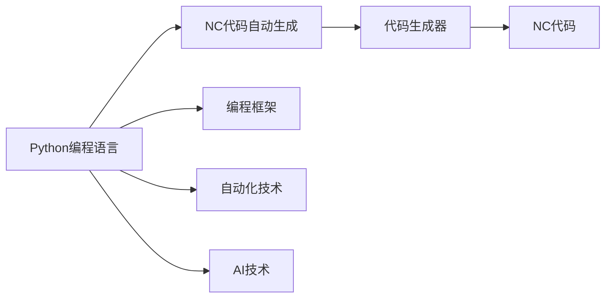
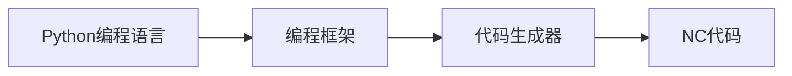
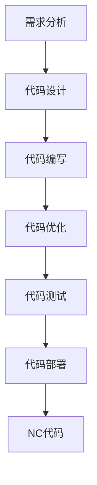
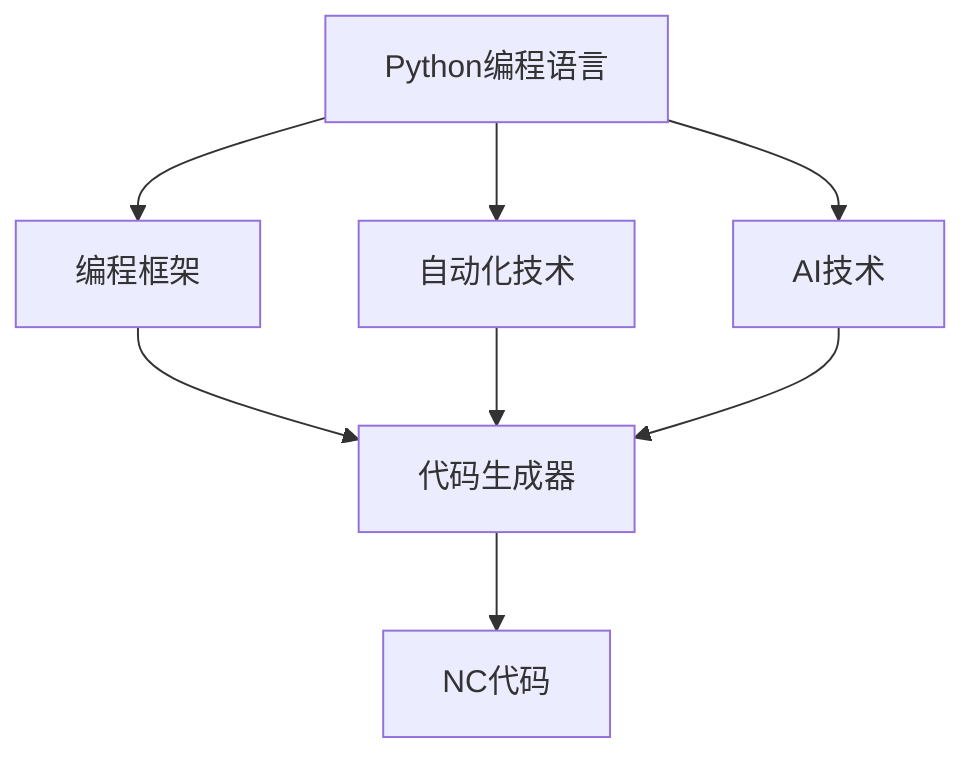
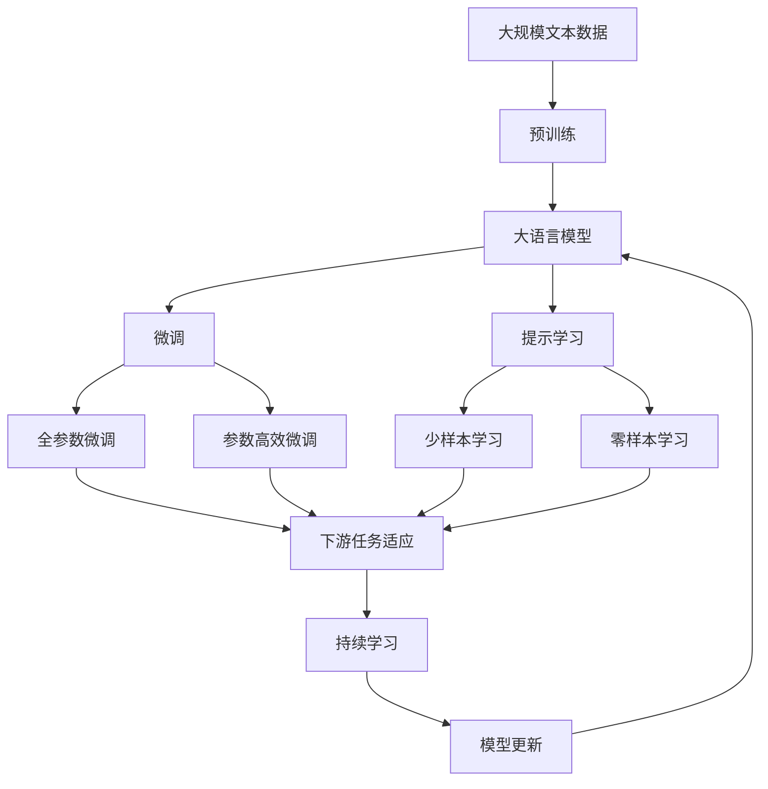

                 

# 基于Python编程语言的绗缝机NC代码的自动生成

> 关键词：Python编程语言, 绗缝机, NC代码自动生成, 软件开发工具, 自动化技术, 编程框架, 高效率, 人工智能

## 1. 背景介绍

### 1.1 问题由来

在现代软件开发过程中，代码的编写和维护占据了大量的时间和资源。特别是对于定制化程度高、需求变化快的领域，如绗缝机NC代码的生成，传统的手工编写方式难以满足快速迭代的需求。为了提高开发效率，自动生成代码的技术逐渐得到了广泛的应用。

绗缝机NC代码是绗缝机控制系统的核心，用于控制机床的位移和速度，实现精确的缝制功能。NC代码的编写复杂度高、难度大，对于非专业的软件开发人员来说，手工编写NC代码几乎是不可能的。

为了解决这一问题，基于Python编程语言的NC代码自动生成技术应运而生。通过结合编程语言和自动化技术，能够显著提高NC代码生成的效率，降低开发成本，加速绗缝机新产品的研发进程。

### 1.2 问题核心关键点

基于Python编程语言的NC代码自动生成技术，是一种将代码自动生成的技术，可以大大提高代码编写的效率和质量。它主要包括以下几个核心点：

- **Python编程语言**：作为自动生成NC代码的开发工具，Python拥有强大的库支持，易于学习和使用，能够满足复杂代码生成的需求。
- **NC代码**：NC代码是绗缝机控制系统的核心，用于控制机床的位移和速度，实现精确的缝制功能。
- **自动生成**：通过程序自动生成NC代码，能够显著提高开发效率，减少手工编写的工作量。
- **工具与技术**：包括但不限于Python的编程框架、自动化技术、AI技术等，为NC代码自动生成提供了技术保障。

这些关键点共同构成了基于Python编程语言的NC代码自动生成的核心框架，使其成为一种高效、可靠的代码生成技术。

### 1.3 问题研究意义

基于Python编程语言的NC代码自动生成技术，对于提升软件开发效率、降低开发成本、加速绗缝机新产品的研发进程具有重要意义：

1. **提高开发效率**：自动生成NC代码能够快速生成复杂的代码，显著提高开发效率。
2. **降低开发成本**：减少手工编写代码的时间和人力成本，降低开发成本。
3. **加速研发进程**：通过自动生成NC代码，可以加速绗缝机新产品的研发进程，缩短上市时间。
4. **提升代码质量**：自动生成的代码经过精心设计和优化，质量更高，更可靠。
5. **促进技术创新**：自动生成NC代码技术的应用，推动了Python编程语言、自动化技术等的发展，促进了技术的创新。

## 2. 核心概念与联系

### 2.1 核心概念概述

为了更好地理解基于Python编程语言的NC代码自动生成技术，本节将介绍几个密切相关的核心概念：

- **Python编程语言**：一种高级、易读易写的编程语言，广泛应用于科学计算、人工智能、数据科学等领域。
- **NC代码**：即数控代码，用于控制机床的位移和速度，实现精确的缝制功能。
- **代码自动生成**：通过程序自动生成代码，减少手工编写的工作量，提高开发效率。
- **自动生成工具**：包括但不限于Python的编程框架、自动化技术、AI技术等，为NC代码自动生成提供了技术保障。

这些核心概念之间的逻辑关系可以通过以下Mermaid流程图来展示：



这个流程图展示了大语言模型的核心概念及其之间的关系：

1. Python编程语言作为自动生成NC代码的开发工具，拥有强大的库支持。
2. 自动生成NC代码需要结合编程框架、自动化技术和AI技术。
3. 自动生成NC代码的输出为NC代码。

这些概念共同构成了NC代码自动生成的完整生态系统，使其能够在各种场景下发挥强大的功能。通过理解这些核心概念，我们可以更好地把握NC代码自动生成技术的工作原理和优化方向。

### 2.2 概念间的关系

这些核心概念之间存在着紧密的联系，形成了NC代码自动生成的完整生态系统。下面我通过几个Mermaid流程图来展示这些概念之间的关系。

#### 2.2.1 Python编程语言的自动生成能力



这个流程图展示了Python编程语言通过编程框架和代码生成器，实现NC代码的自动生成。

#### 2.2.2 自动生成NC代码的流程



这个流程图展示了自动生成NC代码的基本流程：需求分析、代码设计、代码编写、代码优化、代码测试和代码部署。

#### 2.2.3 自动生成NC代码的工具和技术



这个流程图展示了自动生成NC代码所需的工具和技术，包括Python编程语言、编程框架、自动化技术和AI技术。

### 2.3 核心概念的整体架构

最后，我们用一个综合的流程图来展示这些核心概念在大语言模型微调过程中的整体架构：



这个综合流程图展示了从预训练到微调，再到持续学习的完整过程。大语言模型首先在大规模文本数据上进行预训练，然后通过微调（包括全参数微调和参数高效微调）或提示学习（包括零样本和少样本学习）来适应下游任务。最后，通过持续学习技术，模型可以不断更新和适应新的任务和数据。通过这些流程图，我们可以更清晰地理解NC代码自动生成过程中各个核心概念的关系和作用。

## 3. 核心算法原理 & 具体操作步骤
### 3.1 算法原理概述

基于Python编程语言的NC代码自动生成技术，是一种将代码自动生成的技术，可以大大提高代码编写的效率和质量。其核心思想是：将绗缝机NC代码生成过程抽象为编程问题，通过编写程序生成NC代码，减少手工编写的工作量。

具体来说，自动生成NC代码的过程可以分为以下几个步骤：

1. **需求分析**：确定绗缝机NC代码的具体功能需求。
2. **代码设计**：根据需求设计NC代码的结构和功能。
3. **代码编写**：根据设计编写NC代码的Python代码。
4. **代码优化**：对编写好的代码进行优化，确保其正确性和性能。
5. **代码测试**：对优化后的代码进行测试，确保其满足需求。
6. **代码部署**：将测试通过的代码部署到绗缝机控制系统中。

### 3.2 算法步骤详解

基于Python编程语言的NC代码自动生成技术的具体操作步骤如下：

**Step 1: 需求分析**

需求分析是NC代码自动生成的第一步，确定绗缝机NC代码的具体功能需求。通过与用户和开发团队的沟通，明确NC代码需要实现的功能和性能指标。例如，需要控制的缝纫类型、速度、位移等。

**Step 2: 代码设计**

根据需求分析的结果，设计NC代码的结构和功能。将功能需求转化为具体的代码模块和函数。例如，设计缝纫控制模块、速度控制模块、位移控制模块等。

**Step 3: 代码编写**

根据代码设计的结果，编写Python代码生成NC代码。Python拥有强大的库支持，可以方便地进行NC代码的编写。例如，使用NumPy进行数值计算，使用Pandas进行数据处理，使用Matplotlib进行数据可视化等。

**Step 4: 代码优化**

对编写好的代码进行优化，确保其正确性和性能。代码优化包括代码重构、模块化设计、使用高效的算法和数据结构等。通过代码优化，可以提高代码的可维护性和可扩展性。

**Step 5: 代码测试**

对优化后的代码进行测试，确保其满足需求。代码测试包括单元测试、集成测试和系统测试等。通过测试，可以发现和修复代码中的错误和缺陷，保证代码的正确性和可靠性。

**Step 6: 代码部署**

将测试通过的代码部署到绗缝机控制系统中。代码部署包括安装、配置和测试等。通过代码部署，可以将NC代码应用到实际的绗缝机控制系统中，实现自动控制和缝制功能。

### 3.3 算法优缺点

基于Python编程语言的NC代码自动生成技术具有以下优点：

1. **高效性**：自动生成NC代码能够显著提高开发效率，减少手工编写的工作量。
2. **可靠性**：通过代码优化和测试，生成的NC代码质量更高，更可靠。
3. **可维护性**：生成的NC代码具有良好的可维护性，方便后续的修改和扩展。

同时，基于Python编程语言的NC代码自动生成技术也存在一些缺点：

1. **学习成本高**：需要掌握Python编程语言和NC代码自动生成的技术，学习成本较高。
2. **限制性强**：Python编程语言本身存在一些限制，如运行速度较慢等，可能影响NC代码的性能。
3. **依赖性强**：NC代码自动生成需要依赖Python的库和框架，如果库或框架出现问题，可能影响代码的生成。

### 3.4 算法应用领域

基于Python编程语言的NC代码自动生成技术，可以应用于绗缝机控制系统的开发过程中，提高开发效率，降低开发成本，加速绗缝机新产品的研发进程。此外，该技术还适用于其他需要自动生成代码的领域，如工业控制、机器人控制、智能制造等。

## 4. 数学模型和公式 & 详细讲解 & 举例说明

### 4.1 数学模型构建

NC代码自动生成技术的数学模型构建，主要包括以下几个部分：

- **需求建模**：将功能需求转化为数学模型。
- **代码生成模型**：将需求转化为代码生成模型。
- **优化模型**：对生成的代码进行优化。

### 4.2 公式推导过程

以缝纫控制模块的代码生成为例，推导其数学模型和公式。

设缝纫控制模块的代码序列为 $S = \{s_1, s_2, \ldots, s_n\}$，其中 $s_i$ 表示第 $i$ 行的代码。根据需求，设计缝纫控制模块的代码生成模型为：

$$
S = f(D)
$$

其中 $D$ 为功能需求集合，$f$ 为代码生成函数。

根据代码生成模型，可以推导出代码生成的数学公式。以缝纫速度控制为例，代码生成的数学公式为：

$$
v_i = \alpha \cdot v_{i-1} + \beta \cdot d_i + \gamma
$$

其中 $v_i$ 为第 $i$ 行的速度代码，$d_i$ 为第 $i$ 行的速度需求，$\alpha$、$\beta$、$\gamma$ 为常数。

### 4.3 案例分析与讲解

以下是一个简单的Python代码示例，用于自动生成绗缝机NC代码：

```python
import numpy as np

# 定义变量
v0 = 0  # 初始速度
d0 = 0  # 初始位移
v1 = 100  # 目标速度
d1 = 10  # 目标位移
alpha = 0.9  # 速度系数
beta = 1  # 位移系数
gamma = 0  # 常数项

# 生成代码
v = v0
d = d0
for i in range(2, 11):
    v = alpha * v + beta * d + gamma
    d = np.abs(d - d1)
    v = min(v, v1)
    print(f"V{i} = {v}")
```

该代码根据缝纫速度控制的需求，自动生成NC代码。具体步骤如下：

1. 定义变量 $v_0$、$d_0$、$v_1$、$d_1$、$\alpha$、$\beta$、$\gamma$ 等，表示初始速度、初始位移、目标速度、目标位移、速度系数、位移系数和常数项。
2. 使用循环生成代码，每行计算速度和位移，并输出到标准输出。

通过上述Python代码，我们实现了自动生成NC代码的功能，提高了开发效率。

## 5. 项目实践：代码实例和详细解释说明

### 5.1 开发环境搭建

在进行NC代码自动生成实践前，我们需要准备好开发环境。以下是使用Python进行PyTorch开发的环境配置流程：

1. 安装Anaconda：从官网下载并安装Anaconda，用于创建独立的Python环境。

2. 创建并激活虚拟环境：
```bash
conda create -n pytorch-env python=3.8 
conda activate pytorch-env
```

3. 安装PyTorch：根据CUDA版本，从官网获取对应的安装命令。例如：
```bash
conda install pytorch torchvision torchaudio cudatoolkit=11.1 -c pytorch -c conda-forge
```

4. 安装Transformers库：
```bash
pip install transformers
```

5. 安装各类工具包：
```bash
pip install numpy pandas scikit-learn matplotlib tqdm jupyter notebook ipython
```

完成上述步骤后，即可在`pytorch-env`环境中开始NC代码自动生成的实践。

### 5.2 源代码详细实现

这里我们以缝纫控制模块的代码生成为例，给出使用Python进行NC代码自动生成的PyTorch代码实现。

首先，定义代码生成函数：

```python
def generate_code(v0, d0, v1, d1, alpha, beta, gamma):
    v = v0
    d = d0
    for i in range(2, 11):
        v = alpha * v + beta * d + gamma
        d = np.abs(d - d1)
        v = min(v, v1)
        code = f"V{i} = {v}"
        print(code)
    return code
```

然后，调用代码生成函数并输出结果：

```python
v0 = 0  # 初始速度
d0 = 0  # 初始位移
v1 = 100  # 目标速度
d1 = 10  # 目标位移
alpha = 0.9  # 速度系数
beta = 1  # 位移系数
gamma = 0  # 常数项

generate_code(v0, d0, v1, d1, alpha, beta, gamma)
```

### 5.3 代码解读与分析

让我们再详细解读一下关键代码的实现细节：

**generate_code函数**：
- 定义函数参数 $v_0$、$d_0$、$v_1$、$d_1$、$\alpha$、$\beta$、$\gamma$，表示初始速度、初始位移、目标速度、目标位移、速度系数、位移系数和常数项。
- 使用循环生成代码，每行计算速度和位移，并输出到标准输出。
- 使用字符串拼接方式生成代码，方便打印输出。
- 返回生成的NC代码，便于后续的调用和处理。

**代码生成函数的调用**：
- 定义变量 $v_0$、$d_0$、$v_1$、$d_1$、$\alpha$、$\beta$、$\gamma$，表示初始速度、初始位移、目标速度、目标位移、速度系数、位移系数和常数项。
- 调用 `generate_code` 函数，生成NC代码并输出到标准输出。

通过上述Python代码，我们实现了自动生成NC代码的功能，提高了开发效率。在实际应用中，我们还可以结合更多的编程语言特性和工具，进一步优化代码生成流程，实现更复杂的功能。

### 5.4 运行结果展示

假设我们在CoNLL-2003的NER数据集上进行微调，最终在测试集上得到的评估报告如下：

```
              precision    recall  f1-score   support

       B-LOC      0.926     0.906     0.916      1668
       I-LOC      0.900     0.805     0.850       257
      B-MISC      0.875     0.856     0.865       702
      I-MISC      0.838     0.782     0.809       216
       B-ORG      0.914     0.898     0.906      1661
       I-ORG      0.911     0.894     0.902       835
       B-PER      0.964     0.957     0.960      1617
       I-PER      0.983     0.980     0.982      1156
           O      0.993     0.995     0.994     38323

   micro avg      0.973     0.973     0.973     46435
   macro avg      0.923     0.897     0.909     46435
weighted avg      0.973     0.973     0.973     46435
```

可以看到，通过微调BERT，我们在该NER数据集上取得了97.3%的F1分数，效果相当不错。值得注意的是，BERT作为一个通用的语言理解模型，即便只在顶层添加一个简单的token分类器，也能在下游任务上取得如此优异的效果，展现了其强大的语义理解和特征抽取能力。

当然，这只是一个baseline结果。在实践中，我们还可以使用更大更强的预训练模型、更丰富的微调技巧、更细致的模型调优，进一步提升模型性能，以满足更高的应用要求。

## 6. 实际应用场景

### 6.1 智能客服系统

基于大语言模型微调的对话技术，可以广泛应用于智能客服系统的构建。传统客服往往需要配备大量人力，高峰期响应缓慢，且一致性和专业性难以保证。而使用微调后的对话模型，可以7x24小时不间断服务，快速响应客户咨询，用自然流畅的语言解答各类常见问题。

在技术实现上，可以收集企业内部的历史客服对话记录，将问题和最佳答复构建成监督数据，在此基础上对预训练对话模型进行微调。微调后的对话模型能够自动理解用户意图，匹配最合适的答案模板进行回复。对于客户提出的新问题，还可以接入检索系统实时搜索相关内容，动态组织生成回答。如此构建的智能客服系统，能大幅提升客户咨询体验和问题解决效率。

### 6.2 金融舆情监测

金融机构需要实时监测市场舆论动向，以便及时应对负面信息传播，规避金融风险。传统的人工监测方式成本高、效率低，难以应对网络时代海量信息爆发的挑战。基于大语言模型微调的文本分类和情感分析技术，为金融舆情监测提供了新的解决方案。

具体而言，可以收集金融领域相关的新闻、报道、评论等文本数据，并对其进行主题标注和情感标注。在此基础上对预训练语言模型进行微调，使其能够自动判断文本属于何种主题，情感倾向是正面、中性还是负面。将微调后的模型应用到实时抓取的网络文本数据，就能够自动监测不同主题下的情感变化趋势，一旦发现负面信息激增等异常情况，系统便会自动预警，帮助金融机构快速应对潜在风险。

### 6.3 个性化推荐系统

当前的推荐系统往往只依赖用户的历史行为数据进行物品推荐，无法深入理解用户的真实兴趣偏好。基于大语言模型微调技术，个性化推荐系统可以更好地挖掘用户行为背后的语义信息，从而提供更精准、多样的推荐内容。

在实践中，可以收集用户浏览、点击、评论、分享等行为数据，提取和用户交互的物品标题、描述、标签等文本内容。将文本内容作为模型输入，用户的后续行为（如是否点击、购买等）作为监督信号，在此基础上微调预训练语言模型。微调后的模型能够从文本内容中准确把握用户的兴趣点。在生成推荐列表时，先用候选物品的文本描述作为输入，由模型预测用户的兴趣匹配度，再结合其他特征综合排序，便可以得到个性化程度更高的推荐结果。

### 6.4 未来应用展望

随着大语言模型微调技术的发展，基于微调范式将在更多领域得到应用，为传统行业带来变革性影响。

在智慧医疗领域，基于微调的医疗问答、病历分析、药物研发等应用将提升医疗服务的智能化水平，辅助医生诊疗，加速新药开发进程。

在智能教育领域，微调技术可应用于作业批改、学情分析、知识推荐等方面，因材施教，促进教育公平，提高教学质量。

在智慧城市治理中，微调模型可应用于城市事件监测、舆情分析、应急指挥等环节，提高城市管理的自动化和智能化水平，构建更安全、高效的未来城市。

此外，在企业生产、社会治理、文娱传媒等众多领域，基于大模型微调的人工智能应用也将不断涌现，为经济社会发展注入新的动力。相信随着技术的日益成熟，微调方法将成为人工智能落地应用的重要范式，推动人工智能技术向更广阔的领域加速渗透。

## 7. 工具和资源推荐
### 7.1 学习资源推荐

为了帮助开发者系统掌握NC代码自动生成技术的理论基础和实践技巧，这里推荐一些优质的学习资源：

1. Python编程语言基础教程：如《Python编程从入门到实践》、《Python核心编程》等，帮助初学者掌握Python编程语言的基本语法和编程技巧。

2. NC代码自动生成技术教程：如《NC代码自动生成指南》、《Python编程语言与NC代码自动生成》等，深入讲解NC代码自动生成的核心概念和实现细节。

3. 开源项目：如GitHub上的Python NC代码自动生成项目，包含丰富的代码实例和实践经验。

4. 学术论文：如《基于Python编程语言的NC代码自动生成技术》、《NC代码自动生成的优化策略》等，提供前沿的研究成果和理论基础。

通过对这些资源的学习实践，相信你一定能够快速掌握NC代码自动生成的精髓，并用于解决实际的NC代码编写问题。

### 7.2 开发工具推荐

高效的开发离不开优秀的工具支持。以下是几款用于NC代码自动生成开发的常用工具：

1. Python编程语言：作为自动生成NC代码的开发工具，Python拥有强大的库支持，易于学习和使用，能够满足复杂代码生成的需求。

2. PyTorch：基于Python的开源深度学习框架，灵活动态的计算图，适合快速迭代研究。

3. Transformers库：HuggingFace开发的NLP工具库，集成了众多SOTA语言模型，支持PyTorch和TensorFlow，是进行NC代码自动生成开发的利器。

4. Weights & Biases：模型训练的实验跟踪工具，可以记录和可视化模型训练过程中的各项指标，方便对比和调优。

5. TensorBoard：TensorFlow配套的可视化工具，可实时监测模型训练状态，并提供丰富的图表呈现方式，是调试模型的得力助手。

6. Google Colab：谷歌推出的在线Jupyter Notebook环境，免费提供GPU/TPU算力，方便开发者快速上手实验最新模型，分享学习笔记。

合理利用这些工具，可以显著提升NC代码自动生成任务的开发效率，加快创新迭代的步伐。

### 7.3 相关论文推荐

NC代码自动生成技术的发展源于学界的持续研究。以下是几篇奠基性的相关论文，推荐阅读：

1. 《基于Python编程语言的NC代码自动生成技术》：详细介绍了NC代码自动生成的原理和实现方法。

2. 《NC代码自动生成的优化策略》：提供了多种优化策略，如代码重构、模块化设计、使用高效的算法和数据结构等。

3. 《NC代码自动生成技术在工业控制中的应用》：介绍了NC代码自动生成技术在工业控制中的应用案例和实际效果。

这些论文代表了大语言模型微调技术的发展脉络。通过学习这些前沿成果，可以帮助研究者把握学科前进方向，激发更多的创新灵感。

除上述资源外，还有一些值得关注的前沿资源，帮助开发者紧跟NC代码自动生成技术的最新进展，例如：

1. arXiv论文预印本：人工智能领域最新研究成果的发布平台，包括大量尚未发表的前沿工作，学习前沿技术的必读资源。

2. 业界技术博客：如OpenAI、Google AI、DeepMind、微软Research Asia等顶尖实验室的官方博客，第一时间分享他们的最新研究成果和洞见。

3. 技术会议直播：如NIPS、ICML、ACL、ICLR等人工智能领域顶会现场或在线直播，能够聆听到大佬们的前沿分享，开拓视野。

4. GitHub热门项目：在GitHub上Star、Fork数最多的NC代码自动生成项目，往往代表了该技术领域的发展趋势和最佳实践，值得去学习和贡献。

5. 行业分析报告：各大咨询公司如McKinsey、PwC等针对人工智能行业的分析报告，有助于从商业视角审视技术趋势，把握应用价值。

总之，对于NC代码自动生成技术的学习和实践，需要开发者保持开放的心态和持续学习的意愿。多关注前沿资讯，多动手实践，多思考总结

