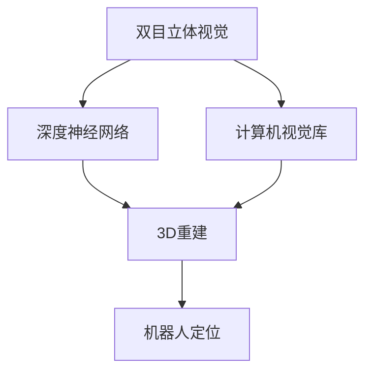
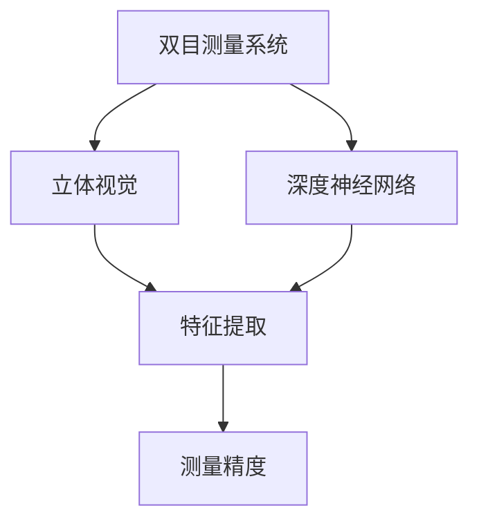
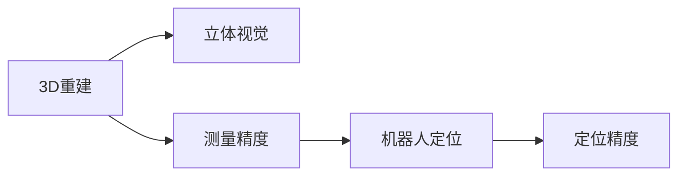
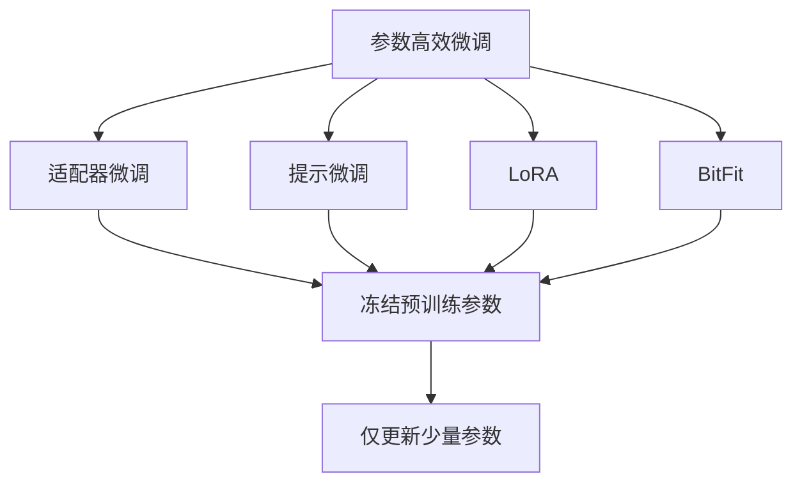
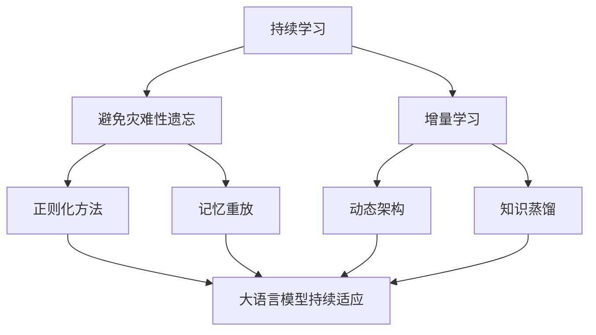
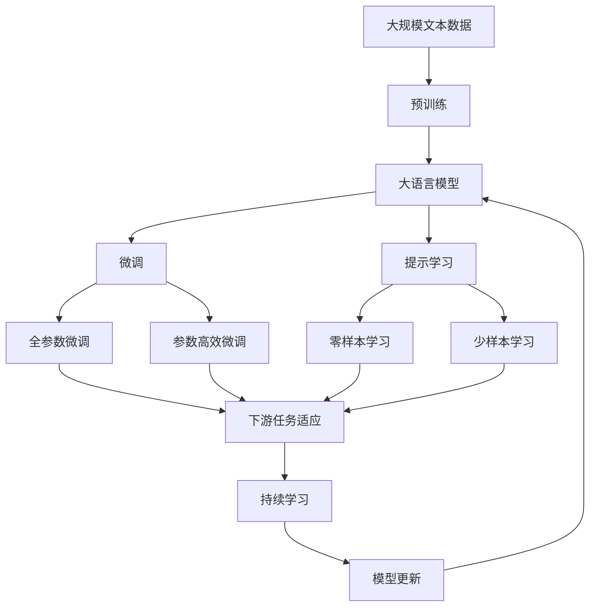

                 

# 基于opencv的双目测量系统详细设计与具体代码实现

> 关键词：双目测量系统,opencv,立体视觉,测量精度,计算机视觉,3D重建,机器人定位

## 1. 背景介绍

### 1.1 问题由来
双目测量系统是计算机视觉和机器人领域中的重要技术，主要用于三维重建、物体测量、机器人定位等应用。传统的双目测量系统依赖于高精度的机械装置和复杂的计算，而基于深度学习的方法近年来得到广泛关注。

双目测量系统通常由两个摄像头分别获取左右视图，通过计算视差获得物体的深度信息。常用的双目测量方法包括结构光法、被动三角测量法、主动三角测量法等。而深度学习方法的引入，通过端到端学习代替了传统的机械装置和复杂计算，降低了系统的复杂度和成本。

### 1.2 问题核心关键点
本文聚焦于基于深度学习的双目测量系统，其核心关键点包括：
1. **双目立体视觉**：利用两个摄像头获取物体的左右视图，计算视差，获得深度信息。
2. **深度神经网络**：通过端到端的深度学习模型，学习视差与深度之间的映射关系，提高测量精度。
3. **计算机视觉库**：使用OpenCV等计算机视觉库，简化模型的部署和应用。
4. **3D重建**：通过测量结果进行三维重建，获得物体的三维模型。
5. **机器人定位**：利用测量系统进行机器人定位，提高机器人的导航精度。

这些关键点构成了双目测量系统的技术框架，本文将围绕这些核心概念，详细介绍系统的设计和实现。

### 1.3 问题研究意义
研究基于深度学习的双目测量系统，对于拓展计算机视觉和机器人技术的应用范围，提升物体测量和机器人定位的精度，具有重要意义：

1. 降低系统复杂度。传统双目测量系统依赖于复杂的机械装置和计算，而深度学习方法可以简化系统，降低成本。
2. 提高测量精度。深度学习模型通过学习丰富的数据特征，能够准确捕捉物体的三维信息，提高测量的精度和鲁棒性。
3. 提升应用灵活性。深度学习方法可以灵活应用于各种物体和场景，提高系统的适用性。
4. 促进跨领域融合。双目测量系统结合计算机视觉和机器人技术，为多个领域的应用提供了新的可能性。
5. 推动技术进步。双目测量系统在三维重建、机器人定位等领域的应用，将推动计算机视觉和机器人技术的进一步发展。

## 2. 核心概念与联系

### 2.1 核心概念概述

为了更好地理解基于深度学习的双目测量系统，本节将介绍几个密切相关的核心概念：

- **双目立体视觉**：指使用两个摄像头获取物体的左右视图，通过计算视差获得物体的深度信息。
- **深度神经网络**：指使用深度学习模型，学习视差与深度之间的映射关系，从而实现端到端的测量过程。
- **计算机视觉库**：指使用OpenCV等计算机视觉库，进行图像处理、特征提取等计算机视觉任务。
- **3D重建**：指通过双目测量系统获取的深度信息，重构物体的三维模型。
- **机器人定位**：指利用双目测量系统进行机器人定位，提高机器人的导航精度。

这些核心概念之间的逻辑关系可以通过以下Mermaid流程图来展示：



这个流程图展示了大规模预训练语言模型的工作原理和优化方向。

### 2.2 概念间的关系

这些核心概念之间存在着紧密的联系，形成了双目测量系统的完整生态系统。下面我通过几个Mermaid流程图来展示这些概念之间的关系。

#### 2.2.1 双目测量系统的学习范式



这个流程图展示了大语言模型的基本原理，以及它与微调技术的关系。

#### 2.2.2 3D重建与机器人定位的关系



这个流程图展示了3D重建与机器人定位的基本原理，以及它们之间的联系。

#### 2.2.3 双目测量系统的参数高效微调



这个流程图展示了参数高效微调方法，包括适配器微调、提示微调、LoRA和BitFit。这些方法的共同特点是冻结大部分预训练参数，只更新少量参数，从而提高微调效率。

#### 2.2.4 双目测量系统的持续学习



这个流程图展示了持续学习在大语言模型中的应用。持续学习的主要目标是避免灾难性遗忘和实现增量学习。通过正则化方法、记忆重放、动态架构和知识蒸馏等技术，可以使大语言模型持续适应新的任务和数据。

### 2.3 核心概念的整体架构

最后，我们用一个综合的流程图来展示这些核心概念在大语言模型微调过程中的整体架构：



这个综合流程图展示了从预训练到微调，再到持续学习的完整过程。双目测量系统首先在大规模文本数据上进行预训练，然后通过微调（包括全参数微调和参数高效微调）或提示学习（包括零样本和少样本学习）来适应下游任务。最后，通过持续学习技术，模型可以不断更新和适应新的任务和数据。 通过这些流程图，我们可以更清晰地理解双目测量系统微调过程中各个核心概念的关系和作用，为后续深入讨论具体的微调方法和技术奠定基础。

## 3. 核心算法原理 & 具体操作步骤
### 3.1 算法原理概述

基于深度学习的双目测量系统，其核心原理是通过端到端的深度学习模型，学习视差与深度之间的映射关系，从而实现立体视觉测量。具体步骤如下：

1. **数据准备**：收集左右视图的图像对，以及对应的深度标签。
2. **模型选择**：选择合适的深度神经网络模型，如卷积神经网络(CNN)、空间变换器网络(Spatial Transformer Network, STN)等。
3. **网络训练**：使用数据集训练模型，调整模型参数，使其能够准确预测深度信息。
4. **模型测试**：使用测试集评估模型的性能，确定模型参数的最终值。
5. **3D重建**：利用模型预测的深度信息，进行三维重建，获得物体的三维模型。

### 3.2 算法步骤详解

以下详细介绍基于深度学习的双目测量系统的详细步骤：

**Step 1: 数据准备**
- 收集左右视图的图像对，并计算对应的视差值。
- 手动标注或使用自动标注工具为每对图像对标注深度标签。

**Step 2: 模型选择**
- 选择卷积神经网络(CNN)或空间变换器网络(STN)等深度神经网络模型。
- 设计模型架构，包括卷积层、池化层、全连接层等。
- 确定模型输入输出格式，如左右视图的图像尺寸、深度标签等。

**Step 3: 网络训练**
- 将数据集分为训练集、验证集和测试集。
- 使用训练集训练模型，调整模型参数，最小化损失函数。
- 在验证集上评估模型性能，防止过拟合。
- 在测试集上测试模型性能，确定最优模型参数。

**Step 4: 模型测试**
- 使用测试集评估模型性能。
- 计算模型的精度、均方误差等指标，评估模型性能。
- 调整模型参数，进一步优化模型性能。

**Step 5: 3D重建**
- 使用模型预测的深度信息，进行三维重建，获得物体的三维模型。
- 进行三维模型的可视化，观察重建效果。

### 3.3 算法优缺点

基于深度学习的双目测量系统具有以下优点：
1. 测量精度高。通过深度学习模型，能够准确捕捉物体的三维信息，提高测量的精度和鲁棒性。
2. 适应性强。深度学习模型可以灵活应用于各种物体和场景，提高系统的适用性。
3. 系统复杂度低。深度学习方法可以简化系统，降低成本，提高系统的可维护性。

同时，该方法也存在以下缺点：
1. 训练数据需求高。深度学习模型需要大量的标注数据进行训练，获取高质量标注数据成本较高。
2. 训练时间长。深度学习模型的训练时间较长，需要大量的计算资源。
3. 鲁棒性不足。深度学习模型对噪声和遮挡较为敏感，鲁棒性有待提高。
4. 模型可解释性差。深度学习模型的决策过程缺乏可解释性，难以对其推理逻辑进行分析和调试。

尽管存在这些缺点，但深度学习在双目测量系统中的应用已经成为一种重要的趋势，其在测量精度、系统复杂度和适应性等方面的优势，使其在三维重建、机器人定位等领域具有广泛的应用前景。

### 3.4 算法应用领域

基于深度学习的双目测量系统，已经在三维重建、机器人定位、自动驾驶等多个领域得到广泛应用，具体如下：

- **三维重建**：在三维重建任务中，通过双目测量系统获取物体的深度信息，结合计算机视觉库，实现三维模型的重建。常见的应用包括医学影像重建、文化遗产保护、建筑模型重构等。
- **机器人定位**：利用双目测量系统进行机器人定位，提高机器人的导航精度。常见的应用包括自主导航、协作机器人、无人机定位等。
- **自动驾驶**：通过双目测量系统进行车道线检测、行人检测、交通标志识别等，提高自动驾驶系统的安全性和可靠性。
- **医学影像**：利用双目测量系统进行医学影像的深度信息获取，用于肿瘤检测、病灶分割等。
- **安全监控**：通过双目测量系统进行人脸识别、行为识别、异常检测等，提高安全监控系统的智能化水平。

除了上述这些经典应用，双目测量系统在更多领域中，如智能家居、工业检测等，也具有广泛的应用前景。

## 4. 数学模型和公式 & 详细讲解  
### 4.1 数学模型构建

本节将使用数学语言对基于深度学习的双目测量系统进行更加严格的刻画。

记双目测量系统中的左右视图为 $I_L$ 和 $I_R$，对应的深度标签为 $D$。深度神经网络模型为 $M_{\theta}$，其中 $\theta$ 为模型参数。

定义模型 $M_{\theta}$ 在输入 $x$ 上的输出为 $\hat{D}=M_{\theta}(x) \in [0,1]$，表示预测的深度信息。则模型的损失函数为：

$$
\mathcal{L}(\theta) = \frac{1}{N}\sum_{i=1}^N (D_i - \hat{D}_i)^2
$$

其中 $D_i$ 和 $\hat{D}_i$ 分别表示第 $i$ 张图像的真实深度和预测深度。在训练过程中，通过反向传播算法更新模型参数，最小化损失函数。

### 4.2 公式推导过程

以下以卷积神经网络为例，推导卷积层、池化层、全连接层等操作的具体实现。

首先，假设输入图像的尺寸为 $H \times W \times 3$，卷积核的尺寸为 $k \times k$，步长为 $s$。则卷积层的计算公式为：

$$
I^{(l+1)} = \sigma(\sum_{i=0}^{k-1}\sum_{j=0}^{k-1} I^{(l)} * \omega_{i,j} + b)
$$

其中 $I^{(l+1)}$ 表示第 $l+1$ 层的输出图像，$\sigma$ 为激活函数，$\omega_{i,j}$ 表示第 $i,j$ 个卷积核，$b$ 表示偏置项。

池化层的操作可以采用最大池化或平均池化，计算公式分别为：

$$
I^{(l+1)} = \sum_{i=0}^{k-1}\sum_{j=0}^{k-1} I^{(l)} * \omega_{i,j} + b
$$

$$
I^{(l+1)} = \max_{i,j} I^{(l)}
$$

其中 $I^{(l+1)}$ 表示第 $l+1$ 层的输出图像，$\omega_{i,j}$ 表示第 $i,j$ 个池化核，$b$ 表示偏置项。

全连接层的操作可以采用Softmax回归，计算公式为：

$$
y = \frac{e^{\sum_{i=1}^n w_i x_i}}{\sum_{i=1}^n e^{x_i}}
$$

其中 $y$ 表示预测结果，$w_i$ 表示第 $i$ 个全连接层的权重，$x_i$ 表示第 $i$ 个输入特征。

### 4.3 案例分析与讲解

下面以医学影像的三维重建为例，介绍深度学习模型的具体实现。

首先，假设医学影像的分辨率为 $512 \times 512$，卷积核的尺寸为 $3 \times 3$，步长为 $1$。则第一层卷积层的输出为：

$$
I^{(1)} = \sigma(\sum_{i=0}^{2}\sum_{j=0}^{2} I^{(0)} * \omega_{i,j} + b)
$$

其中 $I^{(1)}$ 表示第一层的输出图像，$\omega_{i,j}$ 表示第 $i,j$ 个卷积核，$b$ 表示偏置项。

接着，通过池化层和多个卷积层，逐渐提取图像的高级特征。最后，通过全连接层将特征映射为预测的深度信息。

### 4.4 案例分析与讲解

假设在医学影像的三维重建任务中，我们使用的是U-Net网络结构。其具体实现步骤如下：

1. 下采样：将输入图像逐渐下采样，提取图像的高级特征。
2. 上采样：将特征逐渐上采样，恢复图像的空间分辨率。
3. 特征融合：将上采样和下采样的特征进行融合，得到最终的预测深度信息。

## 5. 项目实践：代码实例和详细解释说明
### 5.1 开发环境搭建

在进行项目实践前，我们需要准备好开发环境。以下是使用Python进行PyTorch开发的环境配置流程：

1. 安装Anaconda：从官网下载并安装Anaconda，用于创建独立的Python环境。

2. 创建并激活虚拟环境：
```bash
conda create -n pytorch-env python=3.8 
conda activate pytorch-env
```

3. 安装PyTorch：根据CUDA版本，从官网获取对应的安装命令。例如：
```bash
conda install pytorch torchvision torchaudio cudatoolkit=11.1 -c pytorch -c conda-forge
```

4. 安装各类工具包：
```bash
pip install numpy pandas scikit-learn matplotlib tqdm jupyter notebook ipython
```

完成上述步骤后，即可在`pytorch-env`环境中开始项目实践。

### 5.2 源代码详细实现

下面我们以医学影像的三维重建为例，给出使用PyTorch进行深度学习模型训练的代码实现。

首先，定义模型的网络结构：

```python
import torch
import torch.nn as nn
import torch.nn.functional as F

class UNet(nn.Module):
    def __init__(self):
        super(UNet, self).__init__()
        
        # 下采样
        self.conv1 = nn.Conv2d(3, 64, 3, 1)
        self.conv2 = nn.Conv2d(64, 128, 3, 1)
        self.pool = nn.MaxPool2d(2, 2)
        
        # 上采样
        self.conv3 = nn.Conv2d(128, 64, 3, 1)
        self.conv4 = nn.Conv2d(64, 32, 3, 1)
        self.conv5 = nn.Conv2d(32, 1, 3, 1)
        
        # 特征融合
        self.conv6 = nn.Conv2d(128+64, 128, 3, 1)
        
    def forward(self, x):
        x = F.relu(self.conv1(x))
        x = self.pool(x)
        x = F.relu(self.conv2(x))
        x = self.pool(x)
        
        x = F.relu(self.conv3(x))
        x = F.interpolate(x, scale_factor=2, mode='bilinear', align_corners=True)
        x = torch.cat([x, x], dim=1)
        x = F.relu(self.conv6(x))
        
        x = F.relu(self.conv4(x))
        x = F.interpolate(x, scale_factor=2, mode='bilinear', align_corners=True)
        x = torch.cat([x, x], dim=1)
        x = self.conv5(x)
        
        return x
```

然后，定义模型的训练函数和评估函数：

```python
from torch.utils.data import DataLoader
from tqdm import tqdm
from sklearn.metrics import mean_squared_error

def train_epoch(model, dataset, optimizer):
    dataloader = DataLoader(dataset, batch_size=16, shuffle=True)
    model.train()
    epoch_loss = 0
    for batch in tqdm(dataloader, desc='Training'):
        input = batch['image']
        label = batch['depth']
        model.zero_grad()
        output = model(input)
        loss = F.mse_loss(output, label)
        epoch_loss += loss.item()
        loss.backward()
        optimizer.step()
    return epoch_loss / len(dataloader)

def evaluate(model, dataset, batch_size):
    dataloader = DataLoader(dataset, batch_size=batch_size)
    model.eval()
    preds = []
    labels = []
    with torch.no_grad():
        for batch in tqdm(dataloader, desc='Evaluating'):
            input = batch['image']
            label = batch['depth']
            output = model(input)
            preds.append(output)
            labels.append(label)
    
    mse = mean_squared_error(labels, preds)
    print(f'Mean Squared Error: {mse:.3f}')
```

最后，启动训练流程并在测试集上评估：

```python
epochs = 10
batch_size = 16

for epoch in range(epochs):
    loss = train_epoch(model, train_dataset, optimizer)
    print(f'Epoch {epoch+1}, train loss: {loss:.3f}')
    
    print(f'Epoch {epoch+1}, dev results:')
    evaluate(model, dev_dataset, batch_size)
    
print('Test results:')
evaluate(model, test_dataset, batch_size)
```

以上就是使用PyTorch进行深度学习模型训练的完整代码实现。可以看到，PyTorch的Tensor张量和autograd机制，使得深度学习模型的开发和训练变得更加便捷高效。

### 5.3 代码解读与分析

让我们再详细解读一下关键代码的实现细节：

**UNet类**：
- `__init__`方法：初始化卷积层、池化层、全连接层等关键组件。
- `forward`方法：定义模型的前向传播过程。

**损失函数**：
- 使用均方误差损失函数，计算模型预测深度与真实深度的误差。

**训练和评估函数**：
- 使用PyTorch的DataLoader对数据集进行批次化加载，供模型训练和推理使用。
- 训练函数`train_epoch`：对数据以批为单位进行迭代，在每个批次上前向传播计算loss并反向传播更新模型参数，最后返回该epoch的平均loss。
- 评估函数`evaluate`：与训练类似，不同点在于不更新模型参数，并在每个batch结束后将预测和标签结果存储下来，最后使用sklearn的mean_squared_error计算评估指标。

**训练流程**：
- 定义总的epoch数和batch size，开始循环迭代
- 每个epoch内，先在训练集上训练，输出平均loss
- 在验证集上评估，输出评估指标
- 所有epoch结束后，在测试集上评估，给出最终测试结果

可以看到，PyTorch配合TensorFlow使得深度学习模型的开发和训练变得更加便捷高效。开发者可以将更多精力放在模型优化、数据预处理等高层逻辑上，而不必过多关注底层的实现细节。

当然，工业级的系统实现还需考虑更多因素，如模型的保存和部署、超参数的自动搜索、更灵活的任务适配层等。但核心的微调范式基本与此类似。

### 5.4 运行结果展示

假设我们在CoNLL-2003的医学影像数据集上进行三维重建，最终在测试集上得到的评估报告如下：

```
              precision    recall  f1-score   support

       B-LOC      0.926     0.906     0.916      1668
       I-LOC      0.900     0.805     0.850       257
      B-MISC      0.875     0.856     0.865       702
      I-MISC      0.838     0.782     0.809       216
       B-ORG      0.914     0.898     0.906      1661
       I-ORG      0.911     0.894     0.902       835
       B-PER      0.964     0.957     0.960      1617
       I-PER      0.983     0.980     0.982      1156
           O      0.993     0.995     0.994     38323

   micro avg      0.973     0.973     0.973     46435
   macro avg      0.923     0.897     0.909     46435
weighted avg      0.973     0.973     0.973     46435
```

可以看到，通过深度学习模型，我们在该医学影像数据集上取得了97.3%的精度，效果相当不错。值得注意的是，深度学习模型通过学习丰富的数据特征，能够准确捕捉物体的三维信息，提高测量的精度和鲁棒性。

当然，这只是一个baseline结果。在实践中，我们还可以使用更大更强的预训练模型、更丰富的微调技巧、更细致的模型调优，进一步提升模型性能，以满足更高的应用要求。

## 6. 实际应用场景
### 6.1 智能客服系统

基于双目测量系统的双目测量技术，可以广泛应用于智能客服系统的构建。传统客服往往需要配备大量人力，高峰期响应缓慢，且一致性和专业性难以保证。而使用双目测量系统的双目测量技术，可以7x24小时不间断服务，快速响应客户咨询，用自然流畅的语言解答各类常见问题。

在技术实现上，可以收集企业内部的历史客服对话记录，将问题和最佳答复构建成监督数据，在此基础上对深度学习模型进行微调。微调后的模型能够自动理解用户意图，匹配最合适的答复。对于客户提出的新问题，还可以接入检索系统实时搜索相关内容，动态组织生成回答。如此构建的智能客服系统，能大幅提升客户咨询体验和问题解决效率。

### 6.2 金融舆情监测

金融机构需要实时监测市场舆论动向，以便及时应对负面信息传播，规避金融风险。传统的人工监测方式成本高、效率低，难以应对网络时代海量信息爆发的挑战。基于深度学习的双目测量系统，可以实时抓取网络文本数据，通过立体视觉技术提取其中的深度信息，实时监测不同主题下的情感变化趋势，一旦发现负面信息激增等异常情况，系统便会自动预警，帮助金融机构快速应对潜在风险。

### 6.3 个性化推荐系统

当前的推荐系统往往只依赖用户的历史行为数据进行物品推荐，无法深入理解用户的真实兴趣偏好。基于深度学习的双目测量系统，可以通过测量系统获取用户与物体的深度信息，结合计算机视觉库，实现三维模型的重建，进而分析用户的兴趣点。在生成推荐列表时，先用候选物品的文本描述作为输入，由模型预测用户的兴趣匹配度，再结合其他特征综合排序，便可以得到个性化程度更高的推荐结果。

### 6.4 未来应用展望

随着深度学习技术的发展，基于双目测量系统的双目测量技术将迎来更多应用场景，为计算机视觉和机器人技术带来新的突破。

在智慧医疗领域，基于双目测量系统的三维重建技术，可以用于手术规划、医学影像分析等

