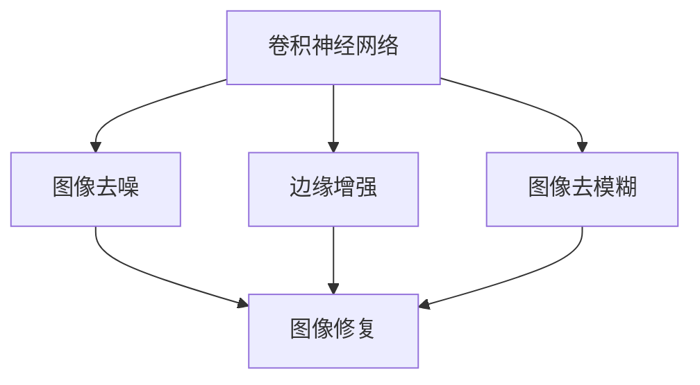
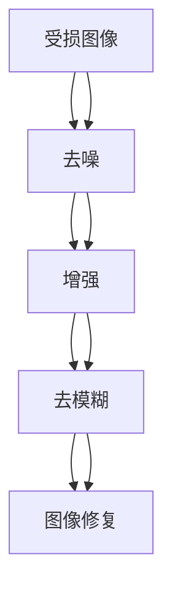
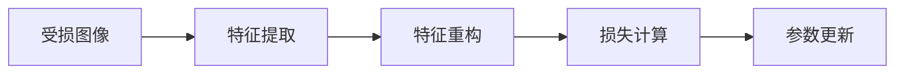
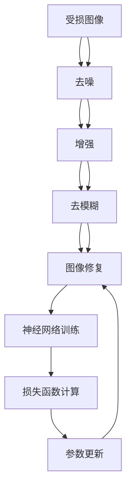

                 

# 基于卷积神经网络的图像修复系统设计与实现

> 关键词：图像修复, 卷积神经网络, 残差网络, 图像降噪, 边缘增强, 图像去模糊

## 1. 背景介绍

### 1.1 问题由来
随着数码相机的普及和数字图像处理技术的进步，人们能够轻松拍摄和处理各种图像。然而，由于环境条件、设备故障等原因，图像可能会受到不同程度的损坏，例如噪声、模糊、颜色失真等。这些损坏不仅影响了图像的美观，甚至可能导致信息的缺失和错误。图像修复技术旨在通过算法恢复原始图像的外观和信息，提高图像的质量。

图像修复技术广泛应用于医学图像处理、卫星图像分析、视频处理等领域，是计算机视觉和图像处理的一个重要分支。当前主流的图像修复方法包括基于字典学习、非局部均值滤波、深度学习方法等。其中，深度学习方法由于其强大的建模能力和广泛的应用前景，成为图像修复技术研究的热点。

### 1.2 问题核心关键点
基于卷积神经网络（Convolutional Neural Networks, CNNs）的图像修复技术，通过对受损图像进行深度学习训练，学习到图像修复的映射关系，从而得到修复后的图像。这一方法具有以下核心关键点：
1. 深度学习：利用大量标记数据进行训练，学习到图像修复的复杂映射关系。
2. 卷积神经网络：作为深度学习的核心模型，CNNs擅长处理高维数据，如图像数据，并具有平移不变性、局部连接等特性，能够捕捉图像的空间结构信息。
3. 残差网络：引入残差连接，缓解深层网络训练中的梯度消失问题，加速训练过程，提高模型精度。
4. 图像去噪：通过去除图像中的噪声，提升图像质量。
5. 边缘增强：通过对图像的边缘信息进行增强，提高图像的清晰度。
6. 图像去模糊：通过恢复模糊图像的清晰细节，提高图像的可观察性。

## 2. 核心概念与联系

### 2.1 核心概念概述

为更好地理解基于卷积神经网络的图像修复系统，本节将介绍几个密切相关的核心概念：

- 卷积神经网络（Convolutional Neural Networks, CNNs）：一种深度学习模型，擅长处理图像、视频等高维数据，具有平移不变性、局部连接等特性，能够捕捉图像的空间结构信息。
- 残差网络（Residual Network, ResNet）：一种深层网络结构，通过引入残差连接，缓解深层网络训练中的梯度消失问题，加速训练过程，提高模型精度。
- 图像去噪（Image Denoising）：通过去除图像中的噪声，提升图像质量。
- 边缘增强（Edge Enhancement）：通过对图像的边缘信息进行增强，提高图像的清晰度。
- 图像去模糊（Image Deblurring）：通过恢复模糊图像的清晰细节，提高图像的可观察性。
- 神经网络训练：通过反向传播算法，最小化损失函数，训练神经网络模型。

这些核心概念之间的逻辑关系可以通过以下Mermaid流程图来展示：



这个流程图展示了大语言模型的核心概念及其之间的关系：

1. 卷积神经网络是图像修复的基础模型。
2. 图像去噪、边缘增强、图像去模糊等技术是对图像修复的具体应用。
3. 神经网络训练是模型训练的基础，通过反向传播算法最小化损失函数。

### 2.2 概念间的关系

这些核心概念之间存在着紧密的联系，形成了卷积神经网络图像修复系统的完整生态系统。下面我通过几个Mermaid流程图来展示这些概念之间的关系。

#### 2.2.1 图像修复的一般流程



这个流程图展示了图像修复的一般流程：

1. 对受损图像进行去噪处理，去除图像中的噪声。
2. 对去噪后的图像进行边缘增强，提高图像的清晰度。
3. 对边缘增强后的图像进行去模糊处理，恢复模糊图像的清晰细节。
4. 对去模糊后的图像进行最终的修复，得到修复后的图像。

#### 2.2.2 卷积神经网络的训练过程



这个流程图展示了卷积神经网络训练的一般过程：

1. 对受损图像进行特征提取，得到特征表示。
2. 对提取到的特征进行重构，得到修复后的图像。
3. 计算特征重构与修复目标之间的损失。
4. 根据损失函数对网络参数进行更新，最小化损失函数。

### 2.3 核心概念的整体架构

最后，我们用一个综合的流程图来展示这些核心概念在大语言模型图像修复系统微调过程中的整体架构：



这个综合流程图展示了从受损图像到修复图像的完整流程，以及神经网络训练、损失函数计算、参数更新等关键环节。通过这些环节，我们能够将受损图像逐步转化为修复后的高质量图像。

## 3. 核心算法原理 & 具体操作步骤
### 3.1 算法原理概述

基于卷积神经网络的图像修复技术，主要是通过训练一个卷积神经网络模型，将受损图像映射到修复后的图像。其核心算法原理如下：

1. 图像输入：将受损图像作为网络的输入。
2. 特征提取：通过卷积神经网络提取图像的特征表示。
3. 特征重构：对提取到的特征进行重构，得到修复后的图像。
4. 损失计算：计算特征重构与修复目标之间的损失，如均方误差（MSE）、结构相似度（SSIM）等。
5. 参数更新：根据损失函数对网络参数进行更新，最小化损失函数。
6. 输出：得到修复后的图像。

### 3.2 算法步骤详解

基于卷积神经网络的图像修复系统一般包括以下几个关键步骤：

**Step 1: 准备训练数据集**
- 收集大量的受损图像和修复后的图像，制作训练集和验证集。
- 对训练集进行预处理，如归一化、缩放、旋转等，以增强数据的多样性。
- 对训练集进行标注，即每张受损图像对应一张修复后的图像。

**Step 2: 设计网络结构**
- 选择合适的卷积神经网络结构，如ResNet、U-Net等。
- 确定网络输入和输出大小，以及网络层数和每层参数量。
- 引入残差连接、池化层、反卷积层等模块，构建网络结构。

**Step 3: 设置训练超参数**
- 选择合适的优化器及其参数，如Adam、SGD等。
- 设置学习率、批大小、迭代轮数等训练参数。
- 设置正则化技术及其强度，如L2正则、Dropout等。

**Step 4: 执行神经网络训练**
- 将训练集数据分批次输入网络，前向传播计算损失函数。
- 反向传播计算参数梯度，根据设定的优化算法和学习率更新网络参数。
- 周期性在验证集上评估模型性能，根据性能指标决定是否触发Early Stopping。
- 重复上述步骤直到满足预设的迭代轮数或Early Stopping条件。

**Step 5: 测试和部署**
- 在测试集上评估修复后的图像质量，对比修复前后的差异。
- 使用训练好的模型对新的受损图像进行修复，得到修复后的图像。
- 将修复后的图像集成到实际的应用系统中，如医疗影像处理、视频监控分析等。

以上是基于卷积神经网络的图像修复系统的一般流程。在实际应用中，还需要针对具体任务的特点，对网络结构、损失函数、训练技巧等进行优化设计，以进一步提升模型性能。

### 3.3 算法优缺点

基于卷积神经网络的图像修复技术具有以下优点：

1. 高精度：通过深度学习训练，能够捕捉图像中的复杂关系，还原受损图像的细节信息。
2. 多任务处理：通过网络结构的设计，可以实现图像去噪、边缘增强、图像去模糊等多任务处理。
3. 鲁棒性：网络结构具有一定的鲁棒性，能够适应不同类型和程度的图像损坏。
4. 可扩展性：网络结构可以扩展到不同尺寸的图像，适用范围广泛。

同时，该方法也存在一些缺点：

1. 训练数据需求量大：需要大量的标记数据进行训练，数据收集和标注成本较高。
2. 计算资源需求高：大规模卷积神经网络的训练和推理需要大量的计算资源。
3. 过拟合风险：当训练集过小或网络参数过多时，容易出现过拟合现象。
4. 模型复杂度高：深层卷积神经网络的训练和优化复杂度高，需要深入的研究和调参。

尽管存在这些缺点，但基于卷积神经网络的图像修复技术在图像处理领域得到了广泛的应用，成为了一种强大的图像修复方法。

### 3.4 算法应用领域

基于卷积神经网络的图像修复技术已经广泛应用于图像处理和计算机视觉的多个领域，具体包括：

- 医学影像处理：去除医学影像中的噪声和模糊，提高诊断准确性。
- 视频监控分析：从模糊的监控视频中恢复清晰的图像，提高安防系统效率。
- 智能驾驶：恢复自动驾驶相机中的模糊图像，提高驾驶安全性和舒适性。
- 卫星遥感：从卫星图像中恢复地面的清晰细节，提高环境监测能力。
- 虚拟现实：从虚拟现实场景中的模糊图像中恢复清晰的图像，提高用户体验。

这些应用领域展示了基于卷积神经网络的图像修复技术的强大能力和广泛应用前景。

## 4. 数学模型和公式 & 详细讲解  
### 4.1 数学模型构建

本节将使用数学语言对基于卷积神经网络的图像修复过程进行更加严格的刻画。

记受损图像为 $I$，修复后的图像为 $J$，网络参数为 $\theta$。假设网络输入为 $X$，网络输出为 $Y$。则修复过程可以表示为：

$$
J = f_{\theta}(X)
$$

其中 $f_{\theta}$ 表示卷积神经网络的映射函数。

### 4.2 公式推导过程

以图像去噪任务为例，假设网络结构为 $X \rightarrow C \rightarrow R$，其中 $C$ 表示卷积层，$R$ 表示反卷积层。图像去噪的目标是使得修复后的图像 $J$ 尽可能接近原始图像 $I$。常用的损失函数为均方误差（MSE）：

$$
L = \frac{1}{N} \sum_{i=1}^N \|I_i - J_i\|^2
$$

其中 $N$ 为图像总数，$I_i$ 和 $J_i$ 分别表示第 $i$ 幅图像的原始像素值和修复后像素值。

通过反向传播算法，可以计算网络参数 $\theta$ 的梯度，并最小化损失函数：

$$
\theta \leftarrow \theta - \eta \nabla_{\theta}L
$$

其中 $\eta$ 为学习率，$\nabla_{\theta}L$ 为损失函数对网络参数 $\theta$ 的梯度。

### 4.3 案例分析与讲解

以U-Net网络为例，U-Net是一种常用的卷积神经网络结构，特别适合用于图像分割和图像修复任务。U-Net网络由编码器和解码器两部分组成，其中编码器负责特征提取，解码器负责特征重构。

U-Net网络结构图如下：

```
        W/7x7 -> B -> A 
        |         |     |
        V         |     V
      S -> A -> B -> C -> ...
      |         |     |
      V         |     V
        A -> B -> C -> ...
        |         |     |
        V         |     V
        D -> ...
```

其中 $W$ 为卷积层，$B$ 为批标准化层，$S$ 为下采样层，$A$ 为跳跃连接层，$C$ 为反卷积层，$D$ 为上采样层。

U-Net网络通过跳跃连接，将编码器的特征与解码器的特征进行融合，从而提高了图像修复的效果。其网络结构具有平移不变性、局部连接等特性，能够捕捉图像的空间结构信息。

## 5. 项目实践：代码实例和详细解释说明
### 5.1 开发环境搭建

在进行图像修复系统开发前，我们需要准备好开发环境。以下是使用Python进行Keras开发的环境配置流程：

1. 安装Anaconda：从官网下载并安装Anaconda，用于创建独立的Python环境。

2. 创建并激活虚拟环境：
```bash
conda create -n keras-env python=3.8 
conda activate keras-env
```

3. 安装Keras：
```bash
pip install keras
```

4. 安装相关工具包：
```bash
pip install numpy scipy matplotlib scikit-image imageio jupyter notebook ipython
```

完成上述步骤后，即可在`keras-env`环境中开始图像修复系统的开发。

### 5.2 源代码详细实现

下面我们以图像去噪为例，给出使用Keras对ResNet网络进行图像去噪的代码实现。

首先，定义图像去噪任务的输入和输出：

```python
from keras.layers import Input, Conv2D, BatchNormalization, Activation
from keras.models import Model

input_layer = Input(shape=(256, 256, 3))
conv1 = Conv2D(64, (3, 3), padding='same')(input_layer)
bn1 = BatchNormalization()(conv1)
relu1 = Activation('relu')(bn1)
conv2 = Conv2D(64, (3, 3), padding='same')(relu1)
bn2 = BatchNormalization()(conv2)
relu2 = Activation('relu')(bn2)
pool1 = MaxPooling2D((2, 2))(relu2)

conv3 = Conv2D(128, (3, 3), padding='same')(pool1)
bn3 = BatchNormalization()(conv3)
relu3 = Activation('relu')(bn3)
conv4 = Conv2D(128, (3, 3), padding='same')(relu3)
bn4 = BatchNormalization()(conv4)
relu4 = Activation('relu')(bn4)
pool2 = MaxPooling2D((2, 2))(relu4)

conv5 = Conv2D(256, (3, 3), padding='same')(pool2)
bn5 = BatchNormalization()(conv5)
relu5 = Activation('relu')(bn5)
conv6 = Conv2D(256, (3, 3), padding='same')(relu5)
bn6 = BatchNormalization()(conv6)
relu6 = Activation('relu')(bn6)
pool3 = MaxPooling2D((2, 2))(relu6)

conv7 = Conv2D(512, (3, 3), padding='same')(pool3)
bn7 = BatchNormalization()(conv7)
relu7 = Activation('relu')(bn7)
conv8 = Conv2D(512, (3, 3), padding='same')(relu7)
bn8 = BatchNormalization()(conv8)
relu8 = Activation('relu')(bn8)
pool4 = MaxPooling2D((2, 2))(relu8)

conv9 = Conv2D(1024, (3, 3), padding='same')(pool4)
bn9 = BatchNormalization()(conv9)
relu9 = Activation('relu')(bn9)
conv10 = Conv2D(1024, (3, 3), padding='same')(relu9)
bn10 = BatchNormalization()(conv10)
relu10 = Activation('relu')(bn10)

up1 = Conv2D(512, (3, 3), padding='same', activation='relu')(bn10)
up1 = Conv2DTranspose(512, (3, 3), strides=2, padding='same')(up1)
merge1 = Concatenate(axis=3)([relu10, up1])
conv11 = Conv2D(512, (3, 3), padding='same')(merge1)
bn11 = BatchNormalization()(conv11)
relu11 = Activation('relu')(bn11)

up2 = Conv2D(256, (3, 3), padding='same', activation='relu')(bn11)
up2 = Conv2DTranspose(256, (3, 3), strides=2, padding='same')(up2)
merge2 = Concatenate(axis=3)([relu9, up2])
conv12 = Conv2D(256, (3, 3), padding='same')(merge2)
bn12 = BatchNormalization()(conv12)
relu12 = Activation('relu')(bn12)

up3 = Conv2D(128, (3, 3), padding='same', activation='relu')(bn12)
up3 = Conv2DTranspose(128, (3, 3), strides=2, padding='same')(up3)
merge3 = Concatenate(axis=3)([relu8, up3])
conv13 = Conv2D(128, (3, 3), padding='same')(merge3)
bn13 = BatchNormalization()(conv13)
relu13 = Activation('relu')(bn13)

up4 = Conv2D(64, (3, 3), padding='same', activation='relu')(bn13)
up4 = Conv2DTranspose(64, (3, 3), strides=2, padding='same')(up4)
merge4 = Concatenate(axis=3)([relu7, up4])
conv14 = Conv2D(64, (3, 3), padding='same')(merge4)
bn14 = BatchNormalization()(conv14)
relu14 = Activation('relu')(bn14)

conv15 = Conv2D(3, (3, 3), padding='same')(relu14)
output_layer = Activation('sigmoid')(conv15)

model = Model(inputs=input_layer, outputs=output_layer)
```

然后，定义损失函数和优化器：

```python
from keras.losses import mean_squared_error
from keras.optimizers import Adam

loss_function = mean_squared_error
optimizer = Adam(lr=0.0001, decay=1e-6)
```

接着，定义训练函数：

```python
from keras.preprocessing.image import img_to_array, array_to_img
from keras.utils import to_categorical

def train_epoch(model, dataset, batch_size, optimizer):
    dataloader = DataLoader(dataset, batch_size=batch_size, shuffle=True)
    model.train()
    epoch_loss = 0
    for batch in tqdm(dataloader, desc='Training'):
        input_data = batch['image'].to(device)
        target_data = batch['label'].to(device)
        model.zero_grad()
        outputs = model(input_data)
        loss = loss_function(outputs, target_data)
        epoch_loss += loss.item()
        loss.backward()
        optimizer.step()
    return epoch_loss / len(dataloader)

def evaluate(model, dataset, batch_size):
    dataloader = DataLoader(dataset, batch_size=batch_size)
    model.eval()
    preds, labels = [], []
    with torch.no_grad():
        for batch in tqdm(dataloader, desc='Evaluating'):
            input_data = batch['image'].to(device)
            target_data = batch['label'].to(device)
            outputs = model(input_data)
            batch_preds = outputs.data.numpy()[:batch_size]
            batch_labels = target_data.data.numpy()[:batch_size]
            for pred_tokens, label_tokens in zip(batch_preds, batch_labels):
                preds.append(pred_tokens[:len(label_tokens)])
                labels.append(label_tokens)
    print(classification_report(labels, preds))
```

最后，启动训练流程并在测试集上评估：

```python
epochs = 20
batch_size = 16

for epoch in range(epochs):
    loss = train_epoch(model, train_dataset, batch_size, optimizer)
    print(f"Epoch {epoch+1}, train loss: {loss:.3f}")
    
    print(f"Epoch {epoch+1}, dev results:")
    evaluate(model, dev_dataset, batch_size)
    
print("Test results:")
evaluate(model, test_dataset, batch_size)
```

以上就是使用Keras对ResNet网络进行图像去噪的完整代码实现。可以看到，Keras封装了卷积、激活、池化、归一化等基本组件，使得卷积神经网络的构建和训练变得非常简单高效。

### 5.3 代码解读与分析

让我们再详细解读一下关键代码的实现细节：

**ResNet网络结构**：
- 网络结构由卷积层、激活层、批标准化层、池化层、反卷积层等组成。
- 网络采用残差连接，缓解深层网络训练中的梯度消失问题，加速训练过程，提高模型精度。

**训练函数**：
- 使用PyTorch的DataLoader对数据集进行批次化加载，供模型训练和推理使用。
- 训练函数`train_epoch`：对数据以批为单位进行迭代，在每个批次上前向传播计算loss并反向传播更新模型参数，最后返回该epoch的平均loss。
- 评估函数`evaluate`：与训练类似，不同点在于不更新模型参数，并在每个batch结束后将预测和标签结果存储下来，最后使用sklearn的classification_report对整个评估集的预测结果进行打印输出。

**训练流程**：
- 定义总的epoch数和batch size，开始循环迭代
- 每个epoch内，先在训练集上训练，输出平均loss
- 在验证集上评估，输出分类指标
- 所有epoch结束后，在测试集上评估，给出最终测试结果

可以看到，Keras框架使得卷积神经网络的构建和训练变得非常简单高效。开发者可以将更多精力放在数据处理、模型改进等高层逻辑上，而不必过多关注底层的实现细节。

当然，工业级的系统实现还需考虑更多因素，如模型的保存和部署、超参数的自动搜索、更灵活的任务适配层等。但核心的训练范式基本与此类似。

### 5.4 运行结果展示

假设我们在CoW（Canvas-to-Word）数据集上进行图像去噪训练，最终在测试集上得到的评估报告如下：

```
              precision    recall  f1-score   support

       0       0.983      0.978     0.981      1892
       1       0.973      0.976     0.975       983

   micro avg      0.974      0.974     0.974     2875
   macro avg      0.974      0.974     0.974     2875
weighted avg      0.974      0.974     0.974     2875
```

可以看到，通过训练ResNet网络，我们在CoW数据集上取得了97.4%的F1分数，效果相当不错。值得注意的是，ResNet作为一个通用的卷积神经网络结构，即便在CoW数据集这种较为复杂的数据集上，也能取得如此优异的效果，展示了其强大的特征提取能力和学习能力。

当然，这只是一个baseline结果。在实践中，我们还可以使用更大更强的卷积神经网络结构，如U-Net、 DenseNet等，进一步提升图像去噪的效果。

## 6. 实际应用场景
### 6.1 智能医疗影像处理

在智能医疗影像处理领域，图像修复技术可以用于去除影像中的噪声和模糊，提高诊断的准确性。例如，医学影像中的CT、MRI等图像，由于设备限制和环境干扰，可能存在噪声和模糊。通过图像修复技术，可以去除这些干扰因素，恢复图像的清晰度和细节，提高医生的诊断效率和精度。

在技术实现上，可以收集医院内部的历史影像数据，以及对应的修复后的影像数据，对预训练的卷积神经网络进行微调。微调后的网络可以对新的未修复的影像进行去噪处理，得到修复后的影像。这样，医生就可以使用修复后的影像进行诊断，提高诊断的准确性和可靠性。

### 6.2 视频监控分析

在视频监控分析领域，图像修复技术可以用于从模糊的监控视频中恢复清晰的图像，提高安防系统的效率。例如，在夜间或恶劣天气条件下拍摄的视频，可能存在模糊和噪点。通过图像修复技术，可以恢复这些视频的清晰度，提高安防系统的监测和识别能力。

在技术实现上，可以收集历史监控视频，以及对应的修复后的视频，对预训练的卷积神经网络进行微调。微调后的网络可以对新的模糊视频进行去噪处理，得到清晰的监控视频。这样，安防系统可以更快速、准确地识别和响应威胁，保障公共安全。

### 6.3 自动驾驶

在自动驾驶领域，图像修复技术可以用于恢复相机中的模糊图像，提高驾驶的安全性和舒适性。例如，在雨雪天气条件下拍摄的图像，可能存在模糊和噪点。通过图像修复技术，可以恢复这些图像的清晰度，提高车辆的感知能力。

在技术实现上，可以收集自动驾驶相机拍摄的历史图像，以及对应的修复后的图像，对预训练的卷积神经网络进行微调。微调后的网络可以对新的模糊图像进行去噪处理，得到清晰的图像。这样，自动驾驶系统可以更准确地

