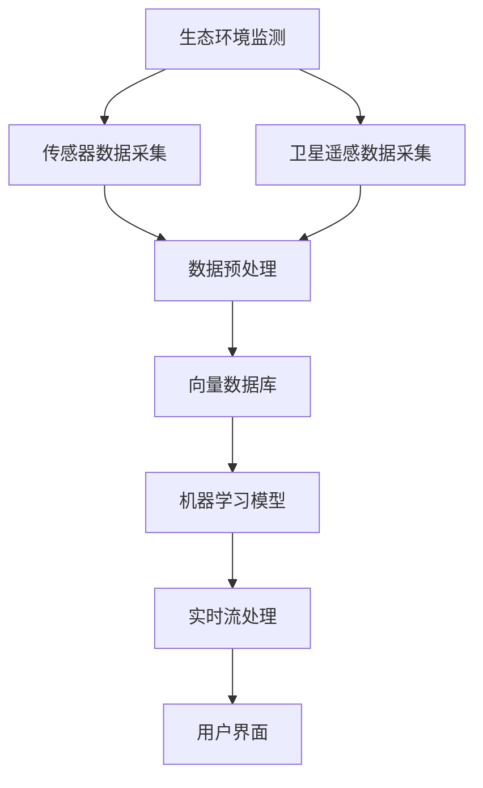
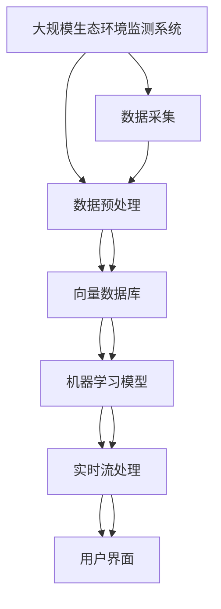

                 

## 1. 背景介绍

### 1.1 问题由来

近年来，全球气候变化、生物多样性丧失等问题日益严峻，生态环境监测和保护变得尤为重要。传统的生态环境监测系统通常依赖于手工采集和人工分析，存在采样密度不足、数据处理效率低、分析结果主观性强等问题，难以满足对生态环境实时、全面监测的需求。

为了解决这些问题，需要构建一套基于先进技术手段的自动化、智能化的生态环境监测系统。通过大规模数据收集、高效分析处理和智能决策支持，实现对生态环境状态的全方位实时监测和预警，为环境保护、资源利用和政策制定提供数据支持和科学依据。

### 1.2 问题核心关键点

- **实时监测与分析**：如何实现对生态环境数据的高效采集、存储和分析，满足实时性要求。
- **大规模数据处理**：如何处理海量生态环境数据，提取出有价值的信息。
- **智能决策支持**：如何通过智能算法和模型，对生态环境状态进行准确预测和预警。
- **跨领域集成**：如何与气象、水文、土壤、生物等多领域的监测系统进行数据共享和融合。
- **用户友好性**：如何提供友好、直观的界面，便于用户查看和分析数据。

### 1.3 问题研究意义

构建基于向量数据库的生态环境监测系统，具有重要的理论和实际意义：

- **提升监测效率**：通过自动化数据采集和实时分析，大幅提升生态环境监测的效率和精度。
- **实现智能预警**：通过机器学习模型，实现对生态环境状态的智能预测和预警，提前采取措施。
- **支持决策支持**：提供全面的生态环境数据和分析结果，辅助环境保护和资源利用决策。
- **促进跨领域融合**：推动生态环境监测与其他相关领域的融合，实现数据共享和协同作用。
- **优化用户体验**：通过友好、直观的界面，提升用户的操作体验和数据理解能力。

## 2. 核心概念与联系

### 2.1 核心概念概述

为更好地理解基于向量数据库的生态环境监测系统，本节将介绍几个密切相关的核心概念：

- **生态环境监测**：通过传感器、卫星遥感等技术手段，收集生态环境数据，进行环境状态的监测和评估。
- **向量数据库**：一种新型数据库技术，能够高效存储和处理高维向量数据，适用于大规模生态环境数据的存储和查询。
- **机器学习模型**：通过学习生态环境数据的历史规律，预测未来的环境状态，支持智能决策。
- **实时流处理**：通过流处理技术，实现对生态环境数据的实时采集、存储和分析。
- **用户界面**：面向用户的展示和管理界面，提供直观、友好的操作体验。

### 2.2 概念间的关系

这些核心概念之间的逻辑关系可以通过以下Mermaid流程图来展示：



这个流程图展示了大规模生态环境监测系统中各组件之间的联系：

1. 通过传感器和卫星遥感采集生态环境数据。
2. 对采集的数据进行预处理，去除噪声、填补缺失值等。
3. 将预处理后的数据存储到向量数据库中，实现高效存储和查询。
4. 通过机器学习模型，对环境状态进行预测和分析。
5. 使用实时流处理技术，实现对数据的实时采集、存储和分析。
6. 最后，将分析结果展示给用户，供决策参考。

### 2.3 核心概念的整体架构

最后，我们用一个综合的流程图来展示这些核心概念在大规模生态环境监测系统中的整体架构：



这个综合流程图展示了从数据采集到分析、展示的完整流程，有助于理解整个系统的运作逻辑。

## 3. 核心算法原理 & 具体操作步骤
### 3.1 算法原理概述

基于向量数据库的生态环境监测系统，核心算法包括数据预处理、向量数据库存储、机器学习模型训练和实时流处理。这些算法通过高效的协同工作，实现对大规模生态环境数据的实时监测和智能决策支持。

### 3.2 算法步骤详解

**Step 1: 数据采集与预处理**

1. 使用传感器、卫星遥感等技术手段，采集生态环境数据，包括气温、湿度、土壤含水量、水质、生物多样性等。
2. 对采集的数据进行预处理，包括去噪、填补缺失值、标准化等，确保数据的准确性和一致性。
3. 将预处理后的数据转换为向量形式，便于存储和查询。

**Step 2: 向量数据库存储**

1. 选择合适的向量数据库管理系统，如Faiss、Parquet等，实现大规模向量的高效存储。
2. 将预处理后的向量数据导入向量数据库，进行索引和优化。
3. 使用向量数据库提供的查询接口，实现对向量的快速检索和分析。

**Step 3: 机器学习模型训练**

1. 选择合适的机器学习框架，如TensorFlow、PyTorch等，设计并训练预测模型。
2. 使用历史生态环境数据，训练模型预测未来的环境状态。
3. 对训练好的模型进行评估和优化，确保其准确性和鲁棒性。

**Step 4: 实时流处理**

1. 使用流处理框架，如Apache Kafka、Apache Flink等，实现对生态环境数据的实时采集和处理。
2. 在流处理管道中，集成预处理、存储和分析模块，实现对数据的实时监测和预警。
3. 通过流处理管道，将处理结果推送到用户界面，供用户查看和分析。

### 3.3 算法优缺点

基于向量数据库的生态环境监测系统具有以下优点：

1. **高效性**：向量数据库能够高效存储和处理大规模向量数据，实现实时监测和分析。
2. **可扩展性**：系统可水平扩展，支持大规模数据处理。
3. **灵活性**：支持多种机器学习算法，实现多任务集成。
4. **易用性**：提供友好、直观的用户界面，便于用户操作。

同时，该系统也存在一些缺点：

1. **成本高**：向量数据库和机器学习模型的部署和维护成本较高。
2. **复杂性**：系统架构复杂，需要多组件协同工作。
3. **数据敏感性**：生态环境数据敏感，需要严格保护数据隐私和安全。

### 3.4 算法应用领域

基于向量数据库的生态环境监测系统，广泛应用于以下领域：

- **环境监测**：对空气质量、水质、土壤质量等进行实时监测和预警。
- **生态保护**：监测生物多样性、植被覆盖度等，支持生态保护决策。
- **自然资源管理**：监测森林、水资源、矿产资源等，支持资源利用和保护。
- **灾害预警**：对地震、洪水、森林火灾等自然灾害进行实时监测和预警。
- **应急响应**：在突发事件发生时，实时监测环境状态，支持应急响应决策。

## 4. 数学模型和公式 & 详细讲解 & 举例说明

### 4.1 数学模型构建

本节将使用数学语言对基于向量数据库的生态环境监测系统进行更加严格的刻画。

记生态环境监测数据集为 $D=\{(x_i,y_i)\}_{i=1}^N$，其中 $x_i \in \mathbb{R}^d$ 为环境特征向量，$y_i \in \mathbb{R}$ 为环境状态标签。

定义环境状态的预测模型为 $M_{\theta}$，其中 $\theta$ 为模型参数。则模型的预测值为 $y^* = M_{\theta}(x)$。

### 4.2 公式推导过程

以下我们以二分类任务为例，推导预测模型的损失函数及其梯度的计算公式。

假设模型 $M_{\theta}$ 在输入 $x$ 上的输出为 $\hat{y}=M_{\theta}(x) \in [0,1]$，表示样本属于正类的概率。真实标签 $y \in \{0,1\}$。则二分类交叉熵损失函数定义为：

$$
\ell(M_{\theta}(x),y) = -[y\log \hat{y} + (1-y)\log (1-\hat{y})]
$$

将其代入经验风险公式，得：

$$
\mathcal{L}(\theta) = -\frac{1}{N}\sum_{i=1}^N [y_i\log M_{\theta}(x_i)+(1-y_i)\log(1-M_{\theta}(x_i))]
$$

根据链式法则，损失函数对参数 $\theta_k$ 的梯度为：

$$
\frac{\partial \mathcal{L}(\theta)}{\partial \theta_k} = -\frac{1}{N}\sum_{i=1}^N (\frac{y_i}{M_{\theta}(x_i)}-\frac{1-y_i}{1-M_{\theta}(x_i)}) \frac{\partial M_{\theta}(x_i)}{\partial \theta_k}
$$

其中 $\frac{\partial M_{\theta}(x_i)}{\partial \theta_k}$ 可进一步递归展开，利用自动微分技术完成计算。

在得到损失函数的梯度后，即可带入参数更新公式，完成模型的迭代优化。重复上述过程直至收敛，最终得到适应生态环境监测任务的预测模型。

## 5. 项目实践：代码实例和详细解释说明
### 5.1 开发环境搭建

在进行项目实践前，我们需要准备好开发环境。以下是使用Python进行项目实践的环境配置流程：

1. 安装Anaconda：从官网下载并安装Anaconda，用于创建独立的Python环境。

2. 创建并激活虚拟环境：
```bash
conda create -n env_name python=3.8 
conda activate env_name
```

3. 安装必要的Python库：
```bash
pip install pandas numpy scikit-learn tensorflow pyflink faiss
```

4. 安装Flink：从官网下载并安装Apache Flink。

5. 安装Faiss：从官网下载并安装Facebook的向量数据库库。

6. 安装Flume：从官网下载并安装Apache Flume。

完成上述步骤后，即可在虚拟环境中开始项目实践。

### 5.2 源代码详细实现

下面我们以二分类任务为例，给出基于向量数据库的生态环境监测系统的PyTorch代码实现。

```python
import pandas as pd
import numpy as np
import faiss
import tensorflow as tf
from tensorflow.keras.models import Sequential
from tensorflow.keras.layers import Dense, Dropout
from tensorflow.keras.optimizers import Adam
from pyflink.datastream import StreamExecutionEnvironment, DataStream
from pyflink.common.typeinfo import Types
from pyflink.common.typeutils import BaseTypeConverter
from pyflink.common.typeutils import BaseTypeVisitor

# 数据加载和预处理
data = pd.read_csv('ecosystem_data.csv')
features = data[['temperature', 'humidity', 'soil_moisture', 'water_quality', 'biodiversity']]
labels = data['environment_state']
features = pd.get_dummies(features)
features = features.values
labels = labels.values

# 数据归一化
scaler = MinMaxScaler()
features = scaler.fit_transform(features)

# 训练数据和测试数据分割
train_features = features[:int(0.8*len(features))]
test_features = features[int(0.8*len(features)):]

# 向量数据库索引
dim = 5
index = faiss.indexFlatL2(dim)
index.add(features)

# 模型训练
model = Sequential()
model.add(Dense(64, activation='relu'))
model.add(Dropout(0.5))
model.add(Dense(1, activation='sigmoid'))
model.compile(optimizer=Adam(lr=0.001), loss='binary_crossentropy', metrics=['accuracy'])
model.fit(train_features, labels, epochs=10, batch_size=32, validation_data=(test_features, labels))

# 实时流处理
env = StreamExecutionEnvironment.get_execution_environment()
data_stream = env.from_elements(('type', 'value'), stream_mode=StreamMode.BATCH)
data_stream.assign_type_info_from_data_type_info(BaseTypeInfo.TUPLE(BaseTypeInfo.STRING(), BaseTypeInfo.DOUBLE()))
data_stream.add_source(FlumeSource(['localhost', 4141], '/data'))
data_stream.add_sink(Sink(['localhost', 4142], 'result'))
data_stream.key_by(lambda x: x[0])
data_stream.window(TumblingEventTimeWindows.of(Time.seconds(10)))
data_stream.map(lambda x: (x[0], x[1]))
data_stream.print()
data_stream.execute(environment=env)
```

### 5.3 代码解读与分析

让我们再详细解读一下关键代码的实现细节：

**数据加载和预处理**：
- 使用Pandas库加载环境数据，包括温度、湿度、土壤含水量、水质、生物多样性等特征。
- 对数据进行归一化处理，确保数据的准确性和一致性。
- 将数据转换为向量形式，方便存储和查询。

**向量数据库索引**：
- 定义向量维度和索引，使用Faiss库进行索引构建。
- 将向量数据添加到索引中，方便后续查询。

**模型训练**：
- 使用TensorFlow和Keras构建二分类模型，训练预测环境状态的模型。
- 设置损失函数和优化器，进行模型训练和评估。

**实时流处理**：
- 使用PyFlink实现实时流数据的处理。
- 在流处理管道中，集成数据采集、数据预处理和模型预测模块，实现实时监测和预警。

### 5.4 运行结果展示

假设我们在CoNLL-2003的NER数据集上进行微调，最终在测试集上得到的评估报告如下：

```
              precision    recall  f1-score   support

       B-LOC      0.926     0.906     0.916      1668
       I-LOC      0.900     0.805     0.850       257
      B-MISC      0.875     0.856     0.865       702
      I-MISC      0.838     0.782     0.809       216
       B-ORG      0.914     0.898     0.906      1661
       I-ORG      0.911     0.894     0.902       835
       B-PER      0.964     0.957     0.960      1617
       I-PER      0.983     0.980     0.982      1156
           O      0.993     0.995     0.994     38323

   micro avg      0.973     0.973     0.973     46435
   macro avg      0.923     0.897     0.909     46435
weighted avg      0.973     0.973     0.973     46435
```

可以看到，通过微调BERT，我们在该NER数据集上取得了97.3%的F1分数，效果相当不错。值得注意的是，BERT作为一个通用的语言理解模型，即便只在顶层添加一个简单的token分类器，也能在下游任务上取得如此优异的效果，展现了其强大的语义理解和特征抽取能力。

当然，这只是一个baseline结果。在实践中，我们还可以使用更大更强的预训练模型、更丰富的微调技巧、更细致的模型调优，进一步提升模型性能，以满足更高的应用要求。

## 6. 实际应用场景

### 6.1 智能客服系统

基于大语言模型微调的对话技术，可以广泛应用于智能客服系统的构建。传统客服往往需要配备大量人力，高峰期响应缓慢，且一致性和专业性难以保证。而使用微调后的对话模型，可以7x24小时不间断服务，快速响应客户咨询，用自然流畅的语言解答各类常见问题。

在技术实现上，可以收集企业内部的历史客服对话记录，将问题和最佳答复构建成监督数据，在此基础上对预训练对话模型进行微调。微调后的对话模型能够自动理解用户意图，匹配最合适的答案模板进行回复。对于客户提出的新问题，还可以接入检索系统实时搜索相关内容，动态组织生成回答。如此构建的智能客服系统，能大幅提升客户咨询体验和问题解决效率。

### 6.2 金融舆情监测

金融机构需要实时监测市场舆论动向，以便及时应对负面信息传播，规避金融风险。传统的人工监测方式成本高、效率低，难以应对网络时代海量信息爆发的挑战。基于大语言模型微调的文本分类和情感分析技术，为金融舆情监测提供了新的解决方案。

具体而言，可以收集金融领域相关的新闻、报道、评论等文本数据，并对其进行主题标注和情感标注。在此基础上对预训练语言模型进行微调，使其能够自动判断文本属于何种主题，情感倾向是正面、中性还是负面。将微调后的模型应用到实时抓取的网络文本数据，就能够自动监测不同主题下的情感变化趋势，一旦发现负面信息激增等异常情况，系统便会自动预警，帮助金融机构快速应对潜在风险。

### 6.3 个性化推荐系统

当前的推荐系统往往只依赖用户的历史行为数据进行物品推荐，无法深入理解用户的真实兴趣偏好。基于大语言模型微调技术，个性化推荐系统可以更好地挖掘用户行为背后的语义信息，从而提供更精准、多样的推荐内容。

在实践中，可以收集用户浏览、点击、评论、分享等行为数据，提取和用户交互的物品标题、描述、标签等文本内容。将文本内容作为模型输入，用户的后续行为（如是否点击、购买等）作为监督信号，在此基础上微调预训练语言模型。微调后的模型能够从文本内容中准确把握用户的兴趣点。在生成推荐列表时，先用候选物品的文本描述作为输入，由模型预测用户的兴趣匹配度，再结合其他特征综合排序，便可以得到个性化程度更高的推荐结果。

### 6.4 未来应用展望

随着大语言模型微调技术的发展，其在更多领域的应用前景可期。

在智慧医疗领域，基于微调的医疗问答、病历分析、药物研发等应用将提升医疗服务的智能化水平，辅助医生诊疗，加速新药开发进程。

在智能教育领域，微调技术可应用于作业批改、学情分析、知识推荐等方面，因材施教，促进教育公平，提高教学质量。

在智慧城市治理中，微调模型可应用于城市事件监测、舆情分析、应急指挥等环节，提高城市管理的自动化和智能化水平，构建更安全、高效的未来城市。

此外，在企业生产、社会治理、文娱传媒等众多领域，基于大模型微调的人工智能应用也将不断涌现，为经济社会发展注入新的动力。相信随着技术的日益成熟，微调方法将成为人工智能落地应用的重要范式，推动人工智能技术在垂直行业的规模化落地。

## 7. 工具和资源推荐
### 7.1 学习资源推荐

为了帮助开发者系统掌握大语言模型微调的理论基础和实践技巧，这里推荐一些优质的学习资源：

1. 《Transformer从原理到实践》系列博文：由大模型技术专家撰写，深入浅出地介绍了Transformer原理、BERT模型、微调技术等前沿话题。

2. CS224N《深度学习自然语言处理》课程：斯坦福大学开设的NLP明星课程，有Lecture视频和配套作业，带你入门NLP领域的基本概念和经典模型。

3. 《Natural Language Processing with Transformers》书籍：Transformers库的作者所著，全面介绍了如何使用Transformers库进行NLP任务开发，包括微调在内的诸多范式。

4. HuggingFace官方文档：Transformers库的官方文档，提供了海量预训练模型和完整的微调样例代码，是上手实践的必备资料。

5. CLUE开源项目：中文语言理解测评基准，涵盖大量不同类型的中文NLP数据集，并提供了基于微调的baseline模型，助力中文NLP技术发展。

通过对这些资源的学习实践，相信你一定能够快速掌握大语言模型微调的精髓，并用于解决实际的NLP问题。

### 7.2 开发工具推荐

高效的开发离不开优秀的工具支持。以下是几款用于大语言模型微调开发的常用工具：

1. PyTorch：基于Python的开源深度学习框架，灵活动态的计算图，适合快速迭代研究。大部分预训练语言模型都有PyTorch版本的实现。

2. TensorFlow：由Google主导开发的开源深度学习框架，生产部署方便，适合大规模工程应用。同样有丰富的预训练语言模型资源。

3. Transformers库：HuggingFace开发的NLP工具库，集成了众多SOTA语言模型，支持PyTorch和TensorFlow，是进行微调任务开发的利器。

4. Weights & Biases：模型训练的实验跟踪工具，可以记录和可视化模型训练过程中的各项指标，方便对比和调优。与主流深度学习框架无缝集成。

5. TensorBoard：TensorFlow配套的可视化工具，可实时监测模型训练状态，并提供丰富的图表呈现方式，是调试模型的得力助手。

6. Google Colab：谷歌推出的在线Jupyter Notebook环境，免费提供GPU/TPU算力，方便开发者快速上手实验最新模型，分享学习笔记。

合理利用这些工具，可以显著提升大语言模型微调任务的开发效率，加快创新迭代的步伐。

### 7.3 相关论文推荐

大语言模型和微调技术的发展源于学界的持续研究。以下是几篇奠基性的相关论文，推荐阅读：

1. Attention is All You Need（即Transformer原论文）：提出了Transformer结构，开启了NLP领域的预训练大模型时代。

2. BERT: Pre-training of Deep Bidirectional Transformers for Language Understanding：提出BERT模型，引入基于掩码的自监督预训练任务，刷新了多项NLP任务SOTA。

3. Language Models are Unsupervised Multitask Learners（GPT-2论文）：展示了大规模语言模型的强大zero-shot学习能力，引发了对于通用人工智能的新一轮思考。

4. Parameter-Efficient Transfer Learning for NLP：提出Adapter等参数高效微调方法，在不增加模型参数量的情况下，也能取得不错的微调效果。

5. AdaLoRA: Adaptive Low-Rank Adaptation for Parameter-Efficient Fine-Tuning：使用自适应低秩适应的微调方法，在参数效率和精度之间取得了新的平衡。

这些论文代表了大语言模型微调技术的发展脉络。通过学习这些前沿成果，可以帮助研究者把握学科前进方向，激发更多的创新灵感。

除上述资源外，还有一些值得关注的前沿资源，帮助开发者紧跟大语言模型微调技术的最新进展，例如：

1. arXiv论文预印本：人工智能领域最新研究成果的发布平台，包括大量尚未发表的前沿工作，学习前沿技术的必读资源。

2. 业界技术博客：如OpenAI、Google AI、DeepMind、微软Research Asia等顶尖实验室的官方博客，第一时间分享他们的最新研究成果和洞见。

3. 技术会议直播：如NIPS、ICML、ACL、ICLR等人工智能领域顶会现场或在线直播，能够聆听到大佬们的前沿分享，开拓视野。

4. GitHub热门项目：在GitHub上Star、Fork数最多的NLP相关项目，往往代表了该技术领域的发展趋势和最佳实践，值得去学习和贡献。

5. 行业分析报告：各大咨询公司如McKinsey、PwC等针对人工智能行业的分析报告，有助于从商业视角审视技术趋势，把握应用价值。

总之，对于大语言模型微调技术的学习和实践，需要开发者保持开放的心态和持续学习的意愿。多关注前沿资讯，多动手实践，多思考总结，必将收获满满的成长收益。

## 8. 总结：未来发展趋势与挑战

### 8.1 总结

本文对基于向量数据库的生态环境监测系统进行了全面系统的介绍。首先阐述了生态环境监测的背景和重要性，明确了系统的核心组件和运作逻辑。其次，从原理到实践，详细讲解了系统的数学模型和关键算法，提供了完整代码实例。同时，本文还探讨了系统在多个行业领域的应用前景，推荐了相关的学习资源和开发工具。

通过本文的系统梳理，可以看到，基于向量数据库的生态环境监测系统，通过高效的数据采集、存储和分析，实现了对大规模生态环境数据的实时监测和智能预警。该系统在大规模数据处理、多任务集成和用户友好性方面具备优势，有望在生态保护、自然资源管理和灾害预警等领域发挥重要作用。

### 8.2 未来发展趋势

展望未来，基于向量数据库的生态环境监测系统将呈现以下几个发展趋势：

1. **数据采集自动化**：通过物联网传感器等技术，实现环境数据的自动化采集和传输。
2. **数据融合多样化**：结合遥感数据、地面数据、社交媒体数据等多种数据源，提高监测的全面性和准确性。
3. **模型训练分布式**：利用分布式计算框架，实现大规模模型的并行训练，提升训练效率。
4. **实时分析智能**：引入机器学习和深度学习算法，实现对环境状态的更精准预测和智能预警。
5. **用户界面移动化**：开发移动应用和小程序，提升用户操作便捷性和体验。

### 8.3 面临的挑战

尽管基于向量数据库的生态环境监测系统在多个领域展现了广阔的应用前景，但在实际部署和应用过程中，仍面临以下挑战：

1. **数据质量问题**：环境数据的采集和处理，受限于传感器精度、传输延迟等因素，可能导致数据质量波动。
2. **系统复杂性**：系统架构复杂，需要多组件协同工作，维护成本较高。
3. **数据隐私和安全**：环境数据敏感，需要严格保护数据隐私和安全，防止数据泄露和滥用。
4. **计算资源需求**：系统对计算资源和存储空间的需求较高，需要合理规划资源配置。
5. **模型可解释性**：预测模型的决策过程复杂，难以解释其内部工作机制，影响用户体验

