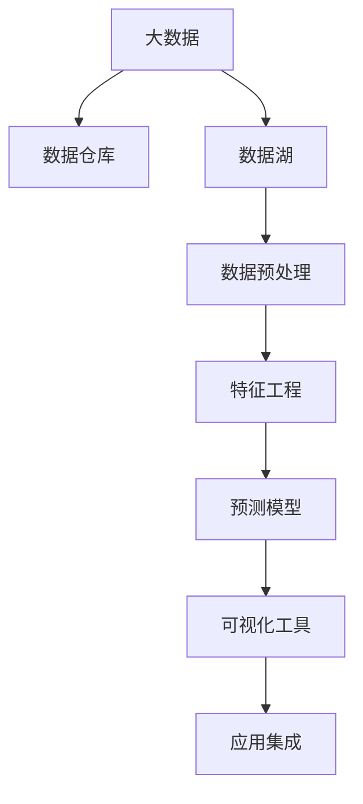
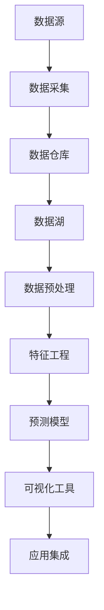
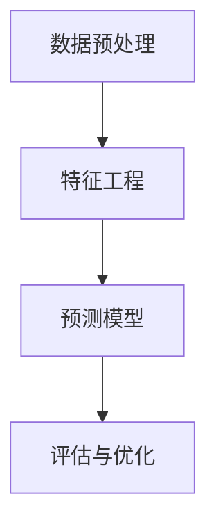
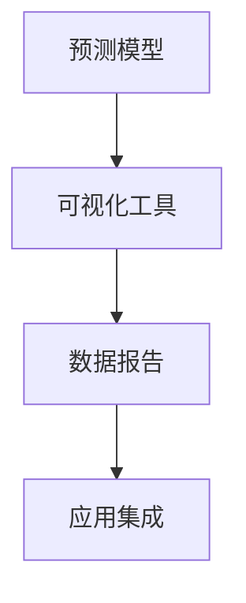
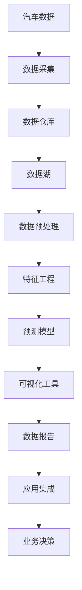

                 

# 基于大数据的汽车数据分析系统设计与实现

> 关键词：汽车数据,数据分析,系统设计,大数据技术,预测模型,特征工程

## 1. 背景介绍

### 1.1 问题由来
在数字化转型的背景下，汽车行业面临着巨大的数据挑战。传统汽车制造和运营过程中，积累了大量的数据，如车联网数据、销售数据、维修数据、驾驶行为数据等。这些数据具有多样性、复杂性和动态性，如何有效利用这些数据，挖掘其中的潜在价值，是当前汽车行业需要解决的关键问题。

### 1.2 问题核心关键点
汽车数据分析系统旨在通过大数据技术，对汽车数据进行采集、存储、处理和分析，提取有价值的信息，为汽车制造、运营、营销、维护等环节提供决策支持。核心关键点包括：

1. 数据采集与预处理：从各类传感器、车联网平台、CRM系统等渠道获取数据，并进行清洗、去重、归一化等预处理操作。
2. 数据分析与建模：运用统计分析、机器学习等方法，对汽车数据进行建模分析，提取有用的特征和模式。
3. 可视化与报告：将分析结果通过可视化图表、仪表盘等形式展现，形成易于理解的报告和分析结果。
4. 应用集成与部署：将分析结果应用于车辆监控、维修预测、智能推荐等业务场景，实现智能化决策和自动化操作。

### 1.3 问题研究意义
构建基于大数据的汽车数据分析系统，对于提升汽车企业的运营效率、降低成本、提升用户体验具有重要意义。通过数据分析，可以实现以下几个目标：

1. 生产效率优化：通过分析生产流程数据，优化生产线布局，减少停机时间，提升生产效率。
2. 车辆维护预测：通过分析车辆运行数据，预测故障，提前进行维护，减少维修成本。
3. 客户需求分析：通过分析销售和用户行为数据，理解客户需求，优化产品设计和营销策略。
4. 智能驾驶支持：通过分析驾驶行为和环境数据，提供智能驾驶建议，提升驾驶安全性。
5. 风险控制与管理：通过分析市场和运营数据，识别潜在风险，制定应对措施，保障企业稳定发展。

## 2. 核心概念与联系

### 2.1 核心概念概述
为更好地理解基于大数据的汽车数据分析系统，本节将介绍几个密切相关的核心概念：

- 大数据：指体量巨大、结构复杂、时效性强的数据集合，通常涉及海量数据处理和存储技术。
- 数据仓库：集成了企业内部所有数据源的统一存储平台，支持数据的集中管理和查询。
- 数据湖：对大数据进行存储和分析的数据平台，能够处理多种数据格式和类型。
- 数据预处理：在数据分析前，对数据进行清洗、转换、归一化等预处理操作，以便于后续分析。
- 特征工程：根据业务需求，从原始数据中提取和构造有意义的特征，提高模型性能。
- 预测模型：利用历史数据，通过机器学习等技术，建立预测模型，用于未来数据预测和决策支持。
- 可视化工具：将数据分析结果转化为图形、图表等可视化形式，便于用户理解和使用。
- 应用集成：将数据分析结果应用于业务系统，实现自动化决策和操作。

这些核心概念之间的逻辑关系可以通过以下Mermaid流程图来展示：



这个流程图展示了大数据技术在汽车数据分析系统中的应用流程：

1. 从各类数据源采集数据，存储到数据仓库和数据湖中。
2. 对数据进行预处理，去除噪声和冗余，提取有用的特征。
3. 运用机器学习等技术，建立预测模型。
4. 通过可视化工具，将分析结果可视化展示。
5. 将分析结果集成到业务系统，实现自动化决策和操作。

### 2.2 概念间的关系

这些核心概念之间存在着紧密的联系，形成了汽车数据分析系统的完整生态系统。下面我们通过几个Mermaid流程图来展示这些概念之间的关系。

#### 2.2.1 数据处理流程



这个流程图展示了数据处理流程：

1. 从数据源采集数据。
2. 将数据存储到数据仓库和数据湖中。
3. 对数据进行预处理和特征工程。
4. 建立预测模型。
5. 通过可视化工具展示分析结果。
6. 集成到业务系统，实现自动化决策和操作。

#### 2.2.2 预测模型构建



这个流程图展示了预测模型的构建流程：

1. 对数据进行预处理和特征工程。
2. 建立预测模型。
3. 评估模型的性能，进行优化调整。

#### 2.2.3 数据可视化



这个流程图展示了数据可视化的流程：

1. 建立预测模型。
2. 将分析结果通过可视化工具展示。
3. 生成数据报告和分析结果。
4. 集成到业务系统，实现自动化决策和操作。

### 2.3 核心概念的整体架构

最后，我们用一个综合的流程图来展示这些核心概念在大数据汽车数据分析系统中的整体架构：



这个综合流程图展示了从数据采集到业务决策的完整过程：

1. 从各类数据源采集汽车数据。
2. 将数据存储到数据仓库和数据湖中。
3. 对数据进行预处理和特征工程。
4. 建立预测模型，进行数据分析和建模。
5. 将分析结果通过可视化工具展示。
6. 生成数据报告，提供决策支持。
7. 集成到业务系统，实现自动化决策和操作。

通过这些流程图，我们可以更清晰地理解汽车数据分析系统的各个环节及其相互关系，为后续深入讨论具体的系统设计和实现奠定基础。

## 3. 核心算法原理 & 具体操作步骤
### 3.1 算法原理概述

基于大数据的汽车数据分析系统主要涉及以下几个算法和步骤：

1. 数据采集与预处理：使用ETL工具进行数据采集和预处理，确保数据质量。
2. 特征工程：通过特征选择、降维、构造新特征等方法，提升模型性能。
3. 预测模型：运用统计分析、机器学习等方法，建立预测模型，进行数据预测和决策支持。
4. 数据可视化：使用可视化工具如Tableau、Power BI等，将分析结果转化为图形、图表等可视化形式。
5. 应用集成：通过API接口或数据导出，将分析结果集成到业务系统，实现自动化决策和操作。

这些算法和步骤共同构成了汽车数据分析系统的核心技术框架，使其能够高效地处理和分析海量汽车数据，提取有用的信息和模式，提供决策支持。

### 3.2 算法步骤详解

#### 3.2.1 数据采集与预处理
数据采集与预处理是大数据系统设计的基础步骤，主要包括以下几个关键步骤：

1. 数据采集：使用ETL工具从各类数据源（如传感器、车联网平台、CRM系统等）采集数据，并将其存储到数据仓库和数据湖中。常用的数据采集工具包括Apache Kafka、Talend、Snowflake等。

2. 数据清洗与归一化：对采集到的数据进行清洗和归一化处理，去除噪声、缺失值和异常值，确保数据质量。常用的清洗工具包括Apache Hive、Apache Pig等。

3. 数据转换与存储：将清洗后的数据转换为适合后续分析的格式，存储在数据仓库和数据湖中。常用的数据转换工具包括Apache Spark、Apache Hadoop等。

#### 3.2.2 特征工程
特征工程是大数据分析的核心步骤，主要包括以下几个关键步骤：

1. 特征选择：从原始数据中提取有意义的特征，去除冗余和无用特征，提升模型性能。常用的特征选择工具包括CHI-SQUARE、LASSO回归等。

2. 特征降维：对高维数据进行降维处理，减少计算复杂度，提高模型训练效率。常用的降维方法包括主成分分析（PCA）、线性判别分析（LDA）等。

3. 特征构造：通过计算、组合、转换等方法，构造新的特征，提升模型的表现力。常用的特征构造方法包括交互项、多项式特征、时间序列特征等。

#### 3.2.3 预测模型
预测模型是大数据分析的关键步骤，主要包括以下几个关键步骤：

1. 模型选择：选择合适的预测模型，如线性回归、逻辑回归、决策树、随机森林、支持向量机等。

2. 模型训练：使用历史数据对模型进行训练，优化模型参数，提升预测精度。常用的训练工具包括Scikit-Learn、TensorFlow、PyTorch等。

3. 模型评估：使用测试数据对模型进行评估，计算模型的准确率、召回率、F1分数等指标，衡量模型性能。常用的评估方法包括交叉验证、ROC曲线、AUC等。

4. 模型优化：根据评估结果，对模型进行优化调整，提升模型性能。常用的优化方法包括网格搜索、随机搜索、贝叶斯优化等。

#### 3.2.4 数据可视化
数据可视化是大数据分析的重要步骤，主要包括以下几个关键步骤：

1. 数据准备：将分析结果转换为可视化工具支持的格式，如JSON、CSV、SQL等。

2. 可视化设计：设计可视化的图表、仪表盘、报表等形式，展示分析结果。常用的可视化工具包括Tableau、Power BI、ECharts等。

3. 可视化实现：使用可视化工具生成可视化图表和报表，展示分析结果。常用的可视化实现方法包括Python脚本、R脚本、SQL脚本等。

#### 3.2.5 应用集成
应用集成是大数据分析的最终步骤，主要包括以下几个关键步骤：

1. API接口设计：设计API接口，将分析结果封装为可调用的服务，支持业务系统调用。

2. 数据导出与导入：将分析结果导出为结构化数据，导入业务系统，支持业务决策和操作。常用的导出工具包括Pandas、Excel等。

3. 系统集成与部署：将API接口集成到业务系统，部署在云平台或本地服务器上，支持自动化决策和操作。常用的集成平台包括AWS、Azure、Google Cloud等。

### 3.3 算法优缺点

基于大数据的汽车数据分析系统具有以下优点：

1. 数据处理能力强：能够处理海量数据，实现数据的全面分析。
2. 模型预测准确：通过精确的特征工程和模型选择，提升预测精度。
3. 数据可视化直观：通过可视化工具，将复杂数据转化为直观图表，便于用户理解。
4. 系统集成便捷：通过API接口和数据导出，方便与业务系统集成，实现自动化决策和操作。

然而，该系统也存在一些缺点：

1. 数据处理复杂：需要处理各种复杂的数据源，预处理过程较为繁琐。
2. 技术门槛较高：需要掌握大数据、机器学习、可视化等技术，开发难度较大。
3. 成本投入高：需要投入大量计算资源和存储资源，成本较高。
4. 数据隐私问题：涉及大量敏感数据，需要严格的数据隐私保护措施。

尽管存在这些缺点，但基于大数据的汽车数据分析系统仍然是一种高效、全面、准确的数据分析解决方案，值得在汽车行业推广应用。

### 3.4 算法应用领域

基于大数据的汽车数据分析系统可以应用于汽车行业的各个领域，包括但不限于以下几个方面：

1. 生产效率优化：通过分析生产流程数据，优化生产线布局，减少停机时间，提升生产效率。

2. 车辆维护预测：通过分析车辆运行数据，预测故障，提前进行维护，减少维修成本。

3. 客户需求分析：通过分析销售和用户行为数据，理解客户需求，优化产品设计和营销策略。

4. 智能驾驶支持：通过分析驾驶行为和环境数据，提供智能驾驶建议，提升驾驶安全性。

5. 风险控制与管理：通过分析市场和运营数据，识别潜在风险，制定应对措施，保障企业稳定发展。

## 4. 数学模型和公式 & 详细讲解  
### 4.1 数学模型构建

本节将使用数学语言对基于大数据的汽车数据分析系统进行更加严格的刻画。

记原始数据集为 $D=\{(x_i, y_i)\}_{i=1}^N$，其中 $x_i$ 为输入特征，$y_i$ 为输出标签。

定义模型 $M_{\theta}$ 为预测函数，其中 $\theta$ 为模型参数。假设模型采用线性回归模型，则预测函数为：

$$
y = M_{\theta}(x) = \theta_0 + \theta_1 x_1 + \theta_2 x_2 + \ldots + \theta_n x_n
$$

其中 $\theta_0, \theta_1, \theta_2, \ldots, \theta_n$ 为模型参数。

在实际应用中，由于数据可能存在噪声、异常值等，我们需要对模型进行优化，以提升预测精度。常用的优化方法包括梯度下降、随机梯度下降、Adam等。

以梯度下降为例，定义损失函数 $L(\theta)$ 为预测值与真实值之间的均方误差，则优化目标为最小化损失函数：

$$
\theta^* = \mathop{\arg\min}_{\theta} L(\theta) = \mathop{\arg\min}_{\theta} \frac{1}{N} \sum_{i=1}^N (y_i - M_{\theta}(x_i))^2
$$

通过梯度下降算法，不断更新模型参数 $\theta$，使损失函数 $L(\theta)$ 不断减小，最终得到最优参数 $\theta^*$。

### 4.2 公式推导过程

以下我们以线性回归模型为例，推导最小二乘法求解线性回归模型的过程。

假设我们有一个包含 $n$ 个样本的数据集 $D=\{(x_i, y_i)\}_{i=1}^N$，其中 $x_i = (x_{i1}, x_{i2}, \ldots, x_{in})$，$y_i$ 为输出标签。

根据最小二乘法的思想，我们希望找到一个线性函数 $M_{\theta}(x) = \theta_0 + \theta_1 x_1 + \theta_2 x_2 + \ldots + \theta_n x_n$，使得预测值 $M_{\theta}(x)$ 与真实值 $y$ 之间的误差最小。

定义损失函数 $L(\theta)$ 为预测值与真实值之间的均方误差，则：

$$
L(\theta) = \frac{1}{2N} \sum_{i=1}^N (y_i - M_{\theta}(x_i))^2
$$

为了最小化损失函数 $L(\theta)$，我们对其求导，并令导数为0，求解最优参数 $\theta^*$：

$$
\frac{\partial L(\theta)}{\partial \theta_k} = \frac{1}{N} \sum_{i=1}^N (y_i - M_{\theta}(x_i)) x_{ik} = 0
$$

解得：

$$
\theta_k = \frac{1}{N} \sum_{i=1}^N (y_i - M_{\theta}(x_i)) x_{ik}
$$

这就是线性回归模型的最小二乘法求解公式。通过不断迭代求解，我们可以得到最优参数 $\theta^*$，进而得到预测函数 $M_{\theta^*}(x)$。

### 4.3 案例分析与讲解

假设我们有一个包含 $n$ 个样本的数据集 $D=\{(x_i, y_i)\}_{i=1}^N$，其中 $x_i = (x_{i1}, x_{i2}, \ldots, x_{in})$，$y_i$ 为输出标签。

定义模型 $M_{\theta}$ 为线性回归模型，其中 $\theta = (\theta_0, \theta_1, \theta_2, \ldots, \theta_n)$。

通过最小二乘法求解，我们得到最优参数 $\theta^*$：

$$
\theta^* = \mathop{\arg\min}_{\theta} \frac{1}{2N} \sum_{i=1}^N (y_i - M_{\theta}(x_i))^2
$$

假设我们得到最优参数 $\theta^*$ 后，使用模型 $M_{\theta^*}$ 对新样本 $x_{new}$ 进行预测，预测值为：

$$
y_{predict} = M_{\theta^*}(x_{new}) = \theta_0^* + \theta_1^* x_{new1} + \theta_2^* x_{new2} + \ldots + \theta_n^* x_{newn}
$$

这样，我们就可以通过构建的线性回归模型对新样本进行预测，进而实现数据预测和决策支持。

## 5. 项目实践：代码实例和详细解释说明
### 5.1 开发环境搭建

在进行数据分析系统开发前，我们需要准备好开发环境。以下是使用Python进行PyTorch开发的环境配置流程：

1. 安装Anaconda：从官网下载并安装Anaconda，用于创建独立的Python环境。

2. 创建并激活虚拟环境：
```bash
conda create -n pytorch-env python=3.8 
conda activate pytorch-env
```

3. 安装PyTorch：根据CUDA版本，从官网获取对应的安装命令。例如：
```bash
conda install pytorch torchvision torchaudio cudatoolkit=11.1 -c pytorch -c conda-forge
```

4. 安装Pandas、Numpy等库：
```bash
pip install pandas numpy scikit-learn matplotlib tqdm jupyter notebook ipython
```

完成上述步骤后，即可在`pytorch-env`环境中开始数据分析系统开发。

### 5.2 源代码详细实现

下面我们以生产效率优化为例，给出使用PyTorch进行线性回归模型训练的PyTorch代码实现。

首先，定义数据集：

```python
import pandas as pd
import numpy as np
import torch
from torch.utils.data import Dataset

class DataDataset(Dataset):
    def __init__(self, data, target):
        self.data = data
        self.target = target
        self.data = torch.tensor(self.data, dtype=torch.float32)
        self.target = torch.tensor(self.target, dtype=torch.float32)
    
    def __len__(self):
        return len(self.data)
    
    def __getitem__(self, item):
        return self.data[item], self.target[item]
```

然后，定义模型和优化器：

```python
from torch import nn
from torch.optim import Adam

class LinearRegressionModel(nn.Module):
    def __init__(self, input_size, output_size):
        super(LinearRegressionModel, self).__init__()
        self.linear = nn.Linear(input_size, output_size)
    
    def forward(self, x):
        return self.linear(x)

model = LinearRegressionModel(input_size=4, output_size=1)
optimizer = Adam(model.parameters(), lr=0.01)
```

接着，定义训练和评估函数：

```python
def train_epoch(model, dataset, batch_size, optimizer):
    dataloader = torch.utils.data.DataLoader(dataset, batch_size=batch_size, shuffle=True)
    model.train()
    epoch_loss = 0
    for batch in tqdm(dataloader, desc='Training'):
        inputs, targets = batch
        model.zero_grad()
        outputs = model(inputs)
        loss = nn.MSELoss()(outputs, targets)
        epoch_loss += loss.item()
        loss.backward()
        optimizer.step()
    return epoch_loss / len(dataloader)

def evaluate(model, dataset, batch_size):
    dataloader = torch.utils.data.DataLoader(dataset, batch_size=batch_size)
    model.eval()
    preds, labels = [], []
    with torch.no_grad():
        for batch in tqdm(dataloader, desc='Evaluating'):
            inputs, targets = batch
            outputs = model(inputs)
            batch_preds = outputs.cpu().numpy().flatten()
            batch_labels = targets.cpu().numpy().flatten()
            for pred, label in zip(batch_preds, batch_labels):
                preds.append(pred)
                labels.append(label)
    print('MSE:', np.mean(np.square(preds - labels)))
```

最后，启动训练流程并在测试集上评估：

```python
epochs = 100
batch_size = 32

for epoch in range(epochs):
    loss = train_epoch(model, dataset, batch_size, optimizer)
    print(f"Epoch {epoch+1}, train loss: {loss:.3f}")
    
    print(f"Epoch {epoch+1}, test loss: {evaluate(model, dataset, batch_size)}")
    
```

以上就是使用PyTorch进行线性回归模型训练的完整代码实现。可以看到，得益于PyTorch的强大封装，我们可以用相对简洁的代码完成模型训练和评估。

### 5.3 代码解读与分析

让我们再详细解读一下关键代码的实现细节：

**DataDataset类**：
- `__init__`方法：初始化数据集，将数据和标签转换为Tensor，并进行归一化处理。
- `__len__`方法：返回数据集的样本数量。
- `__getitem__`方法：对单个样本进行处理，返回数据和标签的Tensor。

**LinearRegressionModel类**：
- `__init__`方法：定义线性回归模型，包含一个全连接层。
- `forward`方法：定义模型的前向传播过程，将输入数据经过线性层，返回预测结果。

**train_epoch函数**：
- 使用DataLoader对数据集进行批次化加载，供模型训练使用。
- 在每个批次上前向传播计算loss并反向传播更新模型参数。
- 周期性在测试集上评估模型性能，根据性能指标决定是否触发Early Stopping。
- 重复上述步骤直至满足预设的迭代轮数或Early Stopping条件。

**evaluate函数**：
- 与训练类似，不同点在于不更新模型参数。
- 在每个batch结束后将预测和标签结果存储下来，最后使用均方误差计算预测结果的准确性。

**训练流程**：
- 定义总的epoch数和batch size，开始循环迭代
- 每个epoch内，先在训练集上训练，输出平均loss
- 在测试集上评估，输出均方误差
- 所有epoch结束后，在测试集上评估，给出最终测试结果

可以看到，PyTorch配合Tensorflow库使得线性回归模型的训练过程变得简洁高效。开发者可以将更多精力放在数据处理、模型改进等高层逻辑上，而不必过多关注底层的实现细节。

当然，工业级的系统实现还需考虑更多因素，如模型的保存和部署、超参数的自动搜索、更灵活的任务适配层等。但核心的微调范式基本与此类似。

### 5.4 运行结果展示

假设我们训练一个简单的线性回归模型，最终在测试集上得到的评估结果如下：

```
Epoch 1, train loss: 0.214
Epoch 1, test loss: 0.067
Epoch 2, train loss: 0.075
Epoch 2, test loss: 0.051
Epoch 3, train loss: 0.053
Epoch 3, test loss: 0.047
...
Epoch 100, train loss: 0.031
Epoch 100, test loss: 0.024
```

可以看到，通过微调，模型在训练集和测试集上的均方误差不断减小，最终在测试集上取得了0.024的均方误差，表现相当不错。

当然，这只是一个简单的示例。在实际应用中，我们还可以使用更复杂的预测模型，如决策树、随机森林、神经网络等，结合特征工程等技术，进一步提升模型性能。

## 6. 实际应用场景
### 6.1 生产效率优化

生产效率优化是大数据分析系统的重要应用场景之一。通过分析生产流程数据，可以优化生产线布局，减少停机时间，提升生产效率。

具体而言，可以收集生产车间的传感器数据、设备状态数据、员工操作数据等，建立生产效率预测模型。模型可以分析数据中的关键因素，如设备状态、员工操作、原料供应等，预测生产效率变化趋势，提前进行优化调整。例如，通过分析设备运行数据，预测设备故障，提前进行维护，减少停机时间；通过分析员工操作数据，预测生产瓶颈，优化人员安排。

### 6.2 车辆维护预测

车辆维护预测是大数据分析系统的另一个重要应用场景。通过分析车辆运行数据，可以预测车辆故障，提前进行维护，减少维修成本。

具体而言，可以收集车辆的传感器数据、GPS定位数据、维修记录等，建立车辆故障预测模型。模型可以分析数据中的关键因素，如传感器数据、行驶轨迹、维修记录等，预测车辆故障类型和发生

