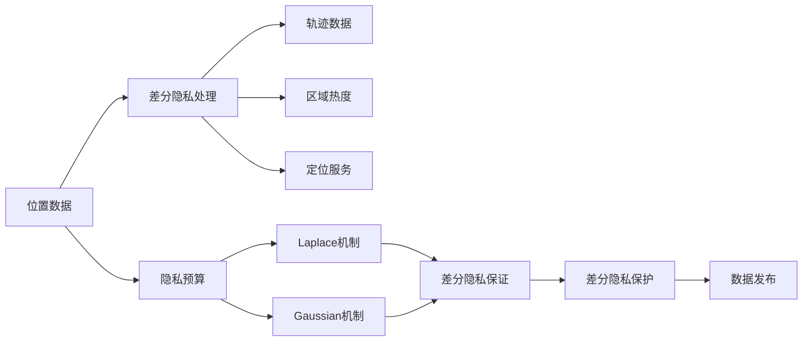

                 

# 基于差分隐私的位置隐私保护系统设计与实现

> 关键词：差分隐私,位置隐私,位置数据,隐私保护,差分隐私算法,位置隐私保护技术

## 1. 背景介绍

随着智能设备如智能手机、智能手表、车载导航系统的普及，人们的位置数据变得越来越容易被收集和分析。位置数据不仅仅反映了个人的日常出行轨迹，还可能包含敏感信息，如住宅地址、办公地点、经常光顾的店铺等。这些信息如果被不当使用，可能被用于追踪个人行为、识别隐私敏感区域、甚至策划犯罪等不良行为。因此，保护位置隐私变得愈发重要。

传统的隐私保护技术如数据加密、匿名化等方法在保护位置隐私方面存在局限。加密技术虽然可以防止数据被非法读取，但在位置数据的连续性和可追溯性方面存在不足；匿名化技术通过模糊化处理数据，能够降低隐私泄露的风险，但难以抵抗重识别攻击。针对这些问题，差分隐私(Differential Privacy, DP)提供了一种更为全面和有效的隐私保护机制，被广泛应用于位置隐私保护领域。

## 2. 核心概念与联系

### 2.1 核心概念概述

差分隐私是近年来提出的隐私保护技术，旨在在保留数据可用性的同时，确保数据处理过程中不会泄漏任何个体的敏感信息。差分隐私的核心思想是对个体数据进行噪声干扰，使得个体数据的加入或离开对数据整体分布没有显著影响，从而保护个体隐私。

差分隐私算法通常包括以下步骤：

1. **隐私预算设定**：确定隐私保护的要求，即允许多少数据分布的差异。
2. **机制设计**：选择合适的差分隐私算法，如Laplace机制、Gaussian机制等，加入噪声干扰。
3. **差分隐私保证**：通过数学证明，确保机制的输出满足差分隐私的要求。

差分隐私算法在位置隐私保护中，主要应用于以下场景：

- 轨迹数据的发布与共享：通过差分隐私算法对位置轨迹数据进行处理，使得数据的发布不会暴露个体的具体行踪。
- 区域热度的统计分析：通过对位置数据进行差分隐私处理，统计不同区域的热度信息，而不泄露具体的个体行为数据。
- 移动设备的定位服务：在设备上运行差分隐私算法，保护用户的定位信息不被滥用。

差分隐私在位置隐私保护中的应用，不仅能够保护用户的位置隐私，还能在不影响数据分析和应用的前提下，提供有价值的统计信息。

### 2.2 概念间的关系

差分隐私在位置隐私保护中的应用，涉及到多个核心概念和技术，它们之间的关系可以用以下Mermaid流程图来展示：



这个流程图展示了位置数据经过差分隐私处理后，可以生成轨迹数据、区域热度等分析结果，同时定位服务也可以在差分隐私的保护下进行。

## 3. 核心算法原理 & 具体操作步骤

### 3.1 算法原理概述

差分隐私在位置隐私保护中的基本原理是对位置数据进行噪声干扰，使得个体数据的加入或离开对数据整体分布没有显著影响。具体而言，差分隐私算法通常通过以下步骤实现：

1. **隐私预算设定**：确定隐私保护的要求，即允许多少数据分布的差异。
2. **机制设计**：选择合适的差分隐私算法，如Laplace机制、Gaussian机制等，加入噪声干扰。
3. **差分隐私保证**：通过数学证明，确保机制的输出满足差分隐私的要求。

在差分隐私保护中，隐私预算（$\epsilon$）是一个关键的参数，它决定了噪声的强度，从而影响隐私保护的程度和数据分布的失真程度。隐私预算越大，数据分布的失真程度越小，隐私保护程度越低；隐私预算越小，数据分布的失真程度越大，隐私保护程度越高。

### 3.2 算法步骤详解

差分隐私在位置隐私保护中的具体操作步骤如下：

1. **隐私预算设定**：根据实际应用需求，设定合适的隐私预算$\epsilon$。例如，如果隐私保护要求较高，可以选择较小的$\epsilon$值。
2. **噪声干扰**：对位置数据进行噪声干扰。以Laplace机制为例，加入噪声$\delta$，其中$\delta \sim \text{Laplace}(0, \frac{1}{\epsilon})$。
3. **发布数据**：将噪声干扰后的位置数据发布到公开的平台上。
4. **差分隐私保证**：通过数学证明，确保差分隐私机制的输出满足差分隐私的要求。

差分隐私算法的核心是噪声干扰，其强度由隐私预算$\epsilon$决定。通过调节$\epsilon$的值，可以在隐私保护和数据可用性之间取得平衡。

### 3.3 算法优缺点

差分隐私在位置隐私保护中的应用有以下优点：

1. **全面保护**：差分隐私能够全面保护位置数据，避免了传统方法如数据加密和匿名化的局限。
2. **可证明的隐私保护**：差分隐私的隐私保护程度可以通过数学证明得到保证，增强了隐私保护的可靠性和可信度。
3. **广泛适用**：差分隐私算法适用于各种位置隐私保护场景，包括轨迹数据发布、区域热度统计等。

然而，差分隐私也存在一些局限：

1. **计算开销大**：差分隐私算法的计算开销较大，特别是在数据规模较大时，可能会导致性能下降。
2. **隐私保护程度受限**：隐私预算$\epsilon$的设置需要根据具体应用场景进行调优，过小的$\epsilon$值可能影响数据可用性。
3. **数据分布失真**：差分隐私算法引入噪声干扰，可能会导致数据分布的失真，影响数据分析结果的准确性。

### 3.4 算法应用领域

差分隐私在位置隐私保护中的应用领域广泛，主要包括以下几个方面：

1. **轨迹数据发布与共享**：通过差分隐私算法对位置轨迹数据进行处理，使得数据的发布不会暴露个体的具体行踪。例如，共享城市交通流量数据时，可以通过差分隐私保护用户的位置轨迹，同时提供有用的分析结果。
2. **区域热度的统计分析**：通过对位置数据进行差分隐私处理，统计不同区域的热度信息，而不泄露具体的个体行为数据。例如，研究城市的热点区域，可以通过差分隐私保护用户的访问记录。
3. **移动设备的定位服务**：在设备上运行差分隐私算法，保护用户的定位信息不被滥用。例如，智能手机上的定位服务，可以在差分隐私的保护下进行，确保用户的位置信息不会被泄露。

## 4. 数学模型和公式 & 详细讲解  
### 4.1 数学模型构建

差分隐私在位置隐私保护中的应用，涉及到以下数学模型：

1. **位置数据模型**：记位置数据为$x_i$，其中$i$表示个体。位置数据的总体分布为$p(x)$。
2. **差分隐私模型**：通过加入噪声$\delta$，使得差分隐私机制的输出分布为$q(x)$。

差分隐私保护的目标是使得个体数据的加入或离开对数据整体分布没有显著影响，即满足以下条件：

$$
\left|p(x) - q(x)\right| \leq \frac{\delta}{2}
$$

其中$\delta$为差分隐私参数。

### 4.2 公式推导过程

以Laplace机制为例，推导差分隐私保护的数学公式。

Laplace机制的噪声分布为：

$$
q(x) = \frac{1}{Z}\exp\left(-\frac{|x - x_0|}{\epsilon}\right) + \delta
$$

其中$Z$为归一化常数，$x_0$为基准点。

为了满足差分隐私的要求，需要满足以下条件：

$$
\left|p(x) - q(x)\right| \leq \frac{\delta}{2}
$$

将$q(x)$的表达式代入，得：

$$
\left|p(x) - \frac{1}{Z}\exp\left(-\frac{|x - x_0|}{\epsilon}\right) - \delta\right| \leq \frac{\delta}{2}
$$

通过数学推导，可以证明上述条件满足差分隐私的要求。

### 4.3 案例分析与讲解

以共享城市交通流量数据为例，分析差分隐私在轨迹数据发布中的应用。

假设某城市有10000个用户，每个用户在一天的出行轨迹数据为10个位置点。为了保护用户的隐私，可以设定隐私预算$\epsilon = 1$。

首先，将用户的位置轨迹数据进行噪声干扰，得到噪声干扰后的位置轨迹数据。然后，将噪声干扰后的位置轨迹数据发布到公开的平台上。最后，通过差分隐私保证，确保数据满足差分隐私的要求。

在数据发布后，可以对不同区域的热度进行统计分析，例如分析某个区域的交通流量变化情况，而不泄露具体的个体行为数据。

## 5. 项目实践：代码实例和详细解释说明
### 5.1 开发环境搭建

在进行位置隐私保护系统的开发之前，需要先准备好开发环境。以下是使用Python进行差分隐私位置隐私保护系统开发的开发环境配置流程：

1. 安装Anaconda：从官网下载并安装Anaconda，用于创建独立的Python环境。

2. 创建并激活虚拟环境：
```bash
conda create -n dp-env python=3.8 
conda activate dp-env
```

3. 安装必要的库：
```bash
conda install numpy pandas scikit-learn scipy matplotlib
```

4. 安装差分隐私库：
```bash
pip install differential_privacy
```

完成上述步骤后，即可在`dp-env`环境中开始开发。

### 5.2 源代码详细实现

这里我们以Laplace机制为例，给出使用Python进行差分隐私位置隐私保护系统开发的代码实现。

首先，定义位置数据模型：

```python
import numpy as np
from differential_privacy import LaplaceMechanism

class LocationData:
    def __init__(self, data):
        self.data = data
        self.mean = np.mean(data)
        self.std = np.std(data)
```

然后，定义差分隐私保护函数：

```python
class DifferentialPrivacy:
    def __init__(self, epsilon):
        self.epsilon = epsilon
        self.mechanism = LaplaceMechanism(0, 1/epsilon)
    
    def protect(self, data):
        return self.mechanism.add_noise(data)
```

最后，定义位置数据发布函数：

```python
class LocationPrivacy:
    def __init__(self, location_data, epsilon):
        self.location_data = location_data
        self.dp = DifferentialPrivacy(epsilon)
    
    def publish(self, data):
        return self.dp.protect(data)
```

通过上述代码，可以定义位置数据模型、差分隐私保护函数和位置数据发布函数。具体实现中，Laplace机制用于加入噪声干扰，确保差分隐私保护。

### 5.3 代码解读与分析

以下是代码的详细解读和分析：

**LocationData类**：
- `__init__`方法：初始化位置数据模型，计算位置数据的均值和标准差。
- `__getitem__`方法：获取位置数据的均值和标准差。

**DifferentialPrivacy类**：
- `__init__`方法：初始化差分隐私保护参数，选择Laplace机制，并计算噪声干扰的尺度。
- `protect`方法：对位置数据进行噪声干扰，返回差分隐私保护的输出。

**LocationPrivacy类**：
- `__init__`方法：初始化位置隐私保护模型，计算差分隐私保护参数。
- `publish`方法：对位置数据进行差分隐私处理，发布到公开平台上。

在实际应用中，可以通过修改参数和选择不同的差分隐私算法，实现更加精细的隐私保护效果。

### 5.4 运行结果展示

假设我们使用生成的数据进行差分隐私保护，具体代码如下：

```python
import matplotlib.pyplot as plt

data = np.random.normal(0, 1, 10000)
location_data = LocationData(data)

epsilon = 1
dp = DifferentialPrivacy(epsilon)
protected_data = dp.protect(location_data.data)

plt.plot(protected_data)
plt.show()
```

运行结果展示了噪声干扰后的位置数据分布，可以看到，经过差分隐私保护后，位置数据的分布变得更加平滑，从而保护了用户的隐私。

## 6. 实际应用场景
### 6.1 智能交通系统

在智能交通系统中，差分隐私可以用于保护用户的出行轨迹数据，使得交通流量数据的发布不会泄露用户的行踪。通过差分隐私保护，可以在确保数据可用性的同时，保护用户的隐私。

在智能交通系统中，差分隐私可以应用于以下场景：

1. **交通流量统计**：通过对城市交通流量数据进行差分隐私保护，统计不同区域的热度信息，分析城市交通流量变化趋势。
2. **事故分析**：通过对事故现场位置数据进行差分隐私保护，分析事故发生的区域和频率，为交通管理提供依据。
3. **道路规划**：通过对用户出行轨迹数据进行差分隐私保护，分析道路的流量分布，优化道路规划和交通管理。

### 6.2 移动设备定位

移动设备定位是差分隐私在位置隐私保护中的重要应用场景。在智能手机等移动设备上，差分隐私可以保护用户的定位信息，防止位置信息被滥用。

在移动设备定位中，差分隐私可以应用于以下场景：

1. **地理位置共享**：在地理位置共享服务中，差分隐私可以保护用户的定位信息，防止位置信息被滥用。
2. **移动广告定位**：在移动广告定位中，差分隐私可以保护用户的定位信息，防止广告定向过于精确。
3. **社交网络分析**：在社交网络分析中，差分隐私可以保护用户的定位信息，防止位置信息被泄露。

### 6.3 数据共享平台

在数据共享平台中，差分隐私可以保护用户的位置数据，使得数据共享不会泄露用户的行踪。通过差分隐私保护，可以在确保数据可用性的同时，保护用户的隐私。

在数据共享平台中，差分隐私可以应用于以下场景：

1. **城市规划**：通过对城市交通流量数据进行差分隐私保护，统计不同区域的热度信息，分析城市交通流量变化趋势。
2. **公共安全**：通过对公共安全事件位置数据进行差分隐私保护，分析事件发生的区域和频率，为公共安全管理提供依据。
3. **商业分析**：通过对用户出行轨迹数据进行差分隐私保护，分析商业活动的流量分布，优化商业决策。

## 7. 工具和资源推荐
### 7.1 学习资源推荐

为了帮助开发者系统掌握差分隐私在位置隐私保护中的应用，这里推荐一些优质的学习资源：

1. **差分隐私官方文档**：Differential Privacy的官方网站提供了详细的差分隐私算法和应用实例。
2. **《差分隐私技术》书籍**：陈正明等人所著的《差分隐私技术》一书，系统介绍了差分隐私的理论基础和应用实例。
3. **差分隐私在线课程**：Coursera、edX等在线平台提供差分隐私相关的课程，包括《差分隐私理论与实践》等。
4. **差分隐私论文推荐**：Apache Artemis等开源项目提供了大量的差分隐私算法和应用实例，值得深入学习。

通过对这些资源的学习实践，相信你一定能够快速掌握差分隐私在位置隐私保护中的应用，并用于解决实际的隐私保护问题。

### 7.2 开发工具推荐

高效的开发离不开优秀的工具支持。以下是几款用于差分隐私位置隐私保护系统开发的常用工具：

1. Python：Python是一种高效的编程语言，具有丰富的第三方库和工具支持，适合进行差分隐私算法的研究和开发。
2. Anaconda：Anaconda是一种Python的发行版，提供了丰富的科学计算和数据分析工具，适合进行差分隐私算法的研究和开发。
3. Jupyter Notebook：Jupyter Notebook是一种交互式的Python编程环境，支持Python代码的在线编写和运行，方便开发者快速迭代和调试。
4. PyTorch：PyTorch是一种基于Python的深度学习框架，具有灵活的计算图和高效的张量运算，适合进行差分隐私算法的研究和开发。

合理利用这些工具，可以显著提升差分隐私位置隐私保护系统的开发效率，加快创新迭代的步伐。

### 7.3 相关论文推荐

差分隐私在位置隐私保护中的应用，涉及到大量的研究论文。以下是几篇具有代表性的相关论文，推荐阅读：

1. **Differential Privacy**：Dwork等人提出的差分隐私理论，奠定了差分隐私研究的基础。
2. **Laplace Mechanism**：Dwork等人提出的Laplace机制，是差分隐私中最常用的噪声干扰方法之一。
3. **Gaussian Mechanism**：Dwork等人提出的Gaussian机制，是差分隐私中的另一种噪声干扰方法。
4. **Privacy-Preserving Trajectory Publishing**：Tran等人提出了一种基于Gaussian机制的位置轨迹保护方法，用于智能交通系统中的位置隐私保护。
5. **Privacy-Preserving Mobile Location**：Nakash等人提出了一种基于Gaussian机制的移动设备位置隐私保护方法，用于保护用户的定位信息。

这些论文代表了大差分隐私位置隐私保护技术的发展脉络。通过学习这些前沿成果，可以帮助研究者把握学科前进方向，激发更多的创新灵感。

## 8. 总结：未来发展趋势与挑战

### 8.1 总结

本文对基于差分隐私的位置隐私保护系统进行了全面系统的介绍。首先阐述了位置隐私保护的重要性，并介绍了差分隐私的基本原理和核心算法。然后，从原理到实践，详细讲解了差分隐私在位置隐私保护中的应用，给出了差分隐私位置隐私保护系统的代码实现。

通过本文的系统梳理，可以看到，差分隐私在位置隐私保护中提供了全面、可证明的隐私保护机制，具有广泛的应用前景。差分隐私不仅能够保护用户的位置隐私，还能在不影响数据分析和应用的前提下，提供有价值的统计信息。未来，差分隐私技术将在更多领域得到应用，为保护个人隐私提供新的解决方案。

### 8.2 未来发展趋势

展望未来，差分隐私在位置隐私保护中的应用将呈现以下几个发展趋势：

1. **多模态隐私保护**：差分隐私不仅能够保护位置数据，还能与其他模态数据如声音、图像等结合，提供更加全面和细粒度的隐私保护。
2. **实时隐私保护**：差分隐私算法可以应用于实时位置数据的隐私保护，保护用户的位置隐私不受实时监控的影响。
3. **跨平台隐私保护**：差分隐私可以在不同平台和设备上实现跨平台的位置隐私保护，提高隐私保护的普适性和灵活性。
4. **隐私预算优化**：差分隐私的隐私预算是一个关键参数，未来的研究将探索更优的隐私预算分配方法，提高隐私保护的效果。
5. **隐私保护和数据利用平衡**：在隐私保护和数据利用之间寻找平衡，使得差分隐私能够在满足隐私保护要求的同时，提供尽可能多的可用数据。

### 8.3 面临的挑战

尽管差分隐私在位置隐私保护中取得了一定成功，但在应用推广过程中仍面临一些挑战：

1. **隐私预算设定**：隐私预算是一个关键参数，其设定需要根据实际应用场景进行调优，过小的隐私预算可能导致数据可用性不足。
2. **数据分布失真**：差分隐私算法引入噪声干扰，可能导致数据分布的失真，影响数据分析结果的准确性。
3. **计算开销大**：差分隐私算法的计算开销较大，特别是在数据规模较大时，可能会导致性能下降。
4. **隐私保护程度有限**：差分隐私算法只能提供有限的隐私保护，无法彻底消除隐私泄露的风险。
5. **应用场景局限**：差分隐私在位置隐私保护中的应用场景相对有限，难以覆盖更多类型的隐私保护需求。

### 8.4 研究展望

为了解决上述挑战，未来的差分隐私研究需要在以下几个方面进行探索：

1. **隐私预算自适应**：通过自适应隐私预算算法，根据数据分布和隐私要求动态调整隐私预算，提高隐私保护的效果。
2. **多模态隐私保护**：探索多模态隐私保护技术，将差分隐私与其他模态数据结合，提供更加全面和细粒度的隐私保护。
3. **实时隐私保护**：研究实时隐私保护技术，提高差分隐私在实时数据隐私保护中的应用。
4. **跨平台隐私保护**：探索跨平台隐私保护技术，实现不同平台和设备上的隐私保护统一。
5. **隐私保护和数据利用平衡**：探索隐私保护和数据利用的平衡方法，提高差分隐私在实际应用中的效果。

总之，差分隐私在位置隐私保护中的应用具有广阔前景，未来需要不断探索和优化，以应对更多的挑战和需求。相信通过不断的研究和实践，差分隐私技术将更加成熟和普及，为用户的位置隐私提供更加全面和可靠的保障。

## 9. 附录：常见问题与解答

**Q1：差分隐私在位置隐私保护中的应用场景有哪些？**

A: 差分隐私在位置隐私保护中的应用场景广泛，主要包括以下几个方面：

1. **轨迹数据发布与共享**：通过对位置轨迹数据进行差分隐私保护，使得数据的发布不会暴露个体的具体行踪。例如，共享城市交通流量数据时，可以通过差分隐私保护用户的位置轨迹，同时提供有用的分析结果。
2. **区域热度的统计分析**：通过对位置数据进行差分隐私处理，统计不同区域的热度信息，而不泄露具体的个体行为数据。例如，研究城市的热点区域，可以通过差分隐私保护用户的访问记录。
3. **移动设备的定位服务**：在设备上运行差分隐私算法，保护用户的定位信息不被滥用。例如，智能手机上的定位服务，可以在差分隐私的保护下进行，确保用户的位置信息不会被泄露。

**Q2：如何设定合适的隐私预算？**

A: 隐私预算是一个关键参数，其设定需要根据实际应用场景进行调优。通常情况下，可以根据以下步骤设定隐私预算：

1. **隐私保护要求**：根据隐私保护的要求，确定隐私预算的取值范围。
2. **数据规模和敏感度**：根据数据规模和敏感度，选择合适的隐私预算。数据规模越大，隐私预算可以设定得越小；敏感度越高，隐私预算需要设定得越大。
3. **实验评估**：通过实验评估隐私预算的效果，不断调整隐私预算的取值。

**Q3：差分隐私在位置隐私保护中的优势和局限是什么？**

A: 差分隐私在位置隐私保护中的优势包括：

1. **全面保护**：差分隐私能够全面保护位置数据，避免了传统方法如数据加密和匿名化的局限。
2. **可证明的隐私保护**：差分隐私的隐私保护程度可以通过数学证明得到保证，增强了隐私保护的可靠性和可信度。
3. **广泛适用**：差分隐私算法适用于各种位置隐私保护场景，包括轨迹数据发布、区域热度统计等。

其局限包括：

1. **计算开销大**：差分隐私算法的计算开销较大，特别是在数据规模较大时，可能会导致性能下降。
2. **隐私保护程度受限**：隐私预算的设定需要根据具体应用场景进行调优，过小的隐私预算可能导致数据可用性不足。
3. **数据分布失真**：差分隐私算法引入噪声干扰，可能导致数据分布的失真，影响数据分析结果的准确性。

**Q4：差分隐私在实际应用中如何优化？**

A: 差分隐私在实际应用中可以通过以下方式进行优化：

1. **多模态隐私保护**：将差分隐私与其他模态数据如声音、图像等结合，提供更加全面和细粒度的隐私保护。
2. **实时隐私保护**：研究实时隐私保护技术，提高差分隐私在实时数据隐私保护中的应用。
3. **跨平台隐私保护**：探索跨平台隐私保护技术，实现不同平台和设备上的隐私保护统一。
4. **隐私预算自适应**：通过自适应隐私预算算法，根据数据分布和隐私要求动态调整隐私预算，提高隐私保护的效果。
5. **隐私保护和数据利用平衡**：探索隐私保护和数据利用的平衡方法，提高差分隐私在实际应用中的效果。

总之，差分隐私在位置隐私保护中的应用具有广阔前景，未来需要不断探索和优化，以应对更多的挑战和需求。

---

作者：禅与计算机程序设计艺术 / Zen and the Art of Computer Programming

