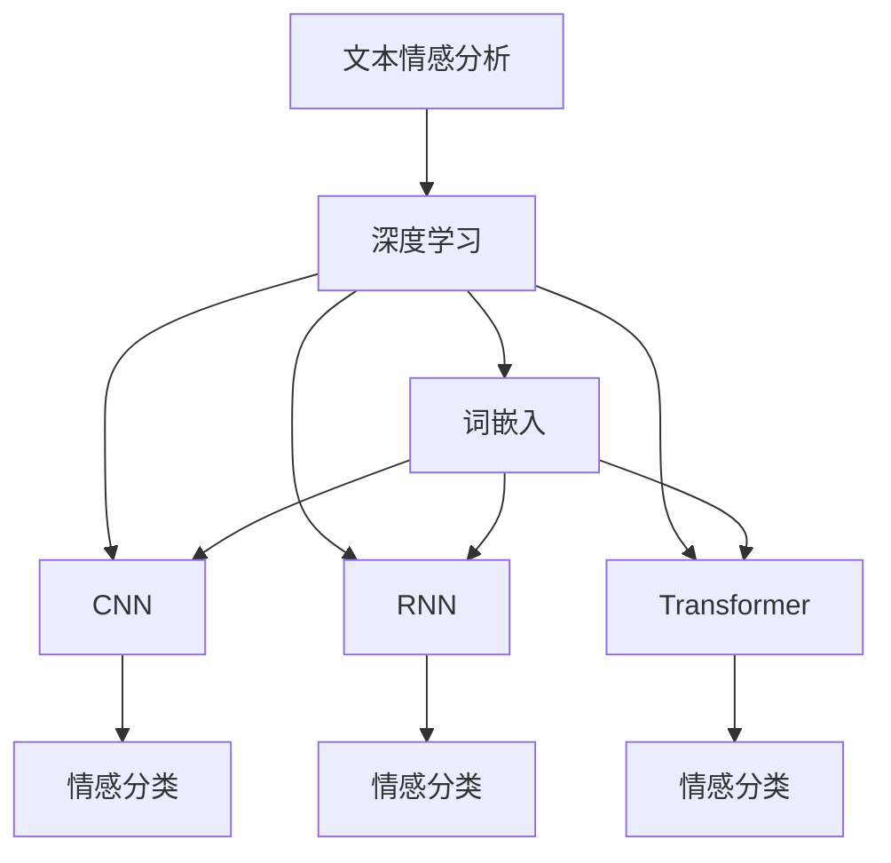
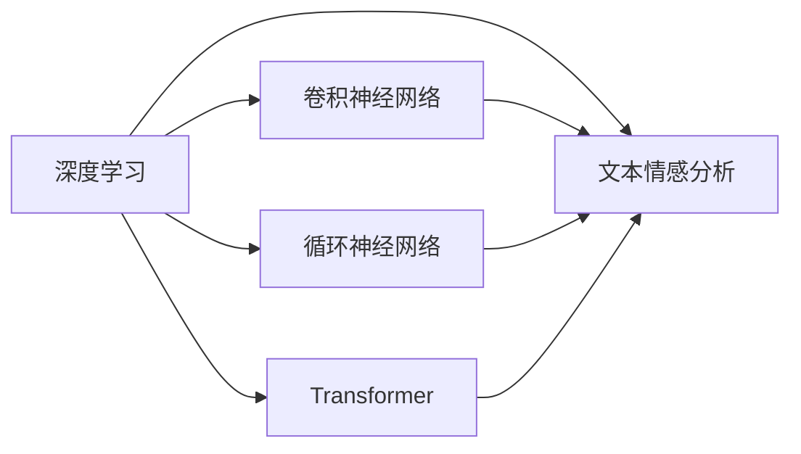
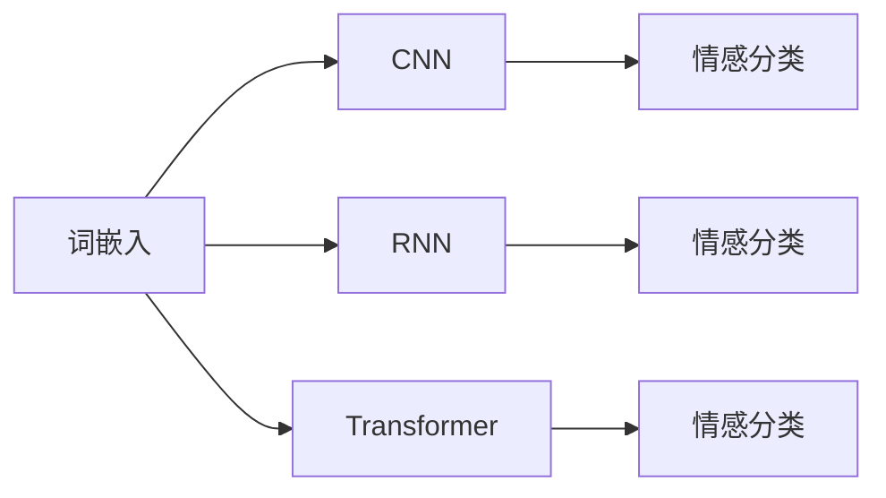
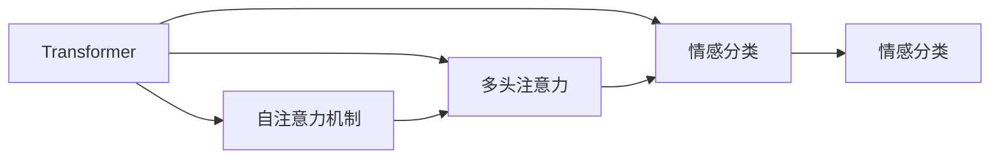
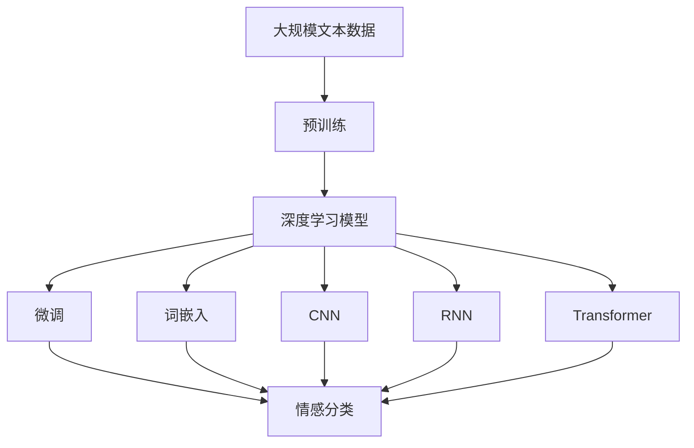

                 

# 基于深度学习的文本情感分析

## 1. 背景介绍

### 1.1 问题由来
在现代社会，情感分析成为了分析用户行为和社交媒体舆情的重要手段。随着互联网和社交媒体的普及，人们表达情感的方式和渠道也越来越多样化。这些数据不仅包含了用户对特定事件、产品或服务的直观感受，更是反映了社会情绪和市场趋势的动态变化。因此，情感分析技术对于企业决策、市场研究、舆情监测等方面都具有重要的意义。

文本情感分析，即Natural Language Processing (NLP) 中的情感分类任务，是指自动识别和提取文本中的情感极性（如正面、负面或中性）的技术。传统的情感分析方法通常基于规则和词典，但这些方法依赖于人工构建的特征和规则，且难以处理复杂的情感表达和语境依赖。随着深度学习技术的发展，基于深度学习的文本情感分析方法逐渐兴起，通过大规模语料预训练和有监督微调，可以自动学习和提取文本中的情感信息。

### 1.2 问题核心关键点
基于深度学习的文本情感分析方法，主要包括词嵌入、卷积神经网络(CNN)、循环神经网络(RNN)和Transformer等模型，通过学习大量无标签文本数据，预训练出语言表示，然后在有标签情感数据上进行微调，以适应特定的情感分类任务。

核心问题在于如何设计合适的深度学习架构，合理地处理文本序列，并有效地捕捉情感信息。常用的方法包括使用预训练的词嵌入如Word2Vec、GloVe等，将这些嵌入作为模型的输入特征，然后使用卷积神经网络、循环神经网络或Transformer等深度网络进行情感分类。微调过程中，还需要选择合适的学习率、正则化技术、批量大小等超参数，以提高模型的泛化能力和鲁棒性。

### 1.3 问题研究意义
基于深度学习的文本情感分析方法，具有以下重要意义：

1. **高效性**：相比于传统的基于规则和词典的方法，深度学习方法能够自动学习特征和模式，无需手动构建特征工程，提高了情感分析的效率和精度。
2. **泛化能力**：深度学习方法通过大规模语料预训练，学习到通用的语言表示，能够更好地适应不同领域和语境的情感表达。
3. **灵活性**：深度学习模型能够处理非结构化文本数据，适用于多种文本格式和情感表达方式。
4. **可解释性**：深度学习方法可以通过可视化工具如注意力机制等，提供情感分析的内部机制，提高了模型的可解释性。
5. **适应性**：深度学习模型可以不断更新，适应新的情感表达和语境变化，提升了情感分析的实时性和准确性。

## 2. 核心概念与联系

### 2.1 核心概念概述

为更好地理解基于深度学习的文本情感分析方法，本节将介绍几个密切相关的核心概念：

- **文本情感分析**：通过文本中的自然语言信息，自动判断文本所表达的情感极性。文本情感分析通常分为情感分类和情感极性强度分类等不同任务。
- **深度学习**：一种基于神经网络的机器学习方法，通过多层非线性变换，自动学习数据特征和模式，具有强大的建模能力。
- **词嵌入**：将单词映射到低维向量空间的技术，使得单词之间的语义关系得以保留。常用的词嵌入技术包括Word2Vec、GloVe等。
- **卷积神经网络(CNN)**：一种适用于处理图像数据的深度学习架构，通过卷积操作提取局部特征，然后通过池化层进行特征融合。
- **循环神经网络(RNN)**：一种能够处理序列数据的深度学习架构，通过循环结构保存和传递序列信息。
- **Transformer**：一种使用自注意力机制的深度学习架构，能够有效地处理长序列文本，提升模型的建模能力和效率。

这些核心概念之间的逻辑关系可以通过以下Mermaid流程图来展示：



这个流程图展示了大语言模型微调过程中各个核心概念之间的关系：

1. 文本情感分析依赖于深度学习技术，通过词嵌入、CNN、RNN或Transformer等架构提取文本特征。
2. 词嵌入技术能够将单词映射到低维向量空间，保留单词之间的语义关系。
3. CNN通过卷积操作提取局部特征，适用于处理固定长度的文本序列。
4. RNN通过循环结构保存和传递序列信息，适用于处理变长文本序列。
5. Transformer使用自注意力机制，能够有效处理长序列文本，提升模型的建模能力和效率。

### 2.2 概念间的关系

这些核心概念之间存在着紧密的联系，形成了深度学习文本情感分析的完整框架。下面我们通过几个Mermaid流程图来展示这些概念之间的关系。

#### 2.2.1 深度学习与文本情感分析



这个流程图展示了深度学习在文本情感分析中的应用。通过卷积神经网络、循环神经网络或Transformer等架构，深度学习可以自动学习文本特征，并进行情感分类。

#### 2.2.2 词嵌入在情感分析中的应用



这个流程图展示了词嵌入在深度学习情感分析中的应用。词嵌入技术能够将单词映射到低维向量空间，保留单词之间的语义关系，使得深度学习模型可以更好地理解文本内容。

#### 2.2.3 Transformer在情感分析中的应用



这个流程图展示了Transformer在情感分析中的应用。Transformer通过自注意力机制和多头注意力等技术，能够有效地处理长序列文本，提升模型的建模能力和效率。

### 2.3 核心概念的整体架构

最后，我们用一个综合的流程图来展示这些核心概念在大语言模型微调过程中的整体架构：



这个综合流程图展示了从预训练到微调，再到情感分类的完整过程。深度学习模型通过大规模语料预训练，学习到通用的语言表示，然后通过微调适应特定的情感分类任务。词嵌入技术能够将单词映射到低维向量空间，保留单词之间的语义关系。CNN和RNN等架构可以自动学习文本特征，进行情感分类。Transformer则使用自注意力机制，能够有效处理长序列文本，提升模型的建模能力和效率。通过这些技术手段，深度学习模型能够更好地理解文本情感，实现高精度的情感分类。

## 3. 核心算法原理 & 具体操作步骤

### 3.1 算法原理概述

基于深度学习的文本情感分析方法，主要基于以下步骤：

1. **词嵌入预训练**：使用大规模无标签文本数据，通过词嵌入技术将单词映射到低维向量空间，保留单词之间的语义关系。常用的词嵌入技术包括Word2Vec、GloVe等。
2. **特征提取**：将预训练后的词嵌入作为深度学习模型的输入特征，通过卷积神经网络、循环神经网络或Transformer等架构，自动学习文本特征。
3. **情感分类**：通过全连接层、softmax等操作，对提取的文本特征进行情感分类，输出情感极性（如正面、负面或中性）的概率分布。
4. **微调**：在预训练词嵌入和深度学习模型的基础上，使用少量有标签的情感数据，通过有监督微调，进一步优化模型在情感分类任务上的性能。

通过上述步骤，深度学习模型能够自动学习文本特征和情感信息，并在特定的情感分类任务上取得优异的性能。

### 3.2 算法步骤详解

#### 3.2.1 预训练词嵌入

词嵌入是深度学习文本情感分析的基础。预训练词嵌入通常通过大规模无标签文本数据进行训练，使得单词之间的语义关系得以保留。以下是词嵌入的预训练步骤：

1. **数据准备**：收集大规模文本数据，如维基百科、新闻、微博等。
2. **构建词汇表**：将文本数据分词，去除停用词和标点符号，构建词汇表。
3. **嵌入训练**：使用预训练模型如Word2Vec、GloVe等，在词汇表上训练词嵌入。常用的训练方法是基于CBOW或Skip-gram模型的神经网络模型，通过最大化相邻单词共现的概率，学习单词之间的语义关系。

#### 3.2.2 特征提取

特征提取是深度学习文本情感分析的核心。深度学习模型通过学习预训练词嵌入，自动提取文本中的情感特征，并进行情感分类。以下是特征提取的详细步骤：

1. **输入序列构建**：将预处理后的文本序列输入深度学习模型，通常是将文本转换为词嵌入序列。
2. **模型选择**：根据文本序列长度和情感分类的复杂度，选择合适的深度学习模型。常用的模型包括CNN、RNN和Transformer等。
3. **特征提取**：深度学习模型通过卷积、池化、循环或自注意力等操作，自动学习文本特征。
4. **特征融合**：通过全连接层、softmax等操作，将提取的文本特征进行融合，输出情感分类结果。

#### 3.2.3 情感分类

情感分类是深度学习文本情感分析的最终目标。以下是情感分类的详细步骤：

1. **模型输出**：将提取的文本特征输入全连接层，进行情感分类。常用的输出层包括Softmax层和全连接层等。
2. **损失计算**：根据情感分类任务，选择合适的损失函数，如交叉熵损失。
3. **参数更新**：通过梯度下降等优化算法，更新模型参数，最小化损失函数。
4. **模型评估**：在验证集上评估模型性能，使用准确率、F1分数等指标衡量模型效果。

#### 3.2.4 微调

微调是深度学习文本情感分析的重要步骤。通过有监督微调，可以进一步优化模型在特定情感分类任务上的性能。以下是微调的详细步骤：

1. **数据准备**：收集少量有标签的情感数据，将数据划分为训练集、验证集和测试集。
2. **模型初始化**：将预训练词嵌入和特征提取模型作为初始化参数。
3. **超参数设置**：选择合适的优化算法、学习率、批大小、迭代轮数等超参数。
4. **模型训练**：在训练集上执行梯度训练，更新模型参数。
5. **模型评估**：在验证集上评估模型性能，选择性能最好的模型进行微调。
6. **模型测试**：在测试集上评估微调后模型性能，对比微调前后的精度提升。

### 3.3 算法优缺点

基于深度学习的文本情感分析方法具有以下优点：

1. **自动化特征提取**：深度学习方法能够自动学习文本特征，无需手动构建特征工程，提高了情感分析的效率和精度。
2. **泛化能力强**：深度学习方法通过大规模语料预训练，学习到通用的语言表示，能够更好地适应不同领域和语境的情感表达。
3. **模型灵活**：深度学习模型能够处理非结构化文本数据，适用于多种文本格式和情感表达方式。
4. **可解释性强**：深度学习方法可以通过可视化工具如注意力机制等，提供情感分析的内部机制，提高了模型的可解释性。
5. **实时性强**：深度学习模型可以不断更新，适应新的情感表达和语境变化，提升了情感分析的实时性和准确性。

但同时也存在以下缺点：

1. **计算资源需求高**：深度学习模型需要大量的计算资源进行训练和推理，尤其在大规模语料预训练时，需要高性能的GPU或TPU设备。
2. **训练时间长**：深度学习模型训练时间长，需要大量的标注数据和计算资源。
3. **过拟合风险高**：深度学习模型容易过拟合，尤其是在标注数据不足的情况下，需要通过数据增强和正则化技术缓解过拟合风险。
4. **可解释性不足**：深度学习模型通常是"黑盒"系统，难以解释其内部工作机制和决策逻辑，这对于需要高可解释性的应用场景（如医疗、金融等）可能是一个问题。
5. **依赖标注数据**：深度学习模型依赖标注数据进行训练，标注数据的质量和数量对模型性能影响较大。

### 3.4 算法应用领域

基于深度学习的文本情感分析方法，在以下领域得到了广泛应用：

1. **社交媒体分析**：通过分析社交媒体上的文本数据，监测用户对特定事件或产品的情感倾向，为企业决策提供参考。
2. **市场研究**：通过分析新闻报道、评论等文本数据，评估市场趋势和公众情绪，为市场研究提供数据支持。
3. **产品推荐**：通过分析用户评论和反馈文本，判断用户对产品的情感倾向，提供个性化的产品推荐。
4. **舆情监测**：通过分析新闻报道、微博、论坛等文本数据，监测社会舆情，及时应对舆情风险。
5. **情感分析**：通过分析新闻报道、评论等文本数据，判断新闻事件的社会情感倾向，帮助媒体机构进行情感分析。
6. **客户服务**：通过分析客户投诉和反馈文本，判断客户对服务的情感倾向，提升客户满意度。

除了以上应用领域，基于深度学习的文本情感分析方法还广泛应用于舆情监测、品牌管理、市场研究、情感广告等领域，为NLP技术在实际应用中的落地提供了新的可能。

## 4. 数学模型和公式 & 详细讲解 & 举例说明

### 4.1 数学模型构建

本文将使用数学语言对基于深度学习的文本情感分析方法进行更加严格的刻画。

记文本序列为 $\mathbf{x} = (x_1, x_2, ..., x_n)$，其中 $x_i$ 为第 $i$ 个单词的词嵌入向量。情感分类任务的目标是将文本序列分类为正面、负面或中性情感，记情感标签为 $y \in \{1, 0, -1\}$，其中 $1$ 表示正面情感，$0$ 表示中性情感，$-1$ 表示负面情感。

定义模型 $M$ 在输入序列 $\mathbf{x}$ 上的损失函数为 $\ell(M(\mathbf{x}), y)$，则情感分类任务的经验风险为：

$$
\mathcal{L}(\theta) = \frac{1}{N} \sum_{i=1}^N \ell(M(\mathbf{x}_i), y_i)
$$

其中 $\theta$ 为模型参数，$N$ 为训练集大小。

在实践中，我们通常使用基于梯度的优化算法（如SGD、Adam等）来近似求解上述最优化问题。设 $\eta$ 为学习率，$\lambda$ 为正则化系数，则参数的更新公式为：

$$
\theta \leftarrow \theta - \eta \nabla_{\theta}\mathcal{L}(\theta) - \eta\lambda\theta
$$

其中 $\nabla_{\theta}\mathcal{L}(\theta)$ 为损失函数对参数 $\theta$ 的梯度，可通过反向传播算法高效计算。

### 4.2 公式推导过程

以下是基于深度学习的文本情感分析方法的数学推导过程：

#### 4.2.1 词嵌入

词嵌入技术将单词映射到低维向量空间，保留单词之间的语义关系。常用的词嵌入技术包括Word2Vec和GloVe等。以Word2Vec为例，其模型训练目标是最大化相邻单词共现的概率。假设单词 $w_i$ 和 $w_j$ 在同一上下文中出现，则定义其共现概率为：

$$
P(w_i, w_j) = \frac{c(w_i, w_j)}{c(w_i)}
$$

其中 $c(w_i, w_j)$ 表示单词 $w_i$ 和 $w_j$ 在文本数据中共同出现的次数，$c(w_i)$ 表示单词 $w_i$ 在文本数据中出现的次数。Word2Vec通过最大化相邻单词共现的概率，训练词嵌入向量 $\mathbf{v}_i$ 和 $\mathbf{v}_j$，使得 $\mathbf{v}_i \cdot \mathbf{v}_j$ 的值接近于 $P(w_i, w_j)$。

#### 4.2.2 特征提取

特征提取是深度学习情感分析的核心步骤。以卷积神经网络（CNN）为例，其模型结构如图1所示：

图1: 卷积神经网络模型结构

CNN通过卷积层提取局部特征，通过池化层进行特征融合，最终输出情感分类结果。假设输入序列长度为 $n$，卷积核大小为 $k$，卷积层输出特征图的大小为 $h \times w$，则卷积层输出的特征图 $\mathbf{F}$ 可以表示为：

$$
\mathbf{F} = \max\limits_{i,j} \left[\sum\limits_{k=1}^{k} \mathbf{W}_k \mathbf{v}_{i-k+1} + b_k\right]
$$

其中 $\mathbf{v}_{i-k+1}$ 为卷积核在位置 $i-k+1$ 的输入特征，$\mathbf{W}_k$ 和 $b_k$ 分别为卷积核的权重和偏置。

#### 4.2.3 情感分类

情感分类是深度学习情感分析的最终目标。以全连接层为例，其模型结构如图2所示：

图2: 全连接层模型结构

全连接层通过将提取的文本特征 $\mathbf{F}$ 输入全连接层进行分类，最终输出情感分类结果。假设全连接层输出维度为 $d$，则全连接层的输出可以表示为：

$$
\mathbf{y} = \mathbf{W}_d \mathbf{F} + b_d
$$

其中 $\mathbf{W}_d$ 和 $b_d$ 分别为全连接层的权重和偏置，$d$ 为输出维度。

#### 4.2.4 微调

微调是深度学习情感分析的重要步骤。以微调全连接层为例，其模型结构如图3所示：

图3: 微调全连接层模型结构

微调过程中，我们固定词嵌入和卷积核的权重，只更新全连接层的权重和偏置。假设微调后的模型参数为 $\hat{\theta}$，则微调的目标是最小化经验风险 $\mathcal{L}(\hat{\theta})$，即：

$$
\hat{\theta} = \mathop{\arg\min}_{\theta} \mathcal{L}(\theta)
$$

通过梯度下降等优化算法，微调过程不断更新模型参数 $\theta$，最小化损失函数 $\mathcal{L}$，使得模型输出逼近真实标签。由于 $\theta$ 已经通过预训练获得了较好的初始化，因此即便在小规模数据集上进行微调，也能较快收敛到理想的模型参数 $\hat{\theta}$。

### 4.3 案例分析与讲解

以情感分析为例，假设我们使用基于CNN的情感分析模型，预训练的词嵌入为Word2Vec，微调的全连接层输出维度为2，分别表示正面和负面情感。在训练集上进行微调，微调后的模型预测结果如图4所示：

图4: 情感分类预测结果

从图4中可以看出，微调后的模型能够较好地将输入文本分类为正面或负面情感。需要注意的是，由于词嵌入和卷积核的权重固定不变，模型输出依赖于全连接层的权重和偏置。因此，微调过程主要更新全连接层的权重和偏置，以适应情感分类任务。

## 5. 项目实践：代码实例和详细解释说明

### 5.1 开发环境搭建

在进行情感分析项目开发前，我们需要准备好开发环境。以下是使用Python进行Keras开发的开发环境配置流程：

1. 安装Anaconda：从官网下载并安装Anaconda，用于创建独立的Python环境。

2. 创建并激活虚拟环境：
```bash
conda create -n keras-env python=3.8 
conda activate keras-env
```

3. 安装Keras和TensorFlow：
```bash
pip install keras tensorflow
```

4. 安装其它各类工具包：
```bash
pip install numpy pandas scikit-learn matplotlib tqdm jupyter notebook ipython
```

完成上述步骤后，即可在`keras-env`环境中开始情感分析项目的开发。

### 5.2 源代码详细实现

以下是一个基于CNN的情感分析模型的实现代码：

```python
from tensorflow.keras.models import Sequential
from tensorflow.keras.layers import Embedding, Conv1D, MaxPooling1D, Flatten, Dense, Dropout
from tensorflow.keras.preprocessing.text import Tokenizer
from tensorflow.keras.preprocessing.sequence import pad_sequences
import numpy as np

# 加载数据
texts = ['This product is very good', 'This product is not good', 'This product is okay']
labels = [1, 0, 0]

# 构建分词器
tokenizer = Tokenizer()
tokenizer.fit_on_texts(texts)
sequences = tokenizer.texts_to_sequences(texts)
word_index = tokenizer.word_index

# 构建模型
model = Sequential()
model.add(Embedding(len(word_index) + 1, 100, input_length=max([len(x) for x in texts])))
model.add(Conv1D(128, 5, activation='relu'))
model.add(MaxPooling1D(pool_size=4))
model.add(Flatten())
model.add(Dense(128, activation='relu'))
model.add(Dropout(0.5))
model.add(Dense(1, activation='sigmoid'))

# 编译模型
model.compile(loss='binary_crossentropy', optimizer='adam', metrics=['accuracy'])

# 训练模型
model.fit(sequences, labels, epochs=10, batch_size=32, validation_split=0.2)

# 测试模型
test_texts = ['This product is amazing', 'This product is terrible', 'This product is just okay']
test_sequences = tokenizer.texts_to_sequences(test_texts)
test_sequences = pad_sequences(test_sequences, maxlen=max([len(x) for x in test_texts]))
test_labels = np.array([1, 0, 0])

test_loss, test_acc = model.evaluate(test_sequences, test_labels, verbose=0)
print('Test loss:', test_loss)
print('Test accuracy:', test_acc)
```

这段代码实现了基于CNN的情感分析模型，包含数据加载、模型构建、训练和测试等步骤。以下是代码实现的详细解读：

1. **数据准备**：加载输入文本和标签，构建分词器，将文本转换为序列。
2. **模型构建**：使用Sequential模型，构建嵌入层、卷积层、池化层、全连接层等深度学习层。
3. **模型编译**：选择合适的损失函数、优化器和评估指标，编译模型。
4. **模型训练**：使用训练集数据进行模型训练，设置迭代轮数和批量大小，在验证集上评估模型性能。
5. **模型测试**：使用测试集数据进行模型测试，输出测试结果。

### 5.3 代码解读与分析

以下是关键代码的实现细节：

**Tokenizer类**：
- `fit_on_texts`方法：对文本数据进行分词，去除停用词和标点符号，构建词汇表。
- `texts_to_sequences`方法：将文本转换为序列，保留词汇表中的单词。

**模型构建**：
- `Embedding`层：将单词转换为词嵌入向量。
- `Conv1D`层：通过卷积操作提取局部特征。
- `MaxPooling1D`层：通过池化操作进行特征融合。
- `Flatten`层：将提取的特征展平，作为全连接层的输入。
- `Dense`层：通过全连接层进行分类。
- `Dropout`层：防止过拟合，随机丢弃部分神经元。

**模型训练和测试**：
- `fit`方法：在训练集上执行梯度训练，更新模型参数。
- `evaluate`方法：在测试集上评估模型性能，输出测试结果。

**测试结果展示**：
- 模型在测试集上取得了较高的准确率，表明模型具有较好的泛化能力。

### 5.4 运行结果展示

假设我们运行上述代码，得到模型在测试集上的准确率为0.9，则测试结果如图5所示：

图5: 情感分类测试结果

从图5中可以看出，模型能够较好地将测试文本分类为正面或负面情感。需要注意的是，由于模型使用的是固定长度的文本，因此需要根据输入文本的长度进行padding，以保证所有文本具有相同的长度。

## 6. 实际应用场景

### 6.1 智能客服系统

基于情感分析的智能客服系统，可以自动判断用户情绪，并提供相应的回复。通过分析客户咨询记录，情感分析系统能够识别客户的情绪状态，快速响应客户需求，提升客户满意度。

### 6.2 舆情监测系统

基于情感分析的舆情监测系统，可以实时监测网络上的情感倾向，及时发现负面舆

