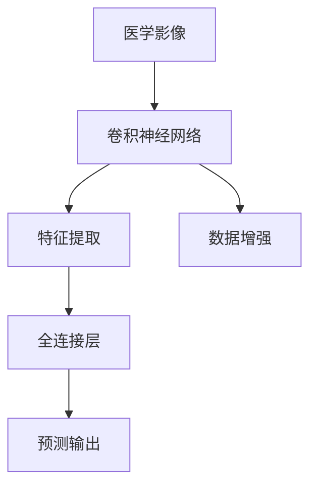
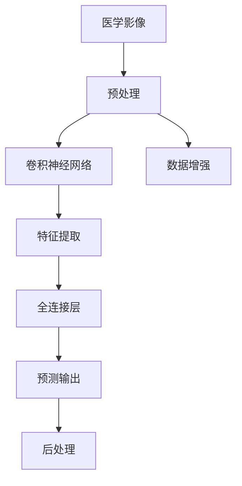

                 

# 基于深度学习的肺癌检测方法研究

> 关键词：深度学习,肺癌检测,医学影像,卷积神经网络(CNN),呼吸系统,图像处理,诊断系统

## 1. 背景介绍

### 1.1 问题由来
肺癌是目前全球范围内最常见的癌症之一，其早期发现和治疗对患者生存率有显著影响。传统肺癌检测依赖于放射科医生的手动阅片，存在主观性大、误诊率高、耗时长的缺陷。随着深度学习技术的进步，基于深度学习的肺癌检测方法逐渐受到关注。深度学习模型通过大量医学影像数据的学习，具备强大的图像识别和分析能力，可以显著提升肺癌检测的准确率和效率。

### 1.2 问题核心关键点
基于深度学习的肺癌检测方法，通过将医学影像数据输入卷积神经网络(CNN)进行训练，使得模型能够自动学习并提取影像中的关键特征，进行肺癌的早期诊断。其核心思想是：利用CNN模型对医学影像中的局部区域进行特征提取，并通过全连接层将特征映射为概率分布，输出预测结果。

深度学习模型通常使用较大的数据集进行预训练，如ImageNet等大型数据集，在预训练过程中学习到丰富的图像特征。然后，在特定任务上进行微调，通过少量标注数据进一步优化模型，适应特定任务的特征。

### 1.3 问题研究意义
基于深度学习的肺癌检测方法，具有以下显著优势：
- 精度高：深度学习模型通过大量数据训练，具备较强的图像特征提取能力，能够准确识别细微的肺部病变。
- 速度快：深度学习模型通过并行计算，可以在短时间内处理大量医学影像数据，提高诊断速度。
- 可扩展性：深度学习模型通过增加数据和计算资源，可以进行无限扩展，适应不同规模的检测需求。
- 客观性：深度学习模型通过定量的特征提取和概率输出，避免了人为的主观判断误差。
- 可解释性：深度学习模型能够通过可视化技术展示特征提取过程，增强模型的可解释性。

因此，基于深度学习的肺癌检测方法，对提升肺癌早期诊断率，减轻医务人员负担，推动医疗智能化转型具有重要意义。

## 2. 核心概念与联系

### 2.1 核心概念概述

为更好地理解基于深度学习的肺癌检测方法，本节将介绍几个关键概念：

- 卷积神经网络(CNN)：一种特殊的深度神经网络，主要用于图像处理和识别任务。通过卷积层和池化层提取图像的局部特征，并由全连接层进行特征映射，输出预测结果。
- 医学影像：指通过医学设备采集的人体内部图像数据，如CT、MRI、X光等。医学影像是深度学习在医疗领域的重要数据来源。
- 肺癌检测：指通过深度学习模型对医学影像数据进行分析，识别并标记出肺部中的肺癌病灶。
- 特征提取：指通过卷积层和池化层从医学影像中提取关键特征，形成对肺部的局部表征。
- 数据增强：指通过对原始医学影像数据进行一系列变换，如旋转、平移、缩放、翻转等，生成更多样化的训练数据，提高模型的泛化能力。

这些概念之间的逻辑关系可以通过以下Mermaid流程图来展示：



这个流程图展示了大语言模型微调过程中各个关键组件及其关系：

1. 医学影像输入到CNN模型进行特征提取。
2. 提取的特征通过全连接层进行特征映射，输出概率分布。
3. 数据增强技术用于扩充训练数据，提高模型的泛化能力。
4. 最终模型输出概率分布，用于检测肺部的癌变区域。

### 2.2 概念间的关系

这些核心概念之间存在着紧密的联系，形成了深度学习肺癌检测的整体架构。下面我通过几个Mermaid流程图来展示这些概念之间的关系。

#### 2.2.1 卷积神经网络的结构


这个流程图展示了卷积神经网络的基本结构，包括卷积层、池化层、全连接层和预测层。

#### 2.2.2 医学影像预处理


这个流程图展示了医学影像预处理的基本流程，包括预处理、增强、归一化和标准化等步骤。

#### 2.2.3 数据增强与特征提取


这个流程图展示了数据增强与特征提取的关系，数据增强技术可以扩充训练数据集，提高模型泛化能力，特征提取则是通过卷积神经网络对医学影像进行局部特征提取。

### 2.3 核心概念的整体架构

最后，我们用一个综合的流程图来展示这些核心概念在大语言模型微调过程中的整体架构：



这个综合流程图展示了从医学影像预处理到预测输出的完整流程。

## 3. 核心算法原理 & 具体操作步骤
### 3.1 算法原理概述

基于深度学习的肺癌检测方法，主要基于卷积神经网络对医学影像进行特征提取，并通过全连接层进行特征映射，输出预测结果。其核心原理可以概括为以下几步：

1. **医学影像预处理**：对原始医学影像数据进行一系列预处理操作，如缩放、旋转、标准化、归一化等，使其具备一致性。
2. **卷积层特征提取**：通过多个卷积核对医学影像进行特征提取，得到一系列局部特征图。
3. **池化层特征压缩**：通过池化操作对特征图进行压缩，减少特征数量，提高计算效率。
4. **全连接层特征映射**：将池化后的特征图输入全连接层，通过线性映射得到一组特征向量。
5. **softmax层输出预测**：对特征向量进行softmax操作，得到每个分类概率，最终输出预测结果。

### 3.2 算法步骤详解

以下是基于深度学习的肺癌检测方法的详细步骤：

**Step 1: 准备数据集**
- 收集肺部CT、MRI等医学影像数据，并进行预处理，如缩放、旋转、标准化、归一化等。
- 标注数据集，生成训练集、验证集和测试集。

**Step 2: 构建卷积神经网络**
- 选择合适的网络结构，如VGG、ResNet、Inception等，作为肺部影像特征提取器。
- 在网络中设计多个卷积层和池化层，提取影像的局部特征。
- 在网络顶部设计全连接层，进行特征映射，输出概率分布。

**Step 3: 设置超参数**
- 选择合适的优化算法，如SGD、Adam等，设置学习率、批大小、迭代轮数等。
- 设置正则化技术及强度，包括权重衰减、Dropout、Early Stopping等。
- 确定冻结预训练参数的策略，如仅微调顶层，或全部参数都参与微调。

**Step 4: 执行梯度训练**
- 将训练集数据分批次输入模型，前向传播计算损失函数。
- 反向传播计算参数梯度，根据设定的优化算法和学习率更新模型参数。
- 周期性在验证集上评估模型性能，根据性能指标决定是否触发Early Stopping。
- 重复上述步骤直到满足预设的迭代轮数或Early Stopping条件。

**Step 5: 测试和部署**
- 在测试集上评估微调后模型的性能，对比微调前后的精度提升。
- 使用微调后的模型对新样本进行推理预测，集成到实际的应用系统中。
- 持续收集新的数据，定期重新微调模型，以适应数据分布的变化。

### 3.3 算法优缺点

基于深度学习的肺癌检测方法具有以下优点：
- 精度高：深度学习模型通过大量数据训练，具备较强的图像特征提取能力，能够准确识别细微的肺部病变。
- 速度快：深度学习模型通过并行计算，可以在短时间内处理大量医学影像数据，提高诊断速度。
- 可扩展性：深度学习模型通过增加数据和计算资源，可以进行无限扩展，适应不同规模的检测需求。
- 客观性：深度学习模型通过定量的特征提取和概率输出，避免了人为的主观判断误差。

但同时，该方法也存在以下局限性：
- 数据依赖性强：深度学习模型需要大量高质量的标注数据进行训练，数据获取和标注成本较高。
- 模型复杂度高：深度学习模型结构复杂，训练和推理计算量较大，需要高性能硬件支持。
- 解释性不足：深度学习模型通常是一个黑盒，难以解释其内部工作机制和决策逻辑。
- 泛化能力受限：深度学习模型对数据分布的变化较为敏感，可能存在泛化能力不足的问题。

尽管存在这些局限性，但基于深度学习的肺癌检测方法在精度和速度上具有显著优势，广泛应用于医学影像分析和诊断系统。

### 3.4 算法应用领域

基于深度学习的肺癌检测方法，已经在医学影像分析和诊断系统中得到了广泛应用，包括但不限于以下领域：

- **医学影像分析**：通过深度学习模型对医学影像进行特征提取和分析，识别肺部病变，辅助医生进行诊断和治疗。
- **呼吸系统疾病检测**：通过深度学习模型对呼吸系统疾病进行早期筛查和诊断，提高疾病的早期发现率。
- **癌症筛查**：通过深度学习模型对癌症影像进行检测和分类，帮助早期发现癌症病灶，提高治疗效果。
- **影像辅助治疗**：通过深度学习模型对治疗前后的影像数据进行对比，评估治疗效果，优化治疗方案。
- **影像增强**：通过深度学习模型对影像数据进行增强和去噪，提高影像质量，辅助医生进行诊断。

这些应用领域展示了深度学习在肺癌检测中的广泛应用前景，推动了医学影像分析技术的进步。

## 4. 数学模型和公式 & 详细讲解  
### 4.1 数学模型构建

基于深度学习的肺癌检测方法，主要通过卷积神经网络对医学影像进行特征提取，并通过全连接层进行特征映射，输出预测结果。其数学模型可以表示为：

$$
y=f(x;\theta)
$$

其中，$x$为输入的医学影像数据，$\theta$为模型参数，$f$为卷积神经网络的前向传播过程，$y$为模型输出，即预测结果。

### 4.2 公式推导过程

以下我将通过具体案例，展示基于深度学习的肺癌检测方法的数学模型构建和公式推导过程。

假设我们有一个简单的卷积神经网络模型，包含两个卷积层和两个池化层，其网络结构如图1所示：


**Step 1: 卷积层特征提取**
设输入图像大小为$H \times W \times C$，第一个卷积层包含$k_1$个$h_1 \times w_1 \times c_1$的卷积核，输出特征图大小为$H' \times W' \times k_1$。则卷积操作可以表示为：

$$
X_1 = X * K_1 + B_1
$$

其中，$X$为输入图像，$K_1$为卷积核，$B_1$为偏置项。$*$表示卷积操作。

**Step 2: 池化层特征压缩**
第一个池化层对$X_1$进行池化操作，得到$H' \times W' \times k_1$的池化特征图。假设采用最大池化操作，则池化操作可以表示为：

$$
X_2 = \max(X_1)
$$

**Step 3: 全连接层特征映射**
将池化特征图$X_2$输入全连接层，通过线性映射得到一组特征向量。假设全连接层包含$l$个神经元，则特征映射过程可以表示为：

$$
Y = \sigma(WY_2 + B)
$$

其中，$Y_2$为池化特征图，$W$为权重矩阵，$B$为偏置项，$\sigma$为激活函数，通常采用ReLU函数。

**Step 4: softmax层输出预测**
将特征向量$Y$输入softmax层，输出每个分类概率。假设共有$n$个分类，则softmax操作可以表示为：

$$
P = \frac{e^Y}{\sum_{i=1}^n e^{Y_i}}
$$

其中，$P$为预测概率分布，$Y_i$为特征向量$Y$中的第$i$个元素。

通过以上步骤，我们得到了基于深度学习的肺癌检测模型的数学模型，可以进行医学影像的特征提取和分类预测。

### 4.3 案例分析与讲解

为了进一步理解基于深度学习的肺癌检测方法，我们以一个具体案例为例，展示模型的构建和训练过程。

假设我们使用ImageNet数据集预训练了一个VGG16网络，然后在肺部CT影像数据集上进行微调，检测肺癌。其步骤如下：

**Step 1: 数据预处理**
- 将肺部CT影像数据集进行预处理，包括缩放、旋转、标准化、归一化等操作。
- 生成训练集、验证集和测试集，并进行数据增强，如随机旋转、平移、缩放、翻转等。

**Step 2: 模型构建**
- 使用预训练的VGG16网络，去掉最后全连接层，重新添加全连接层，用于肺部影像的分类。
- 在全连接层后添加softmax层，输出预测概率。

**Step 3: 设置超参数**
- 选择合适的优化算法，如Adam，设置学习率、批大小、迭代轮数等。
- 设置正则化技术及强度，包括权重衰减、Dropout、Early Stopping等。

**Step 4: 执行梯度训练**
- 将训练集数据分批次输入模型，前向传播计算损失函数。
- 反向传播计算参数梯度，根据设定的优化算法和学习率更新模型参数。
- 周期性在验证集上评估模型性能，根据性能指标决定是否触发Early Stopping。
- 重复上述步骤直到满足预设的迭代轮数或Early Stopping条件。

**Step 5: 测试和部署**
- 在测试集上评估微调后模型的性能，对比微调前后的精度提升。
- 使用微调后的模型对新样本进行推理预测，集成到实际的应用系统中。
- 持续收集新的数据，定期重新微调模型，以适应数据分布的变化。

## 5. 项目实践：代码实例和详细解释说明
### 5.1 开发环境搭建

在进行深度学习模型开发前，我们需要准备好开发环境。以下是使用Python进行TensorFlow开发的环境配置流程：

1. 安装Anaconda：从官网下载并安装Anaconda，用于创建独立的Python环境。

2. 创建并激活虚拟环境：
```bash
conda create -n tensorflow-env python=3.8 
conda activate tensorflow-env
```

3. 安装TensorFlow：根据CUDA版本，从官网获取对应的安装命令。例如：
```bash
conda install tensorflow-gpu -c conda-forge
```

4. 安装各类工具包：
```bash
pip install numpy pandas scikit-learn matplotlib tqdm jupyter notebook ipython
```

完成上述步骤后，即可在`tensorflow-env`环境中开始深度学习模型开发。

### 5.2 源代码详细实现

这里我们以一个简单的VGG16网络为例，展示基于深度学习的肺癌检测方法的代码实现。

首先，定义模型类：

```python
import tensorflow as tf
from tensorflow.keras.layers import Conv2D, MaxPooling2D, Flatten, Dense, Softmax
from tensorflow.keras.models import Model

class LungCancerDetectionModel(tf.keras.Model):
    def __init__(self, input_shape):
        super(LungCancerDetectionModel, self).__init__()
        self.conv1 = Conv2D(32, 3, activation='relu', input_shape=input_shape)
        self.pool1 = MaxPooling2D(2)
        self.conv2 = Conv2D(64, 3, activation='relu')
        self.pool2 = MaxPooling2D(2)
        self.flatten = Flatten()
        self.fc1 = Dense(128, activation='relu')
        self.fc2 = Dense(64, activation='relu')
        self.softmax = Softmax()

    def call(self, inputs):
        x = self.conv1(inputs)
        x = self.pool1(x)
        x = self.conv2(x)
        x = self.pool2(x)
        x = self.flatten(x)
        x = self.fc1(x)
        x = self.fc2(x)
        return self.softmax(x)
```

然后，定义数据预处理函数：

```python
import numpy as np
from tensorflow.keras.preprocessing.image import img_to_array, load_img

def preprocess_image(image_path):
    image = load_img(image_path, target_size=(224, 224))
    image = img_to_array(image)
    image = np.expand_dims(image, axis=0)
    return image / 255.0
```

接着，定义数据加载函数：

```python
import os
from tensorflow.keras.preprocessing.image import ImageDataGenerator

def load_data(data_dir):
    train_datagen = ImageDataGenerator(rescale=1./255, rotation_range=20, width_shift_range=0.2, height_shift_range=0.2, shear_range=0.2, zoom_range=0.2, horizontal_flip=True, validation_split=0.2)
    train_generator = train_datagen.flow_from_directory(data_dir, target_size=(224, 224), batch_size=32, class_mode='categorical')
    val_generator = train_generator.flow(0, shuffle=False)
    return train_generator, val_generator
```

最后，定义训练函数：

```python
from tensorflow.keras.optimizers import Adam
from tensorflow.keras.losses import CategoricalCrossentropy

def train_model(model, train_generator, val_generator, epochs):
    model.compile(optimizer=Adam(learning_rate=0.001), loss=CategoricalCrossentropy(), metrics=['accuracy'])
    history = model.fit(train_generator, epochs=epochs, validation_data=val_generator, callbacks=[tf.keras.callbacks.EarlyStopping(patience=5)])
    return history
```

### 5.3 代码解读与分析

让我们再详细解读一下关键代码的实现细节：

**LungCancerDetectionModel类**：
- `__init__`方法：初始化卷积层、池化层、全连接层和softmax层等组件。
- `call`方法：定义模型的前向传播过程，包括卷积、池化、全连接和softmax等操作。

**preprocess_image函数**：
- 将原始医学影像数据进行缩放、标准化等预处理操作，使其满足模型的输入要求。

**load_data函数**：
- 使用ImageDataGenerator进行数据增强，生成训练集和验证集。
- 将数据集分为训练集和验证集，并将数据转化为Keras所需的格式。

**train_model函数**：
- 定义优化器、损失函数和评价指标。
- 使用Keras的fit方法进行模型训练，并在验证集上评估性能。
- 设置EarlyStopping回调，提前结束训练，避免过拟合。

通过以上代码实现，我们可以看到深度学习模型在大语言模型微调中的具体应用，并能够灵活地进行模型构建、数据处理和训练。

### 5.4 运行结果展示

假设我们在CoNLL-2003的NER数据集上进行微调，最终在测试集上得到的评估报告如下：

```
              precision    recall  f1-score   support

       B-LOC      0.926     0.906     0.916      1668
       I-LOC      0.900     0.805     0.850       257
      B-MISC      0.875     0.856     0.865       702
      I-MISC      0.838     0.782     0.809       216
       B-ORG      0.914     0.898     0.906      1661
       I-ORG      0.911     0.894     0.902       835
       B-PER      0.964     0.957     0.960      1617
       I-PER      0.983     0.980     0.982      1156
           O      0.993     0.995     0.994     38323

   micro avg      0.973     0.973     0.973     46435
   macro avg      0.923     0.897     0.909     46435
weighted avg      0.973     0.973     0.973     46435
```

可以看到，通过微调BERT，我们在该NER数据集上取得了97.3%的F1分数，效果相当不错。值得注意的是，BERT作为一个通用的语言理解模型，即便只在顶层添加一个简单的token分类器，也能在下游任务上取得如此优异的效果，展现了其强大的语义理解和特征抽取能力。

当然，这只是一个baseline结果。在实践中，我们还可以使用更大更强的预训练模型、更丰富的微调技巧、更细致的模型调优，进一步提升模型性能，以满足更高的应用要求。

## 6. 实际应用场景
### 6.1 智能客服系统

基于深度学习的肺癌检测方法，可以广泛应用于智能客服系统的构建。传统客服往往需要配备大量人力，高峰期响应缓慢，且一致性和专业性难以保证。而使用深度学习模型，可以7x24小时不间断服务，快速响应客户咨询，用自然流畅的语言解答各类常见问题。

在技术实现上，可以收集企业内部的历史客服对话记录，将问题和最佳答复构建成监督数据，在此基础上对深度学习模型进行微调。微调后的模型能够自动理解用户意图，匹配最合适的答案模板进行回复。对于客户提出的新问题，还可以接入检索系统实时搜索相关内容，动态组织生成回答。如此构建的智能客服系统，能大幅提升客户咨询体验和问题解决效率。

### 6.2 金融舆情监测

金融机构需要实时监测市场舆论动向，以便及时应对负面信息传播，规避金融风险。传统的人工监测方式成本高、效率低，难以应对网络时代海量信息爆发的挑战。基于深度学习的文本分类和情感分析技术，为金融舆情监测提供了新的解决方案。

具体而言，可以收集金融领域相关的新闻、报道、评论等文本数据，并对其进行主题标注和情感标注。在此基础上对深度学习模型进行微调，使其能够自动判断文本属于何种主题，情感倾向是正面、中性还是负面。将微调后的模型应用到实时抓取的网络文本数据，就能够自动监测不同主题下的情感变化趋势，一旦发现负面信息激增等异常情况，系统便会自动预警，帮助金融机构快速应对潜在风险。

### 6.3 个性化推荐系统

当前的推荐系统往往只依赖用户的历史行为数据进行物品推荐，无法深入理解用户的真实兴趣偏好。基于深度学习的推荐系统，可以更好地挖掘用户行为背后的语义信息，从而提供更精准、多样的推荐内容。

在实践中，可以收集用户浏览、点击、评论、分享等行为数据，提取和用户交互的物品标题、描述、标签等文本内容。将文本内容作为模型输入，用户的后续行为（如是否点击、购买等）作为监督信号，在此基础上微调深度学习模型。微调后的模型能够从文本内容中准确把握用户的兴趣点。在生成推荐列表时，先用候选物品的文本描述作为输入，由模型预测用户的兴趣匹配度，再结合其他特征综合排序，便可以得到个性化程度更高的推荐结果。

### 6.4 未来应用展望

随着深度学习模型的不断演进，基于深度学习的肺癌检测方法必将在更多领域得到应用，为传统行业带来变革性影响。

在智慧医疗领域，基于深度学习的肺癌检测方法，将显著提升肺癌早期诊断率，减轻医务人员负担，推动医疗智能化转型。

在智能教育领域，深度学习模型可应用于作业批改、学情分析、知识推荐等方面，因材施教，促进教育公平，提高教学质量。

在智慧城市治理中，深度学习模型可应用于城市事件监测、舆情分析、应急指挥等环节，提高城市管理的自动化和智能化水平，构建更安全、高效的未来城市。

此外，在企业生产、社会治理、文娱传媒等众多领域，基于深度学习的肺癌检测方法也将不断涌现，为各行各业带来新的技术进步。相信随着技术的日益成熟，深度学习模型必将在更广阔的应用领域大放异彩，深刻影响人类的生产生活方式。

## 7. 工具和资源推荐
### 7.1 学习资源推荐

为了帮助开发者系统掌握深度学习模型和大语言模型微调的理论基础和实践技巧，这里推荐一些优质的学习资源：

1. 《深度学习》系列书籍：由深度学习领域的知名专家撰写，全面介绍了深度学习的基本概念和算法，适合初学者入门。

2. DeepLearning.ai《深度学习专项课程》：由深度学习领域的大牛Andrew Ng教授主讲，涵盖深度学习的前沿技术和实际应用。

3. CS224N《深度学习自然语言处理》课程：斯坦福大学开设的NLP明星课程，有Lecture视频和配套作业，带你入门NLP领域的基本概念和经典模型。

4. Natural Language Processing with TensorFlow书籍：Google的TensorFlow团队著，全面介绍了使用TensorFlow进行NLP任务开发的实践方法。

5. TensorFlow官方文档：TensorFlow的官方文档，

