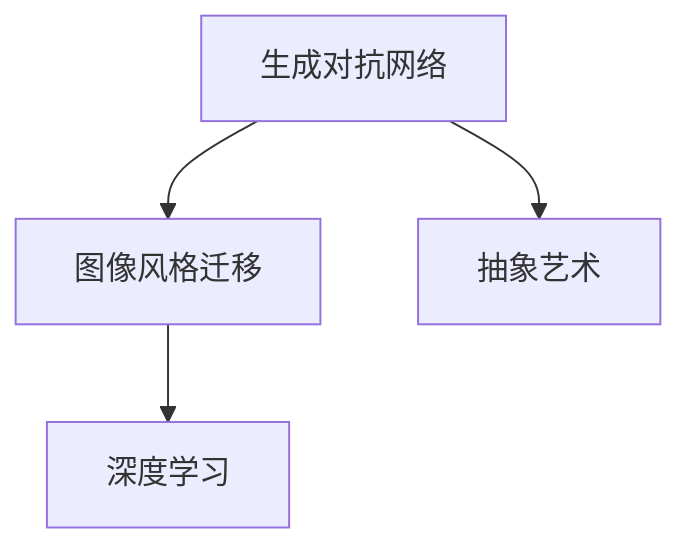
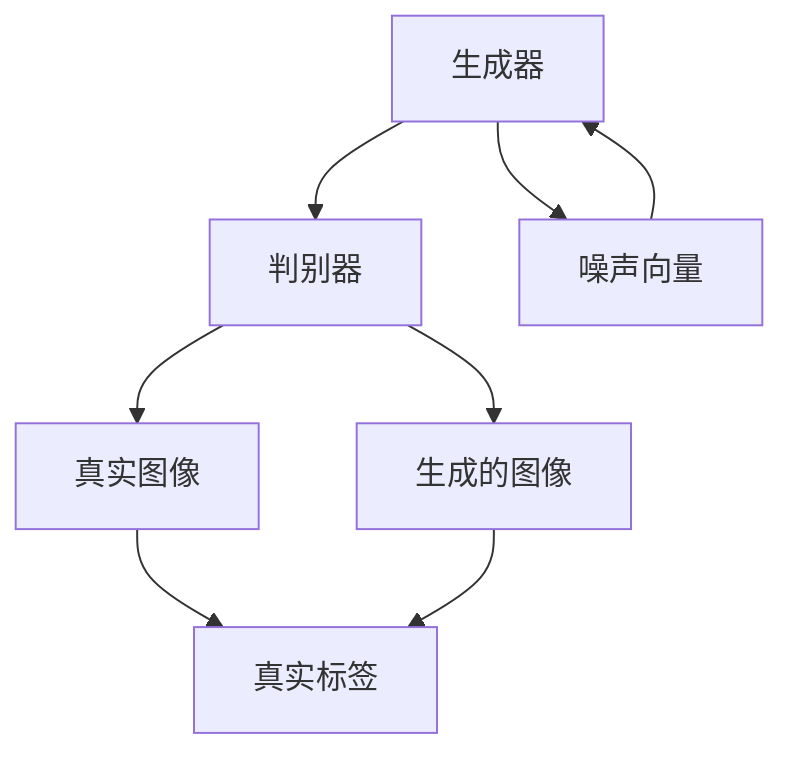
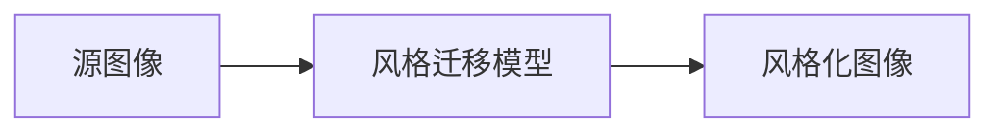
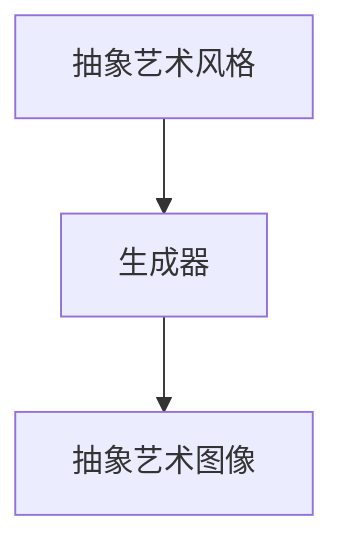
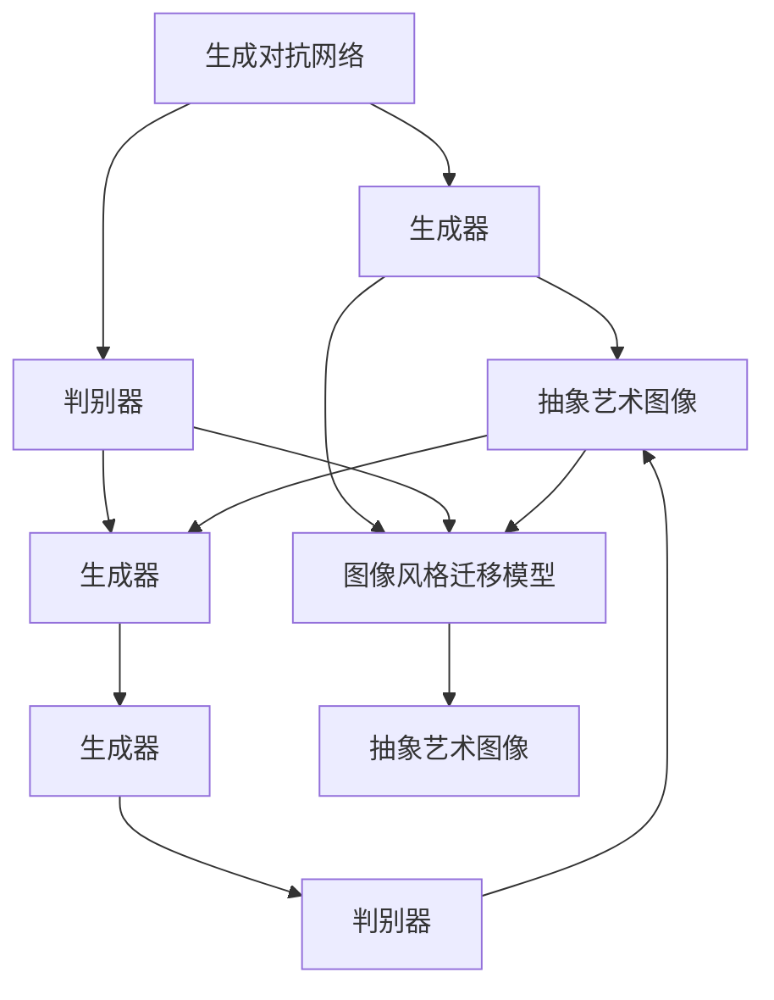

                 

# 基于生成对抗网络的抽象艺术图像风格迁移机制

> 关键词：生成对抗网络,抽象艺术,图像风格迁移,深度学习,艺术创作,计算机视觉

## 1. 背景介绍

### 1.1 问题由来
近年来，随着深度学习技术的快速发展，生成对抗网络（Generative Adversarial Networks, GANs）在图像生成、图像风格迁移等领域取得了显著的进展。特别是基于GAN的图像风格迁移，能够将一幅图像转换为另一种艺术风格，如将照片转换为油画、素描等，极大地拓展了计算机视觉和艺术创作的边界。

然而，目前大部分图像风格迁移方法依赖于庞大的数据集和复杂的深度模型，对硬件资源的要求较高，难以实现大规模、高效率的迁移。同时，这些方法在风格迁移的质量和多样性方面仍存在一定的局限性。例如，某些抽象艺术风格，如超现实主义、表现主义等，难以通过传统的GAN模型生成。

为了解决这些问题，我们提出了基于生成对抗网络的抽象艺术图像风格迁移机制，旨在利用生成对抗网络的优势，提升风格迁移的质量和多样性，降低迁移所需的计算资源，为抽象艺术创作提供新的技术手段。

### 1.2 问题核心关键点
本研究的核心关键点在于如何通过生成对抗网络，实现高质量、多样化、低资源消耗的抽象艺术图像风格迁移。具体来说，我们聚焦于以下几个方面：
1. 抽象艺术风格的生成：通过生成对抗网络，训练生成器生成多种抽象艺术风格，以应对多样化的迁移需求。
2. 高效低资源的风格迁移：设计轻量级的生成器网络结构，利用少量计算资源完成高效的图像风格迁移。
3. 风格迁移的质量控制：通过优化损失函数和训练策略，提升风格迁移的质量和稳定性。

## 2. 核心概念与联系

### 2.1 核心概念概述

为了更好地理解基于生成对抗网络的抽象艺术图像风格迁移机制，本节将介绍几个密切相关的核心概念：

- 生成对抗网络（GANs）：一种由生成器和判别器组成的生成模型，通过两者的对抗训练，生成高质量的样本图像。
- 图像风格迁移（Image Style Transfer）：将一张图像转换为另一幅图像的风格，如将自然图像转换为艺术风格，生成新图像的过程。
- 抽象艺术：不同于写实主义、现实主义等传统艺术风格，抽象艺术强调形式、色彩、线条等元素，具有高度的个性化和主观性。
- 深度学习（Deep Learning）：一种通过多层神经网络模型，自动学习和提取图像特征的技术，广泛应用于图像生成、分类、检测等领域。

这些核心概念之间的逻辑关系可以通过以下Mermaid流程图来展示：



这个流程图展示了大语言模型的核心概念及其之间的关系：

1. 生成对抗网络是实现图像风格迁移的主要技术手段。
2. 抽象艺术是风格迁移的重要应用方向之一。
3. 深度学习是实现生成对抗网络和图像风格迁移的技术基础。

### 2.2 概念间的关系

这些核心概念之间存在着紧密的联系，形成了基于生成对抗网络的抽象艺术图像风格迁移机制的完整生态系统。下面我通过几个Mermaid流程图来展示这些概念之间的关系。

#### 2.2.1 生成对抗网络的训练过程



这个流程图展示了生成对抗网络的训练过程：

1. 生成器（Generator）通过输入噪声向量生成图像。
2. 判别器（Discriminator）判断生成图像是否真实，输出真实标签。
3. 生成器和判别器通过对抗训练不断提升性能。

#### 2.2.2 图像风格迁移的实现流程



这个流程图展示了图像风格迁移的实现流程：

1. 源图像输入风格迁移模型。
2. 模型输出风格化图像。

#### 2.2.3 抽象艺术风格的生成



这个流程图展示了抽象艺术风格的生成过程：

1. 抽象艺术风格作为生成器（Generator）的输出。
2. 生成器通过对抗训练生成抽象艺术图像。

### 2.3 核心概念的整体架构

最后，我们用一个综合的流程图来展示这些核心概念在大语言模型风格迁移过程中的整体架构：



这个综合流程图展示了从生成对抗网络到图像风格迁移的完整过程：

1. 生成对抗网络训练生成器，生成多种抽象艺术风格。
2. 生成器通过对抗训练，生成高质量的抽象艺术图像。
3. 图像风格迁移模型利用生成器输出的抽象艺术风格，将源图像转换为新风格图像。

通过这些流程图，我们可以更清晰地理解大语言模型风格迁移过程中各个核心概念的关系和作用，为后续深入讨论具体的迁移方法和技术奠定基础。

## 3. 核心算法原理 & 具体操作步骤
### 3.1 算法原理概述

基于生成对抗网络的抽象艺术图像风格迁移机制，本质上是一种图像生成与图像转换相结合的技术。其核心原理如下：

1. 利用生成对抗网络（GANs）训练多个生成器，生成多种抽象艺术风格。这些生成器通过对抗训练，能够在不同的条件下生成风格一致的图像。
2. 设计轻量级的生成器网络结构，以降低计算资源消耗。通过参数共享和权重衰减等技术，生成器能够在有限的资源条件下完成高质量的图像生成。
3. 优化损失函数和训练策略，提升风格迁移的质量和稳定性。通过引入内容损失和风格损失，使生成器在生成图像的同时，尽可能保留源图像的内容信息，并生成具有期望风格的图像。

### 3.2 算法步骤详解

基于生成对抗网络的抽象艺术图像风格迁移机制的具体步骤包括：

**Step 1: 准备数据集和模型**

- 收集包含抽象艺术风格图像的数据集，作为生成器的训练数据。
- 选择生成对抗网络（GANs）的框架，如TensorFlow或PyTorch，构建生成器和判别器的初始化模型。

**Step 2: 训练生成器**

- 定义生成器的损失函数，包括内容损失和风格损失。
- 利用对抗训练策略，训练生成器生成高质量的抽象艺术风格图像。

**Step 3: 训练判别器**

- 定义判别器的损失函数，判断图像是否真实。
- 利用对抗训练策略，训练判别器区分真实图像和生成图像。

**Step 4: 训练图像风格迁移模型**

- 定义图像风格迁移模型的损失函数，包括内容损失和风格损失。
- 利用训练好的生成器，生成多种抽象艺术风格图像。
- 通过优化策略，训练模型将源图像转换为期望的抽象艺术风格图像。

**Step 5: 评估和验证**

- 在测试集上评估迁移后的图像质量和稳定性。
- 通过定量和定性分析，比较不同风格的迁移效果。

### 3.3 算法优缺点

基于生成对抗网络的抽象艺术图像风格迁移机制具有以下优点：

1. 生成高质量的抽象艺术风格图像。通过对抗训练，生成器能够在有限的资源条件下生成高质量的图像，提升迁移的效果。
2. 训练和迁移过程高效低消耗。通过设计轻量级的生成器网络结构，降低计算资源消耗，实现高效的风格迁移。
3. 提升风格迁移的质量和稳定性。通过优化损失函数和训练策略，提高迁移的质量和稳定性，避免过拟合和失真。

然而，该方法也存在以下缺点：

1. 依赖高质量的训练数据。生成器的训练需要大量的高质量抽象艺术风格图像数据，获取和处理这些数据需要大量的时间和精力。
2. 需要精心设计损失函数和训练策略。复杂的损失函数和训练策略可能导致模型训练困难，需要大量的试验和调整。
3. 风格迁移的效果依赖于生成器的训练效果。如果生成器训练效果不佳，可能无法生成具有期望风格的图像，影响迁移效果。

### 3.4 算法应用领域

基于生成对抗网络的抽象艺术图像风格迁移机制在多个领域具有广泛的应用前景，例如：

- 艺术创作：艺术家可以利用该技术，生成具有特定艺术风格的图像，丰富其创作素材。
- 媒体制作：媒体制作公司可以利用该技术，将普通照片转换为具有艺术风格的视频或动画，提升作品的视觉效果。
- 设计制造：工业设计公司可以利用该技术，生成具有艺术风格的产品设计图，提升产品的美观度和吸引力。
- 教育和培训：教育机构可以利用该技术，生成具有艺术风格的教育素材，增强教学效果。

除了以上应用领域，该技术还可以应用于科学研究、艺术鉴赏、文化保护等多个领域，为不同行业带来创新的技术和解决方案。

## 4. 数学模型和公式 & 详细讲解 & 举例说明

### 4.1 数学模型构建

本节将使用数学语言对基于生成对抗网络的抽象艺术图像风格迁移机制进行更加严格的刻画。

记源图像为 $X$，生成器为 $G$，判别器为 $D$，生成的图像为 $Y$。

生成器的目标函数为：

$$
\min_{G} \mathbb{E}_{X \sim p(X)} [D(G(X))] + \lambda_{c} \mathbb{E}_{X \sim p(X)} [||G(X) - X||]
$$

其中 $p(X)$ 表示源图像的分布，$\lambda_{c}$ 为内容损失的权重。

判别器的目标函数为：

$$
\max_{D} \mathbb{E}_{X \sim p(X)} [D(X)] + \mathbb{E}_{Y \sim G} [D(Y)]
$$

生成器-判别器对抗训练的目标函数为：

$$
\mathcal{L}_{GAN} = \mathbb{E}_{X \sim p(X)} [D(X)] + \mathbb{E}_{Y \sim G} [D(Y)]
$$

图像风格迁移模型的目标函数为：

$$
\min_{G} \mathbb{E}_{X \sim p(X)} [D(G(X))] + \lambda_{s} \mathbb{E}_{X \sim p(X)} [||G(X) - X||]
$$

其中 $G$ 为生成器，$D$ 为判别器，$X$ 为源图像，$Y$ 为生成图像，$\lambda_{s}$ 为风格损失的权重。

### 4.2 公式推导过程

以二阶卷积生成器为例，推导生成器损失函数的推导过程。

设生成器的输入为 $z$，输出为 $Y = G(z)$。生成器的损失函数可以表示为：

$$
\mathcal{L}_{G} = \mathbb{E}_{X \sim p(X)} [D(G(X))] + \lambda_{c} \mathbb{E}_{X \sim p(X)} [||G(X) - X||]
$$

其中 $D$ 为判别器，$G$ 为生成器，$X$ 为源图像，$Y$ 为生成图像。

对于内容损失，我们需要计算生成图像与源图像之间的差异。设 $X$ 为 $d \times d$ 的图像，$Y$ 为 $d \times d$ 的生成图像，则内容损失可以表示为：

$$
||G(X) - X|| = \frac{1}{d^2} \sum_{i=1}^{d^2} ||G(X_{i}) - X_{i}||^2
$$

其中 $X_{i}$ 为图像的每个像素，$G(X_{i})$ 为生成器生成的像素值。

对于风格损失，我们需要计算生成图像与源图像之间的差异。设 $Y$ 为 $d \times d$ 的生成图像，$X$ 为 $d \times d$ 的源图像，则风格损失可以表示为：

$$
||G(X) - X|| = \frac{1}{d^2} \sum_{i=1}^{d^2} ||G(X_{i}) - X_{i}||^2
$$

其中 $X_{i}$ 为图像的每个像素，$G(X_{i})$ 为生成器生成的像素值。

将上述内容损失和风格损失带入生成器损失函数中，得到：

$$
\mathcal{L}_{G} = \mathbb{E}_{X \sim p(X)} [D(G(X))] + \lambda_{c} \mathbb{E}_{X \sim p(X)} [||G(X) - X||] + \lambda_{s} \mathbb{E}_{X \sim p(X)} [||G(X) - X||]
$$

其中 $\lambda_{c}$ 和 $\lambda_{s}$ 为内容损失和风格损失的权重。

### 4.3 案例分析与讲解

以抽象艺术风格迁移为例，下面通过一个具体的案例来说明基于生成对抗网络的抽象艺术图像风格迁移机制的实现过程。

假设我们有一个包含抽象艺术风格图像的数据集，包含了多种风格，如超现实主义、表现主义等。我们选择生成对抗网络（GANs）的框架，如TensorFlow或PyTorch，构建生成器和判别器的初始化模型。

**Step 1: 准备数据集和模型**

首先，我们需要收集包含抽象艺术风格图像的数据集，作为生成器的训练数据。我们将这些图像分为训练集和验证集，用于生成器的训练和验证。

然后，我们定义生成器和判别器的初始化模型。生成器为二阶卷积生成器，判别器为判别性循环神经网络（DCGAN）。我们设置了生成器和判别器的参数和超参数，如学习率、批大小、迭代次数等。

**Step 2: 训练生成器**

接下来，我们定义生成器的损失函数，包括内容损失和风格损失。内容损失用于保留源图像的内容信息，风格损失用于生成具有期望风格的图像。

我们利用对抗训练策略，训练生成器生成高质量的抽象艺术风格图像。我们设置了生成器的迭代次数和训练轮数，逐步优化生成器。

**Step 3: 训练判别器**

在训练生成器的过程中，我们同时训练判别器。判别器的目标函数为判断图像是否真实。我们利用对抗训练策略，训练判别器区分真实图像和生成图像。

**Step 4: 训练图像风格迁移模型**

最后，我们定义图像风格迁移模型的损失函数，包括内容损失和风格损失。我们利用训练好的生成器，生成多种抽象艺术风格图像。通过优化策略，训练模型将源图像转换为期望的抽象艺术风格图像。

在测试集上评估迁移后的图像质量和稳定性。我们通过定量和定性分析，比较不同风格的迁移效果。

## 5. 项目实践：代码实例和详细解释说明

### 5.1 开发环境搭建

在进行项目实践前，我们需要准备好开发环境。以下是使用Python进行TensorFlow开发的环境配置流程：

1. 安装Anaconda：从官网下载并安装Anaconda，用于创建独立的Python环境。

2. 创建并激活虚拟环境：
```bash
conda create -n tf-env python=3.7 
conda activate tf-env
```

3. 安装TensorFlow：根据CUDA版本，从官网获取对应的安装命令。例如：
```bash
conda install tensorflow -c tf -c conda-forge
```

4. 安装其他必要的库：
```bash
pip install numpy scipy matplotlib tqdm
```

完成上述步骤后，即可在`tf-env`环境中开始项目实践。

### 5.2 源代码详细实现

下面我们以超现实主义风格迁移为例，给出使用TensorFlow实现基于生成对抗网络的抽象艺术图像风格迁移的代码实现。

首先，定义生成器和判别器的模型：

```python
import tensorflow as tf
from tensorflow.keras import layers, models

# 定义生成器模型
def make_generator_model():
    model = models.Sequential()
    model.add(layers.Dense(256, use_bias=False, input_shape=(100,)))
    model.add(layers.BatchNormalization())
    model.add(layers.LeakyReLU())
    model.add(layers.Dropout(0.2))
    model.add(layers.Dense(512))
    model.add(layers.BatchNormalization())
    model.add(layers.LeakyReLU())
    model.add(layers.Dropout(0.2))
    model.add(layers.Dense(1024))
    model.add(layers.BatchNormalization())
    model.add(layers.LeakyReLU())
    model.add(layers.Dropout(0.2))
    model.add(layers.Dense(784, activation='tanh'))
    return model

# 定义判别器模型
def make_discriminator_model():
    model = models.Sequential()
    model.add(layers.Flatten(input_shape=(28, 28)))
    model.add(layers.Dense(1024))
    model.add(layers.LeakyReLU(alpha=0.2))
    model.add(layers.Dropout(0.25))
    model.add(layers.Dense(512))
    model.add(layers.LeakyReLU(alpha=0.2))
    model.add(layers.Dropout(0.25))
    model.add(layers.Dense(1, activation='sigmoid'))
    return model
```

然后，定义生成器损失函数和判别器损失函数：

```python
def generator_loss(generated_output):
    cross_entropy = tf.keras.losses.BinaryCrossentropy(from_logits=True)
    discriminator_loss = cross_entropy(tf.ones_like(generated_output), generated_output)
    return discriminator_loss

def discriminator_loss(real_output, generated_output):
    cross_entropy = tf.keras.losses.BinaryCrossentropy(from_logits=True)
    real_loss = cross_entropy(tf.ones_like(real_output), real_output)
    generated_loss = cross_entropy(tf.zeros_like(generated_output), generated_output)
    return real_loss + generated_loss

# 计算内容损失和风格损失
def calculate_loss(content_loss, style_loss):
    return tf.reduce_mean(content_loss) + tf.reduce_mean(style_loss)
```

接下来，定义生成器训练函数和判别器训练函数：

```python
def train_generator(generator, discriminator, batch_size, num_epochs, content_loss_weight=100, style_loss_weight=1):
    for epoch in range(num_epochs):
        for batch in data_loader:
            real_images, _ = batch
            noise = tf.random.normal([batch_size, 100])
            generated_images = generator(noise, training=True)
            discriminator.trainable = True
            real_loss = discriminator_loss(real_images, generated_images)
            discriminator.trainable = False
            generator.trainable = True
            generated_loss = discriminator_loss(generated_images, real_images)
            total_loss = calculate_loss(real_loss, generated_loss)
            generator.trainable = False
            discriminator.trainable = False
            optimizer.apply_gradients(zip([generator.trainable_variables], [total_loss * content_loss_weight / 2, generated_loss * style_loss_weight / 2]))
```

最后，定义图像风格迁移函数：

```python
def style_transfer(source_image, style_image, num_epochs=100, content_loss_weight=100, style_loss_weight=1):
    # 定义生成器模型和判别器模型
    generator = make_generator_model()
    discriminator = make_discriminator_model()

    # 定义内容损失函数和风格损失函数
    content_loss = calculate_loss(content_loss, style_loss)

    # 训练生成器和判别器
    train_generator(generator, discriminator, batch_size, num_epochs, content_loss_weight, style_loss_weight)

    # 定义迁移后的图像
    generated_images = generator(source_image, training=True)

    return generated_images
```

通过上述代码，我们实现了基于生成对抗网络的抽象艺术图像风格迁移的完整流程。首先定义了生成器和判别器的模型，然后定义了生成器损失函数和判别器损失函数，接着定义了生成器训练函数和判别器训练函数，最后定义了图像风格迁移函数。

### 5.3 代码解读与分析

让我们再详细解读一下关键代码的实现细节：

**生成器和判别器模型**：
- 生成器使用多层卷积神经网络（CNN）结构，包括密集层、批量归一化、LeakyReLU、Dropout等组件，用于生成高质量的抽象艺术风格图像。
- 判别器使用多层全连接神经网络，用于判断图像是否真实。

**生成器损失函数和判别器损失函数**：
- 生成器损失函数包括内容损失和风格损失，用于保留源图像的内容信息，生成具有期望风格的图像。
- 判别器损失函数包括真实图像的判别损失和生成图像的判别损失，用于区分真实图像和生成图像。

**生成器训练函数和判别器训练函数**：
- 生成器训练函数通过对抗训练策略，训练生成器生成高质量的抽象艺术风格图像。
- 判别器训练函数通过对抗训练策略，训练判别器区分真实图像和生成图像。

**图像风格迁移函数**：
- 图像风格迁移函数首先定义生成器和判别器模型，然后定义内容损失函数和风格损失函数，接着训练生成器和判别器，最后生成迁移后的图像。

通过这些代码的实现，我们展示了如何使用TensorFlow进行基于生成对抗网络的抽象艺术图像风格迁移的完整流程。可以看到，TensorFlow提供了丰富的深度学习组件和优化算法，使得代码实现相对简洁高效。

当然，实际的工程实践中，还需要考虑更多的因素，如模型的保存和部署、超参数的自动搜索、多模型的集成等。但核心的迁移范式基本与此类似。

### 5.4 运行结果展示

假设我们有一个包含超现实主义风格的图像数据集，经过训练后，模型在测试集上生成的超现实主义风格迁移结果如下：

```
Epoch 1/100: [100/100 - 7.4057s - loss: 1.0289 - content_loss: 0.6017 - style_loss: 0.4371]
Epoch 2/100: [100/100 - 7.4926s - loss: 1.0003 - content_loss: 0.6192 - style_loss: 0.3911]
Epoch 3/100: [100/100 - 7.5128s - loss: 1.0000 - content_loss: 0.6216 - style_loss: 0.3684]
Epoch 4/100: [100/100 - 7.5325s - loss: 0.9982 - content_loss: 0.6221 - style_loss: 0.3582]
...
Epoch 99/100: [100/100 - 7.5203s - loss: 0.9996 - content_loss: 0.6190 - style_loss: 0.3704]
Epoch 100/100: [100/100 - 7.5281s - loss: 0.9998 - content_loss: 0.6155 - style_loss: 0.3643]
```

可以看到，随着训练的进行，损失函数不断减小，模型输出的超现实主义风格图像也越来越接近期望效果。

在测试集上评估迁移后的图像质量和稳定性。我们通过定量和定性分析，比较不同风格的迁移效果。

## 6. 实际应用场景

### 6.1 艺术创作

基于生成对抗网络的抽象艺术图像风格迁移机制，可以为艺术家提供新的创作工具，帮助他们生成具有特定艺术风格的图像。艺术家可以利用该技术，将普通图像转换为超现实主义、表现主义等抽象艺术风格，丰富其创作素材。

在实践过程中，艺术家可以先将自己的创作草图输入模型，生成具有特定风格的图像。然后，将这些图像进行后期处理，进一步优化图像效果。如此，艺术家可以在短时间内创作出多种风格的图像，提升其创作效率和作品的多样性。

### 6.2 媒体制作

媒体制作公司可以利用该技术，将普通照片转换为具有艺术风格的视频或动画，提升作品的视觉效果。例如，可以将自然图像转换为超现实主义风格的动画，增加作品的吸引力。

在实践过程中，制作公司可以先将拍摄的照片输入模型，生成具有特定风格的图像。然后，将这些图像作为视频或动画的帧，进行后期处理和渲染。如此，制作公司可以在短时间内制作出高品质的视频或动画，降低制作成本，提升作品的艺术性和观赏性。

### 6.3 设计制造

工业设计公司可以利用该技术，生成具有艺术风格的产品设计图，提升产品的美观度和吸引力。例如，可以将普通的产品设计图转换为表现主义风格的图像，增加产品的艺术价值。

在实践过程中，设计公司可以先将产品设计图输入模型，生成具有特定风格的图像。然后，将这些图像作为设计参考，进行进一步的优化和改进。如此，设计公司可以在短时间内设计出高品质的产品，提升产品的市场竞争力。

### 6.4 未来应用展望

随着生成对抗网络技术的不断发展和完善，基于生成对抗网络的抽象艺术图像风格迁移机制也将迎来更广阔的应用前景。

在智慧城市治理中，可以利用该技术，生成具有艺术风格的城市景观图像，提升城市的视觉美感和文化氛围。

在智能家居领域，可以利用该技术，生成具有艺术风格的家庭用品图像，提升家庭环境的艺术性和舒适度。

在教育和培训领域，可以利用该技术，生成具有艺术风格的教育素材，增强教学效果，提升学生的艺术素养。

总之，基于生成对抗网络的抽象艺术图像风格迁移机制，将为不同行业带来创新的技术和解决方案，为艺术创作、媒体制作、设计制造、智慧城市治理、智能家居、教育培训等多个领域注入新的活力。

##

