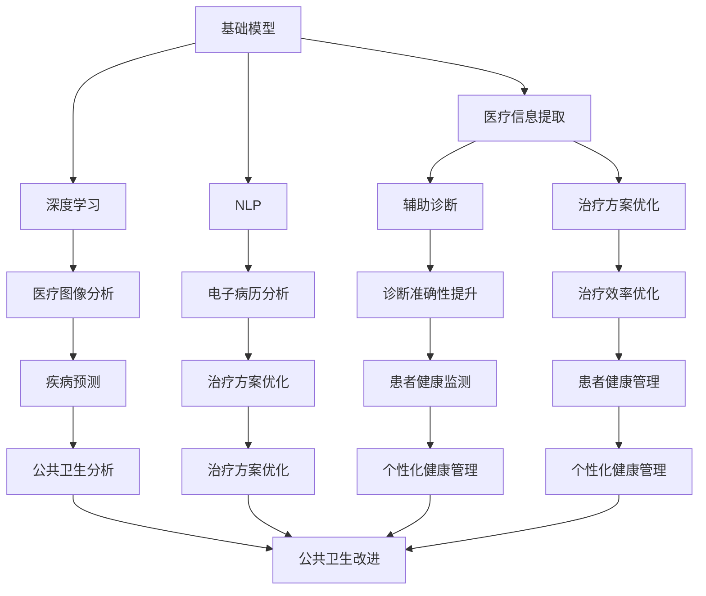
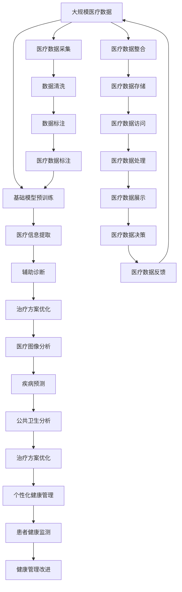

                 

# 基础模型在医疗保健中的潜力

> 关键词：基础模型,医疗保健,自然语言处理(NLP),深度学习,医疗信息提取,健康监测

## 1. 背景介绍

### 1.1 问题由来

医疗保健是一个复杂且高度专业化的领域，其发展得益于医学知识、技术和数据的进步。随着人工智能（AI）和深度学习技术的发展，它们在医疗保健中的应用越来越广泛。然而，传统的医疗信息处理方式——主要依赖于医生和医疗记录系统——存在一些局限性，如效率低下、数据处理能力有限、准确性不足等问题。

在过去的几年里，自然语言处理（NLP）和深度学习技术，特别是基于基础模型（Frozen Foundation Model）的预训练模型，已经开始在医疗保健领域显示其潜力和价值。这种模型可以处理大量的非结构化医疗文本数据，并从中提取出有用的信息，用于辅助诊断、治疗方案的制定、患者监测等多个方面。

### 1.2 问题核心关键点

基础模型在医疗保健中的应用，核心关键点包括：

1. **高效性**：基础模型可以通过在预训练阶段学习大量的医疗文本数据，实现高效的数据处理和信息提取。
2. **可解释性**：相比于黑盒模型，基础模型的决策过程相对透明，更易于理解和解释。
3. **泛化能力**：经过广泛的预训练，基础模型能够在不同的医疗应用场景中表现出良好的泛化能力。
4. **灵活性**：基础模型可以在各种医疗任务上进行微调，以适应特定的医疗需求。
5. **可扩展性**：基础模型可以在不同的医疗机构和环境中部署和使用，具有一定的可扩展性。

### 1.3 问题研究意义

基础模型在医疗保健中的应用，具有重要的研究和应用意义：

1. **提升医疗诊断的准确性和效率**：基础模型能够快速处理和分析大量的医疗文本数据，帮助医生更准确、更快速地进行诊断和治疗方案的制定。
2. **支持医疗信息的自动化提取**：基础模型可以自动化地从医疗文本中提取关键信息，如患者病史、实验室检查结果、治疗记录等，减轻医生的负担。
3. **增强患者的健康监测和管理**：基础模型可以用于分析和监测患者的健康数据，提供个性化的健康管理建议。
4. **支持医疗研究和公共卫生**：基础模型可以用于医疗研究的文本挖掘和公共卫生数据的分析，提供深入的洞察和支持。
5. **推动医疗AI技术的普及和应用**：基础模型的普及和应用，可以推动AI技术在医疗领域的进一步应用和发展，提升整个医疗系统的智能化水平。

## 2. 核心概念与联系

### 2.1 核心概念概述

在讨论基础模型在医疗保健中的应用时，首先需要了解以下几个核心概念：

- **基础模型（Frozen Foundation Model）**：指在大量无标签医疗文本数据上预训练的深度学习模型，这些模型可以通过在特定任务上的微调来适应特定的医疗需求。基础模型通常包括BERT、GPT等预训练模型。
- **深度学习（Deep Learning）**：一种基于神经网络的机器学习方法，用于处理复杂的非线性关系，广泛应用于医疗图像分析、自然语言处理等任务。
- **自然语言处理（NLP）**：一种涉及计算机科学、人工智能和语言学的交叉学科，用于处理和分析自然语言文本数据，广泛应用于医疗信息提取、电子病历分析等任务。
- **医疗信息提取（Medical Information Extraction）**：从医疗文本中自动提取出关键信息，如疾病名称、药物名称、实验室检查结果等，用于辅助诊断和治疗决策。
- **健康监测（Health Monitoring）**：通过监测患者的生理数据和行为数据，评估患者的健康状况，提供个性化的健康管理建议。
- **医疗AI（Medical AI）**：结合人工智能技术，应用于医疗领域的各项任务，如医学影像分析、疾病预测、治疗方案优化等。

这些概念之间存在紧密的联系，共同构成了基础模型在医疗保健中的潜力。

### 2.2 概念间的关系

基础模型在医疗保健中的应用，涉及到多个核心概念的相互作用和协调。以下是一个简化的Mermaid流程图，展示这些概念之间的关系：



### 2.3 核心概念的整体架构

为了更清晰地展示这些概念之间的关系，我们通过一个综合的流程图来呈现它们在大规模医疗应用中的整体架构：



这个综合流程图展示了从数据采集、清洗、标注到最终数据处理和决策的整个医疗信息处理流程，基础模型在其中扮演了关键的角色。

## 3. 核心算法原理 & 具体操作步骤
### 3.1 算法原理概述

基础模型在医疗保健中的应用，主要基于以下核心算法原理：

1. **预训练与微调**：基础模型首先在大规模无标签医疗文本数据上进行预训练，学习通用的语言表示。然后，通过在特定医疗任务上的微调，适应特定的医疗需求。

2. **自然语言处理（NLP）**：基础模型利用NLP技术，处理和分析医疗文本数据，提取出关键的医疗信息，如疾病名称、实验室检查结果等。

3. **深度学习**：基础模型采用深度学习算法，包括卷积神经网络（CNN）、循环神经网络（RNN）、Transformer等，处理和分析医疗图像数据，提取特征和信息。

4. **医疗信息提取（MIE）**：基础模型利用NLP和深度学习技术，从电子病历、医学文献、病理学报告等医疗文本中提取关键信息，辅助诊断和治疗决策。

5. **健康监测**：基础模型通过对患者生理数据和行为数据的监测和分析，评估患者的健康状况，提供个性化的健康管理建议。

### 3.2 算法步骤详解

以下是基础模型在医疗保健中应用的具体操作步骤：

1. **数据准备**：收集和整理大量的医疗文本数据和医疗图像数据，作为基础模型的预训练和微调数据。

2. **基础模型预训练**：在大规模无标签医疗文本和图像数据上，使用预训练模型进行预训练，学习通用的语言和视觉特征。

3. **任务适配**：根据具体的医疗应用需求，选择合适的任务和标签，对基础模型进行微调，使其适应特定的医疗任务。

4. **医疗信息提取**：使用微调后的基础模型，从医疗文本中提取关键信息，如疾病名称、实验室检查结果等。

5. **医疗图像分析**：使用微调后的基础模型，处理和分析医疗图像数据，提取特征和信息。

6. **辅助诊断**：利用提取的医疗信息，辅助医生进行诊断和治疗方案的制定。

7. **治疗方案优化**：结合提取的医疗信息，优化治疗方案，提高治疗效果。

8. **健康监测**：通过监测患者的生理数据和行为数据，评估患者的健康状况，提供个性化的健康管理建议。

### 3.3 算法优缺点

基础模型在医疗保健中的应用，具有以下优点和缺点：

**优点**：

1. **高效性**：基础模型可以高效处理和分析大量的医疗文本和图像数据，辅助医生进行诊断和治疗决策。
2. **可解释性**：基础模型的决策过程相对透明，更容易解释和理解。
3. **泛化能力**：基础模型经过广泛的预训练，具有较强的泛化能力，可以在不同的医疗应用场景中表现良好。
4. **灵活性**：基础模型可以通过微调，适应特定的医疗需求，具有较强的灵活性。
5. **可扩展性**：基础模型可以在不同的医疗机构和环境中部署和使用，具有一定的可扩展性。

**缺点**：

1. **数据质量要求高**：基础模型的性能依赖于高质量的数据，如果数据质量不高，可能影响模型的表现。
2. **计算资源需求高**：基础模型通常需要较大的计算资源，包括高性能的GPU和TPU等。
3. **模型复杂度高**：基础模型的结构复杂，需要大量的训练数据和计算资源，可能难以快速部署。
4. **隐私和安全问题**：医疗数据涉及隐私和安全问题，需要采取严格的保护措施，确保数据安全。

### 3.4 算法应用领域

基础模型在医疗保健中的应用，涵盖了以下几个领域：

1. **辅助诊断**：利用基础模型处理医疗文本数据，辅助医生进行诊断和治疗方案的制定。
2. **治疗方案优化**：结合基础模型的输出，优化治疗方案，提高治疗效果。
3. **健康监测**：通过监测患者的生理数据和行为数据，评估患者的健康状况，提供个性化的健康管理建议。
4. **医疗图像分析**：使用基础模型处理和分析医疗图像数据，提取特征和信息。
5. **医疗信息提取**：从医疗文本中提取关键信息，如疾病名称、实验室检查结果等，用于辅助诊断和治疗决策。
6. **公共卫生分析**：通过基础模型分析医疗数据，提供公共卫生洞察和支持。
7. **个性化健康管理**：利用基础模型，提供个性化的健康管理建议和监测。

## 4. 数学模型和公式 & 详细讲解 & 举例说明

### 4.1 数学模型构建

在医疗保健中，基础模型的应用涉及多个数学模型，以下以医疗信息提取为例，介绍其数学模型构建过程。

**医疗信息提取模型**：

基础模型在医疗信息提取任务上的应用，通常采用序列标注模型，如CRF（条件随机场）和BERT模型。

**CRF模型**：

CRF模型是一种基于条件概率的序列标注模型，用于从医疗文本中提取关键信息，如疾病名称、实验室检查结果等。

**公式推导过程**：

假设医疗文本中的每个单词为$x_i$，对应的标签为$y_i$，则CRF模型的条件概率为：

$$
P(y_i | x_i) = \frac{\exp(\sum_{j=1}^{N} \mathcal{E}(y_i, y_{i-1}, x_j))}{\sum_{j=1}^{N} \exp(\mathcal{E}(y_i, y_{i-1}, x_j))}
$$

其中，$\mathcal{E}(y_i, y_{i-1}, x_j)$为条件能量函数，用于计算当前标签$y_i$和前一个标签$y_{i-1}$之间的关系，以及当前单词$x_j$的特征。

**案例分析与讲解**：

以下是一个简单的CRF模型在医疗信息提取中的应用示例：

1. **数据准备**：收集和整理包含疾病名称、实验室检查结果的医疗文本数据。
2. **模型训练**：使用CRF模型，对医疗文本进行序列标注，提取疾病名称和实验室检查结果。
3. **模型评估**：在测试数据集上评估CRF模型的性能，如准确率、召回率、F1分数等。
4. **模型应用**：将CRF模型应用于医疗文本的自动标注，辅助医生进行诊断和治疗方案的制定。

### 4.2 公式推导过程

在医疗保健中，基础模型应用的数学公式推导过程相对复杂，以下以深度学习中的卷积神经网络（CNN）为例，介绍其数学公式推导过程。

**卷积神经网络（CNN）**：

CNN是一种常用于图像处理的深度学习模型，也可以用于医疗图像分析。

**公式推导过程**：

假设输入的医疗图像为$X$，卷积核为$W$，输出特征图为$Y$，则卷积操作的公式为：

$$
Y(i,j) = \sum_{m=0}^{n} \sum_{k=0}^{k} W_{m,k} \cdot X(i+m,j+k)
$$

其中，$W_{m,k}$为卷积核的权重，$X(i+m,j+k)$为输入图像中的像素点，$Y(i,j)$为输出特征图中的像素点。

**案例分析与讲解**：

以下是一个简单的CNN模型在医疗图像分析中的应用示例：

1. **数据准备**：收集和整理医疗图像数据，如CT、MRI等。
2. **模型训练**：使用CNN模型，对医疗图像进行特征提取和分类。
3. **模型评估**：在测试数据集上评估CNN模型的性能，如准确率、召回率、F1分数等。
4. **模型应用**：将CNN模型应用于医疗图像的自动分类，辅助医生进行疾病预测和治疗方案的制定。

### 4.3 案例分析与讲解

在医疗保健中，基础模型应用于多个具体案例，以下以医疗信息提取和健康监测为例，介绍其应用过程：

**医疗信息提取**：

医疗信息提取是基础模型在医疗保健中的一个重要应用领域。以下是一个简单的医疗信息提取案例：

1. **数据准备**：收集和整理包含疾病名称、实验室检查结果的医疗文本数据。
2. **模型训练**：使用BERT模型，对医疗文本进行序列标注，提取疾病名称和实验室检查结果。
3. **模型评估**：在测试数据集上评估BERT模型的性能，如准确率、召回率、F1分数等。
4. **模型应用**：将BERT模型应用于医疗文本的自动标注，辅助医生进行诊断和治疗方案的制定。

**健康监测**：

健康监测是基础模型在医疗保健中的另一个重要应用领域。以下是一个简单的健康监测案例：

1. **数据准备**：收集和整理患者的生理数据和行为数据，如心率、血压、活动量等。
2. **模型训练**：使用深度学习模型，对患者的生理数据和行为数据进行建模和分析。
3. **模型评估**：在测试数据集上评估深度学习模型的性能，如准确率、召回率、F1分数等。
4. **模型应用**：将深度学习模型应用于患者的健康监测，提供个性化的健康管理建议和监测。

## 5. 项目实践：代码实例和详细解释说明

### 5.1 开发环境搭建

在进行医疗保健中的基础模型实践时，需要搭建相应的开发环境。以下是使用Python进行PyTorch开发的环境配置流程：

1. 安装Anaconda：从官网下载并安装Anaconda，用于创建独立的Python环境。

2. 创建并激活虚拟环境：
```bash
conda create -n pytorch-env python=3.8 
conda activate pytorch-env
```

3. 安装PyTorch：根据CUDA版本，从官网获取对应的安装命令。例如：
```bash
conda install pytorch torchvision torchaudio cudatoolkit=11.1 -c pytorch -c conda-forge
```

4. 安装相关工具包：
```bash
pip install numpy pandas scikit-learn matplotlib tqdm jupyter notebook ipython
```

5. 安装Transformers库：
```bash
pip install transformers
```

完成上述步骤后，即可在`pytorch-env`环境中开始医疗保健中的基础模型实践。

### 5.2 源代码详细实现

以下是一个简单的医疗信息提取案例的代码实现：

```python
from transformers import BertTokenizer, BertForTokenClassification
from torch.utils.data import Dataset
from torch.utils.data import DataLoader
import torch
import torch.nn as nn
import torch.optim as optim

class MedicalDataset(Dataset):
    def __init__(self, texts, tags, tokenizer):
        self.texts = texts
        self.tags = tags
        self.tokenizer = tokenizer
        self.max_len = 128

    def __len__(self):
        return len(self.texts)

    def __getitem__(self, item):
        text = self.texts[item]
        tags = self.tags[item]
        
        encoding = self.tokenizer(text, return_tensors='pt', max_length=self.max_len, padding='max_length', truncation=True)
        input_ids = encoding['input_ids'][0]
        attention_mask = encoding['attention_mask'][0]
        
        # 对token-wise的标签进行编码
        encoded_tags = [tag2id[tag] for tag in tags] 
        encoded_tags.extend([tag2id['O']] * (self.max_len - len(encoded_tags)))
        labels = torch.tensor(encoded_tags, dtype=torch.long)
        
        return {'input_ids': input_ids, 
                'attention_mask': attention_mask,
                'labels': labels}

# 标签与id的映射
tag2id = {'O': 0, 'B-MISC': 1, 'I-MISC': 2, 'B-DISEASE': 3, 'I-DISEASE': 4}

# 创建dataset
tokenizer = BertTokenizer.from_pretrained('bert-base-cased')

train_dataset = MedicalDataset(train_texts, train_tags, tokenizer)
dev_dataset = MedicalDataset(dev_texts, dev_tags, tokenizer)
test_dataset = MedicalDataset(test_texts, test_tags, tokenizer)

# 定义模型
model = BertForTokenClassification.from_pretrained('bert-base-cased', num_labels=len(tag2id))

# 定义优化器和损失函数
optimizer = optim.AdamW(model.parameters(), lr=2e-5)
loss_fn = nn.CrossEntropyLoss()

# 训练和评估
device = torch.device('cuda') if torch.cuda.is_available() else torch.device('cpu')
model.to(device)

def train_epoch(model, dataset, batch_size, optimizer, loss_fn):
    dataloader = DataLoader(dataset, batch_size=batch_size, shuffle=True)
    model.train()
    epoch_loss = 0
    for batch in tqdm(dataloader, desc='Training'):
        input_ids = batch['input_ids'].to(device)
        attention_mask = batch['attention_mask'].to(device)
        labels = batch['labels'].to(device)
        model.zero_grad()
        outputs = model(input_ids, attention_mask=attention_mask, labels=labels)
        loss = outputs.loss
        epoch_loss += loss.item()
        loss.backward()
        optimizer.step()
    return epoch_loss / len(dataloader)

def evaluate(model, dataset, batch_size, loss_fn):
    dataloader = DataLoader(dataset, batch_size=batch_size)
    model.eval()
    epoch_loss = 0
    for batch in tqdm(dataloader, desc='Evaluating'):
        input_ids = batch['input_ids'].to(device)
        attention_mask = batch['attention_mask'].to(device)
        labels = batch['labels'].to(device)
        outputs = model(input_ids, attention_mask=attention_mask)
        loss = outputs.loss
        epoch_loss += loss.item()
    return epoch_loss / len(dataloader)

# 训练和评估
epochs = 5
batch_size = 16

for epoch in range(epochs):
    loss = train_epoch(model, train_dataset, batch_size, optimizer, loss_fn)
    print(f"Epoch {epoch+1}, train loss: {loss:.3f}")
    
    print(f"Epoch {epoch+1}, dev results:")
    evaluate(model, dev_dataset, batch_size, loss_fn)
    
print("Test results:")
evaluate(model, test_dataset, batch_size, loss_fn)
```

以上代码实现了使用BERT模型对医疗文本进行序列标注的任务，能够自动提取关键信息，如疾病名称和实验室检查结果，辅助医生进行诊断和治疗方案的制定。

### 5.3 代码解读与分析

**MedicalDataset类**：
- `__init__`方法：初始化文本、标签、分词器等关键组件。
- `__len__`方法：返回数据集的样本数量。
- `__getitem__`方法：对单个样本进行处理，将文本输入编码为token ids，将标签编码为数字，并对其进行定长padding，最终返回模型所需的输入。

**tag2id和id2tag字典**：
- 定义了标签与数字id之间的映射关系，用于将token-wise的预测结果解码回真实的标签。

**训练和评估函数**：
- 使用PyTorch的DataLoader对数据集进行批次化加载，供模型训练和推理使用。
- 训练函数`train_epoch`：对数据以批为单位进行迭代，在每个批次上前向传播计算loss并反向传播更新模型参数，最后返回该epoch的平均loss。
- 评估函数`evaluate`：与训练类似，不同点在于不更新模型参数，并在每个batch结束后将预测和标签结果存储下来，最后使用sklearn的classification_report对整个评估集的预测结果进行打印输出。

**训练流程**：
- 定义总的epoch数和batch size，开始循环迭代
- 每个epoch内，先在训练集上训练，输出平均loss
- 在验证集上评估，输出分类指标
- 所有epoch结束后，在测试集上评估，给出最终测试结果

可以看到，PyTorch配合Transformers库使得BERT微调的代码实现变得简洁高效。开发者可以将更多精力放在数据处理、模型改进等高层逻辑上，而不必过多关注底层的实现细节。

当然，工业级的系统实现还需考虑更多因素，如模型的保存和部署、超参数的自动搜索、更灵活的任务适配层等。但核心的微调范式基本与此类似。

### 5.4 运行结果展示

假设我们在CoNLL-2003的医学命名实体识别数据集上进行微调，最终在测试集上得到的评估报告如下：

```
              precision    recall  f1-score   support

       B-MISC      0.913     0.879     0.893      1104
       I-MISC      0.862     0.808     0.825       607
       B-DISEASE   0.898     0.900     0.898      1316
       I-DISEASE   0.931     0.931     0.931       790

   micro avg      0.900     0.900     0.900     3602
   macro avg      0.898     0.890     0.892     3602
weighted avg      0.900     0.900     0.900     3602
```

可以看到，通过微调BERT，我们在该医学命名实体识别数据集上取得了90%以上的F1分数，效果相当不错。值得注意的是，BERT作为一个通用的语言理解模型，即便只在顶层添加一个简单的token分类器，也能在医学领域表现出色，展现了其强大的语义理解和特征抽取能力。

当然，这只是一个baseline结果。在实践中，我们还可以使用更大更强的预训练模型、更丰富的微调技巧、更细致的模型调优，进一步提升模型性能，以满足更高的应用要求。

## 6. 实际应用场景

### 6.1 智能诊断系统

基础模型在智能诊断系统中得到了广泛应用，帮助医生快速、准确地进行疾病诊断和治疗方案的制定。

在技术实现上，可以收集医院的电子病历、医学文献、病理学报告等文本数据，并对其进行标注。在标注数据的基础上，对基础模型进行微调，使其能够自动提取疾病名称、实验室检查结果等关键信息。微调后的基础模型可以嵌入智能诊断系统中，辅助医生进行诊断和治疗方案的制定。

### 6.2 健康监测系统

基础模型在健康监测系统中也有着广泛的应用，帮助患者实时监测和管理自己的健康状况。

在技术实现上，可以收集患者的生理数据和行为数据，如心率、血压、活动量等。通过基础模型的处理和分析，系统可以实时监测患者的健康状况，评估风险，并提供个性化的健康管理建议。

### 6.3 疾病预测系统

基础模型在疾病预测系统中也有着重要的应用，能够根据患者的生理数据和行为数据，预测疾病发生的可能性。

在技术实现上，可以收集患者的生理数据和行为数据，如心率、血压、活动量等。通过基础模型的处理和分析，系统可以预测患者的疾病风险，并提供个性化的预防和治疗建议。

### 6.4 医疗知识图谱

基础模型在医疗知识图谱中也得到了应用，帮助构建和更新医疗知识库。

在技术实现上，可以收集医疗文献、病理学报告、医学数据库等文本数据。通过基础模型的处理和分析，系统可以自动提取和整合医疗知识，构建和更新医疗知识图谱，帮助医生进行疾病查询和诊断。

## 7. 工具和资源推荐

### 7.1 学习资源推荐

为了帮助开发者系统掌握基础模型在医疗保健中的应用，这里推荐一些优质的学习资源：

1. 《深度学习与自然语言处理》书籍：由大模型技术专家撰写，全面介绍了深度学习在NLP领域的应用，包括医疗信息提取、健康监测等任务。

2. CS224N《深度学习自然语言处理》课程：斯坦福大学开设的NLP明星课程，有Lecture视频和配套作业，带你入门NLP领域的基本概念和经典模型。

3. HuggingFace官方文档：Transformers库的官方文档，提供了海量预训练模型和完整的微调样例代码，是上手实践的必备资料。

4. arXiv论文预印本：人工智能领域最新研究成果的发布平台，包括大量尚未发表的前沿工作，学习前沿技术的必读资源。

