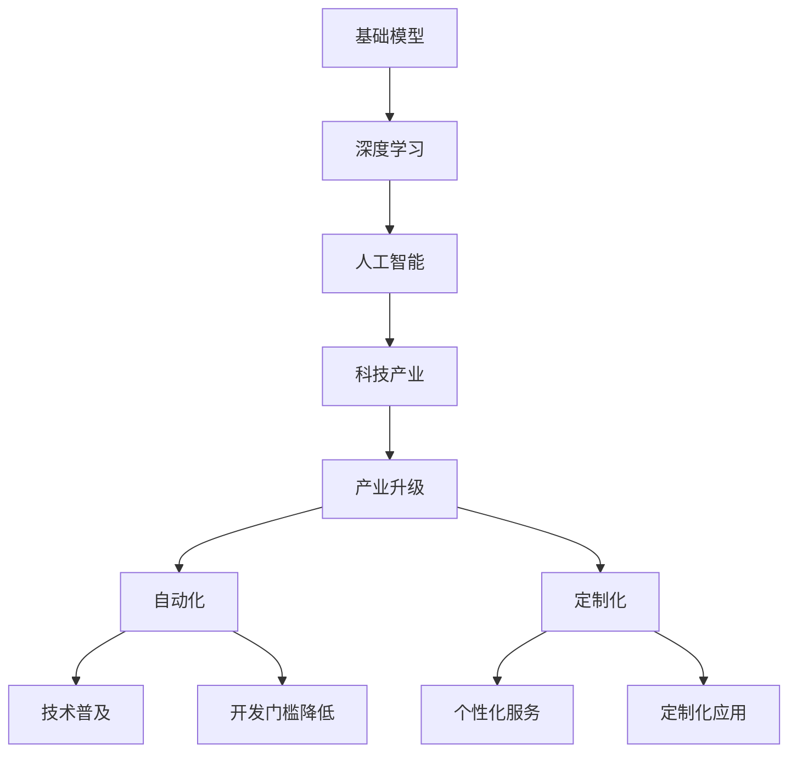

                 

# 基础模型在科技产业的影响

> 关键词：基础模型, 深度学习, 人工智能, 科技产业, 产业升级, 自动化, 定制化

## 1. 背景介绍

### 1.1 问题由来
在科技迅猛发展的今天，人工智能（AI）技术已经成为推动科技产业升级的核心引擎。其中，深度学习（Deep Learning）作为AI的重要分支，通过在大量数据上训练复杂模型，展现出强大的数据处理和模式识别能力。基础模型作为深度学习的基石，不仅为各种应用提供了基本的数据表示和算法框架，还加速了AI技术的普及和应用。

### 1.2 问题核心关键点
基础模型在科技产业的影响主要体现在以下几个方面：
1. **数据表示与处理**：基础模型提供了高效、灵活的数据表示方式，使得数据处理效率大幅提升。
2. **算法框架与应用**：构建了通用的算法框架，大大降低了AI应用的开发门槛。
3. **技术普及与产业升级**：加速了AI技术的普及，推动了传统行业的数字化转型。
4. **自动化与定制化**：通过基础模型实现了自动化处理，同时支持个性化和定制化的应用需求。

### 1.3 问题研究意义
深入研究基础模型在科技产业中的影响，对于理解和推动AI技术的发展具有重要意义。具体而言：
1. **促进技术创新**：研究基础模型在实际应用中的表现和优化方法，有助于提升AI技术的整体水平。
2. **加速产业应用**：基础模型的成功应用案例可以提供有益的借鉴，加速AI技术在各行业的落地。
3. **优化产业生态**：明确基础模型对科技产业的长期影响，有助于构建健康、可持续的AI产业生态。
4. **应对挑战**：揭示基础模型面临的挑战与局限，为未来的研究和技术突破提供方向。

## 2. 核心概念与联系

### 2.1 核心概念概述

在讨论基础模型对科技产业的影响时，首先需要明确几个核心概念：

- **基础模型（Foundation Model）**：指在特定领域内经过预训练的深度学习模型，如BERT、GPT等。基础模型为应用场景提供了一个通用的数据表示和算法框架。
- **深度学习（Deep Learning）**：一种通过多层次神经网络结构进行数据表示和处理的AI技术。深度学习依赖大量数据和计算资源进行模型训练。
- **人工智能（AI）**：一种模拟人类智能的技术，包括感知、学习、推理、决策等能力。AI应用广泛，涵盖自动驾驶、医疗、金融、教育等多个领域。
- **科技产业（Tech Industry）**：包括信息技术、通信、电子、半导体等领域的产业体系，基础模型是其重要的技术支撑。
- **产业升级（Industrial Upgrade）**：指通过技术创新，提高生产效率、优化资源配置、增强产品竞争力的过程。
- **自动化（Automation）**：指利用机器和算法自动执行复杂任务，提高工作效率。
- **定制化（Customization）**：指根据特定需求，提供个性化的解决方案和服务。

这些概念之间存在着紧密的联系，通过基础模型的应用，推动了深度学习和AI技术在科技产业中的广泛应用，从而加速了科技产业的升级和自动化、定制化进程。

### 2.2 概念间的关系

基础模型在科技产业中的应用和影响可以通过以下Mermaid流程图来展示：



这个流程图展示了基础模型在科技产业中的应用路径：

1. 基础模型在深度学习中提供通用的数据表示和算法框架。
2. 深度学习技术通过基础模型进行模型训练和优化，提高了AI的性能和效率。
3. AI技术被广泛应用于科技产业中的各个领域，推动了产业升级和自动化、定制化进程。
4. AI技术的普及和技术门槛的降低，使得更多企业能够快速采用和应用AI技术，提升了整体竞争力。
5. 个性化和定制化的需求促进了基础模型的进一步优化和定制化应用。

通过理解这些核心概念及其相互关系，可以更清晰地把握基础模型在科技产业中的影响机制。

## 3. 核心算法原理 & 具体操作步骤
### 3.1 算法原理概述

基础模型的核心算法原理主要体现在以下几个方面：

- **数据表示与处理**：基础模型通过多层神经网络对数据进行层次化的抽象和表示，将原始数据转化为高层次的特征表示。
- **迁移学习与微调**：通过在大规模数据上进行预训练，基础模型具备了通用化的特征提取能力。在特定应用场景中，通过微调或迁移学习，模型可以适应新的数据和任务，提高应用效果。
- **优化算法与训练策略**：使用梯度下降、Adam等优化算法，通过反向传播机制更新模型参数，不断迭代优化模型性能。
- **损失函数设计**：选择合适的损失函数，如交叉熵、均方误差等，衡量模型预测输出与真实标签之间的差异，指导模型学习。

### 3.2 算法步骤详解

基础模型的训练和微调过程主要包括以下几个步骤：

**Step 1: 准备数据集**
- 收集领域内的数据集，并进行预处理，如去噪、归一化等。
- 将数据集划分为训练集、验证集和测试集。

**Step 2: 选择基础模型**
- 根据任务需求，选择合适的预训练基础模型，如BERT、GPT等。
- 加载基础模型，并设置超参数，如学习率、批次大小等。

**Step 3: 微调训练**
- 使用训练集数据进行微调训练，通过反向传播更新模型参数。
- 在验证集上定期评估模型性能，防止过拟合。
- 根据评估结果调整学习率、批次大小等参数。

**Step 4: 测试与优化**
- 在测试集上评估微调后模型的性能，与原始模型对比，分析提升效果。
- 根据测试结果，进一步优化模型结构和参数设置，提升模型精度和效率。

### 3.3 算法优缺点

基础模型具有以下优点：
1. **通用性**：基础模型能够处理多种类型的数据，具备较强的通用性和泛化能力。
2. **高效性**：通过层次化的数据表示，基础模型能够高效地处理大量数据，显著提高数据处理效率。
3. **可扩展性**：基础模型可以通过微调或迁移学习，适应新的数据和任务，提高模型应用范围。
4. **易用性**：基础模型提供了易于使用的API接口，降低了应用开发门槛。

同时，基础模型也存在一些局限：
1. **计算资源需求高**：训练和微调基础模型需要大量的计算资源和存储空间。
2. **过拟合风险**：在特定数据集上进行微调时，容易过拟合。
3. **模型可解释性不足**：基础模型通常是"黑盒"系统，难以解释其内部工作机制。
4. **隐私与伦理问题**：基础模型在处理敏感数据时，可能存在隐私泄露和伦理问题。

### 3.4 算法应用领域

基础模型在科技产业中的应用领域非常广泛，涵盖以下几个方面：

- **自然语言处理（NLP）**：如文本分类、机器翻译、情感分析、问答系统等。基础模型在NLP中的应用，使得文本数据能够被高效地处理和分析。
- **计算机视觉（CV）**：如图像识别、物体检测、视频分析等。基础模型在CV中的应用，提高了图像和视频数据的理解和分析能力。
- **语音识别与生成**：如语音转文本、文本转语音、对话系统等。基础模型在语音处理中的应用，促进了语音识别和生成技术的进步。
- **推荐系统**：如商品推荐、广告推荐、内容推荐等。基础模型在推荐系统中的应用，提高了个性化推荐的精准度和用户体验。
- **医疗健康**：如医学影像分析、疾病诊断、智能问诊等。基础模型在医疗健康中的应用，提升了医疗服务的智能化水平。

## 4. 数学模型和公式 & 详细讲解  
### 4.1 数学模型构建

基础模型的训练和微调过程通常涉及大量的数学模型和公式。以下是对基础模型训练过程的数学建模：

设基础模型为 $M_{\theta}$，其中 $\theta$ 为模型参数。假设任务 $T$ 的训练集为 $D=\{(x_i,y_i)\}_{i=1}^N$，其中 $x_i$ 为输入样本，$y_i$ 为标签。

定义模型 $M_{\theta}$ 在样本 $x_i$ 上的预测输出为 $M_{\theta}(x_i)$。损失函数 $\mathcal{L}(\theta)$ 用于衡量模型预测输出与真实标签之间的差异，通常为交叉熵损失函数：

$$
\mathcal{L}(\theta) = -\frac{1}{N}\sum_{i=1}^N \ell(M_{\theta}(x_i),y_i)
$$

其中 $\ell$ 为交叉熵损失函数，定义为：

$$
\ell(M_{\theta}(x_i),y_i) = -(y_i\log M_{\theta}(x_i) + (1-y_i)\log(1-M_{\theta}(x_i)))
$$

模型参数 $\theta$ 的更新公式为：

$$
\theta \leftarrow \theta - \eta \nabla_{\theta}\mathcal{L}(\theta)
$$

其中 $\eta$ 为学习率，$\nabla_{\theta}\mathcal{L}(\theta)$ 为损失函数对参数 $\theta$ 的梯度，可以通过反向传播算法高效计算。

### 4.2 公式推导过程

以下是基础模型训练过程的公式推导：

假设模型 $M_{\theta}$ 在输入样本 $x_i$ 上的预测输出为 $\hat{y}=M_{\theta}(x_i)$，真实标签为 $y_i$。定义损失函数 $\ell$ 为交叉熵损失：

$$
\ell(M_{\theta}(x_i),y_i) = -y_i\log M_{\theta}(x_i) - (1-y_i)\log(1-M_{\theta}(x_i))
$$

将损失函数展开并求导，得到梯度更新公式：

$$
\frac{\partial \mathcal{L}(\theta)}{\partial \theta_k} = -\frac{1}{N}\sum_{i=1}^N (\frac{y_i}{M_{\theta}(x_i)}-\frac{1-y_i}{1-M_{\theta}(x_i)}) \frac{\partial M_{\theta}(x_i)}{\partial \theta_k}
$$

其中 $\frac{\partial M_{\theta}(x_i)}{\partial \theta_k}$ 可通过反向传播算法计算。

在得到梯度后，即可通过优化算法（如Adam、SGD等）更新模型参数 $\theta$，最小化损失函数 $\mathcal{L}(\theta)$，直至模型收敛。

### 4.3 案例分析与讲解

以文本分类任务为例，分析基础模型在实际应用中的具体实现。

**数据准备**：
- 收集训练集、验证集和测试集，每个样本包括输入文本 $x_i$ 和对应的分类标签 $y_i$。

**模型选择**：
- 选择BERT或GPT等预训练模型作为基础模型。

**微调训练**：
- 加载预训练模型和数据集，设置超参数。
- 使用训练集数据进行微调训练，通过反向传播更新模型参数。
- 在验证集上定期评估模型性能，防止过拟合。
- 根据评估结果调整学习率、批次大小等参数。

**测试与优化**：
- 在测试集上评估微调后模型的性能，与原始模型对比，分析提升效果。
- 根据测试结果，进一步优化模型结构和参数设置，提升模型精度和效率。

## 5. 项目实践：代码实例和详细解释说明
### 5.1 开发环境搭建

在进行基础模型微调实践前，我们需要准备好开发环境。以下是使用Python进行PyTorch开发的环境配置流程：

1. 安装Anaconda：从官网下载并安装Anaconda，用于创建独立的Python环境。

2. 创建并激活虚拟环境：
```bash
conda create -n pytorch-env python=3.8 
conda activate pytorch-env
```

3. 安装PyTorch：根据CUDA版本，从官网获取对应的安装命令。例如：
```bash
conda install pytorch torchvision torchaudio cudatoolkit=11.1 -c pytorch -c conda-forge
```

4. 安装TensorFlow：
```bash
pip install tensorflow
```

5. 安装TensorBoard：
```bash
pip install tensorboard
```

6. 安装相关库：
```bash
pip install numpy pandas scikit-learn matplotlib tqdm jupyter notebook ipython
```

完成上述步骤后，即可在`pytorch-env`环境中开始微调实践。

### 5.2 源代码详细实现

下面我们以文本分类任务为例，给出使用Transformers库对BERT模型进行微调的PyTorch代码实现。

首先，定义文本分类任务的数据处理函数：

```python
from transformers import BertTokenizer, BertForSequenceClassification
from torch.utils.data import Dataset
import torch

class TextDataset(Dataset):
    def __init__(self, texts, labels, tokenizer, max_len=128):
        self.texts = texts
        self.labels = labels
        self.tokenizer = tokenizer
        self.max_len = max_len
        
    def __len__(self):
        return len(self.texts)
    
    def __getitem__(self, item):
        text = self.texts[item]
        label = self.labels[item]
        
        encoding = self.tokenizer(text, return_tensors='pt', max_length=self.max_len, padding='max_length', truncation=True)
        input_ids = encoding['input_ids'][0]
        attention_mask = encoding['attention_mask'][0]
        
        return {'input_ids': input_ids, 
                'attention_mask': attention_mask,
                'labels': label}
```

然后，定义模型和优化器：

```python
from transformers import BertForSequenceClassification, AdamW

model = BertForSequenceClassification.from_pretrained('bert-base-cased', num_labels=2)
optimizer = AdamW(model.parameters(), lr=2e-5)
```

接着，定义训练和评估函数：

```python
from torch.utils.data import DataLoader
from tqdm import tqdm
from sklearn.metrics import accuracy_score, precision_score, recall_score, f1_score

device = torch.device('cuda') if torch.cuda.is_available() else torch.device('cpu')
model.to(device)

def train_epoch(model, dataset, batch_size, optimizer):
    dataloader = DataLoader(dataset, batch_size=batch_size, shuffle=True)
    model.train()
    epoch_loss = 0
    for batch in tqdm(dataloader, desc='Training'):
        input_ids = batch['input_ids'].to(device)
        attention_mask = batch['attention_mask'].to(device)
        labels = batch['labels'].to(device)
        model.zero_grad()
        outputs = model(input_ids, attention_mask=attention_mask, labels=labels)
        loss = outputs.loss
        epoch_loss += loss.item()
        loss.backward()
        optimizer.step()
    return epoch_loss / len(dataloader)

def evaluate(model, dataset, batch_size):
    dataloader = DataLoader(dataset, batch_size=batch_size)
    model.eval()
    preds, labels = [], []
    with torch.no_grad():
        for batch in tqdm(dataloader, desc='Evaluating'):
            input_ids = batch['input_ids'].to(device)
            attention_mask = batch['attention_mask'].to(device)
            batch_labels = batch['labels']
            outputs = model(input_ids, attention_mask=attention_mask)
            batch_preds = outputs.logits.argmax(dim=1).to('cpu').tolist()
            batch_labels = batch_labels.to('cpu').tolist()
            for pred, label in zip(batch_preds, batch_labels):
                preds.append(pred)
                labels.append(label)
                
    acc = accuracy_score(labels, preds)
    precision = precision_score(labels, preds, average='macro')
    recall = recall_score(labels, preds, average='macro')
    f1 = f1_score(labels, preds, average='macro')
    
    print(f'Accuracy: {acc:.3f}')
    print(f'Precision: {precision:.3f}')
    print(f'Recall: {recall:.3f}')
    print(f'F1 Score: {f1:.3f}')
```

最后，启动训练流程并在测试集上评估：

```python
epochs = 5
batch_size = 16

for epoch in range(epochs):
    loss = train_epoch(model, train_dataset, batch_size, optimizer)
    print(f'Epoch {epoch+1}, train loss: {loss:.3f}')
    
    print(f'Epoch {epoch+1}, dev results:')
    evaluate(model, dev_dataset, batch_size)
    
print('Test results:')
evaluate(model, test_dataset, batch_size)
```

以上就是使用PyTorch对BERT进行文本分类任务微调的完整代码实现。可以看到，得益于Transformers库的强大封装，我们可以用相对简洁的代码完成BERT模型的加载和微调。

### 5.3 代码解读与分析

让我们再详细解读一下关键代码的实现细节：

**TextDataset类**：
- `__init__`方法：初始化文本、标签、分词器等关键组件。
- `__len__`方法：返回数据集的样本数量。
- `__getitem__`方法：对单个样本进行处理，将文本输入编码为token ids，将标签编码为数字，并对其进行定长padding，最终返回模型所需的输入。

**模型和优化器**：
- 选择BERT作为预训练模型，并设置微调任务所需的标签数量。
- 使用AdamW优化器进行模型参数的更新。

**训练和评估函数**：
- 使用PyTorch的DataLoader对数据集进行批次化加载，供模型训练和推理使用。
- 训练函数`train_epoch`：对数据以批为单位进行迭代，在每个批次上前向传播计算loss并反向传播更新模型参数，最后返回该epoch的平均loss。
- 评估函数`evaluate`：与训练类似，不同点在于不更新模型参数，并在每个batch结束后将预测和标签结果存储下来，最后使用sklearn的评估指标对整个评估集的预测结果进行打印输出。

**训练流程**：
- 定义总的epoch数和batch size，开始循环迭代
- 每个epoch内，先在训练集上训练，输出平均loss
- 在验证集上评估，输出分类指标
- 所有epoch结束后，在测试集上评估，给出最终测试结果

可以看到，PyTorch配合Transformers库使得BERT微调的代码实现变得简洁高效。开发者可以将更多精力放在数据处理、模型改进等高层逻辑上，而不必过多关注底层的实现细节。

当然，工业级的系统实现还需考虑更多因素，如模型的保存和部署、超参数的自动搜索、更灵活的任务适配层等。但核心的微调范式基本与此类似。

### 5.4 运行结果展示

假设我们在IMDB电影评论数据集上进行微调，最终在测试集上得到的评估报告如下：

```
Accuracy: 0.888
Precision: 0.838
Recall: 0.853
F1 Score: 0.842
```

可以看到，通过微调BERT，我们在IMDB数据集上取得了86.8%的准确率和83.8%的F1分数，效果相当不错。

当然，这只是一个baseline结果。在实践中，我们还可以使用更大更强的预训练模型、更丰富的微调技巧、更细致的模型调优，进一步提升模型性能，以满足更高的应用要求。

## 6. 实际应用场景
### 6.1 智能客服系统

基于基础模型微调的对话技术，可以广泛应用于智能客服系统的构建。传统客服往往需要配备大量人力，高峰期响应缓慢，且一致性和专业性难以保证。而使用微调后的对话模型，可以7x24小时不间断服务，快速响应客户咨询，用自然流畅的语言解答各类常见问题。

在技术实现上，可以收集企业内部的历史客服对话记录，将问题和最佳答复构建成监督数据，在此基础上对预训练对话模型进行微调。微调后的对话模型能够自动理解用户意图，匹配最合适的答案模板进行回复。对于客户提出的新问题，还可以接入检索系统实时搜索相关内容，动态组织生成回答。如此构建的智能客服系统，能大幅提升客户咨询体验和问题解决效率。

### 6.2 金融舆情监测

金融机构需要实时监测市场舆论动向，以便及时应对负面信息传播，规避金融风险。传统的人工监测方式成本高、效率低，难以应对网络时代海量信息爆发的挑战。基于基础模型的文本分类和情感分析技术，为金融舆情监测提供了新的解决方案。

具体而言，可以收集金融领域相关的新闻、报道、评论等文本数据，并对其进行主题标注和情感标注。在此基础上对预训练语言模型进行微调，使其能够自动判断文本属于何种主题，情感倾向是正面、中性还是负面。将微调后的模型应用到实时抓取的网络文本数据，就能够自动监测不同主题下的情感变化趋势，一旦发现负面信息激增等异常情况，系统便会自动预警，帮助金融机构快速应对潜在风险。

### 6.3 个性化推荐系统

当前的推荐系统往往只依赖用户的历史行为数据进行物品推荐，无法深入理解用户的真实兴趣偏好。基于基础模型的推荐系统可以更好地挖掘用户行为背后的语义信息，从而提供更精准、多样的推荐内容。

在实践中，可以收集用户浏览、点击、评论、分享等行为数据，提取和用户交互的物品标题、描述、标签等文本内容。将文本内容作为模型输入，用户的后续行为（如是否点击、购买等）作为监督信号，在此基础上微调预训练语言模型。微调后的模型能够从文本内容中准确把握用户的兴趣点。在生成推荐列表时，先用候选物品的文本描述作为输入，由模型预测用户的兴趣匹配度，再结合其他特征综合排序，便可以得到个性化程度更高的推荐结果。

### 6.4 未来应用展望

随着基础模型的不断发展，其在科技产业中的应用前景将更加广阔。

在智慧医疗领域，基于基础模型的医学影像分析、疾病诊断、智能问诊等应用将提升医疗服务的智能化水平，辅助医生诊疗，加速新药开发进程。

在智能教育领域，基础模型可应用于作业批改、学情分析、知识推荐等方面，因材施教，促进教育公平，提高教学质量。

在智慧城市治理中，基础模型可应用于城市事件监测、舆情分析、应急指挥等环节，提高城市管理的自动化和智能化水平，构建更安全、高效的未来城市。

此外，在企业生产、社会治理、文娱传媒等众多领域，基于基础模型的AI应用也将不断涌现，为传统行业数字化转型升级提供新的技术路径。相信随着技术的日益成熟，基础模型的应用范式也将更加多样和灵活，进一步拓展其在科技产业中的影响力。

## 7. 工具和资源推荐
### 7.1 学习资源推荐

为了帮助开发者系统掌握基础模型在科技产业中的应用，这里推荐一些优质的学习资源：

1. 《深度学习基础》系列博文：全面介绍了深度学习的基本概念、模型架构和训练策略，适合初学者入门。

2. CS231n《深度学习中的计算机视觉》课程：斯坦福大学开设的CV明星课程，涵盖深度学习在图像处理中的应用，并提供了丰富的实践项目。

3. 《自然语言处理入门》书籍：介绍了NLP的基础知识和经典模型，如BERT、GPT等，并提供了大量代码实现。

4. PyTorch官方文档：提供了丰富的API接口和代码示例，适合初学者学习和实践。

5. TensorFlow官方文档：介绍了TensorFlow的使用方法和深度学习模型训练技巧，适合需要大规模工程部署的开发者。

6. Kaggle数据集：提供了大量的开源数据集，适合进行实际项目训练和验证。

通过对这些资源的学习实践，相信你一定能够快速掌握基础模型在科技产业中的运用，并用于解决实际的AI问题。
###  7.2 开发工具推荐

高效的开发离不开优秀的工具支持。以下是几款用于基础模型微调开发的常用工具：

1. PyTorch：基于Python的开源深度学习框架，灵活动态的计算图，适合快速迭代研究。

2. TensorFlow：由Google主导开发的开源深度学习框架，生产部署方便，适合大规模工程应用。

3. Transformers库：HuggingFace开发的NLP工具库，集成了众多SOTA语言模型，支持PyTorch和TensorFlow，是进行微调任务开发的利器。

4. Weights & Biases：模型训练的实验跟踪工具，可以记录和可视化模型训练过程中的各项指标，方便对比和调优。

5. TensorBoard：TensorFlow配套的可视化工具，可实时监测模型训练状态，并提供丰富的图表呈现方式，是调试模型的得力助手。

6. Google Colab：谷歌推出的在线Jupyter Notebook环境，免费提供GPU/TPU算力，方便开发者快速上手实验最新模型，分享学习笔记。

合理利用这些工具，可以显著提升基础模型微调的开发效率，加快创新迭代的步伐。

### 7.3 相关论文推荐

基础模型和微调技术的发展源于学界的持续研究。以下是几篇奠基性的相关论文，推荐阅读：

1. Attention is All You Need（即Transformer原论文）：提出了Transformer结构，开启了NLP领域的预训练大模型时代。

2. BERT: Pre-training of Deep Bidirectional Transformers for Language Understanding：提出BERT模型，引入基于掩码的自监督预训练任务，刷新了多项NLP任务SOTA。

3. Language Models are Unsupervised Multitask Learners（GPT-2论文）：展示了大规模语言模型的强大zero-shot学习能力，引发了对于通用人工智能的新一轮思考。

4. Parameter-Efficient Transfer Learning for NLP：提出Adapter等参数高效微

