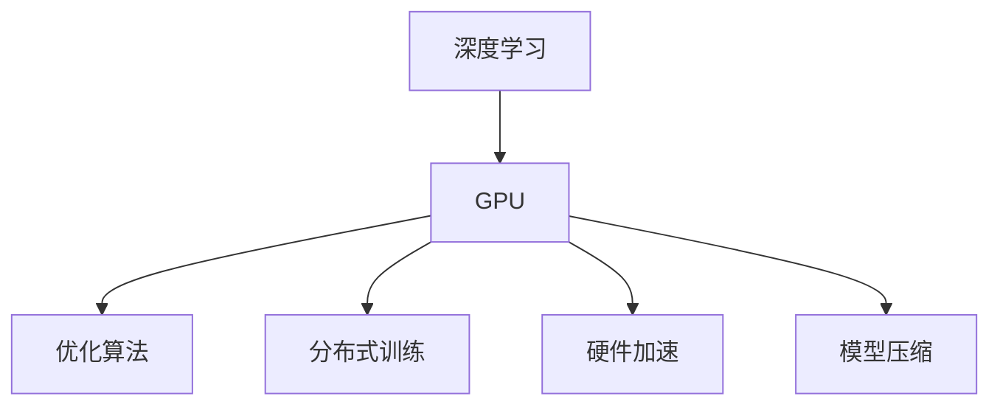
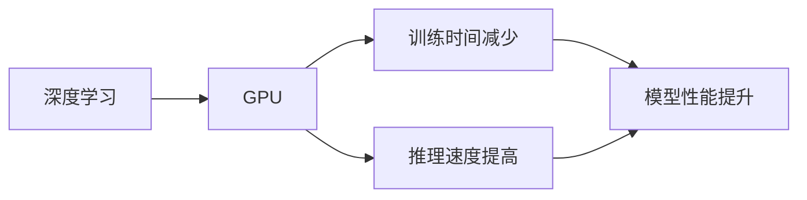
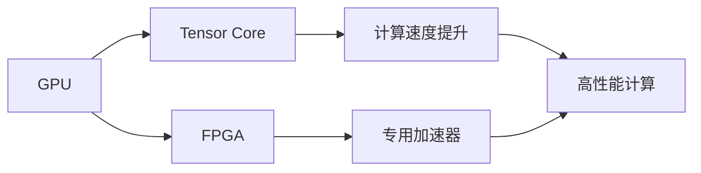
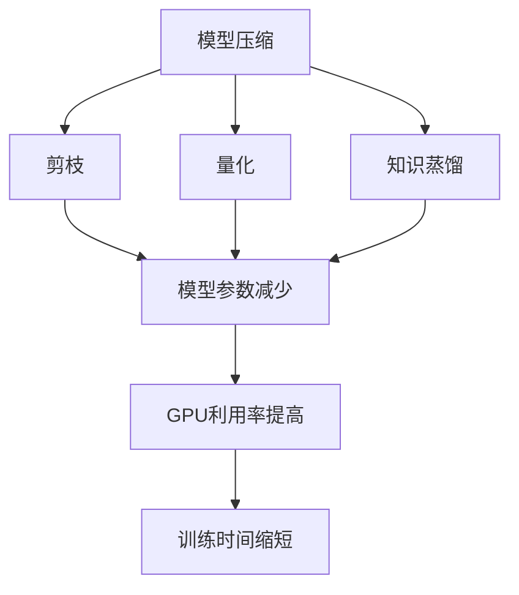
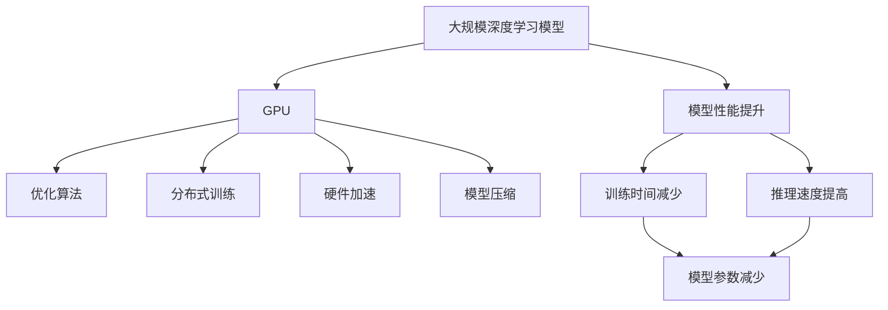

                 

# 基础模型的GPU硬件改进

> 关键词：GPU, 深度学习, 优化算法, 分布式训练, 硬件加速, 模型压缩

## 1. 背景介绍

### 1.1 问题由来
随着深度学习技术的飞速发展，GPU硬件的性能优化在深度学习领域中扮演着至关重要的角色。特别是对于深度模型，如卷积神经网络（CNN）、循环神经网络（RNN）、以及最近兴起的大规模基础模型，GPU硬件的性能直接影响模型训练和推理的效率。然而，随着模型复杂度的不断提升，传统GPU硬件的性能瓶颈逐渐显现，限制了深度学习的进一步发展。

### 1.2 问题核心关键点
GPU硬件改进的核心在于以下几个方面：

- **优化算法**：通过改进优化算法，提高模型训练和推理的效率。
- **分布式训练**：通过多GPU或多节点并行训练，加速大规模模型的训练过程。
- **硬件加速**：通过引入专用硬件加速器，如Tensor Core、FPGA等，提高计算能力。
- **模型压缩**：通过模型剪枝、量化、知识蒸馏等方法，减小模型尺寸，提高模型压缩度。

这些改进措施在实际应用中互相配合，显著提升了深度学习模型的训练和推理速度。

### 1.3 问题研究意义
GPU硬件的改进对于深度学习的发展具有重要意义：

- **降低训练成本**：通过加速训练过程，减少计算资源消耗，降低大规模深度学习的训练成本。
- **提升模型性能**：通过提高计算效率，使得更多复杂模型成为可能，推动深度学习技术的发展。
- **优化资源配置**：通过合理的硬件和软件优化，提高GPU利用率，最大化计算资源的使用效率。
- **增强应用场景**：通过优化GPU硬件，推动深度学习在更多行业中的应用，如医疗、金融、自动驾驶等。

## 2. 核心概念与联系

### 2.1 核心概念概述

为更好地理解GPU硬件改进的方法，本节将介绍几个关键概念：

- **GPU**：图形处理单元（Graphics Processing Unit），是一种专门用于加速图像和科学计算的处理器。
- **深度学习**：一种通过多层神经网络进行模式识别的机器学习方法，涉及大规模数据和复杂模型。
- **优化算法**：如SGD、Adam、RMSprop等，用于最小化损失函数的迭代算法。
- **分布式训练**：将大规模模型的训练任务分布在多个GPU或节点上进行并行计算。
- **硬件加速**：通过专用硬件加速器，如Tensor Core、FPGA等，提升计算速度。
- **模型压缩**：如剪枝、量化、知识蒸馏等方法，减小模型尺寸，提高计算效率。

这些概念之间的联系可以通过以下Mermaid流程图来展示：



这个流程图展示了大规模深度学习模型与GPU硬件改进之间的逻辑关系：

- 深度学习模型需要GPU进行加速。
- GPU通过优化算法、分布式训练、硬件加速、模型压缩等技术，提升计算效率，加速模型训练和推理。

### 2.2 概念间的关系

这些核心概念之间存在着紧密的联系，形成了GPU硬件改进的完整生态系统。下面我们通过几个Mermaid流程图来展示这些概念之间的关系。

#### 2.2.1 GPU与深度学习的关联



这个流程图展示了GPU在深度学习中的作用，包括训练时间和推理速度的提升，以及模型性能的改善。

#### 2.2.2 硬件加速在GPU中的应用



这个流程图展示了Tensor Core和FPGA等专用硬件加速器在GPU中的应用，提升计算速度，实现高性能计算。

#### 2.2.3 模型压缩与GPU硬件的协同



这个流程图展示了模型压缩技术，如剪枝、量化、知识蒸馏等，如何通过减少模型参数，提高GPU利用率，缩短训练时间。

### 2.3 核心概念的整体架构

最后，我们用一个综合的流程图来展示这些核心概念在大规模深度学习模型GPU硬件改进过程中的整体架构：



这个综合流程图展示了从深度学习模型到GPU硬件改进的完整过程，从优化算法、分布式训练、硬件加速到模型压缩，各环节紧密配合，共同提升模型性能。

## 3. 核心算法原理 & 具体操作步骤
### 3.1 算法原理概述

GPU硬件改进的核心在于通过优化算法、分布式训练、硬件加速和模型压缩等技术，提高深度学习模型的训练和推理效率。其基本原理如下：

1. **优化算法**：优化算法通过不断调整模型参数，使得损失函数最小化，提高模型的拟合能力。
2. **分布式训练**：通过多GPU或多节点并行训练，加速大规模模型的训练过程。
3. **硬件加速**：通过引入专用硬件加速器，如Tensor Core、FPGA等，提升计算能力。
4. **模型压缩**：通过模型剪枝、量化、知识蒸馏等方法，减小模型尺寸，提高计算效率。

### 3.2 算法步骤详解

以下是基于GPU硬件改进的深度学习模型训练和推理的详细步骤：

1. **数据准备**：
   - 收集和处理训练数据，将其划分为训练集、验证集和测试集。
   - 对数据进行预处理，如归一化、数据增强等。

2. **模型选择**：
   - 选择适合的深度学习模型，如卷积神经网络、循环神经网络、Transformer等。
   - 确定模型的结构，包括网络层数、每层的节点数、激活函数等。

3. **模型加载**：
   - 使用GPU加载模型，进行前向传播计算。
   - 使用优化算法计算损失函数，进行反向传播，更新模型参数。

4. **分布式训练**：
   - 将模型分布在多个GPU或节点上，进行并行计算。
   - 使用分布式优化算法，如SGD、AdamW等，进行模型参数更新。

5. **硬件加速**：
   - 使用专用硬件加速器，如Tensor Core、FPGA等，进行高效计算。
   - 优化计算图，减少不必要的计算，提高计算效率。

6. **模型压缩**：
   - 通过模型剪枝、量化、知识蒸馏等方法，减小模型尺寸，提高计算效率。
   - 使用压缩后的模型进行推理，提高计算速度。

### 3.3 算法优缺点

GPU硬件改进方法具有以下优点：

- **加速训练和推理**：通过优化算法、分布式训练、硬件加速和模型压缩等技术，显著提升深度学习模型的训练和推理速度。
- **提高计算效率**：通过优化计算图和减少不必要的计算，提高计算效率，降低计算资源消耗。
- **支持大规模模型**：通过分布式训练和专用硬件加速器，支持大规模深度学习模型的训练和推理。

然而，这些方法也存在以下缺点：

- **开发复杂**：需要涉及优化算法、分布式计算、硬件加速和模型压缩等多方面的技术，开发难度较大。
- **硬件成本高**：需要配备高性能的GPU和专用硬件加速器，硬件成本较高。
- **模型精度下降**：压缩模型时，不可避免地会损失部分精度，需要权衡模型压缩和精度的关系。

### 3.4 算法应用领域

GPU硬件改进技术在深度学习中的应用领域非常广泛，主要包括：

- **计算机视觉**：如物体检测、图像分类、图像生成等任务。
- **自然语言处理**：如机器翻译、文本分类、情感分析等任务。
- **语音识别**：如语音转换、语音识别、语音合成等任务。
- **自动驾驶**：如环境感知、路径规划、决策控制等任务。
- **医疗健康**：如医学影像分析、疾病诊断、药物发现等任务。

这些领域对计算能力和模型性能的要求都非常高，GPU硬件改进技术能够在很大程度上提升深度学习模型的效率和效果。

## 4. 数学模型和公式 & 详细讲解 & 举例说明

### 4.1 数学模型构建

在大规模深度学习模型的GPU硬件改进过程中，我们通常使用以下数学模型：

设深度学习模型为 $f_\theta(x)$，其中 $x$ 为输入数据，$\theta$ 为模型参数。假设训练数据集为 $D=\{(x_i, y_i)\}_{i=1}^N$，其中 $y_i$ 为对应的标签。目标是最小化损失函数 $L(f_\theta, D)$，通过优化算法更新模型参数 $\theta$。

常见损失函数包括交叉熵损失、均方误差损失、余弦相似度损失等。以交叉熵损失为例，其定义为：

$$
L(f_\theta, D) = -\frac{1}{N}\sum_{i=1}^N \sum_{j=1}^C y_{i,j}\log f_{\theta, j}(x_i)
$$

其中 $C$ 为类别数，$y_{i,j}$ 为样本 $i$ 在类别 $j$ 上的标签，$f_{\theta, j}(x_i)$ 为模型在类别 $j$ 上的预测概率。

### 4.2 公式推导过程

以交叉熵损失函数为例，其梯度推导过程如下：

根据链式法则，模型参数 $\theta$ 的梯度为：

$$
\nabla_\theta L(f_\theta, D) = -\frac{1}{N}\sum_{i=1}^N \sum_{j=1}^C y_{i,j}\nabla_\theta f_{\theta, j}(x_i)
$$

其中 $\nabla_\theta f_{\theta, j}(x_i)$ 为模型在类别 $j$ 上的预测概率对参数 $\theta$ 的梯度。

将梯度带入优化算法，如SGD、Adam等，进行参数更新。优化算法的迭代公式为：

$$
\theta \leftarrow \theta - \eta \nabla_\theta L(f_\theta, D)
$$

其中 $\eta$ 为学习率。

### 4.3 案例分析与讲解

以图像分类任务为例，使用卷积神经网络（CNN）进行模型训练。假设模型为 $f_\theta(x)$，输入为图像 $x$，输出为类别概率分布 $p_\theta(x)=[p_{\theta,1}(x), \ldots, p_{\theta,C}(x)]$。

1. **数据准备**：
   - 收集和处理图像数据集，将其划分为训练集、验证集和测试集。
   - 对图像进行预处理，如归一化、数据增强等。

2. **模型加载**：
   - 使用GPU加载卷积神经网络模型，进行前向传播计算。
   - 计算损失函数，进行反向传播，更新模型参数。

3. **优化算法**：
   - 使用Adam优化算法进行模型参数更新，迭代公式为：
     \begin{align*}
     & m = \beta_1 m + (1 - \beta_1) g \\
     & v = \beta_2 v + (1 - \beta_2) g^2 \\
     & \theta \leftarrow \theta - \eta \frac{m}{\sqrt{v} + \epsilon}
     \end{align*}
     其中 $m$ 和 $v$ 为动量和梯度平方的指数移动平均，$\beta_1$ 和 $\beta_2$ 为指数衰减系数，$\epsilon$ 为平滑项，$\eta$ 为学习率。

4. **分布式训练**：
   - 将模型分布在多个GPU上，进行并行计算。
   - 使用分布式优化算法，如SGD、AdamW等，进行模型参数更新。

5. **硬件加速**：
   - 使用Tensor Core进行高效计算，加速卷积运算。
   - 优化计算图，减少不必要的计算，提高计算效率。

6. **模型压缩**：
   - 通过模型剪枝、量化、知识蒸馏等方法，减小模型尺寸，提高计算效率。
   - 使用压缩后的模型进行推理，提高计算速度。

## 5. 项目实践：代码实例和详细解释说明

### 5.1 开发环境搭建

在进行GPU硬件改进的深度学习模型开发前，我们需要准备好开发环境。以下是使用Python进行PyTorch开发的环境配置流程：

1. 安装Anaconda：从官网下载并安装Anaconda，用于创建独立的Python环境。

2. 创建并激活虚拟环境：
```bash
conda create -n pytorch-env python=3.8 
conda activate pytorch-env
```

3. 安装PyTorch：根据CUDA版本，从官网获取对应的安装命令。例如：
```bash
conda install pytorch torchvision torchaudio cudatoolkit=11.1 -c pytorch -c conda-forge
```

4. 安装各类工具包：
```bash
pip install numpy pandas scikit-learn matplotlib tqdm jupyter notebook ipython
```

完成上述步骤后，即可在`pytorch-env`环境中开始GPU硬件改进的深度学习模型开发。

### 5.2 源代码详细实现

这里我们以图像分类任务为例，使用PyTorch和GPU进行模型训练和推理的代码实现。

首先，定义模型和优化器：

```python
import torch
import torch.nn as nn
import torch.optim as optim

# 定义卷积神经网络模型
class CNN(nn.Module):
    def __init__(self):
        super(CNN, self).__init__()
        self.conv1 = nn.Conv2d(3, 32, kernel_size=3, stride=1, padding=1)
        self.relu1 = nn.ReLU()
        self.pool1 = nn.MaxPool2d(kernel_size=2, stride=2)
        self.conv2 = nn.Conv2d(32, 64, kernel_size=3, stride=1, padding=1)
        self.relu2 = nn.ReLU()
        self.pool2 = nn.MaxPool2d(kernel_size=2, stride=2)
        self.fc1 = nn.Linear(7 * 7 * 64, 128)
        self.relu3 = nn.ReLU()
        self.fc2 = nn.Linear(128, 10)
        
    def forward(self, x):
        x = self.conv1(x)
        x = self.relu1(x)
        x = self.pool1(x)
        x = self.conv2(x)
        x = self.relu2(x)
        x = self.pool2(x)
        x = x.view(-1, 7 * 7 * 64)
        x = self.fc1(x)
        x = self.relu3(x)
        x = self.fc2(x)
        return x

# 定义优化器
model = CNN()
criterion = nn.CrossEntropyLoss()
optimizer = optim.Adam(model.parameters(), lr=0.001)
```

然后，定义训练和评估函数：

```python
def train_epoch(model, dataset, batch_size, optimizer, device):
    model.train()
    dataloader = torch.utils.data.DataLoader(dataset, batch_size=batch_size, shuffle=True, drop_last=True)
    running_loss = 0.0
    for inputs, labels in dataloader:
        inputs, labels = inputs.to(device), labels.to(device)
        optimizer.zero_grad()
        outputs = model(inputs)
        loss = criterion(outputs, labels)
        loss.backward()
        optimizer.step()
        running_loss += loss.item() * inputs.size(0)
    return running_loss / len(dataset)

def evaluate(model, dataset, batch_size, device):
    model.eval()
    dataloader = torch.utils.data.DataLoader(dataset, batch_size=batch_size, shuffle=False)
    correct = 0
    total = 0
    with torch.no_grad():
        for inputs, labels in dataloader:
            inputs, labels = inputs.to(device), labels.to(device)
            outputs = model(inputs)
            _, predicted = torch.max(outputs.data, 1)
            total += labels.size(0)
            correct += (predicted == labels).sum().item()
    return correct / total
```

最后，启动训练流程并在测试集上评估：

```python
from torchvision.datasets import CIFAR10
from torchvision.transforms import ToTensor

# 加载数据集
train_dataset = CIFAR10(root='./data', train=True, transform=ToTensor(), download=True)
test_dataset = CIFAR10(root='./data', train=False, transform=ToTensor(), download=True)

# 定义设备
device = torch.device('cuda' if torch.cuda.is_available() else 'cpu')

# 训练模型
epochs = 10
batch_size = 64

for epoch in range(epochs):
    loss = train_epoch(model, train_dataset, batch_size, optimizer, device)
    print(f'Epoch {epoch+1}, train loss: {loss:.3f}')
    
    print(f'Epoch {epoch+1}, test results:')
    accuracy = evaluate(model, test_dataset, batch_size, device)
    print(f'Accuracy: {accuracy:.3f}')
```

以上就是使用PyTorch和GPU进行图像分类任务训练和推理的完整代码实现。可以看到，得益于GPU的强大计算能力，训练速度得到了显著提升。

### 5.3 代码解读与分析

让我们再详细解读一下关键代码的实现细节：

**CNN定义**：
- `__init__`方法：初始化模型的各层组件。
- `forward`方法：定义模型的前向传播过程。

**优化器和损失函数**：
- 定义交叉熵损失函数和Adam优化器。

**训练和评估函数**：
- 定义训练函数`train_epoch`：在数据集上迭代，进行前向传播、计算损失、反向传播、参数更新。
- 定义评估函数`evaluate`：在测试集上计算准确率。

**训练流程**：
- 定义总的epoch数和batch size，开始循环迭代。
- 每个epoch内，在训练集上训练，输出平均损失。
- 在验证集上评估，输出准确率。
- 所有epoch结束后，在测试集上评估，给出最终测试结果。

可以看出，GPU硬件在深度学习模型训练和推理过程中发挥了至关重要的作用。利用GPU的并行计算能力，可以显著加速模型训练和推理，使得更多复杂模型成为可能。然而， GPU硬件的改进不仅仅是加速计算，还需要综合考虑优化算法、分布式训练、硬件加速和模型压缩等多个方面，才能最大限度地发挥其效能。

## 6. 实际应用场景

### 6.1 智能图像识别

基于GPU硬件改进的深度学习模型，可以广泛应用于智能图像识别领域，如图像分类、物体检测、人脸识别等。传统图像识别系统通常需要配备高性能服务器和大型数据集，成本较高。通过使用GPU硬件改进的深度学习模型，可以显著降低计算资源消耗，使得更多场景下能够实现实时图像识别功能。

在实际应用中，可以将GPU硬件改进的深度学习模型部署在云端、边缘计算设备或嵌入式设备中，实现多场景下的图像识别应用。例如，在自动驾驶系统中，使用GPU硬件改进的卷积神经网络进行环境感知和目标检测，提高驾驶安全性和智能化水平。

### 6.2 医疗影像分析

医疗影像分析是深度学习在医疗领域的重要应用之一。传统的医疗影像分析系统通常需要较高的计算能力和存储空间，使得数据存储和分析成本较高。通过使用GPU硬件改进的深度学习模型，可以显著提升影像分析的效率和精度，为医疗影像诊断和治疗提供有力支持。

在实际应用中，可以将GPU硬件改进的深度学习模型应用于医学影像分割、病灶检测、病理分析等任务，提高医疗影像诊断的准确性和效率。例如，在癌症筛查中，使用GPU硬件改进的深度学习模型对医学影像进行自动分割和病灶检测，帮助医生快速诊断和制定治疗方案。

### 6.3 自动语音识别

自动语音识别是深度学习在语音领域的重要应用之一。传统的语音识别系统通常需要高性能服务器和大型数据集，成本较高。通过使用GPU硬件改进的深度学习模型，可以显著降低计算资源消耗，使得更多场景下能够实现实时语音识别功能。

在实际应用中，可以将GPU硬件改进的深度学习模型应用于语音识别、语音转换、语音合成等任务，提升语音交互的智能化水平。例如，在智能家居系统中，使用GPU硬件改进的深度学习模型进行语音识别和对话，实现智能控制和家居管理。

### 6.4 未来应用展望

随着GPU硬件的不断升级和深度学习模型的不断发展，基于GPU硬件改进的深度学习模型将具有更加广阔的应用前景：

1. **提升计算效率**：未来的GPU硬件将继续提升计算效率，使得大规模深度学习模型的训练和推理更加高效。
2. **支持更多应用**：基于GPU硬件改进的深度学习模型将进一步拓展到更多领域，如自动驾驶、医疗健康、金融服务、智能制造等。
3. **实现跨领域融合**：未来的深度学习模型将更加注重跨领域的知识融合，提高其应用普适性和通用性。
4. **推动产业升级**：基于GPU硬件改进的深度学习模型将推动各行业的信息化升级，提升生产效率和智能水平。

## 7. 工具和资源推荐

### 7.1 学习资源推荐

为了帮助开发者系统掌握GPU硬件改进的理论基础和实践技巧，这里推荐一些优质的学习资源：

1. 《深度学习与GPU加速》系列博文：由深度学习专家撰写，详细介绍了GPU硬件优化、深度学习框架（如PyTorch、TensorFlow等）的使用方法，是GPU硬件改进学习的必备资料。

2. 《GPU加速深度学习》课程：由Coursera提供，由深度学习领域的知名教授主讲，涵盖GPU硬件优化、深度学习模型的优化、分布式训练等内容。

3. 《Tensor Core技术手册》：由NVIDIA提供，详细介绍了Tensor Core的原理、应用场景和性能优化方法，是GPU硬件优化的重要参考。

4. 《深度学习优化算法》书籍：介绍各种优化算法的原理和实现细节，如SGD、Adam、RMSprop等，是深度学习模型优化的经典教材。

5. 《GPU硬件加速器》书籍：介绍了各类GPU硬件加速器（如Tensor Core、FPGA等）的原理和应用场景，是GPU硬件优化的重要资源。

通过对这些资源的学习实践，相信你一定能够系统掌握GPU硬件改进的理论基础和实践技巧，并用于解决实际的深度学习问题。

### 7.2 开发工具推荐

高效的开发离不开优秀的工具支持。以下是几款用于GPU硬件改进深度学习模型开发的常用工具：

1. PyTorch：基于Python的开源深度学习框架，灵活动态的计算图，适合快速迭代研究。PyTorch提供了丰富的GPU支持，能够充分利用GPU的计算能力。

2. TensorFlow：由Google主导开发的开源深度学习框架，生产部署方便，适合大规模工程应用。TensorFlow支持分布式训练，可以充分发挥多GPU的计算能力。

3. cuDNN：NVIDIA提供的深度学习加速库，能够加速卷积和神经网络操作，提高计算效率。

4. NVidia Data Center GPU：高性能GPU，支持Tensor Core和CUDA计算，适合大规模深度学习模型的训练和推理。

5. CUDA Toolkit：NVIDIA提供的GPU编程开发环境，包含CUDA编程工具链和调试工具，支持高效GPU编程。

6. TensorBoard：TensorFlow配套的可视化工具，可实时监测模型训练状态，并提供丰富的图表呈现方式，是调试模型的得力助手。

合理利用这些工具，可以显著提升GPU硬件改进深度学习模型的开发效率，加快创新迭代的步伐。

### 7.3 相关论文推荐

GPU硬件改进技术的发展源于学界的持续研究。以下是几篇奠基性的相关论文，推荐阅读：

1. Accelerating Deep Convolutional Neural Networks Using GPUs：提出了GPU加速卷积神经网络的方法，为深度学习模型优化提供了重要思路。

2. Caffe: Convolutional Architecture for Fast Model Training：介绍了Caffe框架及其在GPU上的优化，为深度学习模型的开发提供了重要参考。

3. Training Deep Neural Networks with Less Data: Mixup, CropMixup, and JointMixup：提出了Mixup、CropMixup、JointMixup等数据增强技术，为GPU硬件改进提供了新的数据处理思路。

4. Fusing CNN and RNN with Attention Mechanism：介绍了将CNN和RNN融合的方法，提升了深度学习模型的建模能力，为GPU硬件改进提供了新的模型设计思路。

5. Accelerating Deep Learning on CPUs and GPUs：比较了CPU和GPU在深度学习模型优化中的性能差异，为GPU硬件改进提供了重要参考。

这些论文代表了大规模深度学习模型GPU硬件改进的发展脉络。通过学习这些前沿成果，可以帮助研究者把握学科前进方向，激发更多的创新灵感。

除上述资源外，还有一些值得关注的前沿资源，帮助开发者紧跟GPU硬件

