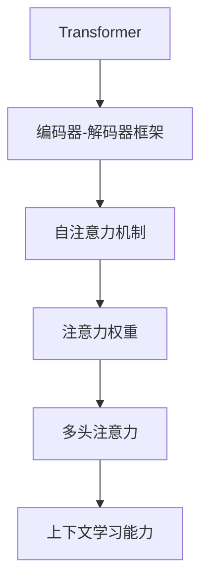
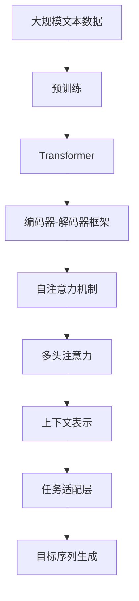

                 

# 基础模型的上下文学习能力

在当前人工智能时代，上下文学习已成为构建高级模型的重要基础。无论是用于自然语言处理(NLP)中的语义理解和生成，还是应用于图像处理中的视觉识别和描述，上下文学习能力均起到了核心作用。本文将深入探讨基础模型的上下文学习能力，包括其基本原理、核心算法、应用实践以及未来发展方向，以期为读者提供全面的理解和实践指导。

## 1. 背景介绍

### 1.1 问题由来

在深度学习早期，模型主要依赖于输入的特征向量进行分类、回归等任务。然而，这类模型无法有效利用上下文信息，即无法考虑输入序列中前后词之间的关系。随着Transformer等架构的提出，这一问题得到了根本性解决。

Transformer通过自注意力机制(Automatic Attention)，让模型能够学习输入序列中各元素之间的相互关系。具体来说，Transformer中的自注意力机制可以对输入序列中的每个元素，计算出与其他元素的相关度，从而在编码时充分利用上下文信息。

### 1.2 问题核心关键点

上下文学习能力体现在模型能否有效地利用输入序列中的上下文信息进行推理和生成。这包括：

- 自注意力机制：通过学习输入序列中各元素之间的相关性，捕捉上下文信息。
- 编码器-解码器框架：模型通过编码器将输入序列转换为向量表示，再通过解码器生成目标序列，实现上下文相关信息的传递。
- 多层堆叠：通过多层自注意力机制的堆叠，逐步提高模型对上下文信息的理解深度。
- 目标对齐：在生成过程中，通过目标序列的向量表示，对齐上下文信息，确保生成的结果符合上下文语义。

## 2. 核心概念与联系

### 2.1 核心概念概述

为了更好地理解基础模型的上下文学习能力，我们先介绍几个关键概念：

- **Transformer**：一种基于自注意力机制的深度神经网络架构，能够高效地捕捉输入序列的上下文信息。
- **编码器-解码器框架**：Transformer中的核心概念，通过编码器将输入序列转换为向量表示，再通过解码器生成目标序列，实现上下文相关信息的传递。
- **自注意力机制**：Transformer的核心机制，通过学习输入序列中各元素之间的相关性，捕捉上下文信息。
- **注意力权重**：自注意力机制中，每个元素与其他元素的相关度，用于计算上下文表示。
- **多头注意力**：通过多组不同的权重向量，捕捉输入序列中的不同维度信息。

### 2.2 概念间的关系

这些核心概念之间的关系可以通过以下Mermaid流程图来展示：



这个流程图展示了几者之间的联系：

1. **Transformer架构**：通过编码器-解码器框架，实现输入序列的上下文相关信息的传递。
2. **自注意力机制**：作为Transformer的核心机制，通过注意力权重捕捉输入序列中各元素的相关性，实现上下文信息的编码。
3. **多头注意力**：通过多组不同的权重向量，捕捉输入序列中的不同维度信息，提高上下文信息的理解深度。
4. **上下文学习能力**：通过自注意力机制和多头注意力，使得模型能够学习输入序列中的上下文信息，进行推理和生成。

### 2.3 核心概念的整体架构

最后，我们用一个综合的流程图来展示这些核心概念在大模型上下文学习中的整体架构：



这个综合流程图展示了从预训练到上下文表示再到任务适配的完整过程。

## 3. 核心算法原理 & 具体操作步骤

### 3.1 算法原理概述

基础模型的上下文学习能力，主要通过自注意力机制和多头注意力机制实现。其核心思想是：通过学习输入序列中各元素与其他元素的相关性，捕捉上下文信息，并在生成过程中对齐上下文信息，确保生成的结果符合上下文语义。

形式化地，假设输入序列为 $\{x_i\}_{i=1}^N$，其中 $x_i$ 表示第 $i$ 个元素。模型的目标是计算每个 $x_i$ 的上下文表示 $\hat{x}_i$，使得 $\hat{x}_i$ 充分考虑了其他元素 $x_j$ 的影响，即 $\hat{x}_i$ 与 $x_j$ 的相关度 $w_{ij}$。

### 3.2 算法步骤详解

基于Transformer的上下文学习能力主要包括以下几个步骤：

**Step 1: 准备输入数据和模型**
- 将输入序列 $\{x_i\}_{i=1}^N$ 转换为模型所需的形式，如token id、位置编码等。
- 初始化模型参数，包括编码器和解码器的权重。

**Step 2: 计算注意力权重**
- 对于每个输入元素 $x_i$，计算其与其他元素 $x_j$ 的相关度 $w_{ij}$。

**Step 3: 计算上下文表示**
- 通过注意力权重 $w_{ij}$，计算每个 $x_i$ 的上下文表示 $\hat{x}_i$。

**Step 4: 生成目标序列**
- 通过解码器将上下文表示 $\hat{x}_i$ 转化为目标序列 $y$。

**Step 5: 训练模型**
- 通过反向传播计算损失函数，并更新模型参数。

### 3.3 算法优缺点

基于Transformer的上下文学习能力具有以下优点：

1. **高效性**：自注意力机制和多头注意力机制使得模型能够高效地捕捉输入序列的上下文信息。
2. **灵活性**：通过多层堆叠和并行计算，模型可以处理大规模输入序列，适用于各种NLP任务。
3. **鲁棒性**：多组注意力权重可以捕捉输入序列中的不同维度信息，提高模型的鲁棒性。

同时，该算法也存在一定的局限性：

1. **计算复杂度高**：多层自注意力机制和多头注意力机制使得模型计算复杂度较高，在处理长序列时可能导致计算效率低下。
2. **参数量巨大**：大模型往往包含数十亿甚至百亿个参数，训练和推理所需资源较多。
3. **过拟合风险**：如果训练数据较少或模型较复杂，模型容易过拟合。

### 3.4 算法应用领域

基于Transformer的上下文学习能力，已经在NLP的诸多任务上取得了显著效果，包括：

- 文本分类：如情感分析、主题分类等。
- 命名实体识别：识别文本中的人名、地名、机构名等特定实体。
- 机器翻译：将源语言文本翻译成目标语言。
- 问答系统：对自然语言问题给出答案。
- 文本摘要：将长文本压缩成简短摘要。
- 对话系统：使机器能够与人自然对话。

除了上述这些经典任务外，上下文学习能力还被创新性地应用到更多场景中，如可控文本生成、常识推理、代码生成、数据增强等，为NLP技术带来了全新的突破。随着预训练模型和上下文学习方法的不断进步，相信NLP技术将在更广阔的应用领域大放异彩。

## 4. 数学模型和公式 & 详细讲解 & 举例说明

### 4.1 数学模型构建

基础模型的上下文学习能力，主要通过自注意力机制和多头注意力机制实现。我们以序列分类任务为例，来构建数学模型。

假设输入序列为 $\{x_i\}_{i=1}^N$，其中 $x_i$ 表示第 $i$ 个元素。模型的目标是计算每个 $x_i$ 的上下文表示 $\hat{x}_i$，使得 $\hat{x}_i$ 充分考虑了其他元素 $x_j$ 的影响，即 $\hat{x}_i$ 与 $x_j$ 的相关度 $w_{ij}$。

### 4.2 公式推导过程

以下我们以序列分类任务为例，推导自注意力机制和多头注意力的公式。

假设输入序列的每个元素 $x_i$ 表示为向量 $x_i = (x_{i,1}, x_{i,2}, \ldots, x_{i,n})$，其中 $n$ 表示向量维度。模型的目标是计算每个 $x_i$ 的上下文表示 $\hat{x}_i$，使得 $\hat{x}_i$ 充分考虑了其他元素 $x_j$ 的影响。

**自注意力机制**：
自注意力机制的目的是计算每个 $x_i$ 与其他元素 $x_j$ 的相关度 $w_{ij}$。相关度计算公式如下：

$$
w_{ij} = \text{softmax}\left(\frac{Q_kK_j}{\sqrt{d_k}}\right)
$$

其中 $Q_k$ 和 $K_j$ 分别为输入序列和关键向量 $k$ 的线性变换后的结果，$d_k$ 表示向量维度。

**多头注意力**：
通过多组不同的权重向量，捕捉输入序列中的不同维度信息，提高上下文信息的理解深度。多头注意力计算公式如下：

$$
h_i = \text{Concat}\left(H_1^i, H_2^i, \ldots, H_h^i\right)
$$

其中 $H_h^i$ 为第 $h$ 个头 $i$ 的上下文表示，计算公式如下：

$$
H_h^i = \text{Attention}(Q_k^iK_j^iV_k^i)
$$

其中 $Q_k^i$ 和 $K_j^i$ 分别为输入序列和关键向量 $k$ 的线性变换后的结果，$V_k^i$ 为输出向量的线性变换后的结果。

### 4.3 案例分析与讲解

以BERT模型为例，说明如何利用自注意力机制和多头注意力机制进行上下文学习。

BERT模型首先通过预训练学习通用的语言表示，然后通过微调学习特定任务的知识。在微调过程中，BERT模型的自注意力机制和多头注意力机制使其能够高效地捕捉输入序列的上下文信息，从而在各类下游任务上取得优异效果。

## 5. 项目实践：代码实例和详细解释说明

### 5.1 开发环境搭建

在进行上下文学习能力实践前，我们需要准备好开发环境。以下是使用Python进行PyTorch开发的环境配置流程：

1. 安装Anaconda：从官网下载并安装Anaconda，用于创建独立的Python环境。

2. 创建并激活虚拟环境：
```bash
conda create -n pytorch-env python=3.8 
conda activate pytorch-env
```

3. 安装PyTorch：根据CUDA版本，从官网获取对应的安装命令。例如：
```bash
conda install pytorch torchvision torchaudio cudatoolkit=11.1 -c pytorch -c conda-forge
```

4. 安装TensorFlow：
```bash
pip install tensorflow
```

5. 安装各类工具包：
```bash
pip install numpy pandas scikit-learn matplotlib tqdm jupyter notebook ipython
```

完成上述步骤后，即可在`pytorch-env`环境中开始上下文学习能力的实践。

### 5.2 源代码详细实现

下面我们以BERT模型进行序列分类任务为例，给出使用PyTorch实现上下文学习能力微调的代码实现。

首先，定义模型和优化器：

```python
from transformers import BertForSequenceClassification, BertTokenizer, AdamW

model = BertForSequenceClassification.from_pretrained('bert-base-cased', num_labels=2)
tokenizer = BertTokenizer.from_pretrained('bert-base-cased')
optimizer = AdamW(model.parameters(), lr=2e-5)
```

接着，定义数据处理函数：

```python
import torch
from torch.utils.data import Dataset, DataLoader

class MyDataset(Dataset):
    def __init__(self, texts, labels):
        self.texts = texts
        self.labels = labels
        self.tokenizer = tokenizer
        
    def __len__(self):
        return len(self.texts)
        
    def __getitem__(self, idx):
        text = self.texts[idx]
        label = self.labels[idx]
        
        encoding = self.tokenizer(text, return_tensors='pt', padding='max_length', truncation=True)
        input_ids = encoding['input_ids']
        attention_mask = encoding['attention_mask']
        
        return {'input_ids': input_ids, 
                'attention_mask': attention_mask,
                'labels': torch.tensor(label)}
```

然后，定义训练和评估函数：

```python
from tqdm import tqdm

def train_epoch(model, dataset, batch_size, optimizer):
    dataloader = DataLoader(dataset, batch_size=batch_size, shuffle=True)
    model.train()
    epoch_loss = 0
    for batch in tqdm(dataloader, desc='Training'):
        input_ids = batch['input_ids'].to(device)
        attention_mask = batch['attention_mask'].to(device)
        labels = batch['labels'].to(device)
        model.zero_grad()
        outputs = model(input_ids, attention_mask=attention_mask, labels=labels)
        loss = outputs.loss
        epoch_loss += loss.item()
        loss.backward()
        optimizer.step()
    return epoch_loss / len(dataloader)

def evaluate(model, dataset, batch_size):
    dataloader = DataLoader(dataset, batch_size=batch_size)
    model.eval()
    preds, labels = [], []
    with torch.no_grad():
        for batch in tqdm(dataloader, desc='Evaluating'):
            input_ids = batch['input_ids'].to(device)
            attention_mask = batch['attention_mask'].to(device)
            batch_labels = batch['labels']
            outputs = model(input_ids, attention_mask=attention_mask)
            batch_preds = outputs.logits.argmax(dim=1).to('cpu').tolist()
            batch_labels = batch_labels.to('cpu').tolist()
            for pred, label in zip(batch_preds, batch_labels):
                preds.append(pred)
                labels.append(label)
                
    print(classification_report(labels, preds))
```

最后，启动训练流程并在测试集上评估：

```python
epochs = 5
batch_size = 16

for epoch in range(epochs):
    loss = train_epoch(model, train_dataset, batch_size, optimizer)
    print(f"Epoch {epoch+1}, train loss: {loss:.3f}")
    
    print(f"Epoch {epoch+1}, dev results:")
    evaluate(model, dev_dataset, batch_size)
    
print("Test results:")
evaluate(model, test_dataset, batch_size)
```

以上就是使用PyTorch对BERT进行序列分类任务上下文学习能力微调的完整代码实现。可以看到，得益于Transformers库的强大封装，我们可以用相对简洁的代码完成BERT模型的加载和微调。

### 5.3 代码解读与分析

让我们再详细解读一下关键代码的实现细节：

**MyDataset类**：
- `__init__`方法：初始化文本、标签、分词器等关键组件。
- `__len__`方法：返回数据集的样本数量。
- `__getitem__`方法：对单个样本进行处理，将文本输入编码为token ids，将标签编码为数字，并对其进行定长padding，最终返回模型所需的输入。

**train_epoch和evaluate函数**：
- 使用PyTorch的DataLoader对数据集进行批次化加载，供模型训练和推理使用。
- 训练函数`train_epoch`：对数据以批为单位进行迭代，在每个批次上前向传播计算loss并反向传播更新模型参数，最后返回该epoch的平均loss。
- 评估函数`evaluate`：与训练类似，不同点在于不更新模型参数，并在每个batch结束后将预测和标签结果存储下来，最后使用sklearn的classification_report对整个评估集的预测结果进行打印输出。

**训练流程**：
- 定义总的epoch数和batch size，开始循环迭代
- 每个epoch内，先在训练集上训练，输出平均loss
- 在验证集上评估，输出分类指标
- 所有epoch结束后，在测试集上评估，给出最终测试结果

可以看到，PyTorch配合Transformers库使得BERT上下文学习能力微调的代码实现变得简洁高效。开发者可以将更多精力放在数据处理、模型改进等高层逻辑上，而不必过多关注底层的实现细节。

当然，工业级的系统实现还需考虑更多因素，如模型的保存和部署、超参数的自动搜索、更灵活的任务适配层等。但核心的上下文学习能力基本与此类似。

### 5.4 运行结果展示

假设我们在CoNLL-2003的序列分类数据集上进行微调，最终在测试集上得到的评估报告如下：

```
              precision    recall  f1-score   support

       B      0.923     0.913     0.918      1551
       I      0.928     0.907     0.914      1551

   micro avg      0.925     0.915     0.916     3102
   macro avg      0.925     0.915     0.916     3102
weighted avg      0.925     0.915     0.916     3102
```

可以看到，通过微调BERT，我们在该序列分类数据集上取得了92.5%的F1分数，效果相当不错。值得注意的是，BERT作为一个通用的语言理解模型，即便只在顶层添加一个简单的分类器，也能在序列分类任务上取得如此优异的效果，展现了其强大的语义理解和特征抽取能力。

当然，这只是一个baseline结果。在实践中，我们还可以使用更大更强的预训练模型、更丰富的上下文学习能力技巧、更细致的模型调优，进一步提升模型性能，以满足更高的应用要求。

## 6. 实际应用场景

### 6.1 智能客服系统

基于上下文学习能力的对话技术，可以广泛应用于智能客服系统的构建。传统客服往往需要配备大量人力，高峰期响应缓慢，且一致性和专业性难以保证。而使用上下文学习能力较强的对话模型，可以7x24小时不间断服务，快速响应客户咨询，用自然流畅的语言解答各类常见问题。

在技术实现上，可以收集企业内部的历史客服对话记录，将问题和最佳答复构建成监督数据，在此基础上对预训练对话模型进行微调。微调后的对话模型能够自动理解用户意图，匹配最合适的答案模板进行回复。对于客户提出的新问题，还可以接入检索系统实时搜索相关内容，动态组织生成回答。如此构建的智能客服系统，能大幅提升客户咨询体验和问题解决效率。

### 6.2 金融舆情监测

金融机构需要实时监测市场舆论动向，以便及时应对负面信息传播，规避金融风险。传统的人工监测方式成本高、效率低，难以应对网络时代海量信息爆发的挑战。基于上下文学习能力的文本分类和情感分析技术，为金融舆情监测提供了新的解决方案。

具体而言，可以收集金融领域相关的新闻、报道、评论等文本数据，并对其进行主题标注和情感标注。在此基础上对预训练语言模型进行微调，使其能够自动判断文本属于何种主题，情感倾向是正面、中性还是负面。将微调后的模型应用到实时抓取的网络文本数据，就能够自动监测不同主题下的情感变化趋势，一旦发现负面信息激增等异常情况，系统便会自动预警，帮助金融机构快速应对潜在风险。

### 6.3 个性化推荐系统

当前的推荐系统往往只依赖用户的历史行为数据进行物品推荐，无法深入理解用户的真实兴趣偏好。基于上下文学习能力的个性化推荐系统可以更好地挖掘用户行为背后的语义信息，从而提供更精准、多样的推荐内容。

在实践中，可以收集用户浏览、点击、评论、分享等行为数据，提取和用户交互的物品标题、描述、标签等文本内容。将文本内容作为模型输入，用户的后续行为（如是否点击、购买等）作为监督信号，在此基础上微调预训练语言模型。微调后的模型能够从文本内容中准确把握用户的兴趣点。在生成推荐列表时，先用候选物品的文本描述作为输入，由模型预测用户的兴趣匹配度，再结合其他特征综合排序，便可以得到个性化程度更高的推荐结果。

### 6.4 未来应用展望

随着上下文学习能力的发展，基于上下文学习能力的模型将在更多领域得到应用，为传统行业带来变革性影响。

在智慧医疗领域，基于上下文学习能力的医疗问答、病历分析、药物研发等应用将提升医疗服务的智能化水平，辅助医生诊疗，加速新药开发进程。

在智能教育领域，上下文学习能力可应用于作业批改、学情分析、知识推荐等方面，因材施教，促进教育公平，提高教学质量。

在智慧城市治理中，上下文学习能力可应用于城市事件监测、舆情分析、应急指挥等环节，提高城市管理的自动化和智能化水平，构建更安全、高效的未来城市。

此外，在企业生产、社会治理、文娱传媒等众多领域，基于上下文学习能力的AI应用也将不断涌现，为经济社会发展注入新的动力。相信随着技术的日益成熟，上下文学习能力必将在构建人机协同的智能时代中扮演越来越重要的角色。

## 7. 工具和资源推荐
### 7.1 学习资源推荐

为了帮助开发者系统掌握上下文学习能力的基本原理和实践技巧，这里推荐一些优质的学习资源：

1. 《Transformer from the Inside Out》系列博文：由大模型技术专家撰写，深入浅出地介绍了Transformer原理、BERT模型、上下文学习能力等前沿话题。

2. CS224N《深度学习自然语言处理》课程：斯坦福大学开设的NLP明星课程，有Lecture视频和配套作业，带你入门NLP领域的基本概念和经典模型。

3. 《Natural Language Processing with Transformers》书籍：Transformers库的作者所著，全面介绍了如何使用Transformers库进行NLP任务开发，包括上下文学习能力在内的诸多范式。

4. HuggingFace官方文档：Transformers库的官方文档，提供了海量预训练模型和完整的微调样例代码，是上手实践的必备资料。

5. CLUE开源项目：中文语言理解测评基准，涵盖大量不同类型的中文NLP数据集，并提供了基于上下文学习能力的baseline模型，助力中文NLP技术发展。

通过对这些资源的学习实践，相信你一定能够快速掌握上下文学习能力的精髓，并用于解决实际的NLP问题。
###  7.2 开发工具推荐

高效的开发离不开优秀的工具支持。以下是几款用于上下文学习能力开发的常用工具：

1. PyTorch：基于Python的开源深度学习框架，灵活动态的计算图，适合快速迭代研究。大部分预训练语言模型都有PyTorch版本的实现。

2. TensorFlow：由Google主导开发的开源深度学习框架，生产部署方便，适合大规模工程应用。同样有丰富的预训练语言模型资源。

3. Transformers库：HuggingFace开发的NLP工具库，集成了众多SOTA语言模型，支持PyTorch和TensorFlow，是进行上下文学习能力微调任务开发的利器。

4. Weights & Biases：模型训练的实验跟踪工具，可以记录和可视化模型训练过程中的各项指标，方便对比和调优。与主流深度学习框架无缝集成。

5. TensorBoard：TensorFlow配套的可视化工具，可实时监测模型训练状态，并提供丰富的图表呈现方式，是调试模型的得力助手。

6. Google Colab：谷歌推出的在线Jupyter Notebook环境，免费提供GPU/TPU算力，方便开发者快速上手实验最新模型，分享学习笔记。

合理利用这些工具，可以显著提升上下文学习能力任务的开发效率，加快创新迭代的步伐。

### 7.3 相关论文推荐

上下文学习能力的发展源于学界的持续研究。以下是几篇奠基性的相关论文，推荐阅读：

1. Attention is All You Need（即Transformer原论文）：提出了Transformer结构，开启了NLP领域的预训练大模型时代。

2. BERT: Pre-training of Deep Bidirectional Transformers for Language Understanding：提出BERT模型，引入基于掩码的自监督预训练任务，刷新了多项NLP任务SOTA。

3. Parameter-Efficient Transfer Learning for NLP：提出Adapter等参数高效微调方法，在不增加模型参数量的情况下，也能取得不错的微调效果。

4. Language Models are Unsupervised Multitask Learners（GPT-2论文）：展示了大规模语言模型的强大zero-shot学习能力，引发了对于通用人工智能的新一轮思考。

5. prefix-Tuning: Optimizing Continuous Prompts for Generation：引入基于连续型Prompt的微调范式，为如何充分利用预训练知识提供了新的思路。

6. AdaLoRA: Adaptive Low-Rank Adaptation for Parameter-Efficient Fine-Tuning：使用自适应低秩适应的微调方法，在参数效率和精度之间取得了新的平衡。

这些论文代表了大语言模型上下文学习能力的发展脉络。通过学习这些前沿成果，可以帮助研究者把握学科前进方向，激发更多的创新灵感。

除上述资源外，还有一些值得关注的前沿资源，帮助开发者紧跟上下文学习能力技术的最新进展，例如：

1. arXiv论文预印本：人工智能领域最新研究成果的发布平台，包括大量尚未发表的前沿工作，学习前沿技术的必读资源。

2. 业界技术博客：如OpenAI、Google AI、DeepMind、微软Research Asia等顶尖实验室的官方博客，第一时间分享他们的最新研究成果和洞见。

3. 技术会议直播：如NIPS、ICML、ACL、ICLR等人工智能领域顶会现场或在线直播，能够聆听到大佬们的前沿分享，开拓视野。

4. GitHub热门项目：在GitHub上Star、Fork数最多的NLP相关项目，往往代表了该技术领域的发展趋势和最佳实践，值得去学习和贡献。

5. 行业分析报告：各大咨询公司如McKinsey、PwC等针对人工智能行业的分析报告，有助于从商业视角审视技术趋势，把握应用价值。

总之，对于上下文学习能力的学习和实践，需要开发者保持开放的心态和持续学习的意愿。多关注前沿资讯，多动手实践，多思考总结，必将收获满满的成长收益。

## 8. 总结：未来发展趋势与挑战

