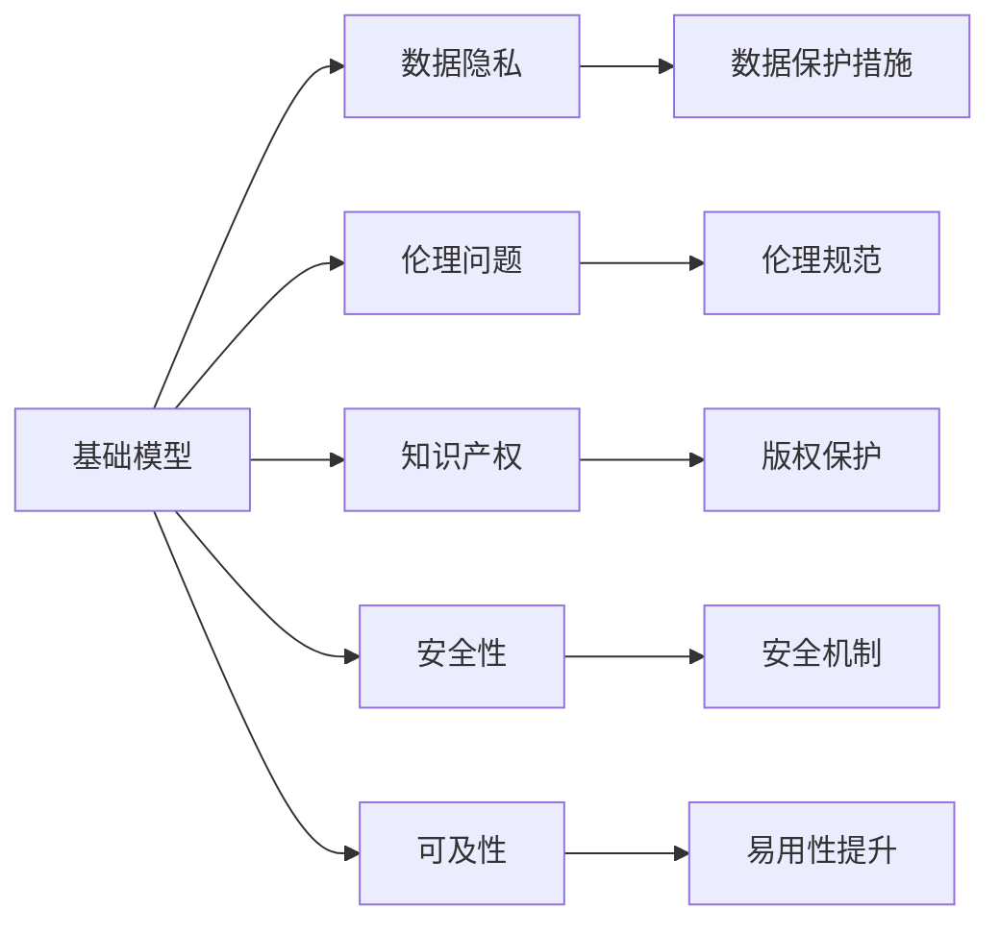
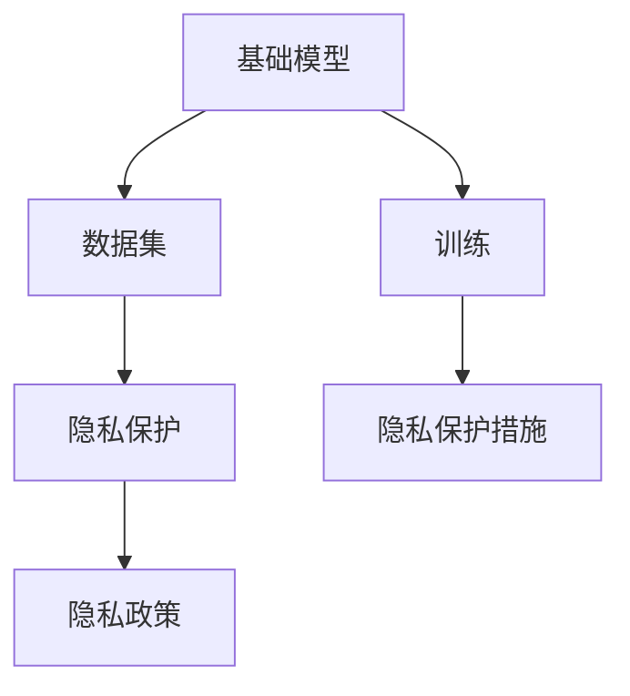
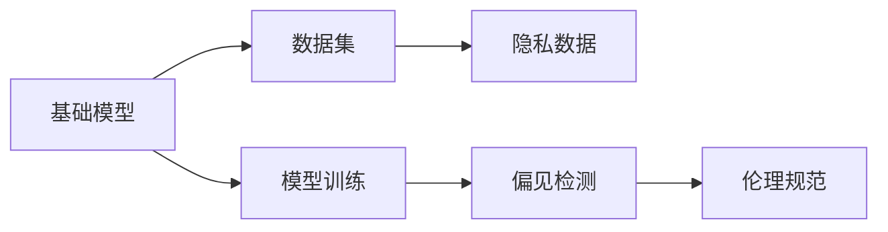
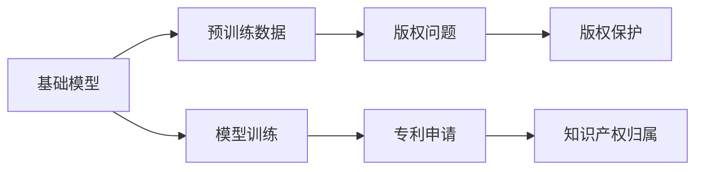
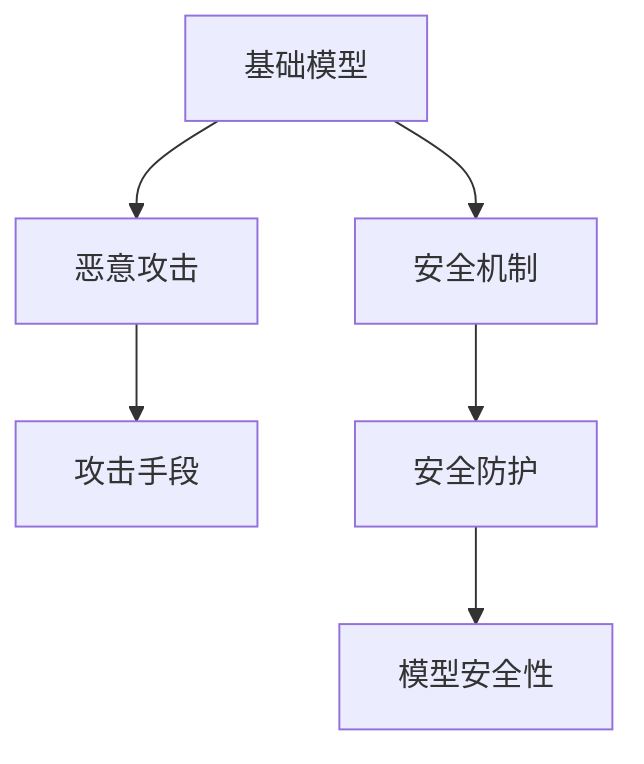
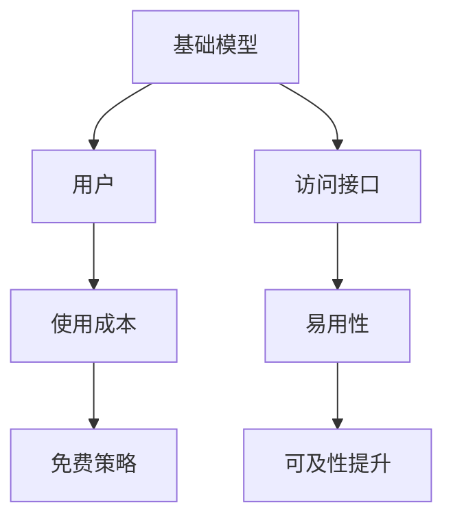
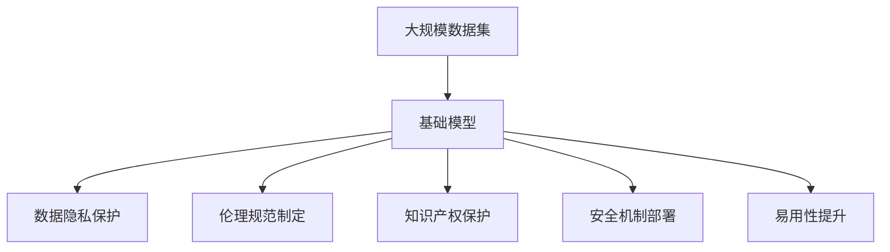

                 

# 基础模型的公开发布与限制

> 关键词：基础模型, 公开发布, 限制, 伦理, 数据隐私, 知识产权

## 1. 背景介绍

### 1.1 问题由来

基础模型（Foundation Model）是一类基于大规模预训练的深度学习模型，如GPT-3、BERT等，它们已经在自然语言处理、计算机视觉等领域取得了显著的成果。然而，这些模型的开发与部署涉及大量数据、计算资源和专业知识，其公开发布引起了广泛的关注与争议。一方面，基础模型为科研和技术开发提供了强大的工具，加速了人工智能的落地应用。但另一方面，基础模型的公开发布也带来了数据隐私、伦理和知识产权等一系列问题。

### 1.2 问题核心关键点

基础模型的公开发布主要涉及以下关键点：
- 数据隐私：基础模型训练依赖大规模数据集，如何保护数据隐私，防止数据滥用。
- 伦理问题：基础模型的使用可能引发伦理问题，如歧视、偏见和滥用。
- 知识产权：基础模型的开发和部署涉及复杂的知识产权问题，如何保护开发者和用户的权益。
- 安全性：基础模型可能被用于恶意行为，如何保障其安全性。
- 使用成本：基础模型的使用成本和可及性问题。

这些关键点需要通过法律、技术和社会多方面的合作来解决。

### 1.3 问题研究意义

研究和解决基础模型的公开发布问题，对于推动人工智能技术的健康发展具有重要意义：

1. 保障数据隐私：确保大规模数据在模型训练中的合法使用，保护用户隐私，防止数据滥用。
2. 促进伦理规范：制定模型使用的伦理规范，避免歧视、偏见和滥用，确保技术的公平性和公正性。
3. 保护知识产权：明确模型开发和部署中的知识产权归属，保护开发者和用户的合法权益。
4. 保障安全性：防止基础模型被用于恶意行为，确保模型的安全性，维护公共利益。
5. 提升可及性：降低模型使用的成本，提高模型的可及性，促进更广泛的应用。

## 2. 核心概念与联系

### 2.1 核心概念概述

为了更好地理解基础模型的公开发布问题，本节将介绍几个密切相关的核心概念：

- **基础模型（Foundation Model）**：基于大规模预训练的深度学习模型，如GPT-3、BERT等。通过在大规模数据集上预训练，基础模型学习到通用的语言或视觉表示，具备强大的理解和生成能力。
- **数据隐私（Data Privacy）**：指个人或组织在数据收集、存储、处理和使用过程中，保障其信息安全和个人权益的原则和措施。
- **伦理问题（Ethical Issues）**：指技术应用中涉及的伦理道德问题，如歧视、偏见、隐私侵害等。
- **知识产权（Intellectual Property Rights）**：指创造性成果（如发明、文学和艺术作品等）的专有权利，保护创作者的经济和社会利益。
- **安全性（Security）**：指系统或模型免受攻击、篡改和滥用的能力，保障其稳定性和可靠性。
- **可及性（Accessibility）**：指技术工具和服务能否被广泛获取和使用，提高社会的技术普及度。

这些核心概念之间的逻辑关系可以通过以下Mermaid流程图来展示：



这个流程图展示了基础模型与数据隐私、伦理问题、知识产权、安全性、可及性等核心概念的关系。

### 2.2 概念间的关系

这些核心概念之间存在着紧密的联系，形成了基础模型公开发布的完整生态系统。下面我们通过几个Mermaid流程图来展示这些概念之间的关系。

#### 2.2.1 基础模型与数据隐私



这个流程图展示了基础模型在数据隐私方面的关系。

#### 2.2.2 基础模型与伦理问题



这个流程图展示了基础模型在伦理问题方面的关系。

#### 2.2.3 基础模型与知识产权



这个流程图展示了基础模型在知识产权方面的关系。

#### 2.2.4 基础模型与安全性



这个流程图展示了基础模型在安全性方面的关系。

#### 2.2.5 基础模型与可及性



这个流程图展示了基础模型在可及性方面的关系。

### 2.3 核心概念的整体架构

最后，我们用一个综合的流程图来展示这些核心概念在大模型公开发布过程中的整体架构：



这个综合流程图展示了从数据集到基础模型的整个流程，以及各环节中的关键操作。

## 3. 核心算法原理 & 具体操作步骤
### 3.1 算法原理概述

基础模型的公开发布主要涉及数据隐私保护、伦理规范制定、知识产权保护、安全性保障和可及性提升等方面的算法和技术。以下是这些算法原理的概述：

**数据隐私保护算法**：
- **数据匿名化**：通过去除或模糊化敏感信息，保护数据隐私。
- **差分隐私**：在数据收集和处理过程中，加入噪声，确保数据查询的结果对任何个体信息的影响很小。
- **联邦学习**：在分布式环境中，多个设备协同训练模型，保护数据不离开本地。

**伦理规范制定算法**：
- **偏见检测和纠正**：通过统计分析和模型测试，检测和纠正模型中的偏见。
- **公平性评估**：使用多种评估指标（如AUC、PR曲线等），评估模型在不同群体上的公平性。
- **透明度增强**：通过模型解释、可解释性技术等手段，增强模型的透明度。

**知识产权保护算法**：
- **版权声明**：在模型和代码中使用版权声明，明确归属。
- **专利申请**：对创新性技术申请专利，保护技术成果。
- **开源协议**：在开源项目中采用明确的开源协议，如Apache、MIT等，保护开发者权益。

**安全性保障算法**：
- **安全漏洞检测**：通过静态和动态分析，检测模型中的安全漏洞。
- **攻击防御机制**：开发和部署攻击防御机制，如反钓鱼、反篡改等。
- **异常检测**：使用异常检测技术，识别和防范恶意攻击。

**可及性提升算法**：
- **免费策略**：提供免费的基础模型服务，降低使用成本。
- **易用性提升**：开发友好的API接口，提供文档和示例代码，提高易用性。
- **多语言支持**：支持多语言版本，扩展模型应用范围。

### 3.2 算法步骤详解

基础模型的公开发布涉及多个步骤，以下是详细步骤：

**步骤1: 准备数据集**
- 收集预训练数据集，确保数据集的多样性和代表性。
- 对数据集进行预处理，如去除敏感信息、去除重复数据等。
- 对数据集进行隐私保护处理，如数据匿名化、差分隐私等。

**步骤2: 模型训练与优化**
- 在处理后的数据集上进行模型预训练，生成基础模型。
- 使用正则化技术、对抗训练等方法，优化模型性能，防止过拟合。
- 进行偏见检测和纠正，确保模型公平性。

**步骤3: 数据隐私保护**
- 对训练数据进行差分隐私处理，确保数据隐私。
- 在模型部署时，采用安全机制保护模型，如安全加密、访问控制等。

**步骤4: 伦理规范制定**
- 制定和实施伦理规范，确保模型使用符合伦理标准。
- 建立模型使用监管机制，防止滥用。

**步骤5: 知识产权保护**
- 明确模型的版权和专利归属，保护开发者和用户的合法权益。
- 制定开源协议，明确开源项目的使用规则。

**步骤6: 安全性保障**
- 开发和部署安全机制，保护模型免受攻击。
- 建立异常检测系统，防范恶意行为。

**步骤7: 可及性提升**
- 提供免费的基础模型服务，降低使用成本。
- 开发易用的API接口，提供文档和示例代码，提高易用性。
- 支持多语言版本，扩展模型应用范围。

### 3.3 算法优缺点

基础模型的公开发布具有以下优点：
- **促进技术创新**：基础模型为科研和技术开发提供了强大的工具，加速了人工智能的落地应用。
- **降低使用成本**：提供免费或低成本的基础模型服务，降低了使用门槛。
- **提高透明度**：通过开放源代码和算法，提高了模型的透明度，增强了信任。

同时，基础模型的公开发布也存在一些缺点：
- **数据隐私风险**：大规模数据集可能泄露用户隐私，导致数据滥用。
- **伦理问题**：模型可能被用于歧视、偏见和滥用，引发伦理问题。
- **知识产权争议**：基础模型的开发和部署涉及复杂的知识产权问题，可能导致法律纠纷。
- **安全性威胁**：基础模型可能被用于恶意行为，存在安全性威胁。

### 3.4 算法应用领域

基础模型的公开发布已经在多个领域得到了应用，例如：

- **自然语言处理**：如GPT-3、BERT等基础模型在文本生成、情感分析、问答系统等任务上取得了显著效果。
- **计算机视觉**：如DALL-E、GPT-3等基础模型在图像生成、目标检测等任务上展示了强大的能力。
- **医疗健康**：如MedDL等基础模型在医疗文本分析和疾病诊断等任务上表现出色。
- **金融服务**：如AlphaGo等基础模型在金融预测和风险评估等任务上具有潜力。

## 4. 数学模型和公式 & 详细讲解 & 举例说明

### 4.1 数学模型构建

基础模型公开发布涉及多个方面的数学模型，以下是对其中一些模型的构建和详细讲解。

**数据隐私保护模型**：
- **差分隐私**：通过添加噪声$\xi$到查询结果中，确保隐私保护。设查询结果为$\hat{y}$，噪声为$\xi$，保护参数为$\epsilon$，则差分隐私公式为：
  $$
  \hat{y}_{DP} = \hat{y} + \xi
  $$
  其中，$\xi \sim \mathcal{N}(0,\sigma^2)$，$\sigma$为噪声标准差，$\epsilon$为隐私保护参数。

**模型公平性评估模型**：
- **AUC（Area Under Curve）**：计算模型在不同群体上的曲线下面积，评估模型公平性。AUC越大，模型公平性越好。
- **PR曲线（Precision-Recall Curve）**：计算模型在不同群体上的精确率和召回率，评估模型公平性。PR曲线越靠近右上角，模型公平性越好。

**模型可解释性增强模型**：
- **LIME（Local Interpretable Model-agnostic Explanations）**：通过生成局部解释，增强模型的可解释性。设模型为$f(x)$，解释函数为$g(x)$，则LIME公式为：
  $$
  g(x) = \sum_{i=1}^k \alpha_i f(x_i) + (1-\sum_{i=1}^k \alpha_i)f(x)
  $$
  其中，$x_i$为解释样本，$k$为解释样本数，$\alpha_i$为权重系数。

### 4.2 公式推导过程

以下是差分隐私模型的详细推导过程。

设查询结果为$\hat{y}$，原始数据为$x$，隐私保护参数为$\epsilon$，查询结果的数学期望为$\mathbb{E}[\hat{y}]$，则差分隐私模型推导如下：

- 设噪声$\xi \sim \mathcal{N}(0,\sigma^2)$，则差分隐私公式为：
  $$
  \hat{y}_{DP} = \hat{y} + \xi
  $$

- 设查询结果的数学期望为$\mathbb{E}[\hat{y}]$，则差分隐私公式的数学期望为：
  $$
  \mathbb{E}[\hat{y}_{DP}] = \mathbb{E}[\hat{y}] + \mathbb{E}[\xi] = \mathbb{E}[\hat{y}] + 0 = \mathbb{E}[\hat{y}]
  $$

- 设查询结果的方差为$\sigma^2$，则差分隐私公式的方差为：
  $$
  \text{Var}(\hat{y}_{DP}) = \text{Var}(\xi) + \text{Var}(\hat{y}) = \sigma^2 + \text{Var}(\hat{y})
  $$

- 根据Laplace机制，设隐私保护参数$\epsilon$，则差分隐私公式的方差为：
  $$
  \sigma^2 = 2\epsilon e^{2\epsilon}
  $$

- 代入方差公式，得：
  $$
  \text{Var}(\hat{y}_{DP}) = 2\epsilon e^{2\epsilon} + \text{Var}(\hat{y})
  $$

### 4.3 案例分析与讲解

以下是一个基础模型公开发布的案例分析：

假设有一家科技公司，收集了大量的医疗数据用于训练基础模型。该公司希望将这些模型公开发布，以便其他科研机构和企业可以用于疾病诊断和治疗研究。

**步骤1: 数据集准备**
- 该公司收集了数百万份医疗记录，包括病历、诊断和治疗记录等。
- 对数据集进行预处理，如去除敏感信息、去除重复数据等。
- 对数据集进行差分隐私处理，确保数据隐私。

**步骤2: 模型训练与优化**
- 在处理后的数据集上进行模型预训练，生成基础模型。
- 使用正则化技术、对抗训练等方法，优化模型性能，防止过拟合。
- 进行偏见检测和纠正，确保模型公平性。

**步骤3: 数据隐私保护**
- 对训练数据进行差分隐私处理，确保数据隐私。
- 在模型部署时，采用安全机制保护模型，如安全加密、访问控制等。

**步骤4: 伦理规范制定**
- 制定和实施伦理规范，确保模型使用符合伦理标准。
- 建立模型使用监管机制，防止滥用。

**步骤5: 知识产权保护**
- 明确模型的版权和专利归属，保护开发者和用户的合法权益。
- 制定开源协议，明确开源项目的使用规则。

**步骤6: 安全性保障**
- 开发和部署安全机制，保护模型免受攻击。
- 建立异常检测系统，防范恶意行为。

**步骤7: 可及性提升**
- 提供免费的基础模型服务，降低使用成本。
- 开发易用的API接口，提供文档和示例代码，提高易用性。
- 支持多语言版本，扩展模型应用范围。

## 5. 项目实践：代码实例和详细解释说明
### 5.1 开发环境搭建

在进行基础模型公开发布的实践前，我们需要准备好开发环境。以下是使用Python进行TensorFlow开发的环境配置流程：

1. 安装Anaconda：从官网下载并安装Anaconda，用于创建独立的Python环境。

2. 创建并激活虚拟环境：
```bash
conda create -n tf-env python=3.8 
conda activate tf-env
```

3. 安装TensorFlow：根据CUDA版本，从官网获取对应的安装命令。例如：
```bash
conda install tensorflow=2.7 tensorflow-estimator tensorflow-gpu
```

4. 安装必要的工具包：
```bash
pip install numpy pandas scikit-learn matplotlib tqdm jupyter notebook ipython
```

完成上述步骤后，即可在`tf-env`环境中开始实践。

### 5.2 源代码详细实现

下面我们以差分隐私为基础模型公开发布的关键技术，给出TensorFlow代码实现。

首先，定义差分隐私模型：

```python
import tensorflow as tf
import numpy as np

def laplace_mechanism(sensitivity, epsilon):
    scale = 2 * epsilon / sensitivity
    return tf.random.truncated_normal([], mean=0, stddev=scale, dtype=tf.float32)

def laplace DP (sensitivity, epsilon):
    return s + laplace_mechanism(sensitivity, epsilon)
```

然后，定义模型训练函数：

```python
def train DP (model, data, learning_rate, epsilon, sensitivity):
    optimizer = tf.keras.optimizers.SGD(learning_rate)
    for epoch in range(num_epochs):
        for x, y in data:
            with tf.GradientTape() as tape:
                logits = model(x)
                loss = tf.keras.losses.categorical_crossentropy(y, logits)
            gradients = tape.gradient(loss, model.trainable_variables)
            optimizer.apply_gradients(zip(gradients, model.trainable_variables))
            dp_loss = laplace DP (sensitivity, epsilon)
            loss += dp_loss
        print('Epoch {}, Loss: {}'.format(epoch+1, loss))
```

最后，启动训练流程并在测试集上评估：

```python
num_epochs = 100
learning_rate = 0.001
epsilon = 1e-5
sensitivity = 0.1

model = tf.keras.Sequential([
    tf.keras.layers.Dense(128, activation='relu'),
    tf.keras.layers.Dense(10, activation='softmax')
])

train DP (model, train_data, learning_rate, epsilon, sensitivity)
```

以上就是使用TensorFlow对基础模型进行差分隐私处理的代码实现。可以看到，差分隐私的实现非常简单，只需添加噪声即可。

### 5.3 代码解读与分析

让我们再详细解读一下关键代码的实现细节：

**laplace_mechanism函数**：
- 实现Laplace机制，生成符合差分隐私标准的噪声。
- 根据隐私保护参数$\epsilon$和数据敏感度$sensitivity$，计算噪声的标准差$\sigma$，并使用Truncated Normal分布生成噪声。

**laplace DP函数**：
- 实现差分隐私公式，对数据进行差分隐私处理。
- 对原始数据$s$添加Laplace机制生成的噪声$\xi$，生成差分隐私数据$\hat{y}_{DP}$。

**train DP函数**：
- 实现模型训练，加入差分隐私处理。
- 定义优化器、损失函数、梯度计算和优化过程。
- 每轮训练后，计算差分隐私损失$\dploss$，并加入总损失中。

**训练流程**：
- 定义训练轮数、学习率、隐私保护参数$\epsilon$和数据敏感度$sensitivity$。
- 创建并初始化模型，包括两层Dense层。
- 调用train DP函数进行模型训练，并输出损失。

可以看到，差分隐私的实现非常简单，只需添加噪声即可。通过差分隐私，可以确保模型训练中的数据隐私，保障用户隐私安全。

## 6. 实际应用场景

### 6.1 智能医疗

基础模型的公开发布在智能医疗领域有着广泛的应用。医疗数据的隐私和安全问题至关重要，通过差分隐私等技术，可以在保护数据隐私的前提下，使用基础模型进行疾病诊断和治疗研究。

例如，某医院收集了大量患者的电子健康记录（EHR）数据，希望利用这些数据训练基础模型，用于预测疾病风险和提供个性化治疗建议。通过差分隐私处理，确保数据隐私，将模型公开发布，其他科研机构和企业可以免费获取模型，进一步开展研究，提高医疗水平。

### 6.2 金融服务

基础模型的公开发布在金融服务领域同样重要。金融数据涉及个人隐私和资产安全，必须进行严格保护。通过差分隐私等技术，可以在保护数据隐私的前提下，使用基础模型进行风险评估和预测。

例如，某金融公司收集了大量客户交易数据，希望利用这些数据训练基础模型，用于预测客户信用风险和推荐个性化金融产品。通过差分隐私处理，确保数据隐私，将模型公开发布，其他金融机构可以免费获取模型，进一步开发和优化金融服务，提高金融安全。

### 6.3 智能交通

基础模型的公开发布在智能交通领域也有着广阔的应用前景。交通数据涉及个人隐私和公共安全，必须进行严格保护。通过差分隐私等技术，可以在保护数据隐私的前提下，使用基础模型进行交通管理和预测。

例如，某城市交通管理中心收集了大量交通流量和车辆位置数据，希望利用这些数据训练基础模型，用于交通流量预测和智能交通调度。通过差分隐私处理，确保数据隐私，将模型公开发布，其他研究机构和企业可以免费获取模型，进一步开发和优化交通管理，提高交通效率。

## 7. 工具和资源推荐
### 7.1 学习资源推荐

为了帮助开发者系统掌握基础模型公开发布的理论基础和实践技巧，这里推荐一些优质的学习资源：

1. **《隐私保护技术》课程**：斯坦福大学开设的隐私保护技术课程，涵盖了差分隐私、安全多方计算、联邦学习等多个隐私保护技术，适合系统学习隐私保护知识。

2. **《深度学习基础》书籍**：深度学习领域的经典教材，涵盖了深度学习的基本原理和常用技术，适合入门学习。

3. **《人工智能伦理》课程**：斯坦福大学开设的人工智能伦理课程，探讨人工智能的伦理问题，适合了解人工智能应用中的伦理挑战。

4. **《人工智能知识产权保护》书籍**：介绍人工智能技术开发和应用中的知识产权问题，适合学习人工智能知识产权保护知识。

5. **《数据科学导论》书籍**：介绍了数据科学的基本概念和常用技术，适合了解数据科学的基础知识。

通过对这些资源的学习实践，相信你一定能够快速掌握基础模型公开发布的精髓，并用于解决实际问题。

### 7.2 开发工具推荐

高效的开发离不开优秀的工具支持。以下是几款用于基础模型公开发布开发的常用工具：

1. **TensorFlow**：基于Python的开源深度学习框架，生产部署方便，适合大规模工程应用。

2. **PyTorch**：基于Python的开源深度学习框架，灵活动态的计算图，适合快速迭代研究。

3. **Keras**：高层深度学习API，简单易用，适合快速原型设计和模型验证。

4. **Jupyter Notebook**：交互式的Jupyter Notebook环境，支持Python代码运行，适合数据分析和模型验证。

5. **GitHub**：开源代码托管平台，方便版本控制和协作开发。

合理利用这些工具，可以显著提升基础模型公开发布的开发效率，加快创新迭代的步伐。

### 7.3 相关论文推荐

基础模型公开发布的探索源于学界的持续研究。以下是几篇奠基性的相关论文，推荐阅读：

1. **《差分隐私：一种数据隐私保护技术》**：差分隐私技术的奠基性论文，介绍了差分隐私的基本原理和应用场景。

2. **《联邦学习：一种分布式机器学习技术》**：联邦学习技术的奠基性论文，介绍了联邦学习的基本原理和应用场景。

3. **《人工智能伦理指南》**：人工智能伦理指南，探讨人工智能的伦理问题，适合了解人工智能应用中的伦理挑战。

4. **《人工智能知识产权保护》**：介绍人工智能技术开发和应用中的知识产权问题，适合学习人工智能知识产权保护知识。

5. **《数据科学导论》**：介绍了数据科学的基本概念和常用技术，适合了解数据科学的基础知识。

除上述资源外，还有一些值得关注的前沿资源，帮助开发者紧跟基础模型公开发布技术的最新进展，例如：

1. **arXiv论文预印本**：人工智能领域最新研究成果的发布平台，包括大量尚未发表的前沿工作，学习前沿技术的必读资源。

2. **顶级会议论文集**：如NIPS、ICML、ACL、ICLR等人工智能领域顶会的论文集，全面了解最新的研究方向和技术进展。

3. **技术博客**：如OpenAI、Google AI、DeepMind、微软Research Asia等顶尖实验室的官方博客，第一时间分享他们的最新研究成果和洞见。

4. **开源项目**：在GitHub上Star、Fork数最多的基础模型公开发布项目，往往代表了该技术领域的发展趋势和最佳实践，值得去学习和贡献。

总之，对于基础模型公开发布技术的学习和实践，需要开发者保持开放的心态和持续学习的意愿。多关注前沿资讯，多

