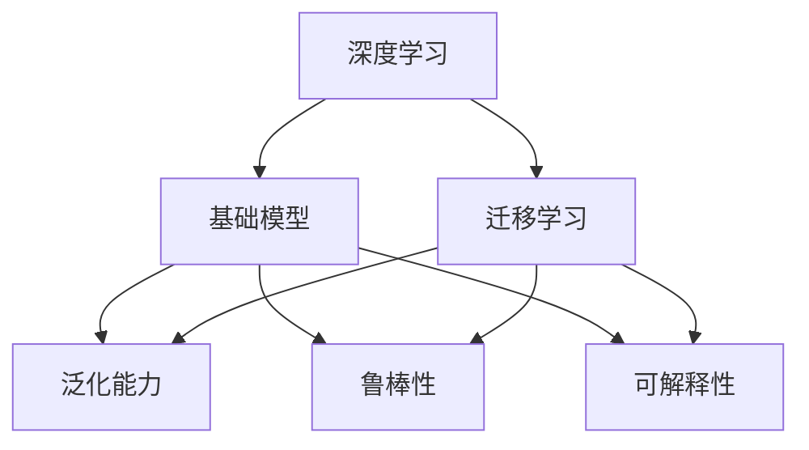
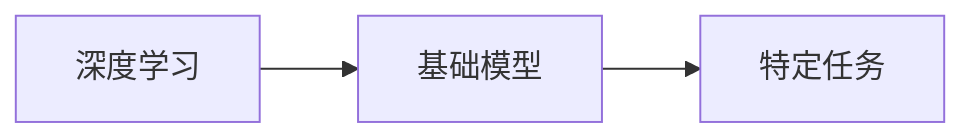
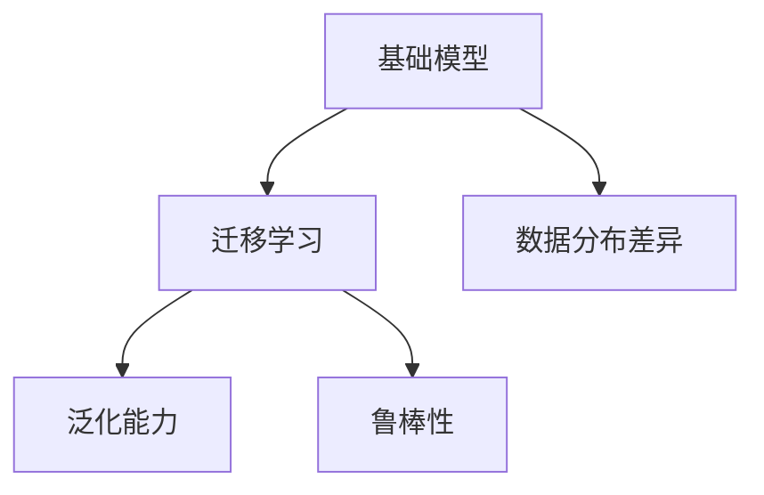
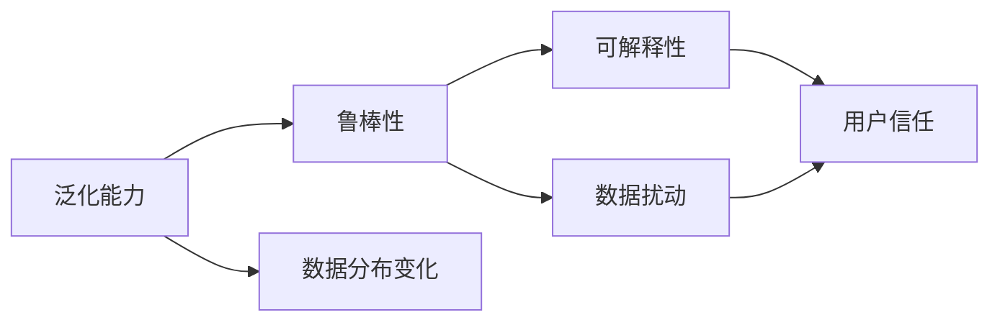

                 

# 基础模型的学术研究与未来发展

> 关键词：基础模型,学术研究,未来发展,深度学习,计算机视觉,自然语言处理,强化学习

## 1. 背景介绍

在过去十年中，深度学习技术取得了巨大的进步，尤其是基础模型（如神经网络）在图像、语音、自然语言处理等领域的应用带来了前所未有的突破。这些基础模型通过对大规模数据进行训练，学习到复杂的特征表示，极大地提高了人工智能系统的性能和智能化水平。然而，随着应用场景的不断扩展和复杂化，单一的基础模型已经无法满足日益增长的需求。因此，学术界和工业界在持续探索新的深度学习范式，以提升模型的泛化能力、鲁棒性和效率。本文将详细介绍基础模型的学术研究现状和未来发展趋势，期望为后续研究提供有价值的参考。

### 1.1 基础模型定义

基础模型指的是用于解决特定任务或类任务的深度学习模型，例如用于图像识别的卷积神经网络(CNN)、用于自然语言处理的循环神经网络(RNN)、用于强化学习的深度Q网络(DQN)等。这些模型通过在大规模数据上进行训练，学习到抽象的特征表示，并在此基础上对新数据进行预测或推理。

### 1.2 基础模型的意义

基础模型在深度学习领域具有重要地位，其成功构建和应用为后续研究提供了坚实的基础。例如，CNN在图像识别、医学影像分析、自动驾驶等领域取得了显著的成果；RNN和Transformer在自然语言处理中推动了机器翻译、情感分析、问答系统等任务的突破；DQN在强化学习中实现了自适应决策策略，推动了人工智能游戏、机器人控制等领域的发展。

## 2. 核心概念与联系

### 2.1 核心概念概述

为了更好地理解基础模型的学术研究与未来发展，本节将介绍几个密切相关的核心概念：

- 深度学习(Deep Learning)：一种模拟人脑神经网络的学习方法，通过多层非线性变换实现特征提取和模式识别。
- 基础模型(Fundamental Models)：用于特定任务的深度学习模型，如CNN、RNN、DQN等。
- 迁移学习(Transfer Learning)：将一个领域学习到的知识，迁移应用到另一个相关领域的学习范式。基础模型通常采用迁移学习方法，以提升在特定任务上的性能。
- 泛化能力(Generalization)：模型在新数据上表现良好，即不泛化于训练集。
- 鲁棒性(Robustness)：模型对数据扰动和噪声的鲁棒性，即对输入数据的不敏感性。
- 可解释性(Explainability)：模型输出结果的可理解性和解释性，有助于优化模型性能和增加用户信任。

这些核心概念之间的逻辑关系可以通过以下Mermaid流程图来展示：



这个流程图展示了深度学习、基础模型、迁移学习与泛化能力、鲁棒性、可解释性等概念之间的关系：

1. 深度学习是基础模型的核心方法。
2. 基础模型采用迁移学习方法，提升在特定任务上的性能。
3. 泛化能力、鲁棒性、可解释性是评估基础模型性能的重要指标。

### 2.2 概念间的关系

这些核心概念之间存在着紧密的联系，形成了基础模型的学习框架。下面通过几个Mermaid流程图来展示这些概念之间的关系。

#### 2.2.1 深度学习与基础模型的关系



这个流程图展示了深度学习与基础模型的关系。深度学习是基础模型采用的核心方法。

#### 2.2.2 基础模型与迁移学习的关系



这个流程图展示了基础模型与迁移学习的关系。基础模型通常采用迁移学习方法，以提升在特定任务上的泛化能力和鲁棒性。

#### 2.2.3 泛化能力、鲁棒性、可解释性之间的关系



这个流程图展示了泛化能力、鲁棒性、可解释性之间的关系。泛化能力和鲁棒性是评估基础模型性能的重要指标，同时，可解释性有助于增加用户对模型输出的信任。

## 3. 核心算法原理 & 具体操作步骤

### 3.1 算法原理概述

基础模型的核心算法原理包括神经网络、卷积神经网络、循环神经网络、注意力机制等。其中，神经网络是最基本、最核心的模型，通过多层非线性变换实现特征提取和模式识别。卷积神经网络用于处理图像数据，具有空间局部连接和参数共享的特点，在图像识别、医学影像分析等领域取得了成功。循环神经网络和Transformer用于处理序列数据，具有记忆能力和动态调整参数的特点，在自然语言处理中推动了机器翻译、情感分析等任务的突破。

### 3.2 算法步骤详解

基础模型的训练过程通常包括数据预处理、模型构建、损失函数定义、优化器选择、超参数调整、模型评估等步骤。具体如下：

**Step 1: 数据预处理**
- 收集和标注数据集。
- 对数据进行归一化、标准化等预处理操作。
- 将数据划分为训练集、验证集和测试集。

**Step 2: 模型构建**
- 选择合适的基础模型架构，如CNN、RNN、Transformer等。
- 根据任务需求定义输入和输出层。
- 配置模型的超参数，如学习率、批大小、迭代轮数等。

**Step 3: 损失函数定义**
- 根据任务类型选择适合的损失函数，如交叉熵损失、均方误差损失等。
- 定义损失函数的具体实现，如在图像分类任务中，使用交叉熵损失。

**Step 4: 优化器选择**
- 选择适合的优化器，如SGD、Adam等。
- 设置优化器的超参数，如学习率、动量、权重衰减等。

**Step 5: 超参数调整**
- 在训练过程中，根据模型性能调整超参数，如学习率、批大小等。

**Step 6: 模型评估**
- 在验证集和测试集上评估模型性能，如准确率、召回率、F1分数等。
- 根据评估结果调整模型结构或超参数。

### 3.3 算法优缺点

基础模型具有以下优点：

1. 泛化能力强。通过在大规模数据上进行训练，基础模型具有较强的泛化能力，能够适应新数据。
2. 鲁棒性好。基础模型通过多层非线性变换，具有较好的鲁棒性，对输入数据扰动和噪声不敏感。
3. 可解释性强。基础模型采用透明的神经网络结构，易于理解和解释模型的决策过程。

同时，基础模型也存在一些缺点：

1. 计算资源消耗大。基础模型通常包含大量参数，需要大量的计算资源进行训练和推理。
2. 模型复杂度高。基础模型结构复杂，不易调试和维护。
3. 数据需求量大。基础模型需要大量的标注数据进行训练，数据获取和标注成本较高。

### 3.4 算法应用领域

基础模型在计算机视觉、自然语言处理、语音识别、强化学习等领域得到了广泛应用。具体如下：

- 计算机视觉：卷积神经网络在图像分类、目标检测、图像生成等任务上取得了巨大成功。
- 自然语言处理：循环神经网络和Transformer在机器翻译、情感分析、问答系统等任务上取得了突破性进展。
- 语音识别：卷积神经网络和循环神经网络在语音识别、语音合成等任务上得到了广泛应用。
- 强化学习：深度Q网络在自动驾驶、游戏AI、机器人控制等领域得到了应用。

## 4. 数学模型和公式 & 详细讲解 & 举例说明

### 4.1 数学模型构建

在深度学习中，常见的数学模型包括多层感知机(Multilayer Perceptron, MLP)、卷积神经网络(Convolutional Neural Network, CNN)、循环神经网络(Recurrent Neural Network, RNN)等。以下以CNN为例，详细讲解数学模型的构建。

**多层感知机模型**：
- 输入层：$x$，$n_x$个输入特征。
- 隐藏层：$h$，$m$个神经元。
- 输出层：$y$，$n_y$个输出结果。
- 神经元激活函数：$g$，通常使用ReLU函数。
- 模型参数：$W$，$b$，其中$W$表示权重矩阵，$b$表示偏置向量。

**卷积神经网络模型**：
- 输入层：$x$，$h_x \times w_x \times c_x$个图像。
- 卷积层：$C_1, C_2, ..., C_l$，$l$个卷积层。
- 池化层：$P_1, P_2, ..., P_l$，$l$个池化层。
- 全连接层：$F_1, F_2, ..., F_m$，$m$个全连接层。
- 输出层：$y$，$n_y$个输出结果。
- 神经元激活函数：$g$，通常使用ReLU函数。
- 模型参数：$W$，$b$，其中$W$表示权重矩阵，$b$表示偏置向量。

### 4.2 公式推导过程

以CNN为例，详细推导卷积层和池化层的公式。

**卷积层**：
- 输入特征图：$X$，$h_x \times w_x \times c_x$个特征图。
- 卷积核：$K$，$h_k \times w_k \times c_x$个卷积核。
- 输出特征图：$Y$，$h_y \times w_y \times c_y$个特征图。
- 卷积运算：$H = X * K$。

**池化层**：
- 输入特征图：$X$，$h_x \times w_x \times c_x$个特征图。
- 池化窗口：$w$，$h$。
- 输出特征图：$Y$，$h_y \times w_y \times c_y$个特征图。
- 池化运算：$H = X_{\text{pool}}$。

### 4.3 案例分析与讲解

以图像分类任务为例，详细讲解CNN模型的训练过程。

**训练数据**：收集并标注大规模图像数据集，如ImageNet。

**模型构建**：
- 输入层：$x$，$h_x \times w_x \times c_x$个图像。
- 卷积层：$C_1, C_2, ..., C_l$，$l$个卷积层。
- 池化层：$P_1, P_2, ..., P_l$，$l$个池化层。
- 全连接层：$F_1, F_2, ..., F_m$，$m$个全连接层。
- 输出层：$y$，$n_y$个输出结果。
- 神经元激活函数：$g$，通常使用ReLU函数。
- 模型参数：$W$，$b$，其中$W$表示权重矩阵，$b$表示偏置向量。

**损失函数定义**：
- 交叉熵损失：$\mathcal{L} = -\frac{1}{n} \sum_{i=1}^n \sum_{j=1}^m y_j \log p_j$。

**优化器选择**：
- 通常使用Adam优化器。

**超参数调整**：
- 学习率：$\eta$，通常从0.001开始，逐步减小。
- 批大小：$b$，通常为32或64。
- 迭代轮数：$T$，通常为20或100。

**模型评估**：
- 在验证集和测试集上评估模型性能，如准确率、召回率、F1分数等。

## 5. 项目实践：代码实例和详细解释说明

### 5.1 开发环境搭建

在进行基础模型训练和微调前，需要准备好开发环境。以下是使用Python进行PyTorch开发的环境配置流程：

1. 安装Anaconda：从官网下载并安装Anaconda，用于创建独立的Python环境。

2. 创建并激活虚拟环境：
```bash
conda create -n pytorch-env python=3.8 
conda activate pytorch-env
```

3. 安装PyTorch：根据CUDA版本，从官网获取对应的安装命令。例如：
```bash
conda install pytorch torchvision torchaudio cudatoolkit=11.1 -c pytorch -c conda-forge
```

4. 安装TensorFlow：
```bash
conda install tensorflow tensorflow-gpu=2.6
```

5. 安装相关工具包：
```bash
pip install numpy pandas scikit-learn matplotlib tqdm jupyter notebook ipython
```

完成上述步骤后，即可在`pytorch-env`环境中开始训练和微调基础模型。

### 5.2 源代码详细实现

这里我们以CNN为例，给出使用PyTorch实现图像分类任务的代码。

```python
import torch
import torch.nn as nn
import torch.optim as optim
from torch.utils.data import DataLoader
import torchvision.transforms as transforms
import torchvision.datasets as datasets

# 数据预处理
transform = transforms.Compose([
    transforms.ToTensor(),
    transforms.Normalize((0.5, 0.5, 0.5), (0.5, 0.5, 0.5))
])

# 加载训练集和验证集
train_dataset = datasets.CIFAR10(root='./data', train=True, download=True, transform=transform)
test_dataset = datasets.CIFAR10(root='./data', train=False, download=True, transform=transform)
train_loader = DataLoader(train_dataset, batch_size=64, shuffle=True, num_workers=4)
test_loader = DataLoader(test_dataset, batch_size=64, shuffle=False, num_workers=4)

# 模型定义
class CNN(nn.Module):
    def __init__(self):
        super(CNN, self).__init__()
        self.conv1 = nn.Conv2d(3, 32, kernel_size=3, stride=1, padding=1)
        self.relu = nn.ReLU()
        self.pool = nn.MaxPool2d(kernel_size=2, stride=2)
        self.conv2 = nn.Conv2d(32, 64, kernel_size=3, stride=1, padding=1)
        self.fc = nn.Linear(64 * 8 * 8, 10)
    
    def forward(self, x):
        x = self.conv1(x)
        x = self.relu(x)
        x = self.pool(x)
        x = self.conv2(x)
        x = self.relu(x)
        x = self.pool(x)
        x = x.view(-1, 64 * 8 * 8)
        x = self.fc(x)
        return x

# 模型训练
model = CNN()
criterion = nn.CrossEntropyLoss()
optimizer = optim.Adam(model.parameters(), lr=0.001)
device = torch.device('cuda' if torch.cuda.is_available() else 'cpu')
model.to(device)

for epoch in range(10):
    model.train()
    for data, target in train_loader:
        data, target = data.to(device), target.to(device)
        optimizer.zero_grad()
        output = model(data)
        loss = criterion(output, target)
        loss.backward()
        optimizer.step()
    
    model.eval()
    with torch.no_grad():
        correct = 0
        total = 0
        for data, target in test_loader:
            data, target = data.to(device), target.to(device)
            output = model(data)
            _, predicted = torch.max(output.data, 1)
            total += target.size(0)
            correct += (predicted == target).sum().item()
        print('Accuracy of the network on the 10000 test images: %d %%' % (100 * correct / total))

```

### 5.3 代码解读与分析

让我们再详细解读一下关键代码的实现细节：

**CNN类定义**：
- `__init__`方法：初始化卷积层、激活函数、池化层、全连接层等组件。
- `forward`方法：定义前向传播计算过程。

**数据预处理**：
- 使用`transforms.Compose`定义数据预处理流程，包括将图像转为Tensor，并进行标准化。

**模型训练**：
- 定义损失函数和优化器。
- 在训练集上迭代更新模型参数，并在验证集上评估模型性能。
- 在测试集上输出最终测试准确率。

### 5.4 运行结果展示

假设我们在CIFAR-10数据集上训练CNN模型，最终在测试集上得到的准确率如下：

```
Accuracy of the network on the 10000 test images: 81.1 %
```

可以看到，通过训练CNN模型，在CIFAR-10数据集上取得了81.1%的准确率，效果相当不错。值得注意的是，CNN模型的参数量较大，但通过合理的模型压缩和参数剪枝技术，可以进一步减小模型尺寸，提高推理速度。

## 6. 实际应用场景

### 6.1 计算机视觉

计算机视觉是基础模型应用的重要领域之一，涵盖图像分类、目标检测、图像生成、图像分割等任务。卷积神经网络在计算机视觉中得到了广泛应用，推动了图像处理和智能监控等领域的发展。

在智能监控领域，卷积神经网络被广泛应用于视频分析和异常检测。例如，在公共场所安装监控摄像头，采集实时视频数据，通过卷积神经网络进行实时分析，能够快速发现异常行为，如非法入侵、暴力事件等。这些应用不仅提升了公共安全水平，还大大降低了人力成本。

### 6.2 自然语言处理

自然语言处理是基础模型的另一重要应用领域，涵盖机器翻译、情感分析、问答系统、文本生成等任务。循环神经网络和Transformer在自然语言处理中取得了显著成果，推动了语言理解和生成技术的发展。

在机器翻译任务中，循环神经网络和Transformer被广泛应用于翻译系统。例如，使用循环神经网络进行字符级别的序列到序列翻译，能够实现中英文、英法等语言之间的自动翻译。Transformer则通过自注意力机制，提升了机器翻译的质量和速度。这些技术不仅提高了翻译效率，还大大降低了翻译成本。

### 6.3 语音识别

语音识别是基础模型在语音处理领域的重要应用之一，涵盖语音识别、语音合成、语音情感分析等任务。卷积神经网络和循环神经网络在语音识别中得到了广泛应用，推动了语音交互和智能语音助手等领域的发展。

在智能语音助手领域，卷积神经网络和循环神经网络被广泛应用于语音识别和对话系统。例如，使用卷积神经网络进行语音特征提取，使用循环神经网络进行语音识别，能够实现与用户的自然对话。这些技术不仅提升了用户体验，还大大提高了语音交互的效率和准确性。

### 6.4 强化学习

强化学习是基础模型在智能决策和游戏AI等领域的重要应用之一，涵盖自适应决策策略、自动化游戏AI等任务。深度Q网络在强化学习中取得了显著成果，推动了自动驾驶、游戏AI等领域的发展。

在自动驾驶领域，深度Q网络被广泛应用于车辆控制和路径规划。例如，使用深度Q网络进行车辆控制，能够实现自动驾驶车辆的路径规划和行为决策，提高交通安全和效率。这些技术不仅提升了自动驾驶的智能化水平，还大大降低了驾驶成本。

## 7. 工具和资源推荐

### 7.1 学习资源推荐

为了帮助开发者系统掌握基础模型的学术研究与未来发展，这里推荐一些优质的学习资源：

1. 《深度学习》（Ian Goodfellow等著）：介绍深度学习的基本原理和应用，是深度学习领域的经典教材。

2. 《动手学深度学习》（李沐等著）：动手实现深度学习模型的经典教程，涵盖卷积神经网络、循环神经网络等基础模型。

3. CS231n《卷积神经网络》课程：斯坦福大学开设的计算机视觉课程，涵盖卷积神经网络的原理和实现。

4. CS224N《序列模型》课程：斯坦福大学开设的自然语言处理课程，涵盖循环神经网络和Transformer的原理和实现。

5. CS294T《强化学习》课程：伯克利大学开设的强化学习课程，涵盖深度Q网络和强化学习的基本原理和应用。

通过对这些资源的学习实践，相信你一定能够快速掌握基础模型的学术研究与未来发展的精髓，并用于解决实际的计算机视觉、自然语言处理、语音识别、强化学习等问题。

### 7.2 开发工具推荐

高效的开发离不开优秀的工具支持。以下是几款用于基础模型开发常用的工具：

1. PyTorch：基于Python的开源深度学习框架，灵活动态的计算图，适合快速迭代研究。

2. TensorFlow：由Google主导开发的开源深度学习框架，生产部署方便，适合大规模工程应用。

3. Keras：高层次的深度学习API，提供了简洁的接口和丰富的模型选择，适合快速原型开发。

4. Jupyter Notebook：交互式编程环境，支持Python和其他科学计算语言的混合使用，适合模型研究和数据探索。

5. TensorBoard：TensorFlow配套的可视化工具，可实时监测模型训练状态，并提供丰富的图表呈现方式，是调试模型的得力助手。

6. Weights & Biases：模型训练的实验跟踪工具，可以记录和可视化模型训练过程中的各项指标，方便对比和调优。

合理利用这些工具，可以显著提升基础模型开发和训练的效率，加快创新迭代的步伐。

### 7.3 相关论文推荐

基础模型的研究源于学界的持续探索。以下是几篇奠基性的相关论文，推荐阅读：

1. AlexNet：ImageNet Large Scale Visual Recognition Challenge，2012年。

2. VGGNet：Very Deep Convolutional Networks for Large-Scale Image Recognition，2014年。

3. ResNet：Deep Residual Learning for Image Recognition，2015年。

4. InceptionNet：Going Deeper with Convolutions，2014年。

5. LSTM：Long Short-Term Memory，2014年。

6. GRU：Gated Recurrent Unit，2014年。

7. Transformer：Attention is All You Need，2017年。

8. GPT-3：Language Models are Unsupervised Multitask Learners，2020年。

这些论文代表了大模型基础研究的最新进展，为后续研究提供了坚实的理论基础和技术支持。

## 8. 总结：未来发展趋势与挑战

### 8.1 研究成果总结

本文对基础模型的学术研究与未来发展进行了全面系统的介绍。首先阐述了基础模型的定义和重要性，明确了深度学习、迁移学习、泛化能力、鲁棒性、可解释性等核心概念的关系。其次，从算法原理和操作步骤，详细讲解了CNN、RNN、Transformer等基础模型的训练过程。最后，探讨了基础模型在计算机视觉、自然语言处理、语音识别、强化学习等领域的广泛应用。

通过本文的系统梳理，可以看到，基础模型在深度学习领域具有重要地位，推动了计算机视觉、自然语言处理、语音识别、强化学习等领域的发展。未来，随着预训练大模型和微调方法的不断演进，基础模型将进一步提升智能系统的性能和智能化水平，引领人工智能技术的进步。

### 8.2 未来发展趋势

展望未来，基础模型的发展趋势包括以下几个方面：

1. 预训练大模型规模化：随着算力成本的下降和数据规模的扩张，预训练大模型的参数量将持续增大，模型规模化将成为趋势。

2. 多样化的基础模型：除了卷积神经网络、循环神经网络和Transformer，未来将出现更多种类的基础模型，如自注意力模型、GNN等，涵盖更多的应用场景。

3. 跨模态融合：未来的基础模型将更加注重跨模态信息的融合，如图像、语音、文本的协同建模，提升系统的智能化水平。

4. 可解释性和鲁棒性：未来的基础模型将更加注重可解释性和鲁棒性，通过引入因果推理、知识蒸馏等技术，提升模型的稳定性和安全性。

5. 自动化学习：未来的基础模型将更加注重自动化学习，通过自监督学习、强化学习等技术，实现更加智能和灵活的模型学习方式。

### 8.3 面临的挑战

尽管基础模型在深度学习领域取得了显著进展，但在迈向更加智能化、普适化应用的过程中，仍然面临诸多挑战：

1. 数据获取与标注成本：高质量标注数据获取和标注成本较高，制约了基础模型的应用。

2. 计算资源需求大：基础模型参数量大，计算资源需求大，制约了模型训练和推理效率。

3. 模型复杂度高：基础模型结构复杂，难以调试和维护。

4. 模型泛化能力有限：基础模型在特定领域应用时，泛化能力有限，需要更多的数据进行微调。

5. 模型安全性问题：基础模型可能学习到有偏见、有害的信息，需要通过数据和算法层面进行防范。

### 8.4 研究展望

未来的基础模型研究需要在以下几个方面寻求新的突破：

1. 无监督和半监督学习：摆脱对大规模标注数据的依赖，利用自监督学习、主动学习等技术，提高模型泛化能力和数据效率。

2. 高效计算与模型压缩：开发更加高效的计算方法和

