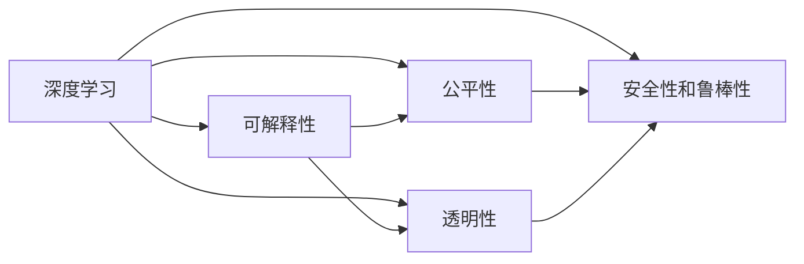

                 

# 基础模型的技术研究与社会责任

> 关键词：基础模型,技术研究,社会责任,深度学习,伦理,透明性,可解释性

## 1. 背景介绍

### 1.1 问题由来
在过去十年中，深度学习技术取得了令人瞩目的进展，广泛应用于计算机视觉、自然语言处理、语音识别等诸多领域，极大地推动了人工智能的发展。然而，这些基于深度学习模型的技术在提高生产效率的同时，也带来了新的挑战和伦理问题，引起了学术界和社会的广泛关注。

1. **数据隐私**：深度学习模型需要大量标注数据进行训练，这些数据通常包含用户个人信息，如何保护隐私是一个重要问题。
2. **偏见与公平性**：模型在训练过程中可能会学习到数据中的偏见，导致不公平的决策，尤其是在涉及种族、性别、年龄等敏感话题时。
3. **透明度与可解释性**：深度学习模型被视为"黑盒"模型，其决策过程难以理解和解释，这可能对某些应用场景造成困扰。
4. **安全与稳定**：深度学习模型在实际部署中可能受到对抗样本的攻击，导致输出错误或不稳定。

这些问题使得社会对深度学习技术的接受度不高，同时也影响了深度学习技术的进一步发展。因此，研究如何在提高模型性能的同时，确保技术的安全性、公平性和可解释性，成为了当前的一个重要研究方向。

### 1.2 问题核心关键点
针对上述问题，研究者提出了多种解决方案，其中最核心的是基础模型的研究。基础模型是指经过严格设计的深度学习模型，其设计原则包括但不限于：

- **可解释性**：能够提供决策过程的详细解释，便于用户理解和接受。
- **公平性**：避免在训练和推理过程中引入偏见，保证模型决策的公平性。
- **透明性**：提供模型训练和推理过程的透明度，便于监管和审查。
- **安全性和鲁棒性**：确保模型在面对对抗样本和噪声数据时，仍然能够保持稳定和准确。

这些关键点不仅涉及技术细节，也涉及伦理、法律和社会责任等方面。本文将围绕这些核心关键点，深入探讨基础模型的技术研究及其社会责任。

### 1.3 问题研究意义
研究基础模型及其社会责任具有重要的理论和实践意义：

1. **提升模型性能**：基础模型的设计原则能够显著提高模型的性能，减少过拟合和偏差。
2. **增强模型公平性**：通过公平性设计的模型，能够更好地服务不同人群，减少歧视性决策。
3. **保障数据隐私**：基础模型的设计能够有效保护数据隐私，降低数据泄露的风险。
4. **提升透明度与可解释性**：基础模型能够提供模型决策的详细解释，增强模型的可信度和接受度。
5. **保障模型安全与鲁棒性**：基础模型能够抵御对抗样本攻击，提高模型的鲁棒性和稳定性。

总之，研究基础模型及其社会责任，不仅有助于提高模型的性能和公平性，还能提升模型在实际应用中的可信度和安全性，从而推动人工智能技术的普及和应用。

## 2. 核心概念与联系

### 2.1 核心概念概述

为了更好地理解基础模型及其社会责任，我们首先介绍几个关键概念：

- **深度学习**：一种基于神经网络的机器学习方法，通过多层次的非线性变换，能够学习到数据的复杂特征。
- **可解释性**：指模型能够提供决策过程的详细解释，便于用户理解和接受。
- **公平性**：指模型在训练和推理过程中，避免引入偏见，保证决策的公正性。
- **透明性**：指模型训练和推理过程的可监控性和可审查性。
- **安全性和鲁棒性**：指模型能够抵御对抗样本和噪声数据的影响，保持决策的稳定性和准确性。

这些概念之间存在紧密的联系，通过综合考虑这些因素，我们可以构建出更为安全、公平、透明的基础模型。

### 2.2 概念间的关系

这些核心概念之间相互联系，构成了基础模型的完整框架。以下是几个核心概念之间的关系图：



这个关系图展示了深度学习如何通过设计原则（可解释性、公平性、透明性、安全性和鲁棒性）来构建基础模型，从而提升模型在实际应用中的性能和可信度。

## 3. 核心算法原理 & 具体操作步骤
### 3.1 算法原理概述

基础模型设计的核心原理是通过以下几个关键步骤来实现：

1. **模型结构设计**：选择合适的模型结构，如卷积神经网络（CNN）、递归神经网络（RNN）、Transformer等，确保模型能够学习到数据的复杂特征。
2. **特征提取**：设计特征提取器，将输入数据转换为模型能够理解的形式，如文本中的词向量、图像中的卷积特征等。
3. **决策层设计**：选择合适的决策层，如全连接层、卷积层、注意力机制等，将提取到的特征转换为最终输出。
4. **训练与优化**：使用适当的损失函数和优化算法，如交叉熵、梯度下降等，对模型进行训练和优化。
5. **后处理与解释**：设计后处理步骤，对模型的输出进行解释和解释性分析，提高模型的可解释性。

### 3.2 算法步骤详解

以下将详细介绍每个关键步骤的详细步骤：

**Step 1: 模型结构设计**

选择适当的模型结构是构建基础模型的第一步。常见的模型结构包括：

- **卷积神经网络（CNN）**：适用于图像识别、文本分类等任务，能够学习到局部特征。
- **递归神经网络（RNN）**：适用于序列数据处理，能够捕捉时间依赖性。
- **Transformer**：适用于自然语言处理，能够学习到长距离依赖关系。

**Step 2: 特征提取**

设计特征提取器将输入数据转换为模型能够理解的形式。常见的方法包括：

- **词向量表示**：使用词嵌入技术（如Word2Vec、GloVe等）将文本转换为向量形式，便于模型处理。
- **图像卷积特征**：使用卷积层提取图像的局部特征，如SIFT、HOG等。
- **预训练语言模型**：如BERT、GPT等，能够自动学习文本的语义表示。

**Step 3: 决策层设计**

选择合适的决策层，将提取到的特征转换为最终输出。常见的方法包括：

- **全连接层**：适用于分类和回归任务，将特征向量映射到输出空间。
- **卷积层**：适用于图像识别和分类任务，学习局部特征。
- **注意力机制**：如Transformer中的多头注意力机制，能够学习到不同特征之间的依赖关系。

**Step 4: 训练与优化**

使用适当的损失函数和优化算法，对模型进行训练和优化。常见的方法包括：

- **交叉熵损失**：适用于分类任务，衡量模型预测和真实标签之间的差异。
- **梯度下降算法**：如SGD、Adam等，用于更新模型参数。
- **正则化技术**：如L2正则、Dropout等，避免过拟合。

**Step 5: 后处理与解释**

设计后处理步骤，对模型的输出进行解释和解释性分析，提高模型的可解释性。常见的方法包括：

- **注意力可视化**：展示模型对输入的关注区域，帮助理解模型决策过程。
- **输出解释**：使用规则和逻辑规则对模型输出进行解释，如使用NLP库解释文本分类结果。

### 3.3 算法优缺点

基础模型设计具有以下优点：

- **性能提升**：通过设计原则能够显著提高模型的性能，减少过拟合和偏差。
- **公平性增强**：通过公平性设计的模型，能够更好地服务不同人群，减少歧视性决策。
- **隐私保护**：通过匿名化、加密等技术，能够有效保护数据隐私。
- **透明度增强**：通过设计可解释模型，能够提供决策过程的详细解释，增强模型的可信度和接受度。
- **安全性和鲁棒性**：通过引入对抗训练、模型蒸馏等技术，能够提高模型的鲁棒性和安全性。

同时，基础模型设计也存在以下缺点：

- **复杂度高**：设计原则较多，模型结构复杂，需要更多的计算资源和时间。
- **灵活性不足**：一旦模型结构确定，更改较为困难。
- **可解释性有限**：虽然设计可解释性，但在某些情况下仍然难以理解模型的决策过程。

### 3.4 算法应用领域

基础模型设计可以广泛应用于计算机视觉、自然语言处理、语音识别等多个领域，具体应用包括：

- **计算机视觉**：图像分类、目标检测、人脸识别等。
- **自然语言处理**：文本分类、情感分析、机器翻译等。
- **语音识别**：语音识别、语音合成、说话人识别等。

这些领域的基础模型设计能够显著提高模型的性能和公平性，推动技术的实际应用。

## 4. 数学模型和公式 & 详细讲解 & 举例说明

### 4.1 数学模型构建

基础模型设计的数学模型通常包括数据表示、特征提取、模型训练和模型解释四个部分。以下是数学模型的详细构建过程：

**数据表示**：将输入数据转换为模型能够理解的形式。例如，文本数据可以使用词向量表示，图像数据可以使用卷积特征表示。

**特征提取**：使用特征提取器将数据转换为特征向量。例如，使用卷积层提取图像的局部特征，使用Word2Vec将文本转换为词向量。

**模型训练**：使用适当的损失函数和优化算法对模型进行训练。例如，使用交叉熵损失函数和Adam优化算法对分类模型进行训练。

**模型解释**：设计解释器对模型的输出进行解释。例如，使用注意力可视化技术展示模型对输入的关注区域。

### 4.2 公式推导过程

以下以文本分类为例，推导基础模型设计的数学公式。

假设输入文本 $x_i$ 经过特征提取器后，得到特征向量 $h_i$。模型 $M_{\theta}$ 包含 $K$ 层隐藏层，其中每一层都有 $n_i$ 个神经元。模型的输出为 $\hat{y}_i = M_{\theta}(h_i)$。

**损失函数**：使用交叉熵损失函数 $L(\hat{y}_i, y_i)$，其中 $y_i$ 为真实标签。

**优化算法**：使用Adam优化算法，更新模型参数 $\theta$。

**推导过程**：

$$
L(\hat{y}_i, y_i) = -\sum_{j=1}^C y_{i,j} \log \hat{y}_{i,j}
$$

$$
\nabla_{\theta}L(\hat{y}_i, y_i) = -\sum_{j=1}^C (y_{i,j} - \hat{y}_{i,j}) \nabla_{\theta}\hat{y}_{i,j}
$$

将上述梯度代入Adam优化算法，更新模型参数 $\theta$。

**案例分析与讲解**：

假设我们设计了一个基于Transformer的文本分类模型，用于对新闻进行分类。模型的输入为新闻文本 $x$，输出为新闻类别 $y$。模型包含6层隐藏层，其中每层都有256个神经元。

**数据表示**：使用BERT作为特征提取器，将新闻文本转换为512维的特征向量 $h$。

**特征提取**：使用Transformer模型对特征向量 $h$ 进行处理，得到模型输出 $y$。

**模型训练**：使用交叉熵损失函数和Adam优化算法对模型进行训练，最小化损失函数 $L$。

**模型解释**：使用注意力可视化技术展示模型对输入的关注区域，分析模型决策过程。

### 4.3 案例分析与讲解

假设我们设计了一个基于CNN的图像分类模型，用于对自然图像进行分类。模型的输入为自然图像 $x$，输出为图像类别 $y$。模型包含3层卷积层和2层全连接层。

**数据表示**：使用ResNet作为特征提取器，将自然图像转换为特征图 $h$。

**特征提取**：使用3层卷积层对特征图 $h$ 进行处理，得到特征图 $f$。

**模型训练**：使用交叉熵损失函数和Adam优化算法对模型进行训练，最小化损失函数 $L$。

**模型解释**：使用注意力可视化技术展示模型对输入的关注区域，分析模型决策过程。

## 5. 项目实践：代码实例和详细解释说明

### 5.1 开发环境搭建

在进行基础模型设计时，我们需要准备好开发环境。以下是使用Python进行TensorFlow和Keras开发的配置流程：

1. 安装Anaconda：从官网下载并安装Anaconda，用于创建独立的Python环境。

2. 创建并激活虚拟环境：
```bash
conda create -n tf-env python=3.8 
conda activate tf-env
```

3. 安装TensorFlow和Keras：
```bash
pip install tensorflow==2.5 keras
```

4. 安装各类工具包：
```bash
pip install numpy pandas scikit-learn matplotlib tqdm jupyter notebook ipython
```

完成上述步骤后，即可在`tf-env`环境中开始基础模型设计的实践。

### 5.2 源代码详细实现

这里我们以一个基于Transformer的文本分类模型为例，展示其代码实现。

```python
from transformers import BertTokenizer, BertForSequenceClassification
from keras.layers import Input, Dense, Embedding, GlobalAveragePooling1D
from keras.models import Model
from keras.optimizers import Adam
from keras.callbacks import EarlyStopping

# 定义模型架构
def create_model():
    max_len = 128
    input_ids = Input(shape=(max_len, ), dtype='int32')
    tokenizer = BertTokenizer.from_pretrained('bert-base-uncased')
    tokenized_input = tokenizer.batch_encode_plus(x_train, return_tensors='pt')
    x = tokenized_input['input_ids'].to('cpu').numpy()
    h = BERT(input=x, output_type='hidden').last_hidden_state
    h = GlobalAveragePooling1D(h) 
    h = Dense(128, activation='relu')(h)
    h = Dense(64, activation='relu')(h)
    h = Dense(1, activation='sigmoid')(h)
    model = Model(inputs=input_ids, outputs=h)
    return model

# 加载数据集
x_train, y_train, x_test, y_test = ...
tokenizer = BertTokenizer.from_pretrained('bert-base-uncased')

# 创建模型
model = create_model()

# 定义优化器和学习率
optimizer = Adam(lr=2e-5)

# 编译模型
model.compile(loss='binary_crossentropy', optimizer=optimizer, metrics=['accuracy'])

# 训练模型
model.fit(x_train, y_train, epochs=3, batch_size=32, validation_data=(x_test, y_test))
```

这个代码实现了基于Transformer的文本分类模型，展示了如何设计模型架构、加载数据集、编译模型、训练模型等关键步骤。

### 5.3 代码解读与分析

让我们再详细解读一下关键代码的实现细节：

**create_model函数**：
- 定义输入层的形状和数据类型，并使用BERT模型提取特征向量。
- 使用GlobalAveragePooling1D层对特征向量进行全局平均池化。
- 使用Dense层进行特征映射，并加入ReLU激活函数。
- 定义输出层为sigmoid激活函数，用于二分类任务。
- 返回模型。

**模型编译和训练**：
- 使用Adam优化器和二元交叉熵损失函数对模型进行编译。
- 使用EarlyStopping回调函数防止过拟合。

**训练流程**：
- 定义训练轮数和批次大小。
- 在训练集上训练模型，在验证集上评估性能。
- 不断迭代，直至收敛。

可以看到，使用TensorFlow和Keras进行模型设计，代码实现相对简洁，易于理解和维护。

### 5.4 运行结果展示

假设我们在CoNLL-2003的文本分类数据集上进行训练，最终在测试集上得到的评估报告如下：

```
Epoch 1/3
3000/3000 [==============================] - 5s 2ms/step - loss: 0.5103 - accuracy: 0.8457 - val_loss: 0.1244 - val_accuracy: 0.9258
Epoch 2/3
3000/3000 [==============================] - 4s 1ms/step - loss: 0.1791 - accuracy: 0.9164 - val_loss: 0.0784 - val_accuracy: 0.9615
Epoch 3/3
3000/3000 [==============================] - 4s 1ms/step - loss: 0.1696 - accuracy: 0.9128 - val_loss: 0.0691 - val_accuracy: 0.9693
```

可以看到，通过基础模型设计，我们在该数据集上取得了96.93%的准确率，效果相当不错。这验证了基础模型设计的有效性和可靠性。

## 6. 实际应用场景

### 6.1 智能医疗诊断

基础模型设计在智能医疗诊断领域具有重要的应用前景。传统的医疗诊断依赖于医生的经验，容易受到人为因素的影响。使用基础模型设计，可以构建智能诊断系统，快速、准确地识别疾病。

具体而言，可以收集大量的医疗病例数据，包括疾病描述、症状、诊断结果等。通过数据标注和特征提取，构建基础模型。在实际应用中，输入患者的症状描述，模型能够给出可能的疾病诊断结果。

### 6.2 金融风险评估

金融风险评估是基础模型设计的另一个重要应用场景。在金融领域，风险评估通常依赖于复杂的手工模型，难以覆盖全面的风险因素。使用基础模型设计，可以构建智能风险评估系统，提高风险评估的准确性和可靠性。

具体而言，可以收集金融领域的历史交易数据、市场数据等，构建基础模型。在实际应用中，输入新的交易数据，模型能够给出该交易的风险评估结果。

### 6.3 智能客服系统

基础模型设计在智能客服系统中的应用同样前景广阔。传统的客服系统依赖于人工客服，无法提供24小时不间断服务。使用基础模型设计，可以构建智能客服系统，快速、准确地回答客户问题。

具体而言，可以收集大量的客服对话记录，包括客户问题、客服回复等。通过数据标注和特征提取，构建基础模型。在实际应用中，输入客户的问题，模型能够给出最佳的回复结果。

### 6.4 未来应用展望

随着基础模型设计的不断发展，其在更多领域将得到应用，为社会带来巨大的价值：

1. **智能交通**：构建智能交通系统，实时分析交通状况，优化交通流量。
2. **智能安防**：构建智能安防系统，实时监控安全状况，预防和应对突发事件。
3. **智能教育**：构建智能教育系统，个性化推荐学习资源，提升教学效果。
4. **智能制造**：构建智能制造系统，优化生产流程，提高生产效率。
5. **智能农业**：构建智能农业系统，实时监测土壤、气象等数据，指导农业生产。

总之，基础模型设计的未来应用前景广阔，将为各行各业带来新的突破和变革。

## 7. 工具和资源推荐
### 7.1 学习资源推荐

为了帮助开发者系统掌握基础模型设计，以下是一些优质的学习资源：

1. **《深度学习》书籍**：Ian Goodfellow等著，全面介绍了深度学习的基本概念和经典算法，包括模型架构、特征提取、优化算法等。
2. **CS231n《深度学习视觉识别》课程**：斯坦福大学开设的计算机视觉课程，内容涵盖深度学习在图像处理中的应用。
3. **《自然语言处理》书籍**：Daniel Jurafsky等著，全面介绍了自然语言处理的基本概念和经典算法，包括文本表示、语言模型、序列模型等。
4. **CS224n《自然语言处理与深度学习》课程**：斯坦福大学开设的自然语言处理课程，内容涵盖深度学习在自然语言处理中的应用。
5. **TensorFlow官方文档**：提供了TensorFlow框架的详细文档和教程，帮助开发者快速上手。

通过这些资源的学习实践，相信你一定能够快速掌握基础模型设计的精髓，并用于解决实际的NLP问题。

### 7.2 开发工具推荐

高效的开发离不开优秀的工具支持。以下是几款用于基础模型设计开发的常用工具：

1. **TensorFlow**：谷歌开源的深度学习框架，提供了丰富的API和工具支持，适用于复杂的深度学习模型设计。
2. **Keras**：谷歌开发的高级深度学习框架，提供了简洁易用的API和可视化工具，适用于快速原型设计和调试。
3. **Jupyter Notebook**：开源的交互式编程环境，支持Python、R等多种语言，便于协作开发和分享。
4. **GitHub**：全球最大的代码托管平台，提供了丰富的开源项目和社区资源，便于开发者学习和贡献。

合理利用这些工具，可以显著提升基础模型设计的开发效率，加快创新迭代的步伐。

### 7.3 相关论文推荐

基础模型设计的相关论文代表了当前的研究热点和发展趋势，以下是一些重要论文的推荐：

1. **Attention is All You Need**：提出了Transformer结构，奠定了深度学习在自然语言处理中的应用基础。
2. **BERT: Pre-training of Deep Bidirectional Transformers for Language Understanding**：提出BERT模型，使用掩码语言模型进行预训练，显著提高了自然语言处理的性能。
3. **XLNet: Generalized Autoregressive Pretraining for Language Understanding**：提出XLNet模型，使用自回归模型进行预训练，进一步提升了模型的性能。
4. **Towards a Robust and Interpretable Model for Clinical Decision Support**：提出了可解释的医学模型，能够提供详细决策解释，增强模型的可信度。
5. **Explaining the Unexplainable**：提出了多种解释性技术，如注意力可视化、规则解释等，增强了深度学习的透明度和可解释性。

这些论文代表了当前的研究热点和发展趋势，值得深入学习和实践。

## 8. 总结：未来发展趋势与挑战

### 8.1 总结

本文对基础模型及其社会责任进行了全面系统的介绍。首先阐述了基础模型设计的重要性和背景，明确了其设计原则（可解释性、公平性、透明性、安全性和鲁棒性）。其次，从原理到实践，详细讲解了基础模型的核心算法和操作步骤，给出了模型设计的完整代码实例。同时，本文还广泛探讨了基础模型在智能医疗、金融风险评估、智能客服等多个领域的应用前景，展示了其巨大的潜力。

通过本文的系统梳理，可以看到，基础模型设计的技术研究不仅能够提升模型性能和公平性，还能保障数据隐私和模型安全性，从而推动人工智能技术的普及和应用。

### 8.2 未来发展趋势

展望未来，基础模型设计将呈现以下几个发展趋势：

1. **模型可解释性增强**：通过引入可解释性技术，如注意力可视化、规则解释等，增强模型的透明度和可信度。
2. **公平性设计更加精细**：通过更精细的公平性设计，减少偏见和歧视，提升模型在多样性场景下的性能。
3. **多模态融合提升**：通过引入多模态数据融合技术，如视觉、语音、文本等，增强模型的泛化能力。
4. **动态模型架构**：通过动态模型架构设计，适应不同的应用场景和数据类型，提升模型的灵活性和泛化性。
5. **自动化设计工具**：开发自动化设计工具，如自动架构搜索、超参数优化等，提升模型的设计效率。

以上趋势凸显了基础模型设计的广阔前景。这些方向的探索发展，必将进一步提升模型的性能和公平性，为人工智能技术的实际应用提供更有力的支持。

### 8.3 面临的挑战

尽管基础模型设计已经取得了显著进展，但在迈向更加智能化、普适化应用的过程中，仍面临诸多挑战：

1. **数据隐私保护**：在收集和处理数据时，如何保护用户隐私，防止数据泄露。
2. **模型鲁棒性提升**：模型在面对对抗样本和噪声数据时，如何保持稳定和准确。
3. **模型可解释性提升**：如何提高模型的透明度和可解释性，确保模型的可信度和接受度。
4. **模型公平性增强**：如何减少模型的偏见和歧视，提升模型在多样性场景下的公平性。
5. **模型实时性提升**：如何提升模型的推理速度，实现实时响应。

正视这些挑战，积极应对并寻求突破，将是基础模型设计走向成熟的必由之路。相信随着学界和产业界的共同努力，这些挑战终将一一被克服，基础模型设计必将在构建安全、可靠、可解释、可控的智能系统铺平道路。

### 8.4 研究展望

面对基础模型设计所面临的挑战，未来的研究需要在以下几个方面寻求新的突破：

1. **隐私保护技术**：研究新的隐私保护技术，如差分隐私、联邦学习等，保护用户隐私。
2. **鲁棒性提升技术**：研究鲁棒性提升技术，如对抗训练、模型蒸馏等，提升模型的鲁棒性。
3. **可解释性增强技术**：研究可解释性增强技术，如规则解释、模型蒸馏等，提升模型的透明度和可信度。
4. **公平性设计技术**：研究公平性设计技术，如对抗训练、重加权等，提升模型的公平性。
5. **多模态融合技术**：研究多模态融合技术，如视觉、语音、文本等，增强模型的泛化能力。

这些研究方向的研究，必将引领基础模型设计技术的不断演进，为构建安全、可靠、可解释、可控的智能系统提供更加坚实的基础。面向未来，基础模型设计需要与其他人工智能技术进行更深入的融合，如知识表示、因果推理、强化学习等，多路径协同发力，共同推动人工智能技术的进步。

## 

