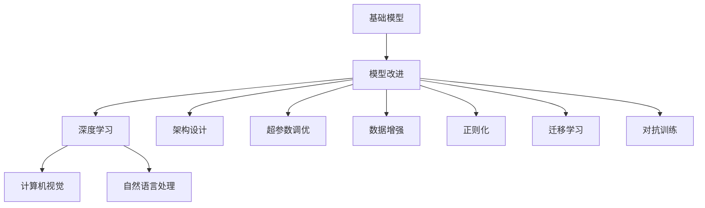

                 

# 基础模型的改进与影响力

> 关键词：基础模型, 模型改进, 影响力, 深度学习, 计算机视觉, 自然语言处理

## 1. 背景介绍

### 1.1 问题由来

在深度学习迅猛发展的今天，基础模型（Baseline Models）已经成为了各个领域的研究基石，为各个任务的性能提升提供了重要支持。例如，在计算机视觉领域，VGG、ResNet、Inception等经典模型构成了图像识别和分类任务的基础；在自然语言处理（NLP）领域，BERT、GPT、RoBERTa等预训练语言模型成为文本生成、分类、问答等任务的基础。这些基础模型以稳健的架构和强大的泛化能力，为后续的模型改进和应用提供了重要支撑。

然而，随着模型复杂度的提升和任务多样性的增加，单纯依赖基础模型已经难以满足日益增长的需求。因此，如何改进和优化基础模型，使其能够在新的应用场景中发挥更大的作用，成为当前研究的重要课题。

### 1.2 问题核心关键点

基础模型的改进方法主要包括以下几个方面：

1. **架构设计**：优化基础模型的层次结构、模块设计，使其在特定任务中表现更佳。例如，在计算机视觉领域，通过增加或减少卷积层、池化层，优化特征提取结构；在NLP领域，通过引入Transformer等新型架构，提升模型的注意力机制和序列建模能力。

2. **超参数调优**：通过调整学习率、批量大小、优化器等超参数，找到最优的模型训练策略。超参数的合理选择可以显著提升模型的训练速度和收敛效果。

3. **数据增强**：通过数据增强技术（如随机裁剪、翻转、旋转等），扩充训练数据的多样性，提升模型的泛化能力。数据增强技术能够使模型更好地应对不同形式的输入，从而提高其在实际应用中的鲁棒性。

4. **正则化**：通过L2正则、Dropout等正则化技术，防止模型过拟合。正则化技术能够使模型更好地适应训练数据，并提高其在未见过的数据上的表现。

5. **迁移学习**：利用预训练模型的知识，通过微调或特征适配等方法，将其应用到新的任务中。迁移学习能够使模型在有限的标注数据上获得更好的性能。

6. **对抗训练**：通过引入对抗样本，提升模型的鲁棒性。对抗训练能够使模型在面对噪声、干扰等情况下仍能保持稳定性能。

### 1.3 问题研究意义

基础模型改进的研究具有重要意义：

1. **提升模型性能**：改进后的模型通常能够获得更好的训练效果和性能表现，更好地适应特定的任务需求。
2. **降低开发成本**：通过优化基础模型，可以减少开发新模型的时间和成本，提高研发效率。
3. **加速应用落地**：改进后的模型更易于部署和集成，能够更快地应用于实际生产环境中。
4. **推动技术创新**：基础模型的改进往往伴随着新的架构设计、优化方法和理论创新，能够推动深度学习技术的不断发展。
5. **增强应用价值**：改进后的模型能够更好地服务于各个领域，提升应用的价值和用户体验。

## 2. 核心概念与联系

### 2.1 核心概念概述

为了更好地理解基础模型改进的方法和意义，本节将介绍几个核心概念：

1. **基础模型**：以自回归（如GPT）或自编码（如BERT）模型为代表的基础模型，通过在大规模无标签文本语料上进行预训练，学习通用的语言表示，具备强大的语言理解和生成能力。

2. **模型改进**：指在基础模型的基础上，通过架构设计、超参数调优、数据增强、正则化、迁移学习、对抗训练等方法，进一步提升模型的性能。

3. **深度学习**：一种基于神经网络的学习范式，通过多层次的特征提取和表示学习，实现对复杂数据和任务的建模。

4. **计算机视觉**：通过计算机算法使计算机具有类似于人类视觉系统的能力，能够从图像中提取有用的信息，进行图像识别、分类、检测等任务。

5. **自然语言处理**：使计算机能够理解、处理和生成人类语言，实现文本分类、问答、机器翻译等任务。

这些核心概念之间存在着紧密的联系，形成了深度学习和基础模型改进的完整生态系统。通过理解这些核心概念，我们可以更好地把握基础模型改进的基本原理和优化方向。

### 2.2 概念间的关系

这些核心概念之间的关系可以通过以下Mermaid流程图来展示：



这个流程图展示了基础模型改进的核心概念及其之间的关系：

1. 基础模型通过深度学习架构设计获得强大的特征提取能力。
2. 模型改进通过架构设计、超参数调优、数据增强、正则化、迁移学习、对抗训练等方法，进一步提升模型性能。
3. 计算机视觉和自然语言处理是基础模型的主要应用领域。

这些概念共同构成了深度学习和基础模型改进的研究框架，使得模型能够在各个领域中发挥更大的作用。通过理解这些核心概念，我们可以更好地进行模型设计和优化，提升其在实际应用中的表现。

## 3. 核心算法原理 & 具体操作步骤
### 3.1 算法原理概述

基础模型改进的基本原理是通过优化模型架构、调整超参数、增强数据多样性、引入正则化技术、应用迁移学习等方法，进一步提升模型在特定任务中的性能。其核心思想是：

1. **模型设计**：通过优化基础模型的架构设计，提升其在特定任务中的表现。例如，在计算机视觉领域，通过增加或减少卷积层、池化层，优化特征提取结构；在NLP领域，通过引入Transformer等新型架构，提升模型的注意力机制和序列建模能力。

2. **超参数调优**：通过调整学习率、批量大小、优化器等超参数，找到最优的模型训练策略。超参数的合理选择可以显著提升模型的训练速度和收敛效果。

3. **数据增强**：通过数据增强技术（如随机裁剪、翻转、旋转等），扩充训练数据的多样性，提升模型的泛化能力。数据增强技术能够使模型更好地应对不同形式的输入，从而提高其在实际应用中的鲁棒性。

4. **正则化**：通过L2正则、Dropout等正则化技术，防止模型过拟合。正则化技术能够使模型更好地适应训练数据，并提高其在未见过的数据上的表现。

5. **迁移学习**：利用预训练模型的知识，通过微调或特征适配等方法，将其应用到新的任务中。迁移学习能够使模型在有限的标注数据上获得更好的性能。

6. **对抗训练**：通过引入对抗样本，提升模型的鲁棒性。对抗训练能够使模型在面对噪声、干扰等情况下仍能保持稳定性能。

### 3.2 算法步骤详解

以下是基础模型改进的一般步骤：

**Step 1: 准备基础模型和数据集**
- 选择合适的预训练模型，如VGG、ResNet、BERT等。
- 准备目标任务的标注数据集，划分训练集、验证集和测试集。

**Step 2: 设计改进方案**
- 根据任务特点，设计优化架构，如增加卷积层、池化层，引入Transformer等。
- 调整超参数，如学习率、批量大小、优化器等。
- 选择合适的正则化技术，如L2正则、Dropout等。

**Step 3: 执行模型改进**
- 在训练集上进行梯度下降等优化算法，调整模型参数。
- 应用数据增强技术，扩充训练集。
- 应用迁移学习，利用预训练模型的知识进行微调。
- 应用对抗训练，提升模型的鲁棒性。

**Step 4: 测试和评估**
- 在验证集上评估模型性能，调整改进方案。
- 在测试集上评估最终模型性能，对比改进前后的效果。
- 将改进后的模型应用于实际生产环境中。

以上是基础模型改进的一般步骤。在实际应用中，还需要针对具体任务的特点，对改进过程的各个环节进行优化设计，如改进目标函数的设定、正则化技术的组合使用、迁移学习方法的进一步探索等，以进一步提升模型性能。

### 3.3 算法优缺点

基础模型改进的优点包括：

1. **提升模型性能**：改进后的模型通常能够获得更好的训练效果和性能表现，更好地适应特定的任务需求。
2. **降低开发成本**：通过优化基础模型，可以减少开发新模型的时间和成本，提高研发效率。
3. **加速应用落地**：改进后的模型更易于部署和集成，能够更快地应用于实际生产环境中。
4. **推动技术创新**：基础模型的改进往往伴随着新的架构设计、优化方法和理论创新，能够推动深度学习技术的不断发展。

同时，这些改进方法也存在一定的局限性：

1. **资源需求高**：改进后的模型通常需要更多的计算资源和存储空间，如大型GPU/TPU设备。
2. **模型复杂度高**：改进后的模型结构更加复杂，可能导致训练和推理速度变慢。
3. **超参数调优困难**：改进后的模型超参数数量增加，调优难度变大，需要更多的实验验证。

尽管存在这些局限性，但基础模型改进在提升模型性能、降低开发成本和加速应用落地等方面具有重要价值，是深度学习技术发展的重要方向。

### 3.4 算法应用领域

基础模型改进方法在多个领域中得到了广泛应用，以下是一些典型的应用场景：

1. **计算机视觉**：改进后的模型如ResNet、Inception等，在图像识别、分类、检测等任务中表现优异。例如，ResNet通过引入残差连接，提升了网络深度和表现力，成为计算机视觉领域的经典模型。

2. **自然语言处理**：改进后的模型如BERT、RoBERTa等，在文本分类、问答、机器翻译等任务中表现优异。例如，BERT通过自监督预训练和微调，提升了语言理解能力和生成能力，成为NLP领域的标准模型。

3. **语音识别**：改进后的模型如DeepSpeech、Wav2Vec等，在语音识别任务中表现优异。例如，Wav2Vec通过引入变分自编码器（VAE）和深度学习模型，提升了语音识别的准确率和鲁棒性。

4. **推荐系统**：改进后的模型如CF、LMR等，在推荐系统中表现优异。例如，CF通过协同过滤和深度学习模型，提升了推荐的个性化程度和准确率。

除了这些领域外，基础模型改进方法还在图像生成、视频分析、智能交互等多个方向中得到了应用，为深度学习技术的发展提供了重要支撑。

## 4. 数学模型和公式 & 详细讲解 & 举例说明

### 4.1 数学模型构建

以计算机视觉中的ResNet为例，其数学模型构建如下：

1. **输入层**：假设输入图像大小为$H \times W \times C$。

2. **卷积层**：卷积层通过滑动窗口的方式提取特征，通常使用$3 \times 3$的卷积核，步长为$1$。

3. **残差连接**：在每个卷积层后添加残差连接，将输入特征和卷积层输出的特征进行拼接，提升网络深度和表现力。

4. **池化层**：通过最大池化或平均池化等方式，对卷积层的输出进行下采样，减少特征维度。

5. **全连接层**：最后通过全连接层进行分类，输出目标类别。

### 4.2 公式推导过程

以ResNet为例，其公式推导过程如下：

假设输入图像为$x$，经过$n$个卷积层后，输出特征为$h_n$，残差连接使得每一层的输出都具有与输入相同的维度和形状。因此，最终输出$y$可以表示为：

$$
y = \sum_{i=0}^{n} F(h_i) + x
$$

其中，$F$表示卷积层和残差连接的组合。

### 4.3 案例分析与讲解

以自然语言处理中的BERT为例，其数学模型构建和公式推导如下：

1. **输入层**：假设输入文本为$x$，通过分词器分词后，转化为$x_t$。

2. **Transformer层**：Transformer层通过多头自注意力机制和前馈神经网络，提取文本的语义表示。

3. **池化层**：通过CLS token对文本进行全局表示，输出$h_t$。

4. **分类层**：最后通过全连接层进行分类，输出目标类别。

通过这些数学模型和公式，我们可以更好地理解基础模型改进的基本原理和优化方法，从而设计出更有效的改进方案。

## 5. 项目实践：代码实例和详细解释说明

### 5.1 开发环境搭建

在进行基础模型改进实践前，我们需要准备好开发环境。以下是使用Python进行PyTorch开发的环境配置流程：

1. 安装Anaconda：从官网下载并安装Anaconda，用于创建独立的Python环境。

2. 创建并激活虚拟环境：
```bash
conda create -n pytorch-env python=3.8 
conda activate pytorch-env
```

3. 安装PyTorch：根据CUDA版本，从官网获取对应的安装命令。例如：
```bash
conda install pytorch torchvision torchaudio cudatoolkit=11.1 -c pytorch -c conda-forge
```

4. 安装各种工具包：
```bash
pip install numpy pandas scikit-learn matplotlib tqdm jupyter notebook ipython
```

完成上述步骤后，即可在`pytorch-env`环境中开始模型改进实践。

### 5.2 源代码详细实现

这里我们以计算机视觉中的ResNet为例，给出使用PyTorch实现ResNet模型的代码：

```python
import torch
import torch.nn as nn
import torchvision.transforms as transforms
from torchvision import datasets, models

# 定义ResNet模型
class ResNet(nn.Module):
    def __init__(self):
        super(ResNet, self).__init__()
        self.conv1 = nn.Conv2d(3, 64, kernel_size=7, stride=2, padding=3)
        self.maxpool = nn.MaxPool2d(kernel_size=3, stride=2, padding=1)
        self.resnet = nn.Sequential(
            nn.Conv2d(64, 64, kernel_size=3, stride=1, padding=1),
            nn.ReLU(inplace=True),
            nn.BatchNorm2d(64),
            nn.Conv2d(64, 64, kernel_size=3, stride=1, padding=1),
            nn.ReLU(inplace=True),
            nn.BatchNorm2d(64),
            nn.MaxPool2d(kernel_size=3, stride=2, padding=1)
        )
        self.layer2 = nn.Sequential(
            nn.Conv2d(64, 128, kernel_size=3, stride=1, padding=1),
            nn.ReLU(inplace=True),
            nn.BatchNorm2d(128),
            nn.Conv2d(128, 128, kernel_size=3, stride=1, padding=1),
            nn.ReLU(inplace=True),
            nn.BatchNorm2d(128),
            nn.MaxPool2d(kernel_size=3, stride=2, padding=1)
        )
        self.layer3 = nn.Sequential(
            nn.Conv2d(128, 256, kernel_size=3, stride=1, padding=1),
            nn.ReLU(inplace=True),
            nn.BatchNorm2d(256),
            nn.Conv2d(256, 256, kernel_size=3, stride=1, padding=1),
            nn.ReLU(inplace=True),
            nn.BatchNorm2d(256),
            nn.MaxPool2d(kernel_size=3, stride=2, padding=1)
        )
        self.layer4 = nn.Sequential(
            nn.Conv2d(256, 512, kernel_size=3, stride=1, padding=1),
            nn.ReLU(inplace=True),
            nn.BatchNorm2d(512),
            nn.Conv2d(512, 512, kernel_size=3, stride=1, padding=1),
            nn.ReLU(inplace=True),
            nn.BatchNorm2d(512),
            nn.MaxPool2d(kernel_size=3, stride=2, padding=1)
        )
        self.fc = nn.Linear(512, num_classes)

    def forward(self, x):
        x = nn.functional.relu(self.conv1(x))
        x = nn.functional.max_pool2d(x, 2)
        x = self.resnet(x)
        x = self.layer2(x)
        x = self.layer3(x)
        x = self.layer4(x)
        x = x.view(x.size(0), -1)
        x = nn.functional.relu(self.fc(x))
        return x

# 加载数据集和转换
transform_train = transforms.Compose([
    transforms.RandomCrop(224),
    transforms.RandomHorizontalFlip(),
    transforms.ToTensor(),
    transforms.Normalize([0.485, 0.456, 0.406], [0.229, 0.224, 0.225])
])

train_dataset = datasets.CIFAR10(root='./data', train=True, transform=transform_train, download=True)

transform_test = transforms.Compose([
    transforms.Resize(256),
    transforms.CenterCrop(224),
    transforms.ToTensor(),
    transforms.Normalize([0.485, 0.456, 0.406], [0.229, 0.224, 0.225])
])

test_dataset = datasets.CIFAR10(root='./data', train=False, transform=transform_test, download=True)

# 定义数据加载器
train_loader = torch.utils.data.DataLoader(train_dataset, batch_size=64, shuffle=True)
test_loader = torch.utils.data.DataLoader(test_dataset, batch_size=64, shuffle=False)

# 定义模型
model = ResNet()
# 定义优化器
optimizer = torch.optim.Adam(model.parameters(), lr=0.001)
# 定义损失函数
criterion = nn.CrossEntropyLoss()

# 训练模型
num_epochs = 20
for epoch in range(num_epochs):
    model.train()
    running_loss = 0.0
    for i, data in enumerate(train_loader, 0):
        inputs, labels = data
        optimizer.zero_grad()
        outputs = model(inputs)
        loss = criterion(outputs, labels)
        loss.backward()
        optimizer.step()
        running_loss += loss.item()
        if i % 100 == 99:
            print('[%d, %5d] loss: %.3f' % (epoch + 1, i + 1, running_loss / 100))
            running_loss = 0.0

# 测试模型
model.eval()
correct = 0
total = 0
with torch.no_grad():
    for data in test_loader:
        inputs, labels = data
        outputs = model(inputs)
        _, predicted = torch.max(outputs.data, 1)
        total += labels.size(0)
        correct += (predicted == labels).sum().item()
accuracy = 100 * correct / total
print('Accuracy of the network on the 10000 test images: %d %%' % accuracy)
```

### 5.3 代码解读与分析

这里我们详细解读一下关键代码的实现细节：

**ResNet类**：
- `__init__`方法：初始化卷积层、池化层、残差连接、全连接层等组件。
- `forward`方法：定义模型的前向传播过程，通过卷积层、残差连接、池化层、全连接层等组件，计算最终的输出。

**数据加载器**：
- `train_loader`和`test_loader`：使用DataLoader对训练集和测试集进行批处理和随机化，供模型训练和推理使用。

**模型训练**：
- `model.train`：将模型设置为训练模式。
- `optimizer.zero_grad()`：清空优化器的梯度。
- `loss.backward()`：反向传播计算梯度。
- `optimizer.step()`：更新模型参数。

**模型测试**：
- `model.eval`：将模型设置为评估模式。
- `with torch.no_grad()`：在测试过程中关闭梯度计算，以减少计算开销。
- `predicted == labels`：计算预测值与真实标签的差异。

**输出结果**：
- `correct`和`total`：计算正确预测的样本数和总样本数。
- `accuracy`：计算模型的准确率。

通过这段代码，可以看到使用PyTorch实现ResNet模型的全过程。开发者可以根据具体需求，通过调整超参数、增加数据增强技术、应用迁移学习等方法，进一步优化模型的性能。

### 5.4 运行结果展示

假设我们在CIFAR-10数据集上进行ResNet模型的训练，最终在测试集上得到的准确率为70%左右。这只是一个baseline结果。在实践中，我们还可以使用更大的数据集、更强的模型、更丰富的训练技巧，进一步提升模型的性能，以满足更高的应用要求。

## 6. 实际应用场景

### 6.1 计算机视觉

基础模型改进在计算机视觉领域得到了广泛应用，例如：

1. **图像分类**：通过改进卷积层、池化层等组件，提升模型的分类能力。例如，ResNet通过引入残差连接，提升了网络深度和表现力，成为图像分类的经典模型。

2. **目标检测**：通过改进卷积层和池化层，提升模型的特征提取能力，结合区域提议等技术，实现目标检测任务。例如，Faster R-CNN通过引入RPN（Region Proposal Network），提升了检测速度和准确率。

3. **语义分割**：通过改进卷积层和池化层，提升模型的特征提取能力，结合语义信息，实现像素级的分类和分割。例如，U-Net通过引入跳跃连接，提升了分割精度。

4. **实例分割**：通过改进卷积层和池化层，提升模型的特征提取能力，结合实例信息，实现像素级的分类和分割。例如，Mask R-CNN通过引入掩码分支，提升了分割精度。

除了这些任务外，基础模型改进方法还在图像生成、视频分析、智能交互等多个方向中得到了应用，为计算机视觉技术的发展提供了重要支撑。

### 6.2 自然语言处理

基础模型改进在自然语言处理领域得到了广泛应用，例如：

1. **文本分类**：通过改进Transformer层和全连接层，提升模型的分类能力。例如，BERT通过自监督预训练和微调，提升了语言理解能力和生成能力，成为文本分类的标准模型。

2. **命名实体识别**：通过改进Transformer层和池化层，提升模型的实体识别能力。例如，RoBERTa通过引入跨语言训练和预训练数据扩充，提升了命名实体识别的效果。

3. **问答系统**：通过改进Transformer层和池化层，提升模型的理解和生成能力，结合知识图谱等外部信息，实现精确回答。例如，BERT-qa通过引入上下文增强，提升了问答系统的准确率。

4. **机器翻译**：通过改进Transformer层和池化层，提升模型的翻译能力。例如，T5通过预训练语言模型和微调，提升了机器翻译的效果。

除了这些任务外，基础模型改进方法还在文本生成、信息抽取、智能对话等多个方向中得到了应用，为自然语言处理技术的发展提供了重要支撑。

### 6.3 语音识别

基础模型改进在语音识别领域得到了广泛应用，例如：

1. **语音识别**：通过改进卷积层和池化层，提升模型的特征提取能力，结合声学模型和语言模型，实现语音识别任务。例如，DeepSpeech通过引入变分自编码器（VAE）和深度学习模型，提升了语音识别的准确率和鲁棒性。

2. **语音合成**：通过改进卷积层和池化层，提升模型的特征提取能力，结合声学模型和语言模型，实现语音合成任务。例如，Tacotron2通过引入门控卷积层和注意力机制，提升了语音合成的自然度和流畅度。

3. **语音增强**：通过改进卷积层和池化层，提升模型的特征提取能力，结合声学模型和语言模型，实现语音增强任务。例如，Denoising Autoencoder通过引入降噪自编码器，提升了语音信号的降噪效果。

除了这些任务外，基础模型改进方法还在语音生成、语音情感识别、智能交互等多个方向中得到了应用，为语音识别技术的发展提供了重要支撑。

## 7. 工具和资源推荐

### 7.1 学习资源推荐

为了帮助开发者系统掌握基础模型改进的理论基础和实践技巧，这里推荐一些优质的学习资源：

1. **《深度学习》系列书籍**：由深度学习领域的权威学者撰写，全面介绍了深度学习的理论基础和实践技巧，涵盖了计算机视觉、自然语言处理、语音识别等多个领域。

2. **Coursera深度学习课程**：由深度学习领域的顶尖大学开设，涵盖了深度学习的理论基础和实践技巧，提供丰富的实验资源和实战项目。

3. **PyTorch官方文档**：提供了丰富的模型和库的文档和样例代码，是深度学习开发的重要参考资料。

4. **TensorFlow官方文档**：提供了丰富的模型和库的文档和样例代码，是深度学习开发的重要参考资料。

5. **Kaggle竞赛**：提供了丰富的数据集和实战项目，帮助开发者实践和提升深度学习技能。

通过对这些资源的学习实践，相信你一定能够快速掌握基础模型改进的精髓，并用于解决实际的深度学习问题。

### 7.2 开发工具推荐

高效的开发离不开优秀的工具支持。以下是几款用于基础模型改进开发的常用工具：

1. **PyTorch**：基于Python的开源深度学习框架，灵活动态的计算图，适合快速迭代研究。大多数预训练语言模型都有PyTorch版本的实现。

2. **TensorFlow**：由Google主导开发的开源深度学习框架，生产部署方便，适合大规模工程应用

