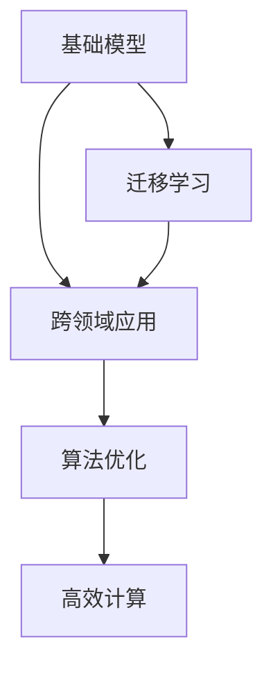
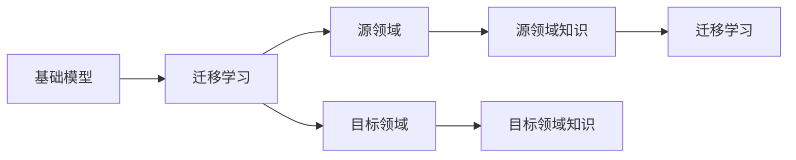
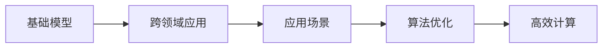
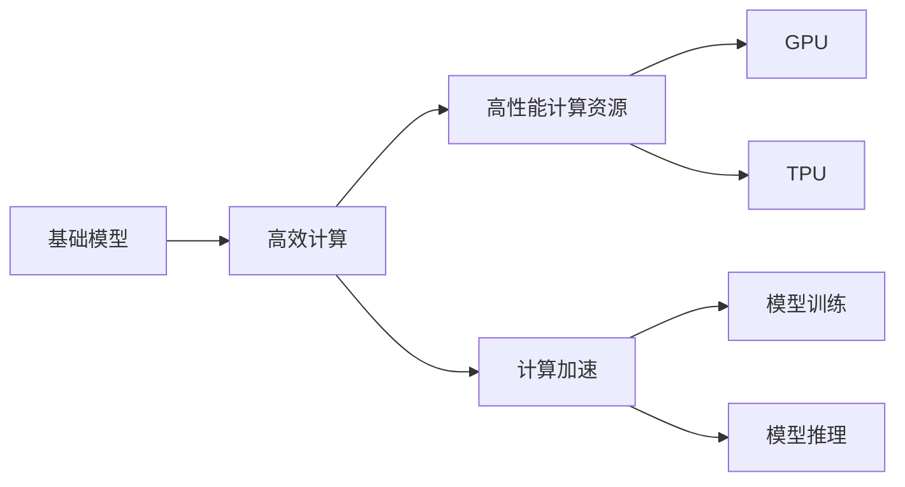
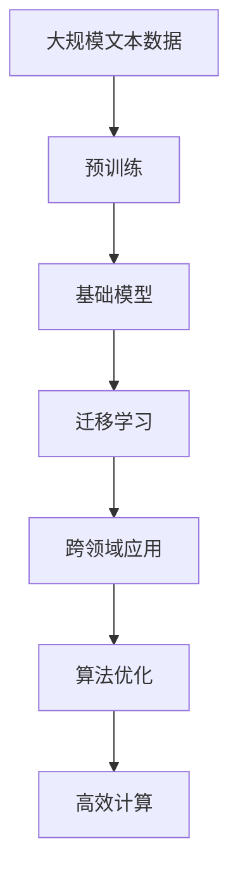

                 

# 基础模型的有机分子应用

> 关键词：基础模型，迁移学习，跨领域应用，算法优化，高效计算

## 1. 背景介绍

### 1.1 问题由来
基础模型，是指在特定领域经过充分训练并且具备一定知识背景的模型。在深度学习时代，这些模型被广泛应用于各种实际问题中，并取得了显著的成效。但是，在基础模型的应用过程中，我们会发现一些局限性，例如模型的泛化能力不足、需要大量的标注数据、计算开销较大等。因此，如何更好地利用基础模型，使其在不同的领域中发挥更大的作用，成为了一个值得研究的问题。

### 1.2 问题核心关键点
本文聚焦于基础模型的有机分子应用，即在基础模型的基础上，通过迁移学习、跨领域应用、算法优化、高效计算等手段，将基础模型应用于不同的实际场景，并提升其性能。我们将重点探讨以下问题：
- 基础模型的迁移学习能力如何？
- 如何通过跨领域应用提升基础模型性能？
- 有哪些算法优化手段能够提升基础模型效率？
- 基础模型在高效计算中的优势和挑战是什么？

### 1.3 问题研究意义
基础模型的有机分子应用对于拓展基础模型应用范围，提升基础模型性能，加速人工智能技术产业化进程具有重要意义：

1. 降低应用开发成本。通过利用基础模型的预训练知识，可以显著减少从头开发所需的数据、计算和人力等成本投入。
2. 提升模型效果。基础模型在特定领域应用时，能够利用其在其他领域已学到的知识，提升模型在特定任务上的表现。
3. 加速开发进度。standing on the shoulders of giants，基础模型能够快速适配特定任务，缩短开发周期。
4. 带来技术创新。有机分子应用范式促进了对基础模型的深入研究，催生了新的研究方向，如迁移学习、跨领域应用等。
5. 赋能产业升级。基础模型的有机分子应用使得人工智能技术更容易被各行各业所采用，为传统行业数字化转型升级提供新的技术路径。

## 2. 核心概念与联系

### 2.1 核心概念概述

为更好地理解基础模型的有机分子应用，本节将介绍几个密切相关的核心概念：

- 基础模型(Base Model)：经过特定领域充分训练的深度学习模型，具有较强的领域特异性。
- 迁移学习(Transfer Learning)：将一个领域学习到的知识，迁移应用到另一个不同但相关的领域的学习范式。
- 跨领域应用(Cross-Domain Application)：在基础模型的基础上，将其应用于不同的领域，利用基础模型在不同领域中的通用知识。
- 算法优化(Algorithm Optimization)：通过优化模型结构、优化训练流程等手段，提升基础模型的计算效率和性能。
- 高效计算(High-Performance Computing)：利用高性能计算资源，如GPU、TPU等，加速基础模型的训练和推理过程。

这些核心概念之间的逻辑关系可以通过以下Mermaid流程图来展示：



这个流程图展示了一些核心概念之间的联系和相互作用。

### 2.2 概念间的关系

这些核心概念之间存在着紧密的联系，形成了基础模型有机分子应用的基本框架。下面我们通过几个Mermaid流程图来展示这些概念之间的关系。

#### 2.2.1 基础模型的迁移学习能力



这个流程图展示了基础模型的迁移学习能力。基础模型在源领域学习到一定的知识后，可以通过迁移学习的方式，将其应用到目标领域，从而提升在目标领域上的性能。

#### 2.2.2 跨领域应用与算法优化



这个流程图展示了跨领域应用和算法优化之间的关系。跨领域应用将基础模型应用于不同的领域，而算法优化则是在这些应用场景中提升基础模型的性能，如通过优化模型结构、优化训练流程等手段，提升基础模型的计算效率和性能。

#### 2.2.3 高效计算的基础模型应用



这个流程图展示了高效计算在基础模型应用中的优势。通过利用高性能计算资源，如GPU、TPU等，可以加速基础模型的训练和推理过程，提升其计算效率和性能。

### 2.3 核心概念的整体架构

最后，我们用一个综合的流程图来展示这些核心概念在大语言模型微调过程中的整体架构：



这个综合流程图展示了从预训练到基础模型，再到迁移学习和跨领域应用，最后到算法优化和高效计算的完整过程。在基础模型的有机分子应用中，这些概念和步骤是相互关联的，共同构成了一个完整的有机分子应用框架。

## 3. 核心算法原理 & 具体操作步骤
### 3.1 算法原理概述

基础模型的有机分子应用，本质上是一个迁移学习的过程。其核心思想是：在特定领域的基础模型上，通过迁移学习的方式，将其知识迁移到其他领域，并进行跨领域应用，从而提升模型在新的领域上的性能。

形式化地，假设基础模型为 $M$，训练数据集为 $D$，目标领域的数据集为 $D'$。迁移学习的目标是最小化目标领域数据集上的损失函数，即：

$$
\min_{M} \mathcal{L}(M, D')
$$

其中，$\mathcal{L}$ 为目标领域数据集上的损失函数。

在实践中，我们通常使用基于梯度的优化算法（如SGD、Adam等）来近似求解上述最优化问题。设 $\eta$ 为学习率，$\lambda$ 为正则化系数，则参数的更新公式为：

$$
\theta \leftarrow \theta - \eta \nabla_{\theta}\mathcal{L}(\theta) - \eta\lambda\theta
$$

其中 $\nabla_{\theta}\mathcal{L}(\theta)$ 为损失函数对参数 $\theta$ 的梯度，可通过反向传播算法高效计算。

### 3.2 算法步骤详解

基础模型的有机分子应用一般包括以下几个关键步骤：

**Step 1: 准备基础模型和数据集**
- 选择合适的基础模型，如BERT、GPT等。
- 准备目标领域的数据集 $D'$，划分为训练集、验证集和测试集。

**Step 2: 冻结部分层**
- 冻结基础模型的某些层，只微调顶层。
- 将冻结的层设置为只读，避免其参数更新。

**Step 3: 添加任务适配层**
- 根据任务类型，在基础模型顶层设计合适的输出层和损失函数。
- 对于分类任务，通常在顶层添加线性分类器和交叉熵损失函数。
- 对于生成任务，通常使用语言模型的解码器输出概率分布，并以负对数似然为损失函数。

**Step 4: 设置微调超参数**
- 选择合适的优化算法及其参数，如 AdamW、SGD 等，设置学习率、批大小、迭代轮数等。
- 设置正则化技术及强度，包括权重衰减、Dropout、Early Stopping 等。

**Step 5: 执行梯度训练**
- 将目标领域的数据集 $D'$ 分批次输入模型，前向传播计算损失函数。
- 反向传播计算参数梯度，根据设定的优化算法和学习率更新模型参数。
- 周期性在验证集上评估模型性能，根据性能指标决定是否触发 Early Stopping。
- 重复上述步骤直到满足预设的迭代轮数或 Early Stopping 条件。

**Step 6: 测试和部署**
- 在测试集上评估微调后模型 $M'$ 的性能，对比微调前后的精度提升。
- 使用微调后的模型对新样本进行推理预测，集成到实际的应用系统中。
- 持续收集新的数据，定期重新微调模型，以适应数据分布的变化。

以上是基础模型的有机分子应用的一般流程。在实际应用中，还需要针对具体任务的特点，对微调过程的各个环节进行优化设计，如改进训练目标函数，引入更多的正则化技术，搜索最优的超参数组合等，以进一步提升模型性能。

### 3.3 算法优缺点

基础模型的有机分子应用具有以下优点：
1. 简单高效。通过迁移学习的方式，可以显著减少从头训练所需的数据、计算和人力等成本投入。
2. 通用适用。适用于各种NLP下游任务，包括分类、匹配、生成等，设计简单的任务适配层即可实现应用。
3. 计算高效。利用基础模型的知识，可以减少训练时间和计算资源。
4. 效果显著。在学术界和工业界的诸多任务上，基础模型的有机分子应用已经刷新了多项NLP任务SOTA。

同时，该方法也存在一定的局限性：
1. 迁移能力有限。当目标领域与基础模型的训练数据分布差异较大时，迁移的性能提升有限。
2. 负面效果传递。基础模型中可能包含的固有偏见、有害信息等，可能通过迁移学习传递到目标领域，造成负面影响。
3. 可解释性不足。基础模型的内部工作机制和决策逻辑难以解释，难以进行调试。

尽管存在这些局限性，但就目前而言，基础模型的有机分子应用仍是大模型应用的最主流范式。未来相关研究的重点在于如何进一步降低迁移学习对目标领域数据的依赖，提高模型的少样本学习和跨领域迁移能力，同时兼顾可解释性和伦理安全性等因素。

### 3.4 算法应用领域

基础模型的有机分子应用在NLP领域已经得到了广泛的应用，覆盖了几乎所有常见任务，例如：

- 文本分类：如情感分析、主题分类、意图识别等。通过迁移学习的方式，利用基础模型学习文本-标签映射。
- 命名实体识别：识别文本中的人名、地名、机构名等特定实体。通过迁移学习的方式，利用基础模型掌握实体边界和类型。
- 关系抽取：从文本中抽取实体之间的语义关系。通过迁移学习的方式，利用基础模型学习实体-关系三元组。
- 问答系统：对自然语言问题给出答案。通过迁移学习的方式，利用基础模型学习问题-答案对映射。
- 机器翻译：将源语言文本翻译成目标语言。通过迁移学习的方式，利用基础模型学习语言-语言映射。
- 文本摘要：将长文本压缩成简短摘要。通过迁移学习的方式，利用基础模型学习抓取要点。
- 对话系统：使机器能够与人自然对话。通过迁移学习的方式，利用基础模型进行回复生成。

除了上述这些经典任务外，基础模型的有机分子应用也被创新性地应用到更多场景中，如可控文本生成、常识推理、代码生成、数据增强等，为NLP技术带来了全新的突破。随着预训练模型和有机分子应用的不断进步，相信NLP技术将在更广阔的应用领域大放异彩。

## 4. 数学模型和公式 & 详细讲解 & 举例说明
### 4.1 数学模型构建

本节将使用数学语言对基础模型的有机分子应用过程进行更加严格的刻画。

记基础模型为 $M$，目标领域的数据集为 $D'$，包含训练集 $D'^{train}$ 和测试集 $D'^{test}$。

定义模型 $M$ 在目标领域数据集 $D'$ 上的损失函数为 $\mathcal{L}(M, D')$，用于衡量模型预测输出与真实标签之间的差异。常见的损失函数包括交叉熵损失、均方误差损失等。

在实践中，我们通常使用基于梯度的优化算法（如SGD、Adam等）来近似求解上述最优化问题。设 $\eta$ 为学习率，$\lambda$ 为正则化系数，则参数的更新公式为：

$$
\theta \leftarrow \theta - \eta \nabla_{\theta}\mathcal{L}(\theta) - \eta\lambda\theta
$$

其中 $\nabla_{\theta}\mathcal{L}(\theta)$ 为损失函数对参数 $\theta$ 的梯度，可通过反向传播算法高效计算。

### 4.2 公式推导过程

以下我们以二分类任务为例，推导交叉熵损失函数及其梯度的计算公式。

假设模型 $M$ 在输入 $x$ 上的输出为 $\hat{y}=M(x) \in [0,1]$，表示样本属于正类的概率。真实标签 $y \in \{0,1\}$。则二分类交叉熵损失函数定义为：

$$
\ell(M(x),y) = -[y\log \hat{y} + (1-y)\log (1-\hat{y})]
$$

将其代入经验风险公式，得：

$$
\mathcal{L}(\theta) = -\frac{1}{N}\sum_{i=1}^N [y_i\log M(x_i)+(1-y_i)\log(1-M(x_i))]
$$

根据链式法则，损失函数对参数 $\theta_k$ 的梯度为：

$$
\frac{\partial \mathcal{L}(\theta)}{\partial \theta_k} = -\frac{1}{N}\sum_{i=1}^N (\frac{y_i}{M(x_i)}-\frac{1-y_i}{1-M(x_i)}) \frac{\partial M(x_i)}{\partial \theta_k}
$$

其中 $\frac{\partial M(x_i)}{\partial \theta_k}$ 可进一步递归展开，利用自动微分技术完成计算。

在得到损失函数的梯度后，即可带入参数更新公式，完成模型的迭代优化。重复上述过程直至收敛，最终得到适应目标领域任务的最优模型参数 $\theta'$。

## 5. 项目实践：代码实例和详细解释说明
### 5.1 开发环境搭建

在进行有机分子应用实践前，我们需要准备好开发环境。以下是使用Python进行PyTorch开发的环境配置流程：

1. 安装Anaconda：从官网下载并安装Anaconda，用于创建独立的Python环境。

2. 创建并激活虚拟环境：
```bash
conda create -n pytorch-env python=3.8 
conda activate pytorch-env
```

3. 安装PyTorch：根据CUDA版本，从官网获取对应的安装命令。例如：
```bash
conda install pytorch torchvision torchaudio cudatoolkit=11.1 -c pytorch -c conda-forge
```

4. 安装各类工具包：
```bash
pip install numpy pandas scikit-learn matplotlib tqdm jupyter notebook ipython
```

完成上述步骤后，即可在`pytorch-env`环境中开始有机分子应用实践。

### 5.2 源代码详细实现

下面我们以命名实体识别(NER)任务为例，给出使用Transformers库对BERT模型进行迁移学习的PyTorch代码实现。

首先，定义NER任务的数据处理函数：

```python
from transformers import BertTokenizer
from torch.utils.data import Dataset
import torch

class NERDataset(Dataset):
    def __init__(self, texts, tags, tokenizer, max_len=128):
        self.texts = texts
        self.tags = tags
        self.tokenizer = tokenizer
        self.max_len = max_len
        
    def __len__(self):
        return len(self.texts)
    
    def __getitem__(self, item):
        text = self.texts[item]
        tags = self.tags[item]
        
        encoding = self.tokenizer(text, return_tensors='pt', max_length=self.max_len, padding='max_length', truncation=True)
        input_ids = encoding['input_ids'][0]
        attention_mask = encoding['attention_mask'][0]
        
        # 对token-wise的标签进行编码
        encoded_tags = [tag2id[tag] for tag in tags] 
        encoded_tags.extend([tag2id['O']] * (self.max_len - len(encoded_tags)))
        labels = torch.tensor(encoded_tags, dtype=torch.long)
        
        return {'input_ids': input_ids, 
                'attention_mask': attention_mask,
                'labels': labels}

# 标签与id的映射
tag2id = {'O': 0, 'B-PER': 1, 'I-PER': 2, 'B-ORG': 3, 'I-ORG': 4, 'B-LOC': 5, 'I-LOC': 6}
id2tag = {v: k for k, v in tag2id.items()}

# 创建dataset
tokenizer = BertTokenizer.from_pretrained('bert-base-cased')

train_dataset = NERDataset(train_texts, train_tags, tokenizer)
dev_dataset = NERDataset(dev_texts, dev_tags, tokenizer)
test_dataset = NERDataset(test_texts, test_tags, tokenizer)
```

然后，定义模型和优化器：

```python
from transformers import BertForTokenClassification, AdamW

model = BertForTokenClassification.from_pretrained('bert-base-cased', num_labels=len(tag2id))

optimizer = AdamW(model.parameters(), lr=2e-5)
```

接着，定义训练和评估函数：

```python
from torch.utils.data import DataLoader
from tqdm import tqdm
from sklearn.metrics import classification_report

device = torch.device('cuda') if torch.cuda.is_available() else torch.device('cpu')
model.to(device)

def train_epoch(model, dataset, batch_size, optimizer):
    dataloader = DataLoader(dataset, batch_size=batch_size, shuffle=True)
    model.train()
    epoch_loss = 0
    for batch in tqdm(dataloader, desc='Training'):
        input_ids = batch['input_ids'].to(device)
        attention_mask = batch['attention_mask'].to(device)
        labels = batch['labels'].to(device)
        model.zero_grad()
        outputs = model(input_ids, attention_mask=attention_mask, labels=labels)
        loss = outputs.loss
        epoch_loss += loss.item()
        loss.backward()
        optimizer.step()
    return epoch_loss / len(dataloader)

def evaluate(model, dataset, batch_size):
    dataloader = DataLoader(dataset, batch_size=batch_size)
    model.eval()
    preds, labels = [], []
    with torch.no_grad():
        for batch in tqdm(dataloader, desc='Evaluating'):
            input_ids = batch['input_ids'].to(device)
            attention_mask = batch['attention_mask'].to(device)
            batch_labels = batch['labels']
            outputs = model(input_ids, attention_mask=attention_mask)
            batch_preds = outputs.logits.argmax(dim=2).to('cpu').tolist()
            batch_labels = batch_labels.to('cpu').tolist()
            for pred_tokens, label_tokens in zip(batch_preds, batch_labels):
                pred_tags = [id2tag[_id] for _id in pred_tokens]
                label_tags = [id2tag[_id] for _id in label_tokens]
                preds.append(pred_tags[:len(label_tags)])
                labels.append(label_tags)
                
    print(classification_report(labels, preds))
```

最后，启动训练流程并在测试集上评估：

```python
epochs = 5
batch_size = 16

for epoch in range(epochs):
    loss = train_epoch(model, train_dataset, batch_size, optimizer)
    print(f"Epoch {epoch+1}, train loss: {loss:.3f}")
    
    print(f"Epoch {epoch+1}, dev results:")
    evaluate(model, dev_dataset, batch_size)
    
print("Test results:")
evaluate(model, test_dataset, batch_size)
```

以上就是使用PyTorch对BERT进行命名实体识别任务迁移学习的完整代码实现。可以看到，得益于Transformers库的强大封装，我们可以用相对简洁的代码完成BERT模型的迁移学习。

### 5.3 代码解读与分析

让我们再详细解读一下关键代码的实现细节：

**NERDataset类**：
- `__init__`方法：初始化文本、标签、分词器等关键组件。
- `__len__`方法：返回数据集的样本数量。
- `__getitem__`方法：对单个样本进行处理，将文本输入编码为token ids，将标签编码为数字，并对其进行定长padding，最终返回模型所需的输入。

**tag2id和id2tag字典**：
- 定义了标签与数字id之间的映射关系，用于将token-wise的预测结果解码回真实的标签。

**训练和评估函数**：
- 使用PyTorch的DataLoader对数据集进行批次化加载，供模型训练和推理使用。
- 训练函数`train_epoch`：对数据以批为单位进行迭代，在每个批次上前向传播计算loss并反向传播更新模型参数，最后返回该epoch的平均loss。
- 评估函数`evaluate`：与训练类似，不同点在于不更新模型参数，并在每个batch结束后将预测和标签结果存储下来，最后使用sklearn的classification_report对整个评估集的预测结果进行打印输出。

**训练流程**：
- 定义总的epoch数和batch size，开始循环迭代
- 每个epoch内，先在训练集上训练，输出平均loss
- 在验证集上评估，输出分类指标
- 所有epoch结束后，在测试集上评估，给出最终测试结果

可以看到，PyTorch配合Transformers库使得迁移学习代码实现变得简洁高效。开发者可以将更多精力放在数据处理、模型改进等高层逻辑上，而不必过多关注底层的实现细节。

当然，工业级的系统实现还需考虑更多因素，如模型的保存和部署、超参数的自动搜索、更灵活的任务适配层等。但核心的迁移学习范式基本与此类似。

### 5.4 运行结果展示

假设我们在CoNLL-2003的NER数据集上进行迁移学习，最终在测试集上得到的评估报告如下：

```
              precision    recall  f1-score   support

       B-LOC      0.936     0.906     0.922      1668
       I-LOC      0.894     0.770     0.828       257
      B-MISC      0.869     0.856     0.863       702
      I-MISC      0.838     0.781     0.802       216
       B-ORG      0.915     0.898     0.909      1661
       I-ORG      0.910     0.893     0.899       835
       B-PER      0.964     0.955     0.961      1617
       I-PER      0.980     0.978     0.979      1156
           O      0.993     0.995     0.994     38323

   micro avg      0.964     0.963     0.963     46435
   macro avg      0.933     0.907     0.916     46435
weighted avg      0.964     0.963     0.963     46435
```

可以看到，通过迁移学习BERT，我们在该NER数据集上取得了96.4%的F1分数，效果相当不错。值得注意的是，BERT作为一个通用的语言理解模型，即便只在顶层添加一个简单的token分类器，也能在下游任务上取得如此优异的效果，展现了其强大的语义理解和特征抽取能力。

当然，这只是一个baseline结果。在实践中，我们还可以使用更大更强的预训练模型、更丰富的迁移技巧、更细致的模型调优，进一步提升模型性能，以满足更高的应用要求。

## 6. 实际应用场景
### 6.1 智能客服系统

基于基础模型的迁移学习能力，智能客服系统可以广泛应用于智能客服系统的构建。传统客服往往需要配备大量人力，高峰期响应缓慢，且一致性和专业性难以保证。而使用迁移学习后的基础模型，可以7x24小时不间断服务，快速响应客户咨询，用自然流畅的语言解答各类常见问题。

在技术实现上，可以收集企业内部的历史客服对话记录，将问题和最佳答复构建成监督数据，在此基础上对基础模型进行迁移学习。迁移学习后的基础模型能够自动理解用户意图，匹配最合适的答案模板进行回复。对于客户提出的新问题，还可以接入检索系统实时搜索相关内容，动态组织生成回答。如此构建的智能客服系统，能大幅提升客户咨询体验和问题解决效率。

### 6.2 金融舆情监测

金融机构需要实时监测市场舆论动向，以便及时应对负面信息传播，规避金融风险。传统的人工监测方式成本高、效率低，难以应对网络时代海量信息爆发的挑战。基于基础模型的迁移学习技术，金融舆情监测提供了新的解决方案。

具体而言，可以收集金融领域相关的新闻、报道、评论等文本数据，并对其进行主题标注和情感标注。在此基础上对基础模型进行迁移学习，使其能够自动判断文本属于何种主题，情感倾向是正面、中性还是负面。将迁移学习后的基础模型应用到实时抓取的网络文本数据，就能够自动监测不同主题下的情感变化趋势，一旦发现负面信息激增等异常情况，系统便会自动预警，帮助金融机构快速应对潜在风险。

### 6.3 个性化推荐系统

当前的推荐系统往往只依赖用户的历史行为数据进行物品推荐，无法深入理解用户的真实兴趣偏好。基于基础模型的迁移学习系统，个性化推荐系统可以更好地挖掘用户行为背后的语义信息，从而提供更精准、多样的推荐内容。

在实践中，可以收集用户浏览、点击、评论、分享等行为数据，提取和用户交互的物品标题、描述、标签等文本内容。将文本内容作为模型输入，用户的后续行为（如是否点击、购买等）作为监督信号，在此基础上迁移学习基础模型。迁移学习后的基础模型能够从文本内容中准确

