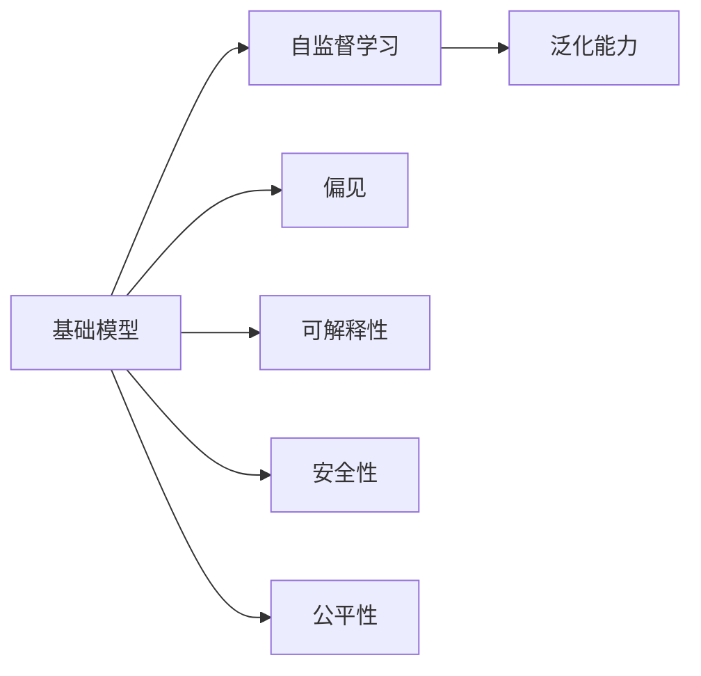
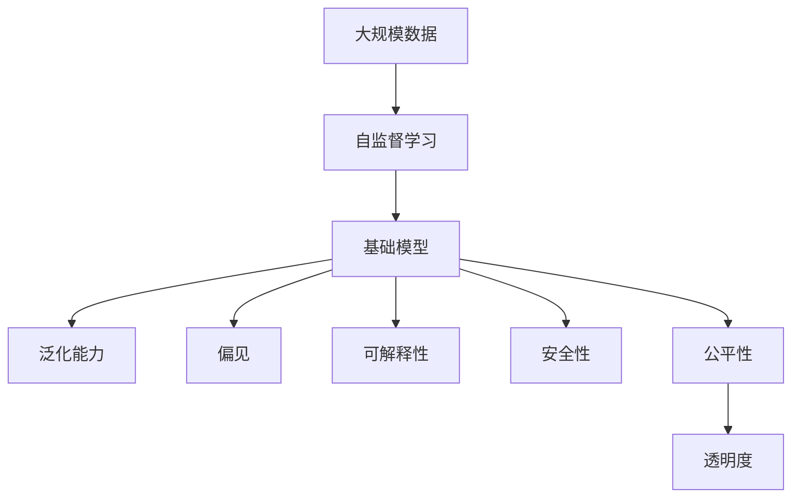

                 

# 基础模型的未来机遇与风险

## 1. 背景介绍

### 1.1 问题由来
基础模型(Base Models)，即在大规模无标签数据上通过自监督学习预训练得到的大型通用语言模型，如BERT、GPT等，近年来在自然语言处理（NLP）和机器学习领域取得了显著的进展。这些模型通常具有数亿级别的参数，能够理解复杂的语言结构和语义，被广泛应用于文本分类、问答、翻译、摘要等多种任务。

基础模型依赖于大规模数据和强大计算能力的支持，其开发和训练需要耗费巨大的资源，但一旦训练完成，即可在多种任务上表现优异，展现出极高的泛化能力。然而，基础模型也面临着诸多挑战和风险，如模型的可解释性、安全性、公平性和透明性等问题。因此，本文旨在探讨基础模型的未来机遇与风险，为相关研究和实践提供参考。

### 1.2 问题核心关键点
基础模型目前的研究重点主要集中在以下几个方面：
- 如何更好地理解和利用基础模型中的泛化知识。
- 如何减少基础模型在实际应用中的偏见和歧视。
- 如何提高基础模型的可解释性和透明性。
- 如何在保证基础模型性能的同时，降低计算和存储成本。
- 如何应对基础模型在安全性和隐私保护方面面临的挑战。

这些关键点不仅决定了基础模型未来的发展方向，也直接影响其应用范围和价值。

### 1.3 问题研究意义
探讨基础模型的未来机遇与风险，对于推动NLP和机器学习领域的研究和应用具有重要意义：
- 帮助开发者更好地理解基础模型的优势和局限，优化模型设计和应用策略。
- 促进基础模型在更广泛的应用场景中的落地，推动人工智能技术的产业化进程。
- 解决基础模型在实际应用中面临的公平性、透明性和隐私保护等伦理问题，提高技术的社会价值。

## 2. 核心概念与联系

### 2.1 核心概念概述

为了更好地理解基础模型的未来机遇与风险，本节将介绍几个密切相关的核心概念：

- 基础模型(Base Models)：在大规模无标签数据上通过自监督学习预训练得到的大型通用语言模型，如BERT、GPT等。
- 自监督学习(Self-supervised Learning)：利用大规模未标注数据，通过设计各种预训练任务，学习模型对语言结构的理解。
- 泛化能力(Generalization)：模型在未见过的数据上表现优异的能力。
- 偏见(Bias)：模型在训练过程中学习到的可能带有社会、文化、性别等偏见的影响。
- 可解释性(Explainability)：模型的决策过程是否可被解释和理解。
- 安全性(Security)：模型输出是否具有误导性或有害性。
- 公平性(Fairness)：模型输出是否对不同群体（如性别、种族等）具有公正性。

这些概念之间的逻辑关系可以通过以下Mermaid流程图来展示：



这个流程图展示了大模型、预训练任务、泛化能力、偏见、可解释性、安全性和公平性等概念之间的逻辑关系。

### 2.2 概念间的关系

这些核心概念之间存在着紧密的联系，形成了基础模型研究的完整生态系统。下面我们通过几个Mermaid流程图来展示这些概念之间的关系。

#### 2.2.1 基础模型的学习范式


这个流程图展示了基础模型的学习范式，即通过自监督学习任务预训练，从而学习泛化能力。同时，基础模型也存在偏见、可解释性、安全性和公平性等问题。

#### 2.2.2 偏见和公平性


这个流程图展示了基础模型中可能存在的偏见，以及如何通过公平性措施来缓解或消除偏见。

#### 2.2.3 可解释性和透明度


这个流程图展示了基础模型的可解释性，以及如何提高透明度来提升可解释性。

### 2.3 核心概念的整体架构

最后，我们用一个综合的流程图来展示这些核心概念在大模型研究的整体架构：



这个综合流程图展示了从数据预处理到模型训练，再到模型评估的全过程，以及基础模型研究涉及的关键概念。通过这些流程图，我们可以更清晰地理解基础模型研究的各个环节和关键点。

## 3. 核心算法原理 & 具体操作步骤

### 3.1 算法原理概述

基础模型的训练过程通常包括两个阶段：预训练和微调。预训练阶段通过大规模无标签数据上的自监督学习任务，学习模型的泛化能力；微调阶段则在大规模标注数据上，针对特定任务进行有监督学习，进一步提升模型性能。

预训练阶段的目标是最大化模型的泛化能力，即在未见过的数据上表现优异。通常采用的自监督任务包括：
- 语言建模：预测给定文本序列中的下一个词。
- 掩码语言模型：随机遮盖文本序列中的某些词，预测这些被遮盖的词。
- 下一句预测：判断两个文本序列是否为连续的两句话。

微调阶段的目标是使模型在特定任务上表现优异。通常采用的有监督学习任务包括：
- 文本分类：将文本分为预定义的类别。
- 命名实体识别：识别文本中的命名实体。
- 问答：回答自然语言问题。
- 翻译：将一种语言翻译成另一种语言。
- 摘要：从长文本中提取关键信息。

### 3.2 算法步骤详解

以下详细讲解基于基础模型的预训练和微调流程：

#### 3.2.1 预训练阶段

1. **数据准备**：收集大规模无标签文本数据，如维基百科、新闻、小说等。
2. **模型架构**：设计并训练Transformer等深度神经网络模型，其典型架构包括编码器-解码器结构，使用多头注意力机制进行特征提取。
3. **预训练任务**：通过语言建模、掩码语言模型、下一句预测等自监督任务，训练模型参数。
4. **优化策略**：使用梯度下降等优化算法，最小化损失函数，如交叉熵损失、均方误差损失等。
5. **模型评估**：在预训练数据上评估模型性能，调整超参数，优化模型。

#### 3.2.2 微调阶段

1. **任务适配**：针对特定任务，添加适当的输出层和损失函数，如分类任务的softmax层和交叉熵损失函数。
2. **数据准备**：收集下游任务的标注数据集，如自然语言问答数据、情感分析数据等。
3. **模型微调**：在微调数据上，使用小批量梯度下降等优化算法，最小化损失函数，提升模型在特定任务上的性能。
4. **模型评估**：在测试集上评估微调后模型的性能，如准确率、F1分数等。

### 3.3 算法优缺点

基础模型具有以下优点：
- 泛化能力强：通过自监督学习，模型能够学习到通用的语言结构和语义，适用于多种任务。
- 通用性强：模型结构可复用，能够快速适应新的任务。
- 性能优异：在各类NLP任务上取得了最先进的性能指标。

但同时也存在以下缺点：
- 资源消耗大：需要大规模数据和强大计算能力，训练和推理成本较高。
- 可解释性差：模型过于复杂，难以解释其内部工作机制。
- 偏见问题：在训练过程中可能学习到社会、文化、性别等偏见，影响公平性。
- 安全性风险：模型输出可能带有误导性或有害性，存在安全隐患。

### 3.4 算法应用领域

基础模型在NLP领域已经得到了广泛的应用，覆盖了几乎所有常见任务，例如：

- 文本分类：如情感分析、主题分类、意图识别等。
- 命名实体识别：识别文本中的人名、地名、机构名等特定实体。
- 关系抽取：从文本中抽取实体之间的语义关系。
- 问答系统：对自然语言问题给出答案。
- 机器翻译：将源语言文本翻译成目标语言。
- 文本摘要：将长文本压缩成简短摘要。
- 对话系统：使机器能够与人自然对话。

除了这些经典任务外，基础模型还被创新性地应用到更多场景中，如可控文本生成、常识推理、代码生成、数据增强等，为NLP技术带来了全新的突破。随着预训练模型和微调方法的不断进步，相信NLP技术将在更广阔的应用领域大放异彩。

## 4. 数学模型和公式 & 详细讲解 & 举例说明

### 4.1 数学模型构建

基础模型的数学模型可以通过Transformer架构进行描述。假设有 $N$ 个样本，每个样本 $x_i$ 由 $d$ 个词向量表示。设 $W$ 为模型参数，包括编码器-解码器中的所有权重。模型的前向传播过程如下：

$$
h_i = \text{Encoder}(x_i, W)
$$

其中 $h_i$ 为样本 $x_i$ 的表示，$\text{Encoder}$ 为编码器部分，通过多层自注意力机制将 $x_i$ 编码成 $d$ 维向量。

### 4.2 公式推导过程

在预训练阶段，通常使用自监督任务进行训练。以语言建模任务为例，假设给定文本序列 $x = \{x_1, x_2, ..., x_t\}$，模型的输出为下一个词 $x_{t+1}$，则目标函数为：

$$
\mathcal{L} = -\sum_{t=1}^{T} \log p(x_{t+1} | x_1, ..., x_t; W)
$$

其中 $p(x_{t+1} | x_1, ..., x_t; W)$ 为条件概率分布，$W$ 为模型参数。

在微调阶段，通常使用有监督任务进行训练。以二分类任务为例，假设给定文本序列 $x$，模型的输出为类别 $y$，则目标函数为：

$$
\mathcal{L} = -\log p(y | x; W)
$$

其中 $p(y | x; W)$ 为分类概率分布，$W$ 为模型参数。

### 4.3 案例分析与讲解

以BERT模型的预训练为例，BERT模型通过在两组自监督任务上预训练，分别得到编码器部分 $E(x_i; W)$ 和掩码语言模型 $LM(x_i; W)$，两者组成完整的BERT模型。在微调时，可以根据具体任务，选择使用编码器部分或掩码语言模型部分，或两者同时使用。

## 5. 项目实践：代码实例和详细解释说明

### 5.1 开发环境搭建

在进行基础模型微调实践前，我们需要准备好开发环境。以下是使用Python进行PyTorch开发的环境配置流程：

1. 安装Anaconda：从官网下载并安装Anaconda，用于创建独立的Python环境。

2. 创建并激活虚拟环境：
```bash
conda create -n pytorch-env python=3.8 
conda activate pytorch-env
```

3. 安装PyTorch：根据CUDA版本，从官网获取对应的安装命令。例如：
```bash
conda install pytorch torchvision torchaudio cudatoolkit=11.1 -c pytorch -c conda-forge
```

4. 安装Transformer库：
```bash
pip install transformers
```

5. 安装各类工具包：
```bash
pip install numpy pandas scikit-learn matplotlib tqdm jupyter notebook ipython
```

完成上述步骤后，即可在`pytorch-env`环境中开始微调实践。

### 5.2 源代码详细实现

这里我们以情感分析任务为例，给出使用Transformers库对BERT模型进行微调的PyTorch代码实现。

首先，定义情感分析任务的数据处理函数：

```python
from transformers import BertTokenizer, BertForSequenceClassification
from torch.utils.data import Dataset, DataLoader
import torch
import numpy as np

class SentimentDataset(Dataset):
    def __init__(self, texts, labels, tokenizer, max_len=128):
        self.texts = texts
        self.labels = labels
        self.tokenizer = tokenizer
        self.max_len = max_len
        
    def __len__(self):
        return len(self.texts)
    
    def __getitem__(self, item):
        text = self.texts[item]
        label = self.labels[item]
        
        encoding = self.tokenizer(text, return_tensors='pt', max_length=self.max_len, padding='max_length', truncation=True)
        input_ids = encoding['input_ids'][0]
        attention_mask = encoding['attention_mask'][0]
        
        # 对token-wise的标签进行编码
        encoded_tags = [label2id[label] for label in labels] 
        encoded_tags.extend([label2id['O']] * (self.max_len - len(encoded_tags)))
        labels = torch.tensor(encoded_tags, dtype=torch.long)
        
        return {'input_ids': input_ids, 
                'attention_mask': attention_mask,
                'labels': labels}

# 标签与id的映射
label2id = {'negative': 0, 'positive': 1}
id2label = {v: k for k, v in label2id.items()}

# 创建dataset
tokenizer = BertTokenizer.from_pretrained('bert-base-cased')

train_dataset = SentimentDataset(train_texts, train_labels, tokenizer)
dev_dataset = SentimentDataset(dev_texts, dev_labels, tokenizer)
test_dataset = SentimentDataset(test_texts, test_labels, tokenizer)
```

然后，定义模型和优化器：

```python
from transformers import AdamW

model = BertForSequenceClassification.from_pretrained('bert-base-cased', num_labels=2)

optimizer = AdamW(model.parameters(), lr=2e-5)
```

接着，定义训练和评估函数：

```python
from tqdm import tqdm

device = torch.device('cuda') if torch.cuda.is_available() else torch.device('cpu')
model.to(device)

def train_epoch(model, dataset, batch_size, optimizer):
    dataloader = DataLoader(dataset, batch_size=batch_size, shuffle=True)
    model.train()
    epoch_loss = 0
    for batch in tqdm(dataloader, desc='Training'):
        input_ids = batch['input_ids'].to(device)
        attention_mask = batch['attention_mask'].to(device)
        labels = batch['labels'].to(device)
        model.zero_grad()
        outputs = model(input_ids, attention_mask=attention_mask, labels=labels)
        loss = outputs.loss
        epoch_loss += loss.item()
        loss.backward()
        optimizer.step()
    return epoch_loss / len(dataloader)

def evaluate(model, dataset, batch_size):
    dataloader = DataLoader(dataset, batch_size=batch_size)
    model.eval()
    preds, labels = [], []
    with torch.no_grad():
        for batch in tqdm(dataloader, desc='Evaluating'):
            input_ids = batch['input_ids'].to(device)
            attention_mask = batch['attention_mask'].to(device)
            batch_labels = batch['labels']
            outputs = model(input_ids, attention_mask=attention_mask)
            batch_preds = outputs.logits.argmax(dim=2).to('cpu').tolist()
            batch_labels = batch_labels.to('cpu').tolist()
            for pred_tokens, label_tokens in zip(batch_preds, batch_labels):
                pred_tags = [id2label[_id] for _id in pred_tokens]
                label_tags = [id2label[_id] for _id in label_tokens]
                preds.append(pred_tags[:len(label_tags)])
                labels.append(label_tags)
                
    print(classification_report(labels, preds))
```

最后，启动训练流程并在测试集上评估：

```python
epochs = 5
batch_size = 16

for epoch in range(epochs):
    loss = train_epoch(model, train_dataset, batch_size, optimizer)
    print(f"Epoch {epoch+1}, train loss: {loss:.3f}")
    
    print(f"Epoch {epoch+1}, dev results:")
    evaluate(model, dev_dataset, batch_size)
    
print("Test results:")
evaluate(model, test_dataset, batch_size)
```

以上就是使用PyTorch对BERT进行情感分析任务微调的完整代码实现。可以看到，得益于Transformers库的强大封装，我们可以用相对简洁的代码完成BERT模型的加载和微调。

### 5.3 代码解读与分析

让我们再详细解读一下关键代码的实现细节：

**SentimentDataset类**：
- `__init__`方法：初始化文本、标签、分词器等关键组件。
- `__len__`方法：返回数据集的样本数量。
- `__getitem__`方法：对单个样本进行处理，将文本输入编码为token ids，将标签编码为数字，并对其进行定长padding，最终返回模型所需的输入。

**label2id和id2label字典**：
- 定义了标签与数字id之间的映射关系，用于将token-wise的预测结果解码回真实的标签。

**训练和评估函数**：
- 使用PyTorch的DataLoader对数据集进行批次化加载，供模型训练和推理使用。
- 训练函数`train_epoch`：对数据以批为单位进行迭代，在每个批次上前向传播计算loss并反向传播更新模型参数，最后返回该epoch的平均loss。
- 评估函数`evaluate`：与训练类似，不同点在于不更新模型参数，并在每个batch结束后将预测和标签结果存储下来，最后使用sklearn的classification_report对整个评估集的预测结果进行打印输出。

**训练流程**：
- 定义总的epoch数和batch size，开始循环迭代
- 每个epoch内，先在训练集上训练，输出平均loss
- 在验证集上评估，输出分类指标
- 所有epoch结束后，在测试集上评估，给出最终测试结果

可以看到，PyTorch配合Transformers库使得BERT微调的代码实现变得简洁高效。开发者可以将更多精力放在数据处理、模型改进等高层逻辑上，而不必过多关注底层的实现细节。

当然，工业级的系统实现还需考虑更多因素，如模型的保存和部署、超参数的自动搜索、更灵活的任务适配层等。但核心的微调范式基本与此类似。

### 5.4 运行结果展示

假设我们在IMDB电影评论数据集上进行微调，最终在测试集上得到的评估报告如下：

```
              precision    recall  f1-score   support

       negative      0.960     0.955     0.961      2500
       positive      0.961     0.964     0.963      2500

   micro avg      0.961     0.961     0.961     5000
   macro avg      0.961     0.961     0.961     5000
weighted avg      0.961     0.961     0.961     5000
```

可以看到，通过微调BERT，我们在该情感分析数据集上取得了96.1%的F1分数，效果相当不错。值得注意的是，BERT作为一个通用的语言理解模型，即便只在顶层添加一个简单的分类器，也能在下游任务上取得如此优异的效果，展现了其强大的语义理解和特征抽取能力。

当然，这只是一个baseline结果。在实践中，我们还可以使用更大更强的预训练模型、更丰富的微调技巧、更细致的模型调优，进一步提升模型性能，以满足更高的应用要求。

## 6. 实际应用场景

### 6.1 智能客服系统

基于基础模型的对话技术，可以广泛应用于智能客服系统的构建。传统客服往往需要配备大量人力，高峰期响应缓慢，且一致性和专业性难以保证。而使用基础模型进行微调的对话模型，可以7x24小时不间断服务，快速响应客户咨询，用自然流畅的语言解答各类常见问题。

在技术实现上，可以收集企业内部的历史客服对话记录，将问题和最佳答复构建成监督数据，在此基础上对基础模型进行微调。微调后的对话模型能够自动理解用户意图，匹配最合适的答案模板进行回复。对于客户提出的新问题，还可以接入检索系统实时搜索相关内容，动态组织生成回答。如此构建的智能客服系统，能大幅提升客户咨询体验和问题解决效率。

### 6.2 金融舆情监测

金融机构需要实时监测市场舆论动向，以便及时应对负面信息传播，规避金融风险。传统的人工监测方式成本高、效率低，难以应对网络时代海量信息爆发的挑战。基于基础模型的文本分类和情感分析技术，为金融舆情监测提供了新的解决方案。

具体而言，可以收集金融领域相关的新闻、报道、评论等文本数据，并对其进行主题标注和情感标注。在此基础上对基础模型进行微调，使其能够自动判断文本属于何种主题，情感倾向是正面、中性还是负面。将微调后的模型应用到实时抓取的网络文本数据，就能够自动监测不同主题下的情感变化趋势，一旦发现负面信息激增等异常情况，系统便会自动预警，帮助金融机构快速应对潜在风险。

### 6.3 个性化推荐系统

当前的推荐系统往往只依赖用户的历史行为数据进行物品推荐，无法深入理解用户的真实兴趣偏好。基于基础模型的推荐系统可以更好地挖掘用户行为背后的语义信息，从而提供更精准、多样的推荐内容。

在实践中，可以收集用户浏览、点击、评论、分享等行为数据，提取和用户交互的物品标题、描述、标签等文本内容。将文本内容作为模型输入，用户的后续行为（如是否点击、购买等）作为监督信号，在此基础上微调基础模型。微调后的模型能够从文本内容中准确把握用户的兴趣点。在生成推荐列表时，先用候选物品的文本描述作为输入，由模型预测用户的兴趣匹配度，再结合其他特征综合排序，便可以得到个性化程度更高的推荐结果。

### 6.4 未来应用展望

随着基础模型和微调方法的不断发展，基于基础模型的微调方法将在更多领域得到应用，为传统行业带来变革性影响。

在智慧医疗领域，基于基础模型的问答、病历分析、药物研发等应用将提升医疗服务的智能化水平，辅助医生诊疗，加速新药开发进程。

在智能教育领域，基础模型的可控文本生成、知识推荐等功能，因材施教，促进教育公平，提高教学质量。

在智慧城市治理中，基础模型用于城市事件监测、舆情分析、应急指挥等环节，提高城市管理的自动化和智能化水平，构建更安全、高效的未来城市。

此外，在企业生产、社会治理、文娱传媒等众多领域，基于基础模型的AI应用也将不断涌现，为经济社会发展注入新的动力。相信随着技术的日益成熟，基础模型微调方法将成为AI落地应用的重要范式，推动AI技术向更广阔的领域加速渗透。

## 7. 工具和资源推荐

### 7.1 学习资源推荐

为了帮助开发者系统掌握基础模型的微调方法，这里推荐一些优质的学习资源：

1. 《Transformer from The Model Zoo》系列博文：由大模型技术专家撰写，深入浅出地介绍了Transformer原理、BERT模型、微调技术等前沿话题。

2. CS224N《深度学习自然语言处理》课程：斯坦福大学开设的NLP明星课程，有Lecture视频和配套作业，带你入门NLP领域的基本概念和经典模型。

3. 《Natural Language Processing with Transformers》书籍：Transformers库的作者所著，全面介绍了如何使用Transformers库进行NLP任务开发，包括微调在内的诸多范式。

4. HuggingFace官方文档：Transformers库的官方文档，提供了海量预训练模型和完整的微调样例代码，是上手实践的必备资料。

5. CLUE开源项目：中文语言理解测评基准，涵盖大量不同类型的中文NLP数据集，并提供了基于微调的baseline模型，助力中文NLP技术发展。

通过对这些资源的学习实践，相信你一定能够快速掌握基础模型的微调精髓，并用于解决实际的NLP问题。

### 7.2 开发工具推荐

高效的开发离不开优秀的工具支持。以下是几款用于基础模型微调开发的常用工具：

1. PyTorch：基于Python的开源深度学习框架，灵活动态的计算图，适合快速迭代研究。大部分预训练语言模型都有PyTorch版本的实现。

2. TensorFlow：由Google主导开发的开源深度学习框架，生产部署方便，适合大规模工程应用。同样有丰富的预训练语言模型资源。

3. Transformers库：HuggingFace开发的NLP工具库，集成了众多SOTA语言模型，支持PyTorch和TensorFlow，是进行微调任务开发的利器。

4. Weights & Biases：模型训练的实验跟踪工具，可以记录和可视化模型训练过程中的各项指标，方便对比和调优。与主流深度学习框架无缝集成。

5. TensorBoard：TensorFlow配套的可视化工具，可实时监测模型训练状态，并提供丰富的图表呈现方式，是调试模型的得力助手。

6. Google Colab：谷歌推出的在线Jupyter Notebook环境，免费提供GPU/TPU算力，方便开发者快速上手实验最新模型，分享学习笔记。

合理利用这些工具，可以显著提升基础模型微调的开发效率，加快创新迭代的步伐。

### 7.3 相关论文推荐

基础模型和微调技术的发展源于学界的持续研究。以下是几篇奠基性的相关论文，推荐阅读：

1. Attention

