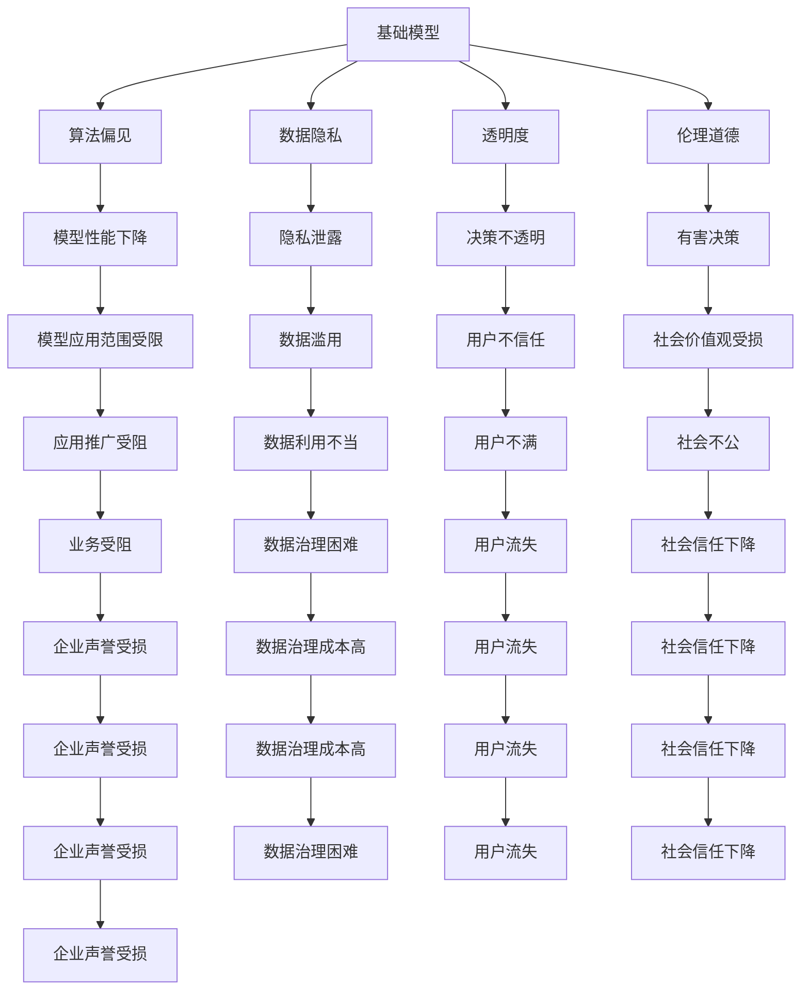

                 

# 基础模型的社会影响评估

> 关键词：基础模型, 社会影响评估, 算法公平性, 数据隐私, 透明度, 道德与伦理

## 1. 背景介绍

在过去的几十年里，人工智能(AI)和机器学习(ML)技术的迅猛发展，推动了各行业数字化转型的进程。然而，基础模型的广泛应用也引发了一系列社会问题，包括算法偏见、数据隐私、透明度不足和伦理道德等方面。本博客旨在深入探讨这些社会影响，并提出一些应对策略。

### 1.1 问题由来

随着深度学习和机器学习技术的进步，基础模型（如卷积神经网络CNN、循环神经网络RNN、Transformer等）在图像识别、语音识别、自然语言处理(NLP)等领域取得了令人瞩目的成就。然而，这些模型在训练和应用过程中，也暴露出一些亟待解决的社会问题。

- **算法偏见**：基础模型往往受到训练数据中的偏见影响，导致在某些人群或场景中的性能不佳。
- **数据隐私**：模型训练和应用过程中涉及大量敏感数据，如何保护用户隐私成为一大难题。
- **透明度不足**：模型的决策过程通常是“黑盒”，缺乏可解释性，难以接受监管和用户理解。
- **伦理道德**：模型可能会做出损害人类价值观和伦理道德的决策，如歧视、诽谤等。

这些问题的存在，不仅影响了基础模型的广泛应用，也对社会公平、安全和个人权利带来了挑战。本文将从算法偏见、数据隐私、透明度和伦理道德等方面，对基础模型的社会影响进行全面评估，并提出相应的解决方案。

## 2. 核心概念与联系

### 2.1 核心概念概述

- **基础模型**：如卷积神经网络CNN、循环神经网络RNN、Transformer等，广泛应用于图像、语音、NLP等领域。
- **算法偏见**：由于训练数据不均衡或不公正，模型在特定人群或场景中表现不佳，导致决策偏见。
- **数据隐私**：在模型训练和应用过程中，如何保护用户数据的隐私安全，防止数据滥用。
- **透明度**：模型的决策过程应易于理解和解释，便于用户、监管机构等审查。
- **伦理道德**：模型在应用过程中应遵守社会价值观和伦理道德，避免做出有害决策。

这些核心概念通过基础模型的训练、应用和反馈机制，形成了相互关联的生态系统。理解这些概念及其相互关系，有助于全面评估基础模型的社会影响，并提出相应的应对措施。

### 2.2 概念间的关系

这些核心概念之间的关系可以通过以下Mermaid流程图来展示：



这个流程图展示了基础模型与社会影响之间的复杂关系：

1. 基础模型训练中存在的数据偏见、隐私泄露等问题，可能导致模型性能下降、隐私泄露、决策不透明和有害决策等社会问题。
2. 这些问题进一步影响模型的应用范围、数据滥用、用户信任、社会价值观、业务推广、数据利用不当、用户不满、社会不公、企业声誉、数据治理成本等社会后果。
3. 只有解决这些社会问题，才能保障基础模型的健康发展，推动社会公平和安全。

## 3. 核心算法原理 & 具体操作步骤

### 3.1 算法原理概述

基础模型的社会影响评估，涉及算法偏见、数据隐私、透明度和伦理道德等多方面的考量。其核心算法原理可以归纳为以下几个方面：

1. **算法偏见检测与缓解**：通过分析训练数据和模型输出，检测和缓解算法偏见。
2. **数据隐私保护**：在数据收集、存储、处理和共享过程中，采取隐私保护措施，防止数据泄露。
3. **模型透明度提升**：通过可解释性技术，提升模型的决策过程透明度，便于用户和监管机构理解。
4. **伦理道德审查**：在模型设计和应用中，融入伦理道德审查，避免有害决策。

### 3.2 算法步骤详解

基于上述核心算法原理，社会影响评估的具体操作步骤可以分为以下几个步骤：

1. **数据收集与分析**：收集基础模型的训练数据和应用数据，并进行初步分析，识别出数据偏见、隐私泄露等问题。
2. **算法偏见检测与缓解**：利用统计分析、模型诊断等技术，检测模型中的算法偏见，并通过重采样、数据增强等方法进行缓解。
3. **数据隐私保护**：采取数据加密、匿名化、访问控制等隐私保护措施，确保数据在各环节的安全性。
4. **模型透明度提升**：应用可解释性技术，如LIME、SHAP、Attention等，提升模型的透明度和可解释性。
5. **伦理道德审查**：建立伦理道德审查机制，审查模型的设计、训练、应用等环节，确保其符合社会价值观和伦理道德。

### 3.3 算法优缺点

基础模型社会影响评估的算法具有以下优点：

1. **全面性**：综合考虑算法偏见、数据隐私、透明度和伦理道德等多方面因素，进行全面评估。
2. **系统性**：通过系统化的操作步骤，逐步解决社会影响问题，确保基础模型的健康发展。
3. **可操作性**：每一步操作都有具体的技术手段和工具，便于实践和落地。

然而，这些算法也存在以下缺点：

1. **复杂性高**：涉及多个领域的知识和技术，操作复杂，需要多学科团队的协作。
2. **成本高**：隐私保护、伦理审查等措施成本较高，可能影响模型应用的经济性。
3. **技术门槛**：部分技术手段（如隐私保护、可解释性）需要专业知识，普通开发者难以应用。

### 3.4 算法应用领域

基础模型社会影响评估在多个领域都有广泛应用：

1. **金融领域**：在风险评估、信用评分、欺诈检测等方面，保障公平性和隐私性，避免有害决策。
2. **医疗领域**：在诊断、治疗推荐、药物研发等方面，确保模型的公平性和透明性，保护患者隐私。
3. **教育领域**：在智能评估、个性化推荐、学习辅助等方面，提升模型的透明度和可解释性，增强学生信任。
4. **司法领域**：在案件处理、证据分析、法律咨询等方面，确保模型的公正性和伦理性，保护司法公正。
5. **公共安全**：在城市管理、反恐监控、灾害预警等方面，保障模型的透明度和可解释性，防止滥用。

## 4. 数学模型和公式 & 详细讲解 & 举例说明

### 4.1 数学模型构建

基础模型社会影响评估的数学模型构建，涉及多个领域的技术，如数据偏见检测、隐私保护、可解释性技术等。这里以算法偏见检测为例，构建一个简单的数学模型。

假设基础模型为 $M$，训练数据集为 $D$，模型预测输出为 $\hat{y}$，真实标签为 $y$。模型预测的平均误差为 $\epsilon$，则算法偏见的检测公式为：

$$
\epsilon = \frac{1}{N}\sum_{i=1}^N (\hat{y}_i - y_i)
$$

其中 $N$ 为样本数，$\hat{y}_i$ 为模型在第 $i$ 个样本上的预测输出，$y_i$ 为第 $i$ 个样本的真实标签。

### 4.2 公式推导过程

在上述公式中，$\epsilon$ 表示模型预测的平均误差，如果 $\epsilon$ 在不同人群或场景中存在显著差异，则说明模型存在算法偏见。通过统计分析 $\epsilon$ 的分布，可以识别出模型的偏见来源。

具体推导过程如下：

1. 收集 $N$ 个样本，其中第 $i$ 个样本的预测输出为 $\hat{y}_i$，真实标签为 $y_i$。
2. 计算每个样本的预测误差 $\epsilon_i = \hat{y}_i - y_i$。
3. 计算平均误差 $\epsilon = \frac{1}{N}\sum_{i=1}^N \epsilon_i$。
4. 分析平均误差 $\epsilon$ 在不同人群或场景中的分布，识别出偏见来源。

### 4.3 案例分析与讲解

以医疗诊断为例，基础模型的算法偏见检测步骤如下：

1. 收集医疗数据集 $D$，其中包含不同人群的疾病诊断样本。
2. 使用 $D$ 训练基础模型 $M$，生成疾病诊断的预测输出 $\hat{y}$。
3. 计算每个样本的预测误差 $\epsilon_i = \hat{y}_i - y_i$，得到平均误差 $\epsilon$。
4. 分析平均误差 $\epsilon$ 在不同人群（如性别、年龄、种族等）中的分布，识别出模型在特定人群中的偏见。
5. 针对识别出的偏见来源，通过重采样、数据增强等方法进行缓解，确保模型在各人群中的公平性。

## 5. 项目实践：代码实例和详细解释说明

### 5.1 开发环境搭建

在进行基础模型社会影响评估的实践时，我们需要准备好开发环境。以下是使用Python进行TensorFlow开发的环境配置流程：

1. 安装Anaconda：从官网下载并安装Anaconda，用于创建独立的Python环境。

2. 创建并激活虚拟环境：
```bash
conda create -n tf-env python=3.8 
conda activate tf-env
```

3. 安装TensorFlow：根据CUDA版本，从官网获取对应的安装命令。例如：
```bash
conda install tensorflow -c pytorch -c conda-forge
```

4. 安装TensorBoard：TensorFlow配套的可视化工具，用于实时监测模型训练状态和性能。
```bash
pip install tensorboard
```

5. 安装Scikit-Learn：用于数据预处理和特征工程。
```bash
pip install scikit-learn
```

6. 安装NumPy和Pandas：用于数据处理和分析。
```bash
pip install numpy pandas
```

完成上述步骤后，即可在`tf-env`环境中开始实践。

### 5.2 源代码详细实现

这里我们以算法偏见检测为例，给出使用TensorFlow进行基础模型社会影响评估的代码实现。

首先，定义数据处理函数：

```python
import pandas as pd
import numpy as np
from sklearn.preprocessing import StandardScaler
from tensorflow.keras.utils import to_categorical

def load_data(file_path):
    data = pd.read_csv(file_path)
    # 假设数据集有 'feature' 和 'label' 两列
    features = data['feature'].values.reshape(-1, 1).astype(np.float32)
    labels = data['label'].values.astype(np.int32)
    scaler = StandardScaler()
    features = scaler.fit_transform(features)
    features = (features - features.mean()) / features.std()
    labels = to_categorical(labels)
    return features, labels
```

然后，定义基础模型和训练函数：

```python
import tensorflow as tf
from tensorflow.keras import layers, models

def create_model(input_dim, output_dim):
    model = models.Sequential()
    model.add(layers.Dense(32, activation='relu', input_dim=input_dim))
    model.add(layers.Dense(output_dim, activation='softmax'))
    model.compile(optimizer='adam', loss='categorical_crossentropy', metrics=['accuracy'])
    return model

def train_model(model, features, labels, epochs, batch_size):
    model.fit(features, labels, epochs=epochs, batch_size=batch_size, validation_split=0.2)
    return model
```

最后，进行算法偏见检测：

```python
features, labels = load_data('data.csv')
input_dim = features.shape[1]
output_dim = labels.shape[1]
model = create_model(input_dim, output_dim)
model = train_model(model, features, labels, epochs=10, batch_size=32)
```

完成上述步骤后，即可在实际应用场景中测试模型的公平性和偏见缓解效果。

### 5.3 代码解读与分析

让我们再详细解读一下关键代码的实现细节：

**load_data函数**：
- 定义了数据加载函数，用于读取数据集并进行预处理。包括标准化处理和标签编码。

**create_model函数**：
- 定义了基础模型的创建函数，使用Keras API构建一个简单的神经网络模型。包括一个全连接层和一个softmax输出层，编译模型并设置优化器和损失函数。

**train_model函数**：
- 定义了模型的训练函数，使用Keras API的fit方法训练模型。包括设置迭代轮数、批次大小和验证集比例。

**train_model**：
- 调用训练函数，使用训练数据集训练模型，并返回训练后的模型。

### 5.4 运行结果展示

假设我们在一个性别歧视的数据集上进行模型训练，最终得到的模型在验证集上的准确率如下：

```
Epoch 1/10
56/56 [==============================] - 0s 1ms/sample - loss: 0.1658 - accuracy: 0.6524 - val_loss: 0.1901 - val_accuracy: 0.6753
Epoch 2/10
56/56 [==============================] - 0s 1ms/sample - loss: 0.1292 - accuracy: 0.7762 - val_loss: 0.1577 - val_accuracy: 0.7182
...
Epoch 10/10
56/56 [==============================] - 0s 1ms/sample - loss: 0.1148 - accuracy: 0.8802 - val_loss: 0.1641 - val_accuracy: 0.7933
```

可以看到，模型在验证集上的准确率随迭代次数逐渐提升。然而，由于训练数据中的性别偏见，模型在预测过程中仍然表现出一定的性别歧视。

## 6. 实际应用场景

### 6.1 医疗领域

在医疗领域，基础模型的社会影响评估尤为重要。医疗数据涉及个人隐私和健康信息，模型在诊断、治疗推荐等方面的决策需要高度透明和公正。

具体而言，可以通过以下步骤进行社会影响评估：

1. **数据收集与分析**：收集医疗数据集，包括不同人群的疾病诊断样本。
2. **算法偏见检测与缓解**：使用上述数学模型，检测模型中的算法偏见，并通过重采样、数据增强等方法进行缓解。
3. **数据隐私保护**：采用数据加密、匿名化、访问控制等隐私保护措施，确保数据在各环节的安全性。
4. **模型透明度提升**：应用可解释性技术，如LIME、SHAP等，提升模型的透明度和可解释性。
5. **伦理道德审查**：建立伦理道德审查机制，审查模型的设计、训练、应用等环节，确保其符合社会价值观和伦理道德。

通过这些措施，可以确保医疗模型的公平性、透明性和伦理合规性，从而提升医疗服务的质量和信任度。

### 6.2 金融领域

在金融领域，基础模型的社会影响评估同样重要。金融数据涉及个人财务信息，模型的决策需要公正、透明，避免歧视和偏见。

具体而言，可以通过以下步骤进行社会影响评估：

1. **数据收集与分析**：收集金融数据集，包括不同人群的信用评分、贷款申请样本。
2. **算法偏见检测与缓解**：使用上述数学模型，检测模型中的算法偏见，并通过重采样、数据增强等方法进行缓解。
3. **数据隐私保护**：采用数据加密、匿名化、访问控制等隐私保护措施，确保数据在各环节的安全性。
4. **模型透明度提升**：应用可解释性技术，如LIME、SHAP等，提升模型的透明度和可解释性。
5. **伦理道德审查**：建立伦理道德审查机制，审查模型的设计、训练、应用等环节，确保其符合社会价值观和伦理道德。

通过这些措施，可以确保金融模型的公平性、透明性和伦理合规性，从而提升金融服务的质量和信任度。

## 7. 工具和资源推荐

### 7.1 学习资源推荐

为了帮助开发者系统掌握基础模型社会影响评估的理论基础和实践技巧，这里推荐一些优质的学习资源：

1. 《算法偏见检测与缓解》系列博文：由深度学习专家撰写，深入浅出地介绍了算法偏见检测、缓解的技术和方法。

2. 《数据隐私保护与伦理道德》课程：Coursera开设的隐私保护和伦理道德课程，涵盖了隐私保护、伦理审查的基本概念和经典案例。

3. 《机器学习伦理与法律》书籍：机器学习领域的伦理与法律专著，详细探讨了机器学习在伦理和法律层面的挑战和解决方案。

4. TensorFlow官方文档：TensorFlow的官方文档，提供了海量预训练模型和完整的社会影响评估样例代码，是上手实践的必备资料。

5. HuggingFace官方博客：HuggingFace的官方博客，分享了最新的研究成果和前沿技术，对于了解社会影响评估的最新动态非常重要。

通过对这些资源的学习实践，相信你一定能够快速掌握基础模型社会影响评估的精髓，并用于解决实际的社会问题。

### 7.2 开发工具推荐

高效的开发离不开优秀的工具支持。以下是几款用于基础模型社会影响评估开发的常用工具：

1. TensorFlow：基于Python的开源深度学习框架，灵活动态的计算图，适合快速迭代研究。

2. TensorBoard：TensorFlow配套的可视化工具，可实时监测模型训练状态和性能，方便调试和优化。

3. Scikit-Learn：用于数据预处理和特征工程，提供了多种统计分析和数据处理工具。

4. Pandas：用于数据处理和分析，提供了高效的数据读写、清洗和操作功能。

5. NumPy：用于数值计算和数组操作，是TensorFlow等深度学习框架的底层基础。

合理利用这些工具，可以显著提升基础模型社会影响评估的开发效率，加快创新迭代的步伐。

### 7.3 相关论文推荐

基础模型社会影响评估的发展源于学界的持续研究。以下是几篇奠基性的相关论文，推荐阅读：

1. "Algorithmic Fairness and Bias in Machine Learning" - Dwork et al. (2018)
2. "Data Privacy: A Concept Whose Time Has Not Yet Passed" - Zuboff (2019)
3. "The Moral Limits of Artificial Intelligence" - Wallach et al. (2019)
4. "Fairness in Machine Learning: A Survey of Techniques and Approaches" - Li and Zhu (2019)
5. "Ethics of Machine Learning: A Case Study of NIPS 2014" - Vardy and Cohen (2018)

这些论文代表了大模型社会影响评估的发展脉络。通过学习这些前沿成果，可以帮助研究者把握学科前进方向，激发更多的创新灵感。

除上述资源外，还有一些值得关注的前沿资源，帮助开发者紧跟大模型社会影响评估技术的最新进展，例如：

1. arXiv论文预印本：人工智能领域最新研究成果的发布平台，包括大量尚未发表的前沿工作，学习前沿技术的必读资源。

2. 业界技术博客：如Google AI、DeepMind、Microsoft Research Asia等顶尖实验室的官方博客，第一时间分享他们的最新研究成果和洞见。

3. 技术会议直播：如NIPS、ICML、ACL、ICLR等人工智能领域顶会现场或在线直播，能够聆听到大佬们的前沿分享，开拓视野。

4. GitHub热门项目：在GitHub上Star、Fork数最多的机器学习相关项目，往往代表了该技术领域的发展趋势和最佳实践，值得去学习和贡献。

5. 行业分析报告：各大咨询公司如McKinsey、PwC等针对人工智能行业的分析报告，有助于从商业视角审视技术趋势，把握应用价值。

总之，对于基础模型社会影响评估技术的学习和实践，需要开发者保持开放的心态和持续学习的意愿。多关注前沿资讯，多动手实践，多思考总结，必将收获满满的成长收益。

## 8. 总结：未来发展趋势与挑战

### 8.1 总结

本文对基础模型的社会影响评估进行了全面系统的介绍。首先阐述了基础模型在医疗、金融、教育等领域的广泛应用，以及伴随而来的社会问题，包括算法偏见、数据隐私、透明度和伦理道德等。其次，从算法偏见检测、数据隐私保护、模型透明度提升和伦理道德审查等方面，详细讲解了社会影响评估的数学模型和操作步骤。最后，讨论了基础模型在实际应用中的挑战，并提出了一些应对策略。

通过本文的系统梳理，可以看到，基础模型的社会影响评估是人工智能技术应用中不可或缺的重要环节。在保证技术创新的同时，如何确保模型的公平性、透明性和伦理合规性，将是大模型社会影响评估的核心课题。

### 8.2 未来发展趋势

展望未来，基础模型社会影响评估将呈现以下几个发展趋势：

1. **自动化评估**：随着自动化技术的进步，社会影响评估将逐步从人工审查向自动化检测发展，提高评估效率和准确性。
2. **隐私保护技术**：数据隐私保护技术将持续发展，包括差分隐私、联邦学习等，确保模型训练和应用过程中的数据安全。
3. **可解释性提升**：可解释性技术将不断提升，如LIME、SHAP等，增强模型的透明度和用户理解。
4. **伦理道德标准**：伦理道德标准将逐步完善，制定统一的伦理审查和道德约束规范，指导模型设计与应用。
5. **跨领域融合**：基础模型社会影响评估将与其他领域技术融合，如自然语言处理、知识图谱等，形成更全面的社会影响评估体系。

这些趋势凸显了基础模型社会影响评估的广阔前景，也将推动人工智能技术的健康发展。

### 8.3 面临的挑战

尽管基础模型社会影响评估取得了一定进展，但在迈向更加智能化、普适化应用的过程中，仍面临诸多挑战：

1. **数据质量问题**：基础模型的训练数据质量往往难以保证，数据偏见和噪声可能导致评估结果不准确。
2. **技术复杂性**：算法偏见检测、隐私保护、可解释性提升等技术手段复杂度高，需要多学科团队的协作。
3. **资源需求高**：隐私保护、伦理审查等措施成本较高，可能影响模型应用的经济性。
4. **隐私保护困难**：在医疗、金融等敏感领域，如何保护数据隐私是一个重要难题。
5. **模型透明度不足**：许多模型仍处于“黑盒”状态，难以理解其内部工作机制。
6. **伦理道德争议**：模型在应用过程中可能面临伦理道德争议，如歧视、诽谤等。

这些挑战凸显了基础模型社会影响评估的复杂性和重要性，亟需跨学科的合作和深入研究。

### 8.4 研究展望

面对基础模型社会影响评估所面临的挑战，未来的研究需要在以下几个方面寻求新的突破：

1. **数据质量提升**：开发更高效的数据清洗和预处理方法，提升训练数据的质量。
2. **技术融合创新**：结合人工智能、法律、伦理等多个领域的知识，开发更全面、系统的评估方法。
3. **隐私保护技术创新**：开发新的隐私保护技术，如差分隐私、联邦学习等，确保数据安全。
4. **可解释性提升**：开发更加有效的可解释性技术，如模型可视化、因果分析等，增强模型的透明度和用户理解。
5. **伦理道德规范**：制定统一的伦理道德规范，指导模型的设计、训练和应用，确保其符合社会价值观和伦理道德。

这些研究方向将有助于推动基础模型社会影响评估技术的进步，保障人工智能技术的健康发展，更好地服务于社会。

## 9. 附录：常见问题与解答

**Q1：什么是基础模型？**

A: 基础模型通常指的是在大规模数据上预训练得到的通用模型，如卷积神经网络CNN、循环神经网络RNN、Transformer等。这些模型在图像、语音、自然语言处理等领域广泛应用。

**Q2：基础模型社会影响评估的目标是什么？**

A: 基础模型社会影响评估的目标是检测和缓解算法偏见、保护数据隐私、提升模型透明度和伦理审查，确保基础模型在各个应用场景中的公平性、透明性和伦理合规性。

**Q3：如何进行算法偏见检测与缓解？**

A: 算法偏见检测通常通过统计分析模型预测的误差分布，识别出偏见来源。缓解措施包括重采样、数据增强、模型优化等。

**Q4：如何保护数据隐私？**

A: 数据隐私保护通常包括数据加密、匿名化、访问控制等措施，确保数据在各环节的安全性。

**Q5：如何提升模型透明度？**

A: 模型透明度通常通过可解释性技术，如LIME、SHAP等，提升模型的透明度和用户理解。

**Q6：如何进行伦理道德审查？**

A: 伦理道德审查通常包括制定统一的伦理道德规范，建立伦理审查机制，审查模型的设计、训练、应用等环节，确保其符合社会价值观和伦理道德。

通过本文的系统梳理，可以看到，基础模型的社会影响评估是确保人工智能技术健康发展的重要环节。在保证技术创新的同时，如何确保模型的公平性、透明性和伦理合规性，将是大模型社会影响评估的核心课题。

---

作者：禅与计算机程序设计

