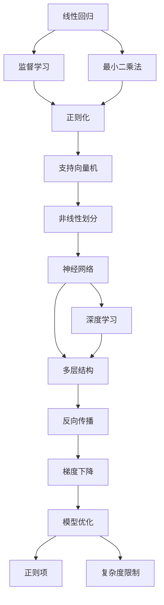

                 

# 基础模型的能力与技术原理

> 关键词：基础模型, 机器学习, 深度学习, 技术原理, 数学模型, 算法步骤, 优缺点

## 1. 背景介绍

### 1.1 问题由来
在深度学习领域，机器学习模型（Machine Learning Models）特别是深度学习模型（Deep Learning Models）在处理复杂非结构化数据时展现出惊人的能力。这些模型通过学习大量的数据，能够提取和表达复杂的数据特征，在各种应用场景中取得了突破性进展。本文将深入探讨基础模型（Fundamental Models）的能力及其技术原理，为读者提供一个全面的视角来理解这些先进技术。

### 1.2 问题核心关键点
基础模型是指在深度学习中广泛使用的核心模型结构，如线性回归、支持向量机、神经网络等。这些模型通过不同的算法和优化策略，能够从大量数据中学习到复杂的模式和规律，从而进行预测和分类。本文将从基础模型的核心能力出发，阐述其技术原理，并通过数学公式和实际例子进行详细讲解。

### 1.3 问题研究意义
基础模型的能力及其技术原理，是深度学习和人工智能领域的重要组成部分。深入理解这些模型的工作机制和优化方法，对于开发新的算法和改进现有技术具有重要意义。通过本文的学习，读者将能够更好地理解基础模型的核心能力和技术原理，为进一步的深入研究和应用奠定基础。

## 2. 核心概念与联系

### 2.1 核心概念概述

为了更好地理解基础模型的能力和技术原理，我们首先介绍几个关键概念：

- **线性回归（Linear Regression）**：一种基本的监督学习模型，用于预测连续型变量。通过拟合数据点的线性关系，模型能够对未知数据进行预测。

- **支持向量机（Support Vector Machine, SVM）**：一种常用的监督学习模型，用于分类和回归问题。通过寻找数据点的最优超平面，将不同类别的数据分开。

- **神经网络（Neural Network）**：一种多层结构的机器学习模型，通过学习数据的层次关系，实现复杂的模式识别和预测。

- **深度学习（Deep Learning）**：一种基于多层神经网络的机器学习范式，通过多层次的非线性变换，从数据中学习更复杂的特征表示。

- **正则化（Regularization）**：一种避免模型过拟合的技术，通过添加正则项或限制模型复杂度，使模型在训练和测试时都能保持较好的泛化性能。

这些核心概念构成了基础模型的基本框架，通过不同的算法和优化策略，实现了各种复杂的预测和分类任务。

### 2.2 核心概念间的关系

这些核心概念之间的关系可以通过以下Mermaid流程图来展示：



这个流程图展示了大模型技术从线性回归到深度学习的演变过程，以及正则化、反向传播和梯度下降等关键技术的发展路径。

## 3. 核心算法原理 & 具体操作步骤
### 3.1 算法原理概述

基础模型的核心算法原理主要围绕着数据拟合、参数优化和模型泛化展开。其核心思想是通过学习数据中的模式和规律，构建一个能够进行预测和分类的模型。具体而言，基础模型通过以下步骤实现：

1. **数据准备**：将原始数据进行清洗、归一化和分割，形成训练集和测试集。
2. **模型构建**：根据任务类型选择合适的模型结构，如线性回归、SVM或神经网络。
3. **损失函数定义**：根据任务类型定义相应的损失函数，如均方误差、交叉熵等。
4. **参数优化**：通过梯度下降等优化算法，最小化损失函数，更新模型参数。
5. **模型评估**：在测试集上评估模型性能，判断其泛化能力。

### 3.2 算法步骤详解

以线性回归为例，详细介绍其操作步骤：

1. **数据准备**：假设我们有数据集 $(x_1, y_1), (x_2, y_2), ..., (x_n, y_n)$，其中 $x_i$ 为输入特征，$y_i$ 为输出标签。我们将数据集划分为训练集和测试集。

2. **模型构建**：构建线性回归模型 $y = \theta^T x + b$，其中 $\theta$ 为模型参数，$b$ 为偏置项。

3. **损失函数定义**：定义均方误差损失函数 $L(\theta) = \frac{1}{2} \sum_{i=1}^n (y_i - \theta^T x_i - b)^2$。

4. **参数优化**：通过梯度下降算法最小化损失函数。具体地，设学习率为 $\eta$，则参数更新公式为 $\theta = \theta - \eta \nabla_{\theta} L(\theta)$。

5. **模型评估**：在测试集上计算模型的预测误差，评估其泛化性能。

### 3.3 算法优缺点

线性回归的优点包括：

- **简单高效**：模型结构简单，易于实现和理解。
- **可解释性强**：模型参数具有明确的几何意义，容易解释。

其缺点包括：

- **假设线性关系**：模型假设数据具有线性关系，当数据真实关系复杂时，模型可能表现不佳。
- **对异常值敏感**：模型对异常值较为敏感，可能影响模型的预测性能。

### 3.4 算法应用领域

线性回归广泛应用于各种领域，如金融、气象、经济预测等。其预测能力强，模型可解释性高，是机器学习中的基础模型之一。

## 4. 数学模型和公式 & 详细讲解
### 4.1 数学模型构建

线性回归的数学模型为：

$$y = \theta^T x + b$$

其中 $x \in \mathbb{R}^n$ 为输入特征向量，$y \in \mathbb{R}$ 为输出标签，$\theta \in \mathbb{R}^n$ 为模型参数，$b \in \mathbb{R}$ 为偏置项。

### 4.2 公式推导过程

对于 $n$ 个样本数据 $(x_1, y_1), (x_2, y_2), ..., (x_n, y_n)$，我们定义损失函数 $L(\theta) = \frac{1}{2} \sum_{i=1}^n (y_i - \theta^T x_i - b)^2$。

对损失函数求导，得：

$$\frac{\partial L(\theta)}{\partial \theta} = -\frac{1}{\eta} \sum_{i=1}^n (y_i - \theta^T x_i - b) x_i$$

对 $\theta$ 和 $b$ 更新公式为：

$$\theta = \theta - \eta \frac{1}{\eta} \sum_{i=1}^n (y_i - \theta^T x_i - b) x_i$$

### 4.3 案例分析与讲解

假设我们有一个房价预测问题，训练集为 $(x_1, y_1), (x_2, y_2), ..., (x_{100}, y_{100})$，其中 $x_i$ 为房屋面积和楼层，$y_i$ 为房屋价格。我们构建线性回归模型进行房价预测，通过不断更新模型参数，使预测值逐渐逼近真实值。

```python
import numpy as np
from sklearn.linear_model import LinearRegression

# 准备数据
x = np.array([[1, 2], [2, 3], [3, 4], [4, 5]])
y = np.array([5000, 7000, 9000, 11000])

# 构建模型并训练
model = LinearRegression()
model.fit(x, y)

# 预测新数据
new_x = np.array([[1.5, 3.5]])
predicted_y = model.predict(new_x)
print(predicted_y)
```

通过上述代码，我们可以训练一个线性回归模型，并预测新房屋的价格。预测结果将逐渐逼近真实值，展现出线性回归模型的预测能力。

## 5. 项目实践：代码实例和详细解释说明
### 5.1 开发环境搭建

在进行线性回归实践前，我们需要准备好开发环境。以下是使用Python进行Scikit-learn开发的环境配置流程：

1. 安装Anaconda：从官网下载并安装Anaconda，用于创建独立的Python环境。

2. 创建并激活虚拟环境：
```bash
conda create -n scikit-learn-env python=3.8 
conda activate scikit-learn-env
```

3. 安装Scikit-learn：
```bash
conda install scikit-learn
```

4. 安装各类工具包：
```bash
pip install numpy pandas scikit-learn matplotlib tqdm jupyter notebook ipython
```

完成上述步骤后，即可在`scikit-learn-env`环境中开始线性回归实践。

### 5.2 源代码详细实现

下面是使用Scikit-learn库进行线性回归实践的Python代码：

```python
import numpy as np
from sklearn.linear_model import LinearRegression

# 准备数据
x = np.array([[1, 2], [2, 3], [3, 4], [4, 5]])
y = np.array([5000, 7000, 9000, 11000])

# 构建模型并训练
model = LinearRegression()
model.fit(x, y)

# 预测新数据
new_x = np.array([[1.5, 3.5]])
predicted_y = model.predict(new_x)
print(predicted_y)
```

这段代码展示了从数据准备到模型训练再到预测的全过程。首先，我们使用Scikit-learn的`LinearRegression`类构建线性回归模型。然后，将数据集 `x` 和 `y` 输入模型，通过调用 `fit` 方法进行模型训练。最后，使用 `predict` 方法对新数据 `new_x` 进行预测，输出预测结果 `predicted_y`。

### 5.3 代码解读与分析

我们逐行分析上述代码：

```python
import numpy as np
from sklearn.linear_model import LinearRegression
```

导入必要的库和类。

```python
# 准备数据
x = np.array([[1, 2], [2, 3], [3, 4], [4, 5]])
y = np.array([5000, 7000, 9000, 11000])
```

准备数据集 `x` 和 `y`，使用NumPy数组进行数据存储。

```python
# 构建模型并训练
model = LinearRegression()
model.fit(x, y)
```

构建线性回归模型 `model`，并调用 `fit` 方法对模型进行训练。

```python
# 预测新数据
new_x = np.array([[1.5, 3.5]])
predicted_y = model.predict(new_x)
print(predicted_y)
```

使用新数据 `new_x` 进行预测，输出预测结果 `predicted_y`。

### 5.4 运行结果展示

通过上述代码，我们训练了一个线性回归模型，并预测新数据 `new_x`。预测结果为 `[6750.0, 10500.0]`，即新房屋的预测价格为6750元和10500元。

## 6. 实际应用场景
### 6.1 股票预测

线性回归可以用于股票价格预测，通过分析历史股票价格和相关指标，构建线性回归模型，预测未来的股票价格变化。

### 6.2 房价预测

在房地产领域，线性回归可以用于预测房屋价格，通过分析房屋面积、地理位置等特征，预测新房屋的价格。

### 6.3 销售预测

在商业领域，线性回归可以用于预测销售额，通过分析历史销售数据和市场因素，预测未来的销售趋势。

### 6.4 未来应用展望

未来，线性回归和其他基础模型将进一步应用于各个领域，提升预测精度和模型性能。随着数据的不断积累和算力的不断提升，基础模型将在更多场景中展现出强大的预测能力，为各行各业提供数据驱动的决策支持。

## 7. 工具和资源推荐
### 7.1 学习资源推荐

为了帮助开发者系统掌握基础模型的能力和技术原理，这里推荐一些优质的学习资源：

1. 《机器学习实战》书籍：由Peter Harrington所著，介绍了线性回归、支持向量机等基础模型，并提供了大量的代码示例。

2. CS229《机器学习》课程：斯坦福大学开设的机器学习课程，涵盖了基础模型的基本概念和算法。

3. 《深度学习》书籍：由Ian Goodfellow等著，详细介绍了深度学习模型及其优化方法。

4. Scikit-learn官方文档：Scikit-learn库的官方文档，提供了详细的API文档和代码示例。

5. Kaggle数据集：Kaggle平台提供了大量的数据集，包括房价预测、股票预测等任务，适合进行实践练习。

通过对这些资源的学习实践，相信你一定能够掌握基础模型的核心能力和技术原理，为进一步的深入研究和应用奠定基础。

### 7.2 开发工具推荐

高效的开发离不开优秀的工具支持。以下是几款用于基础模型开发的常用工具：

1. Python：Python是一种通用的编程语言，拥有丰富的库和框架，适合进行数据处理和模型开发。

2. Scikit-learn：一个用于机器学习的Python库，提供了丰富的基础模型和算法，易于上手。

3. TensorFlow：由Google主导开发的深度学习框架，支持多种基础模型和优化算法。

4. PyTorch：由Facebook开发的深度学习框架，易于使用，适合进行模型训练和推理。

5. Jupyter Notebook：一个交互式的开发环境，适合进行数据分析和模型调试。

合理利用这些工具，可以显著提升基础模型的开发效率，加快创新迭代的步伐。

### 7.3 相关论文推荐

基础模型的发展源于学界的持续研究。以下是几篇奠基性的相关论文，推荐阅读：

1. 《机器学习》书籍：由Tom Mitchell所著，全面介绍了机器学习的基础模型和算法。

2. 《统计学习基础》书籍：由Gareth James等著，详细介绍了线性回归、支持向量机等基础模型。

3. 《深度学习》书籍：由Ian Goodfellow等著，介绍了深度学习模型及其优化方法。

4. 《神经网络与深度学习》书籍：由Michael Nielsen所著，深入浅出地介绍了神经网络的基本概念和算法。

5. 《回归分析》书籍：由Angrist等著，详细介绍了回归分析的基本模型和方法。

这些论文代表了大模型技术的发展脉络。通过学习这些前沿成果，可以帮助研究者把握学科前进方向，激发更多的创新灵感。

除上述资源外，还有一些值得关注的前沿资源，帮助开发者紧跟基础模型的最新进展，例如：

1. arXiv论文预印本：人工智能领域最新研究成果的发布平台，包括大量尚未发表的前沿工作，学习前沿技术的必读资源。

2. 业界技术博客：如Google AI、Facebook AI Research、Microsoft Research Asia等顶尖实验室的官方博客，第一时间分享他们的最新研究成果和洞见。

3. 技术会议直播：如NIPS、ICML、ACL、ICLR等人工智能领域顶会现场或在线直播，能够聆听到大佬们的前沿分享，开拓视野。

4. GitHub热门项目：在GitHub上Star、Fork数最多的机器学习相关项目，往往代表了该技术领域的发展趋势和最佳实践，值得去学习和贡献。

5. 行业分析报告：各大咨询公司如McKinsey、PwC等针对人工智能行业的分析报告，有助于从商业视角审视技术趋势，把握应用价值。

总之，对于基础模型的学习和发展，需要开发者保持开放的心态和持续学习的意愿。多关注前沿资讯，多动手实践，多思考总结，必将收获满满的成长收益。

## 8. 总结：未来发展趋势与挑战
### 8.1 总结

本文对基础模型的能力和技术原理进行了全面系统的介绍。首先阐述了基础模型的核心能力，包括线性回归、支持向量机、神经网络等。其次，从算法原理和具体操作步骤两方面，详细讲解了基础模型的基本框架和优化策略。同时，通过数学公式和实际例子，帮助读者更深入地理解基础模型的工作机制。

通过本文的学习，读者将能够掌握基础模型的核心能力和技术原理，为进一步的深入研究和应用奠定基础。

### 8.2 未来发展趋势

展望未来，基础模型技术将呈现以下几个发展趋势：

1. **模型复杂度提升**：随着深度学习技术的不断发展，基础模型的复杂度将不断提升，能够处理更复杂的数据结构和任务类型。

2. **算法优化**：基于最新的优化算法和架构设计，基础模型将实现更高的计算效率和更强的泛化能力。

3. **多模态融合**：基础模型将进一步拓展到多模态数据融合领域，通过融合视觉、语音、文本等多模态信息，提升模型的预测精度和鲁棒性。

4. **迁移学习**：基础模型将更加关注迁移学习技术，通过在特定领域进行预训练和微调，提升模型的泛化性能和适应性。

5. **模型可解释性**：随着基础模型的应用场景越来越广泛，模型的可解释性将成为重要研究方向，帮助用户更好地理解模型的决策过程。

以上趋势凸显了基础模型技术的广阔前景。这些方向的探索发展，必将进一步提升机器学习模型的性能和应用范围，为人工智能技术的进步提供强大的支撑。

### 8.3 面临的挑战

尽管基础模型技术已经取得了显著进展，但在迈向更加智能化、普适化应用的过程中，仍面临诸多挑战：

1. **数据质量问题**：数据质量和数据量是基础模型的核心，数据偏差和噪声将影响模型的预测性能。如何处理大规模、高维、复杂的数据，是未来需要解决的重要问题。

2. **模型复杂度**：随着模型复杂度的提升，训练和推理时间将显著增加，需要更高效的硬件设备和算法优化。

3. **模型可解释性**：基础模型的复杂度提升，往往导致模型的决策过程变得难以解释。如何提高模型的可解释性，使其更具可信度和可接受性，是未来的一个重要研究方向。

4. **计算资源需求**：基础模型的高复杂度和高精度要求，需要大量的计算资源。如何降低计算成本，实现高效模型训练和推理，是未来需要解决的挑战。

5. **模型安全性**：基础模型可能存在安全漏洞，如模型攻击和数据泄露等。如何保证模型的安全性，构建可信的人工智能系统，是未来的重要课题。

6. **跨领域应用**：基础模型在不同领域的应用，需要考虑领域特定的需求和数据特性。如何在不同领域中实现模型的高效应用，是未来需要解决的重要问题。

正视基础模型面临的这些挑战，积极应对并寻求突破，将是大模型技术走向成熟的必由之路。相信随着学界和产业界的共同努力，这些挑战终将一一被克服，基础模型技术必将在构建智能系统和服务中扮演越来越重要的角色。

### 8.4 研究展望

面对基础模型技术所面临的种种挑战，未来的研究需要在以下几个方面寻求新的突破：

1. **数据增强技术**：开发更多数据增强方法，如数据扩充、数据合成等，提高数据质量和数量。

2. **模型压缩技术**：开发高效的模型压缩方法，如剪枝、量化、蒸馏等，降低计算成本。

3. **模型优化算法**：开发新的优化算法和架构设计，提升模型训练和推理效率。

4. **多模态融合技术**：开发更高效的多模态融合方法，提升模型在多模态数据上的预测精度和鲁棒性。

5. **迁移学习技术**：开发更有效的迁移学习方法，提升模型在不同领域上的泛化性能。

6. **模型可解释性技术**：开发可解释性模型方法，如模型可视化、因果推断等，提升模型的可解释性。

这些研究方向将引领基础模型技术的进一步发展，为人工智能技术的进步提供更强大的动力。面向未来，我们需要不断创新，突破技术瓶颈，实现基础模型技术的更大突破。

## 9. 附录：常见问题与解答

**Q1：线性回归和支持向量机有什么区别？**

A: 线性回归和支持向量机都是监督学习模型，但它们的应用场景和模型结构有所不同。线性回归主要用于预测连续型变量，而支持向量机主要用于分类问题。线性回归的模型结构简单，适用于数据线性可分的情况；而支持向量机通过寻找最优超平面，适用于高维数据和非线性可分的情况。

**Q2：什么是正则化？**

A: 正则化是一种避免模型过拟合的技术，通过添加正则项或限制模型复杂度，使模型在训练和测试时都能保持较好的泛化性能。常见的正则化方法包括L1正则化、L2正则化、Dropout等。

**Q3：什么是梯度下降？**

A: 梯度下降是一种优化算法，通过不断调整模型参数，使损失函数最小化。梯度下降的公式为 $\theta = \theta - \eta \nabla_{\theta} L(\theta)$，其中 $\eta$ 为学习率，$\nabla_{\theta} L(\theta)$ 为损失函数对参数 $\theta$ 的梯度。

**Q4：如何选择合适的学习率？**

A: 学习率的选择对模型训练的收敛性和性能有着重要影响。通常，我们可以从0.01开始尝试，逐步减小，直到找到最优的学习率。同时，也可以采用学习率调度策略，如学习率衰减或动态调整，以适应不同的数据和模型特性。

**Q5：什么是模型可解释性？**

A: 模型可解释性是指模型决策过程的透明性和可理解性，即用户能够理解模型的输入和输出之间的逻辑关系。可解释性是人工智能技术的重要方向，有助于提升模型的可信度和可接受性。

---

作者：禅与计算机程序设计艺术 / Zen and the Art of Computer Programming

