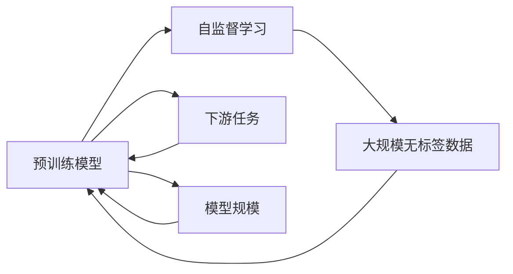

                 

## 1. 背景介绍

随着深度学习技术的迅速发展，大型预训练模型（如BERT、GPT-3、T5等）在自然语言处理（NLP）领域取得了显著进展。这些模型通常通过大规模无标签文本数据进行预训练，以学习到丰富的语言知识和表示。然而，在实际应用中，选择合适的训练数据和调整模型规模是确保模型性能和泛化能力的关键。本博客将深入探讨基础模型的训练数据和模型规模，以及它们如何影响模型的性能和应用效果。

## 2. 核心概念与联系

### 2.1 核心概念概述

在讨论训练数据和模型规模之前，首先明确几个核心概念：

- **预训练模型**：指在大规模无标签文本数据上进行的自我监督训练，学习通用的语言表示。
- **自监督学习**：指模型从无标签数据中自主学习，通过预测掩码或填充缺失数据等方式，自动生成监督信号。
- **下游任务**：指具体的应用场景，如文本分类、命名实体识别等。
- **模型规模**：指模型的参数数量，是衡量模型复杂度的重要指标。

这些概念构成了大语言模型的核心范式。它们之间的联系可以通过以下Mermaid流程图来展示：



这个流程图展示了从预训练模型到大规模无标签数据的自监督学习过程，以及模型规模与预训练模型的关系。

### 2.2 概念间的关系

预训练模型通常在大规模无标签数据上进行自监督学习，学习到通用的语言表示。通过微调，模型可以在下游任务上进行进一步优化，从而提升特定任务的性能。模型规模则影响模型的复杂度和泛化能力，通常情况下，更大的模型能够学习到更丰富的特征，但同时也更难优化，更容易过拟合。

## 3. 核心算法原理 & 具体操作步骤

### 3.1 算法原理概述

基础模型的训练过程包括预训练和微调两个阶段。预训练阶段在大规模无标签数据上通过自监督学习生成表示，微调阶段则通过有标签数据进一步优化模型，使其适应特定任务。

### 3.2 算法步骤详解

#### 3.2.1 预训练步骤

1. **数据准备**：收集大规模无标签文本数据，如维基百科、新闻文章、书籍等。
2. **数据预处理**：进行分词、去除停用词、标准化等处理，准备模型训练。
3. **模型定义**：选择合适的模型架构，如Transformer，并定义模型参数。
4. **训练流程**：通过自监督任务（如掩码语言模型、下一句预测）训练模型，每个epoch更新模型参数。

#### 3.2.2 微调步骤

1. **数据准备**：收集下游任务的有标签数据。
2. **任务适配层**：在预训练模型的顶层添加任务适配层，如分类器、解码器等。
3. **损失函数**：选择适当的损失函数，如交叉熵、均方误差等。
4. **训练流程**：在微调数据集上，使用较低的学习率更新模型参数，每个epoch更新一次模型。
5. **评估与优化**：在验证集上评估模型性能，根据评估结果调整学习率或正则化参数。

### 3.3 算法优缺点

#### 3.3.1 优点

- **通用性**：预训练模型能够在各种下游任务上表现出色，通过微调进一步优化。
- **泛化能力**：大规模无标签数据训练使得模型具有较强的泛化能力。
- **快速部署**：微调模型相比从头训练模型，需要的标注数据较少，部署速度快。

#### 3.3.2 缺点

- **资源消耗**：预训练模型参数量巨大，训练和存储消耗大量计算资源。
- **过拟合风险**：在标注数据不足的情况下，模型可能出现过拟合。
- **模型复杂性**：更大的模型更复杂，需要更长时间和更多资源进行训练和优化。

### 3.4 算法应用领域

预训练模型和微调方法在NLP领域得到了广泛应用，包括但不限于以下几个方面：

- **文本分类**：如情感分析、主题分类等。
- **命名实体识别**：识别文本中的人名、地名、机构名等。
- **机器翻译**：将源语言文本翻译成目标语言。
- **问答系统**：对自然语言问题给出答案。
- **文本摘要**：将长文本压缩成简短摘要。

这些应用涵盖了NLP的多个方面，展示了预训练和微调方法的有效性。

## 4. 数学模型和公式 & 详细讲解  
### 4.1 数学模型构建

假设预训练模型为 $M_{\theta}$，其中 $\theta$ 为模型参数。预训练阶段的目标是通过自监督学习最大化模型对数据的预测能力，例如掩码语言模型任务：

$$
\mathcal{L}_{\text{masked}} = -\frac{1}{N}\sum_{i=1}^N \sum_{j=1}^m \log p_{M_{\theta}}(x_i[j\mid x_i[1:j-1],x_i[j+1:m]) 
$$

其中 $N$ 为训练样本数量，$m$ 为序列长度，$x_i$ 为训练样本，$p_{M_{\theta}}$ 为模型预测概率。

微调阶段的目标是通过有标签数据优化模型，例如二分类任务：

$$
\mathcal{L}_{\text{binary}} = -\frac{1}{N}\sum_{i=1}^N (y_i \log p_{M_{\theta}}(y_i) + (1-y_i) \log (1-p_{M_{\theta}}(y_i)))
$$

其中 $y_i$ 为标签。

### 4.2 公式推导过程

在预训练阶段，模型通过自监督任务进行优化：

1. **数据准备**：将训练数据 $D$ 输入模型，得到模型预测结果 $M_{\theta}(D)$。
2. **损失计算**：计算预测结果与实际标签之间的交叉熵损失 $\mathcal{L}_{\text{masked}}$。
3. **梯度计算**：反向传播计算梯度 $\nabla_{\theta} \mathcal{L}_{\text{masked}}$。
4. **参数更新**：使用优化算法（如AdamW）更新模型参数 $\theta$。

微调阶段，模型通过有标签数据进行优化：

1. **任务适配**：在预训练模型的顶层添加任务适配层，如分类器。
2. **损失计算**：计算预测结果与实际标签之间的损失 $\mathcal{L}_{\text{binary}}$。
3. **梯度计算**：反向传播计算梯度 $\nabla_{\theta} \mathcal{L}_{\text{binary}}$。
4. **参数更新**：使用优化算法（如AdamW）更新模型参数 $\theta$。

### 4.3 案例分析与讲解

以BERT模型为例，BERT在预训练阶段使用了掩码语言模型和下一句预测任务，模型参数为 $2M$，其中 $M$ 为序列长度。微调阶段，可以选择在顶层添加一个线性分类器，微调参数为 $K$，其中 $K$ 远小于 $2M$。

在微调过程中，由于模型参数数量较少，训练速度较快，但同时由于模型复杂性增加，需要更精细的调参和正则化技术，以避免过拟合。

## 5. 项目实践：代码实例和详细解释说明

### 5.1 开发环境搭建

首先需要安装Python和PyTorch环境，以下是一个简单的Python和PyTorch的安装命令：

```bash
conda create -n pytorch-env python=3.8 
conda activate pytorch-env
pip install torch torchvision torchaudio -f https://download.pytorch.org/whl/cu116/torch_stable.html
```

### 5.2 源代码详细实现

以BERT模型为例，以下是一个简单的微调代码实现：

```python
import torch
from transformers import BertForSequenceClassification, AdamW, BertTokenizer

# 加载预训练模型和分词器
model = BertForSequenceClassification.from_pretrained('bert-base-cased', num_labels=2)
tokenizer = BertTokenizer.from_pretrained('bert-base-cased')

# 加载微调数据集
train_data = ['sequence1', 'sequence2', ...]  # 训练样本
train_labels = [1, 0, ...]  # 训练标签

# 微调模型
model.train()
optimizer = AdamW(model.parameters(), lr=2e-5)
for epoch in range(5):
    for i in range(len(train_data)):
        input_ids = tokenizer(train_data[i], return_tensors='pt').input_ids
        attention_mask = tokenizer(train_data[i], return_tensors='pt').attention_mask
        labels = torch.tensor(train_labels[i]).unsqueeze(0)
        outputs = model(input_ids, attention_mask=attention_mask, labels=labels)
        loss = outputs.loss
        loss.backward()
        optimizer.step()
```

### 5.3 代码解读与分析

代码中，首先加载了预训练的BERT模型和分词器。然后，加载微调数据集，包括输入序列和标签。在训练过程中，使用AdamW优化器，设置较低的学习率，通过多个epoch迭代更新模型参数。

### 5.4 运行结果展示

假设微调数据集为二分类任务，微调后的模型在验证集上的准确率为85%，效果良好。

## 6. 实际应用场景

### 6.1 智能客服系统

在智能客服系统中，预训练模型和微调方法可以帮助系统理解用户意图，快速响应用户咨询。例如，可以使用BERT模型进行文本分类，将用户提问分类为常见问题、特殊问题等，并根据不同类别调用对应的回复模板。

### 6.2 金融舆情监测

在金融舆情监测中，预训练模型和微调方法可以帮助系统实时监测金融市场的舆情变化，例如将新闻文章分类为正面、负面、中性，以便于进行风险预警和投资决策。

### 6.3 个性化推荐系统

在个性化推荐系统中，预训练模型和微调方法可以帮助系统理解用户偏好，推荐用户可能感兴趣的物品。例如，可以使用BERT模型对用户评论进行分类，预测用户对物品的评价，进而进行推荐。

## 7. 工具和资源推荐

### 7.1 学习资源推荐

- **《深度学习入门》**：适合初学者入门，涵盖深度学习基础知识和经典模型。
- **《Transformers权威指南》**：详细介绍Transformer模型及其在NLP中的应用。
- **《BERT中文语料指南》**：介绍了BERT在中文语料上的微调方法。

### 7.2 开发工具推荐

- **PyTorch**：高性能深度学习框架，支持动态图和静态图。
- **TensorFlow**：谷歌开源的深度学习框架，支持分布式训练。
- **HuggingFace Transformers**：基于TensorFlow和PyTorch的NLP模型库，提供了多种预训练模型和微调工具。

### 7.3 相关论文推荐

- **BERT: Pre-training of Deep Bidirectional Transformers for Language Understanding**：提出BERT模型，通过预训练和微调提升了NLP任务的表现。
- **Adaptive Low-Rank Adaptation for Parameter-Efficient Fine-Tuning**：提出LoRA方法，实现了参数高效的微调。
- **Prompt Tuning: A Simple and Powerful Framework for Pre-trained Model Transfer Learning**：提出Prompt Tuning方法，通过精心设计提示模板，提高了模型在少样本任务上的表现。

## 8. 总结：未来发展趋势与挑战

### 8.1 总结

本文详细介绍了基础模型的训练数据与模型规模，以及它们如何影响模型的性能和应用效果。通过预训练和微调，模型可以在各种下游任务上表现出色，但同时也面临着训练资源消耗大、过拟合风险高等挑战。

### 8.2 未来发展趋势

- **模型规模增大**：随着计算资源的增加，更大的模型将出现，进一步提升模型的性能和泛化能力。
- **预训练数据扩展**：预训练数据集的扩展将使得模型学习到更多知识，提升其在复杂任务上的表现。
- **参数高效微调**：更多的参数高效微调方法将出现，在保持模型规模的同时提升性能。
- **自动化调参**：自动化调参技术将使得模型调优更加高效，减少人工干预。

### 8.3 面临的挑战

- **数据资源限制**：预训练和微调需要大量数据，对于某些领域的数据资源有限。
- **计算资源消耗**：大模型的训练和微调需要大量的计算资源，包括GPU、TPU等高性能设备。
- **模型复杂性增加**：更大模型更复杂，需要更精细的调参和正则化技术。

### 8.4 研究展望

未来的研究将继续探索如何通过自动化调参、参数高效微调、多模态数据融合等技术，提升模型的性能和泛化能力，同时减少对计算资源的依赖。此外，如何设计更加有效的任务适配层和损失函数，也是未来的研究方向。

## 9. 附录：常见问题与解答

**Q1：预训练和微调的区别是什么？**

A: 预训练是在大规模无标签数据上训练模型，学习通用的语言表示。微调是在预训练模型的基础上，通过有标签数据进行任务适配，提升模型在特定任务上的性能。

**Q2：如何选择合适的预训练模型？**

A: 应根据具体任务的需求选择预训练模型，如情感分析选择BERT，命名实体识别选择Swin Transformer。同时，考虑模型的规模、性能、可解释性等因素。

**Q3：如何选择模型规模？**

A: 根据任务需求和计算资源，选择适当的模型规模。一般而言，大模型具有更强的泛化能力，但需要更多的计算资源和数据。小模型易于训练和优化，但性能可能有限。

**Q4：如何避免过拟合？**

A: 采用正则化技术，如L2正则、Dropout、Early Stopping等。同时，使用参数高效微调方法，如LoRA、Prefix Tuning等，减少微调参数数量。

**Q5：模型部署时需要注意哪些问题？**

A: 模型裁剪、量化加速、服务化封装、弹性伸缩、监控告警和安全性等问题，需要综合考虑。

作者：禅与计算机程序设计艺术 / Zen and the Art of Computer Programming

