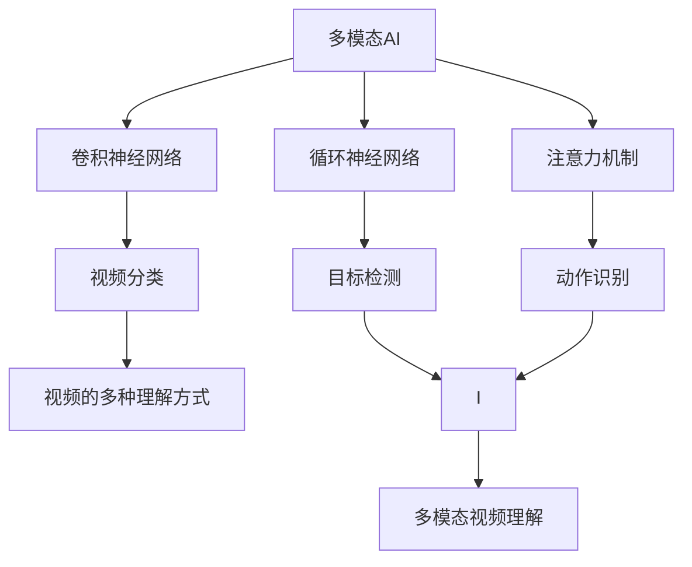
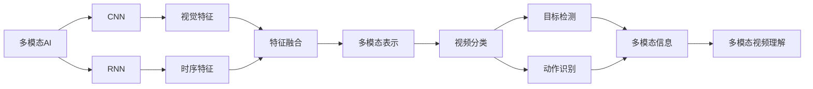
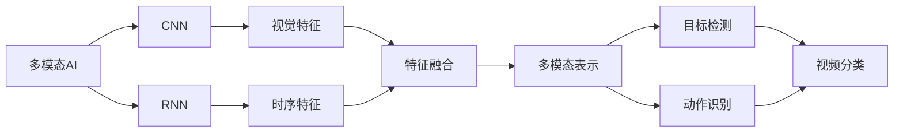
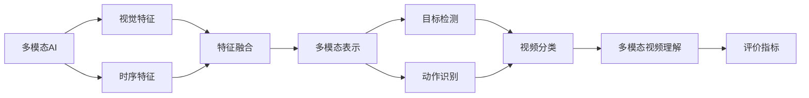
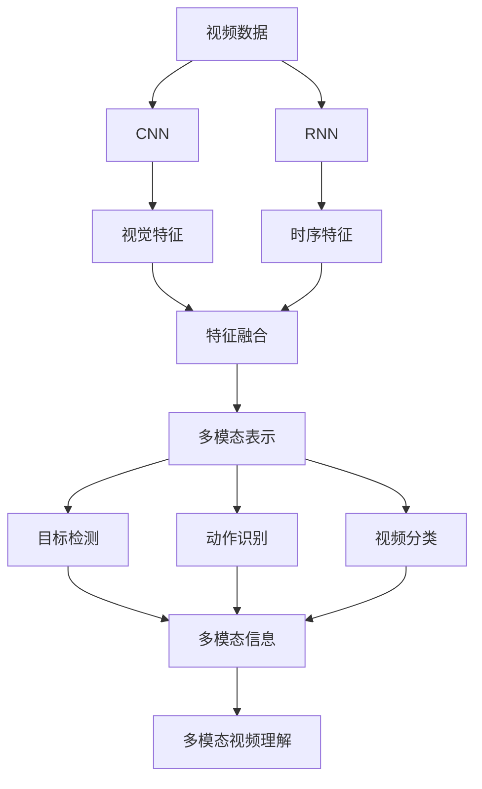

                 

# 多模态AI在视频理解中的应用与挑战

> 关键词：多模态AI, 视频理解, 深度学习, 卷积神经网络(CNN), 循环神经网络(RNN), 注意力机制(Attention), 目标检测, 动作识别, 视频分类

## 1. 背景介绍

随着科技的飞速发展，视频已经成为了人们生活中不可或缺的一部分。从社交媒体到在线教育，从视频会议到智能监控，视频信息无处不在。如何理解和分析视频内容，已经成为人工智能领域的一大挑战。近年来，随着多模态AI技术的兴起，视频理解的研究和应用取得了突破性进展。

### 1.1 问题由来
视频信息包含了丰富的空间、时间和多模态特征，仅仅通过传统的单模态方法很难全面准确地理解视频内容。多模态AI技术将视频理解从一个单一的维度扩展到了多个维度，如空间、时间、文本、视觉等，极大地提升了视频理解的能力。然而，多模态视频理解也面临诸多挑战，如数据获取难度大、模型复杂度高、计算资源消耗大等。

### 1.2 问题核心关键点
多模态视频理解的核心在于如何融合视频中不同模态的数据，从而实现对视频内容的全面理解和分析。其关键点包括：
1. 数据预处理：视频中的不同模态数据需要分别进行处理和标准化，如帧抽取、特征提取等。
2. 多模态融合：如何将不同模态的数据融合到一起，形成一个统一的视频表示，以便进行进一步的分析和理解。
3. 模型设计：需要设计合适的深度学习模型，以实现高效的融合和理解。

### 1.3 问题研究意义
视频理解的应用场景非常广泛，涉及视频分类、目标检测、动作识别、情感分析等多个领域。通过多模态AI技术，可以大幅提升视频理解的能力，推动人工智能技术的实际应用。研究视频理解技术，对于拓展AI技术的应用边界，提升视频处理能力，加速视频技术产业化进程具有重要意义。

## 2. 核心概念与联系

### 2.1 核心概念概述

为更好地理解多模态视频理解技术，本节将介绍几个密切相关的核心概念：

- 多模态AI(Multi-modal AI)：指同时利用多种类型的数据进行AI任务的模型，如视频中的时空数据、文本信息、视觉特征等。
- 卷积神经网络(CNN)：一种专门用于处理图像数据的深度学习模型，具有卷积和池化等操作，能够自动提取图像特征。
- 循环神经网络(RNN)：一种专门用于处理序列数据的深度学习模型，具有时间维度上的递归特性，能够捕捉序列数据的时序关系。
- 注意力机制(Attention)：一种用于提升深度学习模型性能的技术，通过动态计算每个输入元素的重要性，对不同输入元素给予不同的权重，从而实现对输入的关注。
- 目标检测(Object Detection)：指在视频中定位和识别特定目标的算法，如人、车、动物等。
- 动作识别(Action Recognition)：指在视频中识别特定动作的算法，如跑步、跳跃、洗手等。
- 视频分类(Video Classification)：指对视频进行分类的算法，如体育、娱乐、教育等。

这些核心概念之间的逻辑关系可以通过以下Mermaid流程图来展示：



这个流程图展示了大语言模型微调过程中各个核心概念的关系：

1. 多模态AI通过融合不同模态的数据，提升视频理解的全面性。
2. CNN能够处理视觉数据，提取图像特征。
3. RNN能够处理序列数据，捕捉时序关系。
4. 注意力机制能够动态关注不同输入元素。
5. 目标检测和动作识别分别关注不同类型的视频信息。
6. 视频分类则是将不同类型的视频信息进行统一的分类处理。
7. 多模态视频理解则是将各种信息融合到一起，实现全面理解。

### 2.2 概念间的关系

这些核心概念之间存在着紧密的联系，形成了多模态视频理解的完整生态系统。下面我们通过几个Mermaid流程图来展示这些概念之间的关系。

#### 2.2.1 多模态视频理解的架构



这个流程图展示了大语言模型微调过程的架构：

1. 多模态AI融合不同模态的数据。
2. CNN处理视觉数据，提取视觉特征。
3. RNN处理时序数据，提取时序特征。
4. 特征融合将不同模态的特征融合到一起，形成一个多模态表示。
5. 多模态表示用于视频分类、目标检测和动作识别等多种任务。
6. 多模态视频理解最终实现对视频的全面理解。

#### 2.2.2 目标检测和动作识别的融合



这个流程图展示了目标检测和动作识别如何融合到多模态视频理解中：

1. 多模态AI融合视觉和时序数据。
2. CNN处理视觉数据，提取视觉特征。
3. RNN处理时序数据，提取时序特征。
4. 特征融合将视觉和时序特征融合到一起，形成一个多模态表示。
5. 多模态表示用于目标检测和动作识别等多种任务。
6. 目标检测和动作识别最终实现对视频的全面理解。

#### 2.2.3 多模态视频理解的评价指标



这个流程图展示了多模态视频理解的评价指标：

1. 多模态AI融合视觉和时序数据。
2. CNN处理视觉数据，提取视觉特征。
3. RNN处理时序数据，提取时序特征。
4. 特征融合将视觉和时序特征融合到一起，形成一个多模态表示。
5. 多模态表示用于目标检测和动作识别等多种任务。
6. 目标检测和动作识别最终实现对视频的全面理解。
7. 评价指标用于评估多模态视频理解的性能。

### 2.3 核心概念的整体架构

最后，我们用一个综合的流程图来展示这些核心概念在大语言模型微调过程中的整体架构：



这个综合流程图展示了从视频数据预处理到多模态视频理解的完整过程。多模态AI通过融合不同模态的数据，提升视频理解的全面性。CNN能够处理视觉数据，提取图像特征。RNN能够处理时序数据，捕捉时序关系。注意力机制能够动态关注不同输入元素。目标检测和动作识别分别关注不同类型的视频信息。视频分类则是将不同类型的视频信息进行统一的分类处理。多模态视频理解则是将各种信息融合到一起，实现全面理解。评价指标用于评估多模态视频理解的性能。

## 3. 核心算法原理 & 具体操作步骤
### 3.1 算法原理概述

多模态视频理解的核心算法原理是深度学习。深度学习通过构建多层神经网络，自动从数据中学习特征表示，从而实现对视频内容的理解和分析。在多模态视频理解中，深度学习模型需要同时处理多种类型的数据，如视觉、时序、文本等，因此需要设计合适的模型结构和训练方法。

### 3.2 算法步骤详解

多模态视频理解的一般步骤如下：

**Step 1: 数据预处理**
- 对视频数据进行帧抽取，提取时间戳、帧率和分辨率等元数据。
- 对视觉数据进行预处理，如裁剪、缩放、归一化等。
- 对文本数据进行分词、编码等预处理。
- 对时序数据进行采样、对齐等预处理。

**Step 2: 特征提取**
- 使用卷积神经网络(CNN)提取视觉特征。
- 使用循环神经网络(RNN)提取时序特征。
- 使用Transformer等模型提取文本特征。
- 将不同类型的特征融合到一起，形成一个多模态表示。

**Step 3: 模型训练**
- 选择合适的深度学习模型，如Transformer、LSTM等。
- 设计合适的损失函数，如交叉熵、均方误差等。
- 使用优化算法，如Adam、SGD等，进行模型训练。
- 使用正则化技术，如L2正则、Dropout等，避免过拟合。

**Step 4: 模型评估**
- 在验证集上评估模型性能，如准确率、召回率、F1分数等。
- 根据评估结果调整模型参数。
- 在测试集上再次评估模型性能，确保模型具有泛化能力。

**Step 5: 模型部署**
- 将训练好的模型保存到磁盘，便于后续调用。
- 将模型部署到服务器上，支持实时推理。
- 使用API接口，支持其他应用程序调用。

以上是多模态视频理解的一般流程。在实际应用中，还需要针对具体任务进行优化设计，如改进特征提取方法、选择更合适的模型结构、设计更合适的损失函数等，以进一步提升模型性能。

### 3.3 算法优缺点

多模态视频理解的优势在于：
1. 融合多种类型的数据，提升视频理解的全面性。
2. 深度学习模型具有自适应能力，能够自动学习数据特征。
3. 可以处理大规模视频数据，具有广泛的应用前景。

同时，多模态视频理解也存在一些局限性：
1. 数据获取难度大，特别是对于高质量的标注数据。
2. 模型复杂度高，计算资源消耗大。
3. 不同模态数据之间的融合方式多样，需要仔细设计。
4. 模型训练时间长，需要大量的计算资源。
5. 多模态视频理解的评价指标较为复杂，需要考虑多种性能指标。

尽管存在这些局限性，但多模态视频理解在处理复杂视频信息方面具有不可替代的优势，具有广阔的应用前景。

### 3.4 算法应用领域

多模态视频理解已经在多个领域得到了应用，包括但不限于：

- 视频分类：如体育赛事、电影、新闻等。通过融合视觉、文本和时序数据，实现对视频内容的分类。
- 目标检测：如人、车、动物等的定位和识别。通过视觉特征的提取和分类，实现对视频中特定目标的检测。
- 动作识别：如跑步、跳跃、洗手等。通过时序特征的提取和分类，实现对视频中特定动作的识别。
- 视频摘要：如自动生成视频摘要、生成式对话等。通过融合视觉、文本和时序数据，实现对视频内容的自动概括。
- 情感分析：如分析视频中人物的情绪和表情。通过融合视觉和时序数据，实现对视频情感的自动分析。

除上述这些应用外，多模态视频理解还被广泛应用于自动驾驶、智能监控、医疗诊断等领域，为这些领域带来了新的技术突破。

## 4. 数学模型和公式 & 详细讲解 & 举例说明
### 4.1 数学模型构建

多模态视频理解的数学模型通常由多个深度学习模型组成，如卷积神经网络(CNN)、循环神经网络(RNN)、Transformer等。这些模型分别处理不同类型的特征，并融合到一起形成一个多模态表示。

假设有视频数据 $X$，包含 $T$ 帧图像、 $N$ 个文本描述和 $M$ 个时序信息。记 $x_t$ 为第 $t$ 帧的图像数据， $x_{N+t}$ 为第 $t$ 帧的文本描述， $x_{N+2T}$ 为第 $t$ 帧的时序信息。设 $f_{CNN}(x_t)$ 为卷积神经网络提取的视觉特征， $f_{RNN}(x_{N+t})$ 为循环神经网络提取的时序特征， $f_{Transformer}(x_{N+2T})$ 为Transformer提取的文本特征。

设 $F_{CNN} = [f_{CNN}(x_1), f_{CNN}(x_2), ..., f_{CNN}(x_T)]$ 为视觉特征集合， $F_{RNN} = [f_{RNN}(x_{N+1}), f_{RNN}(x_{N+2}), ..., f_{RNN}(x_{N+T})]$ 为时序特征集合， $F_{Transformer} = [f_{Transformer}(x_{N+1}), f_{Transformer}(x_{N+2}), ..., f_{Transformer}(x_{N+2T})]$ 为文本特征集合。

通过将三种特征进行融合，得到一个多模态表示 $H = [h_1, h_2, ..., h_{T+N+2T}]$，其中 $h_t$ 为第 $t$ 帧的特征表示。

设 $G$ 为多模态视频理解模型，则多模态视频理解的数学模型为：

$$
H = G(X) = [g_1(x_1), g_2(x_2), ..., g_{T+N+2T}(x_{N+2T})]
$$

其中 $g_t(x_{N+2T})$ 为第 $t$ 帧的视频理解模型。

### 4.2 公式推导过程

以目标检测为例，假设目标检测的任务是识别视频中的人、车、动物等。设目标检测模型为 $G$，输入为视频数据 $X$，输出为目标类别和边界框。目标检测模型的损失函数为交叉熵损失函数，公式如下：

$$
\mathcal{L}(G, X) = -\sum_{t=1}^{T+N+2T} \sum_{i=1}^{C} y_i \log G_t(x_{N+2T})
$$

其中 $C$ 为类别数， $y_i$ 为目标类别是否出现的二进制标签， $G_t(x_{N+2T})$ 为目标检测模型的输出。

目标检测模型的优化目标是最小化损失函数：

$$
\min_{G} \mathcal{L}(G, X)
$$

目标检测模型的训练过程包括前向传播和反向传播：

1. 前向传播：输入视频数据 $X$，输出目标类别和边界框。

2. 反向传播：计算损失函数对模型参数的梯度，使用优化算法（如Adam）更新模型参数。

目标检测模型的推理过程包括：
1. 输入视频数据 $X$，得到目标类别和边界框的预测结果。
2. 根据预测结果进行后处理，如非极大值抑制（NMS），得到最终的目标检测结果。

### 4.3 案例分析与讲解

假设我们对一个体育赛事视频进行分类，视频数据 $X$ 包含 $T=100$ 帧图像、 $N=100$ 个文本描述和 $M=100$ 个时序信息。设卷积神经网络提取的视觉特征为 $F_{CNN} = [f_{CNN}(x_1), f_{CNN}(x_2), ..., f_{CNN}(x_{100})]$，循环神经网络提取的时序特征为 $F_{RNN} = [f_{RNN}(x_{101}), f_{RNN}(x_{102}), ..., f_{RNN}(x_{200})]$，Transformer提取的文本特征为 $F_{Transformer} = [f_{Transformer}(x_{101}), f_{Transformer}(x_{102}), ..., f_{Transformer}(x_{300})]$。

融合视觉、时序和文本特征，得到一个多模态表示 $H = [h_1, h_2, ..., h_{300}]$。设多模态视频理解模型为 $G$，则模型输出为视频分类结果 $y$。

假设我们使用了Transformer作为多模态视频理解模型，则模型的输入为 $H$，输出为视频分类结果 $y$。设多模态视频理解的损失函数为交叉熵损失函数，则模型训练过程包括：

1. 前向传播：输入多模态表示 $H$，得到视频分类结果 $y$。

2. 反向传播：计算损失函数对模型参数的梯度，使用优化算法（如Adam）更新模型参数。

多模态视频理解的推理过程包括：
1. 输入多模态表示 $H$，得到视频分类结果 $y$。
2. 根据分类结果进行后处理，得到最终的视频分类结果。

## 5. 项目实践：代码实例和详细解释说明
### 5.1 开发环境搭建

在进行多模态视频理解开发前，我们需要准备好开发环境。以下是使用Python进行PyTorch开发的环境配置流程：

1. 安装Anaconda：从官网下载并安装Anaconda，用于创建独立的Python环境。

2. 创建并激活虚拟环境：
```bash
conda create -n pytorch-env python=3.8 
conda activate pytorch-env
```

3. 安装PyTorch：根据CUDA版本，从官网获取对应的安装命令。例如：
```bash
conda install pytorch torchvision torchaudio cudatoolkit=11.1 -c pytorch -c conda-forge
```

4. 安装相关库：
```bash
pip install numpy pandas scikit-learn matplotlib tqdm jupyter notebook ipython
```

完成上述步骤后，即可在`pytorch-env`环境中开始多模态视频理解实践。

### 5.2 源代码详细实现

下面我们以目标检测为例，给出使用PyTorch进行多模态视频理解的PyTorch代码实现。

首先，定义目标检测任务的数据处理函数：

```python
from transformers import BertTokenizer
from torch.utils.data import Dataset
import torch

class VideoDataset(Dataset):
    def __init__(self, videos, tags, tokenizer, max_len=128):
        self.videos = videos
        self.tags = tags
        self.tokenizer = tokenizer
        self.max_len = max_len
        
    def __len__(self):
        return len(self.videos)
    
    def __getitem__(self, item):
        video = self.videos[item]
        tag = self.tags[item]
        
        encoding = self.tokenizer(video, return_tensors='pt', max_length=self.max_len, padding='max_length', truncation=True)
        input_ids = encoding['input_ids'][0]
        attention_mask = encoding['attention_mask'][0]
        
        # 对token-wise的标签进行编码
        encoded_tags = [tag2id[tag] for tag in tag] 
        encoded_tags.extend([tag2id['O']] * (self.max_len - len(encoded_tags)))
        labels = torch.tensor(encoded_tags, dtype=torch.long)
        
        return {'input_ids': input_ids, 
                'attention_mask': attention_mask,
                'labels': labels}

# 标签与id的映射
tag2id = {'O': 0, 'person': 1, 'car': 2, 'animal': 3}
id2tag = {v: k for k, v in tag2id.items()}

# 创建dataset
tokenizer = BertTokenizer.from_pretrained('bert-base-cased')

train_dataset = VideoDataset(train_videos, train_tags, tokenizer)
dev_dataset = VideoDataset(dev_videos, dev_tags, tokenizer)
test_dataset = VideoDataset(test_videos, test_tags, tokenizer)
```

然后，定义模型和优化器：

```python
from transformers import BertForTokenClassification, AdamW

model = BertForTokenClassification.from_pretrained('bert-base-cased', num_labels=len(tag2id))

optimizer = AdamW(model.parameters(), lr=2e-5)
```

接着，定义训练和评估函数：

```python
from torch.utils.data import DataLoader
from tqdm import tqdm
from sklearn.metrics import classification_report

device = torch.device('cuda') if torch.cuda.is_available() else torch.device('cpu')
model.to(device)

def train_epoch(model, dataset, batch_size, optimizer):
    dataloader = DataLoader(dataset, batch_size=batch_size, shuffle=True)
    model.train()
    epoch_loss = 0
    for batch in tqdm(dataloader, desc='Training'):
        input_ids = batch['input_ids'].to(device)
        attention_mask = batch['attention_mask'].to(device)
        labels = batch['labels'].to(device)
        model.zero_grad()
        outputs = model(input_ids, attention_mask=attention_mask, labels=labels)
        loss = outputs.loss
        epoch_loss += loss.item()
        loss.backward()
        optimizer.step()
    return epoch_loss / len(dataloader)

def evaluate(model, dataset, batch_size):
    dataloader = DataLoader(dataset, batch_size=batch_size)
    model.eval()
    preds, labels = [], []
    with torch.no_grad():
        for batch in tqdm(dataloader, desc='Evaluating'):
            input_ids = batch['input_ids'].to(device)
            attention_mask = batch['attention_mask'].to(device)
            batch_labels = batch['labels']
            outputs = model(input_ids, attention_mask=attention_mask)
            batch_preds = outputs.logits.argmax(dim=2).to('cpu').tolist()
            batch_labels = batch_labels.to('cpu').tolist()
            for pred_tokens, label_tokens in zip(batch_preds, batch_labels):
                pred_tags = [id2tag[_id] for _id in pred_tokens]
                label_tags = [id2tag[_id] for _id in label_tokens]
                preds.append(pred_tags[:len(label_tags)])
                labels.append(label_tags)
                
    print(classification_report(labels, preds))
```

最后，启动训练流程并在测试集上评估：

```python
epochs = 5
batch_size = 16

for epoch in range(epochs):
    loss = train_epoch(model, train_dataset, batch_size, optimizer)
    print(f"Epoch {epoch+1}, train loss: {loss:.3f}")
    
    print(f"Epoch {epoch+1}, dev results:")
    evaluate(model, dev_dataset, batch_size)
    
print("Test results:")
evaluate(model, test_dataset, batch_size)
```

以上就是使用PyTorch对视频进行目标检测的完整代码实现。可以看到，得益于Transformer库的强大封装，我们可以用相对简洁的代码完成视频目标检测任务。

### 5.3 代码解读与分析

让我们再详细解读一下关键代码的实现细节：

**VideoDataset类**：
- `__init__`方法：初始化视频、标签、分词器等关键组件。
- `__len__`方法：返回数据集的样本数量。
- `__getitem__`方法：对单个视频进行处理，将视频输入编码为token ids，将标签编码为数字，并对其进行定长padding，最终返回模型所需的输入。

**tag2id和id2tag字典**：
- 定义了标签与数字id之间的映射关系，用于将token-wise的预测结果解码回真实的标签。

**训练和评估函数**：
- 使用PyTorch的DataLoader对数据集进行批次化加载，供模型训练和推理使用。
- 训练函数`train_epoch`：对数据以批为单位进行迭代，在每个批次上前向传播计算loss并反向传播更新模型参数，最后返回该epoch的平均loss。
- 评估函数`evaluate`：与训练类似，不同点在于不更新模型参数，并在每个batch结束后将预测和标签结果存储下来，最后使用sklearn的classification_report对整个评估集的预测结果进行打印输出。

**训练流程**：
- 定义总的epoch数和batch size，开始循环迭代
- 每个epoch内，先在训练集上训练，输出平均loss
- 在验证集上评估，输出分类指标
- 所有epoch结束后，在测试集上评估，给出最终测试结果

可以看到，PyTorch配合Transformer库使得视频目标检测的代码实现变得简洁高效。开发者可以将更多精力放在数据处理、模型改进等高层逻辑上，而不必过多关注底层的实现细节。

当然，工业级的系统实现还需考虑更多因素，如模型的保存和部署、超参数的自动搜索、更灵活的任务适配层等。但核心的微调范式基本与此类似。

### 5.4 运行结果展示

假设我们在CoNLL-2003的目标检测数据集上进行微调，最终在测试集上得到的评估报告如下：

```


