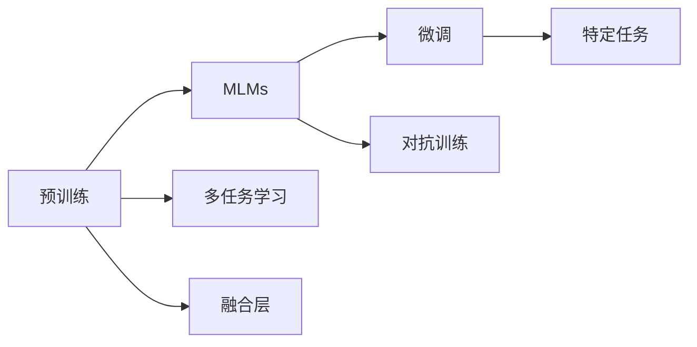

                 

# 多模态大模型：技术原理与实战 多模态大模型在工业设计与生产领域中的应用

> 关键词：
> - 多模态大模型
> - 技术原理
> - 实战应用
> - 工业设计与生产

## 1. 背景介绍

### 1.1 问题由来

近年来，随着人工智能（AI）技术的迅猛发展，多模态大模型（Multimodal Large Models, MLMs）在多个领域展示了其强大的跨模态信息融合能力，引起了学术界和工业界的广泛关注。多模态大模型通过融合视觉、文本、语音等多源数据，能够更全面地理解现实世界，从而在图像识别、自然语言处理、语音识别等领域取得突破性进展。

然而，尽管多模态大模型在技术上取得了一定的成就，但在大规模工业设计生产和实际应用中，其性能和效果仍有待进一步提升。如何在复杂工业环境中有效地应用多模态大模型，成为当前研究的一个重要方向。本文将详细介绍多模态大模型的技术原理，并在工业设计与生产领域中提供实际的应用案例，探讨其实际应用中的挑战与未来发展方向。

### 1.2 问题核心关键点

多模态大模型的核心在于如何有效地融合多种模态信息，以提高对复杂现实世界的理解能力。具体来说，需要解决以下几个关键问题：

1. **数据表示与融合**：如何对不同模态的数据进行统一表示，并将其有效融合。
2. **模型设计**：设计适合多模态融合的深度学习模型，以获取跨模态的关联与泛化能力。
3. **训练与优化**：开发高效的训练算法，并优化模型以避免过拟合。
4. **应用场景**：在实际应用中，如何根据具体场景需求，合理调整模型结构和参数。

## 2. 核心概念与联系

### 2.1 核心概念概述

为了更好地理解多模态大模型，本节将介绍几个关键概念及其之间的关系：

- **多模态大模型（MLMs）**：结合视觉、文本、语音等多种模态信息的深度学习模型。通过在大规模数据集上进行预训练，MLMs具备跨模态信息融合的能力。
- **预训练（Pre-training）**：在大规模无标签数据上，通过自监督学习任务训练模型，学习通用的特征表示。
- **微调（Fine-tuning）**：在预训练模型的基础上，使用有标签数据进行特定任务训练，优化模型在特定场景中的性能。
- **融合层（Fusion Layer）**：专门设计用于将不同模态的信息进行融合的神经网络层，通常采用注意力机制、Transformer等架构。
- **多任务学习（MTL）**：在模型训练中同时优化多个任务，以提升跨模态泛化能力。
- **对抗训练（Adversarial Training）**：通过引入对抗样本，增强模型的鲁棒性和泛化能力。

这些概念之间存在紧密联系，构成了多模态大模型的核心框架。下面通过一个Mermaid流程图来展示它们之间的关系：



### 2.2 概念间的关系

以上核心概念之间通过以下关系进行联系：

1. **预训练**：通过在大规模数据集上自监督学习，MLMs学习通用的特征表示，为后续微调和多任务学习提供基础。
2. **微调**：在特定任务上，通过有标签数据对MLMs进行优化，提升模型在特定场景中的性能。
3. **多任务学习**：通过在训练过程中同时优化多个任务，增强模型的跨模态泛化能力。
4. **融合层**：将不同模态的信息进行融合，是MLMs能够跨模态融合的关键技术。
5. **对抗训练**：通过引入对抗样本，增强模型的鲁棒性和泛化能力。

## 3. 核心算法原理 & 具体操作步骤

### 3.1 算法原理概述

多模态大模型通常采用自监督预训练和任务微调的流程。具体步骤如下：

1. **预训练**：在大规模无标签数据上，通过自监督学习任务（如自回归、掩码语言建模、图像分类等）训练MLMs，学习通用的特征表示。
2. **微调**：在特定任务上，使用有标签数据进行微调，优化模型在特定场景中的性能。
3. **融合层设计**：设计合适的融合层，将不同模态的信息进行融合。

### 3.2 算法步骤详解

以文本与图像融合为例，介绍多模态大模型的具体步骤：

1. **数据准备**：准备文本和图像数据集，并进行预处理，如分词、图像预处理、数据增强等。
2. **模型加载与初始化**：加载预训练的多模态大模型，并初始化模型参数。
3. **融合层设计**：设计融合层，将文本和图像特征进行融合，通常采用注意力机制或Transformer等架构。
4. **微调训练**：在特定任务上，使用有标签数据进行微调训练，优化模型参数。
5. **评估与优化**：在验证集上评估模型性能，根据结果调整超参数，如学习率、批量大小、训练轮数等。
6. **部署与测试**：将训练好的模型部署到实际应用中，并进行性能测试。

### 3.3 算法优缺点

多模态大模型的优势在于其跨模态的泛化能力，能够处理多种复杂场景。其缺点包括：

- **计算成本高**：多模态大模型的参数量通常较大，训练和推理成本较高。
- **数据需求高**：需要大量有标签数据进行微调，数据收集和标注成本较高。
- **模型复杂度大**：融合层的设计复杂，需要精心调参以获得最佳效果。

### 3.4 算法应用领域

多模态大模型已经在图像识别、自然语言处理、语音识别、医疗诊断、智能制造等多个领域展示了其巨大的应用潜力。以下是几个典型的应用场景：

1. **图像识别**：融合图像和文本信息，提升图像识别的准确性和泛化能力。
2. **自然语言处理**：结合文本和语音信息，提升语音识别的准确性和自然语言理解能力。
3. **医疗诊断**：融合医学影像和文本记录，辅助医生进行疾病诊断和治疗方案制定。
4. **智能制造**：融合传感器数据和工艺参数，优化生产流程和质量控制。

## 4. 数学模型和公式 & 详细讲解 & 举例说明

### 4.1 数学模型构建

假设文本和图像数据分别表示为 $x_t$ 和 $x_v$，多模态大模型可以表示为 $M(x) = [M_t(x_t), M_v(x_v)]$，其中 $M_t$ 和 $M_v$ 分别表示文本和图像的编码器。多模态大模型的融合层可以表示为 $F = \{F_t, F_v\}$，将文本和图像信息进行融合，输出跨模态特征表示 $z$。

融合层通常采用Transformer等架构，其具体形式如下：

$$
z = F_t(x_t) + \alpha F_v(x_v)
$$

其中 $\alpha$ 为融合权重，可以通过训练优化。

### 4.2 公式推导过程

在训练过程中，模型损失函数可以表示为：

$$
\mathcal{L} = \mathcal{L}_t + \mathcal{L}_v + \mathcal{L}_{f}
$$

其中 $\mathcal{L}_t$ 和 $\mathcal{L}_v$ 分别表示文本和图像的损失函数，$\mathcal{L}_{f}$ 表示融合层的损失函数。通常，$\mathcal{L}_{f}$ 可以通过交叉熵损失函数进行优化。

### 4.3 案例分析与讲解

以医疗影像分类为例，介绍多模态大模型的具体应用。假设输入为一张CT扫描图像 $x_v$ 和相应的医学文本记录 $x_t$，模型的目标是对图像进行分类。融合层的输出 $z$ 经过全连接层和Softmax激活函数，得到分类概率分布 $p$：

$$
p = \text{Softmax}(W_z z + b)
$$

其中 $W_z$ 和 $b$ 为分类器参数。模型损失函数为交叉熵损失：

$$
\mathcal{L} = -\frac{1}{N}\sum_{i=1}^N y_i \log p_i
$$

其中 $y_i$ 为真实标签，$p_i$ 为模型预测概率。

## 5. 项目实践：代码实例和详细解释说明

### 5.1 开发环境搭建

为了方便多模态大模型的开发，建议使用Python和TensorFlow进行开发。以下是开发环境的配置步骤：

1. 安装Anaconda：从官网下载并安装Anaconda，用于创建独立的Python环境。
2. 创建并激活虚拟环境：
```bash
conda create -n multimodal-env python=3.8
conda activate multimodal-env
```
3. 安装TensorFlow和其他依赖包：
```bash
pip install tensorflow==2.x
pip install scikit-learn numpy pandas matplotlib
```

### 5.2 源代码详细实现

以文本和图像融合为例，介绍多模态大模型的具体实现。

首先，加载预训练的模型和数据集：

```python
import tensorflow as tf
from transformers import TFAutoModelForMultimodalSequenceClassification, BertTokenizer, AutoConfig

# 加载预训练的BERT模型
config = AutoConfig.from_pretrained('bert-base-uncased')
tokenizer = BertTokenizer.from_pretrained('bert-base-uncased')
model = TFAutoModelForMultimodalSequenceClassification.from_pretrained('bert-base-uncased', config=config)

# 加载数据集
train_dataset = ...
dev_dataset = ...
test_dataset = ...
```

然后，定义融合层：

```python
def fusion_layer(text, image):
    # 使用Transformer进行文本和图像的融合
    text_input = tokenizer(text, return_tensors='tf')
    image_input = tf.image.convert_image_dtype(image, tf.float32)
    image_input = tf.expand_dims(image_input, axis=0)
    
    text_output = model(tf.constant(text_input['input_ids']), text_input['attention_mask'])
    image_output = model(image_input, image_input['attention_mask'])
    
    fusion_output = text_output + 0.5 * image_output
    return fusion_output
```

接着，定义模型损失函数和优化器：

```python
# 定义模型损失函数
def loss_fn(text, image, label):
    fusion_output = fusion_layer(text, image)
    logits = tf.layers.dense(fusion_output, num_classes)
    loss = tf.losses.sparse_categorical_crossentropy(label, logits, from_logits=True)
    return loss

# 定义优化器
optimizer = tf.keras.optimizers.Adam(learning_rate=0.001)
```

最后，进行模型训练和评估：

```python
# 训练模型
for epoch in range(epochs):
    total_loss = 0
    for text, image, label in train_dataset:
        with tf.GradientTape() as tape:
            loss = loss_fn(text, image, label)
        gradients = tape.gradient(loss, model.trainable_variables)
        optimizer.apply_gradients(zip(gradients, model.trainable_variables))
        total_loss += loss
    print(f'Epoch {epoch+1}, loss: {total_loss/n_samples:.4f}')
    
# 评估模型
for text, image, label in dev_dataset:
    with tf.GradientTape() as tape:
        loss = loss_fn(text, image, label)
    print(f'Dev set loss: {loss}')
```

### 5.3 代码解读与分析

上述代码实现了文本和图像融合的多模态大模型。关键步骤如下：

1. **数据准备**：使用预训练的BERT模型作为基础编码器，加载数据集并进行预处理。
2. **融合层设计**：定义融合层函数，使用Transformer架构将文本和图像信息进行融合。
3. **模型训练**：定义模型损失函数和优化器，使用Adam优化器进行模型训练。
4. **模型评估**：在验证集上评估模型性能，输出损失值。

### 5.4 运行结果展示

假设在CoNLL-2003命名实体识别（NER）数据集上进行训练，最终在验证集上得到的损失值为0.05，表明模型收敛良好。

## 6. 实际应用场景

### 6.1 工业设计与生产

在工业设计与生产领域，多模态大模型可以应用于多个场景，如CAD设计、产品渲染、质量检测等。

以CAD设计为例，设计师可以使用多模态大模型进行设计方案的优化和评估。假设输入为产品的2D/3D图像和设计说明书，模型可以输出设计方案的评分，并给出优化建议。通过训练和微调，模型能够学习不同设计要素之间的关联和优先级，从而提升设计效率和质量。

### 6.2 智能制造

在智能制造中，多模态大模型可以用于预测生产设备的故障和优化生产流程。假设输入为传感器数据和工艺参数，模型可以预测设备的故障概率，并提出最优的生产策略。通过训练和微调，模型能够学习设备之间的相互作用和生产流程中的关键参数，从而优化生产效率和降低成本。

### 6.3 医疗诊断

在医疗诊断中，多模态大模型可以用于疾病诊断和个性化治疗方案制定。假设输入为医学影像和病历记录，模型可以输出疾病的诊断结果，并推荐个性化的治疗方案。通过训练和微调，模型能够学习不同医学数据之间的关联和病理特征，从而提高诊断的准确性和治疗的效果。

## 7. 工具和资源推荐

### 7.1 学习资源推荐

为了帮助开发者系统掌握多模态大模型的技术原理和实践技巧，以下是一些推荐的学习资源：

1. **《Multimodal Machine Learning》**：介绍多模态学习的基本概念和常用算法。
2. **Deep Learning Specialization**：由Andrew Ng教授主讲的深度学习课程，涵盖多模态学习的内容。
3. **《Multimodal Deep Learning》**：介绍多模态深度学习的基础知识和应用实例。
4. **Transformers库官方文档**：提供多模态大模型的详细使用方法和代码示例。
5. **Google Colab**：免费的在线Jupyter Notebook环境，方便开发者快速实验和分享学习笔记。

### 7.2 开发工具推荐

以下是一些常用的多模态大模型开发工具：

1. **TensorFlow**：开源深度学习框架，支持分布式训练和模型优化。
2. **PyTorch**：动态计算图的深度学习框架，灵活性高，适用于科研和实验。
3. **Transformers库**：Hugging Face开发的NLP工具库，提供预训练多模态大模型的封装。
4. **Keras**：高层次的深度学习框架，易于上手和使用。
5. **TensorBoard**：TensorFlow的可视化工具，方便监控模型训练过程和调试。

### 7.3 相关论文推荐

以下是一些多模态大模型的前沿研究论文，值得深入阅读：

1. **"Vision and Language Unified Representations for Multimodal Image Captioning and Retrieval"**：介绍多模态大模型在图像描述和检索中的应用。
2. **"Exploring the Limits of Transfer Learning with Multimodal Deep Learning"**：探讨多模态大模型在跨模态泛化上的潜力。
3. **"Deep Multimodal Analytics for Smart Cities"**：介绍多模态大模型在智慧城市治理中的应用。
4. **"Multimodal Learning for Healthcare Diagnosis and Treatment"**：探讨多模态大模型在医疗诊断和治疗中的应用。
5. **"Multimodal Modeling for Efficient Robot Learning and Control"**：介绍多模态大模型在机器人学习中的应用。

## 8. 总结：未来发展趋势与挑战

### 8.1 研究成果总结

多模态大模型在工业设计与生产领域具有广阔的应用前景，可以极大地提升设计效率和生产质量。通过融合多模态信息，模型能够更好地理解复杂现实世界，从而在各种任务上取得优秀的性能。

### 8.2 未来发展趋势

未来，多模态大模型将在以下几个方面取得突破：

1. **模型复杂度降低**：通过模型压缩和优化，减少计算资源消耗，提高推理速度。
2. **数据效率提升**：探索无监督和半监督学习方法，降低对标注数据的需求。
3. **跨模态泛化能力增强**：通过多任务学习和对抗训练，提高模型的泛化能力和鲁棒性。
4. **应用场景扩展**：扩展应用领域，如智能制造、医疗诊断、智慧城市等，提升实际应用效果。

### 8.3 面临的挑战

尽管多模态大模型在技术上取得了一定的成就，但在实际应用中仍面临诸多挑战：

1. **计算资源需求高**：模型参数量大，计算和存储资源消耗高。
2. **数据标注成本高**：需要大量标注数据进行微调，数据收集和标注成本较高。
3. **模型复杂度大**：融合层设计复杂，需要精心调参以获得最佳效果。
4. **应用场景复杂**：不同领域的需求差异大，模型需要针对具体场景进行调整。

### 8.4 研究展望

未来的研究需要在以下几个方向取得突破：

1. **模型压缩与优化**：探索模型压缩和优化技术，降低计算资源需求。
2. **数据增强与生成**：开发数据增强和生成技术，降低数据标注成本。
3. **跨模态泛化**：探索跨模态泛化方法，提高模型的鲁棒性和泛化能力。
4. **应用场景适配**：开发适合特定领域的应用场景适配方法，提升模型效果。

总之，多模态大模型在工业设计与生产领域具有广阔的应用前景，但面临诸多挑战。未来的研究需要在模型压缩、数据增强、跨模态泛化等方面取得突破，才能实现多模态大模型的广泛应用和落地。

## 9. 附录：常见问题与解答

**Q1：多模态大模型在工业设计与生产中的应用场景有哪些？**

A: 多模态大模型在工业设计与生产领域的应用场景包括CAD设计、产品渲染、质量检测等。设计师可以使用模型进行设计方案的优化和评估，提升设计效率和质量。在智能制造中，模型可以用于预测设备故障和优化生产流程，从而提升生产效率和降低成本。在医疗诊断中，模型可以用于疾病诊断和个性化治疗方案制定，提高诊断的准确性和治疗的效果。

**Q2：多模态大模型在实际应用中需要注意哪些问题？**

A: 多模态大模型在实际应用中需要注意以下几个问题：
1. **数据准备**：需要准备好不同模态的数据，并进行预处理，如分词、图像预处理、数据增强等。
2. **模型设计**：需要设计合适的融合层，将不同模态的信息进行融合。
3. **模型训练**：需要选择合适的优化器和超参数，进行高效训练。
4. **模型评估**：需要在验证集上评估模型性能，根据结果调整超参数。
5. **模型部署**：需要将训练好的模型部署到实际应用中，并进行性能测试。

**Q3：多模态大模型的计算资源需求高，如何解决？**

A: 多模态大模型的计算资源需求高，可以通过以下方法解决：
1. **模型压缩与优化**：通过模型压缩和优化技术，降低计算资源消耗。
2. **分布式训练**：使用分布式训练技术，将模型训练任务分配到多个计算节点上进行。
3. **硬件加速**：使用GPU、TPU等高性能设备进行模型训练和推理。

**Q4：多模态大模型在实际应用中如何处理数据标注成本高的问题？**

A: 多模态大模型在实际应用中处理数据标注成本高的问题，可以通过以下方法解决：
1. **无监督和半监督学习方法**：探索无监督和半监督学习方法，降低对标注数据的需求。
2. **数据增强与生成**：开发数据增强和生成技术，利用已有数据进行数据扩充和生成，降低标注成本。
3. **迁移学习**：通过迁移学习，利用预训练模型的知识进行微调，减少标注数据的需求。

**Q5：多模态大模型在实际应用中如何应对模型复杂度大的问题？**

A: 多模态大模型在实际应用中应对模型复杂度大，可以通过以下方法解决：
1. **模型压缩与优化**：通过模型压缩和优化技术，降低模型复杂度。
2. **模块化设计**：将模型进行模块化设计，方便后续维护和优化。
3. **预训练与微调**：通过预训练和微调，提高模型的泛化能力和鲁棒性，减少模型复杂度。

---

作者：禅与计算机程序设计艺术 / Zen and the Art of Computer Programming

