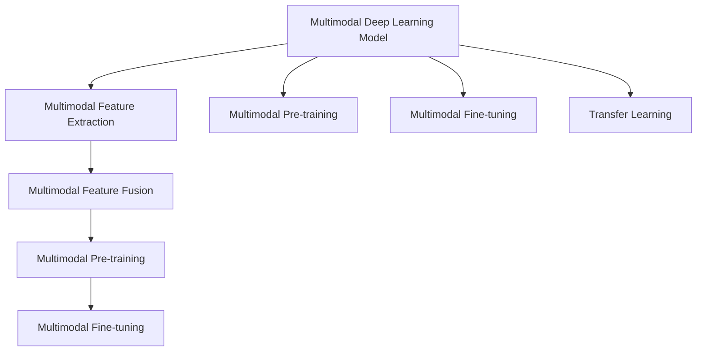
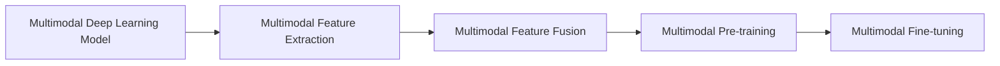
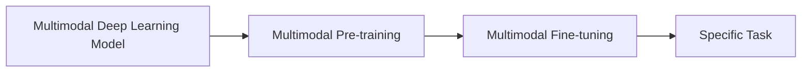
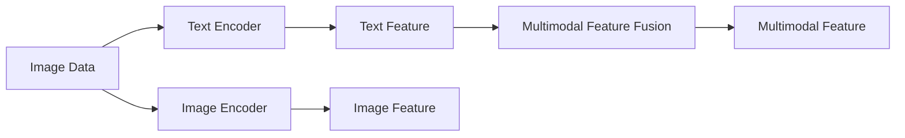
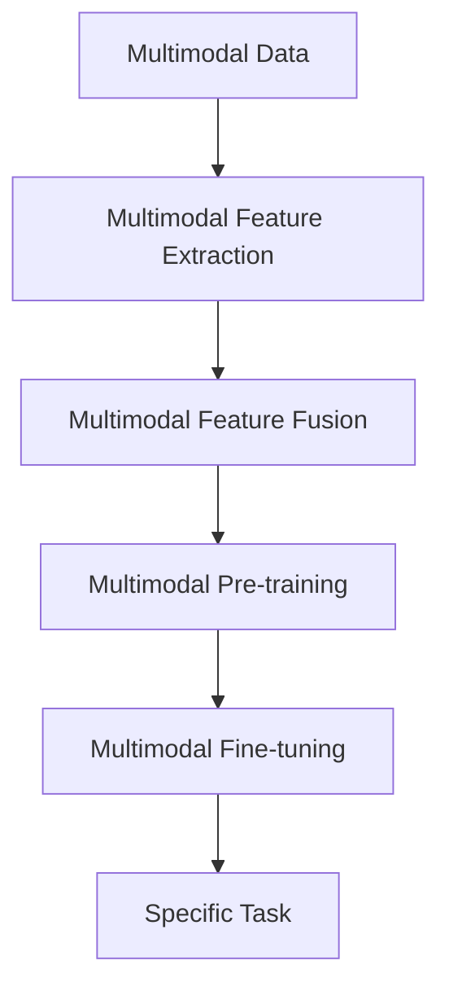

                 

# 多模态大模型：技术原理与实战 应用背景和待解决的问题

> 关键词：多模态大模型,迁移学习,大模型,深度学习,计算机视觉,自然语言处理,技术原理,实战应用,应用背景,待解决的问题

## 1. 背景介绍

### 1.1 问题由来
近年来，深度学习在计算机视觉、自然语言处理等领域取得了巨大突破，诞生了大量基于深度学习的预训练模型。例如，图像领域的ResNet、VGG等模型，语言领域的BERT、GPT等模型，这些模型通过在大量数据上进行预训练，学习到丰富的领域知识，表现出强大的泛化能力。

然而，传统的深度学习模型通常只关注单模态数据，难以融合和利用多模态数据的丰富信息。随着多模态数据的广泛应用，如医疗影像、自动驾驶、智能机器人等，融合多模态数据的深度学习模型变得越来越重要。为此，研究者们开始探索多模态深度学习模型，并取得了一定的进展。

### 1.2 问题核心关键点
多模态深度学习模型是指能够融合和处理多种类型数据（如文本、图像、语音等）的深度学习模型。其核心思想是通过迁移学习范式，在预训练和微调过程中，充分利用多模态数据的特征表示，提升模型在特定任务上的性能。多模态深度学习模型的构建依赖于以下几个关键点：

- 多模态特征提取：对不同类型的数据进行特征提取，获得可用于融合的特征表示。
- 多模态特征融合：通过某种方法将不同模态的特征进行融合，获得更全面的信息表示。
- 多模态预训练：在多模态数据上进行预训练，学习多模态间的通用特征表示。
- 多模态微调：针对特定任务进行微调，调整模型的参数，以适应新的数据分布。

目前，多模态深度学习模型已经在图像-文本联合推理、视觉问答、跨模态检索等多个任务上取得了显著的进展。然而，多模态深度学习模型仍面临诸多挑战，如数据标注成本高、特征提取复杂、多模态融合困难等。本文将详细探讨多模态深度学习模型的技术原理、实战应用和待解决的问题。

### 1.3 问题研究意义
研究多模态深度学习模型，对于拓展深度学习模型的应用范围，提升多模态数据融合的精度和效率，加速计算机视觉、自然语言处理等技术在实际应用中的落地，具有重要意义：

1. 降低应用开发成本。多模态深度学习模型能够充分利用多模态数据，减少从头开发所需的数据、计算和人力等成本投入。
2. 提升模型效果。多模态深度学习模型能够更好地融合多模态数据的丰富信息，提升模型在特定任务上的表现。
3. 加速开发进度。通过多模态深度学习模型，开发者可以更快地完成多模态任务适配，缩短开发周期。
4. 带来技术创新。多模态深度学习模型的研究，促进了跨领域深度学习、视觉语言推理等新的研究方向。
5. 赋能产业升级。多模态深度学习模型能够更好地适应复杂多变的多模态数据，为传统行业数字化转型升级提供新的技术路径。

## 2. 核心概念与联系

### 2.1 核心概念概述

为更好地理解多模态深度学习模型的技术原理与实战应用，本节将介绍几个密切相关的核心概念：

- 多模态深度学习模型(Multimodal Deep Learning Model)：指能够融合和处理多种类型数据（如文本、图像、语音等）的深度学习模型。通过多模态特征提取和融合，获得更全面的信息表示。
- 迁移学习(Transfer Learning)：指将一个领域学习到的知识，迁移应用到另一个不同但相关的领域的学习范式。多模态深度学习模型通常采用迁移学习范式，通过预训练和微调，学习多模态间的通用特征表示。
- 预训练(Pre-training)：指在大规模无标签数据上进行深度学习模型的预训练，学习通用特征表示。多模态深度学习模型通常先在多模态数据上进行预训练，学习多模态间的关联和差异。
- 多模态特征提取(Multimodal Feature Extraction)：指对不同类型的数据进行特征提取，获得可用于融合的特征表示。多模态特征提取是构建多模态深度学习模型的基础。
- 多模态特征融合(Multimodal Feature Fusion)：指通过某种方法将不同模态的特征进行融合，获得更全面的信息表示。多模态特征融合是构建多模态深度学习模型的关键。
- 多模态预训练(Multimodal Pre-training)：指在多模态数据上进行预训练，学习多模态间的通用特征表示。多模态预训练可以显著提升模型的泛化能力和迁移能力。
- 多模态微调(Multimodal Fine-tuning)：指针对特定任务进行微调，调整模型的参数，以适应新的数据分布。多模态微调是构建多模态深度学习模型的重要步骤。

这些核心概念之间的逻辑关系可以通过以下Mermaid流程图来展示：



这个流程图展示了大模型多模态深度学习模型的核心概念及其之间的关系：

1. 大模型通过多模态特征提取和融合，获得多模态特征表示。
2. 通过多模态预训练学习多模态间的通用特征表示。
3. 通过多模态微调调整模型参数，以适应特定任务。
4. 多模态深度学习模型采用迁移学习范式，通过预训练和微调，学习多模态间的关联和差异。

### 2.2 概念间的关系

这些核心概念之间存在着紧密的联系，形成了多模态深度学习模型的完整生态系统。下面我们通过几个Mermaid流程图来展示这些概念之间的关系。

#### 2.2.1 多模态深度学习模型的学习范式



这个流程图展示了多模态深度学习模型的学习范式：首先通过多模态特征提取和融合，获得多模态特征表示，然后进行多模态预训练学习多模态间的通用特征表示，最后通过多模态微调调整模型参数，以适应特定任务。

#### 2.2.2 迁移学习与多模态深度学习模型的关系



这个流程图展示了迁移学习与多模态深度学习模型的关系：首先通过多模态预训练学习多模态间的通用特征表示，然后进行多模态微调，调整模型参数，以适应特定的下游任务。

#### 2.2.3 多模态特征提取与融合



这个流程图展示了多模态特征提取与融合的过程：首先通过文本和图像编码器分别提取文本和图像特征，然后将它们进行融合，获得多模态特征表示。

### 2.3 核心概念的整体架构

最后，我们用一个综合的流程图来展示这些核心概念在大模型多模态深度学习模型的微调过程中的整体架构：



这个综合流程图展示了从预训练到微调，再到特定任务应用的完整过程。多模态深度学习模型首先在大规模多模态数据上进行预训练，然后通过多模态微调调整模型参数，以适应新的数据分布，最后应用于特定任务。

## 3. 核心算法原理 & 具体操作步骤
### 3.1 算法原理概述

多模态深度学习模型采用迁移学习范式，通过预训练和微调，学习多模态间的通用特征表示。其核心思想是：将预训练的多模态深度学习模型视作一个强大的"特征提取器"，通过在多模态数据上进行有监督的微调，使得模型输出能够匹配多模态数据的联合分布，从而获得针对特定任务优化的模型。

形式化地，假设预训练多模态深度学习模型为 $M_{\theta}$，其中 $\theta$ 为预训练得到的模型参数。给定多模态数据集 $D=\{(x_i, y_i)\}_{i=1}^N$，多模态微调的目标是找到新的模型参数 $\hat{\theta}$，使得：

$$
\hat{\theta}=\mathop{\arg\min}_{\theta} \mathcal{L}(M_{\theta},D)
$$

其中 $\mathcal{L}$ 为针对任务 $T$ 设计的损失函数，用于衡量模型预测输出与真实标签之间的差异。常见的损失函数包括交叉熵损失、均方误差损失等。

通过梯度下降等优化算法，多模态微调过程不断更新模型参数 $\theta$，最小化损失函数 $\mathcal{L}$，使得模型输出逼近真实标签。由于 $\theta$ 已经通过预训练获得了较好的初始化，因此即便在多模态数据集 $D$ 上进行微调，也能较快收敛到理想的模型参数 $\hat{\theta}$。

### 3.2 算法步骤详解

多模态深度学习模型采用迁移学习范式，通过预训练和微调，学习多模态间的通用特征表示。其核心步骤包括：

**Step 1: 准备预训练模型和数据集**
- 选择合适的预训练多模态深度学习模型 $M_{\theta}$ 作为初始化参数，如ResNet+BERT模型等。
- 准备多模态数据集 $D$，划分为训练集、验证集和测试集。一般要求多模态数据与预训练数据的分布不要差异过大。

**Step 2: 添加任务适配层**
- 根据任务类型，在预训练模型顶层设计合适的输出层和损失函数。
- 对于分类任务，通常在顶层添加线性分类器和交叉熵损失函数。
- 对于生成任务，通常使用语言模型的解码器输出概率分布，并以负对数似然为损失函数。

**Step 3: 设置微调超参数**
- 选择合适的优化算法及其参数，如 AdamW、SGD 等，设置学习率、批大小、迭代轮数等。
- 设置正则化技术及强度，包括权重衰减、Dropout、Early Stopping 等。
- 确定冻结预训练参数的策略，如仅微调顶层，或全部参数都参与微调。

**Step 4: 执行梯度训练**
- 将训练集数据分批次输入模型，前向传播计算损失函数。
- 反向传播计算参数梯度，根据设定的优化算法和学习率更新模型参数。
- 周期性在验证集上评估模型性能，根据性能指标决定是否触发 Early Stopping。
- 重复上述步骤直到满足预设的迭代轮数或 Early Stopping 条件。

**Step 5: 测试和部署**
- 在测试集上评估微调后模型 $M_{\hat{\theta}}$ 的性能，对比微调前后的精度提升。
- 使用微调后的模型对新样本进行推理预测，集成到实际的应用系统中。
- 持续收集新的数据，定期重新微调模型，以适应数据分布的变化。

以上是多模态深度学习模型微调的一般流程。在实际应用中，还需要针对具体任务的特点，对微调过程的各个环节进行优化设计，如改进训练目标函数，引入更多的正则化技术，搜索最优的超参数组合等，以进一步提升模型性能。

### 3.3 算法优缺点

多模态深度学习模型采用迁移学习范式，通过预训练和微调，学习多模态间的通用特征表示。其优点和缺点如下：

**优点：**
1. 简单高效。只需准备少量标注数据，即可对预训练模型进行快速适配，获得较大的性能提升。
2. 通用适用。适用于各种多模态数据融合任务，设计简单的任务适配层即可实现微调。
3. 参数高效。利用参数高效微调技术，在固定大部分预训练参数的情况下，仍可取得不错的提升。
4. 效果显著。在学术界和工业界的诸多任务上，多模态深度学习模型已经刷新了最先进的性能指标。

**缺点：**
1. 依赖标注数据。微调的效果很大程度上取决于标注数据的质量和数量，获取高质量标注数据的成本较高。
2. 迁移能力有限。当目标任务与预训练数据的分布差异较大时，微调的性能提升有限。
3. 负面效果传递。预训练模型的固有偏见、有害信息等，可能通过微调传递到下游任务，造成负面影响。
4. 可解释性不足。微调模型的决策过程通常缺乏可解释性，难以对其推理逻辑进行分析和调试。

尽管存在这些局限性，但就目前而言，多模态深度学习模型微调方法仍然是大数据融合任务的重要范式。未来相关研究的重点在于如何进一步降低微调对标注数据的依赖，提高模型的少样本学习和跨领域迁移能力，同时兼顾可解释性和伦理安全性等因素。

### 3.4 算法应用领域

多模态深度学习模型微调方法已经在计算机视觉、自然语言处理、语音处理等多个领域得到广泛应用，覆盖了几乎所有常见任务，例如：

- 视觉问答：根据图片内容回答自然语言问题。通过预训练视觉和语言模型，在多模态数据上进行微调，学习视觉-语言映射。
- 图像描述生成：根据图片生成自然语言描述。通过预训练图像和语言模型，在多模态数据上进行微调，学习图像-语言映射。
- 跨模态检索：在多模态数据集中，检索出与查询样本最相似的样本。通过预训练视觉和语言模型，在多模态数据上进行微调，学习多模态相似度计算。
- 机器人交互：使机器人能够与人类自然交互。通过预训练视觉、语言和语音模型，在多模态数据上进行微调，学习多模态交互策略。

除了上述这些经典任务外，多模态深度学习模型微调也被创新性地应用到更多场景中，如可控图像生成、智能安防、智慧医疗等，为多模态数据融合技术带来了全新的突破。随着预训练模型和微调方法的不断进步，相信多模态深度学习模型微调将在更广阔的应用领域大放异彩。

## 4. 数学模型和公式 & 详细讲解 & 举例说明

### 4.1 数学模型构建

本节将使用数学语言对多模态深度学习模型微调过程进行更加严格的刻画。

记多模态深度学习模型为 $M_{\theta}:\mathcal{X} \times \mathcal{Y} \rightarrow \mathcal{Z}$，其中 $\mathcal{X}$ 和 $\mathcal{Y}$ 分别为输入和输出空间，$\mathcal{Z}$ 为输出空间，$\theta \in \mathbb{R}^d$ 为模型参数。假设微调任务的训练集为 $D=\{(x_i, y_i)\}_{i=1}^N$，其中 $x_i = (x_{i,1}, x_{i,2})$，$x_{i,1}$ 为文本输入，$x_{i,2}$ 为图像输入，$y_i \in \mathcal{Z}$ 为输出标签。

定义模型 $M_{\theta}$ 在数据样本 $(x,y)$ 上的损失函数为 $\ell(M_{\theta}(x),y)$，则在数据集 $D$ 上的经验风险为：

$$
\mathcal{L}(\theta) = \frac{1}{N} \sum_{i=1}^N \ell(M_{\theta}(x_i),y_i)
$$

其中，$\ell$ 为针对任务 $T$ 设计的损失函数，用于衡量模型预测输出与真实标签之间的差异。常见的损失函数包括交叉熵损失、均方误差损失等。

多模态微调的优化目标是最小化经验风险，即找到最优参数：

$$
\theta^* = \mathop{\arg\min}_{\theta} \mathcal{L}(\theta)
$$

在实践中，我们通常使用基于梯度的优化算法（如SGD、Adam等）来近似求解上述最优化问题。设 $\eta$ 为学习率，$\lambda$ 为正则化系数，则参数的更新公式为：

$$
\theta \leftarrow \theta - \eta \nabla_{\theta}\mathcal{L}(\theta) - \eta\lambda\theta
$$

其中 $\nabla_{\theta}\mathcal{L}(\theta)$ 为损失函数对参数 $\theta$ 的梯度，可通过反向传播算法高效计算。

### 4.2 公式推导过程

以下我们以视觉问答任务为例，推导交叉熵损失函数及其梯度的计算公式。

假设模型 $M_{\theta}$ 在输入 $(x,y)$ 上的输出为 $\hat{z}=M_{\theta}(x,y) \in [0,1]$，表示样本属于类别 $z$ 的概率。真实标签 $y \in \{1,2,\ldots,K\}$。则交叉熵损失函数定义为：

$$
\ell(M_{\theta}(x,y),y) = -y\log \hat{z} + (1-y)\log (1-\hat{z})
$$

将其代入经验风险公式，得：

$$
\mathcal{L}(\theta) = -\frac{1}{N}\sum_{i=1}^N [y_i\log M_{\theta}(x_{i,1},x_{i,2})+(1-y_i)\log(1-M_{\theta}(x_{i,1},x_{i,2}))]
$$

根据链式法则，损失函数对参数 $\theta_k$ 的梯度为：

$$
\frac{\partial \mathcal{L}(\theta)}{\partial \theta_k} = -\frac{1}{N}\sum_{i=1}^N (\frac{y_i}{M_{\theta}(x_{i,1},x_{i,2})}-\frac{1-y_i}{1-M_{\theta}(x_{i,1},x_{i,2})}) \frac{\partial M_{\theta}(x_{i,1},x_{i,2})}{\partial \theta_k}
$$

其中 $\frac{\partial M_{\theta}(x_{i,1},x_{i,2})}{\partial \theta_k}$ 可进一步递归展开，利用自动微分技术完成计算。

在得到损失函数的梯度后，即可带入参数更新公式，完成模型的迭代优化。重复上述过程直至收敛，最终得到适应下游任务的最优模型参数 $\theta^*$。

## 5. 项目实践：代码实例和详细解释说明
### 5.1 开发环境搭建

在进行多模态深度学习模型微调实践前，我们需要准备好开发环境。以下是使用Python进行PyTorch开发的环境配置流程：

1. 安装Anaconda：从官网下载并安装Anaconda，用于创建独立的Python环境。

2. 创建并激活虚拟环境：
```bash
conda create -n pytorch-env python=3.8 
conda activate pytorch-env
```

3. 安装PyTorch：根据CUDA版本，从官网获取对应的安装命令。例如：
```bash
conda install pytorch torchvision torchaudio cudatoolkit=11.1 -c pytorch -c conda-forge
```

4. 安装Transformers库：
```bash
pip install transformers
```

5. 安装各类工具包：
```bash
pip install numpy pandas scikit-learn matplotlib tqdm jupyter notebook ipython
```

完成上述步骤后，即可在`pytorch-env`环境中开始多模态深度学习模型微调实践。

### 5.2 源代码详细实现

下面我们以跨模态检索任务为例，给出使用Transformers库对ResNet+BERT模型进行微调的PyTorch代码实现。

首先，定义跨模态检索任务的数据处理函数：

```python
from transformers import ResNetForFeature, BertForTokenClassification, AdamW
from torch.utils.data import Dataset, DataLoader
import torch

class MultiModalDataset(Dataset):
    def __init__(self, texts, images, labels, tokenizer, resnet_model):
        self.texts = texts
        self.images = images
        self.labels = labels
        self.tokenizer = tokenizer
        self.resnet_model = resnet_model
        
    def __len__(self):
        return len(self.texts)
    
    def __getitem__(self, item):
        text = self.texts[item]
        image = self.images[item]
        label = self.labels[item]
        
        encoding = self.tokenizer(text, return_tensors='pt', padding='max_length', truncation=True)
        resnet_features = self.resnet_model(image, return_dict=True).pooler_output
        input_ids = encoding['input_ids'][0]
        attention_mask = encoding['attention_mask'][0]
        
        # 对token-wise的标签进行编码
        encoded_labels = [label2id[label] for label in label]
        encoded_labels.extend([label2id['O']] * (len(encoded_labels) - len(label)))
        labels = torch.tensor(encoded_labels, dtype=torch.long)
        
        return {'input_ids': input_ids, 
                'attention_mask': attention_mask,
                'labels': labels,
                'resnet_features': resnet_features}

# 标签与id的映射
label2id = {'O': 0, 'C0': 1, 'C1': 2, 'C2': 3, 'C3': 4, 'C4': 5, 'C5': 6, 'C6': 7, 'C7': 8, 'C8': 9, 'C9': 10}
id2label = {v: k for k, v in label2id.items()}

# 创建dataset
tokenizer = BertTokenizer.from_pretrained('bert-base-cased')
resnet_model = ResNetForFeature.from_pretrained('resnet50', output_hidden_states=True)

train_dataset = MultiModalDataset(train_texts, train_images, train_labels, tokenizer, resnet_model)
dev_dataset = MultiModalDataset(dev_texts, dev_images, dev_labels, tokenizer, resnet_model)
test_dataset = MultiModalDataset(test_texts, test_images, test_labels, tokenizer, resnet_model)
```

然后，定义模型和优化器：

```python
model = BertForTokenClassification.from_pretrained('bert-base-cased', num_labels=len(label2id))

optimizer = AdamW(model.parameters(), lr=2e-5)
```

接着，定义训练和评估函数：

```python
device = torch.device('cuda') if torch.cuda.is_available() else torch.device('cpu')
model.to(device)

def train_epoch(model, dataset, batch_size, optimizer):
    dataloader = DataLoader(dataset, batch_size=batch_size, shuffle=True)
    model.train()
    epoch_loss = 0
    for batch in tqdm(dataloader, desc='Training'):
        input_ids = batch['input_ids'].to(device)
        attention_mask = batch['attention_mask'].to(device)
        labels = batch['labels'].to(device)
        resnet_features = batch['resnet_features'].to(device)
        model.zero_grad()
        outputs = model(input_ids, attention_mask=attention_mask, resnet_features=resnet_features, labels=labels)
        loss = outputs.loss
        epoch_loss += loss.item()
        loss.backward()
        optimizer.step()
    return epoch_loss / len(dataloader)

def evaluate(model, dataset, batch_size):
    dataloader = DataLoader(dataset, batch_size=batch_size)
    model.eval()
    preds, labels = [], []
    with torch.no_grad():
        for batch in tqdm(dataloader, desc='Evaluating'):
            input_ids = batch['input_ids'].to(device)
            attention_mask = batch['attention_mask'].to(device)
            resnet_features = batch['resnet_features'].to(device)
            batch_labels = batch['labels']
            outputs = model(input_ids, attention_mask=attention_mask, resnet_features=resnet_features)
            batch_preds = outputs.logits.argmax(dim=2).to('cpu').tolist()
            batch_labels = batch_labels.to('cpu').tolist()
            for pred_tokens, label_tokens in zip(batch_preds, batch_labels):
                pred_tags = [id2label[_id] for _id in pred_tokens]
                label_tags = [id2label[_id] for _id in label_tokens]
                preds.append(pred_tags[:len(label_tokens)])
                labels.append(label_tags)
                
    print(classification_report(labels, preds))
```

最后，启动训练流程并在测试集上评估：

```python
epochs = 5
batch_size = 16

for epoch in range(epochs):
    loss = train_epoch(model, train_dataset, batch_size, optimizer)
    print(f"Epoch {epoch+1}, train loss: {

