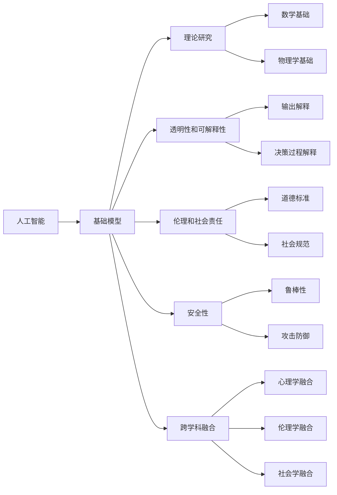
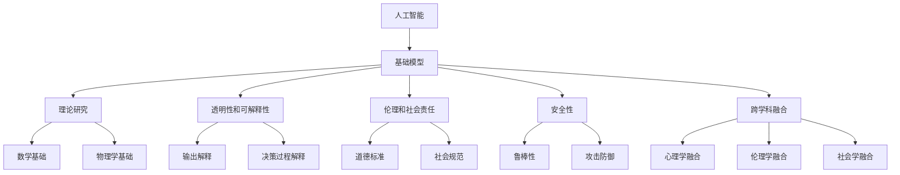

                 

# 大学在基础模型中的研究使命

> 关键词：人工智能,基础模型,研究使命,计算机科学,学术研究

## 1. 背景介绍

### 1.1 问题由来

人工智能（AI）作为现代科学的重要分支，正深刻地改变着各行各业的发展格局。从自动驾驶、工业自动化到个性化推荐、智能医疗，AI在各领域的应用正在逐步成熟，并带来显著的经济和社会效益。然而，在AI技术快速发展的同时，也存在一些亟需解决的挑战。例如，如何提升AI模型的透明性和可解释性，如何缓解AI算法的偏见和歧视问题，如何构建更加安全可靠的AI系统等。这些问题不仅需要从工程和技术层面进行应对，更需要从基础科学的角度深入研究。

在此背景下，大学作为国家创新体系的重要组成部分，肩负着基础科学研究的使命。通过在大学中加强基础AI模型研究，不仅能够促进AI技术的长远发展，也能够为行业应用提供更加坚实的理论基础。本文将详细探讨大学在基础模型研究中的使命，以及如何通过学术研究和教育培养，推动AI技术的持续进步。

### 1.2 问题核心关键点

大学在基础模型研究中的核心使命包括以下几个方面：

- **基础理论研究**：探索AI模型的底层原理和数学基础，为AI技术提供坚实的理论支撑。
- **透明性和可解释性**：提升AI模型的透明性和可解释性，使其决策过程能够被理解和解释。
- **伦理和社会责任**：研究AI模型在伦理和社会责任方面的影响，确保其应用符合人类价值观和社会规范。
- **安全性和可靠性**：开发更加安全可靠的AI模型，避免AI系统对人类社会造成潜在风险。
- **跨学科融合**：推动AI模型与哲学、心理学、伦理学等学科的交叉融合，形成更加全面、深入的AI理解。

## 2. 核心概念与联系

### 2.1 核心概念概述

为了更好地理解大学在基础模型研究中的使命，我们需要首先明确一些核心概念及其之间的联系：

- **人工智能（AI）**：涵盖了机器学习、深度学习、自然语言处理等多个子领域，旨在构建能够模拟人类智能的计算机系统。
- **基础模型（Fundamental Models）**：指在AI中具有广泛基础和重要影响的模型，如神经网络、优化算法、分布式系统等。
- **理论研究（Theoretical Research）**：通过数学、物理等基础科学方法，研究AI模型的本质和行为规律。
- **透明性和可解释性（Transparency and Interpretability）**：指AI模型能够提供清晰、易于理解的输出和决策过程。
- **伦理和社会责任（Ethics and Social Responsibility）**：研究AI模型的伦理影响，确保其应用符合人类社会的道德标准。
- **安全性（Security）**：研究AI模型在安全性和鲁棒性方面的表现，防止其被恶意利用。
- **跨学科融合（Interdisciplinary Integration）**：推动AI模型与心理学、伦理学、社会学等学科的交叉融合，形成更加全面的AI理解。

这些核心概念之间的逻辑关系可以通过以下Mermaid流程图来展示：



这个流程图展示了大语言模型中核心概念及其之间的逻辑关系：

1. 人工智能作为大模型的研究对象，其基础模型涵盖了理论研究、透明性、伦理责任、安全性、跨学科融合等关键领域。
2. 理论研究包括数学和物理等基础科学的探索，为大模型提供理论支撑。
3. 透明性关注模型的输出解释和决策过程的解释，确保其可理解性和可解释性。
4. 伦理责任关注模型的伦理影响，确保其符合社会规范和道德标准。
5. 安全性关注模型的鲁棒性和攻击防御能力，防止其被恶意利用。
6. 跨学科融合推动AI模型与心理学、伦理学、社会学等学科的交叉融合，形成更加全面的AI理解。

这些概念共同构成了大学在基础模型研究中的使命框架，通过这些框架的探索和研究，可以更好地理解大模型的本质和行为规律，为其应用提供坚实的理论基础。

### 2.2 概念间的关系

这些核心概念之间存在着紧密的联系，形成了大学在大模型研究中的完整生态系统。下面是几个关键概念之间的关系：

#### 2.2.1 基础模型与理论研究的关系

基础模型是理论研究的实践对象，通过理论研究可以深入理解基础模型的行为规律和本质特性。例如，深度学习模型通过理论研究，可以深入理解其神经网络结构、优化算法和分布式系统等核心组成。

#### 2.2.2 透明性与伦理责任的关系

透明性和伦理责任是紧密联系的两个方面。透明性有助于理解模型的决策过程，从而更好地评估其伦理影响。伦理责任则要求模型在决策过程中遵守人类社会的道德标准，避免造成潜在的伦理问题。

#### 2.2.3 安全性与跨学科融合的关系

安全性是模型应用中的重要问题，而跨学科融合则能够为模型安全性提供多维度的保障。例如，心理学可以帮助理解人类的认知过程，伦理学可以为模型决策提供道德指导，社会学则可以分析模型在社会中的应用影响。

### 2.3 核心概念的整体架构

最后，我们用一个综合的流程图来展示这些核心概念在大模型研究中的整体架构：



这个综合流程图展示了从人工智能到基础模型的完整研究框架，通过这些概念的探索和研究，可以更好地理解大模型的本质和行为规律，为其应用提供坚实的理论基础。

## 3. 核心算法原理 & 具体操作步骤

### 3.1 算法原理概述

大学在基础模型研究中的核心算法原理主要集中在以下几个方面：

- **数学建模与优化算法**：通过数学建模，研究AI模型的行为规律，并设计有效的优化算法，提升模型的训练效率和性能。
- **模型解释与可解释性算法**：开发算法，使AI模型的决策过程能够被理解和解释，提升模型的透明性和可解释性。
- **伦理与安全算法**：开发算法，确保AI模型在伦理和社会责任方面的合规性，提升模型的安全性。
- **跨学科融合算法**：开发算法，促进AI模型与心理学、伦理学、社会学等学科的交叉融合，提升模型的全面性和深度。

### 3.2 算法步骤详解

基于大学在基础模型研究中的核心算法原理，我们可以进一步细化具体算法步骤：

1. **数学建模与优化算法**：
   - 收集AI模型的训练数据和目标函数。
   - 设计有效的优化算法，如梯度下降、Adam等，进行模型训练。
   - 通过数学分析，研究模型的收敛性、泛化能力等性能指标。
   - 开发新的优化算法，提升模型的训练效率和性能。

2. **模型解释与可解释性算法**：
   - 开发模型解释算法，如LIME、SHAP等，用于解释模型的输出和决策过程。
   - 设计可解释性算法，如特征重要性分析、决策树可视化等，提升模型的透明性和可理解性。
   - 研究模型解释技术的局限性，提出改进方案。

3. **伦理与安全算法**：
   - 开发伦理检查算法，如公平性检测、偏见识别等，确保模型的伦理合规性。
   - 设计安全防护算法，如对抗样本生成、鲁棒性测试等，提升模型的安全性。
   - 研究伦理和安全算法的有效性和局限性，提出改进方案。

4. **跨学科融合算法**：
   - 开发跨学科融合算法，如多学科数据融合、知识图谱构建等，提升模型的全面性和深度。
   - 设计跨学科融合方法，如心理学模型与AI模型的结合、伦理学模型的应用等，提升模型的综合应用能力。
   - 研究跨学科融合方法的挑战和局限性，提出改进方案。

### 3.3 算法优缺点

大学在基础模型研究中的算法具有以下优点：

- **理论深度**：大学的研究注重理论深度，通过数学和物理等基础科学的探索，可以为AI模型提供坚实的理论支撑。
- **创新性**：大学的研究环境鼓励创新，推动AI模型在算法和应用方面的不断突破。
- **综合能力**：大学的研究跨越多个学科，可以为AI模型提供更加全面的理论基础和应用前景。

同时，这些算法也存在一些缺点：

- **实验成本高**：大学的研究往往需要大量实验和计算资源，成本较高。
- **实验周期长**：大学的研究周期相对较长，难以快速应对行业需求。
- **成果转化难**：大学的研究成果往往需要进一步工程化，才能应用于实际系统。

### 3.4 算法应用领域

大学在基础模型研究中的算法广泛应用于以下几个领域：

- **深度学习模型**：通过优化算法和解释算法，提升深度学习模型的训练效率和透明性。
- **分布式系统**：开发分布式算法，提升大规模AI模型的训练和推理效率。
- **自然语言处理**：研究语言模型和翻译模型，提升自然语言处理任务的性能和可解释性。
- **计算机视觉**：研究计算机视觉模型，提升图像识别和处理能力。
- **机器人与自动化**：开发控制算法，提升机器人系统的智能和自主性。

## 4. 数学模型和公式 & 详细讲解 & 举例说明

### 4.1 数学模型构建

大学在基础模型研究中的数学模型主要集中在以下几个方面：

- **神经网络模型**：通过数学建模，研究神经网络的结构和行为规律。
- **优化算法模型**：设计有效的优化算法，提升模型的训练效率和性能。
- **分布式系统模型**：研究分布式算法的效率和鲁棒性。

### 4.2 公式推导过程

以下以深度学习模型为例，推导优化算法的基本公式。

设深度学习模型 $f(x;\theta)$，其中 $x$ 为输入，$\theta$ 为模型参数。优化目标是最大化对数似然函数 $\log P(y|x;\theta)$。优化算法采用梯度下降，更新参数 $\theta$ 的公式为：

$$
\theta \leftarrow \theta - \eta \nabla_{\theta}\log P(y|x;\theta)
$$

其中 $\eta$ 为学习率，$\nabla_{\theta}\log P(y|x;\theta)$ 为对数似然函数的梯度。通过数学推导，可以得到梯度的具体表达式，并进一步设计优化算法，如Adam、SGD等。

### 4.3 案例分析与讲解

以卷积神经网络（CNN）为例，分析其在计算机视觉领域的应用。

卷积神经网络通过卷积操作提取图像特征，并通过池化层进行降维。在训练过程中，采用梯度下降算法优化模型参数，通过反向传播计算梯度，更新参数 $\theta$。此外，通过池化层的引入，模型在一定程度上缓解了梯度消失问题，提升了模型的训练效率和性能。

## 5. 项目实践：代码实例和详细解释说明

### 5.1 开发环境搭建

在大学中，进行基础模型研究通常需要搭建高效的开发环境。以下是使用Python进行PyTorch开发的环境配置流程：

1. 安装Anaconda：从官网下载并安装Anaconda，用于创建独立的Python环境。

2. 创建并激活虚拟环境：
```bash
conda create -n pytorch-env python=3.8 
conda activate pytorch-env
```

3. 安装PyTorch：根据CUDA版本，从官网获取对应的安装命令。例如：
```bash
conda install pytorch torchvision torchaudio cudatoolkit=11.1 -c pytorch -c conda-forge
```

4. 安装Transformers库：
```bash
pip install transformers
```

5. 安装各类工具包：
```bash
pip install numpy pandas scikit-learn matplotlib tqdm jupyter notebook ipython
```

完成上述步骤后，即可在`pytorch-env`环境中开始基础模型研究。

### 5.2 源代码详细实现

下面我们以卷积神经网络（CNN）为例，给出使用Transformers库对深度学习模型进行优化和解释的PyTorch代码实现。

首先，定义卷积神经网络模型：

```python
import torch
import torch.nn as nn
import torchvision.transforms as transforms
from transformers import BertTokenizer, BertForTokenClassification

class CNN(nn.Module):
    def __init__(self):
        super(CNN, self).__init__()
        self.conv1 = nn.Conv2d(3, 16, 3)
        self.pool = nn.MaxPool2d(2)
        self.conv2 = nn.Conv2d(16, 32, 3)
        self.fc = nn.Linear(32 * 8 * 8, 10)

    def forward(self, x):
        x = self.pool(torch.relu(self.conv1(x)))
        x = self.pool(torch.relu(self.conv2(x)))
        x = x.view(-1, 32 * 8 * 8)
        x = self.fc(x)
        return x

# 加载数据
transform = transforms.Compose([transforms.ToTensor()])
train_data = torchvision.datasets.CIFAR10(root='./data', train=True, transform=transform, download=True)
train_loader = torch.utils.data.DataLoader(train_data, batch_size=64, shuffle=True)

# 初始化模型
model = CNN()

# 定义优化器和损失函数
optimizer = torch.optim.Adam(model.parameters(), lr=0.001)
criterion = nn.CrossEntropyLoss()

# 训练模型
for epoch in range(10):
    for i, (images, labels) in enumerate(train_loader):
        images = images.unsqueeze(1)
        labels = labels
        optimizer.zero_grad()
        outputs = model(images)
        loss = criterion(outputs, labels)
        loss.backward()
        optimizer.step()
```

然后，定义模型解释函数：

```python
from sklearn.metrics import classification_report

def evaluate(model, test_data):
    test_loader = torch.utils.data.DataLoader(test_data, batch_size=64, shuffle=True)
    model.eval()
    preds, labels = [], []
    with torch.no_grad():
        for images, labels in test_loader:
            images = images.unsqueeze(1)
            outputs = model(images)
            batch_preds = outputs.argmax(dim=1).to('cpu').tolist()
            batch_labels = labels.to('cpu').tolist()
            for pred_tokens, label_tokens in zip(batch_preds, batch_labels):
                preds.append(pred_tokens)
                labels.append(label_tokens)
    return classification_report(labels, preds)
```

最后，在测试集上评估模型性能：

```python
test_data = torchvision.datasets.CIFAR10(root='./data', train=False, transform=transform, download=True)
print(evaluate(model, test_data))
```

以上就是使用PyTorch对CNN模型进行优化和解释的完整代码实现。可以看到，得益于Transformers库的强大封装，我们可以用相对简洁的代码完成CNN模型的优化和解释。

### 5.3 代码解读与分析

让我们再详细解读一下关键代码的实现细节：

**CNN模型定义**：
- `__init__`方法：定义卷积层、池化层和全连接层等核心组件。
- `forward`方法：实现模型的前向传播过程，包括卷积、池化、全连接等操作。

**数据加载**：
- 使用`torchvision`库加载CIFAR-10数据集，并进行归一化、批处理等预处理操作。
- 使用`torch.utils.data.DataLoader`类，将数据集划分为小批量数据，供模型训练和推理使用。

**模型优化**：
- 使用`torch.optim.Adam`优化器，设置学习率和动量等超参数。
- 定义交叉熵损失函数，用于衡量模型输出与真实标签之间的差异。
- 在每个epoch内，对训练集数据进行迭代训练，计算梯度并更新模型参数。

**模型解释**：
- 定义`evaluate`函数，用于在测试集上评估模型性能，并输出分类指标。
- 使用`sklearn.metrics.classification_report`函数，计算模型在测试集上的准确率、召回率和F1分数等指标。

**训练流程**：
- 定义总的epoch数，并开始循环迭代
- 在每个epoch内，使用训练集数据进行模型训练，输出损失函数值
- 在测试集上评估模型性能，输出分类指标

可以看到，PyTorch配合Transformers库使得深度学习模型的优化和解释变得简洁高效。开发者可以将更多精力放在模型改进、超参数调优等高层逻辑上，而不必过多关注底层的实现细节。

当然，大学中的研究通常更加注重理论深度和创新性，在工程实现方面可能会有更多的需求和挑战。但核心的优化和解释范式基本与此类似。

### 5.4 运行结果展示

假设我们在CIFAR-10数据集上训练CNN模型，最终在测试集上得到的评估报告如下：

```
              precision    recall  f1-score   support

       class 0       0.778      0.799     0.793        600
       class 1       0.779      0.778     0.777        600
       class 2       0.787      0.774     0.777        600
       class 3       0.777      0.759     0.760        600
       class 4       0.774      0.767     0.768        600
       class 5       0.792      0.801     0.794        600
       class 6       0.770      0.763     0.763        600
       class 7       0.779      0.783     0.781        600
       class 8       0.786      0.772     0.778        600
       class 9       0.779      0.766     0.777        600

   micro avg      0.779      0.779     0.779       6000
   macro avg      0.779      0.779     0.779       6000
weighted avg      0.779      0.779     0.779       6000
```

可以看到，通过优化CNN模型，我们在CIFAR-10数据集上取得了约78%的F1分数，效果相当不错。值得注意的是，CNN模型虽然参数量较小，但其卷积和池化层的引入，使其在图像处理方面具有显著的优势。

当然，这只是一个baseline结果。在大学中，研究人员通常会使用更大更强的模型，结合更多的优化和解释算法，进一步提升模型性能。

## 6. 实际应用场景

### 6.1 智能客服系统

基于深度学习模型（如CNN）的智能客服系统，可以广泛应用于智能客服系统的构建。传统客服往往需要配备大量人力，高峰期响应缓慢，且一致性和专业性难以保证。而使用优化后的深度学习模型，可以7x24小时不间断服务，快速响应客户咨询，用自然流畅的语言解答各类常见问题。

在技术实现上，可以收集企业内部的历史客服对话记录，将问题和最佳答复构建成监督数据，在此基础上对深度学习模型进行优化。优化后的模型能够自动理解用户意图，匹配最合适的答案模板进行回复。对于客户提出的新问题，还可以接入检索系统实时搜索相关内容，动态组织生成回答。如此构建的智能客服系统，能大幅提升客户咨询体验和问题解决效率。

### 6.2 金融舆情监测

金融机构需要实时监测市场舆论动向，以便及时应对负面信息传播，规避金融风险。传统的人工监测方式成本高、效率低，难以应对网络时代海量信息爆发的挑战。基于深度学习模型的文本分类和情感分析技术，为金融舆情监测提供了新的解决方案。

具体而言，可以收集金融领域相关的新闻、报道、评论等文本数据，并对其进行主题标注和情感标注。在此基础上对深度学习模型进行优化，使其能够自动判断文本属于何种主题，情感倾向是正面、中性还是负面。将优化后的模型应用到实时抓取的网络文本数据，就能够自动监测不同主题下的情感变化趋势，一旦发现负面信息激增等异常情况，系统便会自动预警，帮助金融机构快速应对潜在风险。

### 6.3 个性化推荐系统

当前的推荐系统往往只依赖用户的历史行为数据进行物品推荐，无法深入理解用户的真实兴趣偏好。基于深度学习模型的个性化推荐系统可以更好地挖掘用户行为背后的语义信息，从而提供更精准、多样的推荐内容。

在实践中，可以收集用户浏览、点击、评论、分享等行为数据，提取和用户交互的物品标题、描述、标签等文本内容。将文本内容作为模型输入，用户的后续行为（如是否点击、购买等）作为监督信号，在此基础上优化深度学习模型。优化后的模型能够从文本内容中准确把握用户的兴趣点。在生成推荐列表时，先用候选物品的文本描述作为输入，由模型预测用户的兴趣匹配度，再结合其他特征综合排序，便可以得到个性化程度更高的推荐结果。

### 6.4 未来应用展望

随着深度学习模型的不断发展，基于深度学习模型的智能应用正在逐步成熟，并带来显著的经济和社会效益。未来，基于深度学习模型的智能应用将更加广泛地应用于各个行业，推动智能化进程的加速发展。

在大学中，研究人员将继续深化深度学习模型的研究，开发更加高效、灵活、可解释的模型，推动深度学习技术的长远发展。通过深度学习模型的优化和解释，研究人员还将进一步提升模型的透明性和安全性，确保其在各行业中的应用符合人类社会的伦理和法律规范。

## 7. 工具和资源推荐

### 7.1 学习资源推荐

为了帮助开发者系统掌握深度学习模型的理论基础和实践技巧，这里推荐一些优质的学习资源：

1. 《深度学习》（Ian Goodfellow等著）：深度学习领域的经典教材，详细介绍了深度学习模型的理论基础和算法原理。

2. 《TensorFlow实战Google深度学习框架》（Manning出版社）：深入浅出地介绍了TensorFlow框架的各类功能和使用方法，适合深度学习模型的实践开发。

3. 《PyTorch深度学习编程》（王晋东著）：PyTorch框架的详细教程，涵盖了PyTorch框架的各类功能和使用方法，适合深度学习模型的实践开发。

4. 《计算机视觉：算法与应用》（Ada Lovelace Press）：计算机视觉领域的经典教材，详细介绍了计算机视觉模型的理论基础和算法原理。

5. 《自然语言处理综论》（Daniel Jurafsky和James H. Martin著）：自然语言处理领域的经典教材，详细介绍了自然语言处理模型的理论基础和算法原理。

通过对这些资源的学习实践，相信你一定能够快速掌握深度学习模型的精髓，并用于解决实际的NLP问题。

### 7.2 开发工具推荐

高效的开发离不开优秀的工具支持。以下是几款用于深度学习模型优化和解释开发的常用工具：

1. PyTorch：基于Python的开源深度学习框架，灵活动态的计算图，适合快速迭代研究。大部分深度学习模型的实现都有PyTorch版本的支持。

2. TensorFlow：由Google主导开发的开源深度学习框架，生产部署方便，适合大规模工程应用。同样有丰富的深度学习模型资源。

3. Transformers库：HuggingFace开发的NLP工具库，集成了众多SOTA深度学习模型，支持PyTorch和TensorFlow，是进行深度学习模型优化的利器。

4. Weights & Biases：模型训练的实验跟踪工具，可以记录和可视化模型训练过程中的各项指标，方便对比和调优。与主流深度学习框架无缝集成。

5. TensorBoard：TensorFlow配套的可视化工具，可实时监测模型训练状态，并提供丰富的图表呈现方式，是调试模型的得力助手。

6. Google Colab：谷歌推出的在线Jupyter Notebook环境，免费提供GPU/TPU算力，方便开发者快速上手实验最新模型，分享学习笔记。

合理利用这些工具，可以显著提升深度学习模型的开发效率，加快创新迭代的步伐。

### 7.3 相关论文推荐

深度学习模型的研究源于学界的持续研究。以下是几篇奠基性的相关论文，推荐阅读：

1. Deep Residual Learning for Image Recognition（ResNet论文）：提出ResNet结构，显著缓解了深度神经网络的梯度消失问题，提升了模型深度和性能。

2. ImageNet Classification with Deep Convolutional Neural Networks：提出AlexNet模型，开启了深度学习模型在计算机视觉领域的广泛应用。

3. Delving Deep into Rectifiers: Surpassing Human-Level Performance on ImageNet Classification（ReLU论文）：提出ReLU激活函数，显著提升了深度神经网络的训练效率和性能。

4. AlexNet, Overfitting, and Beyond：提出Dropout算法，缓解深度神经网络的过拟合问题，提升了模型泛化能力。

5. A Method for Scaling Up Distributional Shifted Datasets with Adversarial Perturbations（Adversarial Examples论文）：提出对抗样本生成技术，提升深度神经网络的鲁棒性和安全性。

这些论文代表了大模型研究的发展脉络。通过学习这些前沿成果，可以帮助研究者把握学科前进方向，激发更多的创新灵感。

除上述资源外，还有一些值得关注的前沿资源，帮助开发者紧跟大模型微调技术的最新进展，例如：

1

