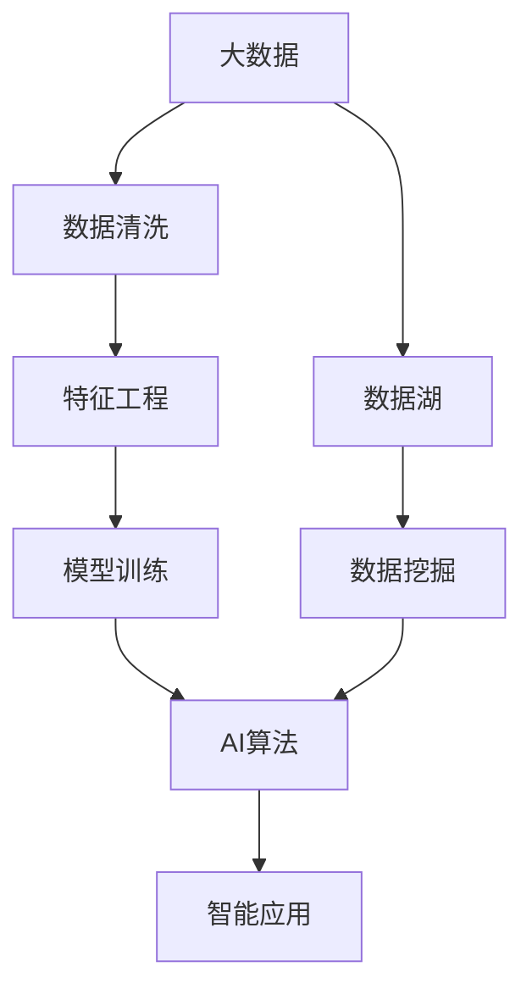

                 

## 1. 背景介绍

随着互联网和数字技术的飞速发展，全球数据量呈现出爆炸式增长。据国际数据公司(IDC)预测，全球数据量将在2025年达到175ZB（约1750亿TB），是2019年的5倍。如此海量数据的到来，不仅为人工智能(AI)技术的研发和应用提供了充实的资源，也引发了人们对大数据在AI中重要性的深刻思考。

人工智能依赖于数据，其核心目标是让机器能够理解和利用数据，从而模仿人类的思考和决策过程。大数据为AI提供了一个全新的研究视角，推动了AI技术的不断创新和突破。本文将从大数据在AI中的重要性出发，探讨其在数据驱动型AI研究中的关键角色，分析其对AI算法性能和应用效果的提升作用，并展望未来发展趋势。

## 2. 核心概念与联系

### 2.1 核心概念概述

1. **大数据**：指无法通过传统数据处理应用软件在合理时间内捕捉、管理和处理的数据集合。大数据包含大量数据，速度快，种类多样，且具有价值。其特点包括4V（Volume, Variety, Velocity, Value）。

2. **人工智能**：利用计算机算法模拟人类智能行为的技术，主要包括机器学习、自然语言处理、计算机视觉、机器人学等。AI的核心在于从数据中学习，不断提升自身能力。

3. **数据驱动型AI**：通过大量的数据训练模型，从而驱动AI系统进行决策和推理。大数据为数据驱动型AI提供了充足的训练数据，是其持续发展的基石。

### 2.2 核心概念间的联系

大数据和AI之间存在着密切的联系，具体如下：

- **数据存储与处理**：大数据技术提升了数据存储和处理能力，支持AI算法的高效训练和推理。
- **模型训练**：AI算法如深度学习、强化学习等依赖于大量数据进行训练，提升模型的泛化能力和精度。
- **智能应用**：AI技术可以基于大数据实现智能推荐、预测分析、智能搜索等应用，推动各行各业的数字化转型。
- **持续优化**：AI模型通过大数据不断进行反馈和优化，提升其在实际应用中的表现。

这些联系形成了数据驱动型AI的核心框架，其中大数据是大规模训练和模型优化的基础，而AI算法则负责从数据中提取知识和模式，实现高效的数据应用。

### 2.3 核心概念的整体架构

以下是数据驱动型AI的核心架构，展示了大数据与AI算法之间的交互：



这个架构表明，大数据通过清洗和特征工程处理后，进入模型训练阶段，最终由AI算法进行处理，实现智能应用。其中，数据湖和大数据挖掘技术保证了数据的高质量和多样性，为模型的训练和优化提供了坚实的基础。

## 3. 核心算法原理 & 具体操作步骤

### 3.1 算法原理概述

在大数据驱动的AI研究中，核心算法原理主要是基于数据驱动的机器学习和深度学习算法。这些算法通过分析海量数据，从中学习规律和模式，用于预测、分类、聚类、生成等任务。

大数据驱动的AI算法一般包括以下步骤：

1. **数据采集与预处理**：从各种数据源收集数据，并进行清洗、归一化、降维等预处理工作。
2. **特征提取与工程**：从原始数据中提取特征，构建数据表示。
3. **模型训练与优化**：使用训练数据对模型进行训练，并不断调整参数以优化模型性能。
4. **模型评估与部署**：通过测试数据对模型进行评估，并将模型部署到实际应用中。

### 3.2 算法步骤详解

#### 3.2.1 数据采集与预处理

数据采集是AI研究的首要步骤，一般包括以下几种方式：

- **爬虫抓取**：从互联网、社交媒体等渠道抓取公开数据。
- **传感器采集**：从智能设备、物联网等环境采集数据。
- **API接口获取**：从第三方平台获取API接口数据。

数据预处理包括：

- **数据清洗**：去除重复、缺失、噪声数据。
- **数据归一化**：将不同范围的数据归一化到指定范围。
- **数据降维**：减少数据的维度，提升数据处理的效率。

#### 3.2.2 特征提取与工程

特征提取是数据预处理的延伸，是从原始数据中提取有价值信息的过程。常用的特征提取方法包括：

- **手工特征提取**：根据领域知识手动选择特征。
- **自动特征提取**：使用算法自动选择和生成特征，如PCA、LDA等。
- **特征选择**：从大量特征中筛选出最具有代表性和区分度的特征。

特征工程主要包括：

- **特征缩放**：将特征值缩放到合适范围，避免模型偏差。
- **特征组合**：将多个特征组合成新的特征。
- **特征交叉**：不同特征的交叉组合，提升模型的表达能力。

#### 3.2.3 模型训练与优化

模型训练是AI算法的核心步骤，一般采用以下策略：

- **随机梯度下降法**（SGD）：通过随机采样数据，快速更新模型参数。
- **Adagrad、Adam、RMSprop等优化算法**：根据梯度变化自适应调整学习率。
- **正则化技术**：如L1、L2正则化，避免模型过拟合。

模型优化包括：

- **超参数调优**：通过网格搜索、随机搜索等方法，寻找最优超参数组合。
- **交叉验证**：使用交叉验证技术，评估模型泛化能力。
- **模型融合**：将多个模型进行融合，提升整体性能。

#### 3.2.4 模型评估与部署

模型评估包括：

- **损失函数**：衡量模型预测与真实值之间的差距，如均方误差、交叉熵等。
- **精度指标**：如准确率、召回率、F1-score等，评估模型性能。
- **模型对比**：使用AUC、ROC曲线等工具进行模型对比。

模型部署包括：

- **模型保存**：将训练好的模型保存为文件或数据库，便于后续调用。
- **模型推理**：在实际应用中，使用模型进行数据预测或决策。
- **模型监控**：实时监控模型性能，及时调整优化。

### 3.3 算法优缺点

#### 3.3.1 算法优点

1. **模型性能提升**：大数据驱动的AI算法通过分析海量数据，可以发现更准确的规律和模式，提升模型预测和分类精度。
2. **泛化能力强**：模型通过大量数据训练，具有较强的泛化能力，能够适应新数据和复杂环境。
3. **实时性**：大数据实时处理技术，使得AI模型能够快速响应新数据，提升系统反应速度。
4. **成本降低**：通过大数据技术，可以自动化数据处理和模型训练，降低人工成本。

#### 3.3.2 算法缺点

1. **数据质量问题**：大数据来源多样，数据质量参差不齐，可能存在噪声、偏差等问题。
2. **模型复杂度**：大数据驱动的AI算法通常比较复杂，需要较长的训练时间和计算资源。
3. **隐私和安全**：大数据涉及个人隐私和敏感信息，数据处理和存储需要遵守相关法规和标准。
4. **数据依赖**：AI模型对数据依赖性强，数据质量差会影响模型性能。

### 3.4 算法应用领域

大数据驱动的AI技术已经广泛应用于多个领域，具体如下：

1. **金融科技**：通过大数据分析客户行为、市场趋势，实现智能投顾、风险管理、信用评分等应用。
2. **医疗健康**：利用患者数据、医疗记录等，进行疾病预测、治疗方案优化、精准医疗等应用。
3. **智能制造**：通过物联网设备采集数据，实现生产流程优化、设备故障预测、供应链管理等应用。
4. **交通物流**：利用车辆、道路数据，实现交通流量预测、路径优化、智能导航等应用。
5. **零售电商**：通过用户行为数据，实现个性化推荐、库存管理、需求预测等应用。

## 4. 数学模型和公式 & 详细讲解 & 举例说明

### 4.1 数学模型构建

在大数据驱动的AI研究中，常用的数学模型包括回归模型、分类模型、聚类模型等。以回归模型为例，其数学模型构建如下：

假设有一个数据集$D=\{(x_i, y_i)\}_{i=1}^N$，其中$x_i$为特征向量，$y_i$为标签值。回归模型的目标是从数据中学习一个函数$f(x)$，使其最小化预测误差$\epsilon_i=y_i-f(x_i)$。常用的回归模型包括线性回归、逻辑回归、多项式回归等。

### 4.2 公式推导过程

#### 线性回归

线性回归的目标是寻找一条直线$f(x)=\theta_0+\theta_1x_1+\theta_2x_2+\cdots+\theta_nx_n$，使其最小化预测误差$\epsilon_i=y_i-f(x_i)$。最小化误差可以通过求解以下目标函数实现：

$$
\min_{\theta} \frac{1}{2N}\sum_{i=1}^N(y_i-f(x_i))^2
$$

通过求解上述目标函数的导数，可以求解出最优参数$\theta$：

$$
\theta = (X^TX)^{-1}X^TY
$$

其中$X=[x_1^1, x_1^2, \cdots, x_1^n, x_2^1, x_2^2, \cdots, x_2^n, \cdots, x_N^1, x_N^2, \cdots, x_N^n]$，$Y=[y_1, y_2, \cdots, y_N]$。

### 4.3 案例分析与讲解

以金融风控为例，大数据驱动的AI模型可以从用户的历史交易数据、信用记录等数据中学习风险预测模型。具体步骤如下：

1. **数据采集**：从银行系统、第三方支付平台等渠道获取用户交易数据、信用评分等。
2. **数据预处理**：清洗、归一化数据，去除噪声和异常值。
3. **特征提取**：提取交易金额、交易频率、信用评分等特征。
4. **模型训练**：使用线性回归、逻辑回归等模型，训练风险预测模型。
5. **模型优化**：通过交叉验证、正则化等方法，优化模型参数。
6. **模型评估**：使用测试数据评估模型性能，调整参数。
7. **模型部署**：将训练好的模型部署到银行风控系统，实现实时风险预测。

## 5. 项目实践：代码实例和详细解释说明

### 5.1 开发环境搭建

在进行项目实践前，需要准备开发环境。以下是使用Python进行TensorFlow开发的环境配置流程：

1. 安装Anaconda：从官网下载并安装Anaconda，用于创建独立的Python环境。

2. 创建并激活虚拟环境：
```bash
conda create -n tf-env python=3.8 
conda activate tf-env
```

3. 安装TensorFlow：根据CUDA版本，从官网获取对应的安装命令。例如：
```bash
conda install tensorflow=tensorflow-2.4.0=cudatoolkit=11.1
```

4. 安装各类工具包：
```bash
pip install numpy pandas scikit-learn matplotlib tqdm jupyter notebook ipython
```

完成上述步骤后，即可在`tf-env`环境中开始项目实践。

### 5.2 源代码详细实现

下面以线性回归模型为例，给出使用TensorFlow进行模型开发的PyTorch代码实现。

首先，定义线性回归模型：

```python
import tensorflow as tf
from tensorflow.keras.layers import Dense
from tensorflow.keras.models import Sequential

model = Sequential([
    Dense(64, input_dim=3, activation='relu'),
    Dense(1, activation='linear')
])
model.compile(loss='mean_squared_error', optimizer='adam')
```

然后，加载数据并训练模型：

```python
import numpy as np
from sklearn.datasets import make_regression

# 生成样本数据
X, y = make_regression(n_samples=100, n_features=3, n_targets=1, noise=0.1)

# 将数据转换为TensorFlow模型所需的格式
X_tensor = tf.convert_to_tensor(X, dtype=tf.float32)
y_tensor = tf.convert_to_tensor(y, dtype=tf.float32)

# 定义训练过程
model.fit(X_tensor, y_tensor, epochs=100, batch_size=32)
```

最后，评估模型性能：

```python
# 加载测试数据
X_test = np.random.rand(10, 3)
y_test = np.random.rand(10, 1)

# 将数据转换为TensorFlow模型所需的格式
X_test_tensor = tf.convert_to_tensor(X_test, dtype=tf.float32)
y_test_tensor = tf.convert_to_tensor(y_test, dtype=tf.float32)

# 评估模型性能
test_loss = model.evaluate(X_test_tensor, y_test_tensor)
print('测试集损失：', test_loss)
```

以上就是使用TensorFlow进行线性回归模型开发的完整代码实现。可以看到，TensorFlow提供了丰富的模型和工具，使得模型构建和训练过程更加便捷高效。

### 5.3 代码解读与分析

让我们再详细解读一下关键代码的实现细节：

**线性回归模型定义**：
- 使用Sequential模型，定义了两个全连接层。第一层64个神经元，激活函数为ReLU，输入维度为3。第二层1个神经元，激活函数为线性，输出维度为1。
- 使用均方误差作为损失函数，Adam优化器进行模型训练。

**数据加载**：
- 使用make_regression生成样本数据。
- 将数据转换为TensorFlow模型所需的Tensor格式。

**模型训练**：
- 使用fit方法进行模型训练，指定训练轮数和批次大小。
- 通过evaluate方法评估模型性能，输出测试集损失。

**测试数据加载与评估**：
- 加载随机生成的测试数据。
- 将测试数据转换为TensorFlow模型所需的Tensor格式。
- 使用evaluate方法评估模型性能，输出测试集损失。

可以看到，TensorFlow提供了方便的API接口，使得模型构建和训练过程更加简单高效。通过这样的代码实现，可以更好地理解TensorFlow的强大功能和便捷特性。

## 6. 实际应用场景

### 6.1 金融科技

大数据在金融科技中的应用非常广泛，可以从多个维度提升金融服务效率和安全性。具体如下：

1. **风险管理**：通过大数据分析客户的交易记录、信用评分等数据，预测客户的违约风险，实现智能风控。
2. **客户画像**：利用大数据分析客户的历史行为、交易数据，生成客户画像，实现精准营销。
3. **智能投顾**：基于大数据分析市场趋势、客户偏好，推荐投资组合，提升投资收益。
4. **欺诈检测**：通过大数据分析异常交易行为，检测和防范金融欺诈。

### 6.2 医疗健康

大数据在医疗健康领域的应用潜力巨大，可以从多个方面提升医疗服务水平和医疗效率。具体如下：

1. **疾病预测**：利用大数据分析患者的电子病历、基因数据等，预测疾病的发生和发展。
2. **精准医疗**：基于大数据分析患者基因数据、治疗效果，制定个性化治疗方案。
3. **医疗影像**：通过大数据分析医学影像数据，实现自动诊断和辅助诊断。
4. **医疗管理**：利用大数据分析医院运营数据，优化医疗资源配置。

### 6.3 智能制造

大数据在智能制造中的应用，可以从多个环节提升制造效率和质量。具体如下：

1. **设备监控**：通过物联网设备采集生产数据，实现设备故障预测和预防性维护。
2. **生产调度**：利用大数据分析生产数据，优化生产流程，提升生产效率。
3. **供应链管理**：通过大数据分析供应链数据，实现库存优化和需求预测。
4. **质量控制**：基于大数据分析产品质量数据，实现智能质量控制。

### 6.4 交通物流

大数据在交通物流中的应用，可以从多个方面提升交通和物流效率。具体如下：

1. **交通流量预测**：利用大数据分析交通流量数据，预测交通拥堵情况，实现智能导航。
2. **路径优化**：基于大数据分析车辆位置、路况数据，优化行车路线，提升运输效率。
3. **货运管理**：利用大数据分析货物运输数据，优化物流管理。
4. **交通安全**：通过大数据分析交通事故数据，提升交通安全管理。

## 7. 工具和资源推荐

### 7.1 学习资源推荐

为了帮助开发者系统掌握大数据在AI中的重要性，这里推荐一些优质的学习资源：

1. **《大数据在人工智能中的应用》**：介绍大数据与AI的结合应用，涵盖数据清洗、特征工程、模型训练等核心技术。

2. **Coursera《数据科学基础》**：由斯坦福大学提供，涵盖数据处理、数据可视化、数据挖掘等基础技术。

3. **Kaggle数据科学竞赛**：通过参与实际数据科学竞赛，提升解决实际问题的能力。

4. **Google Cloud大数据平台**：提供丰富的学习资源和实践机会，了解大数据在实际项目中的应用。

5. **Arxiv论文预印本**：人工智能领域最新研究成果的发布平台，了解前沿技术的最新进展。

通过对这些资源的学习实践，相信你一定能够系统掌握大数据在AI中的重要性，并应用于实际项目中。

### 7.2 开发工具推荐

高效的开发离不开优秀的工具支持。以下是几款用于大数据驱动的AI开发常用的工具：

1. **TensorFlow**：由Google主导开发的开源深度学习框架，支持分布式训练和推理，适用于大规模数据处理和模型训练。

2. **PyTorch**：由Facebook开发的深度学习框架，灵活性高，易于使用。

3. **Apache Spark**：分布式大数据处理框架，支持大规模数据批处理和实时处理，广泛应用于大数据分析。

4. **Hadoop**：Apache基金会提供的分布式计算框架，支持大规模数据存储和处理。

5. **Azure Big Data**：微软提供的云大数据平台，提供丰富的数据存储和处理功能。

合理利用这些工具，可以显著提升大数据驱动的AI项目开发效率，加快创新迭代的步伐。

### 7.3 相关论文推荐

大数据驱动的AI技术的研究源于学界的持续研究。以下是几篇奠基性的相关论文，推荐阅读：

1. **《Data-Mining and Statistical Learning》**：介绍数据挖掘和统计学习的基本概念和技术，涵盖数据预处理、特征工程、模型训练等核心技术。

2. **《Big Data Mining and Statistical Learning》**：介绍大数据挖掘和统计学习的新进展，涵盖大数据存储和处理技术、数据建模技术等。

3. **《Machine Learning Yearning》**：Andrew Ng的经典之作，涵盖机器学习的核心技术和管理实践。

4. **《Hands-On Machine Learning with Scikit-Learn, Keras, and TensorFlow》**：介绍使用Scikit-Learn、Keras和TensorFlow进行机器学习和深度学习的实践方法。

这些论文代表了大数据驱动的AI技术的发展脉络。通过学习这些前沿成果，可以帮助研究者把握学科前进方向，激发更多的创新灵感。

除上述资源外，还有一些值得关注的前沿资源，帮助开发者紧跟大数据驱动的AI技术的最新进展，例如：

1. **arXiv论文预印本**：人工智能领域最新研究成果的发布平台，包括大量尚未发表的前沿工作，学习前沿技术的必读资源。

2. **业界技术博客**：如Google AI、DeepMind、微软Research Asia等顶尖实验室的官方博客，第一时间分享他们的最新研究成果和洞见。

3. **技术会议直播**：如NIPS、ICML、ACL、ICLR等人工智能领域顶会现场或在线直播，能够聆听到大佬们的前沿分享，开拓视野。

4. **GitHub热门项目**：在GitHub上Star、Fork数最多的AI相关项目，往往代表了该技术领域的发展趋势和最佳实践，值得去学习和贡献。

5. **行业分析报告**：各大咨询公司如McKinsey、PwC等针对大数据驱动的AI行业的分析报告，有助于从商业视角审视技术趋势，把握应用价值。

总之，对于大数据驱动的AI技术的学习和实践，需要开发者保持开放的心态和持续学习的意愿。多关注前沿资讯，多动手实践，多思考总结，必将收获满满的成长收益。

## 8. 总结：未来发展趋势与挑战

### 8.1 总结

本文对大数据在AI中的重要性进行了全面系统的介绍。首先阐述了大数据在AI研究中的核心地位，明确了大数据对AI算法性能和应用效果的提升作用。其次，从原理到实践，详细讲解了大数据驱动的AI算法流程，包括数据采集、预处理、特征工程、模型训练和优化等关键步骤，给出了实际项目开发的完整代码实现。同时，本文还探讨了大数据在金融、医疗、制造、交通等众多领域的广泛应用，展示了其巨大的潜力和应用前景。最后，本文精选了大数据驱动的AI技术的学习资源和开发工具，力求为读者提供全方位的技术指引。

通过本文的系统梳理，可以看到，大数据驱动的AI技术正在成为人工智能领域的重要范式，极大地拓展了AI的应用范围，提升了模型的泛化能力和效率。未来，伴随大数据技术的不断演进，大数据驱动的AI技术必将在更多领域大放异彩，推动人工智能技术的进一步突破。

### 8.2 未来发展趋势

展望未来，大数据驱动的AI技术将呈现以下几个发展趋势：

1. **数据实时化处理**：随着互联网技术的不断进步，大数据实时处理技术将日益成熟，进一步提升AI模型的实时性。
2. **数据自动化采集**：自动化数据采集技术将不断进步，减少人工干预，降低数据采集成本。
3. **数据融合与共享**：数据融合与共享技术将使得数据资源更加丰富，提升AI模型的泛化能力。
4. **AI与物联网的深度融合**：物联网设备的数据将是大数据的重要来源，进一步推动AI技术的发展。
5. **AI与区块链的结合**：区块链技术将保障大数据的安全性和可信度，提升AI模型的可靠性。

### 8.3 面临的挑战

尽管大数据驱动的AI技术已经取得了显著成就，但在迈向更加智能化、普适化应用的过程中，仍面临诸多挑战：

1. **数据质量问题**：大数据来源多样，数据质量参差不齐，可能存在噪声、偏差等问题。
2. **数据隐私与安全**：大数据涉及个人隐私和敏感信息，数据处理和存储需要遵守相关法规和标准。
3. **模型复杂度**：大数据驱动的AI算法通常比较复杂，需要较长的训练时间和计算资源。
4. **数据依赖性**：AI模型对数据依赖性强，数据质量差会影响模型性能。
5. **数据存储与处理**：大数据处理和存储技术需要进一步优化，提升数据处理效率。

### 8.4 未来突破

面对大数据驱动的AI技术所面临的挑战，未来的研究需要在以下几个方面寻求新的突破：

1. **数据质量提升**：采用更高效的数据清洗和预处理技术，提升数据质量。
2. **模型轻量化**：开发更加轻量化的模型，减少计算资源消耗，提升模型的实时性。
3. **数据隐私保护**：采用隐私保护技术，如差分隐私、联邦学习等，保护数据隐私。
4. **多模态融合**：将数据融合与多模态技术结合，提升数据表征能力。
5. **数据高效存储**：采用分布式存储和计算技术，提升大数据处理效率。

这些研究方向的探索，必将引领大数据驱动的AI技术迈向更高的台阶，为人工智能技术在各行各业的应用提供更坚实的基础。相信随着学界和产业界的共同努力，大数据驱动的AI技术必将不断突破，推动人工智能技术的进一步演进和落地。

## 9. 附录：常见问题与解答

**Q1：如何处理大数据中的噪声和异常值？**

A: 大数据中常常包含噪声和异常值，需要进行数据清洗和处理。常用的方法包括：

- **数据去重**：去除重复数据，减少数据冗余。
- **数据归一化**：将数据值缩放到指定范围，提升数据处理效率。
- **数据插补**：采用插补方法处理缺失数据，提升数据完整性。
- **数据过滤**：通过筛选过滤不符合规范的数据，提升数据质量。

**Q2：大数据驱动的AI模型如何进行超参数调优？**

A: 大数据驱动的AI模型通常参数众多，需要进行超参数调优。常用的方法包括：

- **网格搜索**：通过遍历超参数空间，寻找最优参数组合。
- **随机搜索**：通过随机采样超参数空间，寻找最优参数组合。
- **贝叶斯优化**：通过构建贝叶斯模型，优化超参数搜索过程。
- **集成学习**：通过集成多个模型，提升模型性能。

**Q3：大数据驱动的AI模型如何避免过拟合？**

A: 大数据驱动的AI模型容易出现过拟合问题，需要进行以下处理：

- **正则化**：采用L1、L2正则化等方法，减少模型复杂度。
- **Dropout**：随机丢弃部分神经元，防止模型过拟合。
- **数据增强**：通过数据扩充、变换等方法，增加数据多样性。
- **模型集成**：通过集成多个模型，提升模型泛化能力。

**Q4：大数据驱动的AI模型如何进行实时部署？**

A: 大数据驱动的AI模型需要进行实时部署，可以使用以下方法：

- **模型裁剪**：去除不必要的层和参数，减小模型尺寸，加快推理速度。
- **量化加速**：将浮点模型转为定点模型，压缩存储空间，提高计算效率。


