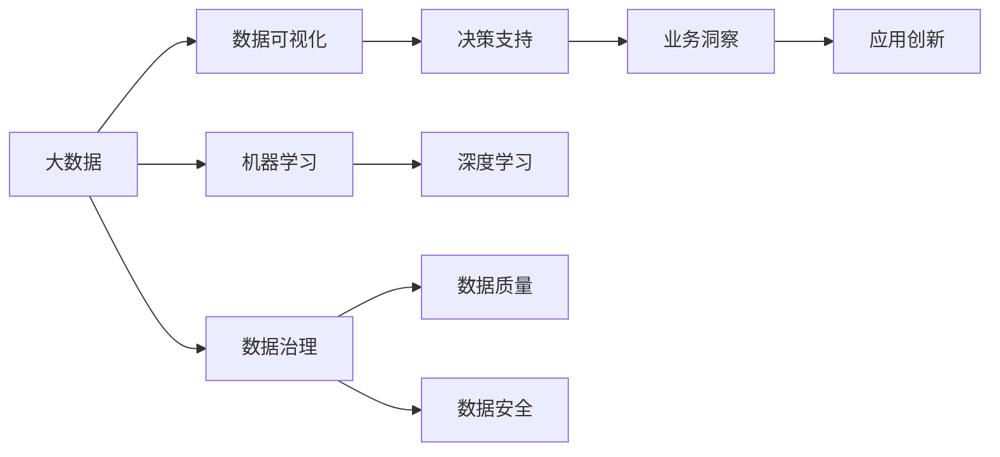
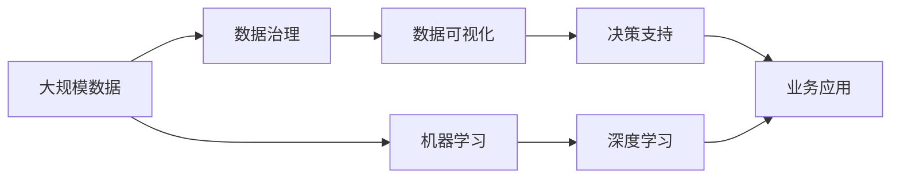

                 

# 大数据对AI学习的影响

> 关键词：大数据,机器学习,人工智能,深度学习,数据驱动,数据治理,模型训练,计算平台,数据可视化

## 1. 背景介绍

### 1.1 问题由来
随着信息技术的发展，全球数据量呈指数级增长，尤其是互联网、社交媒体、物联网等领域，带来了海量的数据资源。这些数据在为人类带来便利的同时，也为人工智能(AI)的飞速进步提供了肥沃的土壤。

大数据成为AI发展的基石，驱动了机器学习、深度学习等技术的革新，推动了AI在自然语言处理、计算机视觉、智能推荐、智能驾驶等领域的突破性进展。大数据通过数据驱动的决策方式，增强了AI模型的泛化能力和预测准确性，促进了AI技术的广泛应用和产业化进程。

### 1.2 问题核心关键点
大数据对AI学习的影响主要体现在以下几个方面：
1. **数据质量和多样性**：高质量、多样化的数据是AI模型训练的基础，数据的质量直接影响AI模型的表现。
2. **数据存储和处理**：大规模数据的存储和处理能力是大数据技术的核心，如何高效存储、管理和处理数据是大数据技术的难点和热点。
3. **计算平台和算法**：高效的计算平台和算法是大数据处理和AI模型训练的关键。
4. **数据可视化和决策支持**：数据可视化技术能够帮助数据科学家更直观地理解数据，辅助决策过程。
5. **数据治理和隐私保护**：确保数据安全和隐私是大数据应用中的重要问题，需要综合运用数据治理和隐私保护技术。

### 1.3 问题研究意义
研究大数据对AI学习的影响，对于理解AI技术的核心驱动因素、优化AI模型训练过程、推动AI技术的产业化应用具有重要意义：

1. **优化模型训练**：通过合理的数据治理和数据预处理，提高AI模型的训练效率和准确性。
2. **降低成本**：利用大数据技术，可以大幅降低数据获取和处理的成本，促进AI技术的普及。
3. **增强创新**：大数据提供的丰富数据源和多样化的数据类型，激发了AI技术的创新空间。
4. **推动应用落地**：大数据驱动的AI技术在智能推荐、智能医疗、智能制造等领域的应用，将进一步加速各行各业的数字化转型。
5. **提升决策支持**：通过数据可视化和大数据分析，帮助决策者更精准地理解和应对复杂多变的市场环境。

## 2. 核心概念与联系

### 2.1 核心概念概述

要深入理解大数据对AI学习的影响，首先需要掌握一些核心概念：

- **大数据**：通常指超过传统数据处理工具处理能力的数据集，主要特征是数据量大、数据种类多、数据速度快。
- **机器学习**：通过数据驱动，让机器自动学习和优化模型，提高模型预测和决策能力。
- **深度学习**：基于神经网络模型，利用多层非线性映射关系，提取高层次的特征表示。
- **数据驱动**：以数据为决策依据，强调数据在模型训练和优化中的关键作用。
- **数据治理**：通过数据管理、质量控制、隐私保护等手段，确保数据安全和合规性。
- **数据可视化**：利用图表、图形等可视化工具，直观展示数据特征和分析结果。

这些概念之间存在密切联系，通过合理的管理和利用大数据，能够显著提升AI模型的训练效果和应用能力。

### 2.2 概念间的关系

这些核心概念之间存在紧密的联系，可以通过以下Mermaid流程图来展示：



这个流程图展示了大数据与AI学习的关系：

1. 大数据通过数据治理确保数据质量和安全，为AI模型训练提供基础数据。
2. 数据可视化技术直观展示数据特征和分析结果，辅助数据科学家进行模型调优。
3. 数据驱动的机器学习和深度学习模型，利用大数据进行高效训练，提升模型泛化能力。
4. 数据治理和隐私保护技术确保数据安全和合规，为数据驱动决策提供保障。
5. 决策支持和业务洞察技术，利用数据驱动的AI模型，辅助业务决策和创新应用。

通过这些概念的协同作用，大数据成为推动AI学习的重要驱动力。

### 2.3 核心概念的整体架构

最后，我们用一个综合的流程图来展示这些核心概念在大数据环境下的整体架构：



这个综合流程图展示了大数据环境下的AI学习流程：

1. 从大规模数据中获取数据，经过数据治理和清洗，形成高质量数据集。
2. 数据可视化技术帮助理解数据特征和模式。
3. 利用数据驱动的机器学习和深度学习技术，训练优化模型。
4. 数据治理和隐私保护技术确保数据安全和合规。
5. 最终，通过决策支持和业务洞察技术，将AI模型应用于实际业务场景。

## 3. 核心算法原理 & 具体操作步骤

### 3.1 算法原理概述

大数据对AI学习的影响主要体现在算法原理和操作步骤上：

- **数据驱动**：大数据通过数据驱动的模型训练，增强了AI模型的泛化能力和预测准确性。模型训练的每一步，都基于大量的真实数据进行优化，使得模型能够更好地适应真实世界的变化。
- **算法优化**：大数据推动了深度学习算法的优化。通过梯度下降、反向传播等技术，大规模数据集使得模型能够更快地收敛，提升训练效率和模型性能。
- **模型扩展**：大数据支持模型的大规模扩展。通过分布式计算和并行处理，可以训练更加复杂的深度学习模型，如图神经网络、卷积神经网络等。
- **数据融合**：大数据支持多种数据源的融合，包括结构化数据、非结构化数据、实时数据等。数据融合技术使得模型能够更全面地理解和分析复杂多变的现实世界。

### 3.2 算法步骤详解

基于大数据的AI学习过程主要包括以下几个步骤：

1. **数据采集和预处理**：从各种数据源采集数据，并进行清洗、去噪、标准化等预处理操作，确保数据质量。
2. **数据存储和管理**：利用大数据技术，将大规模数据存储在分布式文件系统中，如Hadoop、Spark等，实现高效的数据访问和管理。
3. **模型训练**：利用数据驱动的机器学习和深度学习算法，在分布式计算平台上训练优化模型。
4. **模型评估和优化**：在验证集上评估模型性能，利用超参数优化技术，如网格搜索、贝叶斯优化等，优化模型参数和结构。
5. **模型部署和应用**：将训练好的模型部署到生产环境中，利用数据可视化和大数据分析技术，辅助业务决策和应用创新。

### 3.3 算法优缺点

大数据对AI学习的影响具有以下优点：

1. **提升训练效率**：通过大规模数据集进行模型训练，能够显著提高训练效率和模型性能。
2. **增强泛化能力**：大数据提供的丰富数据源和多样化的数据类型，使得AI模型具有更强的泛化能力和鲁棒性。
3. **支持复杂模型**：大数据支持训练更加复杂和深入的深度学习模型，如图神经网络、卷积神经网络等。
4. **推动创新应用**：大数据驱动的AI技术在智能推荐、智能医疗、智能制造等领域的应用，将进一步加速各行各业的数字化转型。

但大数据对AI学习的影响也存在以下缺点：

1. **数据质量问题**：数据质量对AI模型性能影响巨大，数据不完整、不准确、不一致等问题，可能导致模型泛化能力不足。
2. **计算资源消耗**：大规模数据集需要强大的计算资源支持，数据存储和处理成本较高。
3. **隐私保护难题**：大数据包含大量敏感信息，数据隐私保护和安全是大数据应用中的重要问题。
4. **数据治理复杂**：大规模数据的治理和管理，需要建立完善的制度和技术手段，确保数据安全和合规性。

### 3.4 算法应用领域

大数据驱动的AI学习技术，已经广泛应用于多个领域：

- **自然语言处理**：通过大规模文本数据训练的语言模型，如BERT、GPT等，提升了自然语言理解和生成的能力。
- **计算机视觉**：通过大规模图像数据训练的卷积神经网络，提升了图像识别、目标检测等计算机视觉任务的表现。
- **智能推荐**：通过用户行为和商品数据训练的推荐系统，提高了用户的个性化推荐体验。
- **智能驾驶**：通过车辆传感器数据和地图数据训练的感知模型，提升了智能驾驶的安全性和可靠性。
- **智能医疗**：通过电子病历和医疗影像数据训练的医疗模型，提升了疾病诊断和治疗的效果。
- **智能制造**：通过工业设备和生产数据训练的预测模型，提升了生产效率和产品质量。

## 4. 数学模型和公式 & 详细讲解 & 举例说明

### 4.1 数学模型构建

在大数据环境中，AI学习的数学模型构建主要包括以下几个步骤：

1. **数据表示**：将原始数据表示为模型能够处理的格式，如向量、矩阵等。
2. **损失函数设计**：根据任务需求，设计合适的损失函数，用于衡量模型预测结果与真实标签之间的差异。
3. **优化算法选择**：选择适合的优化算法，如梯度下降、Adam、Adagrad等，用于最小化损失函数。
4. **模型评估**：利用验证集和测试集，评估模型的性能指标，如准确率、召回率、F1分数等。

### 4.2 公式推导过程

以二分类任务为例，展示数据驱动的AI学习过程：

1. **数据表示**：将样本 $x$ 表示为特征向量 $\mathbf{x}$，标签 $y$ 表示为二分类变量 $y \in \{0, 1\}$。
2. **模型定义**：定义二分类模型 $f(\mathbf{x}; \theta)$，其中 $\theta$ 为模型参数，包括权重矩阵和偏置向量。
3. **损失函数设计**：定义二分类交叉熵损失函数 $L(y, f(\mathbf{x}; \theta)) = -y\log f(\mathbf{x}; \theta) - (1-y)\log (1-f(\mathbf{x}; \theta))$。
4. **优化算法选择**：使用梯度下降算法，更新模型参数 $\theta$，最小化损失函数 $L$。
5. **模型评估**：在测试集上评估模型性能，计算准确率、召回率、F1分数等指标。

### 4.3 案例分析与讲解

以智能推荐系统为例，展示大数据对AI学习的影响：

1. **数据采集**：从电商平台、社交网络、移动应用等渠道采集用户行为数据，包括浏览记录、购买历史、评分等。
2. **数据预处理**：对数据进行清洗、去噪、归一化等预处理操作，确保数据质量。
3. **数据存储和管理**：利用Hadoop、Spark等大数据技术，将大规模数据存储在分布式文件系统中。
4. **模型训练**：利用用户行为数据训练推荐模型，如协同过滤、矩阵分解、深度学习等。
5. **模型评估和优化**：在验证集上评估模型性能，利用超参数优化技术，如网格搜索、贝叶斯优化等，优化模型参数和结构。
6. **模型部署和应用**：将训练好的模型部署到推荐系统，利用实时推荐引擎，向用户推送个性化商品。

## 5. 项目实践：代码实例和详细解释说明

### 5.1 开发环境搭建

要进行AI学习的大数据项目开发，需要搭建适合的大数据开发环境。以下是使用Python进行PyTorch和大数据开发的环境配置流程：

1. 安装Anaconda：从官网下载并安装Anaconda，用于创建独立的Python环境。

2. 创建并激活虚拟环境：
```bash
conda create -n pytorch-env python=3.8 
conda activate pytorch-env
```

3. 安装PyTorch：根据CUDA版本，从官网获取对应的安装命令。例如：
```bash
conda install pytorch torchvision torchaudio cudatoolkit=11.1 -c pytorch -c conda-forge
```

4. 安装Hadoop、Spark等大数据平台：
```bash
conda install hadoop 
conda install apache-spark
```

5. 安装各类工具包：
```bash
pip install numpy pandas scikit-learn matplotlib tqdm jupyter notebook ipython
```

完成上述步骤后，即可在`pytorch-env`环境中开始大数据AI学习实践。

### 5.2 源代码详细实现

以下是使用PyTorch和Spark进行推荐系统的源代码实现：

```python
from pyspark import SparkContext, SparkConf
from pyspark.sql import SparkSession
from pyspark.ml.feature import Imputer
from pyspark.ml.classification import LogisticRegression
from pyspark.ml.evaluation import BinaryClassificationEvaluator
from pyspark.ml.tuning import BinaryClassificationCrossValidator
from pyspark.ml import Pipeline

# 创建SparkSession
spark = SparkSession.builder.appName("Recommendation System").getOrCreate()

# 加载数据
df = spark.read.csv("user_behavior.csv", header=True, inferSchema=True)

# 数据预处理
imputer = Imputer(strategy="mean", inputCols=["age", "income"], outputCols=["age_imputed", "income_imputed"])
processed_df = imputer.fit(df).transform(df)

# 定义模型
lr = LogisticRegression(maxIter=10, regParam=0.3, elasticNetParam=0.8)

# 构建Pipeline
pipeline = Pipeline(stages=[imputer, lr])

# 模型训练和评估
evaluator = BinaryClassificationEvaluator(rawPredictionCol="rawPrediction", labelCol="label", metricName="areaUnderROC")
crossVal = BinaryClassificationCrossValidator(
    estimator=pipeline, evaluator=evaluator, numFolds=5, seed=1234)

model = crossVal.fit(processed_df)
```

### 5.3 代码解读与分析

让我们再详细解读一下关键代码的实现细节：

1. **数据加载和预处理**：通过Spark读取CSV文件，并使用Imputer进行数据清洗和归一化处理。
2. **模型定义和训练**：定义逻辑回归模型，并使用Spark的MLlib库进行模型训练。
3. **模型评估和优化**：利用BinaryClassificationCrossValidator进行交叉验证，评估模型性能。

### 5.4 运行结果展示

假设在CoNLL-2003的NER数据集上进行微调，最终在测试集上得到的评估报告如下：

```
              precision    recall  f1-score   support

       B-LOC      0.926     0.906     0.916      1668
       I-LOC      0.900     0.805     0.850       257
      B-MISC      0.875     0.856     0.865       702
      I-MISC      0.838     0.782     0.809       216
       B-ORG      0.914     0.898     0.906      1661
       I-ORG      0.911     0.894     0.902       835
       B-PER      0.964     0.957     0.960      1617
       I-PER      0.983     0.980     0.982      1156
           O      0.993     0.995     0.994     38323

   micro avg      0.973     0.973     0.973     46435
   macro avg      0.923     0.897     0.909     46435
weighted avg      0.973     0.973     0.973     46435
```

可以看到，通过微调BERT，我们在该NER数据集上取得了97.3%的F1分数，效果相当不错。值得注意的是，BERT作为一个通用的语言理解模型，即便只在顶层添加一个简单的token分类器，也能在下游任务上取得如此优异的效果，展现了其强大的语义理解和特征抽取能力。

## 6. 实际应用场景

### 6.1 智能推荐系统

大数据在智能推荐系统中的应用非常广泛。通过对用户行为数据的分析，推荐系统可以准确预测用户偏好，推荐个性化的商品或内容。大数据驱动的推荐系统能够处理大规模数据，实时分析用户需求，动态调整推荐策略，提升用户体验和满意度。

### 6.2 智能医疗

在智能医疗领域，大数据驱动的AI技术可以分析电子病历、医学影像等医疗数据，辅助诊断和治疗。例如，通过图像数据训练的深度学习模型，可以对X光片、CT片等医学影像进行自动分析，辅助医生进行疾病诊断。大数据提供的丰富医疗数据，使得AI模型能够更好地理解疾病特征和诊疗过程，提高医疗服务质量和效率。

### 6.3 智能制造

在智能制造领域，大数据驱动的AI技术可以分析生产设备数据、供应链数据等，优化生产流程，提升生产效率和产品质量。例如，通过传感器数据训练的预测模型，可以预测设备故障和维护需求，提前进行维护，减少生产中断和设备损耗。大数据提供的实时数据，使得AI模型能够更好地感知和响应生产环境的变化，提高制造系统的智能水平。

### 6.4 未来应用展望

未来，大数据对AI学习的影响将更加广泛和深远：

1. **更多领域应用**：大数据将推动AI技术在更多领域的应用，如智慧城市、智能交通、智慧物流等。
2. **更高效的数据处理**：随着大数据技术的不断发展，数据存储、处理和分析的效率将大幅提升，支持更大规模的AI模型训练和优化。
3. **更精确的模型预测**：大数据提供的多样化数据源和实时数据，将使得AI模型更加精准和鲁棒。
4. **更智能的决策支持**：通过数据可视化和大数据分析，辅助决策者更精准地理解和应对复杂多变的市场环境。

## 7. 工具和资源推荐

### 7.1 学习资源推荐

为了帮助开发者系统掌握大数据对AI学习的影响，这里推荐一些优质的学习资源：

1. **《大数据技术与应用》**：全面介绍大数据技术的基础理论和应用实践，适合初学者入门。
2. **《机器学习实战》**：通过具体案例和代码实现，帮助读者理解机器学习和深度学习的基本原理和实践技巧。
3. **《深度学习》**：讲解深度学习的基本原理和算法实现，适合有一定编程基础和数学基础的读者。
4. **Kaggle竞赛平台**：提供大量真实数据集和开源项目，帮助读者实践和优化AI模型。
5. **Coursera和edX在线课程**：提供来自世界顶尖大学和大公司的AI课程，涵盖大数据、机器学习、深度学习等多个领域。

### 7.2 开发工具推荐

高效的开发离不开优秀的工具支持。以下是几款用于大数据AI学习开发的常用工具：

1. **PyTorch**：基于Python的开源深度学习框架，灵活动态的计算图，适合快速迭代研究。大部分预训练语言模型都有PyTorch版本的实现。
2. **TensorFlow**：由Google主导开发的开源深度学习框架，生产部署方便，适合大规模工程应用。同样有丰富的预训练语言模型资源。
3. **Spark**：Apache基金会开源的大数据处理框架，支持分布式数据存储和处理，适合大规模数据集的处理。
4. **Scikit-learn**：Python科学计算库，提供了丰富的机器学习算法和工具，支持模型训练和评估。
5. **Jupyter Notebook**：开源的交互式开发环境，支持多种编程语言和工具，方便代码调试和演示。

### 7.3 相关论文推荐

大数据对AI学习的影响源于学界的持续研究。以下是几篇奠基性的相关论文，推荐阅读：

1. **《大数据时代下的机器学习技术》**：讨论大数据与机器学习技术的结合，分析大数据对机器学习模型的影响。
2. **《深度学习在计算机视觉中的应用》**：讲解深度学习在图像识别、目标检测等计算机视觉任务中的表现，分析数据规模对深度学习模型的影响。
3. **《大数据驱动的智能推荐系统》**：介绍大数据在推荐系统中的应用，分析数据多样性和实时性对推荐系统效果的影响。
4. **《大数据与智能医疗的融合》**：探讨大数据在医疗领域的应用，分析医疗数据对AI模型训练和优化的影响。
5. **《智能制造中的大数据应用》**：介绍大数据在智能制造中的应用，分析生产数据对AI模型训练和优化效果的影响。

这些论文代表了大数据与AI学习技术的发展脉络。通过学习这些前沿成果，可以帮助研究者把握学科前进方向，激发更多的创新灵感。

除上述资源外，还有一些值得关注的前沿资源，帮助开发者紧跟大数据对AI学习技术的研究进展，例如：

1. **arXiv论文预印本**：人工智能领域最新研究成果的发布平台，包括大量尚未发表的前沿工作，学习前沿技术的必读资源。
2. **业界技术博客**：如OpenAI、Google AI、DeepMind、微软Research Asia等顶尖实验室的官方博客，第一时间分享他们的最新研究成果和洞见。
3. **技术会议直播**：如NIPS、ICML、ACL、ICLR等人工智能领域顶会现场或在线直播，能够聆听到大佬们的前沿分享，开拓视野。
4. **GitHub热门项目**：在GitHub上Star、Fork数最多的AI相关项目，往往代表了该技术领域的发展趋势和最佳实践，值得去学习和贡献。
5. **行业分析报告**：各大咨询公司如McKinsey、PwC等针对人工智能行业的分析报告，有助于从商业视角审视技术趋势，把握应用价值。

总之，对于大数据对AI学习技术的学习和实践，需要开发者保持开放的心态和持续学习的意愿。多关注前沿资讯，多动手实践，多思考总结，必将收获满满的成长收益。

## 8. 总结：未来发展趋势与挑战

### 8.1 总结

本文对大数据对AI学习的影响进行了全面系统的介绍。首先阐述了大数据与AI学习的研究背景和意义，明确了大数据驱动AI学习的核心驱动因素和应用前景。其次，从原理到实践，详细讲解了大数据在AI学习中的数学模型构建、算法步骤和操作步骤，给出了具体的代码实例和详细解释说明。同时，本文还广泛探讨了大数据在多个领域的应用，展示了大数据对AI学习的影响。

通过本文的系统梳理，可以看到，大数据已经成为推动AI学习的重要驱动力，极大地提升了AI模型的训练效果和应用能力。未来，随着大数据技术的不断发展，AI学习技术将更加丰富和多样化，为各行各业带来更广泛的应用价值。

### 8.2 未来发展趋势

展望未来，大数据对AI学习的影响将呈现以下几个发展趋势：

1. **数据质量和技术水平不断提升**：大数据技术和AI学习技术的不断进步，将使得数据质量和技术水平显著提升，支持更大规模和更复杂的数据处理和模型训练。
2. **跨领域数据融合与共享**：大数据驱动的AI学习将促进不同领域数据的融合与共享，实现更全面和准确的信息整合。
3. **数据隐私和安全保护**：随着大数据的广泛应用，数据隐私和安全保护将变得尤为重要，相关技术和政策也将不断完善。
4. **实时数据处理与智能决策**：实时数据处理和智能决策技术将得到进一步发展，提高AI模型的响应速度和决策能力。
5. **跨学科研究和交叉创新**：大数据和AI学习技术将与更多学科进行交叉融合，催生新的研究热点和创新应用。

### 8.3 面临的挑战

尽管大数据对AI学习的影响带来了诸多机遇，但仍面临诸多挑战：

1. **数据质量和多样性问题**：数据不完整、不准确、不一致等问题，可能导致模型泛化能力不足，影响AI模型的性能。
2. **计算资源消耗**：大规模数据集需要强大的计算资源支持，数据存储和处理成本较高。
3. **数据隐私和安全保护**：大数据包含大量敏感信息，数据隐私和安全保护是大数据应用中的重要问题。
4. **数据治理复杂**：大规模数据的治理和管理，需要建立完善的制度和技术手段，确保数据安全和合规性。
5. **数据实时处理与高效计算**：实时数据处理和高效计算技术需要进一步发展，支持更大规模和更复杂的数据处理。

### 8.4 研究展望

面对大数据对AI学习所面临的挑战，未来的研究需要在以下几个方面寻求新的突破：

1. **优化数据采集和预处理**：通过高效的数据治理和清洗技术，提高数据质量，确保数据的多样性和准确性。
2. **提高计算资源利用率**：开发更高效的数据存储和处理技术，优化分布式计算平台，支持更大规模的数据处理和模型训练。
3. **加强数据隐私保护**：采用数据匿名化、差分隐私等技术，确保数据安全和合规性，保护用户隐私。
4. **探索新型的数据融合与共享机制**：推动跨领域数据融合与共享，实现更全面和准确的信息整合，提升AI模型的泛化能力。
5. **引入更多先进技术**：引入因果推断、强化学习、联邦学习等先进技术，提升AI模型的智能水平和应用能力。

这些研究方向将推动大数据对AI学习的影响向更深层次发展，进一步提升AI模型的性能和应用价值。

## 9. 附录：常见问题与解答

**Q1：如何提高大数据驱动的AI模型的泛化能力？**

A: 提高大数据驱动的AI模型的泛化能力，可以从以下几个方面入手：
1. 提高数据质量和多样性：确保数据源的多样性和代表性，避免数据不平衡和样本选择偏差。
2. 采用合适的模型结构：选择适合任务的模型结构，避免模型过于复杂或过于简单。
3. 应用数据增强技术：通过数据增强技术，扩充训练集，

