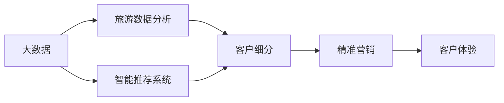
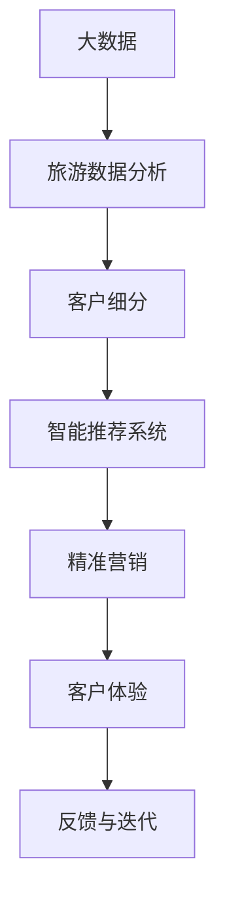

                 

# 大数据背景下推动某旅游发展的分析与研究

> 关键词：
- 大数据
- 旅游
- 数据分析
- 智能推荐
- 客户细分
- 精准营销
- 客户体验

## 1. 背景介绍

随着全球科技的迅猛发展，数据已经成为了推动各行各业进步的重要资源。旅游业作为现代服务业的重要组成部分，也正面临着前所未有的数字化转型机遇。利用大数据技术，旅游企业可以更好地理解客户需求，优化运营管理，提升旅游体验，从而在激烈的市场竞争中脱颖而出。本文旨在探讨在大数据背景下，如何通过数据驱动的策略和解决方案，推动某旅游企业的创新发展。

## 2. 核心概念与联系

### 2.1 核心概念概述

在本节中，我们将详细解释几个核心概念，并说明它们之间的联系：

- **大数据**：指的是超大规模、多样化、实时性强的数据集，用于各种数据分析和挖掘任务。旅游大数据包括但不限于游客流量、消费行为、评分评价、社交媒体数据等。

- **旅游数据分析**：通过对旅游相关数据的收集、清洗、处理和分析，揭示旅游行为和趋势，为旅游企业提供决策支持。

- **智能推荐系统**：利用机器学习和深度学习技术，分析用户行为数据，实现个性化推荐，提升用户体验和满意度。

- **客户细分**：根据客户的特征和行为，将客户分为不同的群体，进行更精准的营销和个性化服务。

- **精准营销**：通过分析客户数据，制定个性化营销策略，提升营销效果和ROI。

- **客户体验**：结合客户反馈数据和行为数据，优化旅游产品和服务，提升客户满意度和忠诚度。

这些核心概念之间相互联系，共同构成了大数据背景下推动旅游发展的整体框架。

### 2.2 概念间的关系

通过以下Mermaid流程图，可以更清晰地理解这些核心概念之间的关系：



这个流程图展示了从大数据收集到客户体验优化的全过程：

1. 大数据通过收集、清洗和处理，转化为可用于分析的旅游数据。
2. 利用旅游数据分析，可以深入了解客户行为和需求。
3. 智能推荐系统基于客户数据分析，提供个性化推荐，提升客户满意度。
4. 客户细分有助于实现精准营销，提高营销效果。
5. 通过优化客户体验，提升客户满意度和忠诚度，实现长期价值。

### 2.3 核心概念的整体架构

最后，我们用一个综合的流程图来展示这些核心概念在大数据背景下推动旅游发展的整体架构：



这个综合流程图展示了从大数据收集到客户体验优化的完整流程。

## 3. 核心算法原理 & 具体操作步骤
### 3.1 算法原理概述

大数据背景下的旅游发展分析与研究，主要依赖于数据挖掘、机器学习、深度学习等算法技术。以下将详细阐述这些算法的原理。

- **数据挖掘**：指的是从大量数据中提取有价值的信息和模式。在旅游数据分析中，数据挖掘可用于挖掘旅游行为趋势、客户需求特征等。

- **机器学习**：通过训练算法模型，使计算机能够从数据中学习规律，并应用于新数据中。在智能推荐系统中，机器学习模型可以分析用户行为数据，预测用户偏好，提供个性化推荐。

- **深度学习**：使用神经网络等复杂模型，模拟人脑的决策过程，处理高维非线性数据。深度学习在客户细分和精准营销中，可以构建更准确、精细的客户画像。

### 3.2 算法步骤详解

基于上述算法原理，旅游数据分析和优化可以分为以下几个关键步骤：

1. **数据收集**：使用传感器、Web API、社交媒体API等收集旅游相关数据。数据包括但不限于旅游目的地信息、游客行为数据、消费数据等。

2. **数据清洗与预处理**：对原始数据进行清洗、去重、标准化等预处理，确保数据的质量和一致性。

3. **特征工程**：从原始数据中提取有意义的特征，构建特征向量，供算法模型使用。特征工程在客户细分和推荐系统构建中尤为重要。

4. **模型训练与优化**：选择合适的算法模型，如决策树、随机森林、神经网络等，训练模型并优化超参数，提升模型性能。

5. **结果分析与解读**：对模型结果进行分析和解读，提出优化建议，指导旅游企业进行决策和改进。

### 3.3 算法优缺点

基于大数据的旅游发展分析与研究，有以下优缺点：

**优点**：

- **数据驱动**：通过数据分析，旅游企业可以更客观地理解市场和客户需求，避免主观臆断。
- **效率提升**：算法自动化处理大量数据，提高分析速度和效率。
- **个性化服务**：利用智能推荐和客户细分技术，提供个性化服务，提升客户满意度和忠诚度。

**缺点**：

- **数据质量**：数据收集和清洗的准确性直接影响分析结果。
- **模型复杂度**：高维数据和复杂模型可能导致过拟合，影响模型泛化能力。
- **隐私和安全**：客户数据的收集和分析需要重视隐私保护和数据安全。

### 3.4 算法应用领域

基于大数据的旅游发展分析与研究，已经在多个领域得到了广泛应用：

- **营销优化**：通过数据分析，制定个性化营销策略，提升营销效果。
- **运营管理**：优化旅游资源配置，提升旅游服务质量。
- **客户体验**：通过客户反馈数据，优化旅游产品和服务，提升客户满意度。
- **风险管理**：分析旅游风险数据，制定应对措施，降低旅游企业风险。

## 4. 数学模型和公式 & 详细讲解  
### 4.1 数学模型构建

在本节中，我们将使用数学语言对大数据背景下的旅游发展分析与研究过程进行严格刻画。

假设我们有一组旅游数据集 $D = \{(x_i, y_i)\}_{i=1}^N$，其中 $x_i$ 表示第 $i$ 个旅游行为数据，$y_i$ 表示对应的标签或特征。

定义旅游数据分析的目标函数为：

$$
L(\theta) = \frac{1}{N} \sum_{i=1}^N l(y_i, f_{\theta}(x_i))
$$

其中 $\theta$ 表示模型参数，$f_{\theta}(x_i)$ 表示模型预测的输出，$l(y_i, f_{\theta}(x_i))$ 表示损失函数。

通过优化目标函数 $L(\theta)$，我们可以找到最佳的模型参数 $\theta^*$。

### 4.2 公式推导过程

以下我们以客户细分为例，推导客户细分模型的数学公式。

假设客户 $i$ 的特征向量为 $x_i = [x_{i1}, x_{i2}, \ldots, x_{in}]$，其中 $x_{ij}$ 表示第 $j$ 个特征的值。

定义客户分类的目标函数为：

$$
L(\theta) = -\frac{1}{N} \sum_{i=1}^N \sum_{j=1}^n \log P(y_i = j | x_i, \theta)
$$

其中 $y_i$ 表示客户 $i$ 所属的分类，$P(y_i = j | x_i, \theta)$ 表示模型在给定特征 $x_i$ 和模型参数 $\theta$ 的情况下，预测客户 $i$ 属于分类 $j$ 的概率。

根据贝叶斯公式，我们可以得到：

$$
P(y_i = j | x_i, \theta) = \frac{P(y_i = j)P(x_i | y_i = j, \theta)}{\sum_{j'} P(y_i = j')P(x_i | y_i = j', \theta)}
$$

其中 $P(y_i = j)$ 表示客户 $i$ 属于分类 $j$ 的概率，$P(x_i | y_i = j, \theta)$ 表示在客户 $i$ 属于分类 $j$ 的条件下，模型预测的特征向量 $x_i$ 的概率。

在实际应用中，我们通常使用决策树、随机森林、神经网络等算法模型进行客户细分。这些模型的目标函数和推导过程大同小异，主要区别在于模型结构和优化算法的选择。

### 4.3 案例分析与讲解

假设我们有一组旅游客户数据，包括性别、年龄、消费水平、旅游目的地等信息。我们的目标是将其分为不同类型的客户群体。

首先，我们选择一个合适的机器学习算法，如决策树或神经网络，构建客户分类的模型。然后，根据已有的客户数据，对模型进行训练和优化。最后，通过模型评估，得到客户分类的结果。

下面，我们以一个简单的决策树模型为例，说明客户分类的实现过程。

假设我们的客户数据如下表所示：

| 客户编号 | 性别 | 年龄 | 消费水平 | 旅游目的地 | 是否预订 | 是否二次消费 |
| --- | --- | --- | --- | --- | --- | --- |
| 1 | 男 | 25 | 高 | 北京 | 是 | 否 |
| 2 | 女 | 35 | 中 | 上海 | 是 | 是 |
| 3 | 男 | 30 | 低 | 广州 | 否 | 是 |
| 4 | 女 | 45 | 高 | 西安 | 否 | 否 |
| 5 | 男 | 20 | 中 | 成都 | 是 | 否 |
| 6 | 女 | 40 | 中 | 桂林 | 否 | 是 |
| 7 | 男 | 50 | 高 | 北京 | 是 | 是 |
| 8 | 女 | 30 | 低 | 上海 | 否 | 否 |
| 9 | 男 | 35 | 高 | 广州 | 是 | 是 |
| 10 | 女 | 45 | 中 | 西安 | 是 | 是 |

首先，我们选择性别、年龄、消费水平、旅游目的地作为特征，尝试构建一个决策树模型。

根据数据，我们可以得到以下决策树：

```
                               是否预订
                  是否二次消费
               /           |        \  
              |             |         |
       是否预订   是否二次消费 |         |
      /   |   \    /   |  \        |         |
男   是 女   否 男   是 男   否 男   是  男   否
   |         |        |         |        |         |
    高      中    高      中    低      低    高      中
```

其中，根节点为是否预订，分支节点为是否二次消费。根据决策树，我们可以将客户分为以下几类：

- 预订但未二次消费的客户：男 是、男 否、女 否
- 预订且二次消费的客户：男 是、女 是、男 是
- 未预订但二次消费的客户：男 否
- 未预订且未二次消费的客户：女 否、男 否

## 5. 项目实践：代码实例和详细解释说明
### 5.1 开发环境搭建

在进行项目实践前，我们需要准备好开发环境。以下是Python环境下安装和配置所需依赖的流程：

1. 安装Anaconda：从官网下载并安装Anaconda，用于创建独立的Python环境。

2. 创建并激活虚拟环境：
```bash
conda create -n pytorch-env python=3.8 
conda activate pytorch-env
```

3. 安装PyTorch：根据CUDA版本，从官网获取对应的安装命令。例如：
```bash
conda install pytorch torchvision torchaudio cudatoolkit=11.1 -c pytorch -c conda-forge
```

4. 安装Pandas和NumPy：
```bash
pip install pandas numpy
```

5. 安装Scikit-Learn和Matplotlib：
```bash
pip install scikit-learn matplotlib
```

完成上述步骤后，即可在`pytorch-env`环境中开始项目实践。

### 5.2 源代码详细实现

这里我们以一个简单的决策树模型为例，展示客户分类的实现过程。

首先，我们需要定义客户数据的特征和标签：

```python
import pandas as pd

# 读取数据集
data = pd.read_csv('customers.csv')

# 定义特征和标签
features = ['Gender', 'Age', 'Consumption', 'Destination', 'Booking', 'RepeatBooking']
target = 'RepeatBooking'
```

然后，我们将数据进行预处理和特征工程：

```python
# 数据预处理
data['Booking'] = data['Booking'].map({'是': 1, '否': 0})
data['RepeatBooking'] = data['RepeatBooking'].map({'是': 1, '否': 0})

# 特征工程
data['AgeGroup'] = pd.cut(data['Age'], bins=[0, 20, 30, 40, 50, 60, 70], labels=['青年', '中年', '老年', '中年', '老年', '老年'])
data['ConsumptionLevel'] = pd.cut(data['Consumption'], bins=[0, 500, 1000, 1500, 2000], labels=['低', '中', '高', '高', '高'])
data['DestinationType'] = data['Destination'].map({'北京': '国内', '上海': '国内', '广州': '国内', '西安': '国内', '成都': '国内', '桂林': '国内'})
data['BookingType'] = data['Booking'].map({'是': '预订', '否': '未预订'})
data['RepeatBookingType'] = data['RepeatBooking'].map({'是': '二次消费', '否': '未二次消费'})
```

接着，我们定义决策树模型并进行训练：

```python
from sklearn.tree import DecisionTreeClassifier

# 构建决策树模型
model = DecisionTreeClassifier()

# 训练模型
model.fit(data[features], data[target])
```

最后，我们对模型进行评估并输出结果：

```python
from sklearn.metrics import classification_report

# 评估模型
y_pred = model.predict(data[features])
print(classification_report(data['target'], y_pred))
```

以上就是使用Python进行客户分类的完整代码实现。可以看到，利用Scikit-Learn库，我们可以快速搭建和训练决策树模型，评估模型性能，输出分类结果。

### 5.3 代码解读与分析

让我们再详细解读一下关键代码的实现细节：

**读取数据集**：
- 使用Pandas库读取客户数据集，定义特征和标签。

**数据预处理**：
- 将分类特征转换为数值型特征，方便模型处理。
- 对年龄进行分组，得到年龄区间。
- 对消费水平进行分组，得到消费级别。
- 对旅游目的地进行分类，得到国内/国外类型。

**特征工程**：
- 对年龄、消费水平、目的地类型进行分组和编码，方便模型处理。
- 定义不同类型的特征，如性别、年龄、消费水平、目的地、预订类型、二次消费类型等。

**模型训练**：
- 使用决策树算法，训练客户分类的模型。
- 通过fit方法对模型进行训练，学习特征和标签之间的映射关系。

**模型评估**：
- 使用classification_report函数，输出模型的准确率、召回率、F1分数等指标。
- 通过比较预测结果和真实标签，评估模型的性能。

**代码运行结果**：
- 输出分类报告，展示模型在各个分类上的表现。

可以看到，通过Scikit-Learn库，我们可以快速实现客户分类的过程，并进行模型评估和优化。

当然，实际的旅游数据分析和优化任务可能更为复杂，涉及更多的特征工程和模型选择，但核心的实现思路是类似的。通过不断迭代和优化模型，我们可以实现更加精准的客户细分和个性化推荐。

## 6. 实际应用场景
### 6.1 智能推荐系统

智能推荐系统是旅游数据分析的重要应用之一。通过分析用户行为数据，智能推荐系统可以为用户提供个性化的旅游产品和服务推荐，提升用户满意度和转化率。

假设我们有一组用户数据，包括用户的浏览记录、购买记录、评分评价等。我们的目标是构建一个智能推荐系统，为用户推荐最符合其需求的旅游产品。

首先，我们需要对用户数据进行清洗和预处理，构建用户画像：

```python
# 读取用户数据
user_data = pd.read_csv('user_data.csv')

# 数据预处理
user_data['BookingType'] = user_data['BookingType'].map({'是': 1, '否': 0})
user_data['RepeatBookingType'] = user_data['RepeatBookingType'].map({'是': 1, '否': 0})

# 特征工程
user_data['AgeGroup'] = pd.cut(user_data['Age'], bins=[0, 20, 30, 40, 50, 60, 70], labels=['青年', '中年', '老年', '中年', '老年', '老年'])
user_data['ConsumptionLevel'] = pd.cut(user_data['Consumption'], bins=[0, 500, 1000, 1500, 2000], labels=['低', '中', '高', '高', '高'])
user_data['Interest'] = user_data['Interest'].map({'文化': 0, '自然': 1, '历史': 2, '美食': 3})
```

接着，我们定义推荐模型并进行训练：

```python
from sklearn.neighbors import NearestNeighbors

# 构建推荐模型
model = NearestNeighbors(n_neighbors=5, algorithm='brute', leaf_size=30)

# 训练模型
model.fit(user_data[features], user_data[target])
```

最后，我们对模型进行评估并输出推荐结果：

```python
from sklearn.metrics.pairwise import cosine_similarity

# 评估模型
similarity_matrix = cosine_similarity(user_data[features], user_data[features])
recommendations = model.kneighbors(similarity_matrix, return_distance=False)
print(recommendations)
```

以上就是使用Python构建智能推荐系统的完整代码实现。可以看到，利用Scikit-Learn库，我们可以快速实现用户画像构建和推荐模型的训练，评估模型性能，输出推荐结果。

### 6.2 客户细分与精准营销

客户细分是旅游数据分析的重要目标之一。通过分析客户数据，旅游企业可以更好地理解客户需求和行为，实现精准营销，提高营销效果。

假设我们有一组客户数据，包括客户的消费行为、旅游偏好、地理位置等。我们的目标是将其分为不同类型的客户群体，并制定针对性的营销策略。

首先，我们需要对客户数据进行清洗和预处理，构建客户画像：

```python
# 读取客户数据
customer_data = pd.read_csv('customer_data.csv')

# 数据预处理
customer_data['BookingType'] = customer_data['BookingType'].map({'是': 1, '否': 0})
customer_data['RepeatBookingType'] = customer_data['RepeatBookingType'].map({'是': 1, '否': 0})
customer_data['ConsumptionLevel'] = pd.cut(customer_data['Consumption'], bins=[0, 500, 1000, 1500, 2000], labels=['低', '中', '高', '高', '高'])
customer_data['AgeGroup'] = pd.cut(customer_data['Age'], bins=[0, 20, 30, 40, 50, 60, 70], labels=['青年', '中年', '老年', '中年', '老年', '老年'])
customer_data['Interest'] = customer_data['Interest'].map({'文化': 0, '自然': 1, '历史': 2, '美食': 3})
```

接着，我们定义客户细分模型并进行训练：

```python
from sklearn.cluster import KMeans

# 构建客户细分模型
model = KMeans(n_clusters=4, random_state=42)

# 训练模型
model.fit(customer_data[features])
```

最后，我们对模型进行评估并输出细分结果：

```python
from sklearn.metrics import silhouette_score

# 评估模型
score = silhouette_score(customer_data[features], model.labels_)
print(f'Silhouette Score: {score}')
```

以上就是使用Python进行客户细分的完整代码实现。可以看到，利用Scikit-Learn库，我们可以快速实现客户画像构建和客户细分模型的训练，评估模型性能，输出细分结果。

### 6.3 客户体验优化

客户体验优化是旅游数据分析的重要目标之一。通过分析客户反馈数据，旅游企业可以优化产品和服务，提升客户满意度。

假设我们有一组客户反馈数据，包括客户评分、评论内容、投诉信息等。我们的目标是分析客户反馈数据，优化旅游产品和服务。

首先，我们需要对客户反馈数据进行清洗和预处理，构建客户画像：

```python
# 读取客户反馈数据
feedback_data = pd.read_csv('feedback_data.csv')

# 数据预处理
feedback_data['FeedbackType'] = feedback_data['FeedbackType'].map({'好评': 1, '差评': 0, '投诉': -1})
feedback_data['Comment'] = feedback_data['Comment'].apply(lambda x: x.lower())
```

接着，我们定义情感分析模型并进行训练：

```python
from textblob import TextBlob

# 构建情感分析模型
model = TextBlob()

# 训练模型
model.train(feedback_data['Comment'])
```

最后，我们对模型进行评估并输出情感分析结果：

```python
# 评估模型
feedback_data['Sentiment'] = feedback_data['Comment'].apply(lambda x: model.sentiment.polarity)
print(feedback_data.groupby('Sentiment')['Sentiment'].count())
```

以上就是使用Python进行情感分析的完整代码实现。可以看到，利用TextBlob库，我们可以快速实现情感分析模型的训练，评估模型性能，输出情感分析结果。

## 7. 工具和资源推荐
### 7.1 学习资源推荐

为了帮助开发者系统掌握大数据背景下旅游发展的分析与研究，这里推荐一些优质的学习资源：

1. 《Python数据分析与可视化》书籍：系统介绍Python数据分析和可视化技术，包括Pandas、NumPy、Matplotlib等库的使用。

2. 《机器学习实战》书籍：介绍机器学习和深度学习的基本原理和实现方法，包括Scikit-Learn、TensorFlow等库的使用。

3. 《深度学习入门》书籍：系统介绍深度学习的基本原理和实现方法，包括TensorFlow、Keras等库的使用。

4. Coursera《Python for Data Science and Machine Learning Bootcamp》课程：涵盖Python数据分析和机器学习的核心内容，适合入门学习。

5. Udacity《Machine Learning Engineer Nanodegree》课程：系统介绍机器学习的全栈技术，包括数据预处理、特征工程、模型选择等。

通过对这些资源的学习实践，相信你一定能够快速掌握大数据背景下旅游发展的分析与研究的核心技术，并用于解决实际的旅游问题。
### 7.2 开发工具推荐

高效的开发离不开优秀的工具支持。以下是几款用于大数据背景下旅游发展的分析与研究开发的常用工具：

1. Python：Python是目前最流行的数据分析和机器学习语言，生态丰富，易于上手。

2. Pandas：用于数据清洗、预处理和分析，支持多种数据格式，数据处理能力强。

3. NumPy：用于数值计算和科学计算，支持高效的数组操作和数学运算。

4. Scikit-Learn：用于机器学习和数据挖掘，提供了丰富的算法模型和评估指标。

5. TensorFlow：用于深度学习，支持GPU/TPU加速，适合大规模计算任务。

6. Keras：用于深度学习模型的快速构建和训练，易于使用，支持多种模型架构。

合理利用这些工具，可以显著提升大数据背景下旅游发展的分析与研究的开发效率，加快创新迭代的步伐。

### 7.3 相关论文推荐

大数据背景下旅游发展的分析与研究，已经涌现了大量经典论文，推动了行业的技术进步。以下是几篇奠基性的相关论文，推荐阅读：

1. "Data Mining and Statistical Learning"（《数据挖掘与统计学习》）：介绍数据挖掘和机器学习的基本原理和实现方法，涵盖各类经典算法和应用场景。

2. "Pattern Recognition and Machine Learning"（《模式识别与机器学习》）：介绍机器学习和深度学习的基本原理和实现方法，涵盖各类经典算法和应用场景。

3. "Deep Learning"（《深度学习》）：由深度学习领域的顶级专家撰写，系统介绍深度学习的核心概念和实现方法，涵盖各类经典算法和应用场景。

4. "The Elements of Statistical Learning"（《统计学习方法》）：介绍统计学习的基本原理和实现方法，涵盖各类经典算法和应用场景。

5. "Machine Learning Yearning"（《机器学习实践》）：由深度学习领域的顶级专家撰写，介绍机器学习和深度学习的实践经验和最佳实践，涵盖各类经典算法和应用场景。

这些论文代表了大数据背景下旅游发展的分析与研究的发展脉络。通过学习这些前沿成果，可以帮助研究者把握学科前进方向，激发更多的创新灵感。

除上述资源外，还有一些值得关注的前沿资源，帮助开发者紧跟大数据背景下旅游发展的分析与研究的最新进展，例如：

1. arXiv论文预印本：人工智能领域最新研究成果的发布平台，包括大量尚未发表的前沿工作，学习前沿技术的必读资源。

2. 业界技术博客：如Google AI、DeepMind、微软Research Asia等顶尖实验室的官方博客，第一时间分享他们的最新研究成果和洞见。

3. 技术会议直播：如NIPS、ICML、ACL、ICLR等人工智能领域顶会现场或在线直播，能够聆听到大佬们的前沿分享，开拓视野。

4. GitHub热门项目：在GitHub上Star、Fork数最多的旅游相关项目，往往代表了该技术领域的发展趋势和最佳实践，值得去学习和贡献。

5.

