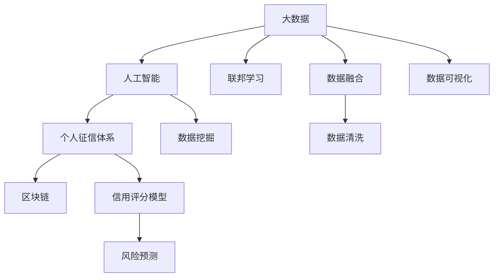

                 

## 1. 背景介绍

在当今数字化时代，大数据技术的迅猛发展为银行征信体系带来了前所未有的机遇与挑战。大数据的积累和分析能力，使得银行在个人信用评估、风险预测、客户行为分析等领域能够实现更为精准、高效的决策。然而，数据量的膨胀也给征信体系带来了复杂性和不确定性，如何在大数据背景下建立有效的个人征信体系，成为银行业亟需解决的关键问题。本文将对大数据背景下的银行个人征信体系进行深入研究，探讨其实现机制、技术挑战与未来趋势。

## 2. 核心概念与联系

### 2.1 核心概念概述

为了准确理解大数据背景下银行个人征信体系的构建，首先需要明确几个核心概念及其联系。

- **大数据**：指规模大、类型多、速度快的海量数据，通常包括结构化数据、半结构化数据和无结构化数据。
- **个人征信体系**：通过收集、整合和分析个人财务信息、信用行为、社交网络等多维度数据，评估和预测个人信用风险的系统。
- **人工智能（AI）**：借助机器学习、深度学习等算法，从海量数据中挖掘知识、发现规律的技术。
- **区块链**：一种分布式账本技术，确保数据的安全、透明和不可篡改。
- **联邦学习**：一种分布式机器学习技术，使得多个参与者在不共享数据的情况下，共同构建模型。

### 2.2 核心概念间的关系

这些概念之间的关系可以用以下Mermaid流程图表示：



该图展示了大数据、人工智能、个人征信体系、区块链和联邦学习之间的关系。大数据提供了海量的数据源，人工智能从中挖掘知识和规律，个人征信体系则基于这些知识和规律进行信用评估和预测。区块链技术保证了数据的安全和透明，联邦学习使得多个参与者可以协同构建模型，而数据融合、数据清洗、数据可视化等技术则确保了数据的准确性和可用性。

## 3. 核心算法原理 & 具体操作步骤

### 3.1 算法原理概述

银行个人征信体系的构建，本质上是通过机器学习算法，从多种数据源中提取信用特征，建立信用评分模型，从而评估和预测个人的信用风险。其核心算法包括：

- **数据预处理**：包括数据清洗、特征工程、数据转换等步骤，确保数据的准确性和一致性。
- **特征选择**：从海量数据中挑选出与信用风险相关的特征，提高模型的预测准确性。
- **模型构建**：使用机器学习算法（如线性回归、逻辑回归、决策树、随机森林、梯度提升等），建立信用评分模型。
- **模型评估与优化**：通过交叉验证、AUC-ROC曲线、F1分数等指标，评估模型性能，并根据评估结果对模型进行优化。

### 3.2 算法步骤详解

以下是详细的操作步骤：

1. **数据采集**：从不同的数据源（如银行交易记录、社交网络、公共记录等）采集个人的财务数据、信用行为、社交行为等多维度数据。

2. **数据清洗与预处理**：对采集到的数据进行清洗和预处理，包括去除异常值、处理缺失值、数据标准化和归一化等步骤，确保数据质量。

3. **特征工程**：选择和构造与信用风险相关的特征，包括但不限于收入、负债、信用历史、社交网络、地理位置等。

4. **模型训练**：选择合适的机器学习算法，使用预处理后的数据进行模型训练，建立信用评分模型。

5. **模型评估**：使用测试集对训练好的模型进行评估，计算模型的准确率、召回率、AUC-ROC曲线等指标，评估模型的性能。

6. **模型优化**：根据评估结果，对模型进行调参、特征选择等优化操作，进一步提升模型性能。

7. **上线部署**：将优化后的模型部署到生产环境，实时监控模型性能，根据需要进行迭代更新。

### 3.3 算法优缺点

**优点**：
- 通过大数据和人工智能技术，能够从多维度数据中提取信用特征，提供更为全面的信用评估。
- 能够实时监控和预测个人的信用风险，提高风险管理的效率和准确性。
- 基于联邦学习，可以在保护用户隐私的前提下，协同构建和更新模型。

**缺点**：
- 数据采集和处理环节复杂，涉及多源数据整合和清洗，技术难度较大。
- 模型的构建和优化需要大量数据和计算资源，初期成本较高。
- 模型解释性不足，难以解释模型的决策过程和依据。

### 3.4 算法应用领域

大数据背景下的银行个人征信体系，广泛应用于以下领域：

- **信用评估**：评估个人的信用风险，包括信用评分、违约概率预测等。
- **风险管理**：监控和预测个人的信用风险变化，进行风险预警和控制。
- **客户画像**：通过多维度数据分析，构建详细的客户画像，了解客户需求和行为。
- **产品推荐**：基于客户的信用评分和行为特征，推荐合适的金融产品和服务。
- **欺诈检测**：识别和防范金融欺诈行为，保护银行和客户的利益。

## 4. 数学模型和公式 & 详细讲解 & 举例说明

### 4.1 数学模型构建

信用评分模型的构建通常使用线性回归模型和逻辑回归模型。以逻辑回归模型为例，假设模型为 $y=\ln\left(\frac{p}{1-p}\right)$，其中 $p$ 表示个人信用良好的概率，则模型的数学表达式为：

$$
\ln\left(\frac{p}{1-p}\right) = \beta_0 + \sum_{i=1}^{n}\beta_i x_i
$$

其中 $\beta_0$ 为截距项，$\beta_i$ 为第 $i$ 个特征的权重系数，$x_i$ 为第 $i$ 个特征值。

### 4.2 公式推导过程

推导过程如下：

- 假设数据集为 $D=\{(x_i,y_i)\}_{i=1}^{N}$，其中 $x_i$ 为特征向量，$y_i$ 为标签（0或1）。
- 目标是最小化损失函数 $L(y,\hat{y})$，其中 $\hat{y}$ 为模型预测值。
- 假设模型为 $y=\ln\left(\frac{p}{1-p}\right)=\beta_0+\sum_{i=1}^{n}\beta_i x_i$，其中 $p$ 为信用良好的概率。
- 使用对数似然函数作为损失函数，即 $L(y,\hat{y})=-\sum_{i=1}^{N}[y_i\ln\hat{y}_i+(1-y_i)\ln(1-\hat{y}_i)]$。
- 通过梯度下降算法，求解 $\beta_0,\beta_1,\dots,\beta_n$，使得损失函数最小化。

### 4.3 案例分析与讲解

假设某银行的个人征信体系使用逻辑回归模型进行信用评估，数据集包含100个样本，每个样本有3个特征：收入、负债和信用历史。通过特征选择和模型训练，得到模型的系数为 $\beta_0=2$，$\beta_1=0.5$，$\beta_2=0.3$。则模型可以表示为：

$$
\ln\left(\frac{p}{1-p}\right)=2+0.5x_1+0.3x_2
$$

其中 $x_1$ 为收入，$x_2$ 为负债。通过模型预测，可以评估任何新客户的信用风险，进行风险控制和产品推荐。

## 5. 项目实践：代码实例和详细解释说明

### 5.1 开发环境搭建

首先需要搭建Python开发环境，安装必要的库和工具。以下是具体步骤：

1. 安装Python：从官网下载并安装Python，推荐使用3.8及以上版本。
2. 安装pip：在Linux系统中，通过命令行安装pip。
3. 安装必要的库：使用pip安装NumPy、Pandas、Scikit-learn、Matplotlib等库。
4. 安装TensorFlow或PyTorch：根据需求安装TensorFlow或PyTorch，搭建深度学习模型。

### 5.2 源代码详细实现

以下是使用Scikit-learn进行信用评分模型训练的Python代码示例：

```python
from sklearn.linear_model import LogisticRegression
from sklearn.model_selection import train_test_split
import pandas as pd
import numpy as np

# 加载数据
data = pd.read_csv('credit_data.csv')

# 特征选择和数据处理
features = ['income', 'debt', 'credit_history']
X = data[features].values
y = data['default'].values

# 数据划分
X_train, X_test, y_train, y_test = train_test_split(X, y, test_size=0.2, random_state=42)

# 模型训练
model = LogisticRegression(solver='liblinear')
model.fit(X_train, y_train)

# 模型评估
y_pred = model.predict(X_test)
print('AUC-ROC:', roc_auc_score(y_test, y_pred))
```

### 5.3 代码解读与分析

**特征选择**：选择与信用风险相关的特征，如收入、负债、信用历史等。

**模型训练**：使用逻辑回归模型进行训练，通过训练数据计算模型系数。

**模型评估**：使用测试数据集对模型进行评估，计算AUC-ROC曲线。

### 5.4 运行结果展示

假设模型训练后，AUC-ROC曲线为0.85，表示模型在信用评估中具有较高的准确性和可靠性。

## 6. 实际应用场景

### 6.1 信用评估

银行在贷款审批、信用卡申请等业务中，利用个人征信体系对客户的信用风险进行评估。通过历史交易数据、信用历史、收入情况等多维度数据，可以构建信用评分模型，实时预测客户的违约概率。

### 6.2 风险管理

银行在贷款审批后，实时监控客户的还款情况，预测违约风险，进行风险预警和控制。通过信用评分模型，及时识别高风险客户，采取相应的风险控制措施。

### 6.3 客户画像

银行通过多维度数据分析，构建详细的客户画像，了解客户的需求和行为。通过信用评分模型，可以分析客户的信用行为，为客户提供个性化的金融产品和服务。

### 6.4 产品推荐

银行根据客户的信用评分和行为特征，推荐合适的金融产品，如贷款、信用卡、理财产品等。通过信用评分模型，可以更好地匹配客户需求和银行产品，提高客户满意度和银行收益。

### 6.5 欺诈检测

银行利用个人征信体系，实时监控客户的交易行为，识别和防范金融欺诈行为。通过异常检测模型，及时发现和处理可疑交易，保护银行和客户的利益。

## 7. 工具和资源推荐

### 7.1 学习资源推荐

- **《Python数据分析与可视化》**：介绍Python在数据分析和可视化中的应用，适合入门学习。
- **《机器学习实战》**：详细讲解机器学习算法的实现和应用，适合进一步学习。
- **《TensorFlow实战》**：讲解TensorFlow框架的搭建和使用，适合深度学习实践。
- **Kaggle平台**：提供海量数据集和竞赛，适合实践和竞赛。
- **GitHub**：提供开源项目和代码，适合学习和贡献。

### 7.2 开发工具推荐

- **PyCharm**：适用于Python开发的工具，提供代码高亮、调试等能力。
- **Jupyter Notebook**：适用于数据科学和机器学习开发的交互式开发环境。
- **TensorFlow**：适用于深度学习开发的框架，提供丰富的API和工具。
- **Scikit-learn**：适用于机器学习开发的库，提供多种常用算法和工具。

### 7.3 相关论文推荐

- **《大数据驱动下的银行个人征信体系》**：介绍大数据在银行个人征信体系中的应用，适合理论研究。
- **《联邦学习在个人征信体系中的应用》**：介绍联邦学习在保护隐私的前提下协同构建信用评分模型的应用，适合技术研究。
- **《区块链在个人征信体系中的应用》**：介绍区块链在保证数据安全性和透明性的应用，适合技术研究。

## 8. 总结：未来发展趋势与挑战

### 8.1 研究成果总结

本文研究了大数据背景下的银行个人征信体系，探讨了其构建机制、技术挑战与未来趋势。通过逻辑回归模型，实时评估和预测客户的信用风险，为银行风险管理和产品推荐提供了新的方法。

### 8.2 未来发展趋势

未来的趋势包括：

- **多模态数据的融合**：结合金融数据、社交数据、位置数据等多模态数据，构建更全面的信用评估模型。
- **实时信用监控**：利用实时数据流处理技术，实现对客户信用状况的实时监控和预测。
- **联邦学习**：通过联邦学习，在不共享数据的前提下，协同构建和更新信用评分模型，保护用户隐私。
- **区块链技术**：利用区块链技术，确保信用数据的安全和透明，防止数据篡改和泄露。
- **人工智能与业务融合**：将人工智能技术与银行业务深度融合，提升服务质量和客户体验。

### 8.3 面临的挑战

未来的挑战包括：

- **数据隐私和安全**：如何在保护用户隐私的前提下，获取和利用数据。
- **数据质量和完整性**：如何确保数据的准确性和完整性，避免数据偏差和错误。
- **模型复杂度**：如何在保证模型性能的前提下，减少模型复杂度和计算成本。
- **多模态数据的融合**：如何有效整合多源数据，避免数据冗余和冲突。

### 8.4 研究展望

未来的研究可以从以下几个方面进行：

- **隐私保护技术**：研究如何在不共享数据的前提下，协同构建和更新信用评分模型。
- **实时信用监控技术**：研究如何利用实时数据流处理技术，实现对客户信用状况的实时监控和预测。
- **多模态数据融合技术**：研究如何有效整合金融数据、社交数据、位置数据等多源数据，构建更全面的信用评估模型。
- **区块链技术应用**：研究如何利用区块链技术，确保信用数据的安全和透明，防止数据篡改和泄露。

## 9. 附录：常见问题与解答

**Q1：如何确保数据隐私和安全？**

A: 采用数据匿名化、数据加密等技术，确保数据在传输和存储过程中的隐私和安全。同时，利用区块链技术，确保数据的透明性和不可篡改性。

**Q2：数据质量如何保障？**

A: 通过数据清洗、数据校验等技术，确保数据的准确性和完整性。同时，利用数据质量监控工具，实时监测和反馈数据质量问题。

**Q3：模型复杂度和计算成本如何平衡？**

A: 采用模型压缩、模型剪枝等技术，减少模型复杂度和计算成本。同时，利用联邦学习技术，分散模型计算负担，降低计算成本。

**Q4：如何有效整合多模态数据？**

A: 通过特征工程和数据融合技术，将金融数据、社交数据、位置数据等多源数据进行整合，构建多模态的信用评估模型。

**Q5：如何实时监控和预测客户信用风险？**

A: 利用实时数据流处理技术，对客户交易数据进行实时监控，通过模型预测客户信用风险，实现风险预警和控制。

---

作者：禅与计算机程序设计艺术 / Zen and the Art of Computer Programming

