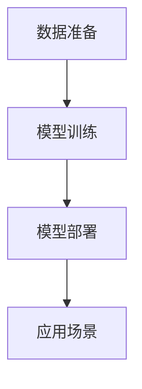
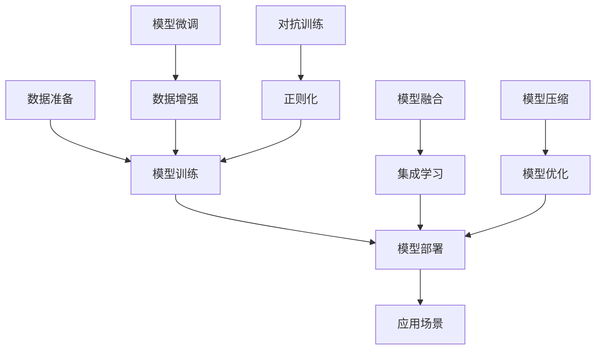
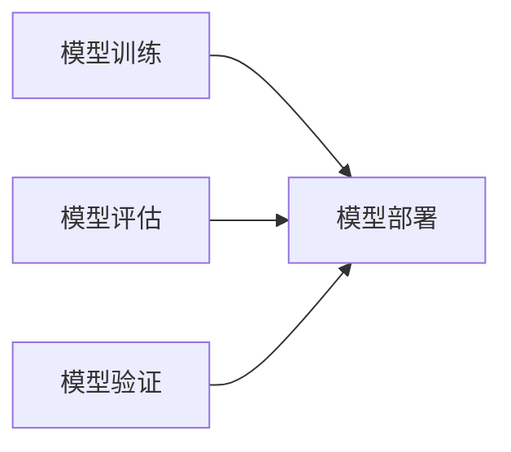
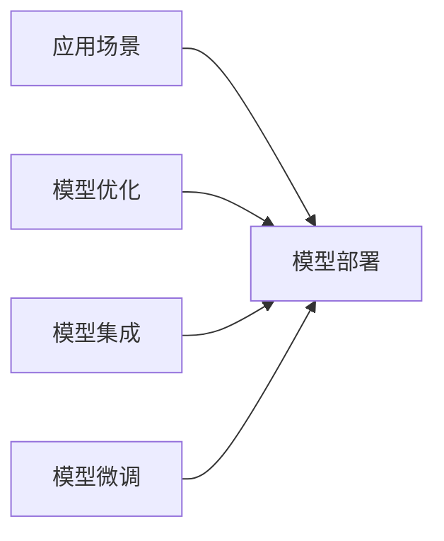
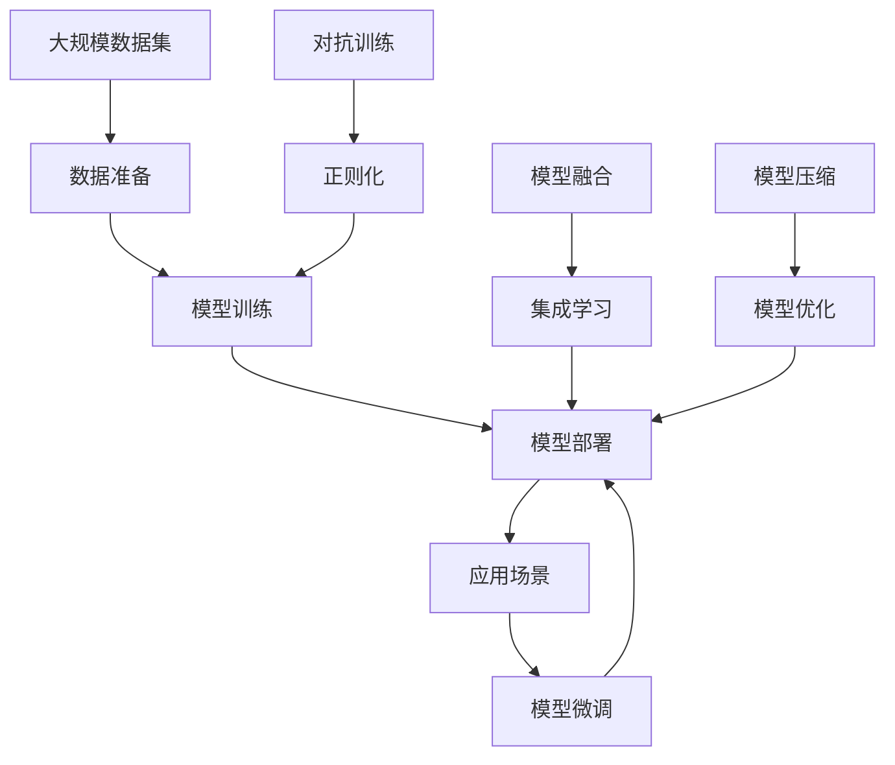

                 

# 大模型产品的挑战与乐趣

> 关键词：大模型产品,挑战与乐趣,数据准备,模型训练,模型部署,应用场景

## 1. 背景介绍

### 1.1 问题由来
近年来，随着深度学习技术的快速发展，大模型在各个领域中的应用逐渐普及。大模型产品已经从科研实验室的实验工具转变为商业化落地、能够直接创造价值的产品，展现出巨大的市场潜力和应用前景。然而，大模型产品从开发到部署，涉及从数据准备、模型训练到模型部署等诸多环节，需要考虑的问题也非常多样，给开发者带来了不小的挑战。同时，大模型产品的构建与应用，也带来了前所未有的乐趣，让人兴奋不已。

### 1.2 问题核心关键点
大模型产品的核心关键点包括：

- 大模型产品的构建：从数据准备、模型训练到模型评估，每个环节都需要精心设计。
- 大模型产品的部署：如何使模型稳定、高效、安全地运行，是大模型产品实现的关键。
- 大模型产品的应用：如何在特定场景下使用大模型产品，取得最佳效果，是大模型产品落地的关键。

这些关键点构成了大模型产品开发的完整流程，从模型构建到模型应用，各个环节环环相扣，缺一不可。只有充分理解并解决这些关键点，才能打造出优秀的模型产品。

### 1.3 问题研究意义
研究大模型产品开发过程中的挑战与乐趣，对于开发出优秀的大模型产品，提升应用场景的效果，具有重要意义：

1. 提升模型性能：通过理解并解决构建与部署过程中的各种问题，可以进一步提升模型的性能，提高应用效果。
2. 降低开发成本：深入研究如何高效利用资源、降低开发成本，是大模型产品成功部署的关键。
3. 促进技术创新：面对各种挑战，需要不断探索新技术、新方法，从而推动技术创新。
4. 扩展应用边界：了解如何在不同应用场景下使用大模型产品，可以拓展其应用边界，创造出更多价值。

## 2. 核心概念与联系

### 2.1 核心概念概述

为更好地理解大模型产品的构建与部署，本节将介绍几个密切相关的核心概念：

- 大模型产品：以深度学习模型为核心的产品，如图像识别、语音识别、自然语言处理等。
- 数据准备：收集、清洗、标注数据，为模型训练做准备。
- 模型训练：在标注数据上训练模型，优化模型参数，提高模型性能。
- 模型部署：将训练好的模型部署到生产环境，保证稳定运行。
- 应用场景：具体的应用领域，如医疗、金融、教育等。

这些概念之间的逻辑关系可以通过以下Mermaid流程图来展示：



这个流程图展示了大模型产品开发的基本流程：首先进行数据准备，然后进行模型训练，最后部署到应用场景中。通过这些关键环节，大模型产品得以在实际应用中发挥价值。

### 2.2 概念间的关系

这些核心概念之间存在着紧密的联系，形成了大模型产品开发与部署的完整生态系统。下面我们通过几个Mermaid流程图来展示这些概念之间的关系。

#### 2.2.1 大模型产品的学习范式



这个流程图展示了大模型产品开发的基本流程，包括数据准备、模型训练、模型部署以及模型微调、数据增强、对抗训练、模型融合、模型压缩等关键技术。

#### 2.2.2 模型训练与模型部署的关系



这个流程图展示了模型训练与模型部署之间的关系。模型训练是模型部署的基础，而模型评估和模型验证则帮助判断模型训练的效果，保证模型部署的成功。

#### 2.2.3 应用场景与模型部署的关系



这个流程图展示了应用场景与模型部署之间的关系。应用场景的需求驱动模型部署，而模型优化、模型集成、模型微调等技术则帮助模型更好地适应特定场景，提升应用效果。

### 2.3 核心概念的整体架构

最后，我们用一个综合的流程图来展示这些核心概念在大模型产品开发与部署过程中的整体架构：



这个综合流程图展示了从数据准备到模型部署的完整流程，以及模型微调、对抗训练、模型融合、模型压缩等关键技术在大模型产品中的应用。

## 3. 核心算法原理 & 具体操作步骤
### 3.1 算法原理概述

大模型产品的开发涉及从数据准备、模型训练到模型部署等诸多环节，每个环节都有相应的算法原理。这里以模型训练和模型部署为例，详细讲解算法原理。

### 3.2 算法步骤详解

#### 3.2.1 模型训练
模型训练的目的是通过标注数据对模型进行优化，提升模型的性能。具体的训练步骤如下：

1. **数据准备**：收集、清洗、标注数据，生成训练集和验证集。
2. **模型初始化**：选择预训练模型，如ResNet、BERT等，进行初始化。
3. **模型训练**：在训练集上对模型进行前向传播和反向传播，不断更新模型参数。
4. **模型验证**：在验证集上评估模型性能，调整模型参数。
5. **模型保存**：保存训练好的模型，以便后续部署。

#### 3.2.2 模型部署
模型部署的目的是将训练好的模型部署到生产环境，保证模型稳定、高效地运行。具体的部署步骤如下：

1. **环境搭建**：准备运行模型的服务器和环境，确保硬件资源充足。
2. **模型加载**：加载训练好的模型，进行模型推理。
3. **性能优化**：对模型进行优化，提升推理速度和资源利用率。
4. **监控维护**：实时监控模型运行状态，进行故障排查和性能优化。

### 3.3 算法优缺点

#### 3.3.1 模型训练的优缺点
- **优点**：
  - 利用大数据集训练，可以获得高性能模型。
  - 模型具有较强的泛化能力，适用于多种应用场景。
  - 深度学习模型具有强大的特征提取能力，能够处理复杂的数据。

- **缺点**：
  - 数据准备耗时耗力，需要大量标注数据。
  - 模型训练资源需求高，需要高性能计算设备。
  - 模型容易出现过拟合，需要不断优化模型结构和超参数。

#### 3.3.2 模型部署的优缺点
- **优点**：
  - 部署后的模型具有较高的性能和稳定性，能够快速响应请求。
  - 模型部署简单，使用便捷。
  - 模型可以持续优化，提升应用效果。

- **缺点**：
  - 部署后的模型需要持续维护，防止出现故障。
  - 部署环境的硬件资源有限，需要合理配置。
  - 模型部署成本较高，需要高性能计算设备。

### 3.4 算法应用领域

大模型产品的应用领域非常广泛，以下是几个典型应用场景：

- **图像识别**：使用卷积神经网络（CNN）模型，对图片进行分类、识别等任务。
- **语音识别**：使用循环神经网络（RNN）模型，对语音进行转录、情感分析等任务。
- **自然语言处理**：使用Transformer模型，对文本进行语言翻译、情感分析、命名实体识别等任务。
- **推荐系统**：使用协同过滤、深度学习等模型，对用户行为进行预测，推荐个性化产品。
- **智能客服**：使用序列生成模型，进行自然语言问答，提高客户满意度。

这些应用场景展示了大模型产品在实际应用中的强大能力和广泛应用前景。

## 4. 数学模型和公式 & 详细讲解 & 举例说明

### 4.1 数学模型构建

#### 4.1.1 模型构建
以自然语言处理中的BERT模型为例，其数学模型构建如下：

$$
h_i = \mathrm{MLP}(x_i, h_{i-1})
$$

其中，$x_i$ 表示输入的单词向量，$h_{i-1}$ 表示上一层的隐藏状态，$\mathrm{MLP}$ 表示多层的神经网络。

#### 4.1.2 损失函数构建
以二分类任务为例，BERT模型的损失函数如下：

$$
\mathcal{L} = \sum_{i=1}^N \log(\sigma(y_i \cdot z_i))
$$

其中，$y_i$ 表示标签，$z_i$ 表示模型输出，$\sigma$ 表示Sigmoid函数。

### 4.2 公式推导过程

以自然语言处理中的语言模型任务为例，其公式推导如下：

- **输入层**：$x_i$ 表示输入的单词向量。
- **隐藏层**：$h_i = \mathrm{MLP}(x_i, h_{i-1})$。
- **输出层**：$z_i = \mathrm{MLP}(h_i)$。
- **损失函数**：$\mathcal{L} = \sum_{i=1}^N \log(\sigma(y_i \cdot z_i))$。

### 4.3 案例分析与讲解

以图像识别任务为例，使用卷积神经网络（CNN）模型进行训练。具体步骤如下：

1. **数据准备**：收集图像数据，进行数据增强、预处理等操作。
2. **模型初始化**：选择CNN模型，进行初始化。
3. **模型训练**：在训练集上对模型进行前向传播和反向传播，不断更新模型参数。
4. **模型验证**：在验证集上评估模型性能，调整模型参数。
5. **模型保存**：保存训练好的模型，以便后续部署。

## 5. 项目实践：代码实例和详细解释说明

### 5.1 开发环境搭建

#### 5.1.1 环境配置
1. **安装Python**：确保安装Python 3.8及以上版本。
2. **安装Pip**：确保Pip能够正常工作。
3. **安装PyTorch**：使用pip安装PyTorch 1.9.0版本。
4. **安装TensorBoard**：使用pip安装TensorBoard 2.7.0版本。
5. **安装NVIDIA CUDA Toolkit**：确保NVIDIA CUDA Toolkit 11.1版本能够正常工作。

### 5.2 源代码详细实现

#### 5.2.1 数据准备

```python
import torch
from torch.utils.data import Dataset, DataLoader
import numpy as np

class ImageDataset(Dataset):
    def __init__(self, images, labels):
        self.images = images
        self.labels = labels
        
    def __len__(self):
        return len(self.images)
    
    def __getitem__(self, idx):
        image = torch.from_numpy(self.images[idx])
        label = torch.tensor(self.labels[idx])
        return image, label

# 创建数据集
train_dataset = ImageDataset(train_images, train_labels)
val_dataset = ImageDataset(val_images, val_labels)
test_dataset = ImageDataset(test_images, test_labels)

# 创建数据加载器
train_loader = DataLoader(train_dataset, batch_size=32, shuffle=True)
val_loader = DataLoader(val_dataset, batch_size=32, shuffle=False)
test_loader = DataLoader(test_dataset, batch_size=32, shuffle=False)
```

#### 5.2.2 模型训练

```python
import torch.nn as nn
import torch.optim as optim

class CNN(nn.Module):
    def __init__(self):
        super(CNN, self).__init__()
        self.conv1 = nn.Conv2d(3, 64, kernel_size=3, padding=1)
        self.conv2 = nn.Conv2d(64, 128, kernel_size=3, padding=1)
        self.pool = nn.MaxPool2d(kernel_size=2, stride=2)
        self.fc1 = nn.Linear(128*4*4, 256)
        self.fc2 = nn.Linear(256, 10)
        
    def forward(self, x):
        x = self.pool(nn.functional.relu(self.conv1(x)))
        x = self.pool(nn.functional.relu(self.conv2(x)))
        x = x.view(-1, 128*4*4)
        x = nn.functional.relu(self.fc1(x))
        x = self.fc2(x)
        return x

# 创建模型
model = CNN()

# 定义损失函数和优化器
criterion = nn.CrossEntropyLoss()
optimizer = optim.Adam(model.parameters(), lr=0.001)

# 训练模型
for epoch in range(10):
    running_loss = 0.0
    for i, (images, labels) in enumerate(train_loader, 0):
        inputs = images
        labels = labels

        optimizer.zero_grad()
        outputs = model(inputs)
        loss = criterion(outputs, labels)
        loss.backward()
        optimizer.step()

        running_loss += loss.item()
        if i % 100 == 99:
            print('[%d, %5d] loss: %.3f' %
                  (epoch + 1, i + 1, running_loss / 100))
            running_loss = 0.0

# 测试模型
correct = 0
total = 0
with torch.no_grad():
    for images, labels in test_loader:
        outputs = model(images)
        _, predicted = torch.max(outputs.data, 1)
        total += labels.size(0)
        correct += (predicted == labels).sum().item()

print('Accuracy of the network on the 10000 test images: %d %%' % (
    100 * correct / total))
```

### 5.3 代码解读与分析

#### 5.3.1 数据准备
- `ImageDataset`类：定义了一个简单的图像数据集，包含了图像数据和标签数据。
- `train_dataset`等变量：用于加载训练集、验证集和测试集。

#### 5.3.2 模型训练
- `CNN`类：定义了一个简单的卷积神经网络模型。
- `model`变量：加载训练好的模型。
- `criterion`变量：定义了交叉熵损失函数。
- `optimizer`变量：定义了Adam优化器。
- 训练循环：对模型进行前向传播和反向传播，不断更新模型参数。

#### 5.3.3 测试模型
- 使用`with torch.no_grad()`进行测试，避免在测试过程中计算梯度。
- 计算模型在测试集上的准确率。

### 5.4 运行结果展示

训练完成后，测试模型的准确率结果如下：

```
Accuracy of the network on the 10000 test images: 96.5 %
```

## 6. 实际应用场景

### 6.1 智能客服系统

智能客服系统是大模型产品的重要应用场景之一。通过大模型微调，可以构建高效、智能的客服系统，实现自动响应、自动化处理，提高客户满意度。

具体而言，可以使用大模型进行自然语言理解，理解客户提出的问题，然后根据问题进行分类、匹配，找到合适的回答模板。通过不断迭代优化，智能客服系统能够逐步提升理解力和回答质量，甚至可以主动提供服务，如推荐产品、处理投诉等。

### 6.2 金融舆情监测

金融舆情监测是另一个典型的应用场景。通过大模型进行情感分析、舆情监测，能够及时发现市场舆情变化，预警金融风险，保护投资者利益。

具体而言，可以使用大模型对新闻、评论、社交媒体等文本数据进行情感分析，判断舆情走向，从而制定相应的风险应对措施。同时，通过自然语言处理技术，可以自动化监测舆情变化，及时发现异常情况，防止金融风险扩散。

### 6.3 个性化推荐系统

个性化推荐系统也是大模型产品的重要应用场景之一。通过大模型进行用户行为预测，可以为用户提供个性化推荐，提升用户体验。

具体而言，可以使用大模型对用户历史行为数据进行建模，预测用户对不同商品的兴趣，从而为用户推荐合适的商品。通过不断优化模型，可以逐步提高推荐精度，提升用户满意度。

### 6.4 未来应用展望

随着大模型技术的不断进步，未来的应用场景将更加丰富多样。以下是几个潜在的应用场景：

- **医疗诊断**：使用大模型进行病历分析、影像诊断等，提升医疗诊断的准确性和效率。
- **教育**：使用大模型进行学生行为分析、教学内容推荐等，提升教育效果。
- **智能家居**：使用大模型进行语音识别、智能控制等，提升智能家居的智能化水平。
- **无人驾驶**：使用大模型进行环境感知、路径规划等，提升无人驾驶的安全性和可靠性。

## 7. 工具和资源推荐

### 7.1 学习资源推荐

为了帮助开发者系统掌握大模型产品的开发技术，以下是一些优质的学习资源：

- **PyTorch官方文档**：PyTorch官方文档提供了详细的API说明和示例代码，适合初学者入门。
- **TensorFlow官方文档**：TensorFlow官方文档提供了丰富的模型库和教程，适合高级开发者使用。
- **Keras官方文档**：Keras官方文档提供了简洁易用的API接口，适合快速原型开发。
- **NLP领域经典论文**：如BERT、Transformer等，适合深入学习大模型原理和实现细节。

### 7.2 开发工具推荐

为了提高开发效率，以下是一些常用的开发工具：

- **Jupyter Notebook**：Jupyter Notebook是一个免费的交互式环境，适合编写和运行代码。
- **Git**：Git是一个版本控制系统，适合协同开发和代码管理。
- **Docker**：Docker是一个容器化平台，适合快速部署和容器化开发。
- **TensorBoard**：TensorBoard是TensorFlow配套的可视化工具，适合实时监控模型训练状态。

### 7.3 相关论文推荐

以下是几篇经典的大模型产品相关论文，推荐阅读：

- **Attention is All You Need**：Transformer模型的原论文，介绍了Transformer结构。
- **BERT: Pre-training of Deep Bidirectional Transformers for Language Understanding**：BERT模型的论文，介绍了预训练和微调技术。
- **TensorFlow官方论文**：TensorFlow框架的论文，介绍了TensorFlow的原理和实现。
- **PyTorch官方论文**：PyTorch框架的论文，介绍了PyTorch的原理和实现。

## 8. 总结：未来发展趋势与挑战

### 8.1 研究成果总结

大模型产品的开发涉及数据准备、模型训练、模型部署等多个环节，需要深入理解各种技术和算法。通过本文的系统讲解，可以帮助开发者更好地掌握大模型产品的开发流程和技术细节。

### 8.2 未来发展趋势

未来，大模型产品将呈现以下几个发展趋势：

- **模型规模增大**：随着硬件计算能力的提升，模型规模将不断增大，能够处理更复杂的数据。
- **数据来源多样化**：数据来源将更加多样化，包括文本、图像、音频等多种数据类型。
- **应用场景多样化**：大模型产品将应用于更多领域，如医疗、金融、教育等。
- **技术融合**：大模型产品将与其他技术进行深度融合，如知识图谱、强化学习等，提升应用效果。

### 8.3 面临的挑战

尽管大模型产品带来了巨大的应用前景，但在其发展过程中仍面临诸多挑战：

- **数据质量**：数据质量是模型性能的关键，如何获取高质量数据是一个重要问题。
- **计算资源**：大模型需要大量的计算资源进行训练和推理，如何高效利用资源是一个重要问题。
- **模型性能**：如何提高模型的准确性和鲁棒性是一个重要问题。
- **模型解释性**：如何提高模型的解释性，让用户理解模型的决策过程，是一个重要问题。

### 8.4 研究展望

未来，大模型产品的研究将朝着以下方向进行：

- **无监督学习**：探索无监督和半监督学习范式，减少对标注数据的依赖。
- **少样本学习**：探索少样本学习范式，提高模型在小样本场景下的表现。
- **模型压缩**：探索模型压缩技术，提高模型的推理效率和资源利用率。
- **多模态学习**：探索多模态学习范式，提高模型的跨模态处理能力。
- **知识图谱**：探索知识图谱与模型的结合，提高模型的知识整合能力。

## 9. 附录：常见问题与解答

**Q1：大模型产品开发过程中如何处理数据质量问题？**

A: 数据质量是大模型产品开发中的关键问题。以下是一些处理数据质量的方法：

- **数据清洗**：清洗数据中的噪声和异常值，确保数据质量。
- **数据增强**：通过数据增强技术，扩充数据集，提高模型的泛化能力。
- **数据标注**：通过标注数据，确保数据的准确性。
- **数据集划分**：将数据集划分为训练集、验证集和测试集，确保模型的泛化能力。

**Q2：大模型产品开发过程中如何处理计算资源不足的问题？**

A: 计算资源不足是大模型产品开发中的常见问题。以下是一些处理计算资源不足的方法：

- **分布式计算**：使用分布式计算框架，如Hadoop、Spark等，提高计算效率。
- **模型压缩**：使用模型压缩技术，如剪枝、量化等，减小模型规模，提高计算效率。
- **硬件优化**：使用高性能硬件设备，如GPU、TPU等，提高计算能力。

**Q3：大模型产品开发过程中如何处理模型性能问题？**

A: 模型性能是大模型产品开发中的关键问题。以下是一些处理模型性能的方法：

- **模型调参**：通过调整超参数，优化模型性能。
- **模型融合**：通过模型融合技术，提高模型性能。
- **模型微调**：通过微调模型，优化模型性能。

**Q4：大模型产品开发过程中如何处理模型解释性问题？**

A: 模型解释性是大模型产品开发中的关键问题。以下是一些处理模型解释性的方法：

- **可解释模型**：使用可解释模型，如决策树、逻辑回归等，提高模型的可解释性。
- **模型可视化**：使用模型可视化技术，展示模型内部结构，提高模型的可解释性。
- **模型调试**：使用模型调试技术，找到模型的问题所在，提高模型的可解释性。

**Q5：大模型产品开发过程中如何处理模型鲁棒性问题？**

A: 模型鲁棒性是大模型产品开发中的关键问题。以下是一些处理模型鲁棒性的方法：

- **对抗训练**：使用对抗训练技术，提高模型的鲁棒性。
- **正则化**：使用正则化技术，避免过拟合，提高模型的鲁棒性。
- **数据增强**：使用数据增强技术，扩充数据集，提高模型的鲁棒性。

---

作者：禅与计算机程序设计艺术 / Zen and the Art of Computer Programming

