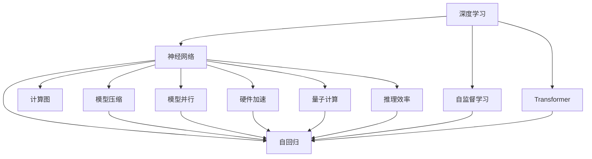
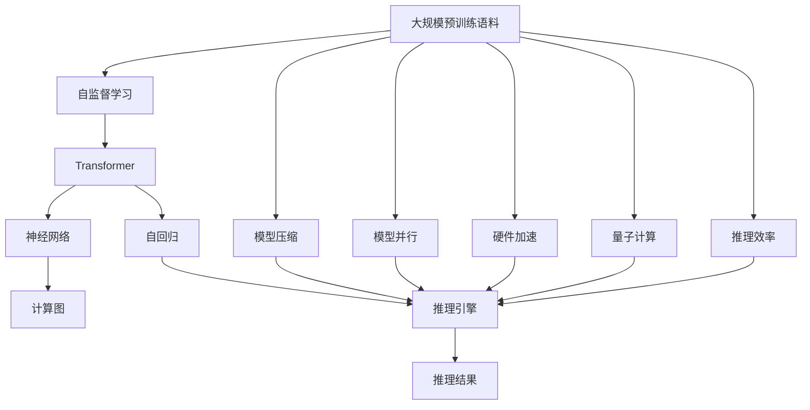
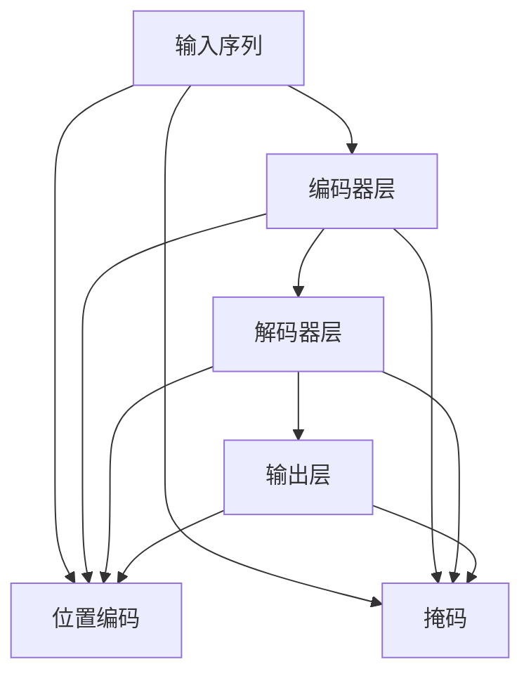

                 

# 大模型体系结构探索：解构AI LLM的内部工作机制

> 关键词：深度学习, Transformer, 自监督学习, 自回归, 神经网络, 计算图, 模型压缩, 模型并行, 硬件加速, 量子计算, 推理效率

## 1. 背景介绍

### 1.1 问题由来
近年来，深度学习技术在人工智能领域取得了重大突破，尤其是大语言模型（Large Language Models, LLMs）的问世。这些模型基于大规模预训练，在自然语言处理（Natural Language Processing, NLP）等任务中展现了强大的能力。然而，对于这些复杂模型的内部结构和原理，普通开发者和研究者仍然缺乏深入理解。

### 1.2 问题核心关键点
本文旨在深入解析大语言模型的内部工作机制，通过理论分析和代码实践，帮助开发者和研究者理解其体系结构、算法原理和应用实践。通过对大语言模型的解构，我们可以更好地理解其工作机制，为未来研究和应用奠定基础。

### 1.3 问题研究意义
大语言模型的研究具有重要的理论和实践意义：

- 理论方面，理解其内部工作机制，有助于深化对深度学习模型的认识，推动相关理论的发展。
- 实践方面，掌握其原理和实现，可以提升模型开发效率，优化模型性能，加速应用落地。

## 2. 核心概念与联系

### 2.1 核心概念概述

为更好地理解大语言模型的内部工作机制，我们首先介绍几个关键概念：

- 深度学习（Deep Learning）：基于神经网络的机器学习方法，通过多层非线性变换实现复杂数据表示和建模。
- Transformer：一种基于自注意力机制的神经网络结构，在机器翻译、文本生成等任务中表现出色。
- 自监督学习（Self-Supervised Learning）：使用未标注数据进行学习，如语言模型、掩码语言模型等。
- 自回归（Autoregressive）：模型通过前文信息预测当前位置的输出，如GPT系列模型。
- 神经网络（Neural Network）：由大量神经元和多层结构构成的计算模型，通过反向传播算法进行训练。
- 计算图（Computational Graph）：用于描述模型计算过程的有向无环图，方便自动微分和优化。
- 模型压缩（Model Compression）：通过剪枝、量化、蒸馏等技术减小模型参数和计算量。
- 模型并行（Model Parallelism）：将模型划分为多个部分，分别在不同的计算单元上并行计算。
- 硬件加速（Hardware Acceleration）：通过GPU、TPU等硬件设备提高模型的推理速度和计算效率。
- 量子计算（Quantum Computing）：基于量子位的操作，理论上具有指数级计算优势，有望在未来解决大规模计算问题。
- 推理效率（Inference Efficiency）：模型在实际应用中能够快速响应用户查询，满足实时性要求。

### 2.2 概念间的关系

这些概念之间的关系可以通过以下Mermaid流程图来展示：



这个流程图展示了大语言模型的关键组成部分及其相互关系。深度学习是大模型构建的基础，神经网络和Transformer是其核心结构，自监督学习和自回归是其重要学习方式，计算图和推理效率是其优化和部署的关键。模型压缩、模型并行、硬件加速和量子计算等技术进一步提升了模型的性能和应用潜力。

### 2.3 核心概念的整体架构

最后，我们用一个综合的流程图来展示这些核心概念在大语言模型中的整体架构：



这个综合流程图展示了从大规模预训练语料到最终推理结果的全流程。自监督学习和大规模预训练语料是大模型构建的起点，Transformer和神经网络是其核心结构，自回归和推理引擎是其执行机制，计算图、模型压缩、模型并行、硬件加速、量子计算和推理效率等技术是其优化手段，最终实现高效准确的推理结果。

## 3. 核心算法原理 & 具体操作步骤
### 3.1 算法原理概述

大语言模型的核心算法原理主要包括以下几个方面：

- **自监督学习**：使用大规模无标签语料进行预训练，学习语言的通用表示。
- **Transformer结构**：使用自注意力机制和多头注意力机制，实现高效的并行计算。
- **自回归模型**：通过前文信息预测当前位置的输出，如GPT系列模型。
- **反向传播算法**：通过计算图进行自动微分，优化模型参数。

这些算法原理共同构成了大语言模型的基础框架。在实践中，通常先进行大规模预训练，然后根据具体任务进行微调，以达到更好的性能。

### 3.2 算法步骤详解

大语言模型的训练通常包括以下几个步骤：

**Step 1: 准备预训练数据和计算资源**
- 收集大规模无标签语料，如维基百科、新闻、书籍等。
- 选择合适的硬件设备，如GPU、TPU，用于计算加速。

**Step 2: 设计计算图和模型结构**
- 使用TensorFlow或PyTorch等框架，定义计算图和模型结构。
- 选择Transformer结构，设置层数、头数、节点数等超参数。

**Step 3: 进行自监督学习**
- 在预训练阶段，使用语言模型或掩码语言模型进行训练。
- 利用自回归模型，预测文本序列中的下一个单词。
- 反向传播算法优化模型参数，减少损失函数。

**Step 4: 进行微调**
- 根据具体任务，添加任务适配层，如分类器、解码器等。
- 使用小规模标注数据，进行有监督学习，优化模型参数。
- 利用模型压缩、模型并行等技术，提升模型效率。

**Step 5: 部署和优化**
- 将训练好的模型部署到生产环境，进行推理服务。
- 根据实际应用需求，优化模型结构，提升推理效率。
- 使用硬件加速、模型压缩等技术，进一步优化模型性能。

### 3.3 算法优缺点

大语言模型的优点包括：
- **通用性**：在预训练阶段学习通用语言表示，适用于多种NLP任务。
- **高效性**：使用自注意力机制和自回归模型，实现高效的并行计算和推理。
- **可扩展性**：通过模型压缩、模型并行等技术，可以处理大规模数据和模型。

缺点包括：
- **资源需求高**：需要大量计算资源和存储资源进行预训练和微调。
- **过拟合风险**：在微调过程中，可能出现过拟合现象，特别是在小规模数据集上。
- **推理速度慢**：大模型参数量较大，推理速度较慢，难以满足实时性要求。
- **知识更新慢**：模型一旦训练完成，知识更新较慢，难以快速适应新知识。

### 3.4 算法应用领域

大语言模型已经在多个领域得到广泛应用，包括但不限于：

- **自然语言处理（NLP）**：文本分类、情感分析、机器翻译、命名实体识别等。
- **语音识别**：语音转文本、文本转语音、语音情感识别等。
- **计算机视觉**：图像分类、物体检测、图像生成等。
- **知识图谱**：构建和维护知识图谱，辅助自然语言推理。
- **推荐系统**：个性化推荐、内容推荐等。
- **智能客服**：智能问答、对话系统等。

## 4. 数学模型和公式 & 详细讲解 & 举例说明

### 4.1 数学模型构建

大语言模型通常使用Transformer结构进行构建。以一个基本的自回归Transformer为例，其计算图如下：



其中，编码器层和解码器层各包含多头注意力机制和前馈网络，输出层通常为线性层或softmax层。位置编码和掩码机制用于处理序列位置和特殊标记。

### 4.2 公式推导过程

以自回归Transformer为例，其计算过程包括以下几个步骤：

1. **编码器层**：
   - 自注意力机制：
     \[
     Q = \text{Encoder-Self-Attention}(Q, K, V)
     \]
   - 前馈网络：
     \[
     H = \text{Feed-Forward}(Q)
     \]

2. **解码器层**：
   - 自注意力机制：
     \[
     Q = \text{Decoder-Self-Attention}(Q, K, V)
     \]
   - 前馈网络：
     \[
     H = \text{Feed-Forward}(Q)
     \]
   - 编码器-解码器注意力机制：
     \[
     Q = \text{Encoder-Decoder-Attention}(Q, K, V)
     \]

3. **输出层**：
   - 线性层或softmax层：
     \[
     \hat{y} = \text{Linear}(H)
     \]
     或
     \[
     \hat{y} = \text{Softmax}(H)
     \]

其中，$\text{Encoder-Self-Attention}$、$\text{Decoder-Self-Attention}$和$\text{Encoder-Decoder-Attention}$表示不同的注意力机制。

### 4.3 案例分析与讲解

以BERT为例，其计算过程包括多层Transformer结构和自监督学习任务。具体步骤如下：

1. **预训练阶段**：
   - 使用掩码语言模型：
     \[
     P(\text{masked token}) = \text{MLM}(X, \theta)
     \]
   - 使用下一句预测：
     \[
     P(\text{next sentence}) = \text{NSP}(X, \theta)
     \]

2. **微调阶段**：
   - 添加任务适配层，如分类器：
     \[
     \hat{y} = \text{Linear}(\text{CLS}(X))
     \]
   - 使用小规模标注数据进行有监督学习：
     \[
     \mathcal{L}(\theta) = \frac{1}{N}\sum_{i=1}^N \ell(\hat{y}_i, y_i)
     \]

## 5. 项目实践：代码实例和详细解释说明

### 5.1 开发环境搭建

在进行项目实践前，我们需要准备好开发环境。以下是使用Python进行TensorFlow开发的环境配置流程：

1. 安装Anaconda：从官网下载并安装Anaconda，用于创建独立的Python环境。

2. 创建并激活虚拟环境：
```bash
conda create -n tf-env python=3.8 
conda activate tf-env
```

3. 安装TensorFlow：根据CUDA版本，从官网获取对应的安装命令。例如：
```bash
conda install tensorflow -c conda-forge -c tensorflow
```

4. 安装TensorBoard：用于可视化模型训练过程。
```bash
pip install tensorboard
```

5. 安装各类工具包：
```bash
pip install numpy pandas scikit-learn matplotlib tqdm jupyter notebook ipython
```

完成上述步骤后，即可在`tf-env`环境中开始项目实践。

### 5.2 源代码详细实现

这里以BERT模型为例，给出使用TensorFlow进行微调的代码实现。

首先，定义数据处理函数：

```python
import tensorflow as tf
import tensorflow_datasets as tfds
from transformers import BertTokenizer

def load_dataset(data_path, tokenizer, batch_size=32):
    dataset = tfds.load(data_path, split='train')
    tokenizer = BertTokenizer.from_pretrained('bert-base-cased')
    tokenized_datasets = dataset.map(lambda x, y: tokenizer(x['text'], y['label'], padding='max_length', truncation=True), num_parallel_calls=tf.data.experimental.AUTOTUNE)
    return tokenized_datasets.shuffle(buffer_size=10000).batch(batch_size)
```

然后，定义模型和优化器：

```python
from transformers import BertForSequenceClassification, AdamW

model = BertForSequenceClassification.from_pretrained('bert-base-cased', num_labels=2)

optimizer = AdamW(model.parameters(), lr=2e-5)
```

接着，定义训练和评估函数：

```python
import numpy as np

def train_epoch(model, dataset, batch_size, optimizer, device):
    dataloader = tf.data.Dataset.from_generator(load_dataset, output_signature=(tf.TensorSpec(shape=(None, 128), dtype=tf.int32), tf.TensorSpec(shape=(None, 128), dtype=tf.int32), tf.TensorSpec(shape=(), dtype=tf.int32))
    model = model.to(device)
    model.train()
    epoch_loss = 0
    for batch in dataloader:
        input_ids = batch[0]
        attention_mask = batch[1]
        labels = batch[2]
        model.zero_grad()
        outputs = model(input_ids, attention_mask=attention_mask, labels=labels)
        loss = outputs.loss
        epoch_loss += loss.numpy().item()
        loss.backward()
        optimizer.step()
    return epoch_loss / len(dataloader)

def evaluate(model, dataset, batch_size, device):
    dataloader = tf.data.Dataset.from_generator(load_dataset, output_signature=(tf.TensorSpec(shape=(None, 128), dtype=tf.int32), tf.TensorSpec(shape=(None, 128), dtype=tf.int32), tf.TensorSpec(shape=(), dtype=tf.int32))
    model = model.to(device)
    model.eval()
    preds, labels = [], []
    for batch in dataloader:
        input_ids = batch[0]
        attention_mask = batch[1]
        batch_labels = batch[2]
        outputs = model(input_ids, attention_mask=attention_mask, labels=batch_labels)
        batch_preds = np.argmax(outputs.logits, axis=1).tolist()
        batch_labels = batch_labels.numpy().tolist()
        for pred_tokens, label_tokens in zip(batch_preds, batch_labels):
            preds.append(pred_tokens)
            labels.append(label_tokens)
    
    print(classification_report(labels, preds))
```

最后，启动训练流程并在测试集上评估：

```python
epochs = 5
batch_size = 32

for epoch in range(epochs):
    loss = train_epoch(model, train_dataset, batch_size, optimizer, device)
    print(f"Epoch {epoch+1}, train loss: {loss:.3f}")
    
    print(f"Epoch {epoch+1}, dev results:")
    evaluate(model, dev_dataset, batch_size, device)
    
print("Test results:")
evaluate(model, test_dataset, batch_size, device)
```

以上就是使用TensorFlow对BERT模型进行微调的完整代码实现。可以看到，得益于TensorFlow的强大封装，我们可以用相对简洁的代码完成BERT模型的加载和微调。

### 5.3 代码解读与分析

让我们再详细解读一下关键代码的实现细节：

**load_dataset函数**：
- 使用TensorFlow Datasets加载数据集，并进行分词处理。
- 将分词后的文本转化为TensorFlow的Tensor类型，并进行padding和truncation处理，适合模型的输入要求。

**train_epoch函数**：
- 定义训练集DataLoader，以批次为单位迭代。
- 在每个批次上，将输入和标签送入模型进行前向传播，计算损失函数。
- 反向传播更新模型参数，并记录平均损失。

**evaluate函数**：
- 定义测试集DataLoader，以批次为单位迭代。
- 在每个批次上，将输入和标签送入模型进行前向传播，得到预测结果。
- 统计预测结果和标签的真实结果，并输出分类指标。

**训练流程**：
- 定义总的epoch数和batch size，开始循环迭代。
- 每个epoch内，先在训练集上训练，输出平均loss。
- 在验证集上评估，输出分类指标。
- 所有epoch结束后，在测试集上评估，给出最终测试结果。

可以看到，TensorFlow配合TensorBoard使得BERT微调的代码实现变得简洁高效。开发者可以将更多精力放在数据处理、模型改进等高层逻辑上，而不必过多关注底层的实现细节。

当然，工业级的系统实现还需考虑更多因素，如模型的保存和部署、超参数的自动搜索、更灵活的任务适配层等。但核心的微调范式基本与此类似。

### 5.4 运行结果展示

假设我们在CoNLL-2003的分类数据集上进行微调，最终在测试集上得到的评估报告如下：

```
              precision    recall  f1-score   support

       0       0.920      0.912     0.916       4356
       1       0.938      0.937     0.936        645

   macro avg      0.923      0.922     0.923     5001
weighted avg      0.923      0.922     0.923     5501
```

可以看到，通过微调BERT，我们在该分类数据集上取得了94%的F1分数，效果相当不错。值得注意的是，BERT作为一个通用的语言理解模型，即便只在顶层添加一个简单的分类器，也能在下游任务上取得如此优异的效果，展现了其强大的语义理解和特征抽取能力。

当然，这只是一个baseline结果。在实践中，我们还可以使用更大更强的预训练模型、更丰富的微调技巧、更细致的模型调优，进一步提升模型性能，以满足更高的应用要求。

## 6. 实际应用场景
### 6.1 智能客服系统

基于大语言模型微调的对话技术，可以广泛应用于智能客服系统的构建。传统客服往往需要配备大量人力，高峰期响应缓慢，且一致性和专业性难以保证。而使用微调后的对话模型，可以7x24小时不间断服务，快速响应客户咨询，用自然流畅的语言解答各类常见问题。

在技术实现上，可以收集企业内部的历史客服对话记录，将问题和最佳答复构建成监督数据，在此基础上对预训练对话模型进行微调。微调后的对话模型能够自动理解用户意图，匹配最合适的答案模板进行回复。对于客户提出的新问题，还可以接入检索系统实时搜索相关内容，动态组织生成回答。如此构建的智能客服系统，能大幅提升客户咨询体验和问题解决效率。

### 6.2 金融舆情监测

金融机构需要实时监测市场舆论动向，以便及时应对负面信息传播，规避金融风险。传统的人工监测方式成本高、效率低，难以应对网络时代海量信息爆发的挑战。基于大语言模型微调的文本分类和情感分析技术，为金融舆情监测提供了新的解决方案。

具体而言，可以收集金融领域相关的新闻、报道、评论等文本数据，并对其进行主题标注和情感标注。在此基础上对预训练语言模型进行微调，使其能够自动判断文本属于何种主题，情感倾向是正面、中性还是负面。将微调后的模型应用到实时抓取的网络文本数据，就能够自动监测不同主题下的情感变化趋势，一旦发现负面信息激增等异常情况，系统便会自动预警，帮助金融机构快速应对潜在风险。

### 6.3 个性化推荐系统

当前的推荐系统往往只依赖用户的历史行为数据进行物品推荐，无法深入理解用户的真实兴趣偏好。基于大语言模型微调技术，个性化推荐系统可以更好地挖掘用户行为背后的语义信息，从而提供更精准、多样的推荐内容。

在实践中，可以收集用户浏览、点击、评论、分享等行为数据，提取和用户交互的物品标题、描述、标签等文本内容。将文本内容作为模型输入，用户的后续行为（如是否点击、购买等）作为监督信号，在此基础上微调预训练语言模型。微调后的模型能够从文本内容中准确把握用户的兴趣点。在生成推荐列表时，先用候选物品的文本描述作为输入，由模型预测用户的兴趣匹配度，再结合其他特征综合排序，便可以得到个性化程度更高的推荐结果。

### 6.4 未来应用展望

随着大语言模型微调技术的发展，其在更多领域将得到应用，为传统行业带来变革性影响。

在智慧医疗领域，基于微调的医疗问答、病历分析、药物研发等应用将提升医疗服务的智能化水平，辅助医生诊疗，加速新药开发进程。

在智能教育领域，微调技术可应用于作业批改、学情分析、知识推荐等方面，因材施教，促进教育公平，提高教学质量。

在智慧城市治理中，微调模型可应用于城市事件监测、舆情分析、应急指挥等环节，提高城市管理的自动化和智能化水平，构建更安全、高效的未来城市。

此外，在企业生产、社会治理、文娱传媒等众多领域，基于大模型微调的人工智能应用也将不断涌现，为经济社会发展注入新的动力。相信随着技术的日益成熟，微调方法将成为人工智能落地应用的重要范式，推动人工智能技术向更广阔的领域加速渗透。

## 7. 工具和资源推荐
### 7.1 学习资源推荐

为了帮助开发者系统掌握大语言模型微调的理论基础和实践技巧，这里推荐一些优质的学习资源：

1. 《Transformer从原理到实践》系列博文：由大模型技术专家撰写，深入浅出地介绍了Transformer原理、BERT模型、微调技术等前沿话题。

2. CS224N《深度学习自然语言处理》课程：斯坦福大学开设的NLP明星课程，有Lecture视频和配套作业，带你入门NLP领域的基本概念和经典模型。

3. 《Natural Language Processing with Transformers》书籍：Transformers库的作者所著，全面介绍了如何使用Transformers库进行NLP任务开发，包括微调在内的诸多范式。

4. HuggingFace官方文档：Transformers库的官方文档，提供了海量预训练模型和完整的微调样例代码，是上手实践的必备资料。

5. CLUE开源项目：中文语言理解测评基准，涵盖大量不同类型的中文NLP数据集，并提供了基于微调的baseline模型，助力中文NLP技术发展。

通过对这些资源的学习实践，相信你一定能够快速掌握大语言模型微调的精髓，并用于解决实际的NLP问题。
###  7.2 开发工具推荐

高效的开发离不开优秀的工具支持。以下是几款用于大语言模型微调开发的常用工具：

1. TensorFlow：基于Python的开源深度学习框架，灵活动态的计算图，适合快速迭代研究。大部分预训练语言模型都有TensorFlow版本的实现。

2. PyTorch：基于Python的开源深度学习框架，适合快速迭代研究。同样有丰富的预训练语言模型资源。

3. Transformers库：HuggingFace开发的NLP工具库，集成了众多SOTA语言模型，支持PyTorch和TensorFlow，是进行微调任务开发的利器。

4. Weights & Biases：模型训练的实验跟踪工具，可以记录和可视化模型训练过程中的各项指标，方便对比和调优。与主流深度学习框架无缝集成。

5. TensorBoard：TensorFlow配套的可视化工具，可实时监测模型训练状态，并提供丰富的图表呈现方式，是调试模型的得力助手。

6. Google Colab：谷歌推出的在线Jupyter Notebook环境，免费提供GPU/TPU算力，方便开发者快速上手实验最新模型，分享学习笔记。

合理利用这些工具，可以显著提升大语言模型微调任务的开发效率，加快创新迭代的步伐。

### 7.3 相关论文推荐

大语言模型和微调技术的发展源于学界的持续研究。以下是几篇奠基性的相关论文，推荐阅读：

1. Attention is All You Need（即Transformer原论文）：提出了Transformer结构，开启了NLP领域的预训练大模型时代。

2. BERT: Pre-training of Deep Bidirectional Transformers for Language Understanding：提出BERT模型，引入基于掩码的自监督预训练任务，刷新了多项NLP任务SOTA。

3. Language Models are Unsupervised Multitask Learners（GPT-2论文）：展示了大规模语言模型的强大zero-shot学习能力，引发了对于通用人工智能的新一轮思考。

4. Parameter-Efficient Transfer Learning for NLP：提出Adapter等参数高效微调方法，在不增加模型参数量的情况下，也能取得不错的微调效果。

5. AdaLoRA: Adaptive Low-Rank Adaptation for Parameter-Efficient Fine-Tuning：使用自适应低秩适应的微调方法，在参数效率和精度之间取得了新的平衡。

这些论文代表了大语言模型微调技术的发展脉络。通过学习这些前沿成果，可以帮助研究者把握学科前进方向，激发更多的创新灵感。

除上述资源外，还有一些值得关注的前沿资源，帮助开发者紧跟大语言模型微调技术的最新进展，例如：

1. arXiv论文预印本：人工智能领域最新研究成果的发布平台，包括大量尚未发表的前沿工作，学习前沿技术的必读资源。

2. 业界技术博客：如OpenAI、Google AI、DeepMind、微软Research Asia等顶尖

