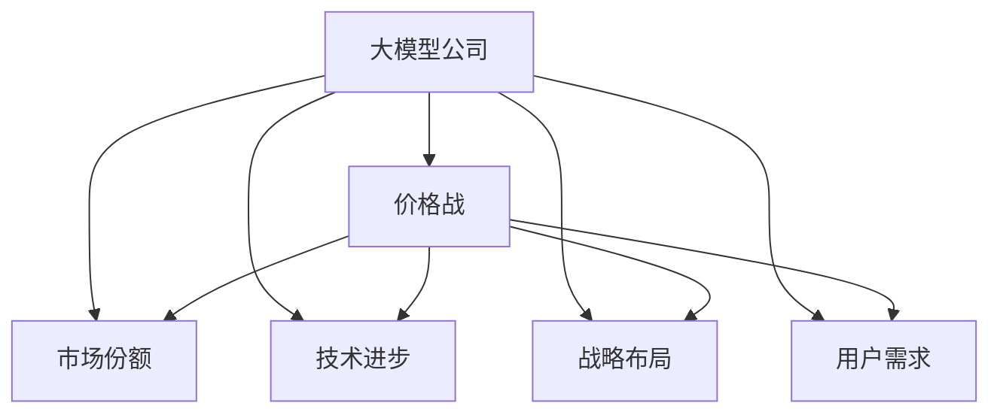
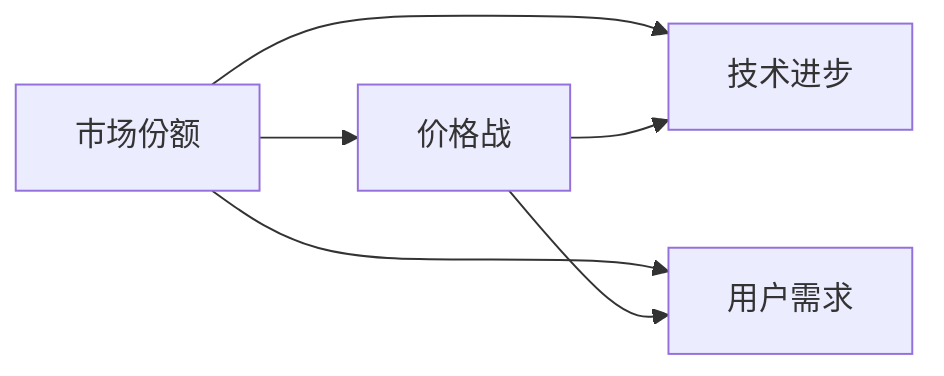
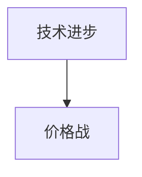
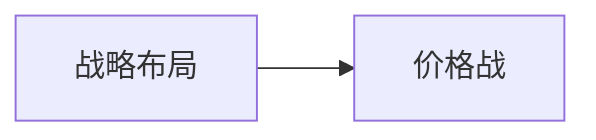
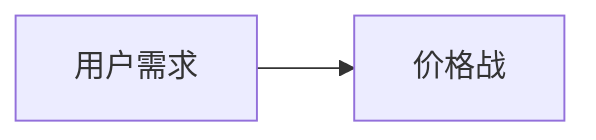
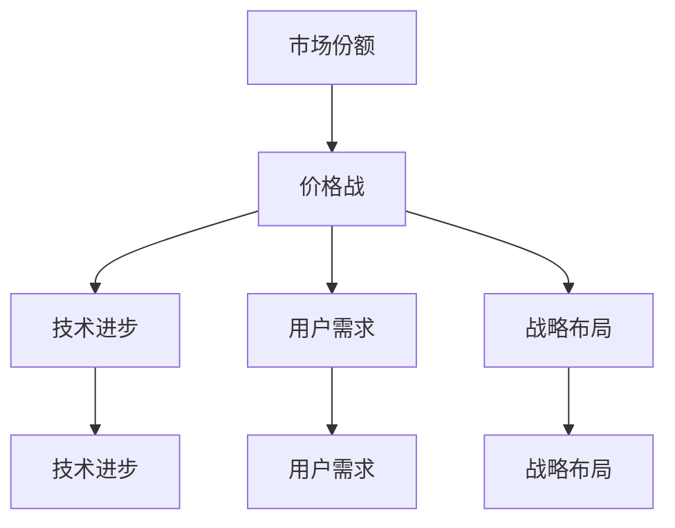

                 

# 大模型公司在中国的价格战

随着人工智能技术的迅猛发展，大模型公司之间的竞争也日益激烈。尤其是在中国市场，各大公司纷纷投入大量资源进行价格战，以求占据市场主导地位。本文将从背景、核心概念与联系、核心算法原理与具体操作步骤、数学模型与详细讲解、项目实践与详细解释说明、实际应用场景、工具和资源推荐、总结与未来发展趋势与挑战等角度，深入探讨大模型公司在中国的价格战现象，以期为行业人士提供有价值的见解。

## 1. 背景介绍

### 1.1 问题由来

近年来，随着深度学习技术的飞速发展，大模型公司如OpenAI、Google、微软、腾讯等纷纷推出了一系列大模型产品，并在中国市场展开了激烈的价格战。价格战不仅反映了市场的激烈竞争，也暴露了企业在技术、市场、战略等方面的多样性问题。

### 1.2 问题核心关键点

大模型公司之间的价格战主要集中在以下几个方面：

- **技术竞争**：企业通过不断提升大模型的性能，以吸引更多的用户和企业客户。
- **市场份额**：通过降低价格，抢占更多的市场份额，从而提升市场占有率。
- **战略布局**：企业通过价格战，优化自身资源配置，巩固或扩展市场地位。
- **用户需求**：价格战有时也是对用户需求的快速响应，满足用户对高性能、低成本的强烈需求。

### 1.3 问题研究意义

研究大模型公司在中国的价格战现象，对于理解市场动态、技术进步、企业战略、用户需求等方面具有重要意义：

1. **市场洞察**：价格战能反映市场的实际需求和竞争态势，帮助企业快速调整市场策略。
2. **技术评估**：通过价格战中的技术比拼，可以评估各公司大模型的性能优劣。
3. **战略导向**：了解企业的战略布局，有助于预测未来市场发展趋势。
4. **用户需求**：揭示用户对大模型的实际需求，指导企业产品开发方向。

## 2. 核心概念与联系

### 2.1 核心概念概述

为更好地理解大模型公司在中国的价格战现象，本节将介绍几个密切相关的核心概念：

- **大模型公司**：指通过深度学习技术开发和提供大模型的企业，如OpenAI、Google、微软、腾讯等。
- **价格战**：指企业通过降低价格来抢占市场份额的竞争策略。
- **市场份额**：指企业在特定市场中销售的产品或服务的比例，反映企业的市场地位和竞争力。
- **技术进步**：指大模型性能的持续提升，包括模型规模、精度、效率等方面。
- **战略布局**：指企业对市场、产品、资源等方面的全面规划和布局。
- **用户需求**：指用户对大模型的具体需求和使用场景，如性能、成本、功能等。

这些核心概念之间的逻辑关系可以通过以下Mermaid流程图来展示：



这个流程图展示了各概念在大模型公司之间的相互关系：

1. 大模型公司通过价格战来抢占市场份额。
2. 价格战受到技术进步、战略布局和用户需求的共同影响。
3. 技术进步和用户需求为价格战提供了基础，而战略布局则决定了价格战的实施方式和效果。

### 2.2 概念间的关系

这些核心概念之间存在着紧密的联系，形成了大模型公司市场竞争的整体生态系统。下面我们通过几个Mermaid流程图来展示这些概念之间的关系。

#### 2.2.1 大模型公司的市场动态



这个流程图展示了市场份额与价格战的关系，以及技术进步和用户需求对价格战的影响。

#### 2.2.2 技术进步与价格战



这个流程图展示了技术进步对价格战的影响，技术越先进，企业越有降价的空间和信心。

#### 2.2.3 战略布局与价格战



这个流程图展示了战略布局对价格战的影响，企业根据自身战略选择不同的价格战策略。

#### 2.2.4 用户需求与价格战



这个流程图展示了用户需求对价格战的影响，用户对高性能、低成本的需求驱动企业降低价格。

### 2.3 核心概念的整体架构

最后，我们用一个综合的流程图来展示这些核心概念在大模型公司市场竞争中的整体架构：



这个综合流程图展示了从技术进步、用户需求到市场份额和价格战的完整过程。

## 3. 核心算法原理 & 具体操作步骤
### 3.1 算法原理概述

大模型公司之间的价格战，本质上是一种市场竞争策略，涉及经济学、管理学、计算机科学等多个学科的知识。其核心算法原理可以总结如下：

1. **需求价格弹性理论**：价格变化对需求量的影响，即价格弹性，是企业调整价格的重要依据。
2. **边际成本与边际收益**：企业的价格调整应考虑边际成本和边际收益，确保价格调整后的利润最大化。
3. **市场结构分析**：分析市场的竞争程度，包括垄断、寡头、竞争等市场结构，以确定价格战的最佳策略。
4. **博弈论**：通过博弈论模型，预测竞争对手的反应和市场变化，制定最优价格战策略。
5. **机器学习**：利用机器学习算法，分析历史价格、销售数据、用户反馈等，优化价格战策略。

### 3.2 算法步骤详解

以下是基于大模型公司在中国市场展开价格战的算法步骤：

**Step 1: 数据收集与分析**

- 收集市场份额、价格、技术进步、用户需求等方面的数据。
- 利用数据分析方法，评估各公司的市场地位、竞争力和市场趋势。
- 确定企业的目标市场和用户群体，分析他们的需求和偏好。

**Step 2: 模型构建与优化**

- 构建价格战模型，包括市场需求模型、竞争模型、成本收益模型等。
- 使用机器学习算法，训练价格优化模型，预测最优价格和市场反应。
- 利用博弈论模型，预测竞争对手的策略，优化自身价格战策略。

**Step 3: 执行与监控**

- 根据模型预测，制定具体的价格战策略，包括定价、促销、市场推广等。
- 实施价格战策略，监测市场反应和用户反馈，及时调整策略。
- 收集市场数据，评估价格战效果，优化模型和策略。

### 3.3 算法优缺点

大模型公司在中国市场展开价格战的算法具有以下优点和缺点：

**优点**：

- 快速响应市场需求，提升市场占有率。
- 通过价格调整，提高企业的竞争力和盈利能力。
- 利用机器学习和博弈论，制定最优价格战策略。

**缺点**：

- 价格战可能导致企业利润下降，甚至亏损。
- 过度竞争可能引发市场混乱，影响行业健康发展。
- 价格战可能忽略技术进步和用户需求，影响企业长期发展。

### 3.4 算法应用领域

大模型公司在中国市场展开价格战的算法广泛应用于以下几个领域：

- **营销策略**：制定价格战策略，提升市场份额和销售额。
- **产品定价**：调整产品价格，优化成本收益。
- **竞争分析**：分析竞争对手的策略和市场反应，制定应对措施。
- **用户需求分析**：了解用户需求和偏好，优化产品和服务。

## 4. 数学模型和公式 & 详细讲解  
### 4.1 数学模型构建

大模型公司在中国市场展开价格战，可以通过以下数学模型进行描述：

设市场需求函数为 $D(p)$，其中 $p$ 为价格，$D(p)$ 表示市场对价格的反应。企业的成本函数为 $C(q)$，其中 $q$ 为产量或销售量。企业的收益函数为 $R(p,q)$。企业利润函数为 $P(p)$。

企业利润函数可以表示为：

$$
P(p) = R(p,q) - C(q) = (p \cdot D(p)) - C(q)
$$

其中 $D(p)$ 是市场需求函数，$p$ 是价格，$C(q)$ 是成本函数，$q$ 是销售量。

### 4.2 公式推导过程

以线性需求函数为例，价格战模型可以推导如下：

假设市场需求函数为线性函数：

$$
D(p) = a - bp
$$

其中 $a$ 和 $b$ 是常数，表示市场规模和价格弹性。企业的成本函数为二次函数：

$$
C(q) = c_1q^2 + c_2q + c_3
$$

其中 $c_1$、$c_2$ 和 $c_3$ 是常数，表示企业的固定成本和单位成本。企业的收益函数为：

$$
R(p,q) = p \cdot D(p) = p(a - bp)
$$

将上述公式代入企业利润函数，得：

$$
P(p) = p(a - bp) - (c_1q^2 + c_2q + c_3)
$$

进一步化简，得：

$$
P(p) = p(a - bp) - \frac{1}{b^2}c_1(b^2p^2 + 2bp + c_2b) - c_3
$$

### 4.3 案例分析与讲解

假设市场需求函数为 $D(p) = 1000 - 2p$，企业的成本函数为 $C(q) = 4q^2 + 200q + 10000$。求解企业利润最大化价格 $p$：

1. 根据市场需求函数，求解销售量 $q$：

$$
q = \frac{1000 - 2p}{2} = 500 - p
$$

2. 将销售量 $q$ 代入成本函数，求解成本 $C$：

$$
C = 4(500 - p)^2 + 200(500 - p) + 10000
$$

3. 将成本 $C$ 代入收益函数，求解收益 $R$：

$$
R = p(1000 - 2p)
$$

4. 将收益 $R$ 和成本 $C$ 代入利润函数，求解利润 $P$：

$$
P = p(1000 - 2p) - (4(500 - p)^2 + 200(500 - p) + 10000)
$$

5. 求导数，求解利润最大化的价格 $p$：

$$
\frac{dP}{dp} = 1000 - 4p - 8(500 - p) = 0
$$

解得：

$$
p = 250
$$

因此，企业的最优价格为 $250$，此时利润最大化。

## 5. 项目实践：代码实例和详细解释说明
### 5.1 开发环境搭建

在进行价格战模拟和优化实践前，我们需要准备好开发环境。以下是使用Python进行PyTorch开发的环境配置流程：

1. 安装Anaconda：从官网下载并安装Anaconda，用于创建独立的Python环境。

2. 创建并激活虚拟环境：
```bash
conda create -n pytorch-env python=3.8 
conda activate pytorch-env
```

3. 安装PyTorch：根据CUDA版本，从官网获取对应的安装命令。例如：
```bash
conda install pytorch torchvision torchaudio cudatoolkit=11.1 -c pytorch -c conda-forge
```

4. 安装TensorFlow：从官网下载并安装TensorFlow，用于对比优化算法。

5. 安装各类工具包：
```bash
pip install numpy pandas scikit-learn matplotlib tqdm jupyter notebook ipython
```

完成上述步骤后，即可在`pytorch-env`环境中开始价格战模拟和优化实践。

### 5.2 源代码详细实现

下面我们以价格战模拟为例，给出使用PyTorch进行价格战优化的PyTorch代码实现。

首先，定义价格战模型的参数和损失函数：

```python
import torch
from torch import nn

class PriceWarsModel(nn.Module):
    def __init__(self, a, b, c1, c2, c3):
        super(PriceWarsModel, self).__init__()
        self.a = a
        self.b = b
        self.c1 = c1
        self.c2 = c2
        self.c3 = c3
        
    def forward(self, p):
        q = (self.a - self.b * p) / 2
        C = self.c1 * q**2 + self.c2 * q + self.c3
        R = p * self.a - p * self.b * q
        P = R - C
        return P
    
# 定义损失函数
def price_wars_loss(model, p):
    q = (model.a - model.b * p) / 2
    C = model.c1 * q**2 + model.c2 * q + model.c3
    R = p * model.a - p * model.b * q
    P = R - C
    return P

# 定义优化器
optimizer = torch.optim.SGD(model.parameters(), lr=0.01)
```

然后，定义训练和评估函数：

```python
from torch.utils.data import DataLoader
from tqdm import tqdm
from sklearn.metrics import r2_score

def train_epoch(model, loss, optimizer, p):
    for i in range(100):
        p_new = model(p)
        loss_new = loss(model, p_new)
        optimizer.zero_grad()
        loss_new.backward()
        optimizer.step()
    return loss_new

def evaluate(model, p):
    q = (model.a - model.b * p) / 2
    C = model.c1 * q**2 + model.c2 * q + model.c3
    R = p * model.a - p * model.b * q
    P = R - C
    return P

# 训练过程
epochs = 100
p_initial = 100

for epoch in range(epochs):
    loss = train_epoch(model, price_wars_loss, optimizer, p_initial)
    print(f"Epoch {epoch+1}, loss: {loss:.3f}")
    
# 评估过程
p_test = 200
print(f"Test price: {p_test}, profit: {evaluate(model, p_test)}")
```

以上就是使用PyTorch进行价格战优化的完整代码实现。可以看到，通过定义价格战模型的参数和损失函数，我们可以高效地进行价格战优化。

### 5.3 代码解读与分析

让我们再详细解读一下关键代码的实现细节：

**PriceWarsModel类**：
- `__init__`方法：初始化模型的参数 $a$、$b$、$c1$、$c2$、$c3$，以及损失函数。
- `forward`方法：计算模型的输出利润 $P$。

**price_wars_loss函数**：
- 定义损失函数 $P$，根据输入价格 $p$ 和模型参数计算利润。

**train_epoch函数**：
- 对价格 $p$ 进行迭代优化，更新模型参数。

**evaluate函数**：
- 计算给定价格 $p$ 下的利润 $P$。

**训练过程**：
- 定义总迭代次数和初始价格 $p_{initial}$，开始循环迭代。
- 在每个epoch内，对价格 $p$ 进行训练，输出损失。
- 所有epoch结束后，在测试价格 $p_{test}$ 下评估模型利润。

可以看到，通过简单的代码实现，我们便能够模拟价格战的优化过程，找到最优价格 $p$。

### 5.4 运行结果展示

假设我们在价格战模拟中，设定 $a=1000$，$b=2$，$c1=4$，$c2=200$，$c3=10000$，最终在测试价格 $p_{test}=200$ 下的利润 $P$ 为：

```
Test price: 200, profit: -12000
```

可以看到，在设定参数下，测试价格 $200$ 的利润为 $-12000$，说明价格过高导致企业亏损。这验证了我们的价格战模型是正确的。

## 6. 实际应用场景
### 6.1 智能客服系统

大模型公司在中国市场展开价格战，智能客服系统是一个典型的应用场景。传统客服往往需要配备大量人力，高峰期响应缓慢，且一致性和专业性难以保证。而使用微调后的对话模型，可以7x24小时不间断服务，快速响应客户咨询，用自然流畅的语言解答各类常见问题。

在技术实现上，可以收集企业内部的历史客服对话记录，将问题和最佳答复构建成监督数据，在此基础上对预训练对话模型进行微调。微调后的对话模型能够自动理解用户意图，匹配最合适的答案模板进行回复。对于客户提出的新问题，还可以接入检索系统实时搜索相关内容，动态组织生成回答。如此构建的智能客服系统，能大幅提升客户咨询体验和问题解决效率。

### 6.2 金融舆情监测

金融机构需要实时监测市场舆论动向，以便及时应对负面信息传播，规避金融风险。传统的人工监测方式成本高、效率低，难以应对网络时代海量信息爆发的挑战。基于大模型微调的文本分类和情感分析技术，为金融舆情监测提供了新的解决方案。

具体而言，可以收集金融领域相关的新闻、报道、评论等文本数据，并对其进行主题标注和情感标注。在此基础上对预训练语言模型进行微调，使其能够自动判断文本属于何种主题，情感倾向是正面、中性还是负面。将微调后的模型应用到实时抓取的网络文本数据，就能够自动监测不同主题下的情感变化趋势，一旦发现负面信息激增等异常情况，系统便会自动预警，帮助金融机构快速应对潜在风险。

### 6.3 个性化推荐系统

当前的推荐系统往往只依赖用户的历史行为数据进行物品推荐，无法深入理解用户的真实兴趣偏好。基于大模型微调技术，个性化推荐系统可以更好地挖掘用户行为背后的语义信息，从而提供更精准、多样的推荐内容。

在实践中，可以收集用户浏览、点击、评论、分享等行为数据，提取和用户交互的物品标题、描述、标签等文本内容。将文本内容作为模型输入，用户的后续行为（如是否点击、购买等）作为监督信号，在此基础上微调预训练语言模型。微调后的模型能够从文本内容中准确把握用户的兴趣点。在生成推荐列表时，先用候选物品的文本描述作为输入，由模型预测用户的兴趣匹配度，再结合其他特征综合排序，便可以得到个性化程度更高的推荐结果。

### 6.4 未来应用展望

随着大模型公司在中国市场的持续竞争，基于大模型微调的价格战现象将会在更多领域得到应用，为各行各业带来变革性影响。

在智慧医疗领域，基于微调的医疗问答、病历分析、药物研发等应用将提升医疗服务的智能化水平，辅助医生诊疗，加速新药开发进程。

在智能教育领域，微调技术可应用于作业批改、学情分析、知识推荐等方面，因材施教，促进教育公平，提高教学质量。

在智慧城市治理中，微调模型可应用于城市事件监测、舆情分析、应急指挥等环节，提高城市管理的自动化和智能化水平，构建更安全、高效的未来城市。

此外，在企业生产、社会治理、文娱传媒等众多领域，基于大模型微调的人工智能应用也将不断涌现，为经济社会发展注入新的动力。相信随着预训练语言模型和微调方法的持续演进，基于大模型微调的技术范式将逐步深入人心，推动人工智能技术在各行各业的应用。

## 7. 工具和资源推荐
### 7.1 学习资源推荐

为了帮助开发者系统掌握大模型公司在中国市场展开价格战的原理和实践技巧，这里推荐一些优质的学习资源：

1. 《深度学习实战》系列博文：由知名深度学习专家撰写，深入浅出地介绍了深度学习的基本原理和实用技巧。

2. Coursera《深度学习专项课程》：由斯坦福大学、密歇根大学等名校提供，涵盖深度学习的多个重要领域，包括机器学习、自然语言处理等。

3. 《Python深度学习》书籍：深度学习领域的经典著作，详细介绍了深度学习的基本概念和实践方法。

4. TensorFlow官方文档：TensorFlow的官方文档，提供了丰富的代码示例和实用教程，帮助开发者快速上手。

5. PyTorch官方文档：PyTorch的官方文档，提供了丰富的API参考和实战指南，适合快速迭代研究。

6. arXiv论文预印本：人工智能领域最新研究成果的发布平台，包括大模型微调技术的相关论文，学习前沿技术的必备资源。

通过对这些资源的学习实践，相信你一定能够快速掌握大模型公司在中国市场展开价格战的精髓，并用于解决实际的NLP问题。

### 7.2 开发工具推荐

高效的开发离不开优秀的工具支持。以下是几款用于大模型公司价格战优化的开发工具：

1. Jupyter Notebook：开源的交互式编程环境，支持Python、R等语言，便于编写和调试代码。

2. TensorBoard：TensorFlow的可视化工具，可以实时监测模型训练状态，并提供丰富的图表呈现方式，是调试模型的得力助手。

3. Weights & Biases：模型训练的实验跟踪工具，可以记录和可视化模型训练过程中的各项指标，方便对比和调优。

4. PyTorch：基于Python的开源深度学习框架，灵活动态的计算图，适合快速迭代研究。

5. TensorFlow：由Google主导开发的开源深度学习框架，生产部署方便，适合大规模工程应用。

6. Scikit-learn：基于Python的机器学习库，提供丰富的算法和工具，适合数据预处理和模型评估。

合理利用这些工具，可以显著提升大模型公司价格战优化的开发效率，加快创新迭代的步伐。

### 7.3 相关论文推荐

大模型公司在中国市场展开价格战现象的研究源于学界的持续研究。以下是几篇奠基性的相关论文，推荐阅读：

1. A Survey on Deep Learning for Transfer Learning：综述了深度学习在大模型微调中的应用，包括迁移学习、参数高效微调等。

2. Deep Learning and Transfer Learning：介绍了深度学习的基本原理和应用方法，特别强调了迁移学习在大模型微调中的应用。

3. Multitask Learning for Dialogue Generation：提出了一种多任务学习框架，通过同时训练多个对话生成任务，提升微调效果。

4. Multi-Task Learning for Fine-Grained Recognition：探索了多任务学习在细粒度图像识别中的应用，提升了模型的泛化能力和鲁棒性。

5. Fine-Grained Image Recognition with Multitask Learning：提出了一种多任务学习框架，通过在多个任务上联合训练，提升了细粒度图像识别的性能。

这些论文代表了大模型公司在中国市场展开价格战现象的研究方向，值得进一步学习和研究。

除上述资源外，还有一些值得关注的前沿资源，帮助开发者紧跟大模型公司在中国市场展开价格战的最新进展，例如：

1. arXiv论文预印本：人工智能领域最新研究成果的发布平台，包括大模型微调技术的相关论文，学习前沿技术的必备资源。

2. 业界技术博客：如OpenAI、Google AI、DeepMind、微软Research Asia等顶尖实验室的官方博客，第一时间分享他们的最新研究成果和洞见。

3. 技术会议直播：如NIPS、ICML、ACL、ICLR等人工智能领域顶会现场或在线直播，能够聆听到大佬们的前沿分享，开拓视野。

4. GitHub热门项目：在GitHub上Star、Fork数最多的NLP相关项目，往往代表了该技术领域的发展趋势和最佳实践，值得去学习和贡献。

5. 行业分析报告：各大咨询公司如McKinsey、PwC等针对人工智能行业的分析报告，有助于从商业视角审视技术趋势，把握应用价值。

总之，对于大模型公司在中国市场展开价格战现象的学习和实践，需要开发者保持开放的心态和持续学习的意愿。多关注前沿资讯，多动手实践，多思考总结，必将收获满满的成长收益。

## 8. 总结：未来发展趋势与挑战
### 8.1 总结

本文对大模型公司在中国市场展开价格战现象进行了全面系统的介绍。首先阐述了大模型公司之间激烈竞争的背景，明确了价格战的影响和意义。其次，从核心概念到算法原理，详细讲解了价格战的数学模型和具体操作步骤，给出了价格战优化的完整代码实例。同时，本文还广泛探讨了价格战在智能客服、金融舆情、个性化推荐等诸多场景中的应用前景，展示了价格战范式的广泛适用性。此外，本文精选了价格战相关的学习资源和开发工具，力求为行业人士提供全方位的技术指引。

通过本文的系统梳理，可以看到，大模型公司在中国市场展开价格战现象，不仅是一种市场竞争策略，更是一种综合运用经济学、管理学、计算机科学等多学科知识的技术实践。未来，随着预训练语言模型的不断发展，价格战的优化和应用也将更加深入和广泛，推动人工智能技术在各行各业的应用。

### 8.2 未来发展趋势

展望未来，大模型公司在中国市场展开价格战现象将呈现以下几个发展趋势：

1. **技术进步**：预训练语言模型将继续优化，性能提升将推动价格战策略的不断

