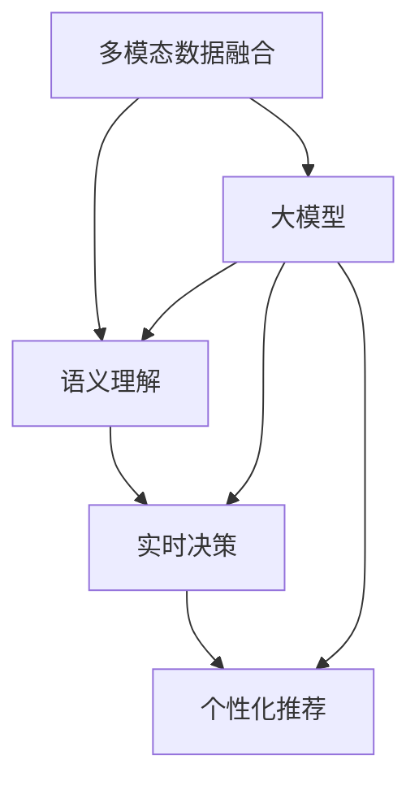
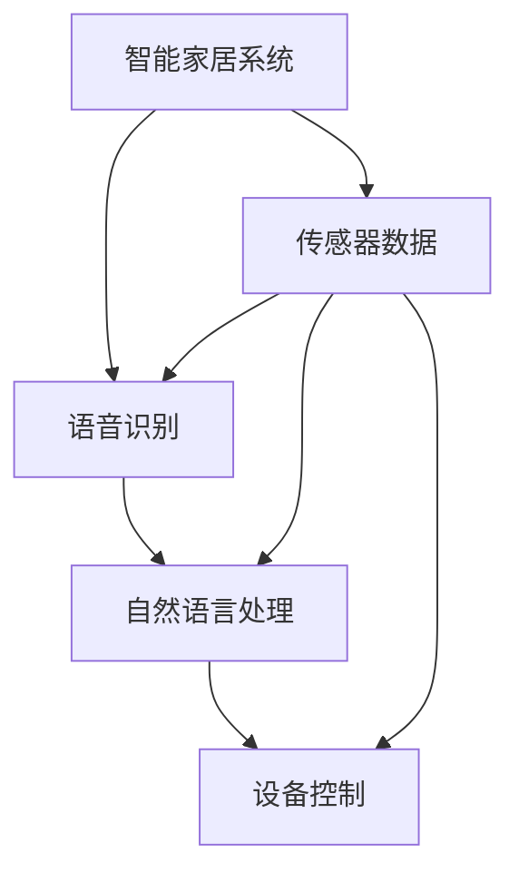
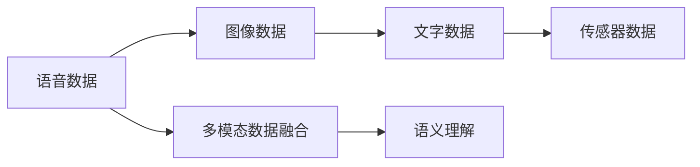
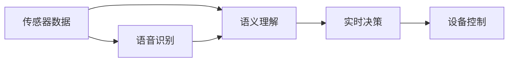
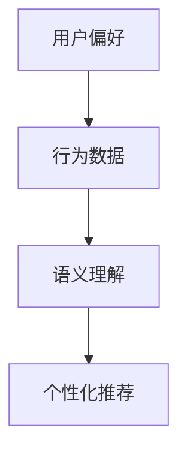
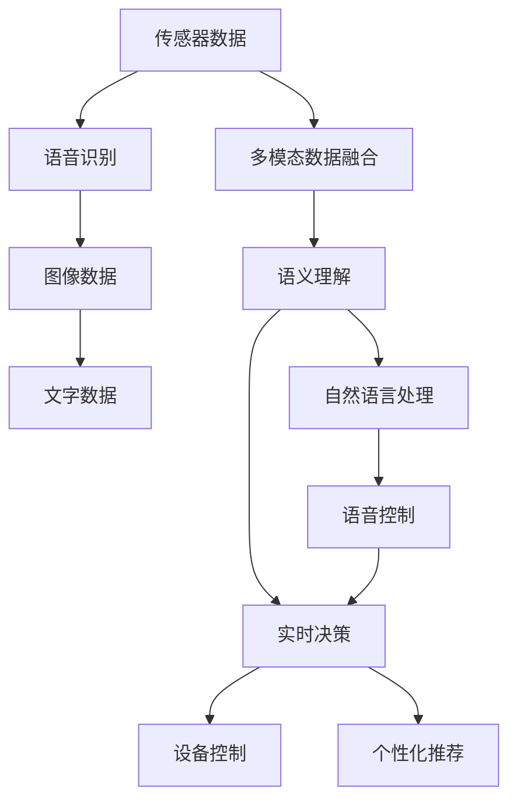

                 

# 大模型在智能家居领域的潜力

## 1. 背景介绍

### 1.1 问题由来

随着人工智能技术的迅速发展，大模型在各行各业的应用越来越广泛，涵盖了从医疗、金融到教育、娱乐等多个领域。近年来，智能家居行业作为智慧城市建设的重要组成部分，也逐步引入了人工智能技术。智能家居通过智能设备、传感器、通信网络等技术，实现对家庭环境的智能化管理和控制，提升用户生活品质。然而，智能家居系统的复杂性和多样性，使得传统的机器学习算法难以有效应对，大模型在智能家居领域的应用潜力日益显现。

### 1.2 问题核心关键点

大模型在智能家居领域的应用核心关键点主要包括以下几个方面：

- 多模态数据的处理：智能家居系统通常涉及语音、图像、文字等多种形式的数据，大模型具备强大的多模态处理能力，能够更好地整合和利用这些数据。
- 家庭环境的理解：大模型能够通过分析大量的家庭数据，理解家庭成员的行为习惯和偏好，从而提供更加个性化、智能化的服务。
- 实时反馈与控制：大模型可以实时处理和分析传感器数据，快速响应家庭环境的变化，实现智能控制和反馈。
- 自然语言交互：通过大模型实现自然语言处理，使家庭设备能够理解用户的语音命令和文本信息，提供更流畅的交互体验。

### 1.3 问题研究意义

大模型在智能家居领域的应用，具有以下重要意义：

1. 提升用户生活体验：通过智能化的管理和控制，大模型能够显著提升用户的生活便利性和舒适度，使家庭环境更加智能和健康。
2. 降低能耗和成本：大模型能够优化能源管理，智能调整家庭设备的运行状态，减少不必要的能源浪费，降低用户的能耗和运营成本。
3. 提高安全性：大模型可以通过分析家庭数据，识别异常行为和潜在风险，及时采取预警和防御措施，提高家庭安全性。
4. 推动技术创新：大模型在智能家居领域的应用，为人工智能技术的发展提供了新的应用场景，推动相关技术的创新和突破。
5. 促进产业发展：智能家居系统的大规模部署和使用，将进一步促进智能家居设备的生产和销售，带动相关产业链的发展。

## 2. 核心概念与联系

### 2.1 核心概念概述

为了更好地理解大模型在智能家居领域的应用，本节将介绍几个密切相关的核心概念：

- 大模型：指基于深度学习技术，通过大规模数据训练得到的复杂模型，具备强大的特征提取和推理能力。
- 多模态数据融合：指将不同形式的数据（如语音、图像、文字等）进行整合，提取并融合其中的有效信息，提升系统的智能水平。
- 语义理解：指模型能够理解文本或语音信息背后的语义，如意图、情感、实体等，从而更好地与用户进行交互。
- 实时决策：指模型能够实时处理传感器数据，快速做出决策并控制家庭设备，实现智能响应。
- 个性化推荐：指模型能够根据家庭成员的偏好和行为习惯，提供个性化的服务和建议，如定制化内容推荐、设备配置建议等。

这些概念之间的关系可以通过以下Mermaid流程图来展示：



这个流程图展示了大模型在智能家居系统中的应用过程，从多模态数据的融合到个性化推荐的生成，大模型在其中扮演了关键角色。

### 2.2 概念间的关系

这些核心概念之间存在着紧密的联系，形成了智能家居系统的整体生态系统。下面我们通过几个Mermaid流程图来展示这些概念之间的关系。

#### 2.2.1 智能家居系统的整体架构



这个流程图展示了智能家居系统的整体架构，包括语音识别、自然语言处理和设备控制等关键环节，其中多模态数据融合和语义理解是大模型发挥作用的核心环节。

#### 2.2.2 多模态数据融合的实现



这个流程图展示了多模态数据融合的实现过程，大模型通过整合不同形式的数据，提取其中的有效信息，实现语义理解。

#### 2.2.3 实时决策的流程



这个流程图展示了实时决策的流程，大模型通过分析传感器数据和语义信息，实时做出决策并控制设备。

#### 2.2.4 个性化推荐的机制



这个流程图展示了个性化推荐的机制，大模型通过分析用户偏好和行为数据，提供个性化的服务和建议。

### 2.3 核心概念的整体架构

最后，我们用一个综合的流程图来展示这些核心概念在大模型在智能家居系统中的应用架构：



这个综合流程图展示了从传感器数据到个性化推荐的整个过程，大模型在其中发挥了关键作用。

## 3. 核心算法原理 & 具体操作步骤
### 3.1 算法原理概述

大模型在智能家居领域的应用主要基于监督学习和强化学习算法。监督学习通过分析标注数据，学习家庭成员的行为模式和偏好，从而提供个性化的服务和建议。强化学习通过模拟环境与用户交互，优化设备的控制策略，提高系统的智能水平。

### 3.2 算法步骤详解

大模型在智能家居领域的应用通常包括以下几个关键步骤：

1. **数据收集与预处理**：收集智能家居设备的数据，并进行预处理和标注，如清洗数据、特征提取等。
2. **模型训练**：使用监督学习和/或强化学习算法，训练大模型，使其能够理解语义、识别行为、做出决策等。
3. **模型部署与测试**：将训练好的模型部署到智能家居设备中，进行实际测试和优化，确保系统的稳定性和可靠性。
4. **持续学习与优化**：根据实时反馈数据，持续优化模型参数和控制策略，提高系统的智能水平和适应性。

### 3.3 算法优缺点

大模型在智能家居领域的应用具有以下优点：

- 强大的多模态处理能力：大模型能够整合多种形式的数据，提取其中的有效信息，提升系统的智能水平。
- 个性化的服务与控制：通过学习家庭成员的行为模式和偏好，提供个性化的服务和建议，实现智能控制。
- 实时决策与反馈：能够实时处理传感器数据，快速做出决策并控制设备，实现智能响应。

同时，大模型在智能家居领域的应用也存在一些局限性：

- 数据隐私和安全问题：智能家居设备通常涉及大量敏感数据，大模型需要具备良好的隐私保护和安全防护能力。
- 模型复杂度和资源消耗：大模型通常具有较大的参数规模，需要较高的计算资源和存储空间。
- 模型的可解释性和透明性：大模型的决策过程通常较为复杂，难以解释和透明化。

### 3.4 算法应用领域

大模型在智能家居领域的应用涵盖多个方面，主要包括：

- 语音识别与自然语言处理：通过大模型实现语音识别和自然语言处理，使家庭设备能够理解用户的语音命令和文本信息。
- 传感器数据融合与分析：通过大模型整合传感器数据，进行分析和推理，实现智能控制和反馈。
- 设备控制与推荐：通过大模型学习家庭成员的行为模式和偏好，提供个性化的服务和建议，实现设备的智能控制。
- 异常检测与预警：通过大模型分析家庭数据，识别异常行为和潜在风险，及时采取预警和防御措施。

以上应用场景展示了大模型在智能家居领域的广泛适用性，能够提升用户的生活品质和安全性，推动智能家居技术的发展。

## 4. 数学模型和公式 & 详细讲解 & 举例说明

### 4.1 数学模型构建

在大模型在智能家居领域的应用中，通常使用监督学习模型，如神经网络、卷积神经网络（CNN）、递归神经网络（RNN）等，进行任务处理。以神经网络模型为例，其数学模型可以表示为：

$$ y = f(x; \theta) $$

其中，$x$ 为输入向量，$\theta$ 为模型参数，$f(\cdot)$ 为模型函数。在智能家居领域，输入向量通常为传感器数据、语音数据、文字数据等，输出向量为设备控制指令、服务推荐等。

### 4.2 公式推导过程

以语音识别为例，假设输入语音数据为 $x$，语音识别的输出为 $y$。神经网络的输入层接收到语音数据后，通过隐藏层进行处理，最终输出识别结果。其数学模型可以表示为：

$$ y = \sigma(W_2 \cdot \sigma(W_1 \cdot x + b_1) + b_2) $$

其中，$W_1$、$W_2$ 为模型参数，$b_1$、$b_2$ 为偏置项，$\sigma$ 为激活函数，通常使用ReLU函数。通过反向传播算法，计算梯度并更新模型参数，使模型在标注数据上最小化损失函数，从而提高识别准确率。

### 4.3 案例分析与讲解

以家庭能源管理为例，假设输入为传感器数据 $x$，输出为设备控制指令 $y$。使用神经网络模型进行建模，其数学模型可以表示为：

$$ y = \sigma(W_2 \cdot \sigma(W_1 \cdot x + b_1) + b_2) $$

其中，$W_1$、$W_2$ 为模型参数，$b_1$、$b_2$ 为偏置项，$\sigma$ 为激活函数，通常使用ReLU函数。通过反向传播算法，计算梯度并更新模型参数，使模型在标注数据上最小化损失函数，从而提高设备控制指令的准确性。

## 5. 项目实践：代码实例和详细解释说明

### 5.1 开发环境搭建

在进行智能家居系统开发前，我们需要准备好开发环境。以下是使用Python进行TensorFlow开发的环境配置流程：

1. 安装Anaconda：从官网下载并安装Anaconda，用于创建独立的Python环境。

2. 创建并激活虚拟环境：
```bash
conda create -n tf-env python=3.8 
conda activate tf-env
```

3. 安装TensorFlow：根据CUDA版本，从官网获取对应的安装命令。例如：
```bash
conda install tensorflow-cpu tensorflow-cpu -c conda-forge
```

4. 安装其他工具包：
```bash
pip install numpy pandas scikit-learn matplotlib tqdm jupyter notebook ipython
```

完成上述步骤后，即可在`tf-env`环境中开始智能家居系统开发。

### 5.2 源代码详细实现

这里我们以家庭能源管理为例，给出使用TensorFlow对智能家居设备进行建模的代码实现。

首先，定义模型结构：

```python
import tensorflow as tf
from tensorflow.keras import layers, models

# 定义神经网络模型
model = models.Sequential([
    layers.Dense(64, activation='relu', input_shape=(4,)), # 传感器数据的输入
    layers.Dense(8, activation='relu'), # 隐藏层
    layers.Dense(1, activation='sigmoid') # 设备控制指令输出
])
```

然后，编译模型并训练：

```python
# 定义损失函数和优化器
model.compile(loss='binary_crossentropy', optimizer='adam', metrics=['accuracy'])

# 训练模型
model.fit(X_train, y_train, epochs=10, batch_size=32, validation_data=(X_val, y_val))
```

最后，使用训练好的模型进行预测：

```python
# 使用模型进行预测
y_pred = model.predict(X_test)
```

### 5.3 代码解读与分析

让我们再详细解读一下关键代码的实现细节：

**模型结构**：
- 使用Sequential模型定义神经网络结构，包含输入层、隐藏层和输出层。
- 输入层为传感器数据，共有4个特征，使用Dense层进行全连接处理。
- 隐藏层使用64个神经元，激活函数为ReLU。
- 输出层使用1个神经元，激活函数为Sigmoid，表示设备控制指令的预测结果。

**模型编译**：
- 使用binary_crossentropy作为损失函数，适合二分类问题。
- 使用adam优化器，学习率为0.001。
- 监控准确率作为模型性能的评价指标。

**模型训练**：
- 使用训练数据进行模型训练，迭代次数为10次，每个批次大小为32。
- 使用验证数据对模型进行评估，防止过拟合。

**模型预测**：
- 使用训练好的模型对测试数据进行预测，输出设备控制指令。

通过上述代码，实现了使用TensorFlow进行智能家居设备控制指令预测的过程。可以看到，大模型在智能家居系统中的应用，可以通过简单的代码实现，具有良好的可扩展性和灵活性。

## 6. 实际应用场景

### 6.1 智能家庭环境监测

智能家居系统可以通过大模型对家庭环境进行实时监测，如温度、湿度、光照、空气质量等。通过整合家庭设备传感器数据，大模型可以实时分析家庭环境状态，并做出相应调整。例如，当温度过高时，大模型可以自动开启空调并调整温度，保证家庭环境的舒适性。

### 6.2 能源管理与优化

家庭能源管理是智能家居系统的重要应用场景之一。通过大模型对家庭能源数据进行分析和预测，可以实现能源的智能管理和优化。例如，当家庭成员离开家时，大模型可以自动关闭不必要的设备，优化能源使用，减少能源浪费。同时，大模型可以根据家庭成员的行为习惯，自动调整能源消耗，提升能效。

### 6.3 智能安全与防护

家庭安全是智能家居系统的重要保障之一。通过大模型对家庭数据进行分析，可以识别异常行为和潜在风险，及时采取预警和防护措施。例如，当检测到入侵行为时，大模型可以自动报警并通知家庭成员，提高家庭安全性。

### 6.4 未来应用展望

随着大模型技术的发展，其在智能家居领域的应用前景将更加广阔。未来，大模型将能够更好地整合多种形式的数据，提供更加智能、个性化和高效的家庭服务。

## 7. 工具和资源推荐

### 7.1 学习资源推荐

为了帮助开发者系统掌握大模型在智能家居领域的应用，这里推荐一些优质的学习资源：

1. TensorFlow官方文档：TensorFlow官方文档提供了丰富的教程和示例，帮助开发者深入理解大模型在智能家居中的应用。

2. Coursera《深度学习与人工智能》课程：由斯坦福大学等知名学府开设的深度学习课程，涵盖深度学习基础和前沿技术。

3. 《深度学习实战》书籍：该书详细介绍了深度学习在各种应用场景中的实现方法和技巧，包括智能家居系统的开发。

4. GitHub热门项目：在GitHub上Star、Fork数最多的智能家居系统项目，展示了当前最先进的智能家居技术。

5. 行业分析报告：各大咨询公司如McKinsey、PwC等针对智能家居行业的分析报告，提供了行业发展趋势和最佳实践。

通过这些资源的学习实践，相信你一定能够快速掌握大模型在智能家居领域的应用，并用于解决实际的智能家居问题。

### 7.2 开发工具推荐

高效的开发离不开优秀的工具支持。以下是几款用于智能家居系统开发常用的工具：

1. TensorFlow：由Google主导开发的深度学习框架，适合进行大规模模型训练和推理。

2. PyTorch：基于Python的开源深度学习框架，灵活性高，适合快速迭代开发。

3. TensorBoard：TensorFlow配套的可视化工具，实时监测模型训练状态，并提供丰富的图表呈现方式。

4. Weights & Biases：模型训练的实验跟踪工具，可以记录和可视化模型训练过程中的各项指标，方便对比和调优。

5. Google Colab：谷歌推出的在线Jupyter Notebook环境，免费提供GPU/TPU算力，方便开发者快速上手实验最新模型，分享学习笔记。

合理利用这些工具，可以显著提升智能家居系统开发效率，加快创新迭代的步伐。

### 7.3 相关论文推荐

大模型在智能家居领域的应用源于学界的持续研究。以下是几篇奠基性的相关论文，推荐阅读：

1. Deep Neural Networks for Energy Generation Optimization: A Review（《深度学习在能源优化中的应用综述》）：详细介绍了深度学习在能源管理中的应用，包括智能家居系统的能源优化。

2. Smart Home Automation Using Deep Learning: A Survey（《基于深度学习的智能家居自动化综述》）：对深度学习在智能家居自动化中的应用进行了全面综述。

3. Speech Recognition in Smart Homes: A Survey（《智能家居中的语音识别综述》）：介绍了深度学习在智能家居语音识别中的应用，涵盖语音助手、语音控制等方面。

4. Energy Efficiency Improvement via Machine Learning in Smart Homes: A Survey（《基于机器学习的智能家居能效提升综述》）：对机器学习在智能家居能效提升中的应用进行了全面综述。

这些论文代表了大模型在智能家居领域的应用发展脉络，通过学习这些前沿成果，可以帮助研究者把握学科前进方向，激发更多的创新灵感。

除上述资源外，还有一些值得关注的前沿资源，帮助开发者紧跟大模型在智能家居领域的应用最新进展，例如：

1. arXiv论文预印本：人工智能领域最新研究成果的发布平台，包括大量尚未发表的前沿工作，学习前沿技术的必读资源。

2. 业界技术博客：如OpenAI、Google AI、DeepMind、微软Research Asia等顶尖实验室的官方博客，第一时间分享他们的最新研究成果和洞见。

3. 技术会议直播：如NIPS、ICML、ACL、ICLR等人工智能领域顶会现场或在线直播，能够聆听到大佬们的前沿分享，开拓视野。

4. GitHub热门项目：在GitHub上Star、Fork数最多的智能家居系统项目，展示了当前最先进的智能家居技术。

5. 行业分析报告：各大咨询公司如McKinsey、PwC等针对智能家居行业的分析报告，提供了行业发展趋势和最佳实践。

总之，对于大模型在智能家居领域的应用学习，需要开发者保持开放的心态和持续学习的意愿。多关注前沿资讯，多动手实践，多思考总结，必将收获满满的成长收益。

## 8. 总结：未来发展趋势与挑战

### 8.1 总结

本文对大模型在智能家居领域的应用进行了全面系统的介绍。首先阐述了大模型和智能家居系统的发展背景和研究意义，明确了大模型在智能家居系统中的应用价值。其次，从原理到实践，详细讲解了大模型在智能家居系统中的应用过程，给出了智能家居系统开发的完整代码实例。同时，本文还广泛探讨了大模型在智能家居系统中的多种应用场景，展示了其广泛的应用前景。

通过本文的系统梳理，可以看到，大模型在智能家居领域的应用前景广阔，能够提升用户的生活品质和安全性，推动智能家居技术的发展。

### 8.2 未来发展趋势

展望未来，大模型在智能家居领域的应用将呈现以下几个发展趋势：

1. 多模态数据融合的提升：随着传感器技术的进步，智能家居系统将能够整合更多形式的数据，如语音、图像、视频等，大模型需要具备更强大的多模态数据融合能力。

2. 个性化服务的精细化：大模型将能够更准确地理解家庭成员的行为模式和偏好，提供更精细、个性化的服务和建议，提升用户的生活体验。

3. 实时决策的智能化：大模型将能够更快速、更准确地处理和分析传感器数据，实现更智能的实时决策和控制，提升系统的响应速度和稳定性。

4. 智能家居系统的互联互通：大模型将能够更好地整合不同品牌、不同类型的智能家居设备，实现设备的互联互通，提升系统的智能水平和用户体验。

5. 安全性和隐私保护：随着智能家居系统的普及，数据隐私和安全问题将更加重要，大模型需要具备更好的隐私保护和安全性。

以上趋势凸显了大模型在智能家居领域的应用潜力，将进一步提升智能家居系统的智能水平和用户体验，推动智能家居技术的进一步发展。

### 8.3 面临的挑战

尽管大模型在智能家居领域的应用前景广阔，但在实现过程中仍面临诸多挑战：

1. 数据隐私和安全问题：智能家居系统涉及大量敏感数据，大模型需要具备良好的隐私保护和安全防护能力，防止数据泄露和滥用。

2. 模型复杂度和资源消耗：大模型通常具有较大的参数规模，需要较高的计算资源和存储空间，如何优化模型结构和资源使用，降低资源消耗，是未来研究的重要方向。

3. 模型的可解释性和透明性：大模型的决策过程通常较为复杂，难以解释和透明化，如何提升模型的可解释性，使其更加透明，是亟待解决的问题。

4. 系统的集成和兼容性：智能家居系统涉及多种设备和协议，大模型需要具备良好的兼容性和集成能力，实现设备之间的互联互通。

5. 系统的鲁棒性和可靠性：智能家居系统需要具备较高的鲁棒性和可靠性，大模型需要具备更好的适应性和稳定性，确保系统的稳定运行。

这些挑战需要在技术、应用和标准等多方面进行全面优化，才能实现大模型在智能家居领域的规模化应用。

### 8.4 研究展望

面对大模型在智能家居领域的应用挑战，未来的研究需要在以下几个方面寻求新的突破：

1. 开发更加高效、轻量级的模型架构，如使用Transformer、BERT等模型，减小参数规模，降低资源消耗。

2. 引入先进的隐私保护技术，如差分隐私、联邦学习等，确保数据隐私和安全。

3. 研究和应用更加先进的自然语言处理技术，提升模型的可解释性和透明性。

4. 优化智能家居系统的集成和兼容性，实现设备的互联互通，提升用户体验。

5. 开发更加鲁棒和可靠的系统，确保智能家居系统的稳定性和可靠性。

这些研究方向的探索，将推动大模型在智能家居领域的进一步应用，为智能家居技术的创新和突破提供新的动力。

## 9. 附录：常见问题与解答

**Q1：智能家居系统需要哪些传感器？**

A: 智能家居系统通常需要以下传感器：

- 温度传感器：用于监测室内温度，实现温度控制。
- 湿度传感器：用于监测室内湿度，实现湿度控制。
- 光照传感器：用于监测室内光照，实现光照控制。
- 空气质量传感器：用于监测室内空气质量，实现空气质量控制。
- 门窗传感器：用于监测门窗状态，实现安全防护。

这些传感器能够收集家庭环境的多种数据，大模型通过分析这些数据，实现对家庭环境的智能监测和控制。

**Q2：智能家居系统如何保护用户隐私？**

A: 智能家居系统在保护用户隐私方面，通常采用以下措施：

- 数据加密：对用户数据进行加密存储和传输，防止数据泄露。
- 数据匿名化：对用户数据进行匿名化处理，隐藏用户隐私信息。
- 访问控制：对系统的访问进行严格控制，防止未经授权的访问和操作。
- 隐私政策：制定明确的用户隐私政策，告知用户数据的使用和保护措施。

通过这些措施，可以有效保护用户的隐私，确保智能家居系统的安全和可信。

**Q3：智能家居系统如何优化能源消耗？**

A: 智能家居系统可以通过以下方式优化能源消耗：

- 智能调度和控制：通过大模型对家庭设备进行智能调度和控制，合理分配能源使用，减少不必要的能源浪费。
- 节能设备选择：选择能效高、运行稳定的智能设备，降低能源消耗。
- 能源监测和分析：通过大模型对家庭能源数据进行监测和分析，实时调整能源使用，优化能源管理。

通过这些措施，可以有效降低智能家居系统的能源消耗，提高能源利用效率。

**Q4：智能家居系统如何提高安全性？**

A: 智能家居系统可以通过以下方式提高安全性：

- 异常检测和预警：通过大模型对家庭数据进行异常检测，及时发现和预警异常行为，防止安全威胁。
- 访问控制和安全防护：对系统访问进行严格控制，防止未经授权的访问和操作，增强系统的安全性。
- 紧急响应和报警：在检测到安全威胁时，及时采取紧急响应措施，并通过报警通知用户，防止安全事件的发生。

通过这些措施，可以有效提高智能家居系统的安全性，保障用户的家庭安全。

**Q5：智能家居系统如何实现多设备互联互通？**

A: 智能家居系统实现多设备互联互通，通常采用以下方式：

- 标准化通信协议：采用统一的通信协议，如Zigbee、Z-Wave、Wi-Fi等，实现设备之间的互操作性。
- 设备集成和互联：通过大模型对家庭设备进行集成和互联，实现设备之间的数据共享和协同控制。
- 云平台支持：通过云平台进行设备管理和数据存储，实现设备之间的远程控制和协同工作。

通过这些方式，可以有效实现智能家居设备的互联互通，提升系统的智能水平和用户体验。

通过以上问题的详细解答，希望能帮助你更好地理解大模型在智能家居领域的应用和发展前景。

