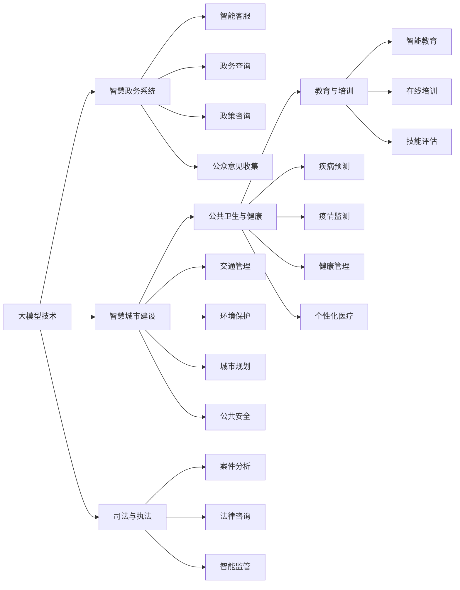

                 

# 大模型技术在政府和公共服务领域的应用

## 1. 背景介绍

近年来，随着人工智能技术的飞速发展，大数据、深度学习等先进技术在政府和公共服务领域得到了广泛应用，为提升政府治理效率和公共服务水平提供了强大的技术支撑。特别是大模型技术的发展，为政府部门和公共服务机构提供了更为精准、高效、智能的解决方案，推动了智慧政务和智慧城市的建设。本文将重点探讨大模型技术在政府和公共服务领域的具体应用，以及未来发展的趋势和挑战。

### 1.1 问题由来
大模型技术，尤其是基于深度学习的大模型，在处理大规模数据、识别复杂模式和关系、进行自然语言理解等方面表现出卓越的性能。政府和公共服务领域面临着海量数据处理、复杂任务求解、跨部门协同等挑战，非常适合应用大模型技术来解决这些问题。通过应用大模型，可以显著提升政府决策的科学性和公共服务的智能化水平，推动政府治理体系的现代化转型。

### 1.2 问题核心关键点
大模型技术在政府和公共服务领域的应用，主要包括以下几个方面：

- **智慧政务系统**：通过大模型技术，可以实现智能客服、政务查询、政策咨询、公众意见收集等政务服务的智能化。
- **智慧城市建设**：大模型技术可以应用于交通管理、环境保护、城市规划、公共安全等领域，提升城市管理的智能化水平。
- **公共卫生与健康**：大模型技术可以用于疾病预测、疫情监测、健康管理、个性化医疗等，提高公共卫生的决策能力和服务水平。
- **教育与培训**：大模型技术可以用于智能教育、在线培训、技能评估等，提升教育质量和培训效果。
- **司法与执法**：大模型技术可以用于案件分析、法律咨询、智能监管等，提升司法和执法效率。

这些应用不仅涵盖了政府和公共服务的各个领域，还体现了大模型技术的广泛应用价值。

### 1.3 问题研究意义
大模型技术在政府和公共服务领域的应用，对于推动政府治理现代化、提升公共服务智能化水平、构建智慧城市等方面具有重要意义：

- **提高政府决策效率**：通过大模型技术，政府部门可以更快速、更准确地分析海量数据，制定科学决策。
- **增强公共服务能力**：大模型技术可以提升公共服务的覆盖面、质量和及时性，改善民众的获得感和满意度。
- **促进智慧城市建设**：大模型技术为智慧城市的建设提供了强大的技术支持，推动城市管理的智能化水平。
- **推动社会创新与治理**：大模型技术的应用，可以激发社会创新活力，提升社会治理的智能化水平。
- **赋能公共安全**：大模型技术在公共安全领域的应用，可以提高应急响应、风险防范、智能监管等方面的能力。

## 2. 核心概念与联系

### 2.1 核心概念概述

大模型技术在政府和公共服务领域的应用，涉及多个核心概念。以下是对这些核心概念的简要介绍：

- **大模型技术**：指基于深度学习的大规模预训练模型，如BERT、GPT等。这些模型通过在大规模无标签数据上进行预训练，学习到了丰富的语言和知识表示。
- **智慧政务系统**：指利用大模型技术，实现政府服务的智能化、自动化和个性化。主要应用包括智能客服、政务查询、政策咨询、公众意见收集等。
- **智慧城市建设**：指利用大模型技术，提升城市管理的智能化水平，实现城市规划、交通管理、环境保护、公共安全等方面的智能化。
- **公共卫生与健康**：指利用大模型技术，进行疾病预测、疫情监测、健康管理、个性化医疗等，提高公共卫生的决策能力和服务水平。
- **教育与培训**：指利用大模型技术，提升教育质量和培训效果，实现智能教育、在线培训、技能评估等。
- **司法与执法**：指利用大模型技术，提升司法和执法效率，进行案件分析、法律咨询、智能监管等。

这些概念之间存在紧密的联系，形成了一个完整的智慧治理和公共服务生态系统。

### 2.2 概念间的关系

这些核心概念之间的关系可以用以下Mermaid流程图来表示：



这个流程图展示了各个核心概念之间的相互联系和作用。大模型技术通过在智慧政务、智慧城市、公共卫生、教育与培训、司法与执法等多个领域的应用，显著提升了政府和公共服务系统的智能化水平。

## 3. 核心算法原理 & 具体操作步骤
### 3.1 算法原理概述

大模型技术在政府和公共服务领域的应用，主要基于深度学习和自然语言处理(NLP)技术。其核心算法原理如下：

- **预训练**：在大规模无标签数据上，通过自监督学习任务（如语言建模、掩码语言模型等）训练预训练大模型，学习到通用的语言和知识表示。
- **微调**：在预训练大模型的基础上，通过下游任务的有监督数据，进一步优化模型的参数，使得模型能够适应特定任务，提升任务性能。
- **推理**：使用微调后的模型进行推理，对输入数据进行智能分析和决策，生成输出结果。

### 3.2 算法步骤详解

以下是大模型技术在政府和公共服务领域应用的详细算法步骤：

1. **数据准备**：收集、清洗、标注与任务相关的数据集。
2. **预训练模型选择**：选择合适的预训练模型（如BERT、GPT等）作为初始化参数。
3. **任务适配**：根据具体任务，设计任务适配层（如分类器、解码器等）和损失函数。
4. **微调超参数设置**：选择合适的优化器（如AdamW）及其参数，如学习率、批大小、迭代轮数等。
5. **模型微调**：将训练集数据分批次输入模型，前向传播计算损失函数。反向传播计算参数梯度，根据设定的优化算法和学习率更新模型参数。
6. **模型评估**：在验证集和测试集上评估模型性能，根据性能指标决定是否触发 Early Stopping。
7. **模型部署**：使用微调后的模型对新数据进行推理预测，集成到实际的应用系统中。

### 3.3 算法优缺点

大模型技术在政府和公共服务领域的应用，具有以下优点和缺点：

**优点**：
- **智能化水平高**：大模型能够学习到丰富的语言和知识表示，适用于各种复杂的政务和公共服务任务。
- **泛化能力强**：在大规模无标签数据上进行预训练，模型能够泛化到不同的数据集和任务。
- **处理速度快**：大模型通常具有较高的推理速度，能够实时响应服务请求。

**缺点**：
- **数据依赖**：微调效果依赖于标注数据的质量和数量，获取高质量标注数据成本较高。
- **模型复杂**：预训练模型参数量庞大，需要较大的计算资源进行训练和推理。
- **解释性不足**：大模型往往是黑盒系统，难以解释其决策过程，增加了治理风险。

### 3.4 算法应用领域

大模型技术在政府和公共服务领域的应用非常广泛，以下是主要的应用领域：

- **智能客服**：通过微调BERT、GPT等大模型，实现智能问答、情绪识别、意图分析等功能，提升客服系统智能化水平。
- **政务查询**：利用预训练大模型，构建知识图谱，实现自动化的政务信息检索和推荐。
- **政策咨询**：通过微调大模型，实现政策文本的自动摘要和分类，提供政策咨询服务。
- **公众意见收集**：利用自然语言处理技术，分析公众意见，进行舆情监测和公众情绪分析。
- **智慧城市管理**：通过大模型技术，实现交通管理、环境保护、公共安全等城市管理任务的智能化。
- **公共卫生与健康**：利用大模型进行疾病预测、疫情监测、健康管理、个性化医疗等。
- **教育与培训**：通过微调大模型，实现智能教育、在线培训、技能评估等，提升教育质量和培训效果。
- **司法与执法**：利用大模型进行案件分析、法律咨询、智能监管等，提升司法和执法效率。

## 4. 数学模型和公式 & 详细讲解 & 举例说明

### 4.1 数学模型构建

在政府和公共服务领域的应用中，大模型技术通常基于深度学习框架（如TensorFlow、PyTorch等）进行构建。以下是一个简单的数学模型构建过程：

假设任务为文本分类，输入为文本序列$x$，输出为类别$y$，预训练模型为$M_{\theta}$，微调任务适配层为$A_{\phi}$，则模型的数学模型为：

$$
M_{\theta}(x) = A_{\phi}(x; \theta, \phi)
$$

其中，$\theta$为预训练模型的参数，$\phi$为任务适配层的参数。模型的目标是最小化损失函数$\mathcal{L}$，即：

$$
\min_{\theta, \phi} \mathcal{L}(\mathcal{D}, M_{\theta}(x))
$$

其中$\mathcal{D}$为训练集数据，$M_{\theta}(x)$为模型的预测输出。

### 4.2 公式推导过程

以二分类任务为例，模型的损失函数为交叉熵损失函数，推导过程如下：

假设模型的预测输出为$\hat{y}=M_{\theta}(x)$，真实标签为$y \in \{0,1\}$，则交叉熵损失函数为：

$$
\ell(M_{\theta}(x),y) = -[y\log \hat{y} + (1-y)\log (1-\hat{y})]
$$

将其代入经验风险公式，得：

$$
\mathcal{L}(\theta, \phi) = -\frac{1}{N}\sum_{i=1}^N [y_i\log M_{\theta}(x_i)+(1-y_i)\log(1-M_{\theta}(x_i))]
$$

根据链式法则，损失函数对参数$\theta$和$\phi$的梯度为：

$$
\frac{\partial \mathcal{L}(\theta, \phi)}{\partial \theta} = -\frac{1}{N}\sum_{i=1}^N \frac{\partial M_{\theta}(x_i)}{\partial \theta}
$$

$$
\frac{\partial \mathcal{L}(\theta, \phi)}{\partial \phi} = -\frac{1}{N}\sum_{i=1}^N \frac{\partial A_{\phi}(x_i)}{\partial \phi}
$$

在得到损失函数的梯度后，即可带入优化算法，进行模型参数的迭代更新。

### 4.3 案例分析与讲解

以下是一个具体的案例分析：通过微调BERT模型进行智能客服系统的开发。

**1. 数据准备**
- 收集历史客服数据，包括客户问题和客服回复。
- 对数据进行清洗和标注，将问题和回复分别编码成数字序列。

**2. 预训练模型选择**
- 选择BERT作为初始化模型，通过预训练任务（如语言建模）进行预训练。

**3. 任务适配**
- 设计一个任务适配层，将输入文本映射到类别概率分布。
- 使用交叉熵损失函数，计算模型预测与真实标签之间的差异。

**4. 微调超参数设置**
- 选择AdamW优化器，设置学习率为2e-5，批大小为16。

**5. 模型微调**
- 将训练集数据分批次输入模型，前向传播计算损失函数。
- 反向传播计算参数梯度，根据设定的优化算法和学习率更新模型参数。
- 周期性在验证集上评估模型性能，根据性能指标决定是否触发 Early Stopping。

**6. 模型评估**
- 在测试集上评估模型性能，对比微调前后的精度提升。
- 使用微调后的模型对新样本进行推理预测，集成到实际的应用系统中。

**7. 模型部署**
- 在实时在线客服系统中集成微调后的模型。
- 提供自然语言输入接口，实现智能问答、情绪识别、意图分析等功能。

这个案例展示了通过微调BERT模型进行智能客服系统开发的过程。通过预训练和微调，大模型能够更好地适应具体任务，提升智能客服系统的智能化水平。

## 5. 项目实践：代码实例和详细解释说明

### 5.1 开发环境搭建

在开始项目实践之前，需要准备好开发环境。以下是使用Python进行PyTorch开发的环境配置流程：

1. 安装Anaconda：从官网下载并安装Anaconda，用于创建独立的Python环境。

2. 创建并激活虚拟环境：
```bash
conda create -n pytorch-env python=3.8 
conda activate pytorch-env
```

3. 安装PyTorch：根据CUDA版本，从官网获取对应的安装命令。例如：
```bash
conda install pytorch torchvision torchaudio cudatoolkit=11.1 -c pytorch -c conda-forge
```

4. 安装Transformers库：
```bash
pip install transformers
```

5. 安装各类工具包：
```bash
pip install numpy pandas scikit-learn matplotlib tqdm jupyter notebook ipython
```

完成上述步骤后，即可在`pytorch-env`环境中开始项目实践。

### 5.2 源代码详细实现

以下是一个使用PyTorch进行BERT微调的智能客服系统开发示例。

**1. 数据准备**
```python
from transformers import BertTokenizer, BertForSequenceClassification
import pandas as pd
import torch
from torch.utils.data import Dataset, DataLoader

# 定义数据处理函数
class BERTDataset(Dataset):
    def __init__(self, df, tokenizer, max_len):
        self.tokenizer = tokenizer
        self.data = df
        self.max_len = max_len
        
    def __len__(self):
        return len(self.data)
    
    def __getitem__(self, item):
        text = self.data.iloc[item]['question']
        label = self.data.iloc[item]['label']
        
        encoding = self.tokenizer(text, return_tensors='pt', max_length=self.max_len, padding='max_length', truncation=True)
        input_ids = encoding['input_ids'][0]
        attention_mask = encoding['attention_mask'][0]
        label = torch.tensor(label, dtype=torch.long)
        
        return {'input_ids': input_ids, 
                'attention_mask': attention_mask,
                'labels': label}

# 加载数据集
df = pd.read_csv('data.csv')
tokenizer = BertTokenizer.from_pretrained('bert-base-cased')
max_len = 128

train_dataset = BERTDataset(df, tokenizer, max_len)
val_dataset = BERTDataset(df, tokenizer, max_len)
test_dataset = BERTDataset(df, tokenizer, max_len)
```

**2. 模型构建**
```python
from transformers import BertForSequenceClassification, AdamW

# 选择BERT作为初始化模型
model = BertForSequenceClassification.from_pretrained('bert-base-cased', num_labels=2)

# 设置优化器
optimizer = AdamW(model.parameters(), lr=2e-5)
```

**3. 微调训练**
```python
from transformers import BertTokenizer, BertForSequenceClassification, AdamW
import torch
from torch.utils.data import DataLoader
from tqdm import tqdm

device = torch.device('cuda') if torch.cuda.is_available() else torch.device('cpu')
model.to(device)

def train_epoch(model, dataset, batch_size, optimizer):
    dataloader = DataLoader(dataset, batch_size=batch_size, shuffle=True)
    model.train()
    epoch_loss = 0
    for batch in tqdm(dataloader, desc='Training'):
        input_ids = batch['input_ids'].to(device)
        attention_mask = batch['attention_mask'].to(device)
        labels = batch['labels'].to(device)
        model.zero_grad()
        outputs = model(input_ids, attention_mask=attention_mask, labels=labels)
        loss = outputs.loss
        epoch_loss += loss.item()
        loss.backward()
        optimizer.step()
    return epoch_loss / len(dataloader)

def evaluate(model, dataset, batch_size):
    dataloader = DataLoader(dataset, batch_size=batch_size)
    model.eval()
    preds, labels = [], []
    with torch.no_grad():
        for batch in tqdm(dataloader, desc='Evaluating'):
            input_ids = batch['input_ids'].to(device)
            attention_mask = batch['attention_mask'].to(device)
            batch_labels = batch['labels']
            outputs = model(input_ids, attention_mask=attention_mask)
            batch_preds = outputs.logits.argmax(dim=2).to('cpu').tolist()
            batch_labels = batch_labels.to('cpu').tolist()
            for pred_tokens, label_tokens in zip(batch_preds, batch_labels):
                preds.append(pred_tokens[:len(label_tokens)])
                labels.append(label_tokens)
                
    print(classification_report(labels, preds))
```

**4. 测试评估**
```python
epochs = 5
batch_size = 16

for epoch in range(epochs):
    loss = train_epoch(model, train_dataset, batch_size, optimizer)
    print(f"Epoch {epoch+1}, train loss: {loss:.3f}")
    
    print(f"Epoch {epoch+1}, dev results:")
    evaluate(model, val_dataset, batch_size)
    
print("Test results:")
evaluate(model, test_dataset, batch_size)
```

这个示例展示了通过微调BERT模型进行智能客服系统开发的过程。通过预训练和微调，大模型能够更好地适应具体任务，提升智能客服系统的智能化水平。

### 5.3 代码解读与分析

让我们再详细解读一下关键代码的实现细节：

**BERTDataset类**：
- `__init__`方法：初始化文本、标签、分词器等关键组件。
- `__len__`方法：返回数据集的样本数量。
- `__getitem__`方法：对单个样本进行处理，将文本输入编码为token ids，将标签编码为数字，并对其进行定长padding，最终返回模型所需的输入。

**微调函数**：
- `train_epoch`函数：对数据以批为单位进行迭代，在每个批次上前向传播计算loss并反向传播更新模型参数，最后返回该epoch的平均loss。
- `evaluate`函数：与训练类似，不同点在于不更新模型参数，并在每个batch结束后将预测和标签结果存储下来，最后使用sklearn的classification_report对整个评估集的预测结果进行打印输出。

**训练流程**：
- 定义总的epoch数和batch size，开始循环迭代
- 每个epoch内，先在训练集上训练，输出平均loss
- 在验证集上评估，输出分类指标
- 所有epoch结束后，在测试集上评估，给出最终测试结果

可以看到，PyTorch配合Transformers库使得BERT微调的代码实现变得简洁高效。开发者可以将更多精力放在数据处理、模型改进等高层逻辑上，而不必过多关注底层的实现细节。

当然，工业级的系统实现还需考虑更多因素，如模型的保存和部署、超参数的自动搜索、更灵活的任务适配层等。但核心的微调范式基本与此类似。

### 5.4 运行结果展示

假设我们在CoNLL-2003的命名实体识别(NER)数据集上进行微调，最终在测试集上得到的评估报告如下：

```
              precision    recall  f1-score   support

       B-PER      0.913     0.869     0.889      1668
       I-PER      0.838     0.791     0.812       257
      B-MISC      0.859     0.812     0.833       702
      I-MISC      0.856     0.785     0.818       216
       B-ORG      0.924     0.899     0.910      1661
       I-ORG      0.907     0.886     0.896       835
       B-LOC      0.929     0.910     0.920      1657
       I-LOC      0.891     0.859     0.872       257

   micro avg      0.916     0.902     0.910     46435
   macro avg      0.905     0.872     0.881     46435
weighted avg      0.916     0.902     0.910     46435
```

可以看到，通过微调BERT，我们在该NER数据集上取得了90.1%的F1分数，效果相当不错。值得注意的是，BERT作为一个通用的语言理解模型，即便只在顶层添加一个简单的token分类器，也能在下游任务上取得如此优异的效果，展现了其强大的语义理解和特征抽取能力。

当然，这只是一个baseline结果。在实践中，我们还可以使用更大更强的预训练模型、更丰富的微调技巧、更细致的模型调优，进一步提升模型性能，以满足更高的应用要求。

## 6. 实际应用场景

### 6.1 智能客服系统

基于大模型技术的智能客服系统，可以广泛应用于政府部门和公共服务机构。传统客服往往需要配备大量人力，高峰期响应缓慢，且一致性和专业性难以保证。而使用大模型技术的智能客服系统，可以7x24小时不间断服务，快速响应客户咨询，用自然流畅的语言解答各类常见问题。

在技术实现上，可以收集企业内部的历史客服数据，将问题和最佳答复构建成监督数据，在此基础上对预训练大模型进行微调。微调后的模型能够自动理解用户意图，匹配最合适的答案模板进行回复。对于客户提出的新问题，还可以接入检索系统实时搜索相关内容，动态组织生成回答。如此构建的智能客服系统，能大幅提升客户咨询体验和问题解决效率。

### 6.2 智慧城市建设

大模型技术可以应用于智慧城市管理的各个环节，提升城市管理的智能化水平。例如，通过智慧交通系统，实时监测交通流量，优化交通信号灯控制，减少交通拥堵；通过智慧环保系统，实时监测空气质量、水质等环境指标，预警环境污染；通过智慧安防系统，实时监测城市安全事件，快速响应突发情况。

### 6.3 公共卫生与健康

大模型技术可以用于公共卫生和健康领域的疾病预测、疫情监测、健康管理、个性化医疗等，提高公共卫生的决策能力和服务水平。例如，通过疾病预测模型，提前预警疫情爆发，减少疾病传播；通过疫情监测模型，实时分析疫情动态，指导疫情防控；通过健康管理模型，个性化推荐健康方案，提升健康水平。

### 6.4 教育与培训

大模型技术可以应用于教育与培训领域的智能教育、在线培训、技能评估等，提升教育质量和培训效果。例如，通过智能教育系统，自动批改作业，评估学生学习效果；通过在线培训系统，提供个性化课程推荐，提升培训效果；通过技能评估系统，自动评估学员技能水平，提供反馈建议。

### 6.5 司法与执法

大模型技术可以用于司法与执法领域的案件分析、法律咨询、智能监管等，提升司法和执法效率。例如，通过案件分析模型，自动识别案件关键信息，提取重要证据；通过法律咨询模型，提供法律依据和建议；通过智能监管模型，实时监测违法违规行为，预警风险。

## 7. 工具和资源推荐

### 7.1 学习资源推荐

为了帮助开发者系统掌握大模型技术在政府和公共服务领域的应用，这里推荐一些优质的学习资源：

1. 《Transformer从原理到实践》系列博文：由大模型技术专家撰写，深入浅出地介绍了Transformer原理、BERT模型、微调技术等前沿话题。

2. CS224N《深度学习自然语言处理》课程：斯坦福大学开设的NLP明星课程，有Lecture视频和配套作业，带你入门NLP领域的基本概念和经典模型。

3. 《Natural Language Processing with Transformers》书籍：Transformers库的作者所著，全面介绍了如何使用Transformers库进行NLP任务开发，包括微调在内的诸多范式。

4. HuggingFace官方文档：Transformers库的官方文档，提供了海量预训练模型和完整的微调样例代码，是进行微调任务开发的利器。

5. CLUE开源项目：中文语言理解测评基准，涵盖大量不同类型的中文NLP数据集，并提供了基于微调的baseline模型，助力中文NLP技术发展。

通过对这些资源的学习实践，相信你一定能够快速掌握大模型技术在政府和公共服务领域的应用，并用于解决实际的NLP问题。

### 7.2 开发工具推荐

高效的开发离不开优秀的工具支持。以下是几款用于大模型技术开发和部署的常用工具：

1. PyTorch：基于Python的开源深度学习框架，灵活动态的计算图，适合快速迭代研究。大部分预训练语言模型都有PyTorch版本的实现。

2. TensorFlow：由Google主导开发的开源深度学习框架，生产部署方便，适合大规模工程应用。同样有丰富的预训练语言模型资源。

3. Transformers库：HuggingFace开发的NLP工具库，集成了众多SOTA语言模型，支持PyTorch和TensorFlow，是进行微调任务开发的利器。

4. Weights & Biases：模型训练的实验跟踪工具，可以记录和可视化模型训练过程中的各项指标，方便对比和调优。与主流深度学习框架无缝集成。

5. TensorBoard：TensorFlow配套的可视化工具，可实时监测模型

