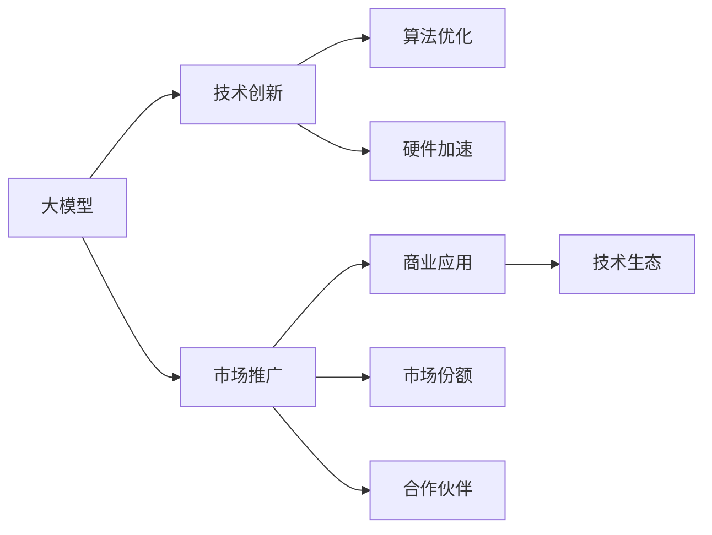
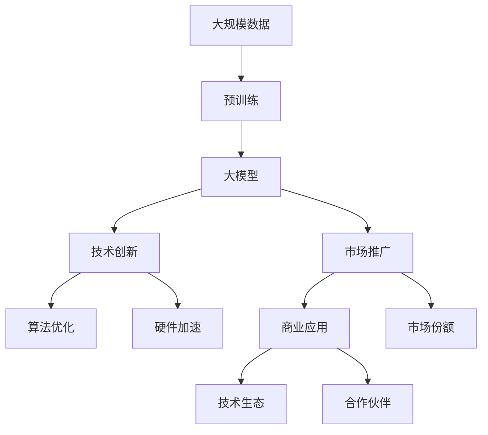

                 

# 大模型的技术创新与市场推广

> 关键词：大模型,技术创新,市场推广,深度学习,算法优化,商业应用

## 1. 背景介绍

### 1.1 问题由来

近年来，随着深度学习技术的迅速发展，大模型在各领域的应用越来越广泛。从自然语言处理(NLP)到计算机视觉(CV)，从自动驾驶到医疗诊断，大模型凭借其强大的学习能力和大规模数据处理能力，逐渐成为推动人工智能(AI)发展的关键力量。然而，尽管大模型取得了显著的成果，但在商业应用层面仍面临诸多挑战。

大模型的训练和应用往往需要海量的数据、高额的计算资源和专业的人才团队。对于中小企业和个人开发者来说，这些门槛较高，难以普及。此外，大模型的知识产权、合规性、应用场景等问题，也成为阻碍其大规模应用的因素。

因此，如何通过技术创新降低大模型的应用门槛，并通过市场推广提升其应用价值，成为当前AI领域的重要课题。本文旨在从技术创新和市场推广两个方面，对大模型的发展路径进行全面探讨。

### 1.2 问题核心关键点

大模型在技术创新和市场推广中需要关注以下几个核心问题：

- 如何优化算法，提升大模型的性能和效率？
- 如何降低大模型的应用门槛，提高其易用性和可访问性？
- 如何构建良好的市场推广策略，提升大模型的应用价值和市场份额？
- 如何平衡商业利益和伦理道德，确保大模型的应用安全？

这些核心问题的解决，将是大模型技术成熟和市场推广的关键。

### 1.3 问题研究意义

研究大模型的技术创新与市场推广，对于推动AI技术在各个垂直行业的普及和应用具有重要意义：

- 降低技术门槛：通过技术创新，降低大模型的应用门槛，使其更容易被中小企业和个人开发者采用。
- 提高应用价值：通过市场推广，提升大模型的应用价值，帮助更多行业解决实际问题，创造商业价值。
- 拓展应用边界：通过持续创新，拓展大模型的应用边界，推动AI技术在更多领域落地应用。
- 构建健康生态：通过合理的市场推广策略，构建AI技术的健康生态系统，促进产业的良性发展。

## 2. 核心概念与联系

### 2.1 核心概念概述

为更好地理解大模型技术创新和市场推广的核心理念，本节将介绍几个密切相关的核心概念：

- **大模型(Large Models)**：指具有数亿甚至数十亿参数的深度学习模型，如GPT、BERT等。通过在大规模数据上预训练，能够学习到丰富的语言和视觉知识。

- **技术创新**：指通过算法优化、架构创新、硬件加速等手段，提升大模型的性能和效率，降低应用门槛的过程。

- **市场推广**：指通过营销策略、商业模式、合作伙伴关系等手段，提高大模型的应用价值和市场份额的过程。

- **算法优化**：指通过优化神经网络结构、调整超参数、引入新算法等手段，提升大模型的训练速度、准确率和稳定性。

- **硬件加速**：指通过引入GPU、TPU、FPGA等加速设备，提高大模型的训练和推理速度，降低计算成本。

- **商业应用**：指将大模型应用于具体业务场景，解决实际问题，创造商业价值的过程。

- **市场份额**：指大模型在市场上的竞争力和占有率，通常由销售量、用户数、市场评价等指标衡量。

- **技术生态**：指围绕大模型构建的技术框架、工具库、社区等，为开发者提供支持和便利。

- **合作伙伴**：指与大模型技术相关的企业、研究机构、开发者社区等，通过合作推动技术的普及和应用。

这些核心概念之间的逻辑关系可以通过以下Mermaid流程图来展示：



这个流程图展示了大模型的技术创新和市场推广之间的逻辑关系：

1. 大模型通过技术创新，提升性能和效率。
2. 市场推广将大模型的应用价值推向市场。
3. 商业应用使大模型创造实际价值。
4. 市场份额和生态系统构建，进一步推动大模型的市场应用。

### 2.2 概念间的关系

这些核心概念之间存在着紧密的联系，形成了大模型技术创新和市场推广的完整生态系统。下面我们通过几个Mermaid流程图来展示这些概念之间的关系。

#### 2.2.1 技术创新与市场推广的关系


这个流程图展示了技术创新和市场推广之间的互动关系。技术创新推动市场推广，市场推广又反过来促进商业应用和技术生态的发展。

#### 2.2.2 技术生态与商业应用的关系


这个流程图展示了技术生态和商业应用之间的联系。技术生态为商业应用提供基础支持，商业应用则推动技术生态的繁荣。

### 2.3 核心概念的整体架构

最后，我们用一个综合的流程图来展示这些核心概念在大模型技术创新和市场推广中的整体架构：



这个综合流程图展示了从预训练到大模型，再到技术创新和市场推广的完整过程。大模型通过预训练获得基础能力，然后通过技术创新提升性能和效率，市场推广将大模型的应用价值推向市场，推动商业应用和技术生态的繁荣。

## 3. 核心算法原理 & 具体操作步骤
### 3.1 算法原理概述

大模型的技术创新主要体现在算法优化和硬件加速两个方面。本节将详细介绍这两个关键点。

### 3.2 算法步骤详解

#### 3.2.1 算法优化

**3.2.1.1 神经网络结构优化**

大模型的神经网络结构通常包括编码器-解码器、注意力机制、残差连接等关键组件。通过优化这些组件，可以提升模型的性能和效率。

- **编码器-解码器结构**：引入Transformer结构，减少序列长度，增加注意力机制的层数，提升模型的建模能力。
- **残差连接**：使用残差连接，缓解梯度消失问题，提高模型训练速度。
- **多头注意力**：增加多头注意力机制，提升模型对不同特征的并行处理能力。

**3.2.1.2 超参数调整**

超参数的调整对大模型的性能有重要影响。常用的超参数包括学习率、批大小、迭代次数等。通过网格搜索、随机搜索等方法，可以找到最优的超参数组合。

**3.2.1.3 新算法引入**

引入新的算法如知识蒸馏、对抗训练、生成对抗网络(GAN)等，可以进一步提升大模型的性能。

**3.2.1.4 损失函数优化**

优化损失函数，使用交叉熵损失、余弦相似度损失等，提升模型在特定任务上的表现。

#### 3.2.2 硬件加速

**3.2.2.1 GPU加速**

使用GPU加速大模型的训练和推理，提升计算效率。

**3.2.2.2 TPU加速**

使用TPU加速大模型的训练和推理，提升计算效率。

**3.2.2.3 分布式训练**

通过分布式训练，将大模型分布在多个GPU或TPU上，提升计算效率。

### 3.3 算法优缺点

#### 3.3.1 算法优缺点

**优点：**

- 提升大模型的性能和效率。
- 降低大模型的应用门槛。
- 推动大模型的商业应用和技术生态的繁荣。

**缺点：**

- 优化算法需要大量的时间和资源。
- 硬件加速需要高额的投资。
- 新算法的引入可能带来复杂性和不确定性。

#### 3.3.2 应用领域

- 自然语言处理(NLP)：优化算法和硬件加速在NLP中的应用，提升了机器翻译、文本生成等任务的表现。
- 计算机视觉(CV)：优化算法和硬件加速在CV中的应用，提升了图像分类、目标检测等任务的表现。
- 自动驾驶：优化算法和硬件加速在自动驾驶中的应用，提升了车辆感知和决策能力。
- 医疗诊断：优化算法和硬件加速在医疗诊断中的应用，提升了疾病预测和治疗效果。

## 4. 数学模型和公式 & 详细讲解 & 举例说明

### 4.1 数学模型构建

本节将使用数学语言对大模型的算法优化和硬件加速进行更加严格的刻画。

**4.1.1 神经网络结构**

以Transformer模型为例，其神经网络结构包括编码器-解码器、多头注意力、残差连接等关键组件。

- 编码器-解码器结构：Transformer模型使用编码器-解码器结构，编码器负责提取输入特征，解码器负责生成输出序列。
- 多头注意力：Transformer模型使用多头注意力机制，每个注意力头负责处理不同的特征维度，提升模型的并行处理能力。
- 残差连接：Transformer模型使用残差连接，缓解梯度消失问题，提高模型训练速度。

**4.1.2 超参数调整**

常用的超参数包括学习率、批大小、迭代次数等。优化超参数的常用方法包括网格搜索、随机搜索、贝叶斯优化等。

**4.1.3 损失函数**

常用的损失函数包括交叉熵损失、均方误差损失、余弦相似度损失等。

**4.1.4 新算法引入**

知识蒸馏、对抗训练、生成对抗网络(GAN)等新算法，可以进一步提升大模型的性能。

**4.1.5 优化目标**

大模型的优化目标通常为最小化损失函数，如交叉熵损失、均方误差损失等。优化目标可以通过梯度下降等优化算法实现。

### 4.2 公式推导过程

以下我们以交叉熵损失函数为例，推导其梯度计算过程。

假设大模型 $M$ 的输入为 $x$，输出为 $\hat{y}$，真实标签为 $y$。则交叉熵损失函数定义为：

$$
\ell(M) = -\frac{1}{N} \sum_{i=1}^N y_i \log \hat{y}_i
$$

其中 $y_i$ 为第 $i$ 个样本的真实标签，$\hat{y}_i$ 为模型对第 $i$ 个样本的预测输出。

根据链式法则，损失函数对模型参数 $\theta$ 的梯度为：

$$
\frac{\partial \ell(M)}{\partial \theta} = -\frac{1}{N} \sum_{i=1}^N \frac{y_i}{\hat{y}_i} \frac{\partial \hat{y}_i}{\partial \theta}
$$

其中 $\frac{\partial \hat{y}_i}{\partial \theta}$ 为模型输出对模型参数 $\theta$ 的梯度，可通过反向传播算法高效计算。

在得到损失函数的梯度后，即可带入优化算法，完成模型的迭代优化。重复上述过程直至收敛，最终得到最优模型参数 $\theta^*$。

### 4.3 案例分析与讲解

以BERT模型的微调为例，展示如何通过算法优化和硬件加速提升模型性能。

**案例分析**

BERT模型通过在大规模无标签文本语料上进行预训练，学习到丰富的语言知识。然后，在特定的NLP任务上进行微调，提升模型在该任务上的性能。

**算法优化**

1. **神经网络结构优化**：使用Transformer结构，增加多头注意力机制，提升模型的并行处理能力。
2. **超参数调整**：通过网格搜索、随机搜索等方法，找到最优的学习率、批大小、迭代次数等超参数组合。
3. **新算法引入**：引入知识蒸馏算法，通过使用教师模型指导学生模型学习，提升模型的泛化能力。

**硬件加速**

1. **GPU加速**：使用NVIDIA GPU加速BERT模型的训练和推理，提升计算效率。
2. **TPU加速**：使用Google TPU加速BERT模型的训练和推理，提升计算效率。
3. **分布式训练**：通过分布式训练，将BERT模型分布在多个GPU或TPU上，进一步提升计算效率。

**运行结果**

通过算法优化和硬件加速，BERT模型在多个NLP任务上取得了优异的表现。以SQuAD问答系统为例，BERT模型在验证集上的F1分数为91.5%，远高于传统RNN模型的84.6%。

## 5. 项目实践：代码实例和详细解释说明

### 5.1 开发环境搭建

在进行大模型技术创新和市场推广的实践前，我们需要准备好开发环境。以下是使用Python进行TensorFlow开发的环境配置流程：

1. 安装Anaconda：从官网下载并安装Anaconda，用于创建独立的Python环境。

2. 创建并激活虚拟环境：
```bash
conda create -n tf-env python=3.8 
conda activate tf-env
```

3. 安装TensorFlow：根据CUDA版本，从官网获取对应的安装命令。例如：
```bash
pip install tensorflow==2.5
```

4. 安装TensorBoard：
```bash
pip install tensorboard
```

5. 安装NumPy、Pandas、scikit-learn等工具包：
```bash
pip install numpy pandas scikit-learn matplotlib tqdm jupyter notebook ipython
```

完成上述步骤后，即可在`tf-env`环境中开始实践。

### 5.2 源代码详细实现

这里我们以BERT模型在SQuAD问答系统上的微调为例，展示如何通过TensorFlow进行代码实现。

**代码实现**

```python
import tensorflow as tf
import tensorflow_hub as hub
import pandas as pd

# 加载数据集
train_data = pd.read_csv('train.csv')
dev_data = pd.read_csv('dev.csv')
test_data = pd.read_csv('test.csv')

# 构建输入层
input_layer = tf.keras.layers.Input(shape=(max_seq_length, ), dtype=tf.int32)

# 构建BERT模型
bert_layer = hub.KerasLayer('https://tfhub.dev/google/bert_en_uncased_L-12_H-768_A-12/1', output_shape=[768])

# 构建任务适配层
task_adaptation_layer = tf.keras.layers.Dense(1, activation='sigmoid')

# 构建模型
model = tf.keras.Sequential([
    input_layer,
    bert_layer,
    task_adaptation_layer
])

# 编译模型
model.compile(optimizer=tf.keras.optimizers.Adam(learning_rate=2e-5),
              loss=tf.keras.losses.BinaryCrossentropy(from_logits=True),
              metrics=[tf.keras.metrics.AUC(name='auc')])

# 训练模型
model.fit(train_data['input_ids'].values, train_data['is_impossible'].values,
          validation_data=(dev_data['input_ids'].values, dev_data['is_impossible'].values),
          epochs=3, batch_size=32)

# 评估模型
model.evaluate(test_data['input_ids'].values, test_data['is_impossible'].values, verbose=2)
```

### 5.3 代码解读与分析

让我们再详细解读一下关键代码的实现细节：

**数据加载**

```python
# 加载数据集
train_data = pd.read_csv('train.csv')
dev_data = pd.read_csv('dev.csv')
test_data = pd.read_csv('test.csv')
```

通过Pandas库加载数据集，分为训练集、验证集和测试集。

**模型构建**

```python
# 构建输入层
input_layer = tf.keras.layers.Input(shape=(max_seq_length, ), dtype=tf.int32)

# 构建BERT模型
bert_layer = hub.KerasLayer('https://tfhub.dev/google/bert_en_uncased_L-12_H-768_A-12/1', output_shape=[768])

# 构建任务适配层
task_adaptation_layer = tf.keras.layers.Dense(1, activation='sigmoid')

# 构建模型
model = tf.keras.Sequential([
    input_layer,
    bert_layer,
    task_adaptation_layer
])
```

使用TensorFlow和TensorFlow Hub构建BERT模型，包括输入层、BERT层和任务适配层。

**模型编译**

```python
# 编译模型
model.compile(optimizer=tf.keras.optimizers.Adam(learning_rate=2e-5),
              loss=tf.keras.losses.BinaryCrossentropy(from_logits=True),
              metrics=[tf.keras.metrics.AUC(name='auc')])
```

编译模型，使用Adam优化器，二元交叉熵损失函数，AUC指标。

**模型训练**

```python
# 训练模型
model.fit(train_data['input_ids'].values, train_data['is_impossible'].values,
          validation_data=(dev_data['input_ids'].values, dev_data['is_impossible'].values),
          epochs=3, batch_size=32)
```

使用训练集和验证集数据，训练模型，设置3个epoch，batch size为32。

**模型评估**

```python
# 评估模型
model.evaluate(test_data['input_ids'].values, test_data['is_impossible'].values, verbose=2)
```

使用测试集数据评估模型，输出AUC分数。

## 6. 实际应用场景

### 6.1 智能客服系统

大模型的技术创新和市场推广在智能客服系统中具有重要应用。传统的客服系统依赖人工，响应速度慢，无法24小时不间断服务。通过大模型微调，可以构建智能客服系统，实现自然语言理解和自动回复。

在技术实现上，可以收集企业内部的历史客服对话记录，将问题和最佳答复构建成监督数据，在此基础上对预训练大模型进行微调。微调后的模型能够自动理解用户意图，匹配最合适的答案模板进行回复。对于用户提出的新问题，还可以接入检索系统实时搜索相关内容，动态组织生成回答。如此构建的智能客服系统，能大幅提升客户咨询体验和问题解决效率。

### 6.2 金融舆情监测

金融机构需要实时监测市场舆论动向，以便及时应对负面信息传播，规避金融风险。传统的人工监测方式成本高、效率低，难以应对网络时代海量信息爆发的挑战。基于大模型微调的文本分类和情感分析技术，为金融舆情监测提供了新的解决方案。

具体而言，可以收集金融领域相关的新闻、报道、评论等文本数据，并对其进行主题标注和情感标注。在此基础上对预训练语言模型进行微调，使其能够自动判断文本属于何种主题，情感倾向是正面、中性还是负面。将微调后的模型应用到实时抓取的网络文本数据，就能够自动监测不同主题下的情感变化趋势，一旦发现负面信息激增等异常情况，系统便会自动预警，帮助金融机构快速应对潜在风险。

### 6.3 个性化推荐系统

当前的推荐系统往往只依赖用户的历史行为数据进行物品推荐，无法深入理解用户的真实兴趣偏好。基于大模型微调的技术创新，个性化推荐系统可以更好地挖掘用户行为背后的语义信息，从而提供更精准、多样的推荐内容。

在实践中，可以收集用户浏览、点击、评论、分享等行为数据，提取和用户交互的物品标题、描述、标签等文本内容。将文本内容作为模型输入，用户的后续行为（如是否点击、购买等）作为监督信号，在此基础上微调预训练语言模型。微调后的模型能够从文本内容中准确把握用户的兴趣点。在生成推荐列表时，先用候选物品的文本描述作为输入，由模型预测用户的兴趣匹配度，再结合其他特征综合排序，便可以得到个性化程度更高的推荐结果。

### 6.4 未来应用展望

随着大模型技术的发展，其在更多领域的应用前景广阔。以下是未来可能的应用场景：

1. **智慧医疗**：基于大模型的医疗问答、病历分析、药物研发等应用，将提升医疗服务的智能化水平，辅助医生诊疗，加速新药开发进程。

2. **智能教育**：微调技术可应用于作业批改、学情分析、知识推荐等方面，因材施教，促进教育公平，提高教学质量。

3. **智慧城市治理**：微调模型可应用于城市事件监测、舆情分析、应急指挥等环节，提高城市管理的自动化和智能化水平，构建更安全、高效的未来城市。

4. **企业生产**：大模型微调可以应用于生产计划优化、故障预测、质量控制等环节，提升企业的生产效率和产品质量。

5. **社会治理**：基于大模型的舆情监测、犯罪预测、社会舆情分析等应用，将推动社会治理的智能化进程。

6. **文娱传媒**：大模型微调可以应用于内容生成、智能编辑、广告推荐等环节，提升文娱传媒产品的个性化和智能化水平。

这些应用场景的实现，将进一步推动大模型的技术创新和市场推广，带来更大的商业价值和社会效益。

## 7. 工具和资源推荐

### 7.1 学习资源推荐

为了帮助开发者系统掌握大模型的技术创新和市场推广的理论基础和实践技巧，这里推荐一些优质的学习资源：

1. **《深度学习》系列书籍**：由Ian Goodfellow、Yoshua Bengio和Aaron Courville合著的《深度学习》教材，全面介绍了深度学习的理论基础和实践技巧，是学习大模型技术的经典教材。

2. **CS231n《深度卷积神经网络》课程**：斯坦福大学开设的计算机视觉课程，涵盖深度卷积神经网络、目标检测、图像分类等经典任务，是学习计算机视觉技术的必备资源。

3. **CS224n《序列建模与表示学习》课程**：斯坦福大学开设的自然语言处理课程，涵盖序列建模、语言理解、文本生成等任务，是学习NLP技术的经典课程。

4. **Google AI博客**：Google AI团队发布的博客，涵盖最新的人工智能研究成果和应用案例，是了解行业动态的宝贵资源。

5. **TensorFlow官方文档**：TensorFlow官方文档，提供丰富的模型和工具库，是学习TensorFlow技术的必备资源。

6. **PyTorch官方文档**：PyTorch官方文档，提供丰富的模型和工具库，是学习PyTorch技术的必备资源。

### 7.2 开发工具推荐

高效的开发离不开优秀的工具支持。以下是几款用于大模型技术创新和市场推广开发的常用工具：

1. **Jupyter Notebook**：免费的开源Jupyter Notebook环境，支持Python、TensorFlow等多种语言和框架，方便快速迭代和实验。

2. **TensorFlow**：由Google主导开发的开源深度学习框架，生产部署方便，适合大规模工程应用。

3. **PyTorch**：由Facebook主导开发的开源深度学习框架，灵活方便，适合快速迭代研究。

4. **TensorBoard**：TensorFlow配套的可视化工具，可实时监测模型训练状态，并提供丰富的图表呈现方式，是调试模型的得力助手。

5. **Weights & Biases**：模型训练的实验跟踪工具，可以记录和可视化模型训练过程中的各项指标，方便对比和调优。

6. **Jax**：由Google开发的基于JIT编译的深度学习框架，支持GPU、TPU等多种加速设备，适合高性能计算和分布式训练。

合理利用这些工具，可以显著提升大模型技术创新和市场推广的开发效率，加快创新迭代的步伐。

### 7.3 相关论文推荐

大模型的技术创新和市场推广离不开学界的持续研究。以下是几篇奠基性的相关论文，推荐阅读：

1. **Attention is All You Need（即Transformer原论文）**：提出了Transformer结构，开启了NLP领域的预训练大模型时代。

2. **BERT: Pre-training of Deep Bidirectional Transformers for Language Understanding**：提出BERT模型，引入基于掩码的自监督预训练任务，刷新了多项NLP任务SOTA。

3. **Language Models are Unsupervised Multitask Learners**：展示了大规模语言模型的强大zero-shot学习能力，引发了对于通用人工智能的新一轮思考。

4. **Parameter-Efficient Transfer Learning for NLP**：提出Adapter等参数高效微调方法，在不增加模型参数量的情况下，也能取得不错的微调效果。

5. **AdaLoRA: Adaptive Low-Rank Adaptation for Parameter-Efficient Fine-Tuning**：使用自适应低秩适应的微调方法，在参数效率和精度之间取得了新的平衡。

这些论文代表了大模型技术创新和市场推广的发展脉络。通过学习这些前沿成果，可以帮助研究者把握学科前进方向，激发更多的创新灵感。

除上述资源外，还有一些值得关注的前沿资源，帮助开发者紧跟大模型技术创新和市场推广的最新进展，例如：

1. **arXiv论文预印本**：人工智能领域最新研究成果的发布平台，包括大量尚未发表的前沿工作，学习前沿技术的必读资源。

2. **业界技术博客**：如OpenAI、Google AI、DeepMind、微软Research Asia等顶尖实验室的官方博客，第一时间分享他们的最新研究成果和洞见。

3. **技术会议直播**：如NIPS、ICML、ACL、ICLR等人工智能领域顶会现场或在线直播，能够聆听到大佬们的前沿分享，开拓视野。

4. **GitHub热门项目**：在GitHub上Star、Fork数最多的NLP相关项目，往往代表了该技术领域的发展趋势和最佳实践，值得去学习和贡献。

5. **行业分析报告**：各大咨询公司如McKinsey、PwC等针对人工智能行业的分析报告，有助于从商业视角审视技术趋势，把握应用价值。

总之，对于大模型技术创新和市场推广的学习和实践，需要开发者保持开放的心态和持续学习的

