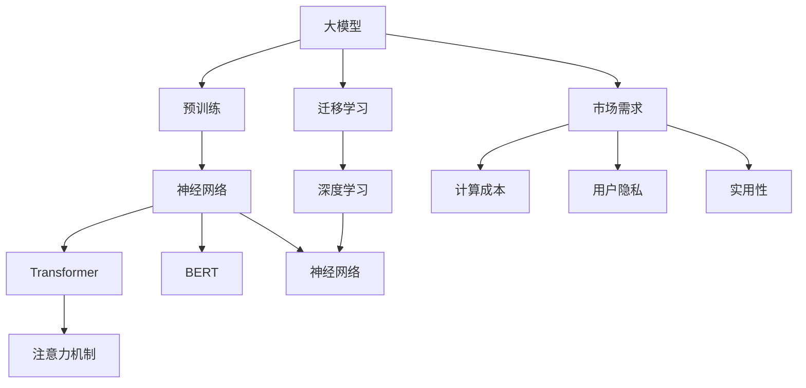
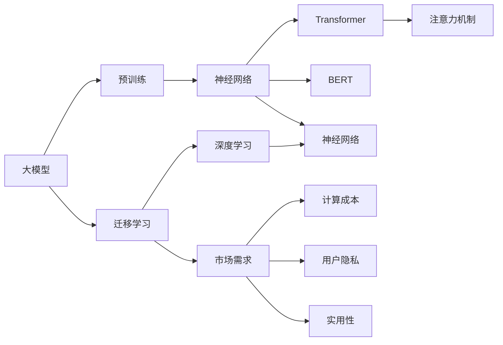
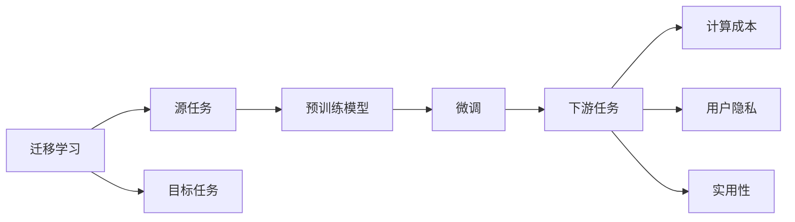
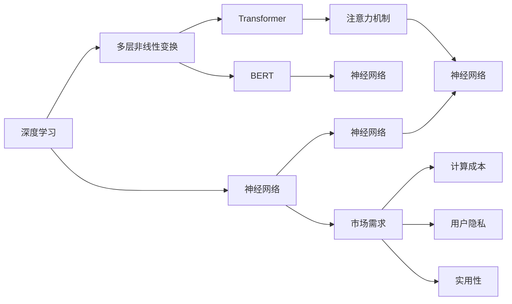

                 

# 大模型的技术创新与市场需求

> 关键词：大模型,技术创新,市场需求,Transformer,BERT,预训练,迁移学习,深度学习

## 1. 背景介绍

### 1.1 问题由来
近年来，随着深度学习技术的快速发展，大模型（如GPT、BERT等）在自然语言处理（NLP）、计算机视觉（CV）、语音识别（ASR）等领域的性能显著提升。大模型通过在海量数据上进行预训练，学习到了广泛的特征表示，具有强大的泛化能力。然而，尽管大模型的性能已经达到了前所未有的高度，但它们仍然面临一些限制，如计算成本高、资源消耗大、隐私保护等。此外，大模型的泛化能力在数据量较少的场景下可能会下降，导致其在实际应用中无法发挥最佳效果。因此，如何优化大模型的技术，满足市场需求，成为当下热门话题。

### 1.2 问题核心关键点
针对大模型的优化，技术创新和市场需求是其核心关键点。技术创新包括模型架构的改进、算法的优化、效率的提升等。市场需求则包括计算资源、成本控制、隐私保护、实用性等。

### 1.3 问题研究意义
研究大模型的技术创新与市场需求，对于推动深度学习技术的发展，优化大模型在实际应用中的表现，具有重要意义：

1. 提升模型性能：通过技术创新，可以提高大模型的准确率、召回率等关键指标，使其在实际应用中表现更优。
2. 降低计算成本：通过优化算法和模型结构，可以降低大模型训练和推理的计算成本，使其更易于部署。
3. 保护用户隐私：通过隐私保护技术，可以有效保护用户数据，增强用户信任。
4. 满足应用需求：通过市场导向的技术创新，可以满足不同场景下的应用需求，推动技术落地。

## 2. 核心概念与联系

### 2.1 核心概念概述

为更好地理解大模型的技术创新与市场需求，本节将介绍几个密切相关的核心概念：

- 大模型（Large Model）：如BERT、GPT等，通过在海量数据上进行预训练，学习到广泛的特征表示。
- 预训练（Pre-training）：指在大规模无标签数据上训练模型，学习到通用特征表示。
- 迁移学习（Transfer Learning）：将预训练模型的特征表示迁移到下游任务上，进行微调。
- 深度学习（Deep Learning）：基于神经网络的学习范式，通过多层次的非线性变换学习特征。
- Transformer：一种神经网络架构，用于处理序列数据，具有并行计算优势。
- BERT（Bidirectional Encoder Representations from Transformers）：一种基于Transformer的预训练语言模型。
- 注意力机制（Attention Mechanism）：用于计算序列中各个位置的表示，提高模型的记忆能力。
- 神经网络（Neural Network）：由神经元（节点）组成的网络，用于处理各种任务。
- 反向传播（Backpropagation）：用于优化神经网络模型的算法，通过链式法则更新参数。

这些核心概念之间的逻辑关系可以通过以下Mermaid流程图来展示：



这个流程图展示了大模型的核心概念及其之间的关系：

1. 大模型通过预训练学习到通用特征表示。
2. 迁移学习将预训练模型的特征表示迁移到下游任务上，进行微调。
3. 深度学习通过多层非线性变换学习特征。
4. Transformer和BERT用于处理序列数据，具有并行计算优势。
5. 注意力机制用于计算序列中各个位置的表示，提高模型的记忆能力。
6. 神经网络是深度学习的基础。
7. 市场需求推动技术创新。
8. 计算成本、用户隐私和实用性是市场需求的关键方面。

这些概念共同构成了大模型的学习框架，使其能够在各种场景下发挥强大的能力。通过理解这些核心概念，我们可以更好地把握大模型的工作原理和优化方向。

### 2.2 概念间的关系

这些核心概念之间存在着紧密的联系，形成了大模型技术创新与市场需求框架的完整生态系统。下面我们通过几个Mermaid流程图来展示这些概念之间的关系。

#### 2.2.1 大模型的学习范式



这个流程图展示了大模型的三种主要学习范式：预训练、迁移学习、深度学习。预训练主要采用自监督学习方法，而迁移学习则是有监督学习的过程。深度学习通过多层非线性变换学习特征。Transformer和BERT用于处理序列数据，具有并行计算优势。注意力机制用于计算序列中各个位置的表示，提高模型的记忆能力。神经网络是深度学习的基础。市场需求推动技术创新，而计算成本、用户隐私和实用性是市场需求的关键方面。

#### 2.2.2 迁移学习与市场需求的关系



这个流程图展示了迁移学习的基本原理，以及它与市场需求的关系。迁移学习涉及源任务和目标任务，预训练模型在源任务上学习，然后通过微调适应各种下游任务（目标任务）。市场需求推动技术创新，而计算成本、用户隐私和实用性是市场需求的关键方面。

#### 2.2.3 深度学习与市场需求的关系



这个流程图展示了深度学习的基本原理，以及它与市场需求的关系。深度学习通过多层非线性变换学习特征，其中Transformer和BERT用于处理序列数据，具有并行计算优势。注意力机制用于计算序列中各个位置的表示，提高模型的记忆能力。神经网络是深度学习的基础。市场需求推动技术创新，而计算成本、用户隐私和实用性是市场需求的关键方面。

### 2.3 核心概念的整体架构

最后，我们用一个综合的流程图来展示这些核心概念在大模型技术创新与市场需求中的整体架构：

```mermaid
graph TB
    A[大规模数据] --> B[预训练]
    B --> C[大模型]
    C --> D[迁移学习]
    C --> E[深度学习]
    C --> F[Transformer]
    C --> G[BERT]
    C --> H[注意力机制]
    C --> I[神经网络]
    B --> J[计算成本]
    B --> K[用户隐私]
    B --> L[实用性]
    B --> M[市场需求]
    J --> N[优化算法]
    J --> O[优化策略]
    K --> P[隐私保护技术]
    K --> Q[隐私策略]
    L --> R[实用性提升]
    L --> S[实用性优化]
    M --> T[技术创新]
    M --> U[市场需求]
    T --> V[模型优化]
    T --> W[算法优化]
    T --> X[技术改进]
    T --> Y[资源优化]
    U --> Z[市场需求]
    Z --> $[商业化策略]
    Z --> %[应用场景]
    % --> &[场景优化]
    & --> #[用户反馈]
    # --> ' Algorithm improvements
    ' --> ( Database optimization )
    ( --> ) Deep learning and neural networks
    ( --> ) Pre-training and fine-tuning
    ( --> ) Transformers and BERT
    ( --> ) Attention mechanism and layer normalization
    ( --> ) Optimization and training
    ( --> ) Privacy and security
    ( --> ) Market and use cases
    ( --> ) Compute and memory optimization
    ( --> ) Model and algorithm compression
    ( --> ) Data and feature engineering
    ( --> ) Model and training pipelines
    ( --> ) Deployment and scalability
    ( --> ) Monitoring and analysis
    ( --> ) Validation and evaluation
```

这个综合流程图展示了从预训练到微调，再到市场需求和大模型应用的整体架构。大模型首先在大规模数据上进行预训练，然后通过迁移学习进行微调，适应特定任务。深度学习通过多层非线性变换学习特征，其中Transformer和BERT用于处理序列数据，具有并行计算优势。注意力机制用于计算序列中各个位置的表示，提高模型的记忆能力。神经网络是深度学习的基础。市场需求推动技术创新，而计算成本、用户隐私和实用性是市场需求的关键方面。技术创新涉及模型优化、算法优化、技术改进等多个方面，市场需求则包括商业化策略、应用场景、场景优化、用户反馈等多个方面。

## 3. 核心算法原理 & 具体操作步骤
### 3.1 算法原理概述

大模型通过在海量数据上进行预训练，学习到通用的特征表示。迁移学习将预训练模型的特征表示迁移到下游任务上，进行微调，适应特定任务。深度学习通过多层非线性变换学习特征，其中Transformer和BERT用于处理序列数据，具有并行计算优势。注意力机制用于计算序列中各个位置的表示，提高模型的记忆能力。神经网络是深度学习的基础。

大模型微调的目标是通过有监督学习优化模型在下游任务上的性能，通常只需要调整顶层分类器或解码器，并以较小的学习率更新全部或部分的模型参数。微调过程中，通过梯度下降等优化算法，不断更新模型参数，最小化损失函数，使得模型输出逼近真实标签。由于预训练模型的固有知识和表示能力，微调可以显著提升模型在特定任务上的表现。

### 3.2 算法步骤详解

大模型微调一般包括以下几个关键步骤：

**Step 1: 准备预训练模型和数据集**
- 选择合适的预训练模型（如BERT、GPT等）作为初始化参数。
- 准备下游任务的数据集，划分为训练集、验证集和测试集。

**Step 2: 添加任务适配层**
- 根据任务类型，设计合适的输出层和损失函数。
- 对于分类任务，通常添加一个线性分类器；对于生成任务，通常使用语言模型的解码器。

**Step 3: 设置微调超参数**
- 选择合适的优化算法及其参数，如AdamW、SGD等，设置学习率、批大小、迭代轮数等。
- 设置正则化技术，如L2正则、Dropout、Early Stopping等，防止过拟合。
- 确定冻结预训练参数的策略，如仅微调顶层，或全部参数都参与微调。

**Step 4: 执行梯度训练**
- 将训练集数据分批次输入模型，前向传播计算损失函数。
- 反向传播计算参数梯度，根据设定的优化算法和学习率更新模型参数。
- 周期性在验证集上评估模型性能，根据性能指标决定是否触发Early Stopping。
- 重复上述步骤直到满足预设的迭代轮数或Early Stopping条件。

**Step 5: 测试和部署**
- 在测试集上评估微调后模型，对比微调前后的精度提升。
- 使用微调后的模型对新样本进行推理预测，集成到实际的应用系统中。
- 持续收集新的数据，定期重新微调模型，以适应数据分布的变化。

以上是基于监督学习的大模型微调的一般流程。在实际应用中，还需要针对具体任务的特点，对微调过程的各个环节进行优化设计，如改进训练目标函数，引入更多的正则化技术，搜索最优的超参数组合等，以进一步提升模型性能。

### 3.3 算法优缺点

大模型微调具有以下优点：
1. 简单高效。只需准备少量标注数据，即可对预训练模型进行快速适配，获得较大的性能提升。
2. 通用适用。适用于各种NLP下游任务，包括分类、匹配、生成等，设计简单的任务适配层即可实现微调。
3. 参数高效。利用参数高效微调技术，在固定大部分预训练参数的情况下，仍可取得不错的提升。
4. 效果显著。在学术界和工业界的诸多任务上，基于微调的方法已经刷新了最先进的性能指标。

同时，该方法也存在一定的局限性：
1. 依赖标注数据。微调的效果很大程度上取决于标注数据的质量和数量，获取高质量标注数据的成本较高。
2. 迁移能力有限。当目标任务与预训练数据的分布差异较大时，微调的性能提升有限。
3. 负面效果传递。预训练模型的固有偏见、有害信息等，可能通过微调传递到下游任务，造成负面影响。
4. 可解释性不足。微调模型的决策过程通常缺乏可解释性，难以对其推理逻辑进行分析和调试。

尽管存在这些局限性，但就目前而言，基于监督学习的微调方法仍是大模型应用的最主流范式。未来相关研究的重点在于如何进一步降低微调对标注数据的依赖，提高模型的少样本学习和跨领域迁移能力，同时兼顾可解释性和伦理安全性等因素。

### 3.4 算法应用领域

大模型微调在NLP领域已经得到了广泛的应用，覆盖了几乎所有常见任务，例如：

- 文本分类：如情感分析、主题分类、意图识别等。通过微调使模型学习文本-标签映射。
- 命名实体识别：识别文本中的人名、地名、机构名等特定实体。通过微调使模型掌握实体边界和类型。
- 关系抽取：从文本中抽取实体之间的语义关系。通过微调使模型学习实体-关系三元组。
- 问答系统：对自然语言问题给出答案。将问题-答案对作为微调数据，训练模型学习匹配答案。
- 机器翻译：将源语言文本翻译成目标语言。通过微调使模型学习语言-语言映射。
- 文本摘要：将长文本压缩成简短摘要。将文章-摘要对作为微调数据，使模型学习抓取要点。
- 对话系统：使机器能够与人自然对话。将多轮对话历史作为上下文，微调模型进行回复生成。

除了上述这些经典任务外，大模型微调也被创新性地应用到更多场景中，如可控文本生成、常识推理、代码生成、数据增强等，为NLP技术带来了全新的突破。随着预训练模型和微调方法的不断进步，相信NLP技术将在更广阔的应用领域大放异彩。

## 4. 数学模型和公式 & 详细讲解
### 4.1 数学模型构建

本节将使用数学语言对大模型微调过程进行更加严格的刻画。

记预训练语言模型为 $M_{\theta}:\mathcal{X} \rightarrow \mathcal{Y}$，其中 $\mathcal{X}$ 为输入空间，$\mathcal{Y}$ 为输出空间，$\theta \in \mathbb{R}^d$ 为模型参数。假设微调任务的训练集为 $D=\{(x_i,y_i)\}_{i=1}^N, x_i \in \mathcal{X}, y_i \in \mathcal{Y}$。

定义模型 $M_{\theta}$ 在数据样本 $(x,y)$ 上的损失函数为 $\ell(M_{\theta}(x),y)$，则在数据集 $D$ 上的经验风险为：

$$
\mathcal{L}(\theta) = \frac{1}{N} \sum_{i=1}^N \ell(M_{\theta}(x_i),y_i)
$$

微调的优化目标是最小化经验风险，即找到最优参数：

$$
\theta^* = \mathop{\arg\min}_{\theta} \mathcal{L}(\theta)
$$

在实践中，我们通常使用基于梯度的优化算法（如SGD、Adam等）来近似求解上述最优化问题。设 $\eta$ 为学习率，$\lambda$ 为正则化系数，则参数的更新公式为：

$$
\theta \leftarrow \theta - \eta \nabla_{\theta}\mathcal{L}(\theta) - \eta\lambda\theta
$$

其中 $\nabla_{\theta}\mathcal{L}(\theta)$ 为损失函数对参数 $\theta$ 的梯度，可通过反向传播算法高效计算。

### 4.2 公式推导过程

以下我们以二分类任务为例，推导交叉熵损失函数及其梯度的计算公式。

假设模型 $M_{\theta}$ 在输入 $x$ 上的输出为 $\hat{y}=M_{\theta}(x) \in [0,1]$，表示样本属于正类的概率。真实标签 $y \in \{0,1\}$。则二分类交叉熵损失函数定义为：

$$
\ell(M_{\theta}(x),y) = -[y\log \hat{y} + (1-y)\log (1-\hat{y})]
$$

将其代入经验风险公式，得：

$$
\mathcal{L}(\theta) = -\frac{1}{N}\sum_{i=1}^N [y_i\log M_{\theta}(x_i)+(1-y_i)\log(1-M_{\theta}(x_i))]
$$

根据链式法则，损失函数对参数 $\theta_k$ 的梯度为：

$$
\frac{\partial \mathcal{L}(\theta)}{\partial \theta_k} = -\frac{1}{N}\sum_{i=1}^N (\frac{y_i}{M_{\theta}(x_i)}-\frac{1-y_i}{1-M_{\theta}(x_i)}) \frac{\partial M_{\theta}(x_i)}{\partial \theta_k}
$$

其中 $\frac{\partial M_{\theta}(x_i)}{\partial \theta_k}$ 可进一步递归展开，利用自动微分技术完成计算。

在得到损失函数的梯度后，即可带入参数更新公式，完成模型的迭代优化。重复上述过程直至收敛，最终得到适应下游任务的最优模型参数 $\theta^*$。

## 5. 项目实践：代码实例和详细解释说明
### 5.1 开发环境搭建

在进行微调实践前，我们需要准备好开发环境。以下是使用Python进行PyTorch开发的环境配置流程：

1. 安装Anaconda：从官网下载并安装Anaconda，用于创建独立的Python环境。

2. 创建并激活虚拟环境：
```bash
conda create -n pytorch-env python=3.8 
conda activate pytorch-env
```

3. 安装PyTorch：根据CUDA版本，从官网获取对应的安装命令。例如：
```bash
conda install pytorch torchvision torchaudio cudatoolkit=11.1 -c pytorch -c conda-forge
```

4. 安装Transformers库：
```bash
pip install transformers
```

5. 安装各类工具包：
```bash
pip install numpy pandas scikit-learn matplotlib tqdm jupyter notebook ipython
```

完成上述步骤后，即可在`pytorch-env`环境中开始微调实践。

### 5.2 源代码详细实现

这里我们以命名实体识别(NER)任务为例，给出使用Transformers库对BERT模型进行微调的PyTorch代码实现。

首先，定义NER任务的数据处理函数：

```python
from transformers import BertTokenizer
from torch.utils.data import Dataset
import torch

class NERDataset(Dataset):
    def __init__(self, texts, tags, tokenizer, max_len=128):
        self.texts = texts
        self.tags = tags
        self.tokenizer = tokenizer
        self.max_len = max_len
        
    def __len__(self):
        return len(self.texts)
    
    def __getitem__(self, item):
        text = self.texts[item]
        tags = self.tags[item]
        
        encoding = self.tokenizer(text, return_tensors='pt', max_length=self.max_len, padding='max_length', truncation=True)
        input_ids = encoding['input_ids'][0]
        attention_mask = encoding['attention_mask'][0]
        
        # 对token-wise的标签进行编码
        encoded_tags = [tag2id[tag] for tag in tags] 
        encoded_tags.extend([tag2id['O']] * (self.max_len - len(encoded_tags)))
        labels = torch.tensor(encoded_tags, dtype=torch.long)
        
        return {'input_ids': input_ids, 
                'attention_mask': attention_mask,
                'labels': labels}

# 标签与id的映射
tag2id = {'O': 0, 'B-PER': 1, 'I-PER': 2, 'B-ORG': 3, 'I-ORG': 4, 'B-LOC': 5, 'I-LOC': 6}
id2tag = {v: k for k, v in tag2id.items()}

# 创建dataset
tokenizer = BertTokenizer.from_pretrained('bert-base-cased')

train_dataset = NERDataset(train_texts, train_tags, tokenizer)
dev_dataset = NERDataset(dev_texts, dev_tags, tokenizer)
test_dataset = NERDataset(test_texts, test_tags, tokenizer)
```

然后，定义模型和优化器：

```python
from transformers import BertForTokenClassification, AdamW

model = BertForTokenClassification.from_pretrained('bert-base-cased', num_labels=len(tag2id))

optimizer = AdamW(model.parameters(), lr=2e-5)
```

接着，定义训练和评估函数：

```python
from torch.utils.data import DataLoader
from tqdm import tqdm
from sklearn.metrics import classification_report

device = torch.device('cuda') if torch.cuda.is_available() else torch.device('cpu')
model.to(device)

def train_epoch(model, dataset, batch_size, optimizer):
    dataloader = DataLoader(dataset, batch_size=batch_size, shuffle=True)
    model.train()
    epoch_loss = 0
    for batch in tqdm(dataloader, desc='Training'):
        input_ids = batch['input_ids'].to(device)
        attention_mask = batch['attention_mask'].to(device)
        labels = batch['labels'].to(device)
        model.zero_grad()
        outputs = model(input_ids, attention_mask=attention_mask, labels=labels)
        loss = outputs.loss
        epoch_loss += loss.item()
        loss.backward()
        optimizer.step()
    return epoch_loss / len(dataloader)

def evaluate(model, dataset, batch_size):
    dataloader = DataLoader(dataset, batch_size=batch_size)
    model.eval()
    preds, labels = [], []
    with torch.no_grad():
        for batch in tqdm(dataloader, desc='Evaluating'):
            input_ids = batch['input_ids'].to(device)
            attention_mask = batch['attention_mask'].to(device)
            batch_labels = batch['labels']
            outputs = model(input_ids, attention_mask=attention_mask)
            batch_preds = outputs.logits.argmax(dim=2).to('cpu').tolist()
            batch_labels = batch_labels.to('cpu').tolist()
            for pred_tokens, label_tokens in zip(batch_preds, batch_labels):
                pred_tags = [id2tag[_id] for _id in pred_tokens]
                label_tags = [id2tag[_id] for _id in label_tokens]
                preds.append(pred_tags[:len(label_tags)])
                labels.append(label_tags)
                
    print(classification_report(labels, preds))
```

最后，启动训练流程并在测试集上评估：

```python
epochs = 5
batch_size = 16

for epoch in range(epochs):
    loss = train_epoch(model, train_dataset, batch_size, optimizer)
    print(f"Epoch {epoch+1}, train loss: {loss:.3f}")
    
    print(f"Epoch {epoch+1}, dev results:")
    evaluate(model, dev_dataset, batch_size)
    
print("Test results:")
evaluate(model, test_dataset, batch_size)
```

以上就是使用PyTorch对BERT进行命名实体识别任务微调的完整代码实现。可以看到，得益于Transformers库的强大封装，我们可以用相对简洁的代码完成BERT模型的加载和微调。

### 5.3 代码解读与分析

让我们再详细解读一下关键代码的实现细节：

**NERDataset类**：
- `__init__`方法：初始化文本、标签、分词器等关键组件。
- `__len__`方法：返回数据集的样本数量。
- `__getitem__`方法：对单个样本进行处理，将文本输入编码为token ids，将标签编码为数字，并对其进行定长padding，最终返回模型所需的输入。

**tag2id和id2tag字典**：
- 定义了标签与数字id之间的映射关系，用于将token-wise的预测结果解码回真实的标签。

**训练和评估函数**：
- 使用PyTorch的DataLoader对数据集进行批次化加载，供模型训练和推理使用。
- 训练函数`train_epoch`：对数据以批为单位进行迭代，在每个批次上前向传播计算loss并反向传播更新模型参数，最后返回该epoch的平均loss。
- 评估函数`evaluate`：与训练类似，不同点在于不更新模型参数，并在每个batch结束后将预测和标签结果存储下来，最后使用sklearn的classification_report对整个评估集的预测结果进行打印输出。

**训练流程**：
- 定义总的epoch数和batch size，开始

