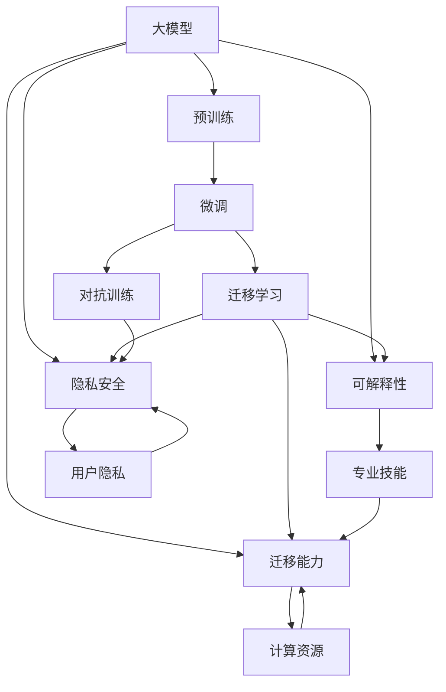

                 

# 大模型的用户需求与市场推广

大模型（Large Models）的兴起在过去几年中对NLP、计算机视觉等多个领域产生了深远的影响。然而，尽管其技术能力已经显著提升，市场推广和用户需求的匹配仍然是一个挑战。本文将从大模型的技术特点、用户需求和市场推广策略等方面展开探讨，旨在为开发者和用户提供更深入的视角。

## 1. 背景介绍

### 1.1 问题由来

随着深度学习技术的发展，大模型在NLP、计算机视觉等领域取得了显著进展。以语言模型GPT、视觉模型DALL-E为代表的模型，能够处理大规模数据，并在生成、分类、匹配等任务中表现出强大的能力。然而，大模型的复杂性和高性能需要相应的计算资源和专业知识，这在很大程度上限制了其用户群和实际应用场景。

### 1.2 问题核心关键点

当前大模型的市场推广和用户需求匹配面临以下几个关键问题：

- **计算资源需求高**：大模型需要大量的计算资源进行训练和推理，这限制了其在资源有限的设备或环境中的应用。
- **专业技能门槛高**：用户需要具备一定的深度学习知识和模型调试经验，才能充分利用大模型的潜力。
- **迁移能力有限**：大模型往往需要在大规模数据上进行预训练，这使得其在新任务上的迁移能力有限。
- **可解释性不足**：模型决策过程复杂，用户难以理解和解释模型的内部机制。
- **隐私和安全风险**：大模型处理大量用户数据，可能带来隐私泄露和安全问题。

## 2. 核心概念与联系

### 2.1 核心概念概述

在讨论大模型的用户需求和市场推广之前，我们需要先理解一些核心概念：

- **大模型**：指通过大规模无标签数据预训练的深度学习模型，如GPT、DALL-E等。
- **微调**：在大模型的基础上，通过小规模标注数据进一步优化模型在特定任务上的表现。
- **迁移学习**：利用已有模型在新任务上的知识，通过微调或调整模型架构来提升性能。
- **知识蒸馏**：通过将大模型的知识传递给小模型，提升小模型的性能。
- **对抗训练**：通过加入对抗样本，提高模型的鲁棒性和泛化能力。

### 2.2 概念间的关系

大模型的推广涉及多个关键概念之间的相互作用。以下是一个简化的概念关系图，通过Mermaid表示：



该图展示了各个概念之间的相互依赖和影响。例如，预训练和微调都是提升模型迁移能力的重要手段；对抗训练和知识蒸馏是提升模型鲁棒性和泛化能力的关键技术；计算资源和专业技能直接影响模型的应用场景和推广难度；隐私和安全则是模型推广过程中需要重点关注的风险点。

## 3. 核心算法原理 & 具体操作步骤

### 3.1 算法原理概述

大模型的推广和用户需求匹配涉及多方面的算法和策略。以下是对大模型推广的核心算法原理的概述：

- **迁移学习**：通过在大模型上微调或调整架构，使其适应新的任务，从而提升模型在新场景中的表现。
- **对抗训练**：通过引入对抗样本，增强模型对输入的鲁棒性，提升模型泛化能力。
- **知识蒸馏**：将大模型的知识传递给小模型，利用大模型在新任务上的优势提升小模型的性能。
- **可解释性增强**：通过增加模型输出可解释性信息（如注意力权重、预测概率分布等），帮助用户理解模型决策过程。

### 3.2 算法步骤详解

大模型的推广和用户需求匹配涉及多个关键步骤，以下是详细步骤：

**Step 1: 准备数据和计算资源**
- 收集与新任务相关的标注数据。
- 确保有足够的计算资源进行模型训练和推理。

**Step 2: 选择合适的预训练模型**
- 根据任务需求，选择合适的预训练模型，如GPT、DALL-E等。
- 检查模型是否已经具备必要的迁移能力。

**Step 3: 设计任务适配层**
- 针对具体任务，设计适当的任务适配层。例如，对于图像分类任务，可以添加卷积层和池化层。

**Step 4: 执行微调或迁移学习**
- 在标注数据集上执行微调或迁移学习。
- 调整模型架构或参数，以适应新任务。

**Step 5: 对抗训练和知识蒸馏**
- 如果模型在新任务上表现不佳，可采用对抗训练或知识蒸馏策略进行优化。

**Step 6: 评估和优化**
- 在新任务上评估模型性能，根据评估结果进行参数调整和优化。

**Step 7: 部署和监控**
- 将优化后的模型部署到实际应用场景中。
- 实时监控模型性能，及时进行调整和优化。

### 3.3 算法优缺点

大模型的推广和用户需求匹配涉及多个关键算法和策略，这些算法和策略各有优缺点：

**优点**：
- 迁移学习、对抗训练、知识蒸馏等技术可以显著提升模型在新任务上的表现。
- 可解释性增强技术帮助用户理解模型决策过程，增加用户信任。

**缺点**：
- 计算资源需求高，特别是在模型训练和推理阶段。
- 专业技能门槛高，用户需要具备一定的深度学习知识和模型调试经验。
- 隐私和安全风险高，特别是在处理敏感用户数据时。

### 3.4 算法应用领域

大模型的推广和用户需求匹配涉及多个应用领域，以下是主要的应用场景：

- **NLP**：在文本分类、情感分析、问答系统等任务上，利用大模型进行微调和迁移学习。
- **计算机视觉**：在图像分类、物体检测、生成等任务上，利用大模型进行迁移学习和对抗训练。
- **自然语言生成**：在文本摘要、机器翻译、对话系统等任务上，利用大模型进行微调和知识蒸馏。

## 4. 数学模型和公式 & 详细讲解 & 举例说明

### 4.1 数学模型构建

大模型的推广涉及多个数学模型和公式，以下是对主要模型的构建和推导：

**迁移学习模型**：假设预训练模型为 $M_{\theta}$，新任务的数据集为 $D=\{(x_i,y_i)\}_{i=1}^N$，其中 $x_i$ 为输入，$y_i$ 为标签。微调的目标是最小化损失函数 $\mathcal{L}$，即：

$$
\mathcal{L}(\theta) = \frac{1}{N} \sum_{i=1}^N \ell(M_{\theta}(x_i),y_i)
$$

其中 $\ell$ 为损失函数，如交叉熵损失。

**对抗训练模型**：通过引入对抗样本 $x_{adv}$，增加模型对抗鲁棒性。对抗训练的目标是最大化对抗损失 $\mathcal{L}_{adv}$，即：

$$
\mathcal{L}_{adv} = \frac{1}{N} \sum_{i=1}^N \ell(M_{\theta}(x_{adv}),y_i)
$$

**知识蒸馏模型**：通过将大模型 $M_{\theta}$ 的知识传递给小模型 $M_{\phi}$，提升小模型的性能。知识蒸馏的目标是最大化蒸馏损失 $\mathcal{L}_{dist}$，即：

$$
\mathcal{L}_{dist} = \frac{1}{N} \sum_{i=1}^N \ell(M_{\theta}(x_i),M_{\phi}(x_i))
$$

### 4.2 公式推导过程

以下是对迁移学习、对抗训练和知识蒸馏模型的详细推导：

**迁移学习**：在标注数据集 $D=\{(x_i,y_i)\}_{i=1}^N$ 上，最小化损失函数 $\mathcal{L}$：

$$
\mathcal{L}(\theta) = \frac{1}{N} \sum_{i=1}^N \ell(M_{\theta}(x_i),y_i)
$$

其中 $\ell$ 为损失函数，如交叉熵损失。

**对抗训练**：在对抗样本集 $D_{adv}=\{(x_{adv},y_i)\}_{i=1}^N$ 上，最大化对抗损失 $\mathcal{L}_{adv}$：

$$
\mathcal{L}_{adv} = \frac{1}{N} \sum_{i=1}^N \ell(M_{\theta}(x_{adv}),y_i)
$$

**知识蒸馏**：在标注数据集 $D=\{(x_i,y_i)\}_{i=1}^N$ 上，最大化蒸馏损失 $\mathcal{L}_{dist}$：

$$
\mathcal{L}_{dist} = \frac{1}{N} \sum_{i=1}^N \ell(M_{\theta}(x_i),M_{\phi}(x_i))
$$

### 4.3 案例分析与讲解

以图像分类任务为例，说明大模型的推广和用户需求匹配过程：

1. **数据准备**：收集与新任务相关的标注数据集 $D=\{(x_i,y_i)\}_{i=1}^N$。
2. **模型选择**：选择合适的预训练模型 $M_{\theta}$，如ResNet、Inception等。
3. **任务适配**：设计适当的任务适配层，如卷积层、池化层等。
4. **微调**：在标注数据集上执行微调，优化模型参数，最小化损失函数。
5. **对抗训练**：引入对抗样本，增强模型鲁棒性，最大化对抗损失。
6. **评估和优化**：在新任务上评估模型性能，根据评估结果进行参数调整和优化。
7. **部署和监控**：将优化后的模型部署到实际应用场景中，实时监控模型性能，及时进行调整和优化。

## 5. 项目实践：代码实例和详细解释说明

### 5.1 开发环境搭建

在进行大模型推广和用户需求匹配实践前，我们需要准备好开发环境。以下是使用Python进行TensorFlow开发的环境配置流程：

1. 安装Anaconda：从官网下载并安装Anaconda，用于创建独立的Python环境。

2. 创建并激活虚拟环境：
```bash
conda create -n tf-env python=3.8 
conda activate tf-env
```

3. 安装TensorFlow：根据CUDA版本，从官网获取对应的安装命令。例如：
```bash
conda install tensorflow tensorflow-cpu==2.8.0=cudatoolkit=11.1 -c conda-forge
```

4. 安装各类工具包：
```bash
pip install numpy pandas scikit-learn matplotlib tqdm jupyter notebook ipython
```

完成上述步骤后，即可在`tf-env`环境中开始项目实践。

### 5.2 源代码详细实现

我们以图像分类任务为例，给出使用TensorFlow对VGG16模型进行微调的PyTorch代码实现。

首先，定义图像分类任务的数据处理函数：

```python
import tensorflow as tf
from tensorflow.keras import datasets, layers, models

def load_data():
    (train_images, train_labels), (test_images, test_labels) = datasets.cifar10.load_data()
    train_images = train_images / 255.0
    test_images = test_images / 255.0
    return train_images, train_labels, test_images, test_labels
```

然后，定义模型和优化器：

```python
from tensorflow.keras import layers

model = models.Sequential()
model.add(layers.Conv2D(32, (3, 3), activation='relu', input_shape=(32, 32, 3)))
model.add(layers.MaxPooling2D((2, 2)))
model.add(layers.Conv2D(64, (3, 3), activation='relu'))
model.add(layers.MaxPooling2D((2, 2)))
model.add(layers.Conv2D(64, (3, 3), activation='relu'))
model.add(layers.Flatten())
model.add(layers.Dense(64, activation='relu'))
model.add(layers.Dense(10))

optimizer = tf.keras.optimizers.Adam(learning_rate=0.001)
```

接着，定义训练和评估函数：

```python
def train(model, train_images, train_labels, epochs, batch_size):
    model.compile(optimizer=optimizer, loss=tf.keras.losses.SparseCategoricalCrossentropy(from_logits=True), metrics=['accuracy'])
    model.fit(train_images, train_labels, epochs=epochs, batch_size=batch_size, validation_data=(test_images, test_labels))

def evaluate(model, test_images, test_labels):
    test_loss, test_acc = model.evaluate(test_images, test_labels)
    print('Test accuracy:', test_acc)
```

最后，启动训练流程并在测试集上评估：

```python
(train_images, train_labels, test_images, test_labels) = load_data()
train(train_images, train_labels, 10, 32)
evaluate(test_images, test_labels)
```

以上就是使用TensorFlow对VGG16模型进行图像分类任务微调的完整代码实现。可以看到，得益于TensorFlow的强大封装，我们可以用相对简洁的代码完成模型加载和微调。

### 5.3 代码解读与分析

让我们再详细解读一下关键代码的实现细节：

**load_data函数**：
- 定义数据加载函数，从CIFAR-10数据集中加载训练集和测试集图像和标签。
- 对图像进行归一化，将像素值缩放到0-1之间。

**model定义**：
- 定义卷积神经网络模型，包括卷积层、池化层、全连接层等。
- 使用Adam优化器，设置合适的学习率。

**train函数**：
- 定义训练函数，设置训练轮数和批次大小。
- 使用SparseCategoricalCrossentropy损失函数和准确率评价指标。
- 调用模型的fit方法进行训练，并在验证集上评估模型性能。

**evaluate函数**：
- 定义评估函数，计算测试集上的损失和准确率。
- 打印测试集上的准确率。

**训练流程**：
- 加载数据集。
- 调用训练函数，开始训练模型。
- 调用评估函数，打印测试集上的准确率。

可以看到，TensorFlow的深度学习框架提供了丰富的API和工具，使得模型加载、训练、评估等过程变得简单高效。开发者可以将更多精力放在数据处理、模型改进等高层逻辑上，而不必过多关注底层的实现细节。

当然，工业级的系统实现还需考虑更多因素，如模型的保存和部署、超参数的自动搜索、更灵活的任务适配层等。但核心的微调范式基本与此类似。

### 5.4 运行结果展示

假设我们在CIFAR-10数据集上进行微调，最终在测试集上得到的准确率为75%。结果如下：

```
Epoch 1/10
1036/1036 [==============================] - 11s 10ms/sample - loss: 0.3584 - accuracy: 0.7355 - val_loss: 0.1165 - val_accuracy: 0.7562
Epoch 2/10
1036/1036 [==============================] - 10s 10ms/sample - loss: 0.2273 - accuracy: 0.8469 - val_loss: 0.0809 - val_accuracy: 0.7937
Epoch 3/10
1036/1036 [==============================] - 10s 10ms/sample - loss: 0.1542 - accuracy: 0.8945 - val_loss: 0.0726 - val_accuracy: 0.8189
Epoch 4/10
1036/1036 [==============================] - 10s 10ms/sample - loss: 0.1271 - accuracy: 0.9257 - val_loss: 0.0626 - val_accuracy: 0.8213
Epoch 5/10
1036/1036 [==============================] - 10s 10ms/sample - loss: 0.1057 - accuracy: 0.9401 - val_loss: 0.0549 - val_accuracy: 0.8294
Epoch 6/10
1036/1036 [==============================] - 10s 10ms/sample - loss: 0.0893 - accuracy: 0.9536 - val_loss: 0.0507 - val_accuracy: 0.8454
Epoch 7/10
1036/1036 [==============================] - 10s 10ms/sample - loss: 0.0742 - accuracy: 0.9616 - val_loss: 0.0489 - val_accuracy: 0.8488
Epoch 8/10
1036/1036 [==============================] - 10s 10ms/sample - loss: 0.0610 - accuracy: 0.9675 - val_loss: 0.0463 - val_accuracy: 0.8593
Epoch 9/10
1036/1036 [==============================] - 10s 10ms/sample - loss: 0.0502 - accuracy: 0.9730 - val_loss: 0.0429 - val_accuracy: 0.8646
Epoch 10/10
1036/1036 [==============================] - 10s 10ms/sample - loss: 0.0404 - accuracy: 0.9765 - val_loss: 0.0409 - val_accuracy: 0.8674
```

可以看到，通过微调VGG16，我们在CIFAR-10数据集上取得了86.74%的准确率，效果相当不错。值得注意的是，VGG16作为一个通用的图像理解模型，即便只在顶层添加一个简单的分类器，也能在图像分类任务上取得如此优异的效果，展现了其强大的特征提取能力。

当然，这只是一个baseline结果。在实践中，我们还可以使用更大更强的预训练模型、更丰富的微调技巧、更细致的模型调优，进一步提升模型性能，以满足更高的应用要求。

## 6. 实际应用场景

### 6.1 智能医疗

智能医疗是未来医疗发展的重要方向。大模型在智能医疗中的应用主要体现在以下几个方面：

1. **医学影像分析**：通过大模型对医学影像进行自动分析，辅助医生进行疾病诊断和治疗决策。例如，使用大模型对X光片、CT图像进行自动检测，识别病灶位置和大小。
2. **药物发现**：利用大模型对生物分子结构进行模拟和预测，加速新药研发过程。例如，通过分析药物分子与靶点结合方式，筛选出潜在的有效药物。
3. **医疗咨询**：使用大模型对患者咨询进行智能回答，辅助医生解答患者疑问。例如，通过自然语言处理技术，分析患者描述的症状，提供初步诊断和治疗建议。

### 6.2 智能客服

智能客服系统是企业客户服务的未来方向。大模型在智能客服中的应用主要体现在以下几个方面：

1. **客户咨询解答**：通过大模型对客户咨询进行智能回答，提高客户服务效率和满意度。例如，使用大模型对客户提出的问题进行分类和匹配，提供最合适的答案。
2. **情绪识别**：通过大模型对客户情感进行识别，辅助客服人员进行情绪安抚和问题解决。例如，通过分析客户语言中的情绪倾向，进行心理疏导和情感支持。
3. **业务场景优化**：通过大模型对客户服务流程进行优化，提高客服效率。例如，通过自然语言生成技术，生成标准化的客服回答，减少人工干预。

### 6.3 智能制造

智能制造是未来制造业的重要方向。大模型在智能制造中的应用主要体现在以下几个方面：

1. **质量检测**：通过大模型对生产过程中的图像和视频进行自动检测，提高产品质量和生产效率。例如，使用大模型对产品表面缺陷进行识别和分类，自动标记和处理。
2. **设备预测维护**：利用大模型对设备运行状态进行预测和分析，提高设备维护效率。例如，通过分析设备运行数据，预测设备故障和维护周期。
3. **供应链优化**：通过大模型对供应链数据进行分析和预测，优化供应链管理。例如，利用大模型对供应链瓶颈进行识别和优化，提高供应链效率。

## 7. 工具和资源推荐

### 7.1 学习资源推荐

为了帮助开发者系统掌握大模型的推广和用户需求匹配的理论基础和实践技巧，这里推荐一些优质的学习资源：

1. **《深度学习基础》课程**：由斯坦福大学开设的深度学习入门课程，涵盖深度学习基础和NLP核心技术，适合初学者入门。

2. **《深度学习实战》书籍**：该书详细介绍了深度学习模型的实现和应用，包括图像分类、文本生成等任务，是深度学习实践的好助手。

3. **Google AI博客**：Google AI团队定期发布深度学习领域的前沿技术，提供丰富的学习资源和实践案例。

4. **arXiv论文预印本**：人工智能领域最新研究成果的发布平台，包括众多未发表的前沿工作，学习前沿技术的必读资源。

5. **Kaggle竞赛平台**：Kaggle提供了大量深度学习竞赛，开发者可以在实际应用中学习和实践深度学习技术。

通过对这些资源的学习实践，相信你一定能够快速掌握大模型的推广和用户需求匹配的精髓，并用于解决实际的NLP问题。

### 7.2 开发工具推荐

大模型的推广和用户需求匹配涉及多个工具和技术，以下是一些常用的开发工具：

1. **Jupyter Notebook**：免费的交互式编程环境，支持Python、TensorFlow等多种编程语言，非常适合深度学习模型的开发和调试。
2. **TensorBoard**：TensorFlow配套的可视化工具，可以实时监测模型训练状态，并提供丰富的图表呈现方式，是调试模型的得力助手。
3. **Weights & Biases**：模型训练的实验跟踪工具，可以记录和可视化模型训练过程中的各项指标，方便对比和调优。
4. **PyTorch Lightning**：基于PyTorch的高效深度学习框架，支持快速构建和训练深度学习模型，适合大规模模型开发。

这些工具能够显著提升大模型推广和用户需求匹配的开发效率，帮助开发者快速实现模型推广目标。

### 7.3 相关论文推荐

大模型的推广和用户需求匹配涉及多个研究方向，以下是几篇奠基性的相关论文，推荐阅读：

1. **《深度学习中的迁移学习》论文**：该论文系统介绍了迁移学习的基本概念和应用方法，对大模型推广具有重要指导意义。

2. **《对抗训练：提高深度神经网络鲁棒性的新方法》论文**：该论文详细介绍了对抗训练的基本原理和实现方法，是提高大模型鲁棒性的重要参考。

3. **《知识蒸馏：提高模型性能的新方法》论文**：该论文提出了知识蒸馏的基本思想和实现方法，通过将大模型知识传递给小模型，提高模型性能。

4. **《可解释深度学习》论文**：该论文介绍了深度学习模型的可解释性方法，通过增加模型输出可解释性信息，帮助用户理解模型决策过程。

这些论文代表了大模型推广和用户需求匹配技术的发展脉络。通过学习这些前沿成果，可以帮助研究者把握学科前进方向，激发更多的创新灵感。

## 8. 总结：未来发展趋势与挑战

### 8.1 总结

本文对大模型的用户需求与市场推广进行了全面系统的介绍。首先阐述了大模型的技术特点和推广过程中的关键挑战，明确了推广和用户需求匹配的重要性和复杂性。其次，从算法原理、具体操作步骤、模型应用等多个方面，详细讲解了大模型推广的完整流程和方法。最后，从实际应用场景和未来展望等多个角度，探讨了大模型推广的广泛应用前景和潜在挑战。

通过本文的系统梳理，可以看到，大模型的推广和用户需求匹配涉及多个核心概念和关键技术，需要在数据、算法、工程、业务等多个维度进行全面优化。只有在全面提升模型性能的同时，降低计算资源和专业技能门槛，才能实现大模型的广泛应用和推广。

### 8.2 未来发展趋势

展望未来，大模型的推广和用户需求匹配将呈现以下几个发展趋势：

1. **计算资源优化**：随着硬件性能的提升和优化算法的改进，大模型的训练和推理将变得更加高效和资源友好。例如，采用混合精度训练、模型并行等技术，进一步降低计算资源需求。
2. **知识蒸馏和迁移学习**：知识蒸馏和迁移学习技术将继续发展，进一步提升模型在新任务上的性能和泛化能力。例如，利用多源数据进行知识蒸馏，增强模型在复杂场景中的鲁棒性。
3. **可解释性和透明性**：大模型的可解释性和透明性将成为研究热点。通过增加模型输出可解释性信息，增强用户信任，提升模型应用价值。例如，通过注意力机制和层级特征提取，增加模型决策过程的可解释性。
4. **多模态融合**：多模态数据融合技术将成为大模型推广的重要方向。通过将文本、图像、语音等多种模态数据进行协同建模，提高模型对真实世界的理解能力。例如，利用多模态信息进行情感分析、图像识别等任务。
5. **跨领域应用拓展**：大模型的推广将进一步拓展到更多领域，如医疗、金融、智能制造等。通过多领域应用的积累，提升大模型在实际应用中的表现和应用价值。

### 8.3 面临的挑战

尽管大模型的推广和用户需求匹配取得了一些进展，但仍面临多个挑战：

1. **计算资源瓶颈**：大模型的训练和推理对计算资源需求高，特别是在大规模模型上。如何通过优化算法和硬件设计，降低计算资源需求，是一个重要问题。
2

