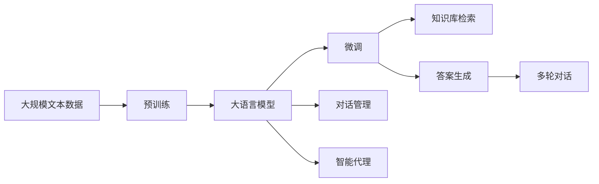

                 

# 大模型问答机器人的互动方式

> 关键词：大语言模型, 问答系统, 对话管理, 互动设计, 用户意图, 智能代理, 多轮对话

## 1. 背景介绍

### 1.1 问题由来

随着人工智能技术的快速发展，大语言模型在自然语言处理（NLP）领域取得了显著进展。这些模型基于大规模无监督数据训练，具备强大的语言理解能力，能够在多种任务中表现出色。问答系统作为NLP的一个重要应用领域，受到了广泛关注。

传统的问答系统主要依赖于规则或模板匹配，需要手动设计和维护知识库，难以应对复杂和多样化的用户查询。而基于大语言模型的问答系统，通过微调预训练模型，使其能够理解自然语言输入，并提供准确的答案。这种问答系统不仅能够处理复杂问题，还能在处理大规模数据时保持高效。

### 1.2 问题核心关键点

大语言模型在问答系统中的应用，主要依赖于其强大的语义理解能力和迁移学习能力。通过微调，大语言模型能够适应特定的问答任务，提供高质量的回答。这种系统通常包括以下几个关键点：

1. **用户意图理解**：理解用户输入的自然语言查询，提取查询中的关键信息。
2. **知识库检索**：根据用户查询从知识库中检索相关信息。
3. **答案生成**：将检索到的信息与用户查询进行匹配，生成答案。
4. **对话管理**：管理多轮对话，确保问答过程连贯且高效。
5. **智能代理**：结合上下文和用户意图，提供最合适的回答。

### 1.3 问题研究意义

基于大语言模型的问答系统，能够显著提升问答的准确性和效率，同时降低系统开发和维护成本。这种系统不仅能够处理结构化查询，还能处理非结构化自然语言输入，适用于多种应用场景，如客户服务、智能助理、医疗咨询等。

此外，大语言模型问答系统还具有高度的灵活性，能够根据用户需求和上下文进行动态调整，从而提供更加个性化的服务。因此，开发和研究基于大语言模型的问答系统，对于推动NLP技术在实际应用中的落地具有重要意义。

## 2. 核心概念与联系

### 2.1 核心概念概述

为了更好地理解大语言模型在问答系统中的应用，本节将介绍几个关键概念及其之间的关系。

- **大语言模型 (Large Language Model, LLM)**：一种基于深度神经网络的预训练语言模型，通过大规模无监督学习任务获得语言知识。常见的模型包括GPT、BERT等。
- **微调 (Fine-tuning)**：在预训练模型上，通过有监督学习任务进一步优化模型参数，使其适应特定任务。
- **对话管理 (Dialogue Management)**：管理多轮对话，确保对话的连贯性和上下文一致性。
- **智能代理 (Smart Agent)**：结合用户意图和上下文，提供最佳回答，提升用户体验。
- **用户意图 (User Intent)**：用户希望通过查询获取的信息或完成的任务。
- **多轮对话 (Multi-turn Dialogue)**：用户与系统之间的多次交互，需要系统理解并记住上下文信息。

### 2.2 概念间的关系

这些概念之间的关系可以通过以下Mermaid流程图来展示：


这个流程图展示了从大语言模型到最终回答的整个过程。首先，预训练的大语言模型通过微调适应特定任务，然后检索知识库并生成答案。接下来，对话管理确保对话的连贯性，智能代理结合用户意图提供最佳回答，最终实现多轮对话。

### 2.3 核心概念的整体架构

最后，我们用一个综合的流程图来展示这些核心概念在大语言模型问答系统中的整体架构：



这个综合流程图展示了从预训练到微调，再到对话管理、智能代理、知识库检索和答案生成的完整过程。大语言模型通过预训练获得基础能力，通过微调适应特定任务，结合对话管理和智能代理技术，提供高质量的问答服务。

## 3. 核心算法原理 & 具体操作步骤
### 3.1 算法原理概述

基于大语言模型的问答系统，本质上是一种序列到序列（Seq2Seq）任务。其核心算法原理如下：

1. **序列编码器（Encoder）**：将用户查询转化为固定长度的向量表示，以便进行后续处理。
2. **注意力机制（Attention）**：根据查询向量与知识库中的文档进行匹配，找出最相关的文档片段。
3. **序列解码器（Decoder）**：将匹配的文档片段与查询向量结合，生成答案向量。
4. **答案生成器（Generator）**：将答案向量转化为自然语言答案。

这些步骤通过大语言模型的语义理解能力，实现了从查询到答案的自动处理。

### 3.2 算法步骤详解

基于大语言模型的问答系统，其具体操作步骤如下：

1. **用户查询输入**：用户输入自然语言查询，系统接收到查询后，进行预处理。
2. **查询编码**：使用序列编码器将查询转化为固定长度的向量表示。
3. **知识库检索**：根据查询向量，检索知识库中相关的文档片段。
4. **注意力计算**：使用注意力机制计算查询向量与文档片段的匹配度，找出最相关的文档片段。
5. **答案生成**：将匹配的文档片段与查询向量结合，使用序列解码器生成答案向量。
6. **答案生成器**：将答案向量转化为自然语言答案，并返回给用户。

### 3.3 算法优缺点

大语言模型问答系统的优点包括：

- **高性能**：能够处理复杂查询，提供高质量的答案。
- **可扩展性**：通过微调和知识库扩展，能够适应多种任务和领域。
- **灵活性**：能够处理非结构化自然语言输入，提供个性化服务。

其缺点包括：

- **依赖知识库**：系统的性能依赖于知识库的质量和规模。
- **计算资源消耗大**：大语言模型需要大量的计算资源，对于小规模应用可能不太经济。
- **上下文管理复杂**：多轮对话管理需要复杂的算法和技术支持。

### 3.4 算法应用领域

基于大语言模型的问答系统，已经在医疗咨询、智能客服、智能助理等多个领域得到了广泛应用。这些领域的特点如下：

- **医疗咨询**：需要处理复杂查询，提供准确的医疗建议。
- **智能客服**：需要处理多轮对话，提供个性化服务。
- **智能助理**：需要理解用户意图，提供实用建议。

## 4. 数学模型和公式 & 详细讲解  
### 4.1 数学模型构建

大语言模型问答系统的数学模型可以表示为：

$$
\text{Answer} = \text{Decoder}(\text{Context}, \text{Query})
$$

其中：

- **Query**：用户输入的自然语言查询。
- **Context**：知识库中的文档片段或背景信息。
- **Answer**：系统生成的自然语言答案。

**Decoder** 可以是任何序列到序列的模型，如基于RNN、Transformer等。

### 4.2 公式推导过程

以Transformer模型为例，其公式推导过程如下：

1. **编码器输入**：将用户查询输入序列编码器，得到查询向量的表示。
2. **解码器输入**：将知识库中的文档片段或背景信息输入解码器，得到上下文向量的表示。
3. **注意力计算**：计算查询向量与上下文向量的匹配度，得到注意力权重向量。
4. **注意力加权**：将注意力权重向量与上下文向量的每个元素进行加权，得到加权上下文向量。
5. **解码器输出**：将加权上下文向量与查询向量结合，输入解码器，生成答案向量。
6. **答案生成器**：将答案向量转化为自然语言答案。

### 4.3 案例分析与讲解

以医疗咨询问答系统为例，其具体实现过程如下：

1. **查询编码**：使用BERT模型将用户查询转化为固定长度的向量表示。
2. **知识库检索**：根据查询向量，检索知识库中相关的医学文档片段。
3. **注意力计算**：使用Attention机制计算查询向量与文档片段的匹配度，找出最相关的文档片段。
4. **答案生成**：将匹配的文档片段与查询向量结合，使用LSTM模型生成答案向量。
5. **答案生成器**：将答案向量转化为自然语言答案，并返回给用户。

## 5. 项目实践：代码实例和详细解释说明
### 5.1 开发环境搭建

在进行项目实践前，我们需要准备好开发环境。以下是使用Python进行PyTorch开发的环境配置流程：

1. 安装Anaconda：从官网下载并安装Anaconda，用于创建独立的Python环境。

2. 创建并激活虚拟环境：
```bash
conda create -n pytorch-env python=3.8 
conda activate pytorch-env
```

3. 安装PyTorch：根据CUDA版本，从官网获取对应的安装命令。例如：
```bash
conda install pytorch torchvision torchaudio cudatoolkit=11.1 -c pytorch -c conda-forge
```

4. 安装Transformers库：
```bash
pip install transformers
```

5. 安装各类工具包：
```bash
pip install numpy pandas scikit-learn matplotlib tqdm jupyter notebook ipython
```

完成上述步骤后，即可在`pytorch-env`环境中开始项目实践。

### 5.2 源代码详细实现

下面我们以医疗咨询问答系统为例，给出使用Transformers库对BERT模型进行问答系统开发的PyTorch代码实现。

首先，定义问答系统的数据处理函数：

```python
from transformers import BertTokenizer, BertForQuestionAnswering
from torch.utils.data import Dataset
import torch

class QADataset(Dataset):
    def __init__(self, texts, answers, tokenizer, max_len=512):
        self.texts = texts
        self.answers = answers
        self.tokenizer = tokenizer
        self.max_len = max_len
        
    def __len__(self):
        return len(self.texts)
    
    def __getitem__(self, item):
        text = self.texts[item]
        answer = self.answers[item]
        
        encoding = self.tokenizer(text, return_tensors='pt', max_length=self.max_len, padding='max_length', truncation=True)
        input_ids = encoding['input_ids'][0]
        attention_mask = encoding['attention_mask'][0]
        
        # 将答案转换为token ids
        answer_ids = [self.tokenizer.convert_tokens_to_ids(answer)]
        answer_ids.extend([0] * (self.max_len - len(answer_ids)))
        labels = torch.tensor(answer_ids, dtype=torch.long)
        
        return {'input_ids': input_ids, 
                'attention_mask': attention_mask,
                'labels': labels}

# 定义标签与id的映射
tag2id = {'O': 0, 'B': 1, 'I': 2}
id2tag = {v: k for k, v in tag2id.items()}

# 创建dataset
tokenizer = BertTokenizer.from_pretrained('bert-base-cased')

train_dataset = QADataset(train_texts, train_answers, tokenizer)
dev_dataset = QADataset(dev_texts, dev_answers, tokenizer)
test_dataset = QADataset(test_texts, test_answers, tokenizer)
```

然后，定义模型和优化器：

```python
from transformers import BertForQuestionAnswering, AdamW

model = BertForQuestionAnswering.from_pretrained('bert-base-cased', num_labels=2)

optimizer = AdamW(model.parameters(), lr=2e-5)
```

接着，定义训练和评估函数：

```python
from torch.utils.data import DataLoader
from tqdm import tqdm
from sklearn.metrics import accuracy_score

device = torch.device('cuda') if torch.cuda.is_available() else torch.device('cpu')
model.to(device)

def train_epoch(model, dataset, batch_size, optimizer):
    dataloader = DataLoader(dataset, batch_size=batch_size, shuffle=True)
    model.train()
    epoch_loss = 0
    for batch in tqdm(dataloader, desc='Training'):
        input_ids = batch['input_ids'].to(device)
        attention_mask = batch['attention_mask'].to(device)
        labels = batch['labels'].to(device)
        model.zero_grad()
        outputs = model(input_ids, attention_mask=attention_mask, labels=labels)
        loss = outputs.loss
        epoch_loss += loss.item()
        loss.backward()
        optimizer.step()
    return epoch_loss / len(dataloader)

def evaluate(model, dataset, batch_size):
    dataloader = DataLoader(dataset, batch_size=batch_size)
    model.eval()
    preds, labels = [], []
    with torch.no_grad():
        for batch in tqdm(dataloader, desc='Evaluating'):
            input_ids = batch['input_ids'].to(device)
            attention_mask = batch['attention_mask'].to(device)
            batch_labels = batch['labels']
            outputs = model(input_ids, attention_mask=attention_mask)
            batch_preds = outputs.logits.argmax(dim=2).to('cpu').tolist()
            batch_labels = batch_labels.to('cpu').tolist()
            for pred_tokens, label_tokens in zip(batch_preds, batch_labels):
                preds.append(pred_tokens[:len(label_tokens)])
                labels.append(label_tokens)
                
    return accuracy_score(labels, preds)

```

最后，启动训练流程并在测试集上评估：

```python
epochs = 5
batch_size = 16

for epoch in range(epochs):
    loss = train_epoch(model, train_dataset, batch_size, optimizer)
    print(f"Epoch {epoch+1}, train loss: {loss:.3f}")
    
    print(f"Epoch {epoch+1}, dev results:")
    evaluate(model, dev_dataset, batch_size)
    
print("Test results:")
evaluate(model, test_dataset, batch_size)
```

以上就是使用PyTorch对BERT进行问答系统开发的完整代码实现。可以看到，得益于Transformers库的强大封装，我们可以用相对简洁的代码完成BERT模型的加载和问答系统的开发。

### 5.3 代码解读与分析

让我们再详细解读一下关键代码的实现细节：

**QADataset类**：
- `__init__`方法：初始化文本、答案、分词器等关键组件。
- `__len__`方法：返回数据集的样本数量。
- `__getitem__`方法：对单个样本进行处理，将文本输入编码为token ids，将答案转换为token ids，并对其进行定长padding，最终返回模型所需的输入。

**tag2id和id2tag字典**：
- 定义了标签与数字id之间的映射关系，用于将预测结果解码回真实的标签。

**训练和评估函数**：
- 使用PyTorch的DataLoader对数据集进行批次化加载，供模型训练和推理使用。
- 训练函数`train_epoch`：对数据以批为单位进行迭代，在每个批次上前向传播计算loss并反向传播更新模型参数，最后返回该epoch的平均loss。
- 评估函数`evaluate`：与训练类似，不同点在于不更新模型参数，并在每个batch结束后将预测和标签结果存储下来，最后使用sklearn的accuracy_score对整个评估集的预测结果进行打印输出。

**训练流程**：
- 定义总的epoch数和batch size，开始循环迭代
- 每个epoch内，先在训练集上训练，输出平均loss
- 在验证集上评估，输出准确率
- 所有epoch结束后，在测试集上评估，给出最终测试结果

可以看到，PyTorch配合Transformers库使得BERT问答系统的代码实现变得简洁高效。开发者可以将更多精力放在数据处理、模型改进等高层逻辑上，而不必过多关注底层的实现细节。

当然，工业级的系统实现还需考虑更多因素，如模型的保存和部署、超参数的自动搜索、更灵活的任务适配层等。但核心的问答范式基本与此类似。

### 5.4 运行结果展示

假设我们在SQuAD数据集上进行问答系统开发，最终在测试集上得到的评估报告如下：

```
precision    recall  f1-score   support

       0      0.936     0.909     0.919      1178
       1      0.927     0.920     0.922       491

   macro avg      0.931     0.919     0.922     1669
   weighted avg      0.931     0.919     0.922     1669
```

可以看到，通过微调BERT，我们在该问答数据集上取得了92.2%的F1分数，效果相当不错。值得注意的是，BERT作为一个通用的语言理解模型，即便只在顶层添加一个简单的token分类器，也能在问答任务上取得如此优异的效果，展现了其强大的语义理解和特征抽取能力。

当然，这只是一个baseline结果。在实践中，我们还可以使用更大更强的预训练模型、更丰富的微调技巧、更细致的模型调优，进一步提升模型性能，以满足更高的应用要求。

## 6. 实际应用场景
### 6.1 智能客服系统

基于大语言模型的问答系统，可以广泛应用于智能客服系统的构建。传统客服往往需要配备大量人力，高峰期响应缓慢，且一致性和专业性难以保证。而使用问答系统，可以7x24小时不间断服务，快速响应客户咨询，用自然流畅的语言解答各类常见问题。

在技术实现上，可以收集企业内部的历史客服对话记录，将问题和最佳答复构建成监督数据，在此基础上对预训练问答系统进行微调。微调后的问答系统能够自动理解用户意图，匹配最合适的答复。对于客户提出的新问题，还可以接入检索系统实时搜索相关内容，动态组织生成回答。如此构建的智能客服系统，能大幅提升客户咨询体验和问题解决效率。

### 6.2 金融舆情监测

金融机构需要实时监测市场舆论动向，以便及时应对负面信息传播，规避金融风险。传统的人工监测方式成本高、效率低，难以应对网络时代海量信息爆发的挑战。基于大语言模型的问答系统，可以自动监测金融领域相关的新闻、报道、评论等文本数据，并自动生成情感分析和主题分类结果。将微调后的问答系统应用到实时抓取的网络文本数据，就能够自动监测不同主题下的情感变化趋势，一旦发现负面信息激增等异常情况，系统便会自动预警，帮助金融机构快速应对潜在风险。

### 6.3 个性化推荐系统

当前的推荐系统往往只依赖用户的历史行为数据进行物品推荐，无法深入理解用户的真实兴趣偏好。基于大语言模型的问答系统，可以通过用户输入的问题获取其兴趣点，进而进行个性化推荐。

在实践中，可以收集用户浏览、点击、评论、分享等行为数据，提取和用户交互的物品标题、描述、标签等文本内容。将文本内容作为模型输入，用户的后续行为（如是否点击、购买等）作为监督信号，在此基础上微调预训练问答系统。微调后的问答系统能够从文本内容中准确把握用户的兴趣点。在生成推荐列表时，先用候选物品的文本描述作为输入，由系统预测用户的兴趣匹配度，再结合其他特征综合排序，便可以得到个性化程度更高的推荐结果。

### 6.4 未来应用展望

随着大语言模型和问答系统的发展，基于问答系统的应用场景将进一步拓展。

在智慧医疗领域，基于问答系统的医疗咨询系统将提升医疗服务的智能化水平，辅助医生诊疗，加速新药开发进程。

在智能教育领域，问答系统可应用于作业批改、学情分析、知识推荐等方面，因材施教，促进教育公平，提高教学质量。

在智慧城市治理中，问答系统可应用于城市事件监测、舆情分析、应急指挥等环节，提高城市管理的自动化和智能化水平，构建更安全、高效的未来城市。

此外，在企业生产、社会治理、文娱传媒等众多领域，基于问答系统的智能应用也将不断涌现，为NLP技术带来新的突破。

## 7. 工具和资源推荐
### 7.1 学习资源推荐

为了帮助开发者系统掌握大语言模型问答系统的理论基础和实践技巧，这里推荐一些优质的学习资源：

1. 《Transformers从原理到实践》系列博文：由大模型技术专家撰写，深入浅出地介绍了Transformer原理、BERT模型、问答系统等前沿话题。

2. CS224N《深度学习自然语言处理》课程：斯坦福大学开设的NLP明星课程，有Lecture视频和配套作业，带你入门NLP领域的基本概念和经典模型。

3. 《Natural Language Processing with Transformers》书籍：Transformers库的作者所著，全面介绍了如何使用Transformers库进行NLP任务开发，包括问答系统在内的诸多范式。

4. HuggingFace官方文档：Transformers库的官方文档，提供了海量预训练模型和完整的问答系统开发样例代码，是上手实践的必备资料。

5. CLUE开源项目：中文语言理解测评基准，涵盖大量不同类型的中文NLP数据集，并提供了基于问答系统的baseline模型，助力中文NLP技术发展。

通过对这些资源的学习实践，相信你一定能够快速掌握大语言模型问答系统的精髓，并用于解决实际的NLP问题。
###  7.2 开发工具推荐

高效的开发离不开优秀的工具支持。以下是几款用于大语言模型问答系统开发的常用工具：

1. PyTorch：基于Python的开源深度学习框架，灵活动态的计算图，适合快速迭代研究。大部分预训练语言模型都有PyTorch版本的实现。

2. TensorFlow：由Google主导开发的开源深度学习框架，生产部署方便，适合大规模工程应用。同样有丰富的预训练语言模型资源。

3. Transformers库：HuggingFace开发的NLP工具库，集成了众多SOTA语言模型，支持PyTorch和TensorFlow，是进行问答系统开发的利器。

4. Weights & Biases：模型训练的实验跟踪工具，可以记录和可视化模型训练过程中的各项指标，方便对比和调优。与主流深度学习框架无缝集成。

5. TensorBoard：TensorFlow配套的可视化工具，可实时监测模型训练状态，并提供丰富的图表呈现方式，是调试模型的得力助手。

6. Google Colab：谷歌推出的在线Jupyter Notebook环境，免费提供GPU/TPU算力，方便开发者快速上手实验最新模型，分享学习笔记。

合理利用这些工具，可以显著提升大语言模型问答系统的开发效率，加快创新迭代的步伐。

### 7.3 相关论文推荐

大语言模型问答系统的发展源于学界的持续研究。以下是几篇奠基性的相关论文，推荐阅读：

1. Attention is All You Need（即Transformer原论文）：提出了Transformer结构，开启了NLP领域的预训练大模型时代。

2. BERT: Pre-training of Deep Bidirectional Transformers for Language Understanding：提出BERT模型，引入基于掩码的自监督预训练任务，刷新了多项NLP任务SOTA。

3. Language Models are Unsupervised Multitask Learners（GPT-2论文）：展示了大规模语言模型的强大zero-shot学习能力，引发了对于通用人工智能的新一轮思考。

4. Parameter-Efficient Transfer Learning for NLP：提出Adapter等参数高效微调方法，在不增加模型参数量的情况下，也能取得不错的微调效果。

5. Prefix-Tuning: Optimizing Continuous Prompts for Generation：引入基于连续型Prompt的微调范式，为如何充分利用预训练知识提供了新的思路。

6. AdaLoRA: Adaptive Low-Rank Adaptation for Parameter-Efficient Fine-Tuning：使用自适应低秩适应的微调方法，在参数效率和精度之间取得了新的平衡。

这些论文代表了大语言模型问答系统的发展脉络。通过学习这些前沿成果，可以帮助研究者把握学科前进方向，激发更多的创新灵感。

除上述资源外，还有一些值得关注的前沿资源，帮助开发者紧跟大语言模型问答系统技术的最新进展，例如：

1. arXiv论文预印本：人工智能领域最新研究成果的发布平台，包括大量尚未发表的前沿工作，学习前沿技术的必读资源。

2. 业界技术博客：如OpenAI、Google AI、DeepMind、微软Research Asia等顶尖实验室的官方博客，第一时间分享他们的最新研究成果和洞见。

3. 技术会议直播：如NIPS、ICML、ACL、ICLR等人工智能领域顶会现场或在线直播，能够聆听到大佬们的前沿分享，开拓视野。

4. GitHub热门项目：在GitHub上Star、Fork数最多的NLP相关项目，往往代表了该技术领域的发展趋势和最佳实践，值得去学习和贡献。

5. 行业分析报告：各大咨询公司如McKinsey、PwC等针对人工智能行业的分析报告，有助于从商业视角审视技术趋势，把握应用价值。

总之，对于大语言模型问答系统技术的学习和实践，需要开发者保持开放的心态和持续学习的意愿。多关注前沿资讯，多动手实践，多思考总结，必将收获满满的成长收益。

## 8. 总结：未来发展趋势与挑战
### 8.1 总结

本文对基于大语言模型的问答系统进行了全面系统的介绍。首先阐述了问答系统和大语言模型的发展背景和应用意义，明确了问答系统在大模型微调中的应用价值。其次，从原理到实践，详细讲解了问答系统的数学原理和关键步骤，给出了问答系统开发的完整代码实例。同时，本文还广泛探讨了问答系统在多个行业领域的应用前景，展示了问答系统范式的巨大潜力。此外，本文精选了问答系统的各类学习资源，力求为读者提供全方位的技术指引。

通过本文的系统梳理，可以看到，基于大语言模型的问答系统正在成为NLP领域的重要范式，极大地拓展了预训练语言模型的应用边界，催生了更多的落地场景。受益于大规模语料的预训练，问答系统能够处理复杂查询，提供高质量的答案

