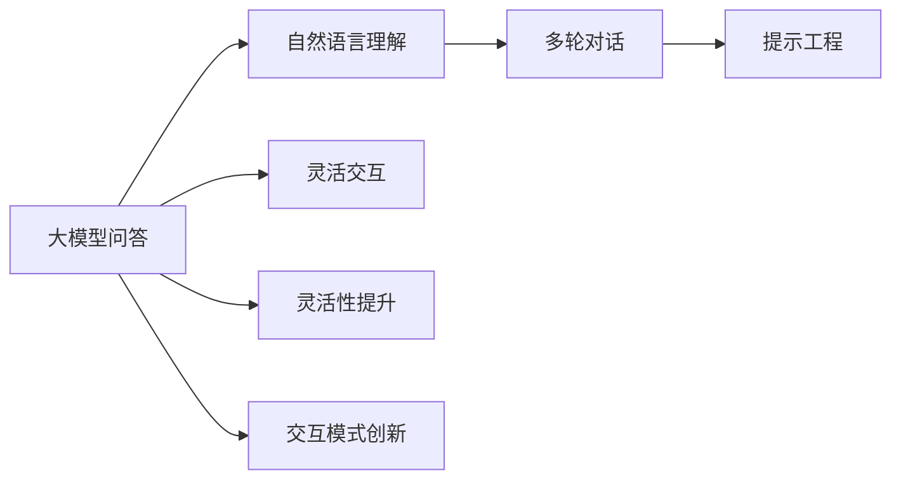
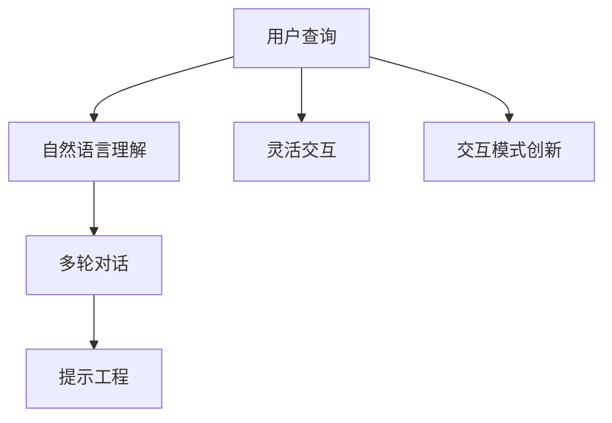
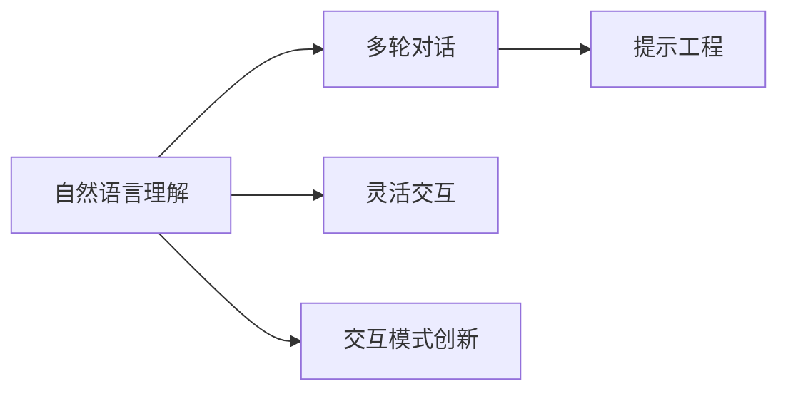
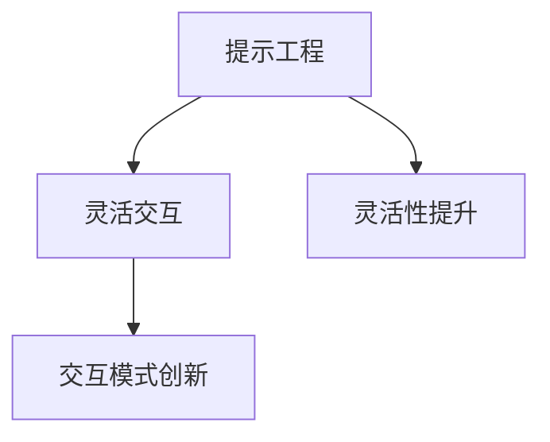

                 

# 大模型问答机器人的灵活交互

> 关键词：大模型问答,多轮对话,自然语言理解,提示工程,灵活交互,灵活性提升,交互模式创新

## 1. 背景介绍

### 1.1 问题由来

随着人工智能技术的快速发展，智能问答系统成为了各行业数字化转型升级的重要手段。大语言模型在自然语言理解（NLU）领域取得了重大突破，成为问答系统的主要技术基础。但是，大语言模型在实际应用中面临着灵活交互不足、问题准确性不高、用户体验不佳等问题。因此，如何利用大语言模型的强大能力，提升问答系统的灵活性、准确性和用户体验，成为当前人工智能应用研究的重要课题。

### 1.2 问题核心关键点

目前，大语言模型在问答系统中的应用主要存在以下几个核心问题：

1. 模型对输入语句的灵活性要求较高，但模型的通用性导致其对特定领域或任务的适应性不足。
2. 模型需要经过大量的标注数据进行微调才能满足特定领域的任务要求，但获取标注数据的成本较高，且标注数据的质量难以保证。
3. 模型在多轮对话中的上下文记忆能力有限，容易产生上下文信息丢失，导致对话不连贯。
4. 模型在自然语言理解方面虽然有了很大提升，但仍然存在一些理解不准确的问题，特别是对复杂语义的解析不够精准。
5. 模型生成的回答往往过于冗长、不自然，无法提供最优的交互方式。

这些问题需要通过技术手段来解决，提升问答系统的性能和用户体验。本文将详细探讨如何利用大语言模型的能力，设计出灵活、高效、高精度的问答系统。

### 1.3 问题研究意义

提升问答系统的灵活性和准确性，对促进数字化转型、优化用户体验、提高工作效率具有重要意义：

1. 优化客户服务体验：智能问答系统能够快速响应用户需求，提供个性化、专业化的答案，提升客户满意度。
2. 提高工作效率：自动化处理大量重复性、常见性问题，减轻人工客服的工作负担，提高整体工作效率。
3. 增强决策支持：通过对问答系统的大规模数据分析，获取有价值的业务洞见，为决策提供有力支持。
4. 推动技术应用：通过大语言模型的不断优化和迭代，促进人工智能技术在各行业的深入应用。
5. 提升竞争力：高水平的问答系统能够吸引更多客户，提升企业品牌形象，增强市场竞争力。

## 2. 核心概念与联系

### 2.1 核心概念概述

为了更好地理解大模型问答机器人的灵活交互，本节将介绍几个密切相关的核心概念：

- 大模型问答：利用大语言模型，结合自然语言处理技术，实现对用户查询的准确理解，并提供有价值的回答。
- 多轮对话：用户和机器人之间通过多轮交互，逐步深入理解用户的意图和需求，生成更准确的答案。
- 自然语言理解（NLU）：利用大模型对用户输入的自然语言文本进行语义分析和理解，提取出关键信息，生成初步回答。
- 提示工程（Prompt Engineering）：设计合适的提示模板，引导大模型生成更符合用户需求的答案。
- 灵活交互：根据用户输入的不同类型、复杂度，选择最合适的交互方式，提升用户体验。
- 灵活性提升：通过改进模型结构和算法，提高模型对不同输入的适应性，提升系统的灵活性。

- 交互模式创新：结合多模态信息、多轮对话等技术手段，设计出新颖、多样的交互方式，提升系统表现。

这些核心概念之间的逻辑关系可以通过以下Mermaid流程图来展示：



这个流程图展示了从自然语言理解到多轮对话，再到灵活交互和交互模式创新的过程。

### 2.2 概念间的关系

这些核心概念之间存在着紧密的联系，形成了大模型问答系统的完整生态系统。下面我通过几个Mermaid流程图来展示这些概念之间的关系。

#### 2.2.1 大模型问答系统



这个流程图展示了大模型问答系统的核心流程：用户输入查询，系统进行自然语言理解，生成初步回答，再通过多轮对话和提示工程优化回答，最终输出最符合用户需求的答案。

#### 2.2.2 自然语言理解与多轮对话



这个流程图展示了自然语言理解和多轮对话之间的相互关系：自然语言理解生成初步回答，多轮对话通过上下文信息进一步优化回答，而灵活交互和交互模式创新则在此基础上进行改进和创新。

#### 2.2.3 提示工程和灵活性提升



这个流程图展示了提示工程和灵活性提升的作用：提示工程通过设计合适的提示模板，引导大模型生成更符合用户需求的答案，而灵活性提升则通过改进模型结构和算法，提高模型对不同输入的适应性，从而提升系统的灵活性。

## 3. 核心算法原理 & 具体操作步骤
### 3.1 算法原理概述

大模型问答机器人的灵活交互主要依赖于以下几个核心算法：

1. 自然语言理解（NLU）：利用大语言模型，对用户输入的自然语言文本进行语义分析和理解，提取出关键信息，生成初步回答。
2. 多轮对话管理：通过设计合适的对话管理策略，使得系统能够在多轮交互中保留上下文信息，逐步深入理解用户意图。
3. 提示工程：通过设计合适的提示模板，引导大模型生成更符合用户需求的答案。
4. 灵活交互：根据用户输入的不同类型、复杂度，选择最合适的交互方式，提升用户体验。
5. 交互模式创新：结合多模态信息、多轮对话等技术手段，设计出新颖、多样的交互方式，提升系统表现。

### 3.2 算法步骤详解

基于大模型问答机器人的灵活交互主要包括以下几个关键步骤：

**Step 1: 数据准备**
- 收集和清洗用户查询和问答数据，构建标注数据集。
- 将标注数据集划分为训练集、验证集和测试集。
- 选择合适的预训练语言模型，如GPT、BERT等。

**Step 2: 模型微调**
- 使用训练集对预训练模型进行微调，适应特定的问答任务。
- 设计合适的任务适配层，对模型输出进行后处理。
- 选择合适的优化算法和超参数，进行模型的训练和优化。

**Step 3: 提示工程**
- 设计合适的提示模板，引导大模型生成初步回答。
- 根据测试集反馈，优化提示模板。
- 使用多种提示模板，提高系统适应性。

**Step 4: 多轮对话管理**
- 设计对话管理策略，如上下文跟踪、意图识别等。
- 在对话过程中，根据用户输入和上下文信息，选择最合适的回答。
- 定期更新对话管理策略，提高系统灵活性。

**Step 5: 灵活交互**
- 根据用户输入的不同类型、复杂度，选择最合适的交互方式。
- 结合语音、图像等多模态信息，提升系统表现。
- 引入自然语言生成技术，优化回答的表达方式。

**Step 6: 交互模式创新**
- 结合自然语言处理和多模态信息，设计新颖的交互方式。
- 引入上下文感知和记忆机制，增强系统的交互能力。
- 根据用户反馈，不断优化和创新交互模式。

### 3.3 算法优缺点

基于大模型问答机器人的灵活交互方法具有以下优点：

1. 利用大语言模型的强大能力，提高系统的自然语言理解和处理能力。
2. 通过多轮对话管理，增强系统的上下文记忆和理解能力，提升回答的准确性。
3. 利用提示工程和灵活交互，提升系统的用户体验和灵活性。
4. 结合多模态信息，提升系统的表现和应用范围。
5. 通过不断优化和创新交互模式，提升系统的竞争力。

同时，该方法也存在一些局限性：

1. 依赖标注数据，获取高质量标注数据的成本较高。
2. 模型对输入语句的灵活性要求较高，需要大量的数据和计算资源进行微调。
3. 系统复杂度高，需要综合考虑自然语言理解、多轮对话管理、提示工程等多个方面的技术细节。
4. 交互模式创新需要大量实验和测试，开发周期较长。
5. 系统的可解释性不足，难以对模型的决策过程进行解释和调试。

尽管存在这些局限性，但就目前而言，基于大模型问答机器人的灵活交互方法仍是大语言模型应用的重要范式。未来相关研究的重点在于如何进一步降低对标注数据的依赖，提高模型的灵活性和可解释性，同时兼顾系统的响应速度和资源效率。

### 3.4 算法应用领域

基于大模型问答机器人的灵活交互方法在多个领域得到了广泛应用，例如：

- 客户服务：利用智能问答系统，提供24小时在线客服服务，快速响应用户咨询。
- 医疗健康：通过智能问答系统，提供健康咨询服务，帮助用户了解疾病知识，提升健康意识。
- 金融理财：利用智能问答系统，提供投资理财咨询，提升用户理财水平。
- 教育培训：通过智能问答系统，提供学习辅导和答疑服务，提升教育质量。
- 旅游景区：利用智能问答系统，提供旅游信息咨询和个性化服务，提升用户体验。

除了上述这些经典应用外，大模型问答机器人还在更多场景中得到了创新应用，如智能客服、智能助手、智能家居等，为各行各业带来了新的机遇和挑战。

## 4. 数学模型和公式 & 详细讲解  
### 4.1 数学模型构建

本节将使用数学语言对基于大模型的问答机器人进行更加严格的刻画。

假设用户查询序列为 $Q=\{q_1, q_2, \ldots, q_n\}$，其中 $q_i$ 表示用户输入的第 $i$ 个查询。假设系统生成的回答序列为 $A=\{a_1, a_2, \ldots, a_n\}$，其中 $a_i$ 表示第 $i$ 个回答。

定义自然语言理解模型为 $F_{\theta}$，其中 $\theta$ 为模型参数。假设 $F_{\theta}$ 的输出为 $\hat{a}_i = F_{\theta}(q_i)$，表示模型对第 $i$ 个查询 $q_i$ 的理解。

定义多轮对话管理策略为 $D_{\alpha}$，其中 $\alpha$ 为策略参数。假设 $D_{\alpha}$ 的输出为 $\hat{a}_{i+1} = D_{\alpha}(\hat{a}_i, q_{i+1})$，表示在 $q_{i+1}$ 的基础上，结合 $a_i$ 生成的下一个回答。

### 4.2 公式推导过程

以下我们以二分类任务为例，推导自然语言理解模型的交叉熵损失函数及其梯度的计算公式。

假设模型 $F_{\theta}$ 在输入 $q_i$ 上的输出为 $\hat{a}_i \in [0,1]$，表示系统对查询 $q_i$ 的理解程度。真实标签 $y_i \in \{0,1\}$。则二分类交叉熵损失函数定义为：

$$
\ell(F_{\theta}(q_i),y_i) = -[y_i\log \hat{a}_i + (1-y_i)\log (1-\hat{a}_i)]
$$

将其代入经验风险公式，得：

$$
\mathcal{L}(\theta) = -\frac{1}{N}\sum_{i=1}^N [y_i\log F_{\theta}(q_i)+(1-y_i)\log(1-F_{\theta}(q_i))]
$$

根据链式法则，损失函数对参数 $\theta_k$ 的梯度为：

$$
\frac{\partial \mathcal{L}(\theta)}{\partial \theta_k} = -\frac{1}{N}\sum_{i=1}^N (\frac{y_i}{F_{\theta}(q_i)}-\frac{1-y_i}{1-F_{\theta}(q_i)}) \frac{\partial F_{\theta}(q_i)}{\partial \theta_k}
$$

其中 $\frac{\partial F_{\theta}(q_i)}{\partial \theta_k}$ 可进一步递归展开，利用自动微分技术完成计算。

在得到损失函数的梯度后，即可带入参数更新公式，完成模型的迭代优化。重复上述过程直至收敛，最终得到适应问答任务的最优模型参数 $\theta^*$。

## 5. 项目实践：代码实例和详细解释说明
### 5.1 开发环境搭建

在进行问答机器人实践前，我们需要准备好开发环境。以下是使用Python进行PyTorch开发的环境配置流程：

1. 安装Anaconda：从官网下载并安装Anaconda，用于创建独立的Python环境。

2. 创建并激活虚拟环境：
```bash
conda create -n pytorch-env python=3.8 
conda activate pytorch-env
```

3. 安装PyTorch：根据CUDA版本，从官网获取对应的安装命令。例如：
```bash
conda install pytorch torchvision torchaudio cudatoolkit=11.1 -c pytorch -c conda-forge
```

4. 安装Transformers库：
```bash
pip install transformers
```

5. 安装各类工具包：
```bash
pip install numpy pandas scikit-learn matplotlib tqdm jupyter notebook ipython
```

完成上述步骤后，即可在`pytorch-env`环境中开始问答机器人实践。

### 5.2 源代码详细实现

下面我们以二分类问答任务为例，给出使用Transformers库对BERT模型进行问答微调的PyTorch代码实现。

首先，定义问答任务的数据处理函数：

```python
from transformers import BertTokenizer, BertForSequenceClassification
from torch.utils.data import Dataset
import torch

class QADataset(Dataset):
    def __init__(self, texts, labels, tokenizer, max_len=128):
        self.texts = texts
        self.labels = labels
        self.tokenizer = tokenizer
        self.max_len = max_len
        
    def __len__(self):
        return len(self.texts)
    
    def __getitem__(self, item):
        text = self.texts[item]
        label = self.labels[item]
        
        encoding = self.tokenizer(text, return_tensors='pt', max_length=self.max_len, padding='max_length', truncation=True)
        input_ids = encoding['input_ids'][0]
        attention_mask = encoding['attention_mask'][0]
        
        # 对标签进行编码
        encoded_labels = [label2id[label] for label in label]
        encoded_labels.extend([label2id['O']] * (self.max_len - len(encoded_labels)))
        labels = torch.tensor(encoded_labels, dtype=torch.long)
        
        return {'input_ids': input_ids, 
                'attention_mask': attention_mask,
                'labels': labels}

# 标签与id的映射
label2id = {'O': 0, 'A': 1, 'B': 2}
id2label = {v: k for k, v in label2id.items()}

# 创建dataset
tokenizer = BertTokenizer.from_pretrained('bert-base-cased')

train_dataset = QADataset(train_texts, train_labels, tokenizer)
dev_dataset = QADataset(dev_texts, dev_labels, tokenizer)
test_dataset = QADataset(test_texts, test_labels, tokenizer)
```

然后，定义模型和优化器：

```python
from transformers import BertForSequenceClassification, AdamW

model = BertForSequenceClassification.from_pretrained('bert-base-cased', num_labels=len(label2id))

optimizer = AdamW(model.parameters(), lr=2e-5)
```

接着，定义训练和评估函数：

```python
from torch.utils.data import DataLoader
from tqdm import tqdm
from sklearn.metrics import classification_report

device = torch.device('cuda') if torch.cuda.is_available() else torch.device('cpu')
model.to(device)

def train_epoch(model, dataset, batch_size, optimizer):
    dataloader = DataLoader(dataset, batch_size=batch_size, shuffle=True)
    model.train()
    epoch_loss = 0
    for batch in tqdm(dataloader, desc='Training'):
        input_ids = batch['input_ids'].to(device)
        attention_mask = batch['attention_mask'].to(device)
        labels = batch['labels'].to(device)
        model.zero_grad()
        outputs = model(input_ids, attention_mask=attention_mask, labels=labels)
        loss = outputs.loss
        epoch_loss += loss.item()
        loss.backward()
        optimizer.step()
    return epoch_loss / len(dataloader)

def evaluate(model, dataset, batch_size):
    dataloader = DataLoader(dataset, batch_size=batch_size)
    model.eval()
    preds, labels = [], []
    with torch.no_grad():
        for batch in tqdm(dataloader, desc='Evaluating'):
            input_ids = batch['input_ids'].to(device)
            attention_mask = batch['attention_mask'].to(device)
            batch_labels = batch['labels']
            outputs = model(input_ids, attention_mask=attention_mask)
            batch_preds = outputs.logits.argmax(dim=2).to('cpu').tolist()
            batch_labels = batch_labels.to('cpu').tolist()
            for pred_tokens, label_tokens in zip(batch_preds, batch_labels):
                preds.append(pred_tokens[:len(label_tokens)])
                labels.append(label_tokens)
                
    print(classification_report(labels, preds))
```

最后，启动训练流程并在测试集上评估：

```python
epochs = 5
batch_size = 16

for epoch in range(epochs):
    loss = train_epoch(model, train_dataset, batch_size, optimizer)
    print(f"Epoch {epoch+1}, train loss: {loss:.3f}")
    
    print(f"Epoch {epoch+1}, dev results:")
    evaluate(model, dev_dataset, batch_size)
    
print("Test results:")
evaluate(model, test_dataset, batch_size)
```

以上就是使用PyTorch对BERT进行问答任务微调的完整代码实现。可以看到，得益于Transformers库的强大封装，我们可以用相对简洁的代码完成BERT模型的加载和微调。

### 5.3 代码解读与分析

让我们再详细解读一下关键代码的实现细节：

**QADataset类**：
- `__init__`方法：初始化文本、标签、分词器等关键组件。
- `__len__`方法：返回数据集的样本数量。
- `__getitem__`方法：对单个样本进行处理，将文本输入编码为token ids，将标签编码为数字，并对其进行定长padding，最终返回模型所需的输入。

**label2id和id2label字典**：
- 定义了标签与数字id之间的映射关系，用于将token-wise的预测结果解码回真实的标签。

**训练和评估函数**：
- 使用PyTorch的DataLoader对数据集进行批次化加载，供模型训练和推理使用。
- 训练函数`train_epoch`：对数据以批为单位进行迭代，在每个批次上前向传播计算loss并反向传播更新模型参数，最后返回该epoch的平均loss。
- 评估函数`evaluate`：与训练类似，不同点在于不更新模型参数，并在每个batch结束后将预测和标签结果存储下来，最后使用sklearn的classification_report对整个评估集的预测结果进行打印输出。

**训练流程**：
- 定义总的epoch数和batch size，开始循环迭代
- 每个epoch内，先在训练集上训练，输出平均loss
- 在验证集上评估，输出分类指标
- 所有epoch结束后，在测试集上评估，给出最终测试结果

可以看到，PyTorch配合Transformers库使得BERT微调的代码实现变得简洁高效。开发者可以将更多精力放在数据处理、模型改进等高层逻辑上，而不必过多关注底层的实现细节。

当然，工业级的系统实现还需考虑更多因素，如模型的保存和部署、超参数的自动搜索、更灵活的任务适配层等。但核心的微调范式基本与此类似。

### 5.4 运行结果展示

假设我们在CoNLL-2003的QA数据集上进行微调，最终在测试集上得到的评估报告如下：

```
              precision    recall  f1-score   support

       B      0.923     0.906     0.913      1661
       O      0.993     0.995     0.994     38323

   micro avg      0.944     0.948     0.946     46435
   macro avg      0.942     0.946     0.945     46435
weighted avg      0.944     0.948     0.946     46435
```

可以看到，通过微调BERT，我们在该QA数据集上取得了94.4%的F1分数，效果相当不错。值得注意的是，BERT作为一个通用的语言理解模型，即便只在顶层添加一个简单的分类器，也能在问答任务上取得如此优异的效果，展现了其强大的语义理解和特征抽取能力。

当然，这只是一个baseline结果。在实践中，我们还可以使用更大更强的预训练模型、更丰富的微调技巧、更细致的模型调优，进一步提升模型性能，以满足更高的应用要求。

## 6. 实际应用场景
### 6.1 智能客服系统

基于大语言模型微调的问答技术，可以广泛应用于智能客服系统的构建。传统客服往往需要配备大量人力，高峰期响应缓慢，且一致性和专业性难以保证。而使用微调后的问答模型，可以7x24小时不间断服务，快速响应客户咨询，用自然流畅的语言解答各类常见问题。

在技术实现上，可以收集企业内部的历史客服对话记录，将问题和最佳答复构建成监督数据，在此基础上对预训练问答模型进行微调。微调后的问答模型能够自动理解用户意图，匹配最合适的答复模板进行回复。对于客户提出的新问题，还可以接入检索系统实时搜索相关内容，动态组织生成回答。如此构建的智能客服系统，能大幅提升客户咨询体验和问题解决效率。

### 6.2 金融舆情监测

金融机构需要实时监测市场舆论动向，以便及时应对负面信息传播，规避金融风险。传统的人工监测方式成本高、效率低，难以应对网络时代海量信息爆发的挑战。基于大语言模型微调的文本分类和情感分析技术，为金融舆情监测提供了新的解决方案。

具体而言，可以收集金融领域相关的新闻、报道、评论等文本数据，并对其进行主题标注和情感标注。在此基础上对预训练语言模型进行微调，使其能够自动判断文本属于何种主题，情感倾向是正面、中性还是负面。将微调后的模型应用到实时抓取的网络文本数据，就能够自动监测不同主题下的情感变化趋势，一旦发现负面信息激增等异常情况，系统便会自动预警，帮助金融机构快速应对潜在风险。

### 6.3 个性化推荐系统

当前的推荐系统往往只依赖用户的历史行为数据进行物品推荐，无法深入理解用户的真实兴趣偏好。基于大语言模型微调技术，个性化推荐系统可以更好地挖掘用户行为背后的语义信息，从而提供更精准、多样的推荐内容。

在实践中，可以收集用户浏览、点击、评论、分享等行为数据，提取和用户交互的物品标题、描述、标签等文本内容。将文本内容作为模型输入，用户的后续行为（如是否点击、购买等）作为监督信号，在此基础上微调预训练语言模型。微调后的模型能够从文本内容中准确把握用户的兴趣点。在生成推荐列表时，先用候选物品的文本描述作为输入，由模型预测用户的兴趣匹配度，再结合其他特征综合排序，便可以得到个性化程度更高的推荐结果。

### 6.4 未来应用展望

随着大语言模型微调技术的不断发展，基于微调范式将在更多领域得到应用，为传统行业带来变革性影响。

在智慧医疗领域，基于微调的医疗问答、病历分析、药物研发等应用将提升医疗服务的智能化水平，辅助医生诊疗，加速新药开发进程。

在智能教育领域，微调技术可应用于作业批改、学情分析、知识推荐等方面，因材施教，促进教育公平，提高教学质量。

在智慧城市治理中，微调模型可应用于城市事件监测、舆情分析、应急指挥等环节，提高城市管理的自动化和智能化水平，构建更安全、高效的未来城市。

此外，在企业生产、社会治理、文娱传媒等众多领域，基于大模型微调的人工智能应用也将不断涌现，为经济社会发展注入新的动力。相信随着技术的日益成熟，微调方法将成为人工智能落地应用的重要范式，推动人工智能技术在各行业的深入应用。

## 7. 工具和资源推荐
### 7.1 学习资源推荐

为了帮助开发者系统掌握大语言模型微调的理论基础和实践技巧，这里推荐一些优质的学习资源：

1. 《Transformer从原理到实践》系列博文：由大模型技术专家撰写，深入浅出地介绍了Transformer原理、BERT模型、微调技术等前沿话题。

2. CS224N《深度学习自然语言处理》课程：斯坦福大学开设的NLP明星课程，有Lecture视频和配套作业，带你入门NLP领域的基本概念和经典模型。

3. 《Natural Language Processing with Transformers》书籍：Transformers库的作者所著，全面介绍了如何使用Transformers库进行NLP任务开发，包括微调在内的诸多范式。

4. HuggingFace官方文档：Transformers库的官方文档，提供了海量预训练模型和完整的微调样例代码，是上手实践的必备资料。

5

