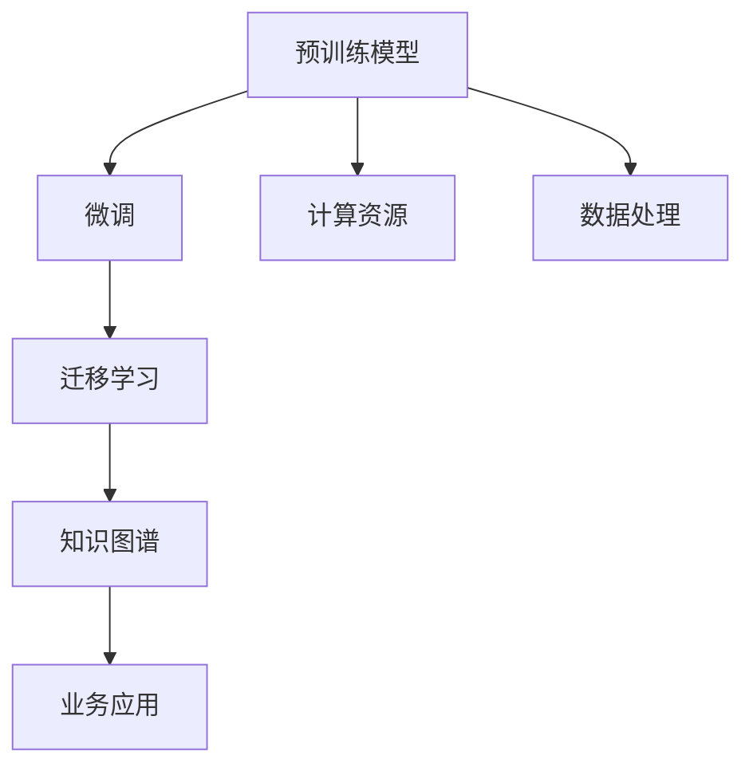

                 

# 大模型：未来商业的智能化转型

> 关键词：大模型,人工智能,商业智能,未来趋势,商业应用,技术突破

## 1. 背景介绍

### 1.1 问题由来
在信息化时代，数据成为企业的核心资产。然而，庞大的数据集需要高效、准确、实时的处理手段，传统的人工处理方式已经无法满足需求。大模型（Big Model）技术的兴起，为商业智能化转型提供了新的机遇和挑战。

大模型是指基于深度学习的高参数量模型，例如Google的BERT、OpenAI的GPT系列等，它们在各种自然语言处理任务上取得了突破性的进展。这些模型通过在海量数据上进行预训练，学习到丰富的知识表示，能够处理复杂的自然语言任务，如文本分类、问答、生成、翻译等。

### 1.2 问题核心关键点
大模型在商业智能化转型中具有以下关键点：

- **数据处理能力**：大模型可以处理海量数据，并从中提取有价值的信息，为商业决策提供依据。
- **智能决策支持**：通过自然语言理解和生成能力，大模型能够辅助企业进行业务决策，提高决策效率和准确性。
- **多领域应用**：大模型可以在金融、医疗、教育、零售等多个领域进行应用，提升各行业的智能化水平。
- **知识图谱构建**：大模型可以构建知识图谱，帮助企业快速获取和利用领域知识，实现知识驱动的智能化。
- **动态学习能力**：大模型能够持续学习新知识，适应数据分布的变化，保持模型的时效性。

这些关键点使得大模型成为未来商业智能化转型的重要工具。然而，大模型的训练和部署需要巨大的计算资源，数据隐私和安全问题也亟待解决。因此，如何将大模型技术高效、安全地应用于商业场景，成为了当前研究的热点。

### 1.3 问题研究意义
大模型在商业智能化转型中的研究具有重要意义：

1. **提升决策效率**：大模型能够快速处理海量数据，辅助企业做出高效、准确的决策，提升企业竞争力。
2. **优化客户体验**：大模型可以用于个性化推荐、智能客服等应用，提升客户体验，增加客户粘性。
3. **促进业务创新**：大模型可以应用于新业务模式的探索和创新，为企业带来新的增长点。
4. **驱动知识共享**：大模型可以构建知识图谱，促进企业内部的知识共享和协作，提升企业整体的创新能力。
5. **应对市场变化**：大模型能够持续学习新知识，适应市场变化，帮助企业快速响应外部环境变化。

## 2. 核心概念与联系

### 2.1 核心概念概述

大模型在商业智能化转型中的应用涉及多个核心概念，包括：

- **预训练模型**：在大规模无标签数据上进行的深度学习模型训练，学习到通用的语言表示。
- **微调（Fine-Tuning）**：在预训练模型的基础上，使用特定任务的数据进行有监督学习，调整模型以适应特定任务。
- **迁移学习**：将预训练模型在不同任务之间进行知识迁移，减少在新任务上的训练时间和资源。
- **知识图谱**：通过大模型构建的知识库，将结构化和非结构化数据整合，提供领域知识支持。
- **计算资源**：大模型的训练和部署需要高性能计算资源，如GPU、TPU等。

### 2.2 概念间的关系

大模型的核心概念之间存在密切联系，形成了商业智能化转型的完整生态系统。以下是一个Mermaid流程图，展示了大模型在商业智能化转型中的主要概念关系：



这个流程图展示了从预训练模型到微调、迁移学习、知识图谱构建，再到业务应用的过程。预训练模型通过数据处理和学习通用语言表示，然后通过微调和迁移学习，适应特定业务需求。知识图谱构建帮助企业获取领域知识，业务应用将模型部署到实际场景，实现智能化决策和客户体验提升。

### 2.3 核心概念的整体架构

大模型的整体架构可以分为以下五个部分：

1. **数据预处理**：从原始数据中提取特征，进行清洗、标准化等预处理操作。
2. **预训练模型训练**：在大量无标签数据上训练预训练模型，学习通用的语言表示。
3. **模型微调和迁移学习**：根据具体业务需求，对预训练模型进行微调，进行迁移学习，适应新任务。
4. **知识图谱构建**：通过大模型构建领域知识图谱，提供结构化和非结构化数据的整合。
5. **业务应用部署**：将模型部署到实际业务场景，实现智能化决策和客户体验提升。

大模型的这些组件相互作用，形成了商业智能化转型的完整系统。

## 3. 核心算法原理 & 具体操作步骤
### 3.1 算法原理概述

大模型在商业智能化转型中的核心算法原理是基于深度学习的预训练和微调技术。以下是大模型在商业智能转型中的应用原理概述：

1. **预训练**：在大规模无标签数据上训练大模型，学习到通用的语言表示。预训练过程包括自监督学习任务，如掩码语言模型、句子排序等，这些任务能够帮助模型学习到语言的基本结构和规律。
2. **微调**：在预训练模型的基础上，使用特定任务的数据进行有监督学习，调整模型以适应特定任务。微调过程包括定义任务适配层、选择合适的优化器、设定学习率等步骤。
3. **迁移学习**：将预训练模型在不同任务之间进行知识迁移，减少在新任务上的训练时间和资源。迁移学习通过在大模型上添加新的任务层，将预训练的知识迁移到新任务中。
4. **知识图谱构建**：通过大模型构建领域知识图谱，将结构化和非结构化数据整合，提供领域知识支持。知识图谱构建包括实体识别、关系抽取等任务，这些任务能够帮助模型学习到领域内的实体和关系。

### 3.2 算法步骤详解

以下是大模型在商业智能化转型中的具体操作步骤：

1. **数据收集与处理**：收集业务相关的数据，进行清洗、标准化、标注等预处理操作，生成预训练和微调所需的数据集。
2. **模型训练与微调**：在预训练数据上训练大模型，学习通用的语言表示。然后根据具体业务需求，在标注数据上对模型进行微调，调整模型以适应特定任务。
3. **知识图谱构建**：通过大模型构建领域知识图谱，将结构化和非结构化数据整合，提供领域知识支持。知识图谱构建包括实体识别、关系抽取等任务。
4. **业务应用部署**：将模型部署到实际业务场景，实现智能化决策和客户体验提升。业务应用包括智能客服、推荐系统、风险控制等应用。

### 3.3 算法优缺点

大模型在商业智能化转型中具有以下优缺点：

**优点**：
- **高精度**：大模型在各种自然语言处理任务上取得了突破性的进展，能够处理复杂的自然语言任务，提供高精度的输出。
- **高效性**：大模型能够快速处理海量数据，提升业务决策效率。
- **普适性**：大模型可以在多个领域进行应用，提升各行业的智能化水平。

**缺点**：
- **计算资源需求高**：大模型的训练和部署需要高性能计算资源，如GPU、TPU等。
- **数据隐私和安全问题**：大模型需要大量的标注数据进行微调，可能涉及数据隐私和安全问题。
- **过拟合风险**：大模型在特定任务上的微调容易过拟合，需要采取正则化等措施。

### 3.4 算法应用领域

大模型在商业智能化转型中具有广泛的应用领域，包括但不限于：

1. **金融**：用于风险控制、投资分析、客户服务等方面，提升金融业务的智能化水平。
2. **医疗**：用于病历分析、诊断建议、个性化推荐等方面，提升医疗服务的智能化水平。
3. **零售**：用于商品推荐、销售预测、客户服务等方面，提升零售业的智能化水平。
4. **教育**：用于学习推荐、智能客服、教学辅助等方面，提升教育服务的智能化水平。
5. **制造**：用于供应链优化、质量控制、客户服务等方面，提升制造业的智能化水平。
6. **物流**：用于路线规划、货物追踪、客户服务等方面，提升物流业的智能化水平。

## 4. 数学模型和公式 & 详细讲解 & 举例说明

### 4.1 数学模型构建

大模型在商业智能化转型中的数学模型构建包括以下几个方面：

1. **预训练模型的构建**：在大量无标签数据上训练大模型，学习通用的语言表示。例如，BERT模型的构建基于掩码语言模型和下一句预测任务。
2. **微调模型的构建**：在预训练模型的基础上，根据特定任务的需求进行微调。例如，分类任务的微调模型在顶层添加一个线性分类器和交叉熵损失函数。
3. **知识图谱的构建**：通过大模型构建领域知识图谱，将结构化和非结构化数据整合，提供领域知识支持。例如，实体识别任务通过大模型学习实体的边界和类型。

### 4.2 公式推导过程

以下是大模型在商业智能化转型中的数学模型推导过程：

1. **预训练模型的损失函数**：
   $$
   \mathcal{L}_{pre-training} = -\frac{1}{N} \sum_{i=1}^N \ell_{prediction}(x_i)
   $$
   其中，$\ell_{prediction}$为下一句预测任务的损失函数，$x_i$为训练样本，$N$为样本数量。

2. **微调模型的损失函数**：
   $$
   \mathcal{L}_{fine-tuning} = -\frac{1}{N} \sum_{i=1}^N \ell_{task}(x_i, y_i)
   $$
   其中，$\ell_{task}$为特定任务的损失函数，$y_i$为标注数据。

3. **知识图谱构建的损失函数**：
   $$
   \mathcal{L}_{knowledge-graph} = -\frac{1}{N} \sum_{i=1}^N \ell_{entity}(x_i, y_i)
   $$
   其中，$\ell_{entity}$为实体识别任务的损失函数，$y_i$为标注数据。

### 4.3 案例分析与讲解

以下是大模型在商业智能化转型中的案例分析与讲解：

1. **金融领域的风险控制**：通过大模型学习金融领域的知识表示，构建领域知识图谱，实现智能化的风险控制。例如，模型可以根据客户的历史交易记录和行为数据，预测其违约风险，提供个性化的风险控制建议。
2. **医疗领域的疾病诊断**：通过大模型学习医疗领域的知识表示，构建领域知识图谱，实现智能化的疾病诊断。例如，模型可以根据患者的病历数据，预测其疾病类型，提供个性化的诊断建议。
3. **零售领域的商品推荐**：通过大模型学习零售领域的知识表示，构建领域知识图谱，实现智能化的商品推荐。例如，模型可以根据用户的浏览和购买记录，推荐其可能感兴趣的商品。

## 5. 项目实践：代码实例和详细解释说明

### 5.1 开发环境搭建

大模型在商业智能化转型中的应用需要高性能的计算资源，因此需要搭建一个高性能的计算环境。以下是开发环境搭建的详细步骤：

1. **安装PyTorch**：
   ```bash
   pip install torch torchvision torchaudio
   ```

2. **安装HuggingFace Transformers库**：
   ```bash
   pip install transformers
   ```

3. **安装FastAI**：
   ```bash
   pip install fastai
   ```

4. **安装Docker**：
   ```bash
   sudo apt-get update
   sudo apt-get install docker-ce
   ```

5. **安装GPU加速**：
   ```bash
   nvidia-docker2 install -y nvidia
   ```

### 5.2 源代码详细实现

以下是一个使用PyTorch实现的大模型微调的示例代码：

```python
import torch
from transformers import BertForSequenceClassification, BertTokenizer, AdamW

# 初始化模型和分词器
model = BertForSequenceClassification.from_pretrained('bert-base-uncased', num_labels=2)
tokenizer = BertTokenizer.from_pretrained('bert-base-uncased')

# 准备训练数据
train_data = ["sentence1", "sentence2", "sentence3"]
train_labels = [1, 0, 1]

# 定义损失函数和优化器
loss_fn = torch.nn.CrossEntropyLoss()
optimizer = AdamW(model.parameters(), lr=2e-5)

# 训练模型
for epoch in range(3):
    model.train()
    for sentence, label in zip(train_data, train_labels):
        inputs = tokenizer.encode_plus(sentence, return_tensors='pt', max_length=64, padding='max_length', truncation=True)
        outputs = model(**inputs)
        loss = loss_fn(outputs.logits, torch.tensor(label))
        optimizer.zero_grad()
        loss.backward()
        optimizer.step()

    # 评估模型
    model.eval()
    with torch.no_grad():
        for sentence, label in zip(train_data, train_labels):
            inputs = tokenizer.encode_plus(sentence, return_tensors='pt', max_length=64, padding='max_length', truncation=True)
            outputs = model(**inputs)
            predicted_label = torch.argmax(outputs.logits, dim=1)
            print(f"Predicted: {predicted_label}, Actual: {label}")
```

### 5.3 代码解读与分析

在上述代码中，我们使用BERT模型进行二分类任务的微调。首先，我们加载了预训练的BERT模型和对应的分词器。然后，我们准备了训练数据和标签，定义了损失函数和优化器。在训练过程中，我们通过PyTorch的前向传播和反向传播，更新模型的参数，并在每个epoch结束后在验证集上评估模型性能。

## 6. 实际应用场景

### 6.1 智能客服系统

智能客服系统是大模型在商业智能化转型中的重要应用场景之一。传统客服系统依赖大量人工，成本高且效率低。通过大模型微调，可以实现智能客服，提升客户咨询体验。

以下是一个智能客服系统的实现步骤：

1. **数据收集**：收集企业内部的客户咨询数据，包括问题的文本和回答。
2. **数据预处理**：清洗、标准化、标注数据，生成预训练和微调所需的数据集。
3. **模型训练**：在预训练数据上训练大模型，学习通用的语言表示。然后根据客服任务的需求进行微调，调整模型以适应客服任务。
4. **知识图谱构建**：通过大模型构建领域知识图谱，提供领域知识支持。例如，模型可以学习常见的客服问题和回答，提供个性化的客服建议。
5. **系统部署**：将模型部署到实际业务场景，实现智能化客服。例如，系统可以根据客户的问题，自动匹配回答，提供个性化的客服服务。

### 6.2 金融领域的风险控制

在金融领域，风险控制是重要的业务需求。通过大模型微调，可以实现智能化的风险控制，提升金融业务的智能化水平。

以下是一个金融风险控制系统的实现步骤：

1. **数据收集**：收集金融领域的历史交易数据，包括客户的交易记录和行为数据。
2. **数据预处理**：清洗、标准化、标注数据，生成预训练和微调所需的数据集。
3. **模型训练**：在预训练数据上训练大模型，学习通用的语言表示。然后根据风险控制任务的需求进行微调，调整模型以适应风险控制任务。
4. **知识图谱构建**：通过大模型构建领域知识图谱，提供领域知识支持。例如，模型可以学习金融领域的知识表示，提供风险控制建议。
5. **系统部署**：将模型部署到实际业务场景，实现智能化风险控制。例如，系统可以根据客户的交易记录和行为数据，预测其违约风险，提供个性化的风险控制建议。

### 6.3 零售领域的商品推荐

在零售领域，商品推荐是重要的业务需求。通过大模型微调，可以实现智能化的商品推荐，提升零售业务的智能化水平。

以下是一个零售商品推荐系统的实现步骤：

1. **数据收集**：收集零售领域的历史交易数据，包括用户的浏览和购买记录。
2. **数据预处理**：清洗、标准化、标注数据，生成预训练和微调所需的数据集。
3. **模型训练**：在预训练数据上训练大模型，学习通用的语言表示。然后根据商品推荐任务的需求进行微调，调整模型以适应商品推荐任务。
4. **知识图谱构建**：通过大模型构建领域知识图谱，提供领域知识支持。例如，模型可以学习零售领域的知识表示，提供商品推荐建议。
5. **系统部署**：将模型部署到实际业务场景，实现智能化商品推荐。例如，系统可以根据用户的浏览和购买记录，推荐其可能感兴趣的商品。

### 6.4 未来应用展望

大模型在商业智能化转型中的未来应用展望包括以下几个方面：

1. **实时智能决策**：大模型能够实时处理海量数据，提供实时智能决策支持，提升业务效率。
2. **个性化推荐**：大模型可以根据用户的行为数据，提供个性化的商品推荐、服务推荐等，提升用户体验。
3. **风险管理**：大模型可以用于风险管理，预测金融风险、欺诈风险等，提供个性化的风险控制建议。
4. **智能客服**：大模型可以实现智能客服，提升客户咨询体验，减少人工客服成本。
5. **市场分析**：大模型可以用于市场分析，预测市场趋势、客户需求等，提供业务决策支持。
6. **知识共享**：大模型可以构建知识图谱，促进企业内部的知识共享和协作，提升整体创新能力。

## 7. 工具和资源推荐

### 7.1 学习资源推荐

以下是一些学习大模型在商业智能化转型中的工具和资源推荐：

1. **DeepLearning.AI 的深度学习课程**：由Coursera和百度联合推出，涵盖深度学习基础、高级课程、实践项目，适合初学者和进阶者。
2. **Google Colab**：谷歌提供的免费Jupyter Notebook环境，支持GPU/TPU计算，适合学习大模型和深度学习。
3. **Kaggle**：数据科学竞赛平台，提供大量公开数据集和比赛，适合数据处理和模型优化。
4. **PyTorch官方文档**：PyTorch的官方文档，包含详细的使用指南和案例代码，适合实践大模型和深度学习。
5. **HuggingFace官方文档**：Transformers的官方文档，包含丰富的预训练模型和微调案例，适合实践大模型和自然语言处理。

### 7.2 开发工具推荐

以下是一些开发大模型在商业智能化转型中的工具推荐：

1. **PyTorch**：高性能深度学习框架，支持动态计算图，适合快速迭代研究。
2. **TensorFlow**：谷歌主导的深度学习框架，适合大规模工程应用。
3. **FastAI**：基于PyTorch的高级深度学习框架，提供便捷的数据处理和模型训练功能。
4. **TensorBoard**：TensorFlow配套的可视化工具，实时监测模型训练状态，适合调试模型。
5. **Weights & Biases**：实验跟踪工具，记录和可视化模型训练过程中的各项指标，适合对比和调优。

### 7.3 相关论文推荐

以下是一些大模型在商业智能化转型中的相关论文推荐：

1. **"BERT: Pre-training of Deep Bidirectional Transformers for Language Understanding"**：BERT模型的提出，标志着大规模预训练语言模型的诞生。
2. **"GPT-2: Language Models are Unsupervised Multitask Learners"**：GPT-2模型的提出，展示了语言模型在零样本学习中的强大能力。
3. **"AdaLoRA: Adaptive Low-Rank Adaptation for Parameter-Efficient Fine-Tuning"**：AdaLoRA方法的提出，提供了参数高效微调的新思路。
4. **"Language Models as Knowledge Bases"**：大模型在知识图谱构建中的应用，展示了大模型在知识驱动的智能化中的潜力。
5. **"Attention is All You Need"**：Transformer结构的提出，开创了预训练大模型的新时代。

## 8. 总结：未来发展趋势与挑战

### 8.1 研究成果总结

大模型在商业智能化转型中的研究取得了诸多成果，主要包括以下几个方面：

1. **高性能预训练模型**：Google的BERT、OpenAI的GPT系列等，在大规模自然语言处理任务上取得了突破性的进展。
2. **高效的微调方法**：Parameter-Efficient Fine-Tuning（PEFT）等方法，在大规模预训练模型上进行微调，提高了微调效率。
3. **知识图谱构建**：通过大模型构建领域知识图谱，提供领域知识支持，提升了业务决策的智能化水平。
4. **商业应用落地**：大模型在智能客服、金融风险控制、零售推荐等领域实现了商业应用落地，展示了其广阔的商业前景。

### 8.2 未来发展趋势

大模型在商业智能化转型中的未来发展趋势包括以下几个方面：

1. **计算资源优化**：随着计算资源的优化和云计算技术的发展，大模型的训练和部署将更加高效。
2. **参数高效微调**：未来的微调方法将更加注重参数的效率，如AdaLoRA、Prefix-Tuning等，在固定大部分预训练参数的情况下，只更新极少量的任务相关参数。
3. **多模态融合**：大模型将与视觉、语音等多模态数据进行融合，实现跨模态的智能化应用。
4. **领域知识增强**：大模型将结合领域知识，提升其在特定领域的智能化水平。
5. **动态学习机制**：大模型将具备动态学习机制，能够持续学习新知识，保持模型的时效性。
6. **可解释性和安全性**：大模型将具备可解释性和安全性，确保其输出的透明性和合规性。

### 8.3 面临的挑战

大模型在商业智能化转型中面临诸多挑战，主要包括：

1. **计算资源瓶颈**：大模型的训练和部署需要高性能计算资源，如GPU、TPU等。
2. **数据隐私和安全问题**：大模型需要大量的标注数据进行微调，可能涉及数据隐私和安全问题。
3. **模型过拟合问题**：大模型在特定任务上的微调容易过拟合，需要采取正则化等措施。
4. **知识图谱构建复杂**：大模型在知识图谱构建中面临复杂性和数据量的挑战。
5. **模型可解释性不足**：大模型的输出缺乏可解释性，难以解释其内部工作机制和决策逻辑。
6. **伦理道德问题**：大模型可能学习到有偏见、有害的信息，需要关注伦理道德问题。

### 8.4 研究展望

面对大模型在商业智能化转型中面临的挑战，未来的研究需要在以下几个方面寻求新的突破：

1. **优化计算资源**：开发更高效的计算框架和算法，优化大模型的训练和部署过程。
2. **降低数据需求**：探索无监督和半监督学习的方法，降低大模型对标注数据的依赖。
3. **提高模型泛化能力**：研究多模态融合和大模型知识增强技术，提高模型的泛化能力。
4. **增强模型可解释性**：开发可解释性技术，如因果分析、模型蒸馏等，增强大模型的可解释性。
5. **加强伦理道德约束**：引入伦理导向的评估指标，确保大模型的输出符合人类价值观和伦理道德。

总之，大模型在商业智能化转型中具有广阔的发展前景，但也需要不断突破技术瓶颈，解决挑战，才能实现其在各个领域的广泛应用。

## 9. 附录：常见问题与解答

### Q1: 大模型在商业智能化转型中的主要应用场景是什么？

A: 大模型在商业智能化转型中的主要应用场景包括智能客服、金融风险控制、零售商品推荐、市场分析、知识图谱构建等。通过大模型的微调和迁移学习，可以提升这些业务的智能化水平，提供高效、精准的决策支持。

### Q2: 如何选择合适的学习率和优化器？

A: 选择合适的学习率和优化器需要根据具体任务和数据集进行调整。一般来说，学习率可以从0.0001开始，逐步减小，优化器可以使用AdamW、SGD等。在训练过程中，需要根据验证集上的性能进行调整。

### Q3: 如何避免大模型的过拟合问题？

A: 避免大模型的过拟合问题可以通过以下方法：使用正则化技术、dropout、early stopping等，限制模型的复杂度。另外，可以通过数据增强、对抗训练等方法，提高模型的泛化能力。

### Q4: 如何构建领域知识图谱？

A: 构建领域知识图谱需要收集领域内的结构化数据和非结构化数据，通过大模型学习实体的边界和类型，抽取实体之间的关系，生成知识图谱。例如，可以使用NER、关系抽取等技术，学习实体的边界和类型，构建领域知识图谱。

### Q5: 大模型在商业智能化转型中的未来发展趋势是什么？

A: 大模型在商业智能化转型中的未来发展趋势包括计算资源优化、参数高效微调、多模态融合、领域知识增强、动态学习机制、可解释性和安全性等。未来，大模型将在更多领域实现商业应用，提升企业的智能化水平。

总之，大模型在商业智能化转型中具有广阔的发展前景，但也需要不断突破技术瓶颈，解决挑战，才能实现其在各个领域的广泛应用。

