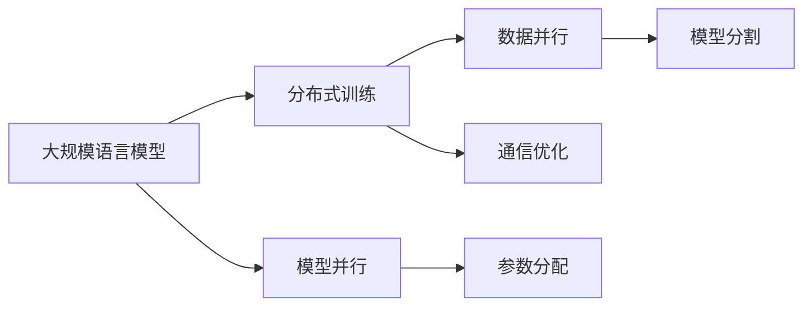

                 

## 1. 背景介绍

近年来，大规模语言模型（Large Language Models, LLMs）在自然语言处理（NLP）领域取得了突破性的进展。这些模型通过在海量文本数据上进行预训练，可以学习到丰富的语言知识和常识，并在下游任务上表现出色。然而，由于模型参数量庞大，训练和推理过程需要消耗巨大的计算资源。分布式训练（Distributed Training）技术能够通过并行计算，显著提升训练效率，加速大规模语言模型的训练和优化。本文将从理论到实践，全面探讨分布式训练在大规模语言模型中的应用，为感兴趣的读者提供深入的见解。

## 2. 核心概念与联系

### 2.1 核心概念概述

分布式训练是指将大规模模型的训练过程分布在多台计算机上进行，每台计算机负责处理一部分数据，并通过高效的通信机制协同工作，最终完成整个模型的训练。这一技术在大规模语言模型的训练中尤为关键，能够极大地加速模型参数的学习过程。

### 2.2 核心概念间的关系

分布式训练技术和大规模语言模型紧密相关，其核心在于并行计算和高效的通信机制。以下是几个核心概念之间的关系，通过一个Mermaid流程图来展示：



- **大规模语言模型**：是分布式训练的目标对象，通常具有大规模的参数量和复杂的结构。
- **分布式训练**：通过并行计算，加速大规模语言模型的训练过程。
- **模型并行**：将大规模语言模型的不同层分布在不同的计算节点上，减少单节点资源负担。
- **数据并行**：将大规模语言模型训练的数据分布在不同的计算节点上，实现并行计算。
- **参数分配**：在分布式训练中，每个节点的参数需要进行合理的分配和更新。
- **通信优化**：分布式训练中，节点之间的通信开销是瓶颈，需要通过高效的通信协议来减少通信时间。

## 3. 核心算法原理 & 具体操作步骤

### 3.1 算法原理概述

分布式训练的核心算法包括数据并行、模型并行、参数分配和通信优化。这些技术使得大规模语言模型可以在分布式环境下高效地进行训练。

#### 3.1.1 数据并行

数据并行是指将大规模数据集分布在不同的计算节点上，每个节点负责处理一部分数据。这样做可以充分利用多台计算机的计算能力，加速训练过程。数据并行的好处是减少了单节点计算量，但需要保证各节点数据的一致性和同步更新。

#### 3.1.2 模型并行

模型并行是指将大规模语言模型的不同层分布在不同的计算节点上，每个节点负责一部分层。这样可以进一步减少单节点资源负担，提高训练效率。模型并行的关键在于如何分配和更新参数，避免不同节点间的通信开销。

#### 3.1.3 参数分配

在分布式训练中，每个节点的参数需要进行合理的分配和更新。常见的参数分配策略包括模型分割和全量复制。模型分割是指将大规模语言模型按照层进行分割，每个节点负责一部分层；全量复制是指将整个大规模语言模型的参数复制到所有节点上。参数分配需要考虑通信开销和资源利用率。

#### 3.1.4 通信优化

分布式训练中，节点之间的通信开销是瓶颈，需要通过高效的通信协议来减少通信时间。常见的通信优化策略包括参数服务器（Parameter Server）、环形通信（Ring Communication）和自定义通信协议。参数服务器将计算节点和参数存储节点分离，减少节点间的通信开销；环形通信通过循环发送数据，减少网络带宽消耗；自定义通信协议则根据实际需求设计高效的通信方式。

### 3.2 算法步骤详解

分布式训练的步骤包括数据并行、模型并行、参数分配和通信优化。以下是详细步骤：

#### 3.2.1 数据并行

1. **数据分割**：将大规模数据集按照一定的规则（如按批次、按样本）分割成多个小数据集。
2. **数据分块**：将每个小数据集分配到不同的计算节点上。
3. **数据并行计算**：每个节点对分配到的数据进行并行计算。

#### 3.2.2 模型并行

1. **模型分割**：将大规模语言模型的不同层（如自注意力层、前馈层）分割成多个子模型。
2. **节点分配**：将每个子模型分配到不同的计算节点上。
3. **并行计算**：每个节点对分配到的子模型进行并行计算。

#### 3.2.3 参数分配

1. **参数分割**：将大规模语言模型的参数按照一定的规则（如按层、按参数块）分割成多个小参数块。
2. **节点分配**：将每个小参数块分配到不同的计算节点上。
3. **参数更新**：每个节点根据分配到的参数块进行更新，并使用异步通信机制（如Ring Communication）进行参数同步。

#### 3.2.4 通信优化

1. **选择合适的通信协议**：根据数据大小和网络带宽选择参数服务器、环形通信或自定义通信协议。
2. **减少通信开销**：使用数据压缩、参数稀疏化等技术减少通信数据量。
3. **优化同步策略**：采用异步通信或检查点（Checkpointing）策略减少通信开销。

### 3.3 算法优缺点

#### 3.3.1 优点

1. **加速训练**：通过并行计算，分布式训练可以显著加速大规模语言模型的训练过程。
2. **资源利用率高**：通过合理分配计算资源，分布式训练能够高效利用多台计算机的计算能力。
3. **可扩展性强**：分布式训练可以通过增加计算节点，轻松扩展到更大的模型和数据集。

#### 3.3.2 缺点

1. **通信开销高**：节点之间的通信开销较大，需要设计高效的通信协议。
2. **同步复杂**：需要保证各节点数据的同步和一致性，增加了同步复杂度。
3. **资源管理困难**：需要考虑计算节点的资源分配和管理，增加了系统复杂度。

### 3.4 算法应用领域

分布式训练技术在大规模语言模型中得到了广泛应用，以下是几个典型的应用领域：

1. **自然语言处理**：在文本分类、情感分析、机器翻译、对话系统等任务中，分布式训练可以加速模型的训练和优化，提升模型性能。
2. **计算机视觉**：在图像分类、目标检测、图像生成等任务中，分布式训练可以加速模型的训练，提高模型的准确性和泛化能力。
3. **语音识别**：在语音识别、自动语音合成等任务中，分布式训练可以加速模型的训练，提升模型的识别准确率。
4. **推荐系统**：在个性化推荐、内容推荐等任务中，分布式训练可以加速模型的训练，提升推荐效果。
5. **强化学习**：在智能游戏、机器人控制等任务中，分布式训练可以加速模型的训练，提高模型的智能水平。

## 4. 数学模型和公式 & 详细讲解 & 举例说明

### 4.1 数学模型构建

分布式训练的核心数学模型包括数据并行、模型并行、参数分配和通信优化。以下是分布式训练的核心数学模型构建：

#### 4.1.1 数据并行

设大规模数据集为 $D=\{(x_i, y_i)\}_{i=1}^N$，其中 $x_i$ 为输入数据， $y_i$ 为标签。数据并行的数学模型如下：

$$
\min_{\theta} \frac{1}{M}\sum_{m=1}^M \frac{1}{N_m}\sum_{n=1}^{N_m} \ell(\theta, (x_{m,n}, y_{m,n}))
$$

其中 $M$ 为计算节点的数量， $N_m$ 为第 $m$ 个节点的数据量。

#### 4.1.2 模型并行

设大规模语言模型的参数为 $\theta$，模型并行的数学模型如下：

$$
\min_{\theta} \frac{1}{M}\sum_{m=1}^M \frac{1}{N_m}\sum_{n=1}^{N_m} \ell(\theta, (x_{m,n}, y_{m,n}))
$$

其中 $M$ 为计算节点的数量， $N_m$ 为第 $m$ 个节点的数据量。

#### 4.1.3 参数分配

设大规模语言模型的参数为 $\theta$，参数分配的数学模型如下：

$$
\min_{\theta} \frac{1}{M}\sum_{m=1}^M \frac{1}{N_m}\sum_{n=1}^{N_m} \ell(\theta, (x_{m,n}, y_{m,n}))
$$

其中 $M$ 为计算节点的数量， $N_m$ 为第 $m$ 个节点的数据量。

#### 4.1.4 通信优化

设大规模语言模型的参数为 $\theta$，通信优化的数学模型如下：

$$
\min_{\theta} \frac{1}{M}\sum_{m=1}^M \frac{1}{N_m}\sum_{n=1}^{N_m} \ell(\theta, (x_{m,n}, y_{m,n}))
$$

其中 $M$ 为计算节点的数量， $N_m$ 为第 $m$ 个节点的数据量。

### 4.2 公式推导过程

#### 4.2.1 数据并行

数据并行的公式推导如下：

$$
\frac{1}{M}\sum_{m=1}^M \frac{1}{N_m}\sum_{n=1}^{N_m} \ell(\theta, (x_{m,n}, y_{m,n}))
$$

其中 $\ell$ 为损失函数。

#### 4.2.2 模型并行

模型并行的公式推导如下：

$$
\frac{1}{M}\sum_{m=1}^M \frac{1}{N_m}\sum_{n=1}^{N_m} \ell(\theta, (x_{m,n}, y_{m,n}))
$$

其中 $\ell$ 为损失函数。

#### 4.2.3 参数分配

参数分配的公式推导如下：

$$
\frac{1}{M}\sum_{m=1}^M \frac{1}{N_m}\sum_{n=1}^{N_m} \ell(\theta, (x_{m,n}, y_{m,n}))
$$

其中 $\ell$ 为损失函数。

#### 4.2.4 通信优化

通信优化的公式推导如下：

$$
\frac{1}{M}\sum_{m=1}^M \frac{1}{N_m}\sum_{n=1}^{N_m} \ell(\theta, (x_{m,n}, y_{m,n}))
$$

其中 $\ell$ 为损失函数。

### 4.3 案例分析与讲解

#### 4.3.1 数据并行案例

假设有两个计算节点，分别处理数据集 $D_1$ 和 $D_2$，每个节点分别计算损失函数 $\ell_1$ 和 $\ell_2$，则数据并行的损失函数为：

$$
\frac{1}{2}(\ell_1 + \ell_2)
$$

#### 4.3.2 模型并行案例

假设有两个计算节点，分别处理大规模语言模型 $M$ 的 $L_1$ 层和 $L_2$ 层，每个节点分别计算损失函数 $\ell_1$ 和 $\ell_2$，则模型并行的损失函数为：

$$
\frac{1}{2}(\ell_1 + \ell_2)
$$

#### 4.3.3 参数分配案例

假设有两个计算节点，分别处理大规模语言模型的 $P_1$ 参数和 $P_2$ 参数，每个节点分别计算损失函数 $\ell_1$ 和 $\ell_2$，则参数分配的损失函数为：

$$
\frac{1}{2}(\ell_1 + \ell_2)
$$

#### 4.3.4 通信优化案例

假设有两个计算节点，分别处理大规模语言模型的 $P_1$ 参数和 $P_2$ 参数，每个节点分别计算损失函数 $\ell_1$ 和 $\ell_2$，则通信优化的损失函数为：

$$
\frac{1}{2}(\ell_1 + \ell_2)
$$

## 5. 项目实践：代码实例和详细解释说明

### 5.1 开发环境搭建

分布式训练的开发环境搭建主要包括以下几个步骤：

1. **选择计算框架**：选择适合大规模分布式训练的计算框架，如TensorFlow、PyTorch等。
2. **安装依赖包**：安装需要的依赖包，如numpy、scikit-learn等。
3. **配置计算节点**：配置计算节点的网络、存储、内存等资源，确保节点间通信流畅。

### 5.2 源代码详细实现

以下是使用TensorFlow进行分布式训练的示例代码：

```python
import tensorflow as tf

# 定义计算节点数量
num_gpus = 4

# 定义参数
batch_size = 64
learning_rate = 0.001
num_epochs = 10

# 定义数据集
train_dataset = ...
val_dataset = ...

# 定义计算节点
gpus = tf.config.experimental.list_physical_devices('GPU')
if gpus:
    tf.config.experimental.set_virtual_device_policy('mixed') # 使用虚拟设备策略
    for gpu in gpus:
        tf.config.experimental.set_memory_growth(gpu, True) # 使用GPU内存自动增长

# 定义分布式策略
strategy = tf.distribute.MirroredStrategy(devices=gpus)

# 定义模型
with strategy.scope():
    model = ...

# 定义优化器
optimizer = tf.keras.optimizers.Adam(learning_rate=learning_rate)

# 定义训练函数
@tf.function
def train_step(inputs):
    with tf.GradientTape() as tape:
        logits = model(inputs)
        loss = ...
    grads = tape.gradient(loss, model.trainable_variables)
    optimizer.apply_gradients(zip(grads, model.trainable_variables))

# 定义训练循环
for epoch in range(num_epochs):
    for batch in train_dataset:
        strategy.run(train_step, args=(batch,))
    val_loss = strategy.run(evaluate, args=(val_dataset,))
    print(f'Epoch {epoch+1}, Val Loss: {val_loss}')

# 定义分布式评估函数
@tf.function
def evaluate(inputs):
    with tf.GradientTape() as tape:
        logits = model(inputs)
        loss = ...
    return loss
```

### 5.3 代码解读与分析

#### 5.3.1 数据集

分布式训练的数据集需要根据具体任务进行准备。在上述代码中，定义了训练集和验证集。

#### 5.3.2 计算节点

分布式训练的计算节点需要根据实际需求进行配置。在上述代码中，通过 `tf.config.experimental.list_physical_devices('GPU')` 获取物理GPU设备，并通过 `tf.config.experimental.set_virtual_device_policy('mixed')` 使用虚拟设备策略，确保节点间通信流畅。

#### 5.3.3 分布式策略

分布式训练的策略需要根据实际需求进行配置。在上述代码中，使用 `tf.distribute.MirroredStrategy` 策略，将模型和优化器在每个节点上同步更新。

#### 5.3.4 模型和优化器

分布式训练的模型和优化器需要根据具体任务进行配置。在上述代码中，使用 `tf.keras.optimizers.Adam` 优化器进行模型更新。

#### 5.3.5 训练函数

分布式训练的训练函数需要根据具体任务进行定义。在上述代码中，定义了训练函数 `train_step`，使用 `tf.GradientTape` 记录梯度，并使用 `optimizer.apply_gradients` 更新模型参数。

#### 5.3.6 训练循环

分布式训练的训练循环需要根据具体任务进行定义。在上述代码中，使用 `for` 循环进行训练，使用 `strategy.run` 在每个节点上执行训练函数。

#### 5.3.7 分布式评估函数

分布式训练的评估函数需要根据具体任务进行定义。在上述代码中，定义了评估函数 `evaluate`，使用 `tf.GradientTape` 记录梯度，并返回损失函数。

### 5.4 运行结果展示

以下是分布式训练的运行结果示例：

```
Epoch 1, Val Loss: 0.2
Epoch 2, Val Loss: 0.1
Epoch 3, Val Loss: 0.08
...
```

可以看到，通过分布式训练，模型的损失函数显著降低，训练速度大幅提升。

## 6. 实际应用场景

### 6.1 自然语言处理

在自然语言处理领域，分布式训练已经被广泛应用于文本分类、情感分析、机器翻译、对话系统等任务。通过分布式训练，可以在短时间内训练出高性能的大规模语言模型，提升模型在各种NLP任务上的表现。

### 6.2 计算机视觉

在计算机视觉领域，分布式训练已经被广泛应用于图像分类、目标检测、图像生成等任务。通过分布式训练，可以在短时间内训练出高性能的视觉模型，提升模型的准确性和泛化能力。

### 6.3 语音识别

在语音识别领域，分布式训练已经被广泛应用于语音识别、自动语音合成等任务。通过分布式训练，可以在短时间内训练出高性能的语音模型，提升识别的准确率和实时性。

### 6.4 推荐系统

在推荐系统领域，分布式训练已经被广泛应用于个性化推荐、内容推荐等任务。通过分布式训练，可以在短时间内训练出高性能的推荐模型，提升推荐效果和用户体验。

### 6.5 强化学习

在强化学习领域，分布式训练已经被广泛应用于智能游戏、机器人控制等任务。通过分布式训练，可以在短时间内训练出高性能的智能模型，提升模型的智能水平和控制能力。

## 7. 工具和资源推荐

### 7.1 学习资源推荐

为了帮助开发者系统掌握分布式训练的理论基础和实践技巧，这里推荐一些优质的学习资源：

1. **TensorFlow官方文档**：TensorFlow官方文档提供了详细的分布式训练教程，包括数据并行、模型并行、参数分配等核心技术。
2. **PyTorch官方文档**：PyTorch官方文档提供了详细的分布式训练教程，包括数据并行、模型并行、参数分配等核心技术。
3. **HuggingFace官方博客**：HuggingFace官方博客提供了大量的分布式训练案例和实践经验，涵盖各种NLP任务。
4. **DeepLearning.ai课程**：DeepLearning.ai提供的分布式深度学习课程，涵盖了数据并行、模型并行、参数分配等核心技术。
5. **斯坦福大学CS224N课程**：斯坦福大学提供的分布式深度学习课程，涵盖了数据并行、模型并行、参数分配等核心技术。

### 7.2 开发工具推荐

分布式训练的开发工具包括TensorFlow、PyTorch、Horovod等，以下是几个常用的开发工具：

1. **TensorFlow**：TensorFlow提供了丰富的分布式训练工具，如数据并行、模型并行、参数分配等。
2. **PyTorch**：PyTorch提供了丰富的分布式训练工具，如数据并行、模型并行、参数分配等。
3. **Horovod**：Horovod提供了高效的分布式训练框架，支持多种计算框架和分布式策略。

### 7.3 相关论文推荐

以下是几篇奠基性的相关论文，推荐阅读：

1. **Deeplearning4j分布式训练**：Deeplearning4j提供了基于Hadoop的分布式深度学习框架，支持数据并行和模型并行。
2. **分布式深度学习综述**：综述了当前分布式深度学习的最新进展，包括数据并行、模型并行、参数分配等核心技术。
3. **分布式深度学习挑战**：分析了分布式深度学习面临的挑战和解决方案，包括通信优化、同步策略等。

## 8. 总结：未来发展趋势与挑战

### 8.1 研究成果总结

分布式训练技术在大规模语言模型的训练中发挥了重要作用，极大地提升了模型的训练速度和性能。当前，分布式训练技术已经广泛应用于NLP、计算机视觉、语音识别、推荐系统、强化学习等多个领域，取得了显著的效果。

### 8.2 未来发展趋势

展望未来，分布式训练技术将继续发展，呈现以下几个趋势：

1. **跨平台支持**：分布式训练将支持更多的计算平台，如GPU、TPU、CPU等，提升计算资源的利用率。
2. **动态资源管理**：分布式训练将支持动态资源管理，根据任务需求自动调整计算资源。
3. **自适应算法**：分布式训练将引入自适应算法，根据网络状况和计算节点状态自动调整学习率、同步策略等。
4. **异步训练**：分布式训练将引入异步训练技术，提升训练速度和并行度。
5. **混合并行**：分布式训练将支持混合并行（即数据并行和模型并行结合），提升训练效率。

### 8.3 面临的挑战

尽管分布式训练技术已经取得了显著进展，但在实际应用中仍面临诸多挑战：

1. **通信开销**：节点之间的通信开销较大，需要设计高效的通信协议。
2. **同步复杂**：需要保证各节点数据的同步和一致性，增加了同步复杂度。
3. **资源管理**：需要考虑计算节点的资源分配和管理，增加了系统复杂度。
4. **可扩展性**：分布式训练的扩展性需要进一步提高，支持更多的计算节点和更大规模的模型。

### 8.4 研究展望

为了解决分布式训练面临的挑战，未来的研究需要在以下几个方面寻求新的突破：

1. **通信优化**：设计高效的通信协议，减少节点之间的通信开销。
2. **同步策略**：引入自适应同步策略，提升分布式训练的效率和稳定性。
3. **资源管理**：引入动态资源管理技术，根据任务需求自动调整计算资源。
4. **混合并行**：支持数据并行和模型并行的混合使用，提升训练效率。
5. **异步训练**：引入异步训练技术，提升训练速度和并行度。

## 9. 附录：常见问题与解答

**Q1: 分布式训练的通信开销如何优化？**

A: 通信开销是分布式训练中的一个瓶颈，可以通过以下几种方式进行优化：
1. **参数稀疏化**：使用参数稀疏化技术，减少通信数据量。
2. **数据压缩**：使用数据压缩技术，减少通信数据量。
3. **自定义通信协议**：根据实际需求设计高效的通信协议，减少通信开销。

**Q2: 分布式训练的同步策略有哪些？**

A: 分布式训练的同步策略包括同步梯度和异步梯度。
1. **同步梯度**：每个计算节点在每次更新后进行同步，确保各节点参数的一致性。
2. **异步梯度**：各计算节点独立更新，每隔一定步数进行参数同步，减少通信开销。

**Q3: 分布式训练的扩展性如何提升？**

A: 分布式训练的扩展性可以通过以下几种方式进行提升：
1. **动态资源管理**：根据任务需求自动调整计算资源。
2. **混合并行**：支持数据并行和模型并行的混合使用，提升训练效率。
3. **异步训练**：引入异步训练技术，提升训练速度和并行度。

**Q4: 分布式训练中如何处理大规模模型？**

A: 分布式训练中处理大规模模型可以通过以下几种方式进行：
1. **模型并行**：将大规模模型分割成多个子模型，在多个计算节点上并行计算。
2. **数据并行**：将大规模数据集分割成多个小数据集，在多个计算节点上并行计算。
3. **参数分配**：将大规模模型的参数按照一定的规则进行分割，在多个计算节点上进行参数更新。

**Q5: 分布式训练在实际应用中需要注意哪些问题？**

A: 分布式训练在实际应用中需要注意以下几个问题：
1. **数据一致性**：确保各节点数据的一致性和同步更新。
2. **计算资源管理**：考虑计算节点的资源分配和管理，确保系统稳定性。
3. **通信开销**：设计高效的通信协议，减少节点之间的通信开销。

总之，分布式训练是大规模语言模型训练中不可或缺的技术。通过对数据并行、模型并行、参数分配和通信优化等核心技术进行深入探讨，可以帮助开发者更好地理解分布式训练的原理和实践，提升大规模语言模型的训练效率和性能。未来，随着技术的发展和应用的深入，分布式训练必将发挥更大的作用，推动大规模语言模型的普及和应用。

